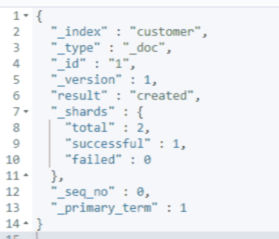

参考： https://pdai.tech/md/db/nosql-es/elasticsearch-x-usage.html

## 相关基本概念

elasticsearch (集群)中可以包含多个索引 (数据库)，每个索引中可以包含多个类型 (表)，每个类型下又包含多个文档 (行)，每个文档中又包含多个字段 (列)

### 索引

索引是映射类型的容器，elasticsearch 中的索引是一个非常大的文档集合。索引存储了映射类型的字段和其他设置。然后它们被存储到了各个分片上了。我们来研究下分片是如何工作的。

#### 物理设计 ：节点和分片如何工作

一个集群至少有一个节点，而一个节点就是一个 elasricsearch 进程，节点可以有多个索引默认的，如果你创建索引，那么索引将会有个5个分片 ( primary shard ,又称主分片 ) 构成的，每一个主分片会有一个副本 ( replica shard ,又称复制分片 )


### 类型

类型是文档的逻辑容器，就像关系型数据库一样，表格是行的容器。类型中对于字段的定义称为映射，比如 name 映射为字符串类型。我们说文档是无模式的，它们不需要拥有映射中所定义的所有字段，比如新增一个字段，那么 elasticsearch 是怎么做的呢? elasticsearch 会自动的将新字段加入映射，但是这个字段的不确定它是什么类型，elasticsearch 就开始猜，如果这个值是18，那么 elasticsearch 会认为它是整形。但是 elasticsearch 也可能猜不对，所以最安全的方式就是提前定义好所需要的映射，这点跟关系型数据库殊途同归了，先定义好字段，然后再使用。

注意，`7.x` 版本后已经被取消了，以前每个索引下可以有不同的类型，每个类型可以有自己独立的文档结构。但是现在每个索引下面只有一种类型，也就是 `_doc`，每个索引下的文档结构都是相同的。

### 文档

之前说 elasticsearch 是面向文档的，那么就意味着索引和搜索数据的最小单位是文档，elasticsearch 中，文档有几个 **重要属性** :

- 自我包含，一篇文档同时包含字段和对应的值，也就是同时包含 key:value！
- 可以是层次型的，一个文档中包含自文档，复杂的逻辑实体就是这么来的！其实就是个JSON对象
- 灵活的结构，文档不依赖预先定义的模式，我们知道关系型数据库中，要提前定义字段才能使用，在 elasticsearch 中，对于字段是非常灵活的，有时候，我们可以忽略该字段，或者动态的添加一个新的字段。

尽管我们可以随意的新增或者忽略某个字段，但是，每个字段的类型非常重要，比如一个年龄字段类型，可以是字符串也可以是整形。因为 elasticsearch 会保存字段和类型之间的映射及其他的设置。这种映射具体到每个映射的每种类型，这也是为什么在 elasticsearch 中，类型有时候也称为**映射类型**。

## 基本操作

索引一个文档
```json
put /external_user/_doc/1
{
  "name":"joy"
}
```

可以看到响应


查询次索引
```json
get /external_user/_doc/1
```

响应
```json
{
  "_index": "external_user",
  "_id": "1",
  "_version": 1,
  "_seq_no": 0,
  "_primary_term": 1,
  "found": true,
  "_source": {
    "name": "joy"
  }
}
```


**下载测试数据**

地址： https://github.com/elastic/elasticsearch.git
直接 clone 下来，然后切换到对应分支，数据保存在 `docs/src/test/resources/accounts.json`


然后执行

```sh
curl -H "Content-Type: application/json" -XPOST "localhost:9200/bank/_bulk?pretty&refresh" --data-binary "~/study/docker-work/es_data/elasticsearch/docs/src/test/resources/accounts.json"
```


