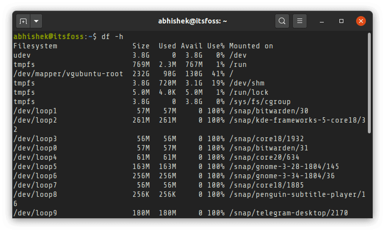
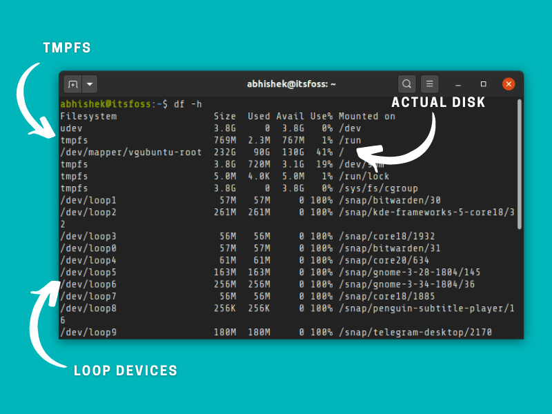
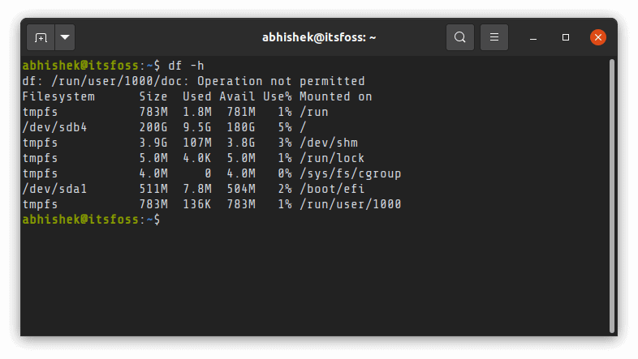
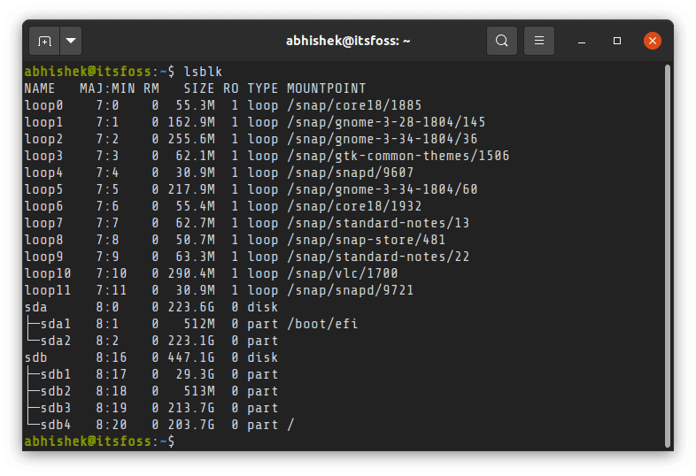

```toc

```

摘自： https://linux.cn/article-12831-1.html

## API

### df

`df` 以磁盘分区为单位查看文件系统，可以获取硬盘被占用了多少空间，目前还剩下多少空间等信息。

例如，我们使用 `df -h` 命令来查看磁盘信息， `-h` 选项为根据大小适当显示：


显示内容参数说明：

-   **`Filesystem`**：文件系统
-   **`Size `**： 分区大小
-   **`Used`**： 已使用容量
-   **`Avail `**： 还可以使用的容量
-   **`Use% `**： 已用百分比
-   **`Mounted on`**： 挂载点　

**相关命令：**

-   `df -hl`：查看磁盘剩余空间
-   `df -h`：查看每个根路径的分区大小
-   `du -sh [目录名]`：返回该目录的大小
-   `du -sm [文件夹] `：返回该文件夹总 `M` 数
-   `du -h [目录名]`：查看指定文件夹下的所有文件大小（包含子文件夹）

---

### du

**`du`** 的英文原义为 **`disk usage`**，含义为显示磁盘空间的使用情况，用于查看当前目录的总大小。

例如查看当前目录的大小：

```sh
du -sh
605M   .
```

显示指定文件所占空间：

```sh
du log2012.log 
300     log2012.log
```

方便阅读的格式显示 `test` 目录所占空间情况：

```sh
du -h test
608K    test/test6
308K    test/test4
4.0K    test/scf/lib
4.0K    test/scf/service/deploy/product
4.0K    test/scf/service/deploy/info
12K     test/scf/service/deploy
16K     test/scf/service
4.0K    test/scf/doc
4.0K    test/scf/bin
32K     test/scf
8.0K    test/test3
1.3M    test
```

`du` 命令用于查看当前目录的总大小：

-   `-s`：对每个 `Names` 参数只给出占用的数据块总数。
-   `-a`：递归地显示指定目录中各文件及子目录中各文件占用的数据块数。若既不指定 `-s`，也不指定 `-a`，则只显示 `Names` 中的每一个目录及其中的各子目录所占的磁盘块数。
-   `-b`：以字节为单位列出磁盘空间使用情况（系统默认以 `k` 字节为单位）。
-   `-k`：以 `1024` 字节为单位列出磁盘空间使用情况。
-   `-c`：最后再加上一个总计（系统默认设置）。
-   `-l`：计算所有的文件大小，对硬链接文件，则计算多次。
-   `-x`：跳过在不同文件系统上的目录不予统计。
-   `-h`：以 `K，M，G` 为单位，提高信息的可读性。


## 查看磁盘空间

这里是针对我 `Dell XPS` 系统的 ` df ` 命令的输出，它使用了加密磁盘并且只安装了 `Linux`：



当你使用 `df` 命令来检查磁盘空间时，它将显示一组“文件系统”，包括它们的大小、使用的空间和可用的空间。你实际的磁盘通常应该下面列表中的一个:

-   `/dev/sda`
-   `/dev/sdb`
-   `/dev/nvme0n1p`

这不是硬性的标准，但是它可以给予你一个指示，它可以让你能够很容易地从一堆文字中辨别出真正的磁盘。

你的 `Linux` 系统在你的磁盘上可能有一些用于引导分区、`EFI` 分区、根分区、交换分区、家目录等的分区。在这种情况下，这些分区在“磁盘名称”的结尾处使用一个数字来标示，像 ` /dev/sda1 `、` /dev/nvme0n1p2 ` 等等。

你可以从它们的挂载点来辨认出哪个分区是用于做什么的。根分区挂载在 `/`、`EFI` 分区在 ` /boot/EFI ` 等等。

就我的情况来说，我已经使用了根分区下磁盘空间 `（232 GB）的 41%` 。如果你有 2 到 3 个大分区（像根分区、家目录分区等等），你将不得不在这里计算一下已使用的磁盘空间。



_理解 `df` 命令输出_

-   `tmpfs`：[tmpfs](https://www.kernel.org/doc/html/latest/filesystems/tmpfs.html)（临时文件系统）用于在虚拟存储器中保持文件。你可以随意地忽略这个虚拟文件系统。
-   `udev`：[udev 文件系统](https://wiki.debian.org/udev) 用于存储插入到你系统的设备（像 USB、网卡、CD ROM 等等）的相关信息。你也可以忽略它。
-   `/dev/loop`: 它们是环回设备。由于 snap 应用程序，在 Ubuntu 中查看磁盘时，你将看到很多的这样的设备。环回设备是虚拟设备，它们允许普通文件作为块设备文件来访问。使用环回设备，snap 应用程序在它们自己的虚拟磁盘中进行沙盒处理。尽管它们是在根分区下，但是你不需要单独计算它们使用的磁盘空间。

## 丢失了磁盘空间？检查你是否挂载了所有是磁盘和分区

记住，`df` 命令仅显示已挂载文件系统的磁盘空间。如果你在同一块磁盘上使用多个 Linux 发行版（或者多个操作系统），或者在你的系统上有多个磁盘，你需要先挂载它们，以便查看在这些分区和磁盘上的可用磁盘空间。

例如，我的 [Intel NUC](https://itsfoss.com/install-linux-on-intel-nuc/) 有两个 `SSD` 磁盘，并且在其上有 4 个或 5 个 Linux 分区。仅当我明确地挂载它们时，` df ` 命令才会显示更多磁盘。



你可以使用 `lsblk` 命令来查看在你系统上的所有磁盘和分区。



在你有了磁盘分区名称后，你可以用这种方式来挂载它:

1.  `sudo mount /dev/sdb2 /mnt`

