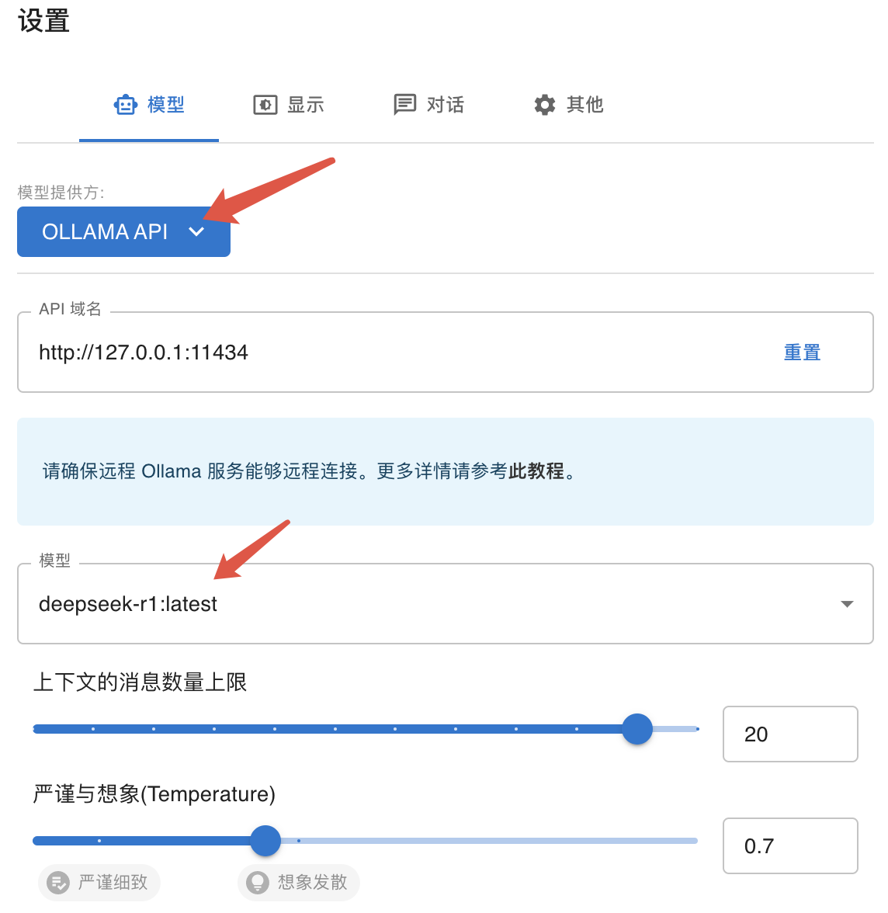

```toc
```

## 安装 ollama

地址：`https://ollama.com/download`

然后下载运行

```sh
# 默认是7b
ollama run deepseek-r1
```


## 安装 chatbox

因为安装 deepseek 之后只能在命令行，这个工具可以提供界面。



安装好之后按照上面的设置配置。


## Idea 中接入

安装 codeGPT 插件然后进行设置即可