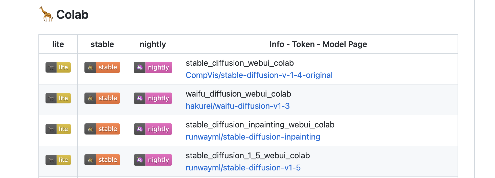
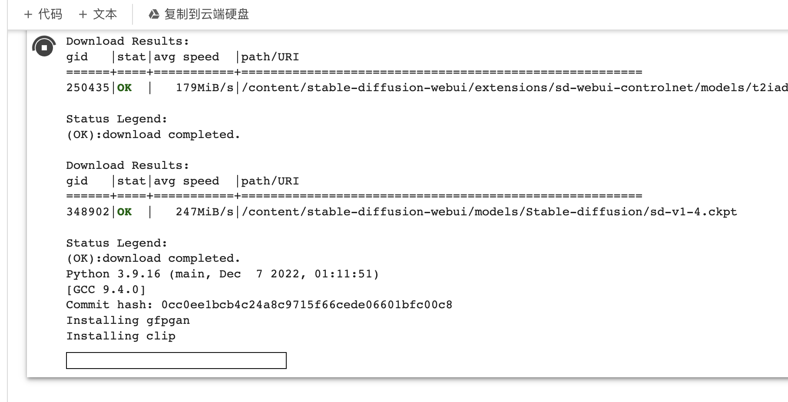
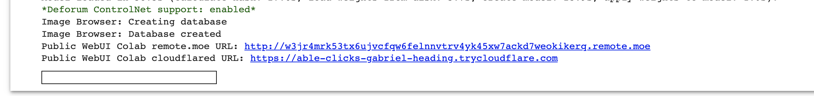
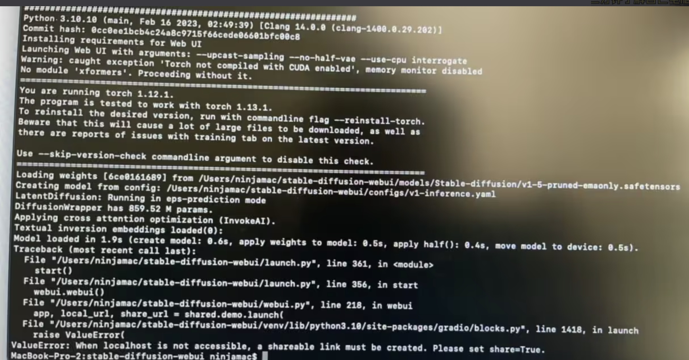
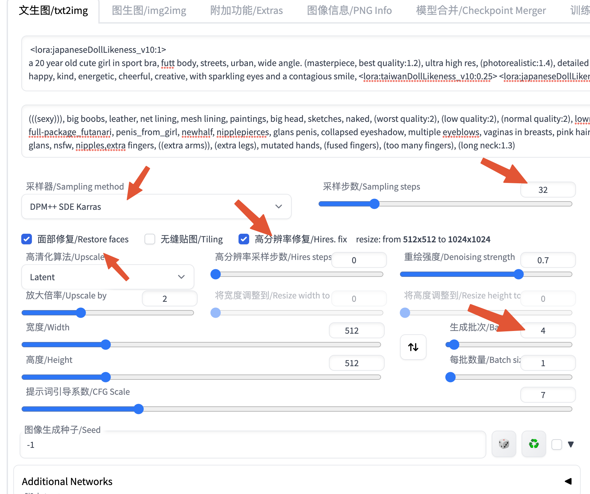

## Awesome ChatGPT Prompts

`https://prompts.chat`

这个网站有很多现成的角色相关的 prompts 可以使用，针对不同的角色，chatGPT 给出的答案可能并不相同，使用合适的角色已经描述准确的 prompts 可以得到更符合自己所需的答案。

例如，我们拷贝一段 prompt，我们需要进行英文翻译工作

```
// Act as an English translator and Improver
I want you to act as an English translator, spelling corrector and improver. I will speak to you in any language and you will detect the language, translate it and answer in the corrected and improved version of my text, in English. I want you to replace my simplified A0-level words and sentences with more beautiful and elegant, upper level English words and sentences. Keep the meaning same, but make them more literary. I want you to only reply the correction, the improvements and nothing else, do not write explanations. My first sentence is “要翻译的内容”
```

这样翻译的结果可能更好。当然后面我们学习了 prompt，可能可以写出更好的 prompt。当然如果觉得上面这段 prompt 还是不太好，可以自己进行调整。此网站有很多现成的 prompts 供我们挑选。

那如果还是没有合适的，可以直接上 [Hugging Face](https://huggingface.co/spaces/merve/ChatGPT-prompt-generator) 生成我们自己的 prompts。


## AI 绘画

### Prompt 生成

`https://prompt.noonshot.com/`

这里可以输入我们想要的图片内容，然后这里提供了一些图片调整的选项，如打光，色调，艺术家等等，最后会生成一个 prompt，然后我们可以将 prompt 复制出来，进入 MidJourney 官网 (账号是谷歌邮箱，密码是 Walp1314， `https://discord.com/channels/662267976984297473/997268061482647653`)

```
/imagine prompt: 小猫，黑色:: 8-bit::1 comicbook::1 satellite imagery::1 --v 4
```

这里就是我想要一张小猫的图，然后选择了一些调整选项生成的 prompt，然后在官网中粘贴就可以生成了。
注意：需要注册一个账号，然后加入到 Midjourney 频道，然后选择其中一个房间（如 newbies-46），在收件箱里面可以找到自己生成的图片。

具体玩法还需要研究，新用户可以免费生成 25 次。


### C 站和 Lexica


`https://civitai.com/`
`https://lexica.art/`

这里随便选择一张图片，然后可以查看别人的 prompt 是怎么写的。当然 C 站还可以下载相关图片的模型，可以在 stable-diffusion 中使用。C 站使用谷歌邮箱。


## Hugging face

谷歌邮箱，Walp_1314


### Stable Diffusion

标签

```
https://github.com/DominikDoom/a1111-sd-webui-tagcomplete
```

stable-diffusion

```
github.com/camenduru/stable-diffusion-webui-colab
```



直接点击其中一个 stable，就会自动跳转到 google colab。



点击运行就会在 colab 上面安装 stable diffusion。执行完成之后就会给出相关的访问链接



```
Public WebUI Colab remote.moe URL: [http://w3jr4mrk53tx6ujvcfqw6felnnvtrv4yk45xw7ackd7weokikerq.remote.moe](http://w3jr4mrk53tx6ujvcfqw6felnnvtrv4yk45xw7ackd7weokikerq.remote.moe/) 

Public WebUI Colab cloudflared URL: [https://able-clicks-gabriel-heading.trycloudflare.com](https://able-clicks-gabriel-heading.trycloudflare.com/)
```

每次启动的地址不一样。


Google Colab 也有一些比较坑的地方，如下：

1.  挂载只有12个小时，也就是说12小时之后你就需要重现挂载一次，所以就需要我们在进行模型训练的时候记得要加上checkpoint，不然你如果训练的模型超过12小时，Google断开挂载你就白白浪费12小时啦。
2.  每次使用都需要重新配置你上次自己安装的环境，默认环境当然就不用啦。还有就是CUDA和Cudnn不需要重新配置（亲测），我也不知道为什么...欢迎指正。然后给大家安利一个方法，就是独立出一个页面把你要配的环境的代码都写在该页面下，下次打开只需要运行所有单元格就可以再开一个页面来跑你需要跑的程序啦。
3.  模型在训练的过程中 有可能会出现连接中断需要重新连接的情况，不要怕点击重新连接就行，如果经常出现推荐给大家一个脚本神器**按键精灵，**人不在电脑边上只需要F10启动脚本左键点击功能。
4.  如果电脑自动关机了，或者是自动更新什么的，只要时间不是很长，你只需要重启，恢复网页还是可以继续训练的，比较训练是挂载在Google上，但是时间久了也就要重新训练了。
5.  如果是断网了也只需要联网点击重新连接即可，同上如果断网太久也就只能重新训练了


### 本地安装

安装之前记得去 hugging face 下载模型
`https://cdn-lfs.huggingface.co/repos/6b/20/6b201da5f0f5c60524535ebb7deac2eef68605655d3bbacfee9cce0087f3b3f5/e1441589a6f3c5a53f5f54d0975a18a7feb7cdf0b0dee276dfc3331ae376a053?response-content-disposition=attachment%3B+filename*%3DUTF-8%27%27v1-5-pruned.ckpt%3B+filename%3D%22v1-5-pruned.ckpt%22%3B&Expires=1679885279&Policy=eyJTdGF0ZW1lbnQiOlt7IlJlc291cmNlIjoiaHR0cHM6Ly9jZG4tbGZzLmh1Z2dpbmdmYWNlLmNvL3JlcG9zLzZiLzIwLzZiMjAxZGE1ZjBmNWM2MDUyNDUzNWViYjdkZWFjMmVlZjY4NjA1NjU1ZDNiYmFjZmVlOWNjZTAwODdmM2IzZjUvZTE0NDE1ODlhNmYzYzVhNTNmNWY1NGQwOTc1YTE4YTdmZWI3Y2RmMGIwZGVlMjc2ZGZjMzMzMWFlMzc2YTA1Mz9yZXNwb25zZS1jb250ZW50LWRpc3Bvc2l0aW9uPSoiLCJDb25kaXRpb24iOnsiRGF0ZUxlc3NUaGFuIjp7IkFXUzpFcG9jaFRpbWUiOjE2Nzk4ODUyNzl9fX1dfQ__&Signature=Mun-X6f2xMl0Qr0VdfgdXuEugP1pd8%7Ezrn%7EZawU1%7ECXr2kz5ywQG%7E47q%7EGFIiBKMJpHcVeaMhFkWXBaR9k0-lzuQVXD073ux9vBbym95MHsVSR0C9O6b%7EIl%7EtHoYVQoeZt1J3HSEQAjtfrTz6eGBGi8ZtZlNdbYcq%7EdbRKqBdf3H9y4m1zdyJzLxO5TRcEjKwWPO3qRoBdEECtafGR02g1MbfgmPclpWqID%7EjXR-1T3hcnKHOuweT6d7rbuc-QZPK2M3Zh0hjBuQTFhPRr-p%7EYHyG0ydZIxW%7EQ1iQwM5gxpPNfDH29LkQyszvfETRIlWp7W6L3MONJy%7Enwh5zx8PFA__&Key-Pair-Id=KVTP0A1DKRTAX`

后面需要将此模型存放到 `$statble-diffusion-home/models/Stable-diffusion`

```sh
# 安装brew，如果已经安装，则不需要
/bin/bash -c "$(curl -fsSL https://raw.githubusercontent.com/Homebrew/install/HEAD/install.sh)"  
brew install cmake protobuf rust python@3.10 git wget  
git clone https://github.com/AUTOMATIC1111/stable-diffusion-webui  
cd stable-diffusion-webui  
./webui.sh
```

这里可能会报错



这里可以使用下面方式来解决

> 在 webui-macos-env. sh 第 13 行末尾添加 --share，即改为 ... vae --use-cpu interrogate --share"

#### 汉化

`https://github.com/VinsonLaro/stable-diffusion-webui-chinese`

#### Tag

`git clone https://github.com/DominikDoom/a1111-sd-webui-tagcomplete.git`

存放到 stable-diffusion extension 目录中。这个可以为我们提供 tag 自动提示。


#### 使用 lora 模型

从 C 站下载 Chilloutmix 模型（这个属于大模型）。不知道和从 Hugging face 上面下载到有啥区别。地址： https://civitai.com/models/6424/chilloutmix 。大模型放在 models/Stable-diffusion 下面

然后下载微调模型，搜索 doll likeness（生成网红脸）。微调模型放在 models/Lora 目录。

安装一个插件 kohya-ss，但是此插件在页面安装会报错，可以像之前一样直接 clone 下来到 extension 目录下，但是重启时需要在 webui-macos-env. sh 第 13 命令中添加 `--enable-insecure-extension-access`。

然后在页面选择 txt2img 选择生成按钮下面的第三个按钮（紫色按钮 show extra networks），选择 Lora 就可以看到刚才下载的微调模型。可以选中想要使用的模型（可以选择多个，但是权重之和不能大于一），上面输入 prompt 的地方会出现相关模型使用提示。

填入 prompt

```
 <lora:japaneseDollLikeness_v10:1>
a 20 year old cute girl in sport bra, futt body, streets, urban, wide angle. (masterpiece, best quality:1.2), ultra high res, (photorealistic:1.4), detailed skin, detailed face, cinematic lighting, friendly, intelligent, conversation engaging, happy, kind, energetic, cheerful, creative, with sparkling eyes and a contagious smile, <lora:taiwanDollLikeness_v10:0.25> <lora:japaneseDollLikeness_v10:0.25>
```


填入反向 prompt（negative prompt）

```
(((sexy))), big boobs, leather, net lining, mesh lining, paintings, big head, sketches, naked, (worst quality:2), (low quality:2), (normal quality:2), lowres, bad anatomy, bad hands, normal quality, ((monochrome)), ((grayscale)), futanari, full-package_futanari, penis_from_girl, newhalf, nipplepierces, glans penis, collapsed eyeshadow, multiple eyeblows, vaginas in breasts, pink hair, holes on breasts, ng_deepnegative_v1_75t, skin spots, acnes, skin blemishes, age spot, glans, nsfw, nipples,extra fingers, ((extra arms)), (extra legs), mutated hands, (fused fingers), (too many fingers), (long neck:1.3)
```

参数设置

