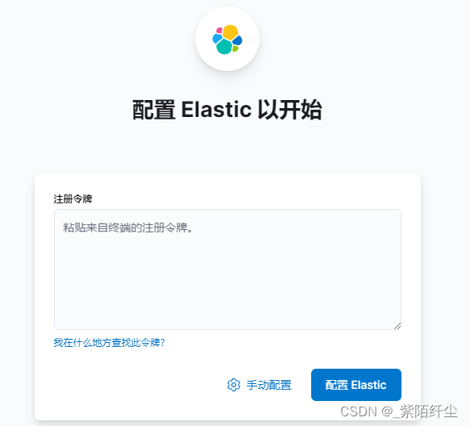
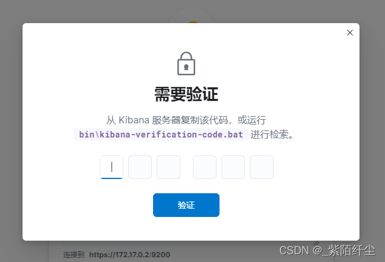

## Elastic

这里先创建一个临时容器，获取相关默认配置

```bash
docker pull docker.elastic.co/elasticsearch/elasticsearch:8.7.1


## single-node表示单节点启动
docker run -d --name myes -p 9200:9200 -e "discovery.type=single-node" -e ES_JAVA_OPTS="-Xms256m -Xmx256m" docker.elastic.co/elasticsearch/elasticsearch:8.7.1
```

创建相关配置目录

```bash
╭─░▒▓ ~/study/docker-work/myes 
╰─ mkdir -p {config,data,logs,plugins}                                                     
╭─░▒▓ ~/study/docker-work/myes 
╰─ ls                                                         
config  data    logs    plugins
╭─░▒▓ ~/study/docker-work/myes 
╰─ pwd   
/Users/YJ/study/docker-work/myes
```

将相关配置拷贝出来

```bash
╭─░▒▓ ~/study/docker-work/myes 
╰─ ls                                                     
config  data    logs    plugins

docker cp myes:/usr/share/elasticsearch/config .
docker cp myes:/usr/share/elasticsearch/logs .
docker cp myes:/usr/share/elasticsearch/data .
docker cp myes:/usr/share/elasticsearch/plugins .
```

修改配置文件

```bash
vim config/elasticsearch.yml
```

**添加如下代码**

```bash
# 跨域
http.cors.allow-origin: "*"
http.cors.enabled: true
http.cors.allow-headers: Authorization,X-Requested-With,Content-Length,Content-Type
```

删除临时创建的容器

```bash
docker stop myes
docker rm myes
```

重新创建并启动容器

```bash
docker run -d --name myes \
-p 9200:9200 \
-p 9300:9300 \
-e "discovery.type=single-node" \
-e ES_JAVA_OPTS="-Xms256m -Xmx256m" \
-v /Users/YJ/study/docker-work/myes/logs:/usr/share/elasticsearch/logs \
-v /Users/YJ/study/docker-work/myes/data:/usr/share/elasticsearch/data \
-v /Users/YJ/study/docker-work/myes/plugins:/usr/share/elasticsearch/plugins \
-v /Users/YJ/study/docker-work/myes/config:/usr/share/elasticsearch/config \
docker.elastic.co/elasticsearch/elasticsearch:8.7.1
```

连接测试

```
https://localhost:9200
```


```json
{
    "name": "53ce597962b4",
    "cluster_name": "docker-cluster",
    "cluster_uuid": "FkNbqH1kRWmGkOi9SI8BqA",
    "version": {
        "number": "8.7.1",
        "build_flavor": "default",
        "build_type": "docker",
        "build_hash": "f229ed3f893a515d590d0f39b05f68913e2d9b53",
        "build_date": "2023-04-27T04:33:42.127815583Z",
        "build_snapshot": false,
        "lucene_version": "9.5.0",
        "minimum_wire_compatibility_version": "7.17.0",
        "minimum_index_compatibility_version": "7.0.0"
    },
    "tagline": "You Know, for Search"
}
```


但是在 8 以上版本需要设置用户名密码。这里进入到容器中进行设置

```bash
docker exec -it myes /bin/bash
# interactive表示交互式设置密码
bin/elasticsearch-setup-passwords interactive
```

当前已经为所有默认用户设置了密码，都是和对应的用户名一样 (elastic/elatic)。


## Kibana

```bash
docker pull docker.elastic.co/kibana/kibana:8.7.1
```

创建容器

```bash
# 临时容器
docker run -d --name mykibana -p 5601:5601 docker.elastic.co/kibana/kibana:8.7.1
# 挂载配置
docker run -d --name mykibana -p 5601:5601 \
-v /Users/YJ/study/docker-work/mykibana/config:/usr/share/kibana/config \
docker.elastic.co/kibana/kibana:8.7.1
```

然后登陆

```bash
https://localhost:5601
```

此时这里需要填入令牌



这个需要进入 es 容器中生成

```bash
docker exec -it myes /bin/bash
bin/elasticsearch-create-enrollment-token --scope kibana
```

```
eyJ2ZXIiOiI4LjcuMSIsImFkciI6WyIxNzIuMTcuMC40OjkyMDAiXSwiZmdyIjoiMGM5ODc1Yzc1YzMyMjMwMWJhZGJiMTJjYjE1YjJhMmM3NGNhOTk2NTNkMTU5MWYwZjZjNmRiZGE2YmU5N2JiMiIsImtleSI6ImNXcDRKNGdCMC04aUFGVG01X1NLOjc2Q0NSMVJBUjRhR1JGdURkYlBmZncifQ==
```

将令牌填入，然后点击"配置 Elastic"。这里会需要填入动态码。



动态码需要进入到 kibana 容器中生成

```bash
docker exec -it mykibana /bin/bash
bin/kibana-verification-code
```
将生成的动态码填入之后就进入到了登陆界面，填入账号密码

```bash
elastic
elastic
```

