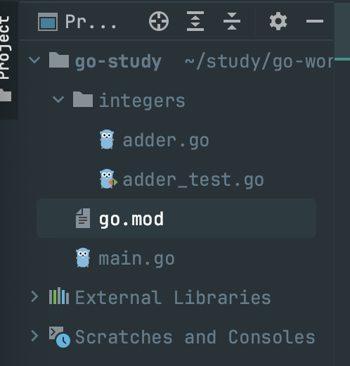

```toc
```

参考：`https://studygolang.gitbook.io/learn-go-with-tests`

新建基本工程 `go-study`。目录结构




## 基本测试

`adder.go`
```go
package integers  
  
func Add(x, y int) int {  
    return x + y  
}
```

`adder_test.go`
```go
package integers  
  
import (  
    "fmt"  
    "testing")  
  
func TestAdder(t *testing.T) {  
    sum := Add(2, 2)  
    expected := 4  
  
    if sum != expected {  
        t.Errorf("expected '%d' but got '%d'", expected, sum)  
    }}  
  
func ExampleAdd() {  
    sum := Add(1, 5)  
    fmt.Println(sum)  
    // Output: 6  
}
```

当然可以直接在 `goland` 中运行。下面看下如何在命令行中运行

```sh
go test        这里找不到测试文件                                                                                   
?       go-study        [no test files]
╭─░▒▓ ~/study/go-work/go-study 运行integers包下面的所有测试类
╰─ go test integers/*                                                                                
ok      command-line-arguments  0.096s
╭─░▒▓ ~/study/go-work/go-study
╰─ go test integers/* -v                                                                             
=== RUN   TestAdder
--- PASS: TestAdder (0.00s)
=== RUN   ExampleAdd
--- PASS: ExampleAdd (0.00s)
PASS
ok      command-line-arguments  0.099s
╭─░▒▓ ~/study/go-work/go-study 
╰─ go test ./... -v       运行工程下面的所有测试类                                                                           
?       go-study        [no test files]
=== RUN   TestAdder
--- PASS: TestAdder (0.00s)
=== RUN   ExampleAdd
--- PASS: ExampleAdd (0.00s)
PASS
ok      go-study/integers       0.289s
```

当然还可以测试整个工程

```sh
go test go-study
```

但是如果只想测试某一个测试类时

```sh
// 这里会报错，找不到相关函数
go test integers/adder_test.go
# command-line-arguments [command-line-arguments.test]
integers/adder_test.go:9:12: undefined: Add
integers/adder_test.go:18:12: undefined: Add
FAIL    command-line-arguments [build failed]
FAIL

// 正确做法
go test integers/adder_test.go integers/adder.go -v
```

最后一个使用 `-o xx.test` 指定输出到一个测试文件 `xx.test` 中。同时如果我只想运行测试类中的其中一个测试方法时可以这样

```sh
╭─░▒▓ ~/study/go-work/go-study
╰─ go test slice/* -run TestSum -v                                                                   
=== RUN   TestSum
=== RUN   TestSum/collection_of_5_numbers
=== RUN   TestSum/collection_of_any_numbers
--- PASS: TestSum (0.00s)
    --- PASS: TestSum/collection_of_5_numbers (0.00s)
    --- PASS: TestSum/collection_of_any_numbers (0.00s)
=== RUN   TestSumAll
--- PASS: TestSumAll (0.00s)
PASS
ok      command-line-arguments  3.027s
```


## 基准测试

`iteration/repeat.go`
```go
package iteration  
  
func Repeat(ch string, times int) string {  
   var repeated string  
   for i := 0; i < times; i++ {  
      repeated += ch  
   }  
   return repeated  
}
```

`iteration/repeat_test.go`
```go
package iteration  
  
import "testing"  
  
func TestRepeat(t *testing.T) {  
   repeated := Repeat("a", 4)  
   expected := "aaaa"  
  
   if repeated != expected {  
      t.Errorf("expected: '%q' but got '%q'", expected, repeated)  
   }}  
  
func BenchmarkRepeat(b *testing.B) {  
   for i := 0; i < b.N; i++ {  
      Repeat("a", 1)  
   }}
```

基准测试中，代码会运行 `b.N` 次，并测量需要多长时间。代码运行的次数不会对你产生影响，测试框架会选择一个它所认为的最佳值，以便让你获得更合理的结果。

```sh
# 这里-bench指定基准测试函数，点号匹配所有基准测试函数
go test iteration/* -bench=.

# 只测试某个基准测试函数
go test iteration/* -bench=Repeat

goos: darwin
goarch: amd64
cpu: Intel(R) Core(TM) i9-9880H CPU @ 2.30GHz
BenchmarkRepeat-16      180308702                6.476 ns/op
PASS
ok      command-line-arguments  1.941s

# 运行工程中所有的基准测试
go test go-study/... -bench=.
# 或者
go test ./... -bench=.
```


## 覆盖率测试

`slice/sum.go`
```go
package slice  
  
func Sum(arr []int) int {  
   sum := 0  
   // 忽略索引  
   for _, num := range arr {  
      sum += num  
   }  
   return sum  
}  
  
func SumAll(arr ...[]int) (sums []int) {  
   len := len(arr)  
   sums = make([]int, len)  
   for i, nums := range arr {  
      sums[i] = Sum(nums)  
   }   return  
}
```

`slice/sum_test.go`
```go
package slice  
  
import (  
   "reflect"  
   "testing")  
  
func TestSum(t *testing.T) {  
   t.Run("collection of 5 numbers", func(t *testing.T) {  
  
      numbers := []int{1, 2, 3, 4, 5}  
      got := Sum(numbers)  
      want := 15  
  
      if want != got {  
         t.Errorf("got %d want %d given, %v", got, want, numbers)  
      }   })  
   t.Run("collection of any numbers", func(t *testing.T) {  
  
      numbers := []int{1, 2, 3}  
      got := Sum(numbers)  
      want := 6  
  
      if want != got {  
         t.Errorf("got %d want %d given, %v", got, want, numbers)  
      }   })}  
  
func TestSumAll(t *testing.T) {  
  
   got := SumAll([]int{1, 2}, []int{0, 9})  
   want := []int{3, 9}  
  
   if !reflect.DeepEqual(got, want) {  
      t.Errorf("got %v want %v", got, want)  
   }}
```

测试
```sh
go test slice/* -cover -v   

=== RUN   TestSum
=== RUN   TestSum/collection_of_5_numbers
=== RUN   TestSum/collection_of_any_numbers
--- PASS: TestSum (0.00s)
    --- PASS: TestSum/collection_of_5_numbers (0.00s)
    --- PASS: TestSum/collection_of_any_numbers (0.00s)
=== RUN   TestSumAll
--- PASS: TestSumAll (0.00s)
PASS
        command-line-arguments  coverage: 100.0% of statements
ok      command-line-arguments  0.363s  coverage: 100.0% of statements
```


## 结构体，方法和接口使用测试

这里首先定义一个矩形以及计算其周长和面积的方法

`_struct/shapes.go`
```go
package _struct  
  
type Rectangle struct {  
   Width  float64  
   Height float64  
}  
  
func Perimeter(r Rectangle) float64 {  
   return 2 * (r.Width + r.Height)  
}  
  
func Area(r Rectangle) float64 {  
   return r.Width * r.Height  
}
```

测试函数
`_struct/shapes_test.go`
```go
package _struct  
  
import "testing"  
  
func TestPerimeter(t *testing.T) {  
   got := Perimeter(Rectangle{10.0, 10.0})  
   want := 40.0  
  
   if got != want {  
      t.Errorf("got %.2f want %.2f", got, want)  
   }
}  
  
func TestArea(t *testing.T) {  
   got := Area(Rectangle{2.0, 10.0})  
   want := 20.0  
   if got != want {  
      t.Errorf("got %.2f want %.2f", got, want)  
   }
}
```

但是如果我们再加一个形状，比如圆形。那么应该如何定义以及测试呢？
如果按照 `java` 的方式，肯定是实现如下方法即可。
```go
func Perimeter(c Cicle) float64 {  
   return 0
}  
  
func Area(c Cicle) float64 {  
   return 0
}
```

但是在 golang 不能这么做，而是需要指定方法针对的类型

`_struct1/shapes.go`
```go
package _struct1
  
import "math"  
  
type Rectangle struct {  
   Width  float64  
   Height float64  
}  
  
type Circle struct {  
   Radius float64  
}  
  
func (r Rectangle) Perimeter() float64 {  
   return 2 * (r.Width + r.Height)  
}  
  
func (r Rectangle) Area() float64 {  
   return r.Width * r.Height  
}  
  
func (c Circle) Perimeter() float64 {  
   return 2 * math.Pi * c.Radius  
}  
  
func (c Circle) Area() float64 {  
   return c.Radius * c.Radius * math.Pi  
}
```

`_struct1/shapes_test.go`
```go
package _struct1
  
import "testing"  
  
func TestArea(t *testing.T) {  
  
   t.Run("rectangles", func(t *testing.T) {  
      rectangle := Rectangle{12, 6}  
      got := rectangle.Area()  
      want := 72.0  
  
      if got != want {  
         t.Errorf("got %.2f want %.2f", got, want)  
      }   
    })  
   t.Run("circles", func(t *testing.T) {  
      circle := Circle{10}  
      got := circle.Area()  
      want := 314.1592653589793  
  
      if got != want {  
         t.Errorf("got %f want %f", got, want)  
      }   
    })  
}
```

有点冗余，可以重构一下 (可以重新弄一个包)

`_struct2/shapes.go`
```go
// 增加一个形状的接口

type Shape interface {  
   Area() float64  
}
```

这里由于之前定义的两个形状都实现了 Area 方法，那么就默认实现了 Shape 这个接口了。

`_struct2/shapes_test.go`
```go
package _struct2  
  
import "testing"  
  
func TestArea(t *testing.T) {  
  
   checkArea := func(t *testing.T, shape Shape, want float64) {  
      t.Helper()  
      got := shape.Area()  
      if got != want {  
         t.Errorf("got %.2f want %.2f", got, want)  
      }   
    }  
   t.Run("rectangles", func(t *testing.T) {  
      rectangle := Rectangle{12, 6}  
      checkArea(t, rectangle, 72.0)  
   })  
   t.Run("circles", func(t *testing.T) {  
      circle := Circle{10}  
      checkArea(t, circle, 314.1592653589793)  
   })  
}
```

注意：这里 `t.Helper` 方法主要是为了测试过程中，详细描述出错信息的，比如这里有两个测试都调用了 `checkArea` 方法，如果测试过多，某一个出现错误，此时能拿到详细的错误信息会比较好。

这里增加了一个形状检测的方法，以此进行了一个简单重构。但是这种一个一个测试方法写，还是挺麻烦了，这里引入表格驱动测试，`shapes.go` 不变，下面看测试方法

`_struct2/shapes_test.go`
```go
package _struct2  
  
import (  
   "testing"  
)  
  
func TestPerimeter(t *testing.T) {  
   got := Rectangle{10.0, 10.0}.Perimeter()  
   want := 40.0  
  
   if got != want {  
      t.Errorf("got %.2f want %.2f", got, want)  
   }}  
  
func TestArea(t *testing.T) {  
   areaTests := []struct {  
      sharp Shape  
      want  float64  
   }{  
      {Rectangle{12, 6}, 72.0},  
      {sharp: Circle{10}, want: 314.1592653589793},  
   }  
   for _, tt := range areaTests {  
      got := tt.sharp.Area()  
      if got != tt.want {  
         t.Errorf("got %.2f want %.2f", got, tt.want)  
      }   }}
```
可以看到这里定义了一个匿名的结构体，包含形状和期望值。但是这里还是有一个问题，就是如果需要测试的形状特别多的时候，其中一个如果出现错误，比如某个形状没有定义

```
./shapes_test.go:25:4: undefined: Triangle./shapes_test.go:25:4: undefined: Triangle
```
这种错误在测试用例较多的时候根本无法分辨到底是哪个地方出错了。为了更好的测试，可以再次重构

```go
func TestArea(t *testing.T) {  
   areaTests := []struct {  
      name    string  
      sharp   Shape  
      hasArea float64  
   }{  
      {"Rectangle", Rectangle{12, 6}, 72.0},  
      {name: "Circle", sharp: Circle{10}, hasArea: 314.1592653589793},  
   }  
   for _, tt := range areaTests {  
      t.Run(tt.name, func(t *testing.T) {  
         got := tt.sharp.Area()  
         if got != tt.hasArea {  
            t.Errorf("%#v got %.2f want %.2f", tt.sharp, got, tt.hasArea)  
         }      
    })   
}}
```

这里表格中推荐第二种写法，更为清晰。如果出现错误，使用 `%#v` 可以查看对象属性具体的值，同时还可以使用名字进行测试

```sh
╭─░▒▓ ~/study/go-work/go-study 
╰─ go test _struct2/* -run TestArea/Circle -v                                 
=== RUN   TestArea
=== RUN   TestArea/Circle
--- PASS: TestArea (0.00s)
    --- PASS: TestArea/Circle (0.00s)
PASS
ok      command-line-arguments  0.095s
```

## 指针

这里已比特币的一般账户管理为例

`point/wallet.go`
```go
// 钱包
package point  
  
type Wallet struct {
	// 在 Go 中，如果一个符号
	//（例如变量、类型、函数等）是以小写符号开头，那么它在 _定义它的包之外_ 就是私有的。
    balance int  
}  
  
func (w Wallet) Deposit(amount int) {  
    w.balance += amount  
}  
  
func (w Wallet) Balance() int {  
    return w.balance  
}
```

`point/wallect_test.go`
```go
package point  
  
import "testing"  
  
func TestWallet(t *testing.T) {  
    wallet := Wallet{}  
  
    wallet.Deposit(10)  
  
    got := wallet.Balance()  
  
    want := 10  
  
    if got != want {  
        t.Errorf("got %d want %d", got, want)  
    }}
```

注意：测试发现还是报错。当调用 `func (w Wallet) Deposit(amount int)` 时，`w` 是来自我们调用方法的副本。当你创建一个值，例如一个 `wallet`，它就会被存储在内存的某处。你可以用 `&myval` 找到那块内存的地址。

这里需要使用指针修正

`point/wallect.go`
```go
package point  
  
type Wallet struct {  
   balance int  
}  
  
func (w *Wallet) Deposit(amount int) {  
   w.balance += amount  
}  
  
func (w *Wallet) Balance() int {  
   return w.balance  
}
```


但是直接使用 `int` 类型表示比特币单位不是太好，这里定义一个基本类型

```go
package point1  
  
import "fmt"  
  
type Bitcoin int   
  
type Wallet struct {  
   balance Bitcoin  
}  
  
func (w *Wallet) Deposit(amount Bitcoin) {  
   w.balance += amount  
}  
  
func (w *Wallet) Balance() Bitcoin {  
   return w.balance  
}  
  
func (b Bitcoin) String() string {  
   return fmt.Sprintf("%d BTC", b)  
}
```

同时这里为了 `Bitcoin` 的打印，重写了 `fmt.String` 方法。

`point1/wallet_test.go`
```go
package point1  
  
import "testing"  
  
func TestWallet(t *testing.T) {  
   wallet := Wallet{}  
  
   wallet.Deposit(Bitcoin(10))  
  
   got := wallet.Balance()  
  
   want := Bitcoin(10)  
  
   if got != want {  
      t.Errorf("got %s want %s", got, want)  
   }}
```

可以看到，这里打印也是使用的 `%s` 了。下面增加一个取钱方法，并重构测试类

`point1/wallet.go`
```go
package point1  
  
import "fmt"  
  
type Bitcoin int  
  
type Wallet struct {  
   balance Bitcoin  
}  
  
func (w *Wallet) Deposit(amount Bitcoin) {  
   w.balance += amount  
}  
  
func (w *Wallet) Balance() Bitcoin {  
   return w.balance  
}  
  
func (b Bitcoin) String() string {  
   return fmt.Sprintf("%d BTC", b)  
}  
  
func (w *Wallet) Withdraw(amount Bitcoin) {  
   w.balance -= amount  
}
```

`point1/wallet_test.go`
```go
package point1  
  
import "testing"  
  
func TestWallet(t *testing.T) {  
  
   assertBalance := func(t *testing.T, wallet Wallet, want Bitcoin) {  
      got := wallet.Balance()  
      if got != want {  
         t.Errorf("got %s want %s", got, want)  
      }   }  
   t.Run("Deposit", func(t *testing.T) {  
      wallet := Wallet{}  
      wallet.Deposit(Bitcoin(10))  
      assertBalance(t, wallet, Bitcoin(10))  
   })  
   t.Run("Withdraw", func(t *testing.T) {  
      wallet := Wallet{balance: Bitcoin(20)}  
      wallet.Withdraw(Bitcoin(10))  
      assertBalance(t, wallet, Bitcoin(10))  
   })}
```

这里在取钱的时候可能会发生错误，比如要取的金额大于余额。下面进行重构

`point1/wallet.go`
```go
package point1  
  
import (  
   "errors"  
   "fmt")  
  
type Bitcoin int  
  
type Wallet struct {  
   balance Bitcoin  
}  
  
func (w *Wallet) Deposit(amount Bitcoin) {  
   w.balance += amount  
}  
  
func (w *Wallet) Balance() Bitcoin {  
   return w.balance  
}  
  
func (b Bitcoin) String() string {  
   return fmt.Sprintf("%d BTC", b)  
}  
  
func (w *Wallet) Withdraw(amount Bitcoin) error {  
   if amount > w.balance {  
      return errors.New("cannot withdraw, insufficient funds")  
   }   
   w.balance -= amount  
   return nil  
}
```

这里对取钱金额进行了判断，如果一切正常，那么最终返回 `nil` 。

`point1/wallet_test.go`
```go
package point1  
  
import "testing"  
  
func TestWallet(t *testing.T) {  
  
    assertBalance := func(t *testing.T, wallet Wallet, want Bitcoin) {  
        got := wallet.Balance()  
        if got != want {  
            t.Errorf("got %s want %s", got, want)  
      }   
	}  
   assertError := func(t *testing.T, got error, want string) {  
      if got == nil {  
         t.Fatal("didn't get an error but wanted one")  
      }  
      if got.Error() != want {  
         t.Errorf("got '%s', want '%s'", got, want)  
      }  
    }  
   t.Run("Deposit", func(t *testing.T) {  
      wallet := Wallet{}  
      wallet.Deposit(Bitcoin(10))  
      assertBalance(t, wallet, Bitcoin(10))  
   })  
   t.Run("Withdraw", func(t *testing.T) {  
      wallet := Wallet{balance: Bitcoin(20)}  
      got := wallet.Withdraw(Bitcoin(30))  
      want := Bitcoin(20)  
      assertBalance(t, wallet, want)  
      assertError(t, got, "cannot withdraw, insufficient funds")  
   })
}
```

这里重构了一个错误断言方法。如果为检测到错误，那么使用 `Fatal` 进行打印，如果它被调用，它将停止测试。这是因为我们不希望对返回的错误进行更多断言。如果没有这个，测试将继续进行下一步，并且因为一个空指针而引起 `panic`。

同时 withdraw 方法和测试方法中都是用相同的字符串，可以提取出来作为公共变量

```go
// 使用var定义包全局变量
var InsufficientFundsError = errors.New("cannot withdraw, insufficient funds")
```

当然，测试写是写了，全不全就不清楚了，可以使用工具进行检查。在当前工程目录下执行

```sh
go get -u github.com/kisielk/errcheckgo
// 检查
errcheck ./...
```

如果报找不到命令，可以将 `$GOPATH/bin` 加入到 `PATH` 中。最终测试类

```go
func TestWallet(t *testing.T) {

    t.Run("Deposit", func(t *testing.T) {
        wallet := Wallet{}
        wallet.Deposit(Bitcoin(10))

        assertBalance(t, wallet, Bitcoin(10))
    })

    t.Run("Withdraw with funds", func(t *testing.T) {
        wallet := Wallet{Bitcoin(20)}
        err := wallet.Withdraw(Bitcoin(10))

        assertBalance(t, wallet, Bitcoin(10))
        assertNoError(t, err)
    })

    t.Run("Withdraw insufficient funds", func(t *testing.T) {
        wallet := Wallet{Bitcoin(20)}
        err := wallet.Withdraw(Bitcoin(100))

        assertBalance(t, wallet, Bitcoin(20))
        assertError(t, err, InsufficientFundsError)
    })
}

func assertBalance(t *testing.T, wallet Wallet, want Bitcoin) {
    got := wallet.Balance()

    if got != want {
        t.Errorf("got %s want %s", got, want)
    }
}

func assertNoError(t *testing.T, got error) {
    if got != nil {
        t.Fatal("got an error but didnt want one")
    }
}

func assertError(t *testing.T, got error, want error) {
    if got == nil {
        t.Fatal("didn't get an error but wanted one")
    }

    if got != want {
        t.Errorf("got %s, want %s", got, want)
    }
}
```


## Map

这里实现一个基本的字典的增加，查找和更新

`_map/dic.go`
```go
package _map  
  
type Dic map[string]string  
  
const (  
   ErrNotFound         = DictionaryErr("could not find the word you were looking for")  
   ErrWordExists       = DictionaryErr("cannot add word because it already exists")  
   ErrWordDoesNotExist = DictionaryErr("cannot update word because it does not exist")  
)  
  
type DictionaryErr string  
  
func (e DictionaryErr) Error() string {  
   return string(e)  
}  
  
func (d Dic) Search(word string) (string, error) {  
   definition, ok := d[word]  
   if !ok {  
      return "", ErrNotFound  
   }  
   return definition, nil  
}  
  
// Add Map 有一个有趣的特性，不使用指针传递你就可以修改它们。这是因为 map 是引用类型。  
// 这意味着它拥有对底层数据结构的引用，就像指针一样。它底层的数据结构是 hash table 或 hash mapfunc (d Dic) Add(k, v string) error {  
   _, err := d.Search(k)  
  
   switch err {  
   case ErrNotFound:  
      d[k] = v  
   case nil:  
      return ErrWordExists  
   default:  
      return err  
   }  
  
   return nil  
}  
  
func (d Dic) Update(word, definition string) error {  
   _, err := d.Search(word)  
  
   switch err {  
   case ErrNotFound:  
      return ErrWordDoesNotExist  
   case nil:  
      d[word] = definition  
   default:  
      return err  
   }  
  
   return nil  
}
```

`_map/dic_test.go`
```go
package _map  
  
import "testing"  
  
func TestSearch(t *testing.T) {  
   dic := Dic{"test": "this is just a test"}  
  
   t.Run("know word", func(t *testing.T) {  
      got, _ := dic.Search("test")  
      want := "this is just a test"  
      assertStrings(t, got, want)  
   })  
   t.Run("unknow word", func(t *testing.T) {  
      _, err := dic.Search("unknow")  
  
      if err == nil {  
         t.Fatal("expected to get an error.")  
      }      assertError(t, err, ErrNotFound)  
   })}  
func TestAdd(t *testing.T) {  
   t.Run("new word", func(t *testing.T) {  
      dic := Dic{}  
      word := "test"  
      definition := "this is just a test"  
  
      err := dic.Add(word, definition)  
  
      assertError(t, err, nil)  
      assertDefinition(t, dic, word, definition)  
   })  
   t.Run("existing word", func(t *testing.T) {  
      word := "test"  
      definition := "this is just a test"  
      dic := Dic{word: definition}  
      err := dic.Add(word, "new test")  
  
      assertError(t, err, ErrWordExists)  
      assertDefinition(t, dic, word, definition)  
   })}  
  
func TestUpdate(t *testing.T) {  
   t.Run("existing word", func(t *testing.T) {  
      word := "test"  
      definition := "this is just a test"  
      newDefinition := "new definition"  
      dictionary := Dic{word: definition}  
  
      err := dictionary.Update(word, newDefinition)  
  
      assertError(t, err, nil)  
      assertDefinition(t, dictionary, word, newDefinition)  
   })  
   t.Run("new word", func(t *testing.T) {  
      word := "test"  
      definition := "this is just a test"  
      dictionary := Dic{}  
  
      err := dictionary.Update(word, definition)  
  
      assertError(t, err, ErrWordDoesNotExist)  
   })}  
  
func assertDefinition(t *testing.T, dic Dic, word, definition string) {  
   t.Helper()  
  
   got, err := dic.Search(word)  
   if err != nil {  
      t.Fatal("should find added word:", err)  
   }  
   if definition != got {  
      t.Errorf("got '%s' want '%s'", got, definition)  
   }}  
  
func assertStrings(t *testing.T, got, want string) {  
   t.Helper()  
   if got != want {  
      t.Errorf("got %s want %s", got, want)  
   }}  
  
func assertError(t *testing.T, got, want error) {  
   t.Helper()  
  
   if got != want {  
      t.Errorf("got error '%s' want '%s'", got, want)  
   }}
```

有几个点需要注意：
- 创建 `map` 时不能直接使用 `var`，因为可能为 `nil`，可以使用 `map[string]string{}` 或者 `make(map[string]string)` 创建一个空的 `map`
- `Map` 有一个有趣的特性，不使用指针传递你就可以修改它们。这是因为 `map` 是引用类型。这意味着它拥有对底层数据结构的引用，就像指针一样。它底层的数据结构是 `hash table` 或 `hash map`
- 相关错误信息可以定义常量