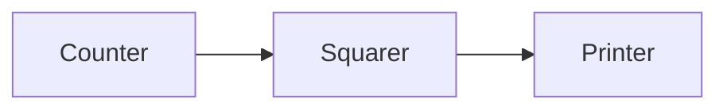

```toc

```

如果说 `goroutine` 是 Go 语言程序的并发体的话，那么 channels 则是它们之间的通信机制。一个 `channel` 是一个通信机制，它可以让一个 `goroutine` 通过它给另一个 `goroutine` 发送值信息。每个 `channel` 都有一个特殊的类型，也就是 `channels` 可发送数据的类型。一个可以发送 `int` 类型数据的 `channel` 一般写为 `chan int`。

使用内置的 `make` 函数，我们可以创建一个 `channel`：

```go
ch := make(chan int) // ch has type 'chan int'
```

和 `map` 类似，`channel` 也对应一个 `make` 创建的底层数据结构的引用。当我们复制一个 `channel ` 或用于函数参数传递时，我们只是拷贝了一个 `channel ` 引用，因此调用者和被调用者将引用同一个 `channel` 对象。和其它的引用类型一样，`channel` 的零值也是 `nil`。

两个相同类型的 `channel` 可以使用 `==` 运算符比较。如果两个 `channel` 引用的是相同的对象，那么比较的结果为真。一个 `channel` 也可以和 `nil` 进行比较。

一个 `channel` 有发送和接受两个主要操作，都是通信行为。一个发送语句将一个值从一个 `goroutine` 通过 `channel` 发送到另一个执行接收操作的 `goroutine`。发送和接收两个操作都使用 ` <- ` 运算符。在发送语句中，` <- ` 运算符分割 `channel` 和要发送的值。在接收语句中，` <- ` 运算符写在 `channel` 对象之前。一个不使用接收结果的接收操作也是合法的。

```go
ch <- x  // a send statement
x = <-ch // a receive expression in an assignment statement
<-ch     // a receive statement; result is discarded
```

`Channel` 还支持 `close` 操作，用于关闭 `channel`，随后对基于该 `channel` 的任何发送操作都将导致 `panic` 异常。对一个已经被 `close` 过的 `channel` 进行接收操作依然可以接受到之前已经成功发送的数据；如果 ` channel` 中已经没有数据的话将产生一个零值的数据。

使用内置的 `close` 函数就可以关闭一个 `channel`：

```go
close(ch)
```

以最简单方式调用 `make` 函数创建的是一个无缓存的 `channel`，但是我们也可以指定第二个整型参数，对应 `channel` 的容量。如果 `channel` 的容量大于零，那么该 `channel` 就是带缓存的 `channel`。

```go
ch = make(chan int)    // unbuffered channel
ch = make(chan int, 0) // unbuffered channel
ch = make(chan int, 3) // buffered channel with capacity 3
```


## 不带缓存的 Channels

一个基于无缓存 `Channels` 的发送操作将导致发送者 `goroutine` 阻塞，直到另一个 `goroutine` 在相同的 ` Channels ` 上执行接收操作，当发送的值通过 ` Channels ` 成功传输之后，两个 `goroutine` 可以继续执行后面的语句。反之，如果接收操作先发生，那么接收者 `goroutine` 也将阻塞，直到有另一个 `goroutine` 在相同的 ` Channels ` 上执行发送操作。

基于无缓存 `Channels` 的发送和接收操作将导致两个 `goroutine` 做一次同步操作。因为这个原因，无缓存 `Channels` 有时候也被称为同步 `Channels`。当通过一个无缓存 ` Channels ` 发送数据时，接收者收到数据发生在再次唤醒发送者 ` goroutine ` 之前。

当我们说 `x` 事件既不是在 `y` 事件之前发生也不是在 `y` 事件之后发生，我们就说 `x` 事件和 `y` 事件是并发的。这并不是意味着 `x` 事件和 `y` 事件就一定是同时发生的，我们只是不能确定这两个事件发生的先后顺序。在下一章中我们将看到，当两个 `goroutine` 并发访问了相同的变量时，我们有必要保证某些事件的执行顺序，以避免出现某些并发问题。

在之前的客户端程序，它在主 `goroutine` 中将标准输入复制到 `server`，因此当客户端程序关闭标准输入时，后台 ` goroutine ` 可能依然在工作。我们需要让主 ` goroutine ` 等待后台 ` goroutine ` 完成工作后再退出，我们使用了一个 channel 来同步两个 ` goroutine `：

```go
// 客户端程序
func main() {
    conn, err := net.Dial("tcp", "localhost:8000")
    if err != nil {
        log.Fatal(err)
    }
    done := make(chan struct{})
    go func() {
	    // 这里是从conn中读取数据
        io.Copy(os.Stdout, conn) // NOTE: ignoring errors
        log.Println("done")
        // 像channel中写数据
        done <- struct{}{} // signal the main goroutine
    }()
    mustCopy(conn, os.Stdin)
    conn.Close()
    // 从channel中读取数据
    <-done // wait for background goroutine to finish
}
func mustCopy(dst io.Writer, src io.Reader) {
	if _, err := io.Copy(dst, src); err != nil {
		log.Fatal(err)
	}
}
```

当用户关闭了标准输入，主 `goroutine` 中的 mustCopy 函数调用将返回，然后调用 `conn.Close ()` 关闭读和写方向的网络连接。关闭网络连接中的写方向的连接将导致 `server` 程序收到一个文件（`end-of-file`）结束的信号。关闭网络连接中读方向的连接将导致后台 `goroutine` 的 `io.Copy` 函数调用返回一个“`read from closed connection`”（“从关闭的连接读”）类似的错误。（需要注意的是 `go` 语句调用了一个函数字面量，这是 Go 语言中启动 ` goroutine ` 常用的形式。）

在后台 `goroutine` 返回之前，它先打印一个日志信息，然后向 `done` 对应的 `channel` 发送一个值。主 ` goroutine ` 在退出前先等待从 `done` 对应的 `channel` 接收一个值。因此，总是可以在程序退出前正确输出“`done`”消息。

基于 `channels` 发送消息有两个重要方面。首先每个消息都有一个值，但是有时候通讯的事实和发生的时刻也同样重要。当我们更希望强调通讯发生的时刻时，我们将它称为**消息事件**。有些消息事件并不携带额外的信息，它仅仅是用作两个 ` goroutine ` 之间的同步，这时候我们可以用 ` struct{} ` 空结构体作为 channels 元素的类型，虽然也可以使用 bool 或 int 类型实现同样的功能，` done <- 1 ` 语句也比 ` done <- struct{}{} ` 更短。

这里我们在关闭连接时，`conn` 虽然是一个 `interface` 类型的值，但是其底层真实类型是 `*net. TCPConn `，代表一个 `TCP` 连接。一个 `TCP` 连接有读和写两个部分，可以使用 `CloseRead` 和 `CloseWrite` 方法分别关闭它们。
```go
conn.(*net.TCPConn).CloseRead()
conn.(*net.TCPConn).CloseWrite()
```


## 串联的 Channels（Pipeline）

`Channels` 也可以用于将多个 `goroutine` 连接在一起，一个 ` Channel ` 的输出作为下一个 `Channel` 的输入。这种串联的 ` Channels ` 就是所谓的管道（` pipeline `）。下面的程序用两个 ` Channels ` 将三个 ` goroutine ` 串联起来，如图所示。



第一个 `goroutine` 是一个计数器，用于生成 `0、1、2、……` 形式的整数序列，然后通过 `channel` 将该整数序列发送给第二个 `goroutine`；第二个 `goroutine` 是一个求平方的程序，对收到的每个整数求平方，然后将平方后的结果通过第二个 `channel` 发送给第三个 `goroutine`；第三个 `goroutine` 是一个打印程序，打印收到的每个整数。为了保持例子清晰，我们有意选择了非常简单的函数，当然三个 `goroutine` 的计算很简单，在现实中确实没有必要为如此简单的运算构建三个 `goroutine`。


```go
func main() {
    naturals := make(chan int)
    squares := make(chan int)

    // Counter
    go func() {
        for x := 0; ; x++ {
            naturals <- x
        }
    }()

    // Squarer
    go func() {
        for {
            x := <-naturals
            squares <- x * x
        }
    }()

    // Printer (in main goroutine)
    for {
        fmt.Println(<-squares)
    }
}
```

如您所料，上面的程序将生成 `0、1、4、9、……` 形式的无穷数列。像这样的串联 ` Channels ` 的管道（`Pipelines`）可以用在需要长时间运行的服务中，每个长时间运行的 `goroutine` 可能会包含一个死循环，在不同 `goroutine` 的死循环内部使用串联的 ` Channels ` 来通信。但是，如果我们希望通过 ` Channels ` 只发送有限的数列该如何处理呢？

如果发送者知道，没有更多的值需要发送到 `channel` 的话，那么让接收者也能及时知道没有多余的值可接收将是有用的，因为接收者可以停止不必要的接收等待。这可以通过内置的 `close` 函数来关闭 `channel` 实现：

```go
close(naturals)
```

当一个 `channel` 被关闭后，再向该 `channel` 发送数据将导致 `panic` 异常。当一个被关闭的 `channel` 中已经发送的数据都被成功接收后，后续的接收操作将不再阻塞，它们会立即返回一个零值。关闭上面例子中的 `naturals` 变量对应的 `channel` 并不能终止循环，它依然会收到一个永无休止的零值序列，然后将它们发送给打印者 ` goroutine `。

没有办法直接测试一个 `channel` 是否被关闭，但是接收操作有一个变体形式：它多接收一个结果，多接收的第二个结果是一个布尔值 `ok`，`ture` 表示成功从 `channels` 接收到值，`false` 表示 `channels` 已经被关闭并且里面没有值可接收。使用这个特性，我们可以修改 `squarer` 函数中的循环代码，当 `naturals` 对应的 `channel` 被关闭并没有值可接收时跳出循环，并且也关闭 `squares` 对应的 `channel`

```go
// Squarer
go func() {
    for {
        x, ok := <-naturals
        if !ok {
            break // channel was closed and drained
        }
        squares <- x * x
    }
    close(squares)
}()
```

因为上面的语法是笨拙的，而且这种处理模式很常见，因此 Go 语言的 `range` 循环可直接在 ` Channels ` 上面迭代。使用 `range` 循环是上面处理模式的简洁语法，它依次从 `channel` 接收数据，当 `channel` 被关闭并且没有值可接收时跳出循环。

在下面的改进中，我们的计数器 `goroutine` 只生成 100 个含数字的序列，然后关闭 `naturals` 对应的 `channel`，这将导致计算平方数的 `squarer` 对应的 ` goroutine ` 可以正常终止循环并关闭 `squares` 对应的 `channel`。（在一个更复杂的程序中，可以通过 `defer` 语句关闭对应的 `channel`。）最后，主 ` goroutine ` 也可以正常终止循环并退出程序。

```go
func main() {
    naturals := make(chan int)
    squares := make(chan int)

    // Counter
    go func() {
        for x := 0; x < 100; x++ {
            naturals <- x
        }
        close(naturals)
    }()

    // Squarer
    go func() {
        for x := range naturals {
            squares <- x * x
        }
        close(squares)
    }()

    // Printer (in main goroutine)
    for x := range squares {
        fmt.Println(x)
    }
}
```

其实你并不需要关闭每一个 `channel`。只有当需要告诉接收者 ` goroutine `，所有的数据已经全部发送时才需要关闭 `channel`。不管一个 `channel` 是否被关闭，当它没有被引用时将会被 Go 语言的垃圾自动回收器回收。（不要将关闭一个打开文件的操作和关闭一个 `channel` 操作混淆。对于每个打开的文件，都需要在不使用的时候调用对应的 `Close` 方法来关闭文件。）试图重复关闭一个 `channel` 将导致 `panic` 异常，试图关闭一个 `nil` 值的 `channel` 也将导致 `panic` 异常。关闭一个 `channels` 还会触发一个广播机制，我们将在后面讨论。

## 单方向的 Channel

随着程序的增长，人们习惯于将大的函数拆分为小的函数。我们前面的例子中使用了三个 `goroutine`，然后用两个 `channels` 来连接它们，它们都是 ` main ` 函数的局部变量。将三个 ` goroutine ` 拆分为以下三个函数是自然的想法：

```go
func counter(out chan int)
func squarer(out, in chan int)
func printer(in chan int)
```

其中计算平方的 `squarer` 函数在两个串联 `Channels` 的中间，因此拥有两个 `channel` 类型的参数，一个用于输入一个用于输出。两个 `channel ` 都拥有相同的类型，但是它们的使用方式相反：一个只用于接收，另一个只用于发送。参数的名字 `in` 和 `out` 已经明确表示了这个意图，但是并无法保证 `squarer` 函数向一个 `in` 参数对应的 `channel` 发送数据或者从一个 `out` 参数对应的 `channel` 接收数据。

这种场景是典型的。当一个 `channel` 作为一个函数参数时，它一般总是被专门用于只发送或者只接收。

为了表明这种意图并防止被滥用，Go 语言的类型系统提供了单方向的 `channel` 类型，分别用于只发送或只接收的 `channel`。类型 ` chan<- int ` 表示一个只发送 `int` 的 `channel`，只能发送不能接收。相反，类型 ` <-chan int ` 表示一个只接收 `int` 的 `channel`，只能接收不能发送。（箭头 ` <- ` 和关键字 `chan` 的相对位置表明了 `channel` 的方向。）这种限制将在编译期检测。

因为关闭操作只用于断言不再向 `channel` 发送新的数据，所以只有在发送者所在的 `goroutine` 才会调用 `close` 函数，因此对一个只接收的 `channel` 调用 `close` 将是一个编译错误。

这是改进的版本，这一次参数使用了单方向 `channel` 类型：


```go
func counter(out chan<- int) {
    for x := 0; x < 100; x++ {
        out <- x
    }
    close(out)
}

func squarer(out chan<- int, in <-chan int) {
    for v := range in {
        out <- v * v
    }
    close(out)
}

func printer(in <-chan int) {
    for v := range in {
        fmt.Println(v)
    }
}

func main() {
    naturals := make(chan int)
    squares := make(chan int)
    go counter(naturals)
    go squarer(squares, naturals)
    printer(squares)
}
```

调用 `counter（naturals）` 时，`naturals` 的类型将隐式地从 `chan int ` 转换成 `chan<- int`。调用 `printer (squares)` 也会导致相似的隐式转换，这一次是转换为 ` <-chan int ` 类型只接收型的 `channel`。任何双向 `channel` 向单向 `channel` 变量的赋值操作都将导致该隐式转换。这里并没有反向转换的语法：也就是不能将一个类似 ` chan<- int ` 类型的单向型的 `channel` 转换为 ` chan int ` 类型的双向型的 `channel`。

## 带缓存的 Channels

带缓存的 `Channel` 内部持有一个元素队列。队列的最大容量是在调用 `make` 函数创建 `channel` 时通过第二个参数指定的。下面的语句创建了一个可以持有三个字符串元素的带缓存 `Channel`。下图是 `ch` 变量对应的 `channel` 的图形表示形式。

```go
ch = make(chan string, 3)
```


向缓存 `Channel` 的发送操作就是向内部缓存队列的尾部插入元素，接收操作则是从队列的头部删除元素。如果内部缓存队列是满的，那么发送操作将阻塞直到因另一个 `goroutine` 执行接收操作而释放了新的队列空间。相反，如果 `channel` 是空的，接收操作将阻塞直到有另一个 `goroutine` 执行发送操作而向队列插入元素。

我们可以在无阻塞的情况下连续向新创建的 `channel` 发送三个值：

```go
ch <- "A"
ch <- "B"
ch <- "C"
```

此刻，`channel` 的内部缓存队列将是满的，如果有第四个发送操作将发生阻塞。

在某些特殊情况下，程序可能需要知道 `channel` 内部缓存的容量，可以用内置的 `cap` 函数获取：

```go
fmt.Println(cap(ch)) // "3"
```

同样，对于内置的 `len` 函数，如果传入的是 `channel`，那么将返回 `channel` 内部缓存队列中有效元素的个数。因为在并发程序中该信息会随着接收操作而失效，但是它对某些故障诊断和性能优化会有帮助。

```go
fmt.Println(len(ch)) // "2"
```

下面的例子展示了一个使用了带缓存 `channel` 的应用。它并发地向三个镜像站点发出请求，三个镜像站点分散在不同的地理位置。它们分别将收到的响应发送到带缓存 `channel`，最后接收者只接收第一个收到的响应，也就是最快的那个响应。因此 `mirroredQuery` 函数可能在另外两个响应慢的镜像站点响应之前就返回了结果。（顺便说一下，多个 `goroutines` 并发地向同一个 `channel` 发送数据，或从同一个 `channel` 接收数据都是常见的用法。）

```go
func mirroredQuery() string {
    responses := make(chan string, 3)
    go func() { responses <- request("asia.gopl.io") }()
    go func() { responses <- request("europe.gopl.io") }()
    go func() { responses <- request("americas.gopl.io") }()
    return <-responses // return the quickest response
}

func request(hostname string) (response string) { /* ... */ }
```

如果我们使用了无缓存的 `channel`，那么两个慢的 `goroutines` 将会因为没有人接收而被永远卡住。这种情况，称为 `goroutines` 泄漏，这将是一个 `BUG`。和垃圾变量不同，泄漏的 `goroutines` 并不会被自动回收，因此确保每个不再需要的 `goroutine` 能正常退出是重要的。

关于无缓存或带缓存 `channels` 之间的选择，或者是带缓存 `channels` 的容量大小的选择，都可能影响程序的正确性。无缓存 `channel` 更强地保证了每个发送操作与相应的同步接收操作；但是对于带缓存 `channel`，这些操作是解耦的。同样，即使我们知道将要发送到一个 `channel` 的信息的数量上限，创建一个对应容量大小的带缓存 `channel` 也是不现实的，因为这要求在执行任何接收操作之前缓存所有已经发送的值。如果未能分配足够的缓存将导致程序死锁。