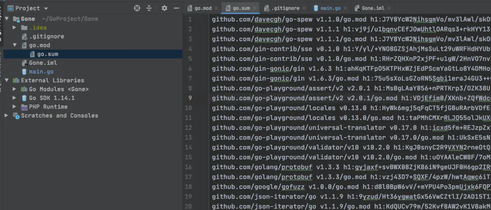

```toc

```

摘自 https://www.jianshu.com/p/760c97ff644c

## 各类包管理工具

### 使用 go path 问题

1.  代码开发必须在 `go path src` 目录下，不然，就有问题。
2.  依赖手动管理
3.  依赖包没有版本可言

从这个看， `go path` 不算包管理工具

### govendor

1.  解决了包依赖，一个配置文件就管理
2.  依赖包全都下载到项目 `vendor` 下，每个项目都把有一份。拉取项目时, 开始怀疑人生。

### go mod介绍

`go modules` 是 `golang 1.11` 新加的特性。Modules 官方定义为：

> 模块是相关 Go 包的集合。`modules` 是源代码交换和版本控制的单元。 go 命令直接支持使用 `modules`，包括记录和解析对其他模块的依赖性。`modules` 替换旧的基于 `GOPATH` 的方法来指定在给定构建中使用哪些源文件。

## 如何使用go mod

下面设置 `go mod` 和 `go proxy`

```bash
go env -w GOBIN=/Users/youdi/go/bin
go env -w GO111MODULE=on
go env -w GOPROXY=https://goproxy.cn,direct // 使用七牛云的
```

注意： `go env -w` 会将配置写到 ` GOENV="/Users/xx/Library/Application Support/go/env"`

下面看下我的配置

```objectivec
GO111MODULE="on"
GOARCH="amd64"
GOBIN="/Users/youdi/go/bin"
GOCACHE="/Users/youdi/Library/Caches/go-build"
GOENV="/Users/youdi/Library/Application Support/go/env"
GOEXE=""
GOFLAGS=""
GOHOSTARCH="amd64"
GOHOSTOS="darwin"
GOINSECURE=""
GONOPROXY=""
GONOSUMDB=""
GOOS="darwin"
GOPATH="/Users/youdi/go"
GOPRIVATE=""
GOPROXY="https://goproxy.cn,direct"
GOROOT="/usr/local/go"
GOSUMDB="off"
GOTMPDIR=""
GOTOOLDIR="/usr/local/go/pkg/tool/darwin_amd64"
GCCGO="gccgo"
AR="ar"
CC="clang"
CXX="clang++"
CGO_ENABLED="1"
GOMOD="/dev/null"
CGO_CFLAGS="-g -O2"
CGO_CPPFLAGS=""
CGO_CXXFLAGS="-g -O2"
CGO_FFLAGS="-g -O2"
CGO_LDFLAGS="-g -O2"
PKG_CONFIG="pkg-config"
GOGCCFLAGS="-fPIC -m64 -pthread -fno-caret-diagnostics -Qunused-arguments -fmessage-length=0 -fdebug-prefix-map=/var/folders/8m/v_1j4dgs7rzgqq4p_4_8k_nr0000gn/T/go-build221113671=/tmp/go-build -gno-record-gcc-switches -fno-common"

```

我们看一下，我修改的内容

`cat /Users/YJ/Library/Application Support/go/env`

```bash
GO111MODULE=on
GOBIN=/Users/youdi/go/bin
GOPROXY=https://goproxy.cn,direct
GOSUMDB=off
```

### GO111MODULE

`GO111MODULE` 有三个值：`off, on` 和 `auto`（默认值）。

`GO111MODULE=off`，go 命令行将不会支持 `module` 功能，寻找依赖包的方式将会沿用旧版本那种通过 `vendor` 目录或者 `GOPATH` 模式来查找。  
`GO111MODULE=on`，go 命令行会使用 `modules`，而一点也不会去 `GOPATH` 目录下查找。  
`GO111MODULE=auto`，默认值，go 命令行将会根据当前目录来决定是否启用 `module` 功能。这种情况下可以分为两种情形：

```go
当前目录在GOPATH/src之外且该目录包含go.mod文件
当前文件在包含go.mod文件的目录下面。
```

当 `modules` 功能启用时，依赖包的存放位置变更为 `$GOPATH/pkg`，允许同一个 `package` 多个版本并存，且多个项目可以共享缓存的 `module`

我们看下目录：

此目录就相当于一个依赖包的库。
`cd /Users/YJ/study/go-work/go-repo`

```css
├── darwin_amd64
│   ├── github.com
│   ├── go.etcd.io
│   ├── golang
│   ├── golang.org
│   ├── gopkg.in
│   ├── quickstart
│   └── uc.a
├── mod
│   ├── cache
│   ├── github.com
│   ├── golang.org
│   ├── google.golang.org
│   └── gopkg.in
└── sumdb
    └── sum.golang.org
```

### go mod命令

golang 提供了 `go mod` 命令来管理包。

`go help mod`

```sh

Go mod provides access to operations on modules.

Note that support for modules is built into all the go commands,
not just 'go mod'. For example, day-to-day adding, removing, upgrading,
and downgrading of dependencies should be done using 'go get'.
See 'go help modules' for an overview of module functionality.

Usage:

    go mod <command> [arguments]

The commands are:

    download    download modules to local cache
    edit        edit go.mod from tools or scripts
    graph       print module requirement graph
    init        initialize new module in current directory
    tidy        add missing and remove unused modules
    vendor      make vendored copy of dependencies
    verify      verify dependencies have expected content
    why         explain why packages or modules are needed

Use "go help mod <command>" for more information about a command.

```

`go mod` 有以下命令：

|命令|说明|
|-|-|
|download|download modules to local cache (下载依赖包)|
|edit|edit go. mod from tools or scripts（编辑 go. mod)|
|graph|print module requirement graph (打印模块依赖图)|
|verify|initialize new module in current directory（在当前目录初始化 mod）|
|tidy|add missing and remove unused modules (拉取缺少的模块，移除不用的模块)|
|vendor|make vendored copy of dependencies (将依赖复制到 vendor 下)|
|verify|verify dependencies have expected content (验证依赖是否正确）|
|why|explain why packages or modules are needed (解释为什么需要依赖)|

比较常用的是 `init`,`tidy`, `edit`

### 使用 go mod 管理一个新项目

#### 1. 初始化项目

可以随便找一个目录创建项目，我使用习惯用IDEA进行创建

```bash
mkdir Gone
cd Gone
go mod init Gone
```

查看一下 `go.mod` 文件

```go
module Gone

go 1.14
```

`go.mod` 文件一旦创建后，它的内容将会被 `go toolchain` 全面掌控。`go toolchain` 会在各类命令执行时，比如 `go get、go build、go mod` 等修改和维护 `go.mod` 文件。

`go.mod` 提供了 `module, require、replace` 和 `exclude` 四个命令

-   `module` 语句指定包的名字（路径）
-   `require` 语句指定的依赖项模块
-   `replace` 语句可以替换依赖项模块
-   `exclude` 语句可以忽略依赖项模块

#### 2. 添加依赖

创建 main.go文件

```go
package main

import (
    "github.com/gin-gonic/gin"
)

func main() {
    r := gin.Default()
    r.GET("/ping", func(c *gin.Context) {
        c.JSON(200, gin.H{
            "message": "pong",
        })
    })
    r.Run() // listen and serve on 0.0.0.0:8080 (for windows "localhost:8080")
}
```

执行 `go run main.go` 运行代码会发现 `go mod` 会自动查找依赖自动下载  

再查看 `go.mod`

```bash
module Gone

go 1.14

require github.com/gin-gonic/gin v1.6.3
```

`go module` 安装 `package` 的原則是先拉最新的 `release tag`，若无 `tag` 则拉最新的 `commit`

go 会自动生成一个 `go.sum` 文件来记录 `dependency tree`



再次执行脚本 `go run main.go` 发现跳过了检查并安装依赖的步骤。

可以使用命令 `go list -m -u all` 来检查可以升级的 package，使用 `go get -u need-upgrade-package` 升级后会将新的依赖版本更新到 `go. mod *` 也可以使用 `go get -u` 升级所有依赖

去 `mod` 包缓存下看看

```bash
/Users/YJ/study/go-work/go-repo/pkg/mod/github.com/gin-gonic/gin@v1.6.3
```

### go get 升级

-   运行 `go get -u` 将会升级到最新的次要版本或者修订版本 (`x.y.z`, `z` 是修订版本号， `y` 是次要版本号)
-   运行 `go get -u=patch` 将会升级到最新的修订版本
-   运行 `go get package@version` 将会升级到指定的版本号 `version`
-   运行 `go get` 如果有版本的更改，那么 `go.mod` 文件也会更改

### 使用 replace 替换无法直接获取的 package

由于某些已知的原因，并不是所有的 `package` 都能成功下载，比如：`golang.org` 下的包。

`modules` 可以通过在 `go.mod` 文件中使用 `replace` 指令替换成 `github` 上对应的库，比如：

```go
replace (
    golang.org/x/crypto v0.0.0-20190313024323-a1f597ede03a => github.com/golang/crypto v0.0.0-20190313024323-a1f597ede03a
)
```

### go mod 发布和使用

参考 Roberto Selbach 写的 `go mod` 入门文章，文末，我给出链接

### Creating a Module

如果你设置好 `go mod` 了，那你就可以在任何目录下随便创建

```bash
$mkdir gomodone
$cd gomodone
```

在这个目录下创建一个文件 `say.go`

```go
package gomodone

import "fmt" 

// say Hi to someone
func SayHi(name string) string {
   return fmt.Sprintf("Hi, %s", name)
}

```

初始化一个 `go.mod` 文件

```bash
$ go mod init github.com/jacksonyoudi/gomodone
go: creating new go.mod: module github.com/jacksonyoudi/gomodone
```

查看 `go.mod` 内容如下：

```go
github.com/jacksonyoudi/gomodone
go 1.14
```

下面我们要将这个 `module` 发布到 `github` 上，然后在另外一个程序使用

```bash
$git init
$vim .gitiiignore
$git commit -am "init"
// github创建对应的repo
$git remote add origin git@github.com:jacksonyoudi/gomodone.git
$git push -u origin master
```

执行完，上面我们就相当于发布完了。

如果有人需要使用，就可以使用

```bash
go get github.com/jacksonyoudi/gomodone
```

这个时候没有加 `tag`，所以，没有版本的控制。默认是 `v0.0.0` 后面接上时间和 `commitid`。如下：

```bash
gomodone@v0.0.0-20200517004046-ee882713fd1e
```

官方不建议这样做，没有进行版本控制管理。

### module versioning

使用 `tag`，进行版本控制

#### making a release

```bash
git tag v1.0.0
git push --tags
```

操作完，我们的 `module` 就发布了一个 `v1.0.0` 的版本了。

推荐在这个状态下，再切出一个分支，用于后续 `v1.0.0` 的修复推送, 不要直接在 `master` 分支修复

```bash
$git checkout -b v1
$git push -u origin v1
```

### use our module

上面已经发布了一个 `v1.0.0` 的版本，我们可以在另一个项目中使用，创建一个 go 的项目

```bash
$mkdir Gone
$cd Gone
$vim main.go
```

```go
package main

import (
    "fmt"
    "github.com/jacksonyoudi/gomodone"
)

func main() {
    fmt.Println(gomodone.SayHi("Roberto"))
}
```

代码写好了，我们生成 `go mod` 文件

```bash
go mod init Gone
```

上面命令执行完，会生成 `go mod` 文件  
看下 `mod` 文件：

```bash
module Gone

go 1.14

require (
    github.com/jacksonyoudi/gomodone v1.0.0
)
```

```bash
$go mod tidy
go: finding module for package github.com/jacksonyoudi/gomodone
go: found github.com/jacksonyoudi/gomodone in github.com/jacksonyoudi/gomodone v1.0.0
```

同时还生成了 `go.sum`, 其中包含软件包的哈希值，以确保我们具有正确的版本和文件。

```bash
github.com/jacksonyoudi/gomodone v1.0.1 h1:jFd+qZlAB0R3zqrC9kwO8IgPrAdayMUS0rSHMDc/uG8=
github.com/jacksonyoudi/gomodone v1.0.1/go.mod h1:XWi+BLbuiuC2YM8Qz4yQzTSPtHt3T3hrlNN2pNlyA94=
github.com/jacksonyoudi/gomodone/v2 v2.0.0 h1:GpzGeXCx/Xv2ueiZJ8hEhFwLu7xjxLBjkOYSmg8Ya/w=
github.com/jacksonyoudi/gomodone/v2 v2.0.0/go.mod h1:L8uFPSZNHoAhpaePWUfKmGinjufYdw9c2i70xtBorSw=
```

这个内容是下面的，需要操作执行的结果

`go run main.go` 就可以运行了

### Making a bugfix release

假如 `fix` 一个 `bug`, 我们在 `v1` 版本上进行修复

修改代码如下：

```go
// say Hi to someone
func SayHi(name string) string {
-       return fmt.Sprintf("Hi, %s", name)
+       return fmt.Sprintf("Hi, %s!", name)
}
```

修复好，我们开始 `push`

```bash
$ git commit -m "Emphasize our friendliness" say.go
$ git tag v1.0.1
$ git push --tags origin v1
```

#### Updating modules

刚才 `fix bug`，所以要在我们使用项目中更新

这个需要我们手动执行更新 `module` 操作

我们通过使用我们的好朋友来做到这一点 `go get`：

-   运行 `go get -u` 以使用最新的 `minor` 版本或修补程序版本（即它将从 `1.0.0` 更新到例如 `1.0.1`，或者，如果可用，则更新为 `1.1.0`）
-   运行 `go get -u=patch` 以使用最新的修补程序版本（即，将更新为 `1.0.1` 但不更新为 `1.1.0`）
-   运行 `go get package@version` 以更新到特定版本（例如 [github.com/jacksonyoudi/gomodone@v1.0.1](https://links.jianshu.com/go?to=http%3A%2F%2Fgithub.com%2Fjacksonyoudi%2Fgomodone%40v1.0.1)）

目前 `module` 最新的也是 `v1.0.1`

```bash
// 更新最新
$go get -u
$go get -u=patch
//指定包，指定版本
$go get github.com/jacksonyoudi/gomodone@v1.0.1
```

操作完，`go.mod` 文件会修改如下:

```go
module Gone

go 1.14

require (
    github.com/jacksonyoudi/gomodone v1.0.1
)
```

#### Major versions

根据语义版本语义，主要版本与次要版本不同。主要版本可能会破坏向后兼容性。从 Go 模块的角度来看，主要版本是完全不同的软件包。乍一看这听起来很奇怪，但这是有道理的：两个不兼容的库版本是两个不同的库。比如下面修改，完全破坏了兼容性。

```go
package gomodone

import (
    "errors"
    "fmt"
)

// Hi returns a friendly greeting
// Hi returns a friendly greeting in language lang
func SayHi(name, lang string) (string, error) {
    switch lang {
    case "en":
        return fmt.Sprintf("Hi, %s!", name), nil
    case "pt":
        return fmt.Sprintf("Oi, %s!", name), nil
    case "es":
        return fmt.Sprintf("¡Hola, %s!", name), nil
    case "fr":
        return fmt.Sprintf("Bonjour, %s!", name), nil
    default:
        return "", errors.New("unknown language")
    }
}
```

如上，我们需要不同的大版本，这种情况下

修改 `go.mod` 如下

```go
module github.com/jacksonyoudi/gomodone/v2

go 1.14
```

然后，重新 `tag，push`

```bash
$ git commit say.go -m "Change Hi to allow multilang"
$ git checkout -b v2 # 用于v2版本，后续修复v2
$ git commit go.mod -m "Bump version to v2"
$ git tag v2.0.0
$ git push --tags origin v2 
```

### Updating to a major version

即使发布了库的新不兼容版本，现有软件也不会中断，因为它将继续使用现有版本 `1.0.1`。`go get -u` 将不会获得版本 `2.0.0`。  
如果想使用 `v2.0.0`, 代码改成如下：

```go
package main

import (
    "fmt"
    "github.com/jacksonyoudi/gomodone/v2"
)

func main() {
    g, err := gomodone.SayHi("Roberto", "pt")
    if err != nil {
        panic(err)
    }
    fmt.Println(g)
}
```

执行 `go mod tidy`

```bash
go: finding module for package github.com/jacksonyoudi/gomodone/v2
go: downloading github.com/jacksonyoudi/gomodone/v2 v2.0.0
go: found github.com/jacksonyoudi/gomodone/v2 in github.com/jacksonyoudi/gomodone/v2 v2.0.0
```

当然，两个版本都可以同时使用, 使用别名。如下：

```go
package main

import (
    "fmt"
    "github.com/jacksonyoudi/gomodone"
    mv2 "github.com/jacksonyoudi/gomodone/v2"
)

func main() {
    g, err := mv2.SayHi("Roberto", "pt")
    if err != nil {
        panic(err)
    }
    fmt.Println(g)

    fmt.Println(gomodone.SayHi("Roberto"))
}

```

执行一下 `go mod tidy`

### Vendoring

默认是忽略 `vendor` 的，如果想在项目目录下有 `vendor` 可以执行下面命令

```bash
$go vendor
```

当然，如果构建程序的时候，希望使用 `vendor` 中的依赖，

```go
$ go build -mod vendor
```
