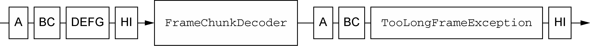

# 一、入门

> 这里使用的版本是4.1版本，直接拉取源码到本地，在运行案例时可能会报错，此时执行
>
> `mvn clean compile`

> 之后，代码上可能还会显示错误，但是可以运行案例

## 1.1 入门案例

先通过一个例子体验下

**服务端**

```java
package io.netty.example.inaction.ch2;

import io.netty.bootstrap.ServerBootstrap;
import io.netty.channel.ChannelFuture;
import io.netty.channel.ChannelInitializer;
import io.netty.channel.ChannelOption;
import io.netty.channel.EventLoopGroup;
import io.netty.channel.nio.NioEventLoopGroup;
import io.netty.channel.socket.SocketChannel;
import io.netty.channel.socket.nio.NioServerSocketChannel;
import java.net.InetSocketAddress;

/**
 * 服务端
 **/
public class EchoServer {
    public static void main(String[] args) throws Exception {
        //创建两个线程组 boosGroup、workerGroup
        // boosGroup用于监听客户端连接，专门负责与客户端的连接，并把连接注册到
        // workGroup的Selector中，设置线程数为1
        EventLoopGroup bossGroup = new NioEventLoopGroup(1);
        // 用于处理每一个连接发生的读写事件
        EventLoopGroup workerGroup = new NioEventLoopGroup(16);
        try {
            //创建服务端的启动对象，设置参数
            ServerBootstrap bootstrap = new ServerBootstrap();
            //设置两个线程组boosGroup和workerGroup
            bootstrap.group(bossGroup, workerGroup)
                //设置服务端通道实现类型
                .channel(NioServerSocketChannel.class)
                //设置线程队列得到连接个数
                .option(ChannelOption.SO_BACKLOG, 128)
                //设置保持活动连接状态
                .childOption(ChannelOption.SO_KEEPALIVE, true)
                //使用匿名内部类的形式初始化通道对象
                .childHandler(new ChannelInitializer<SocketChannel>() {
                    @Override
                    protected void initChannel(SocketChannel socketChannel) 
                      throws Exception {
                        //给pipeline管道设置处理器
                        socketChannel.pipeline().addLast(new EchoServerHandler());
                    }
                });//给workerGroup的EventLoop对应的管道设置处理器
            System.out.println("Netty Server 准备就绪...");
            //绑定端口号，启动服务端
            ChannelFuture channelFuture = bootstrap.bind(6666).sync();
            //对关闭通道进行监听
            channelFuture.channel().closeFuture().sync();
        } finally {
            bossGroup.shutdownGracefully();
            workerGroup.shutdownGracefully();
        }
    }
}
```

```java
package io.netty.example.inaction.ch2;

import io.netty.buffer.ByteBuf;
import io.netty.buffer.Unpooled;
import io.netty.channel.ChannelFutureListener;
import io.netty.channel.ChannelHandler.Sharable;
import io.netty.channel.ChannelHandlerContext;
import io.netty.channel.ChannelInboundHandlerAdapter;
import io.netty.channel.EventLoop;
import io.netty.util.CharsetUtil;

/**
 * ch2:处理器实现
 **/
// 此注解标识一个ChannelHandler可以被多个Channel安全的共享
@Sharable
public class EchoServerHandler extends ChannelInboundHandlerAdapter {

    /**
     * 这里接收到客户端发送过来到信息并打印出来
     */
    @Override
    public void channelRead(ChannelHandlerContext ctx, Object msg) throws Exception {
        ByteBuf in = (ByteBuf) msg;
        System.out.println("Server received: " + in.toString(CharsetUtil.UTF_8));
    }

    @Override
    public void channelReadComplete(ChannelHandlerContext ctx) throws Exception {
        ctx.writeAndFlush(Unpooled.copiedBuffer("服务端向你问好", CharsetUtil.UTF_8))
            .addListener(ChannelFutureListener.CLOSE);
    }

    @Override
    public void exceptionCaught(ChannelHandlerContext ctx, Throwable cause) 
      throws Exception {
        cause.printStackTrace();
        ctx.close();
    }
}
```

**客户端**

```java
package io.netty.example.inaction.ch2;

import io.netty.bootstrap.Bootstrap;
import io.netty.channel.ChannelFuture;
import io.netty.channel.ChannelInitializer;
import io.netty.channel.EventLoopGroup;
import io.netty.channel.nio.NioEventLoopGroup;
import io.netty.channel.socket.SocketChannel;
import io.netty.channel.socket.nio.NioSocketChannel;
import java.net.InetSocketAddress;

/**
 * 客户端
 **/
public class EchoClient {

    public static void main(String[] args) throws InterruptedException {
        NioEventLoopGroup eventExecutors = new NioEventLoopGroup();
        try {
            //创建bootstrap对象，配置参数
            Bootstrap bootstrap = new Bootstrap();
            //设置线程组
            bootstrap.group(eventExecutors)
                //设置客户端的通道实现类型
                .channel(NioSocketChannel.class)
                //使用匿名内部类初始化通道
                .handler(new ChannelInitializer<SocketChannel>() {
                    @Override
                    protected void initChannel(SocketChannel ch) throws Exception {
                        //添加客户端通道的处理器
                        ch.pipeline().addLast(new EchoClientHandler());
                    }
                });
            System.out.println("Netty Client 准备就绪，随时可以起飞~");
            //连接服务端
            ChannelFuture channelFuture = bootstrap.connect("127.0.0.1", 6666).sync();
            //对通道关闭进行监听
            channelFuture.channel().closeFuture().sync();
        } finally {
            //关闭线程组
            eventExecutors.shutdownGracefully();
        }
    }
}
```

```java
package io.netty.example.inaction.ch2;

import io.netty.buffer.ByteBuf;
import io.netty.buffer.Unpooled;
import io.netty.channel.ChannelHandlerContext;
import io.netty.channel.SimpleChannelInboundHandler;
import io.netty.util.CharsetUtil;

/**
 * 客户端处理类
 **/
public class EchoClientHandler extends SimpleChannelInboundHandler<ByteBuf> {

    /**
     * 此方法将在一个连接建立时被调用，会将相关信息发送给服务端
     */
    @Override
    public void channelActive(ChannelHandlerContext ctx) throws Exception {
        ctx.writeAndFlush(Unpooled.copiedBuffer("客户端向你问好!", CharsetUtil.UTF_8));
    }

    /**
     * 每当接收到数据时，都会调用此方法，注意：由服务器发送都消息可能会被分块接收，也就是
     * 说此方法可能会被调用多次
     */
    @Override
    protected void channelRead0(ChannelHandlerContext ctx, ByteBuf in) throws Exception {
        System.out.println("Client received: " + in.toString(CharsetUtil.UTF_8));
    }

    @Override
    public void exceptionCaught(ChannelHandlerContext ctx, Throwable cause) 
      throws Exception {
        cause.printStackTrace();;
        ctx.close();
    }
}
```

相关概念

* Channel

  > 这个很好理解，基本的 ` I/O` 操作( `bind()、connect()、read()和 write())` 依赖于底层网络传输所提供的原语。可以理解为网络通道，数据就是在此通道中进行传输。 `Netty` 中有许多预定义的、专门化实现的广泛类层次结构的根，下面是一个简短的部分清单:
  >
  > `EmbeddedChannel, LocalServerChannel, NioDatagramChannel, NioSctpChannel, NioSocketChannel`
  >
* Bootstrap/ServerBootstrap

  > 这两个为引导类，涉及到将一个进程绑定到某个指定的端口，或者将一个进程连接到另一个运行在某个指定主机的指定端口上的进程。客户端引导类 `Bootstrap` 作用为连接到远程主机和端口上，而服务端引导类 `ServerBootstrap` 主要是将接收到的连接请求绑定到本地的某个端口上面。两者都继承自 `Channel` 。
  >
  > 一般客户端只需要一个 `EventLoopGroup` ，而 `ServerBootstrap` 需要两个，一个只包含 `ServerChannel` ，代表服务器自身的已绑定到某个本地端口到正在监听到套接字，而另一个将包含所有已创建的用来处理传入客户端连接的 `Channel` 。当然也可以只使用一个，此时其将在两个场景下共用同一个 `EventLoopGroup` 。
  >
* ChannelHandler

  > 例子中在服务端和客户端同时都创建了一个 `ChannelHandler` 实例，这个可以理解为对接收到的数据或者要发送出去的数据进行实际处理的一个类。每个 `Channel` 中可以添加多个不同功能的 `ChannelHandler` 实现类，一般维护在 `ChannelPipeline` 这个容器中。
  >
  > 这里又分为两类，即 `ChannelInboundHandlerAdapter` (入站处理器)、 `ChannelOutboundHandler` (出站处理器)，入站指的是数据从底层 `java NIO Channel` 到 `Netty` 的 `Channel` ；出站指的是通过 `Netty` 的 `Channel` 来操作底层的 `java NIO Channel` 。
  >
* ChannelPipeline

  > `ChannelPipeline` 提供了 `ChannelHandler` 链的容器。当 `Channel ` 被创建时，它会被自动地分配到它专属的 `ChannelPipeline` 。
  >
* EventLoop

  > `EventLoop` 定义了 `Netty` 的核心抽象，用于处理连接的生命周期中所发生的事件。一个 `EventLoop` 将由一个永远都不会改变的 `Thread` 驱动，相关任务可以提交给 `EventLoop` 来立即执行或调度执行，可以理解为线程池中的一个线程。根据场景不同，可能会创建多个 `EventLoop` 实例用以优化资源利用，并且单个 `EventLoop` 可能会被指派用于服务多个 `Channel` 。
  >
* EventLoopGroup

  > 包含多个 `EventLoop` ，可以理解为一个线程池。
  >

# 二、传输

下面先看下普通的阻塞和非阻塞网络编程实现和与使用Netty实现的例子

```java
package io.netty.example.inaction.ch4;

/**
 * 普通阻塞网络编程实现
 **/
public class PlainOioServer {

    public void serve(int port) throws IOException {
        final ServerSocket socket = new ServerSocket(port);
        try {
            for (; ; ) {
                // 阻塞，直到接收到一个客户端连接
                final Socket clientSocket = socket.accept();
                System.out.println("Accepted client connection from: " + clientSocket);
                new Thread(new Runnable() {
                    @Override
                    public void run() {
                        OutputStream out;
                        try {
                            // 获取到客户端socket写出流
                            out = clientSocket.getOutputStream();
                            // 将相关信息写出到输出流中
                            out.write("Hi!\r\n".getBytes(Charset.forName("UTF-8")));
                            out.flush();
                            clientSocket.close();
                        } catch (IOException e) {
                            e.printStackTrace();
                        } finally {
                            try {
                                clientSocket.close();
                            } catch (IOException e) {
                                // ignore
                            }
                        }
                    }
                }).start();
            }
        } catch (IOException e) {
            e.printStackTrace();
        }
    }
}
```

```java
package io.netty.example.inaction.ch4;
/**
 * 普通非阻塞NIO网络编程实现
 **/
public class PlainNioServer {

    public void server(int port) throws IOException {
        ServerSocketChannel serverChannel = ServerSocketChannel.open();
        serverChannel.configureBlocking(false);
        ServerSocket ssocket = serverChannel.socket();
        ssocket.bind(new InetSocketAddress(port));
        Selector selector = Selector.open();
        // 将ServerSocket注册
        serverChannel.register(selector, SelectionKey.OP_ACCEPT);
        final ByteBuffer msg = ByteBuffer.wrap("Hi!\r\n".getBytes());
        for (; ; ) {
            try {
                selector.select();
            } catch (IOException ex) {
                ex.printStackTrace();
                break;
            }

            // 得到所有到已就绪到key
            Set<SelectionKey> readyKeys = selector.selectedKeys();
            Iterator<SelectionKey> iter = readyKeys.iterator();
            while (iter.hasNext()) {
                SelectionKey key = iter.next();
                iter.remove();
                try {
                    // 检查事件是否是一个新的已经就绪可以被接受的连接
                    if (key.isAcceptable()) {
                        // 一开始selector上面注册的是服务端的channel
                        ServerSocketChannel server = (ServerSocketChannel) key.channel();
                        SocketChannel client = server.accept();
                        client.configureBlocking(false);
                        // 这里将客户端channel注册到selector上
                        client.register(selector, SelectionKey.OP_WRITE | SelectionKey.OP_READ,
                            msg.duplicate());
                    }
                    if (key.isWritable()) {
                        // 获取到客户端到channel
                        SocketChannel client = (SocketChannel) key.channel();
                        ByteBuffer buffer = (ByteBuffer) key.attachment();
                        while (buffer.hasRemaining()) {
                            if (client.write(buffer) == 0) {
                                break;
                            }
                            client.close();
                        }
                    }
                } catch (IOException ex) {
                    key.cancel();
                    try {
                        key.channel().close();
                    } catch (IOException e) {
                        // ignore
                    }
                }
            }
        }
    }
}
```

可以看到普通网络实现阻塞和非阻塞是两种完全不同的方式，下面看一下通过 `Netty` 实现

```java
package io.netty.example.inaction.ch4;
/**
 * Netty阻塞网络编程
 **/
public class NettyOioServer {

    public void server(int port) throws InterruptedException {
        final ByteBuf buf = Unpooled.copiedBuffer("Hi!\r\n", Charset.forName("UTF-8"));
        OioEventLoopGroup group = new OioEventLoopGroup();
        try {
            ServerBootstrap b = new ServerBootstrap();
            b.group(group).channel(OioServerSocketChannel.class)
                .localAddress(new InetSocketAddress(port))
                .childHandler(new ChannelInitializer<SocketChannel>() {
                    @Override
                    protected void initChannel(SocketChannel ch) throws Exception {
                        ch.pipeline().addLast(new ChannelInboundHandlerAdapter() {
                            @Override
                            public void channelActive(ChannelHandlerContext ctx) throws Exception {
                                ctx.writeAndFlush(buf.duplicate())
                                    .addListener(ChannelFutureListener.CLOSE);
                            }
                        });
                    }
                });
            ChannelFuture f = b.bind().sync();
            f.channel().closeFuture().sync();
        } finally {
            group.shutdownGracefully().sync();
        }
    }
}
```

```java
package io.netty.example.inaction.ch4;
/**
 * Netty非阻塞网络编程
 **/
public class NettyNioServer {

    public void server(int port) throws InterruptedException {
        final ByteBuf buf = Unpooled.copiedBuffer("Hi!\r\n", Charset.forName("UTF-8"));
        NioEventLoopGroup group = new NioEventLoopGroup();
        try {
            ServerBootstrap b = new ServerBootstrap();
            b.group(group).channel(NioServerSocketChannel.class)
                .localAddress(new InetSocketAddress(port))
                .childHandler(new ChannelInitializer<SocketChannel>() {
                    @Override
                    protected void initChannel(SocketChannel ch) throws Exception {
                        ch.pipeline().addLast(new ChannelInboundHandlerAdapter() {
                            @Override
                            public void channelActive(ChannelHandlerContext ctx) throws Exception {
                                ctx.writeAndFlush(buf.duplicate())
                                    .addListener(ChannelFutureListener.CLOSE);
                            }
                        });
                    }
                });
            ChannelFuture f = b.bind().sync();
            f.channel().closeFuture().sync();
        } finally {
            group.shutdownGracefully().sync();
        }
    }
}
```

可以看到，使用 `Netty` 实现的阻塞和非阻塞模式，只是我们使用的 `Channel` 和 `EventLoopGroup` 不同而已。而 `Netty` 的 `Channel ` 实现是线程安全的，因此你可以存储一个到 `Channel ` 的引用，并且每当你需要向远程节点写数据时，都可以使用它，即使当时许多线程都在使用它。

## 2.1 内置的传输

| 名称         | 包                              | 描述                                                                                                                                                                                                                                    |
| ------------ | ------------------------------- | --------------------------------------------------------------------------------------------------------------------------------------------------------------------------------------------------------------------------------------- |
| `NIO`      | `io.netty.channel.socket.nio` | 使用 `java.nio.channels` 包作为基础--基于选择器的方式                                                                                                                                                                                 |
| `Epoll`    | `io.netty.channel.epoll`      | 由 `JNI` 驱动的 `epoll()` 和非阻塞 `IO` 。这个传输支持只有在 `Linux` 上可用的多种特性，如 `SO_REUSEPORT` ，比 `NIO` 传输更快，而且是完全非阻塞的。更加适配 `Netty` 现有的线程模型，具有更高的性能以及更低的垃圾回收压力。 |
| `OIO`      | `io.netty.channel.socket.oio` | 使用 `java.net` 包作为基础--使用阻塞流                                                                                                                                                                                                |
| `Local`    | `io.netty.channel.local`      | 可以在 `VM` 内部通过管道进行通信的本地传输                                                                                                                                                                                            |
| `Embedded` | `io.netty.channel.embedded`   | `Embedded` 传输，允许使用 `ChannelHandler` 而又不需要一个真正的基于网络的传输。这在测试 `ChannelHandler` 实现时非常有用。                                                                                                         |

### 2.1.1 NIO--非阻塞I/O

`NIO` 提供了一个所有 `I/O` 操作的全异步的实现。它利用了自 `NIO` 子系统被引入 `JDK 1.4` 时便可用的基于选择器的 `API` 。选择器背后的基本概念是充当一个注册表，在那里你将可以请求在 `Channel ` 的状态发生变化时得到通知。可能的状态变化有:

* 新的 `Channel` 已被接受并且就绪;
* `Channel `连接已经完成;
* `Channel` 有已经就绪的可供读取的数据;
* `Channel `可用于写数据。

选择器运行在一个检查状态变化并对其做出相应响应的线程上，在应用程序对状态的改变做出响应之后，选择器将会被重置，并将重复这个过程。

| 名称       | 描述                                                                                                                                                  |
| ---------- | ----------------------------------------------------------------------------------------------------------------------------------------------------- |
| OP_ACCEPT  | 请求在接受新连接并创建Channel时获得通知                                                                                                               |
| OP_CONNECT | 请求在建立一个连接时获得通知                                                                                                                          |
| OP_READ    | 请求当数据已经就绪，可以从Channel中读取时获得通知                                                                                                     |
| OP_WRITE   | 请求当可以向Channel中写更多的数据时获得通知。这处理了套接字缓冲区被完全填满时的情况，这种情况通常发生在数据的发送速度比远程节点可处理的速度更快的时候 |


### 2.1.2 Epoll--用于Linux的本地非阻塞传输

Linux作为高性能网络编程的平台，其重要性与日俱增，这催生了大量先进特性的开发，其中包括epoll——一个高度可扩展的I/O事件通知特性。这个API自Linux内核版本 2.5.44(2002)被 引入，提供了比旧的POSIX select和poll系统调用更好的性能，同时现在也是Linux上非阻塞网络编程的事实标准。Linux JDK NIO API使用了这些epoll调用。如果要使用可以直接将上面例子中的NioEventLoopGroup 替换为 EpollEventLoopGroup，并且将 NioServerSocketChannel.class 替换为 EpollServerSocketChannel.class 即可。

### 2.1.3 OIO--旧的阻塞I/O

Netty 的 OIO 传输实现代表了一种折中: 它可以通过常规的传输 API 使用，但是由于它是建立在 java.net 包的阻塞实现之上的，所以它不是异步的。但是，它仍然非常适合于某些用途。

例如，你可能需要移植使用了一些进行阻塞调用的库(如JDBC2)的遗留代码，而将逻辑转换为非阻塞的可能也是不切实际的。相反，你可以在短期内使用Netty的OIO传输，然后再将你的代码移植到纯粹的异步传输上。

### 2.1.4 用于JVM内部通信的Local传输

Netty 提供了一个 Local 传输，用于在同一个 JVM 中运行的客户端和服务器程序之间的异步通信。同样，这个传输也支持对于所有 Netty 传输实现都共同的 API。

在这个传输中，和服务器 Channel 相关联的 SocketAddress 并没有绑定物理网络地址; 相反，只要服务器还在运行，它就会被存储在注册表里，并在 Channel 关闭时注销。因为这个传输并不接受真正的网络流量，所以它并不能够和其他传输实现进行互操作。因此，客户端希望连接到(在同一个 JVM 中)使用了这个传输的服务器端时也必须使用它。除了这个限制，它的使用方式和其他的传输一模一样。


### 2.1.5 Embedded传输

Netty 提供了一种额外的传输，使得你可以将一组 ChannelHandler 作为帮助器类嵌入到其他的 ChannelHandler 内部。通过这种方式，你将可以扩展一个 ChannelHandler 的功能， 而又不需要修改其内部代码。

# 三、ByteBuf

Netty 的数据处理 API 通过两个组件暴露——abstract class ByteBuf 和 interface ByteBufHolder。

下面是一些 ByteBuf API 的优点:

* 它可以被用户自定义的缓冲区类型扩展;
* 通过内置的复合缓冲区类型实现了透明的零拷贝;
* 容量可以按需增长(类似于 JDK 的 StringBuilder);
* 在读和写这两种模式之间切换不需要调用 ByteBuffer 的 flip()方法;
* 读和写使用了不同的索引;
* 支持方法的链式调用;
* 支持引用技术
* 支持池化

## 3.1 ByteBuf类

### 3.1.1 工作模式

其维护两个索引，即readerIndex和writerIndex，当如果readerIndex到达writerIndex时再继续读取则会触发IndexOfBoundsException。其中名称以read或write开头的方法会推进这两个索引，而以set或get开头的方法则不会。可以指定其最大容量，默认最大为 `Integer.MAX_VALUE` 。

### 3.1.2 使用模式

**堆缓冲区**

这种方式时最常见的一种，被称为支撑数组，能在没有使用池化的情况下提供快速的分配和释放，非常适合于有遗留的数据需要处理的情况。

```java
ByeteBuf heapBuf = ...
// 检查是否有一个支撑数组
if(heapBuf.hasArray()){
  byte[] array = heapBuf.array();
  // 计算第一个字节的偏移量, 数组第一个byte的偏移+读取的index
  int offset = heapBuf.arrayOffset() + heapBuf.readerIndex();
  // 可以读取的字节数
  int length = heapBuf.readableBytes();
  handleArray(array, offset, length);
}
```

**直接缓冲区**

对于堆缓冲区模式来说，每次都需要在用户空间、内核空间和硬件之间进行数据拷贝交换，比如读取来说，首先需要将数据从硬件复制到内核空间，然后再从内核空间复制到堆中。直接内存就是为了减少这种复制而设计的，会在物理内存上面分配一块区域，然后将用户空间和内核空间都映射在这块物理内存，这样用户空间和内核空间就避免了一次复制，提升了性能。

直接缓冲区的主要缺点是，相对于基于堆的缓冲区，它们的分配和释放都较为昂贵。如果你正在处理遗留代码，你也可能会遇到另外一个缺点: 因为数据不是在堆上，所以你不得不进行一次复制

```java
ByteBuf directBuf = ...
if(!directBuf.hasArray()){
  int length = directBuf.readableBytes();
  byte[] array = new byte[length];
  // 将数据复制到堆中
  directBuf.getBytes(directBuf.readerIndex(), array);
  handleArray(array, 0, length);
}
```

**复合缓冲区**

它为多个 ByteBuf 提供一个聚合视图。在这里你可以根据需要添加或者删除 ByteBuf 实例，这是一个 JDK 的 ByteBuffer 实现完全缺失的特性。通过一个 ByteBuf 子类——CompositeByteBuf——实现了这个模式，它提供了一个将多个缓冲区表示为单个合并缓冲区的虚拟表示。

> CompositeByteBuf中的ByteBuf实例可能同时包含直接内存分配和非直接内存分配。 如果其中只有一个实例，那么对 CompositeByteBuf 上的 hasArray()方法的调用将返回该组件上的 hasArray()方法的值; 否则它将返回 false。

下面对比下两种方式的使用

```java
// 使用ByteBuffer的复合缓冲区模式
ByteBuffer[] message = new ByteBuffer[]{header, body};
ByteBuffer message2 = ByteBuffer.allocate(header.remaining(), body.remaining());
message2.put(header);
message2.put(body);
message2.flip();

// 使用CompositeByteBuf的复合缓冲区模式
CompositeByteBuf meesageBuf = Upooled.compositeBuffer();
ByteBuf headerBuf = ...;
ByteBuf bodyBuf = ...;
messageBuf.addComponents(headerBuf, bodyBuf);
...
// 删除第一个元素，也就是header
messageBuf.removeComponent(0);
for(ByteBuf buf : messageBuf){
  System.out.println(buf.toString());
}
```

CompositeByteBuf 可能不支持访问其支撑数组，因此访问 CompositeByteBuf 中的数据类似于(访问)直接缓冲区的模式

```java
CompositeByteBuf compBuf = Unpooled.compositeBuffer(); 
int length = compBuf.readableBytes();
byte[] array = new byte[length]; 
// 将数据读取到数组中
compBuf.getBytes(compBuf.readerIndex(), array); 
handleArray(array, 0, array.length);
```

## 3.2 字节级操作

### 3.2.1 随机访问

```java
ByteBuf buffer = ...;
for (int i = 0; i < buffer.capacity(); i++) {
  byte b = buffer.getByte(i);
	System.out.println((char)b); 
}
```

这里要注意：这种访问方式不会改变readerIndex和writerIndex。

### 3.2.2 顺序访问

虽然 ByteBuf 同时具有读索引和写索引，但是 JDK 的 ByteBuffer 却只有一个索引，这也就是为什么必须调用 flip()方法来在读模式和写模式之间进行切换的原因。

Netty中通过 `readerIndex` 和 `writerIndex` 将 `ByteBuf` 分成了三个区域， `0～readerIndex` 为可丢弃字节，表示已经被读取过的字节； `readerIndex～writerIndex` 为尚未被读取过的字节，也就是可读字节； `writerIndex～capacity` 为可写字节。

当使用discardReadBytes方法时，会将可丢弃字节空间清理掉，然后将可读空间向前移动，此时可写空间则会扩展。虽然你可能会倾向于频繁地调用 discardReadBytes()方法以确保可写分段的最大化，但是请注意，这将极有可能会导致内存复制，**因为可读字节必须被移动到缓冲区的开始位置**。我们建议只在有真正需要的时候才这样做，例如，当内存非常宝贵的时候。

### 3.2.3 索引管理

JDK 的 `InputStream` 定义了 `mark(int readlimit)` 和 `reset()` 方法，这些方法分别被用来将流中的当前位置标记为指定的值，以及将流重置到该位置。同样，可以通过调用 markReaderIndex()、markWriterIndex()、resetWriterIndex() 和 resetReaderIndex()来标记和重置 ByteBuf 的 readerIndex 和 writerIndex。这些和 InputStream 上的调用类似，只是没有 readlimit 参数来指定标记什么时候失效。

也可以通过调用 readerIndex(int)或者 writerIndex(int)来将索引移动到指定位置。试图将任何一个索引设置到一个无效的位置都将导致一个 IndexOutOfBoundsException。可以通过调用 clear()方法来将 readerIndex 和 writerIndex 都设置为 0。**注意，这并不会清除内存中的内容。**

### 3.2.4 查找操作

在ByteBuf中可以通过indexOf方法来确定指定值的索引位置。而在ByteBufProcessor中定义了

```java
boolean process(byte value)
```

可以检查传入值与当前值是否相等。Netty也提供了一些实现，可以直接使用

```java
class IndexOfProcessor implements ByteProcessor {
  private final byte byteToFind;

  public IndexOfProcessor(byte byteToFind) {
    this.byteToFind = byteToFind;
  }

  @Override
  public boolean process(byte value) {
    return value != byteToFind;
  }
}
```

比如这里，首先可以构建一个IndexOfProcessor，传入byteToFind，然后调用process方法进行比较，而这里的value往往是对一个ByteBuf中的数据进行循环，然后检查某个byte是否存在。

假设你的应用程序需要和所谓的包含有以NULL结尾的内容的Flash套接字集成。调用 `forEachByte(ByteBufProcessor.FIND_NUL)` 将简单高效地消费该 Flash 数据，因为在处理期间只会执行较少的边界检查。

```java
// 查找回车符(\r)
ByteBuf buffer = ...;
int index = buffer.forEachByte(ByteBufProcessor.FIND_CR);
```

### 3.2.5 派生缓冲区

派生缓冲区为 ByteBuf 提供了以专门的方式来呈现其内容的视图。可以通过下面方法进行创建

```java
// 复制
duplicate(); 
// 切片
slice();
slice(int, int);
// 创建一个只读的ByteBuf
Unpooled.unmodifiableBuffer(ByteBuf buffer);
// 按规定顺序排序
order(ByteOrder);
// 返回一个新的ByteBuf，就是将原ByteBuf从readerIndex到length进行切片产生
readSlice(int length)。
```

每个这些方法都将返回一个新的 ByteBuf 实例，它具有自己的读索引、写索引和标记索引。其内部存储和 JDK 的 ByteBuffer 一样也是共享的。这使得派生缓冲区的创建成本是很低廉的，但是这也意味着，**如果你修改了它的内容，也同时修改了其对应的源实例**，所以要小心。

> **ByteBuf** 复制 如果需要一个现有缓冲区的真实副本，请使用 copy()或者 copy(int, int)方 法。不同于派生缓冲区，由这个调用所返回的 ByteBuf 拥有独立的数据副本。

```java
Charset charset = Charset.forName("UTF-8");
ByteBuf buf = Unpooled.copiedBuffer("Netty in Action rocks", charset);
ByteBuf slicedBuf = buf.slice(0, 15);
buf.setByte(0, (byte) 'J');
System.out.println((char)buf.getByte(0));// J
assert buf.getByte(0) == slicedBuf.getByte(0);
```

### 3.2.6 读/写操作

读写方法从给定的索引开始，并且保持索引不变。

## 3.3 ByteBufHolder

除了实际的数据负载之外，我们还需要存储各种属性值。HTTP 响应便是一个很好的例子，除了表示为字节的内容，还包括状态码、cookie 等。ByteBufHolder 也为 Netty 的高级特性提供了支持，如缓冲区池化，其中可以从池中借用 ByteBuf，并且在需要时自动释放。

| 名称        | 描述                                                                         |
| ----------- | ---------------------------------------------------------------------------- |
| content()   | 返回由这个 ByteBufHolder 所持有的 ByteBuf                                    |
| copy()      | 返回这个 ByteBufHolder 的一个深拷贝，包括一个其所包含的 ByteBuf 的非共享拷贝 |
| duplicate() | 返回这个ByteBufHolder的一个浅拷贝，包括一个其所包含的ByteBuf的共享拷贝       |

## 3.4 ByteBuf分配

Netty 通过 `interface ByteBufAllocator ` 实现了 ByteBuf 的池化，它可以用来分配我们所描述过的任意类型的 ByteBuf 实例。

### 3.4.1 按需分配：ByteBufAllocator接口

| 名称                                                                                                                                                                                                                          | 描述                                                                                                      |
| ----------------------------------------------------------------------------------------------------------------------------------------------------------------------------------------------------------------------------- | --------------------------------------------------------------------------------------------------------- |
| buffer();<br />buffer(int initialCapacity); <br />buffer(int initialCapacity, int maxCapacity);                                                                                                                               | 返回一个基于堆或者直接内存存储的 ByteBuf                                                                  |
| heapBuffer();<br />heapBuffer(int initialCapacity); <br />heapBuffer(int initialCapacity, int maxCapacity);                                                                                                                   | 返回一个基于堆内存存储的                                                                                  |
| directBuffer();<br />directBuffer(int initialCapacity); <br />directBuffer(int initialCapacity, int maxCapacity);                                                                                                             | 返回一个基于直接内存存储的                                                                                |
| compositeBuffer();<br />compositeBuffer(int maxNumComponets); <br />compositeDirectBuffer(); <br />compositeDirectBuffer(int maxNumComponents); <br />compositeHeapBuffer(); <br />compositeHeapBuffer(int maxNumComponents); | 返回一个可以通过添加最大到<br />指定数目的基于堆的或者直接<br />内存存储的缓冲区来扩展的 CompositeByteBuf |
| `ioBuffer();`                                                                                                                                                                                                               | 返回一个用于套接字的 I/O 操 作的 ByteBuf                                                                  |

获取一个ByteBufAllocator引用

```java
Channel channel = ...;
ByteBufAllocator allocator = channel.alloc(); 
....
ChannelHandlerContext ctx = ...; 
ByteBufAllocator allocator2 = ctx.alloc(); 
...
```

**池化和非池化的区别**

池化内存的管理方式是首先申请一大块内存，当使用完成释放后，再将该部分内存放入池子中，等待下一次的使用，这样的话，可以减少垃圾回收的次数，提高处理性能。
非池化内存就是普通的内存使用，需要时直接申请，释放时直接释放。目前netty针对pool做了大量的支持，这样内存使用直接交给了netty管理，减轻了直接内存回收的压力。

Netty提供了两种ByteBufAllocator的实现: PooledByteBufAllocator（默认） 和 UnpooledByteBufAllocator。前者池化了ByteBuf的实例以提高性能并最大限度地减少内存碎片。此实现使用了一种称为 jemalloc2 的已被大量现代操作系统所采用的高效方法来分配内存。后者的实现不池化ByteBuf实例，并且在每次它被调用时都会返回一个新的实例。

### 3.4.2 Unpooled缓冲区

工具类Unpooled提供类一些静态的方法来创建未池化的ByteBuf实例。

| 名称                                                                                                             | 描述                                       |
| ---------------------------------------------------------------------------------------------------------------- | ------------------------------------------ |
| buffer();<br />buffer(int initialCapacity); <br />buffer(int initialCapacity, int maxCapacity)                   | 返回一个未池化的基于堆内存存储的           |
| directBuffer();<br />directBuffer(int initialCapacity); <br />directBuffer(int initialCapacity, int maxCapacity) | 返回一个未池化的基于直接内存存储的 ByteBuf |
| wrappedBuffer()                                                                                                  | 返回一个包装了给定数据的 ByteBuf           |
| copiedBuffer()                                                                                                   | 返回一个复制了给定数据的 ByteBuf           |

### 3.4.3 ByteBufUtil类

ByteBufUtil 提供了用于操作 ByteBuf 的静态的辅助方法。因为这个 API 是通用的，并且和池化无关，所以这些方法已然在分配类的外部实现。

这些静态方法中最有价值的可能就是 hexdump()方法，它以十六进制的表示形式打印 ByteBuf 的内容。这在各种情况下都很有用，例如，出于调试的目的记录 ByteBuf 的内容。十六进制的表示通常会提供一个比字节值的直接表示形式更加有用的日志条目，此外，十六进制的版本还可以很容易地转换回实际的字节表示。

另一个有用的方法是 `boolean equals(ByteBuf, ByteBuf)` ，它被用来判断两个 ByteBuf 实例的相等性。如果你实现自己的 ByteBuf 子类，你可能会发现 ByteBufUtil 的其他有用方法。

## 3.5 引用计数

引用计数和jvm中的含义差不多。

引用计数是一种通过在某个对象所持有的资源不再被其他对象引用时释放该对象所持有的资源来优化内存使用和性能的技术。Netty 在第 4 版中为 ByteBuf 和 ByteBufHolder 引入了引用计数技术，它们都实现了 `interface ReferenceCounted` 。

引用计数背后的想法并不是特别的复杂; 它主要涉及跟踪到某个特定对象的活动引用的数量。一个 ReferenceCounted 实现的实例将通常以活动的引用计数为 1 作为开始。只要引用计数大于 0，就能保证对象不会被释放。当活动引用的数量减少到 0 时，该实例就会被释放。注意， 虽然释放的确切语义可能是特定于实现的，但是至少已经释放的对象应该不可再用了。

引用计数对于池化实现(如 PooledByteBufAllocator)来说是至关重要的，它降低了内存分配的开销。

```java
Channel channel = ...;
ByteBufAllocator allocator = channel.alloc(); 
....
ByteBuf buffer = allocator.directBuffer(); 
// 检查引用计数是否为预期的1
assert buffer.refCnt() == 1;

ByteBuf buffer = ...;
// 减少到该对象的活动引用。当减少到 0 时 该对象被释放，并且该方法返回 true
boolean released = buffer.release(); 
...
```

试图访问一个已经被释放的引用计数的对象，将会导致一个 `IllegalReferenceCountException` 。

注意，一个特定的(ReferenceCounted 的实现)类，可以用它自己的独特方式来定义它的引用计数规则。例如，我们可以设想一个类，其 release()方法的实现总是将引用计数设为零，而不用关心它的当前值，从而一次性地使所有的活动引用都失效。当然也可以调用retain()，将计数器加1，即使ByteBuf在别的地方被人release()了，在本Class没喊cut之前，不要把它释放掉。

# 四、ChannelHandler和ChannelPipeline

## 4.1 ChannelHandler

这个定义了我们处理数据相关方法的接口

### 4.1.1 Channel的生命周期

| 状态                | 描述                                                                     |
| ------------------- | ------------------------------------------------------------------------ |
| ChannelUnregistered | Channel 已经被创建，但还未注册到 EventLoop                               |
| ChannelRegistered   | Channel 已经被注册到了 EventLoop                                         |
| ChannelActive       | Channel 处于活动状态(已经连接到它的远程节点)。它现在可以接收和发送数据了 |
| ChannelInactive     | Channel没有连接到远程节点                                                |

### 4.1.2 ChannelHandler接口生命周期

| 类型            | 描述                                                  |
| --------------- | ----------------------------------------------------- |
| handlerAdded    | 当把 ChannelHandler 添加到 ChannelPipeline 中时被调用 |
| handlerRemoved  | 当从 ChannelPipeline 中移除 ChannelHandler 时被调用   |
| exceptionCaught | 当处理过程中在 ChannelPipeline 中有错误产生时被调用   |

在 ChannelHandler 被添加到 ChannelPipeline 中或者被从 ChannelPipeline 中移除时会调用上述操作。Netty 定义了下面两个重要的 ChannelHandler 子接口:

* ChannelInboundHandler——处理入站数据以及各种状态变化;
* ChannelOutboundHandler——处理出站数据并且允许拦截所有的操作。

### 4.1.3 ChannelInBoundHandler接口

| 类型                        | 描述                                                                                                                                                                                                                                                                                                                           |
| --------------------------- | ------------------------------------------------------------------------------------------------------------------------------------------------------------------------------------------------------------------------------------------------------------------------------------------------------------------------------ |
| channelRegistered           | 当 Channel 已经注册到它的 EventLoop 并且能够处理 I/O 时被调用                                                                                                                                                                                                                                                                  |
| channelUnregistered         | 当 Channel 从它的 EventLoop 注销并且无法处理任何 I/O 时被调用                                                                                                                                                                                                                                                                  |
| channelActive               | 当 Channel 处于活动状态时被调用; Channel 已经连接/绑定并且已经就绪                                                                                                                                                                                                                                                             |
| channelInactive             | 当 Channel 离开活动状态并且不再连接它的远程节点时被调用                                                                                                                                                                                                                                                                        |
| channelReadComplete         | 当Channel上的一个读操作完成时被调用                                                                                                                                                                                                                                                                                            |
| channelRead                 | 当从 Channel 读取数据时被调用                                                                                                                                                                                                                                                                                                  |
| ChannelWritability- Changed | 当Channel的可写状态发生改变时被调用。用户可以确保写操作不会完成得太快（以避免发生OutOfMemoryError）或者可以在Channel变为再次可写时恢复写入。可以通过调用Channel的isWritable() 方法来检测Channel的可写性。与可写性相关的阈值可以通过Channel.config().setWriteHighWaterMark()和Channel.config().setWriteLowWaterMark()方法来设置 |
| userEventTriggered          | 当 ChannelnboundHandler.fireUserEventTriggered()方法被调 用时被调用，因为一个 POJO 被传经了 ChannelPipeline                                                                                                                                                                                                                    |

当某个 ChannelInboundHandler 的实现重写 channelRead()方法时，它将负责显式地释放与池化的 ByteBuf 实例相关的内存。Netty 为此提供了一个实用方法 `ReferenceCountUtil.release()`

```java
@Sharable
public class DiscardHandler extends ChannelInboundHandlerAdapter {
@Override
  public void channelRead(ChannelHandlerContext ctx, Object msg) {
    ReferenceCountUtil.release(msg); 
  }
}
```

当然更简单的是继承SimpleChannelInboundHandler

```java
public class SimpleDiscardHandler extends SimpleChannelInboundHandler<Object> { 
  @Override
	public void channelRead0(ChannelHandlerContext ctx, Object msg) {
             // No need to do anything special
	} 
}
```

这里会自动释放资源。

### 4.1.4 ChannelOutBoundHandler接口

ChannelOutboundHandler 的一个强大的功能是可以按需推迟操作或者事件，这使得可以通过一些复杂的方法来处理请求。例如，如果到远程节点的写入被暂停了，那么你可以推迟冲刷操作并在稍后继续。

| 类型                                                                         | 描述                                                |
| ---------------------------------------------------------------------------- | --------------------------------------------------- |
| bind(ChannelHandlerContext, SocketAddress, ChannelPromise)                   | 当请求将 Channel 绑定到本地地址时被调用             |
| connect(ChannelHandlerContext, SocketAddress, SocketAddress, ChannelPromise) | 当请求将 Channel 连接到远程节点时被调用             |
| disconnect(ChannelHandlerContext, ChannelPromise)                            | 当请求将 Channel 从远程节点断开时被调用             |
| close(ChannelHandlerContext, ChannelPromise)                                 | 当请求关闭 Channel 时被调用                         |
| deregister(ChannelHandlerContext, ChannelPromise)                            | 当请求将 Channel 从它的 EventLoop 注销 时被调用     |
| read(ChannelHandlerContext)                                                  | 当请求从 Channel 读取更多的数据时被调用             |
| flush(ChannelHandlerContext)                                                 | 当请求通过 Channel 将入队数据冲刷到远程节点时被调用 |
| write(ChannelHandlerContext, Object, ChannelPromise)                         | 当请求通过 Channel 将数据写到远程节点时 被调用      |

> **ChannelPromise**与**ChannelFuture** ChannelOutboundHandler中的大部分方法都需要一个 ChannelPromise参数，以便在操作完成时得到通知。ChannelPromise是ChannelFuture的一个子类，其定义了一些可写的方法，如setSuccess()和setFailure()，从而使ChannelFuture不可变

### 4.1.5 ChannelHandler 适配器

在实际使用过程中，如一开始的案例中，一般使用ChannelInboundHandlerAdapter 和 ChannelOutboundHandlerAdapter 类作为自己的 ChannelHandler 的起始点。这两个适配器分别提供了 ChannelInboundHandler 和 ChannelOutboundHandler 的基本实现。


ChannelHandlerAdapter 还提供了实用方法 isSharable()。如果其对应的实现被标注为 Sharable，那么这个方法将返回 true，表示它可以被添加到多个 ChannelPipeline 中

### 4.1.6 资源管理

每当通过调用 `ChannelInboundHandler.channelRead() ` 或者 `ChannelOutboundHandler.write() ` 方法来处理数据时，你都需要确保没有任何的资源泄漏。Netty 使用引用计数来处理池化的 ByteBuf。所以在完全使用完某个 ByteBuf 后，调整其引用计数是很重要的。

为了帮助你诊断潜在的(资源泄漏)问题，Netty提供了 `class ResourceLeakDetector1` ， 它将对你应用程序的缓冲区分配做大约 1%的采样来检测内存泄露。相关的开销是非常小的。

如果检测到了内存泄露，将会产生类似于下面的日志消息:

> LEAK: ByteBuf.release() was not called before it's garbage-collected. Enable advanced leak reporting to find out where the leak occurred. To enable advanced leak reporting, specify the JVM option '-Dio.netty.leakDetectionLevel=ADVANCED' or call ResourceLeakDetector.setLevel().

目前定义了 4 种泄漏检测级别

| 级别     | 描述                                                                                                      |
| -------- | --------------------------------------------------------------------------------------------------------- |
| DISABLED | 禁用泄漏检测。只有在详尽的测试之后才应设置为这个值                                                        |
| SIMPLE   | 使用 1%的默认采样率检测并报告任何发现的泄露。这是默认级别，适合绝大部分的情况                             |
| ADVANCED | 使用默认的采样率，报告所发现的任何的泄露以及对应的消息被访问的位置                                        |
| PARANOID | 类似于ADVANCED，但是其将会对每次(对消息的)访问都进行采样。这对性能将会有很 大的影响，应该只在调试阶段使用 |

泄露检测级别可以通过将下面的 Java 系统属性设置为表中的一个值来定义:

 `java -Dio.netty.leakDetectionLevel=ADVANCED`

如果带着该 JVM 选项重新启动你的应用程序，你将看到自己的应用程序最近被泄漏的缓冲 区被访问的位置。下面是一个典型的由单元测试产生的泄漏报告:

> Running io.netty.handler.codec.xml. XmlFrameDecoderTest
> 15:03:36.886 [main] ERROR io.netty.util. ResourceLeakDetector - LEAK: ByteBuf.release() was not called before it's garbage-collected.
>
> Recent access records: 1
> \#1: io.netty.buffer. AdvancedLeakAwareByteBuf.toString(
>
> AdvancedLeakAwareByteBuf.java:697) io.netty.handler.codec.xml. XmlFrameDecoderTest.testDecodeWithXml(
>
> XmlFrameDecoderTest.java:157) io.netty.handler.codec.xml. XmlFrameDecoderTest.testDecodeWithTwoMessages( ... XmlFrameDecocoderTest.java:133)
>
> ...

如果需要手动释放资源，则不仅要释放资源，还要通知 ChannelPromise。否则可能会出现 ChannelFutureListener 收不到某个消息已经被处理了的通知的情况。上文提到直接使用SimpleChannelInboundHandler会自动释放资源。

如果一个消息被消费或者丢弃了，并且没有传递给 ChannelPipeline 中的下一个 ChannelOutboundHandler，那么用户就有责任调用 ReferenceCountUtil.release()。 如果消息到达了实际的传输层，那么当它被写入时或者 Channel 关闭时，都将被自动释放。

## 4.2 ChannelPipeline 接口

每一个新创建的 Channel 都将会被分配一个新的 ChannelPipeline。这项关联是永久性的; Channel 既不能附加另外一个 ChannelPipeline，也不能分离其当前的。在 Netty 组件的生命周期中，这是一项固定的操作，不需要开发人员的任何干预。

根据事件的起源，事件将会被 ChannelInboundHandler 或者 ChannelOutboundHandler 处理。随后，通过调用 ChannelHandlerContext 实现，它将被转发给同一超类型的下一个 ChannelHandler。

> ChannelHandlerContext使得ChannelHandler能够和它的ChannelPipeline以及其他的 ChannelHandler 交互 。 ChannelHandler 可以通知其所属的 ChannelPipeline 中的下一个 ChannelHandler，甚至可以动态修改它所属的ChannelPipeline1。
>
> ChannelHandlerContext 具有丰富的用于处理事件和执行 I/O 操作的 API。

一个ChannelPipeline中可能包含很多个ChannelInboundHandler 或者 ChannelOutboundHandler，Netty中总是将第一个ChannelInboundHandler作为头部，而将最后一个 ChannelOutboundHandler 作为尾端。在 ChannelPipeline 传播事件时，它会测试 ChannelPipeline 中的下一个 ChannelHandler 的类型是否和事件的运动方向相匹配。如果不匹配，ChannelPipeline 将跳过该 ChannelHandler 并前进到下一个，直到它找到和该事件所期望的方向相匹配的为止。（当然一个ChannelHandler 也可以同时实现 ChannelInboundHandler 接口和 ChannelOutboundHandler 接口。）

### 4.2.1 修改 ChannelPipeline

我们可以添加、删除或者替换其他的 ChannelHandler 来实时修改 ChannelPipeline 的布局。ChannelPipeline相关方法如下

| 名称                                        | 描述                                                                   |
| ------------------------------------------- | ---------------------------------------------------------------------- |
| addFirst, addAfter,<br />addLast, addBefore | 将一个ChannelHandler添加到ChannelPipeline中                            |
| remove                                      | 将一个 ChannelHandler 从 ChannelPipeline 中移除                        |
| replace                                     | 将 ChannelPipeline 中的一个 ChannelHandler 替换为另一个 ChannelHandler |

可以通过ChannelHandler获取到 ChanelPipeline和ChannelHandlerContext，也可以通过ChanelPipeline访问到ChannelHandler。

### 4.2.2 触发事件

ChannelPipeline 中提供了很多用于调用入站和出站的方法，如fireChannelRegistered表示调用 `ChannelPipeline` 中下一个 ChannelInboundHandler 的 `channelRegistered(ChannelHandlerContext)` 方法，对应的还有fireChannelUnregistered方法。

## 4.3 ChannelHandlerContext 接口

`ChannelHandlerContext` 代表了 `ChannelHandler ` 和 `ChannelPipeline` 之间的关联，每当有 `ChannelHandler` 添加到 `ChannelPipeline` 中时，都会创建 `ChannelHandlerContext` 。 `ChannelHandlerContext ` 的主要功能是管理它所关联的 `ChannelHandler` 和在同一个 `ChannelPipeline ` 中的其他 `ChannelHandler ` 之间的交互。

这里要注意：

* `ChannelHandlerContext` 和 `ChannelHandler` 之间的关联(绑定)是永远不会改变的，所以缓存对它的引用是安全的;
* 如同我们在本节开头所解释的一样，相对于其他类的同名方法，`ChannelHandlerContext`的方法将产生更短的事件流，应该尽可能地利用这个特性来获得最大的性能。

### 4.3.1 使用


如图所示，一般正常情况下，通过 `channel.write` 方法将数据写入缓冲区，相关事件传播会通过整个ChannelPipeline，**但是在 ChannelHandler 的级别上，事件从一个 ChannelHandler 到下一个 ChannelHandler 的移动是由 ChannelHandlerContext 上的调用完成的**。如果我们通过ChannelHandlerContext写入

```java
ChannelHandlerContext ctx = ..;
ctx.write(Unpooled.copiedBuffer("Netty in Action", CharsetUtil.UTF_8));
```

那么此时只会从当前ChannelHandlerContext对应的ChannelHandler开始进行传播。

### 4.3.2 高级用法

一种是缓存ChannelHandlerContext的引用供稍后使用

```java
public class WriteHandler extends ChannelHandlerAdapter {
  private ChannelHandlerContext ctx;
    @Override
    public void handlerAdded(ChannelHandlerContext ctx) {
      this.ctx = ctx;
    }
    public void send(String msg) {
      ctx.writeAndFlush(msg);
  } 
}
```

因为一个 ChannelHandler 可以从属于多个 ChannelPipeline，所以它也可以绑定到多个 ChannelHandlerContext 实例。对于这种用法指在多个 ChannelPipeline 中共享同一 个 ChannelHandler，对应的 ChannelHandler 必须要使用@Sharable 注解标注; 否则，试图将它添加到多个 ChannelPipeline 时将会触发异常。**显而易见，为了安全地被用于多个并发的 Channel(即连接)，这样的 ChannelHandler 必须是线程安全的。**

```java
@Sharable
public class SharableHandler extends ChannelInboundHandlerAdapter {
  @Override
  public void channelRead(ChannelHandlerContext ctx, Object msg) {
    System.out.println("Channel read message: " + msg);
    ctx.fireChannelRead(msg);
  }
}
```

上面说 ChannelHandler 必须是线程安全的，下面看一个错误案例

```java
@Sharable
public class UnsharableHandler extends ChannelInboundHandlerAdapter {
  private int count;
  @Override
  public void channelRead(ChannelHandlerContext ctx, Object msg) {
    count++;
    System.out.println("channelRead(...) called the "
        + count + " time");
    ctx.fireChannelRead(msg);
  }
}
```

这里定义了一个count很可能并发被多个Channel操作导致并发问题（当然，这个简单的问题可以通过使channelRead()方法变为同步方法来修正）。

> 为何要共享同一个**ChannelHandler**：在多个ChannelPipeline中安装同一个ChannelHandler的一个常见的原因是用于收集跨越多个 Channel 的统计信息。

## 4.4 异常处理

### 4.4.1 处理入站异常

一般就是重写 ChannelInboundHandlerAdapter 的exceptionCaught方法。默认处理如下

* ChannelHandler.exceptionCaught()的默认实现是简单地将当前异常转发给ChannelPipeline 中的下一个 ChannelHandler;
* 如果异常到达了 ChannelPipeline 的尾端，它将会被记录为未被处理;
* 要想定义自定义的处理逻辑，你需要重写 exceptionCaught()方法。然后你需要决定是否需要将该异常传播出去。

一般可以在最后一个ChannelHandler 异常处理中将 ChannelHandlerContext 关闭掉。

### 4.4.2 处理出站异常

用于处理出站操作中的正常完成以及异常的选项，都是基于以下的通知机制

* 每个出站操作都将返回一个 ChannelFuture 。注册到 ChannelFuture 的 ChannelFutureListener 将在操作完成时被通知该操作是成功了还是出错了
* 几乎所有的 ChannelOutboundHandler 上的方法都会传入一个 ChannelPromise 的实例。作为 ChannelFuture 的子类， ChannelPromise 也可以被分配用于异步通知的监听器。但是， ChannelPromise 还具有提供立即通知的可写方法

```java
  ChannelPromise setSuccess()
  ChannelPromise setFailure(Throwable cause)

```

添加监听器 ChannelFutureListener 的方式有两种

```java
ChannelFuture future = channel.write(someMessage); 
// 添加对 future 执行的监听
future.addListener(new ChannelFutureListener() {
	@Override
	public void operationComplete(ChannelFuture f) {
		if (!f.isSuccess()) { 
			f.cause().printStackTrace();
                	f.channel().close();
            	}
	});
}
// 第二种方式是将 ChannelFutureListener 添加到即将作为参数传递给 
// ChannelOutboundHandler 的方法的 ChannelPromise
// 这里 ChannelPromise 是一个参数
public class OutboundExceptionHandler extends ChannelOutboundHandlerAdapter { 
	@Override
	public void write(ChannelHandlerContext ctx, Object msg, ChannelPromise promise) {
		promise.addListener(new ChannelFutureListener() {
			@Override
			public void operationComplete(ChannelFuture f) {
				if (!f.isSuccess()) { 
					f.cause().printStackTrace();
                        		f.channel().close();
                    		}
			}); 
		} 
	}
}
```

> ChannelPromise 的可写方法
>
> 通过调用 ChannelPromise 上的 setSuccess() 和 setFailure() 方法，可以使一个操作的状态在 ChannelHandler 的方法返回给其调用者时便即刻被感知到。

对于细致的异常处理，你可能会发现，在调用出站操作时添加 ChannelFutureListener 更合适，如第一种方式。而对于一般的异常处理，你可能会发现，第二种方式所示的自定义的 ChannelOutboundHandler 实现的方式更加的简单。如果你的 ChannelOutboundHandler 本身抛出了异常会发生什么呢? 在这种情况下，
Netty 本身会通知任何已经注册到对应 ChannelPromise 的监听器。

# 五、EventLoop 和线程模型

## 5.1 EventLoop 接口

运行任务来处理在连接的生命周期内发生的事件是任何网络框架的基本功能。与之相应的编程上的构造通常被称为事件循环--一个 Netty 使用了 `interface io.netty.channel.EventLoop ` 来适配的术语。

Netty 的 EventLoop 是协同设计的一部分，它采用了两个基本的 API: 并发和网络编程。首先， `io.netty.util.concurrent` 包构建在 JDK 的 `java.util.concurrent ` 包上，用来提供线程执行器。其次， `io.netty.channel` 包中的类，为了与 Channel 的事件进行交互，扩展了这些接口/类。

**在这个模型中，一个 EventLoop 将由一个永远都不会改变的 Thread 驱动**，同时任务(Runnable 或者 Callable)可以直接提交给 EventLoop 实现，以立即执行或者调度执行。根据配置和可用核心的不同，可能会创建多个 EventLoop 实例用以优化资源的使用，并且单个EventLoop 可能会被指派用于服务多个 Channel。

## 5.2 任务调度

### 5.2.1 JDK任务调度API

| 方法                                                                                                      | 描述                                                                                                                          |
| --------------------------------------------------------------------------------------------------------- | ----------------------------------------------------------------------------------------------------------------------------- |
| newScheduledThreadPool(int corePoolSize),<br />newScheduledThreadPool(int corePoolSize, ThreadFactory tf) | 创建一个 ScheduledThreadExecutorService, 用于调度命令在指定延迟之后运行或者周期性地执行。它使用 corePoolSize 参数来计算线程数 |
| newSingleThreadScheduledExecutor(),<br />newSingleThreadScheduledExecutor(ThreadFactory tf)               | 创建一个 ScheduledThreadExecutorService, 用于调度命令在指定延迟之后运行或者周期性地执行。它使用一个线程来执行被调度的任务     |

示例

```java
ScheduledExecutorService executor = Executors.newScheduledThreadPool(10);
ScheduledFuture<?> future = executor.schedule(new Runnable() {
	@Override
	public void run() {
		System.out.println("60 seconds later"); 
	}
}, 60, TimeUnit.SECONDS);// 60s之后开始执行
...
executor.shutdown();
```

这种方式如果在高负载情况下将会有性能上的问题

### 5.2.2 EventLoop任务调度

基本示例

```java
Channel ch = ...
ScheduledFuture<?> future = ch.eventLoop().schedule(new Runnable() {
        @Override
        public void run() {
		System.out.println("60 seconds later"); 
	}
}, 60, TimeUnit.SECONDS);// 延迟60s执行，只执行一次

ScheduledFuture<?> future = ch.eventLoop().scheduleAtFixedRate(new Runnable() {
        @Override
        public void run() {
		System.out.println("Run every 60 seconds"); 
	}
}, 60, 60, TimeUnit.Seconds);// 延迟60s执行，间隔60s执行
```

如果不想继续执行，可以调用 `ScheduledFuture.cancel()` 方法来取消

## 5.3 实现细节

参考

* [04 事件调度层：为什么 EventLoop 是 Netty 的精髓](http://learn.lianglianglee.com/%E4%B8%93%E6%A0%8F/Netty%20%E6%A0%B8%E5%BF%83%E5%8E%9F%E7%90%86%E5%89%96%E6%9E%90%E4%B8%8E%20RPC%20%E5%AE%9E%E8%B7%B5-%E5%AE%8C/04%20%E4%BA%8B%E4%BB%B6%E8%B0%83%E5%BA%A6%E5%B1%82%EF%BC%9A%E4%B8%BA%E4%BB%80%E4%B9%88%20EventLoop%20%E6%98%AF%20Netty%20%E7%9A%84%E7%B2%BE%E9%AB%93%EF%BC%9F.md)

其具体实现是在jdk-nio基础之上的，但是参考之前的nio例子可以知道，注册在channel上面的selector虽然实现了多线程模型，但是在读取数据依然保留了串行化设计。于是在EventLoop中使用了主从多线程模型。主从多线程模型由多个 Reactor 线程组成，每个 Reactor 线程都有独立的 Selector 对象。MainReactor 仅负责处理客户端连接的 Accept 事件，连接建立成功后将新创建的连接对象注册至 SubReactor。再由 SubReactor 分配线程池中的 I/O 线程与其连接绑定，它将负责连接生命周期内所有的 I/O 事件。

也就是说一旦一个 Channel 被分配给一个 EventLoop，该Channel的整个生命周期中都使用这个EventLoop。这种做法带来最显而易见的好处是避免了多个线程操作同一个Channel和该Channel上资源。从而免除很多线程安全问题，实现局部无锁，在消除了锁带来的性能影响之外，也无需开发人员去关心其上的并发问题，降低了使用网络通讯库的开发门槛。

NioEventLoop通过一个线程干了所有Channel的IO事件和定时事件。这就是为什么Netty中的handler中或者定时事件中不建议运行长时间的业务逻辑。

作为一个大轮询EventLoop，当然也不能让他一直没事干也跑着。这会浪费大量的CPU资源。最好的方法就是我没事干的时候就释放CPU资源让CPU去做别的事，有事干的时候就立马能响应过来恢复到一线。每个EventLoop都对应一个单独的线程（因为继承了线程池，而线程池都对应一个单独的线程，用于进行线程池的管理工作）。

如果(当前)调用线程正是支撑 EventLoop 的线程，那么所提交的代码块将会被(直接) 执行。否则，EventLoop 将调度该任务以便稍后执行，并将它放入到内部队列中。当 EventLoop 下次处理它的事件时，它会执行队列中的那些任务/事件。这也就解释了任何的 Thread 是如何与 Channel 直接交互而无需在 ChannelHandler 中进行额外同步的。

注意，每个 EventLoop 都有它自已的任务队列，独立于任何其他的 EventLoop。


可以理解EventLoop就是一个线程池，在处理其对应的channel上的任务时是一个局部单线程的存在，这样就避免了上下文切换带来的开销，同时也无须在ChannelHandler中进行一些额外的同步操作。

### 5.3.1 EventLoop/线程分配

服务于 Channel 的 I/O 和事件的 EventLoop 包含在 EventLoopGroup 中。根据不同的传输实现，EventLoop 的创建和分配方式也不同。

**1、异步传输**

异步传输实现只使用了少量的 EventLoop(以及和它们相关联的 Thread)，而且在当前的线程模型中，它们可能会被多个 Channel 所共享。这使得可以通过尽可能少量的 Thread 来支撑大量的 Channel，而不是每个 Channel 分配一个 Thread。


**2、阻塞传输**

用于像 OIO(旧的阻塞 I/O)这样的其他传输的设计略有不同，如图所示。这里每一个 Channel 都将被分配给一个 EventLoop(以及它的 Thread)。如果你开发的应用程序使用过 java.io 包中的阻塞 I/O 实现，你可能就遇到过这种模型。


# 六、引导 Bootstrap


服务器致力于使用一个父 Channel 来接受来自客户端的连接，并创建子 Channel 以用于它们之间的通信; 而客户端将最可能只需要一个单独的、没有父 Channel 的 Channel 来用于所有的网络交互。(正如同我们将要看到的，这也适用于无连接的传输协议，如 UDP，因为它们并不是每个连接都需要一个单独的 Channel。)

两种应用程序类型之间通用的引导步骤由 AbstractBootstrap 处理，而特定于客户端或者服务器的引导步骤则分别由 Bootstrap 或 ServerBootstrap 处理。

> 为什么引导类是 Cloneable 的
>
> 你有时可能会需要创建多个具有类似配置或者完全相同配置的Channel。为了支持这种模式而又不需要为每个 Channel 都创建并配置一个新的引导类实例，AbstractBootstrap 被标记为了 Cloneable。在一个已经配置完成的引导类实例上调用 clone() 方法将返回另一个可以立即使用的引导类实例。
>
> 注意，这种方式只会创建引导类实例的 EventLoopGroup 的一个浅拷贝，所以，后者 2将在所有克隆的 Channel 实例之间共享。这是可以接受的，因为通常这些克隆的Channel的生命周期都很短暂，一个典型的场景是——创建一个Channel以进行一次HTTP请求。

## 6.1 引导客户端和无连接协议

Bootstrap 类被用于客户端或者使用了无连接协议的应用程序中。下表提供了该类的一个概览，其中许多方法都继承自 AbstractBootstrap 类

| 名称| 描述|
| - | - |
|Bootstrap group (EventLoopGroup)| 设置用于处理 Channel 所有事件的 EventLoopGroup |
| Bootstrap channel (Class<? extends C>)<br />Bootstrap channelFactory (ChannelFactory<? extends C>) | channel () 方法指定了 Channel 的实现类。如果该实现类没提供默认的构造函数, 可以通过调用 channelFactory () 方法来指定一个工厂类, 它将会被 bind () 方法调用 |
| `<T>` Bootstrap option(ChannelOption `<T>` option, T value) | 设置 ChannelOption, 其将被应用到每个新创建的 Channel 的 ChannelConfig。这些选项将会通过 bind()或者 connect()方法设置到 Channel，不管哪 个先被调用。这个方法在 Channel 已经被创建后再调用 将不会有任何的效果。支持的 ChannelOption 取决于 使用的 Channel 类型。 |
| `<T>` Bootstrap attr(Attribute `<T>` key, T value)| 指定新创建的 Channel 的属性值。这些属性值是通过 bind()或者 connect()方法设置到 Channel 的，具体 取决于谁最先被调用。这个方法在 Channel 被创建后将 不会有任何的效果。|
| Bootstrap handler(ChannelHandler) | 设置将被添加到 ChannelPipeline 以接收事件通知的 ChannelHandler|
| Bootstrap clone()| 创建一个当前 Bootstrap 的克隆，其具有和原始的 Bootstrap 相同的设置信息|
| Bootstrap remoteAddress(SocketAddress) | 设置远程地址。或者，也可以通过 connect()方法来指定它|
| ChannelFuture connect()| 连接到远程节点并返回一个 ChannelFuture, 其将会在连接操作完成后接收到通知|
| ChannelFuture bind()| 绑定Channel并返回一个ChannelFuture, 其将会在绑 定操作完成后接收到通知，在那之后必须调用 Channel.connect()方法来建立连接|

### 6.1.1 引导客户端

引导客户端基本流程

1、Bootstrap 类将在bind() 方法被调用后创建一个新的 Channel，在这之后将会调用 connect() 方法以建立连接

> The bind() methods are useful in combination with connectionless transports such as datagram (UDP). For regular TCP connections, please use the provided connect() methods.

2、在 connect() 方法被调用后，Bootstrap 类将会创建一个新的 Channel

```java
EventLoopGroup group = new NioEventLoopGroup(); 
Bootstrap bootstrap = new Bootstrap(); 
// 设置 EventLoopGroup 提供用于处理Channel事件的EventLoop
bootstrap.group(group)
	// 指定要使用的Channel实现
	.channel(NioSocketChannel.class)
	// 设置用于Channel事件和数据的ChannelInboundHandler
	.handler(new SimpleChannelInboundHandler<ByteBuf>() {
		@Override
		protected void channeRead0(
		ChannelHandlerContext channelHandlerContext, ByteBuf byteBuf) throws 
									Exception { 
			System.out.println("Received data");
		}
ChannelFuture future = bootstrap.connect(new InetSocketAddress("www.manning.com", 80)); 
future.addListener(new ChannelFutureListener() {
	@Override
	public void operationComplete(ChannelFuture channelFuture) throws Exception {
		if (channelFuture.isSuccess()) {
			System.out.println("Connection established"); 
		} else {
			System.err.println("Connection attempt failed"); 
		} 
	); 
	} 
} 
channelFuture.cause().printStackTrace();
```

### 6.1.2 Channel 和 EventLoopGroup 的兼容性

```properties
channel
|--nio
|
|--oio
|
|--socket
	|--nio
	|	NioDatagramChannel
	|	NioServerSocketChannel
	|	NioSocketChannel
	|--oio
	|	OioDatagramChannel
                OioServerSocketChannel
                OioSocketChannel
```

必须保持这种兼容性，不能混用具有不同前缀的组件，如 NioEventLoopGroup 和 OioSocketChannel。否则将报 IllegalStateException。

## 6.2 引导服务器

引导步骤

1、当bind方法被调用时，将会创建一个ServerChannel

2、当连接被接受时，ServerChannel将会创建一个新的子Channel

| 名称           | 描述                                                                                                                                                                                                                                                                                      |
| -------------- | ----------------------------------------------------------------------------------------------------------------------------------------------------------------------------------------------------------------------------------------------------------------------------------------- |
| group          | 设置 ServerBootstrap 要用的 EventLoopGroup。这个 EventLoopGroup 将用于 ServerChannel 和被接受的子 Channel 的 I/O 处理                                                                                                                                                                     |
| channel        | 设置将要被实例化的 ServerChannel 类                                                                                                                                                                                                                                                       |
| channelFactory | 如果不能通过默认的构造函数创建Channel，那么可以提供一个ChannelFactory                                                                                                                                                                                                                     |
| localAddress   | 指定 ServerChannel 应该绑定到的本地地址。如果没有指定，则将由操作系统使用一个随机地址。或者，可以通过 bind()方法来指定该 localAddress                                                                                                                                                     |
| option         | 指定要应用到新创建的 ServerChannel 的 ChannelConfig 的 Channel- Option。这些选项将会通过 bind()方法设置到 Channel。在 bind()方法 被调用之后，设置或者改变 ChannelOption 都不会有任何的效果。所支持 的 ChannelOption 取决于所使用的 Channel 类型。参见正在使用的 ChannelConfig 的 API 文档 |
| childOption    | 指定当子 Channel 被接受时，应用到子 Channel 的 ChannelConfig 的 ChannelOption。所支持的 ChannelOption 取决于所使用的 Channel 的类 型。参见正在使用的 ChannelConfig 的 API 文档                                                                                                            |
| attr           | 指定 ServerChannel 上的属性，属性将会通过 bind()方法设置给 Channel。 在调用 bind()方法之后改变它们将不会有任何的效果                                                                                                                                                                      |
| childAttr      | 将属性设置给已经被接受的子 Channel。接下来的调用将不会有任何的效果 设置被添加到 ServerChannel 的 ChannelPipeline 中的 ChannelHandler。                                                                                                                                                    |
| handler        | 设置将被添加到已被接受的子 Channel 的 ChannelPipeline 中的 ChannelHandler。                                                                                                                                                                                                               |
| childHandler   | handler()方法和 childHandler()方法之间的区别是: 前者所 添加的 ChannelHandler 由接受子 Channel 的 ServerChannel 处理，而 childHandler()方法所添加的 ChannelHandler 将由已被接受的子 Channel 处理，其代表一个绑定到远程节点的套接字                                                         |
| clone          | 克隆一个设置和原始的 ServerBootstrap 相同的 ServerBootstrap                                                                                                                                                                                                                               |
| bind           | 绑定 ServerChannel 并且返回一个 ChannelFuture，其将会在绑定操作完成后收到通知(带着成功或者失败的结果)                                                                                                                                                                                     |

引导服务端

```java
NioEventLoopGroup group = new NioEventLoopGroup(); 
ServerBootstrap bootstrap = new ServerBootstrap(); 
bootstrap.group(group)
	.channel(NioServerSocketChannel.class)
	//  设置用于处理已被接受的子 Channel 的 I/O 及数据的 ChannelInboundHandler
	.childHandler(new SimpleChannelInboundHandler<ByteBuf>() {
		@Override
		protected void channelRead0(ChannelHandlerContext ctx,
				ByteBuf byteBuf) throws Exception { 
			System.out.println("Received data");
		} 
	);}
// 通过配置好的 ServerBootstrap 的实例绑定该 Channel
ChannelFuture future = bootstrap.bind(new InetSocketAddress(8080)); 
future.addListener(new ChannelFutureListener() {
	@Override
	public void operationComplete(ChannelFuture channelFuture) throws Exception {
		if (channelFuture.isSuccess()) {
			System.out.println("Server bound"); 
		} else {
			System.err.println("Bound attempt failed");
			channelFuture.cause().printStackTrace(); 
		}
	} );
}
```

## 6.3 从 Channel 引导客户端

假设你的服务器正在处理一个客户端的请求，这个请求需要它充当第三方系统的客户端。比如客户端A请求服务端B，而服务端B其实是一个代理服务器，真正的服务端为C，那么此时B就需要作为客户端来请求C。

当然我们可以使用6.2中所描述的方式创建新的Bootstrap实例，但是这并不是最高效的方案。一个更好的方案是：通过将已被接受的子 Channel 的 EventLoop 传递给 Bootstrap的 group()方法来共享该 EventLoop。因为分配给 EventLoop 的所有 Channel 都使用同一个线程，所以这避免了额外的线程创建，以及前面所提到的相关的上下文切换。这个共享的解决方案如图所示。


```java
ServerBootstrap bootstrap = new ServerBootstrap(); 
// 这里是设置 parentGroup, childGroup，如果只传一个，那父子共用一个
bootstrap.group(new NioEventLoopGroup(), new NioEventLoopGroup())
	.channel(NioServerSocketChannel.class) 
	.childHandler(new SimpleChannelInboundHandler<ByteBuf>() { 
		ChannelFuture connectFuture;
		@Override
		public void channelActive(ChannelHandlerContext ctx) throws Exception {
			Bootstrap bootstrap = new Bootstrap(); 
			bootstrap.channel(NioSocketChannel.class)
			.handler(new SimpleChannelInboundHandler<ByteBuf>() { 
				@Override
				protected void channelRead0( ChannelHandlerContext ctx, 
						ByteBuf in) throws Exception { 
					System.out.println("Received data");
			} );
		} 
		// 上面的和之前都差不多，主要是这里，这里就是复用bootstrap
		// 重新连接远程服务器
		bootstrap.group(ctx.channel().eventLoop()); 
		connectFuture = bootstrap.connect(new InetSocketAddress("www.manning.com", 80));
        }
            	@Override
            	protected void channelRead0(ChannelHandlerContext channelHandlerContext, 
					ByteBuf byteBuf) throws Exception {
                	if (connectFuture.isDone()) {
                    		// do something with the data
                	}
		} 
);}
ChannelFuture future = bootstrap.bind(new InetSocketAddress(8080)); 
future.addListener(new ChannelFutureListener() {
	@Override
	public void operationComplete(ChannelFuture channelFuture)throws Exception {
		if (channelFuture.isSuccess()) {
			System.out.println("Server bound"); 
		} else {
			System.err.println("Bind attempt failed");
			channelFuture.cause().printStackTrace(); 
		}
	} );
}
```

## 6.4 在引导过程中添加多个 ChannelHandler

在上面的案例中，都是调用了handler或者childHandler方法来添加单个ChannelHandler。但是这种方式无法满足更加复杂的需求。此时需要通过在ChannelPipeline中将他们连接起来，部署尽可能多的ChannelHandler。

Netty 提供了一个特殊的 ChannelInboundHandlerAdapter 子类:

```java
public abstract class ChannelInitializer<C extends Channel> extends ChannelInboundHandlerAdapter{
	protected abstract void initChannel(C ch) throws Exception;
}
```

这个方法提供了一种将多个 ChannelHandler 添加到一个 ChannelPipeline 中的简便方法。你只需要简单地向 Bootstrap 或 ServerBootstrap 的实例提供你的 ChannelInitializer 实现即可，并且一旦 Channel 被注册到了它的 EventLoop 之后，就会调用你的initChannel()版本。在该方法返回之后，ChannelInitializer 的实例将会从 ChannelPipeline 中移除它自己。

```java
ServerBootstrap bootstrap = new ServerBootstrap(); 
bootstrap.group(new NioEventLoopGroup(), new NioEventLoopGroup())
	.channel(NioServerSocketChannel.class)
	// ChannelInitializerImpl本身只是作为一个添加Handler的工具，当添加完毕后会移除自己
	.childHandler(new ChannelInitializerImpl());
ChannelFuture future = bootstrap.bind(new InetSocketAddress(8080)); 
future.sync();

final class ChannelInitializerImpl extends ChannelInitializer<Channel> {
	@Override
	protected void initChannel(Channel ch) throws Exception { 
		ChannelPipeline pipeline = ch.pipeline(); 
		// 添加Handler
		pipeline.addLast(new HttpClientCodec());
		pipeline.addLast(new HttpObjectAggregator(Integer.MAX_VALUE));
	} 
}
```

## 6.5 使用 ChannelOption 属性

在每个 Channel 创建时都手动配置它可能会变得相当乏味。这里可以使用option方法来设置一些属性

```java
final AttributeKey<Integer> id = new AttributeKey<Integer>("ID"); 
Bootstrap bootstrap = new Bootstrap();
bootstrap.group(new NioEventLoopGroup())
	.channel(NioSocketChannel.class)
	.handler(new SimpleChannelInboundHandler<ByteBuf>() {
		@Override
		public void channelRegistered(ChannelHandlerContext ctx)throws Exception {
			Integer idValue = ctx.channel().attr(id).get(); 
			// do something with the idValue
		}
            	@Override
            	protected void channelRead0(ChannelHandlerContext channelHandlerContext, 
					ByteBuf byteBuf) throws Exception { 
			System.out.println("Received data");
		}
	); } 
// 这里设置一些属性
bootstrap.option(ChannelOption.SO_KEEPALIVE,true)
	.option(ChannelOption.CONNECT_TIMEOUT_MILLIS, 5000); 
// 存储一些属性来追踪某些数据
bootstrap.attr(id, 123456);
ChannelFuture future = bootstrap.connect(new InetSocketAddress("www.manning.com", 80)); 
future.syncUninterruptibly();
```

## 6.6 引导 DatagramChannel

前面的引导代码示例使用的都是基于 TCP 协议的 SocketChannel，但是 Bootstrap 类也可以被用于无连接的协议。为此，Netty 提供了各种 DatagramChannel 的实现。唯一区别就是，不再调用 connect()方法，而是只调用 bind()方法，

```java
Bootstrap bootstrap = new Bootstrap(); 
bootstrap.group(new OioEventLoopGroup())
	.channel(OioDatagramChannel.class)
	.handler(new SimpleChannelInboundHandler<DatagramPacket>(){
		@Override
		public void channelRead0(ChannelHandlerContext ctx,DatagramPacket msg) 
								throws Exception {
                // Do something with the packet
            	}
	}); 

ChannelFuture future = bootstrap.bind(new InetSocketAddress(0)); 
future.addListener(new ChannelFutureListener() {
	@Override
	public void operationComplete(ChannelFuture channelFuture)throws Exception {
		if (channelFuture.isSuccess()) {
			System.out.println("Channel bound"); 
		} else {
			System.err.println("Bind attempt failed");
			channelFuture.cause().printStackTrace(); 
		}
	}
}); 
```

## 6.7 关闭

关闭 Netty应用程序并没有太多的魔法，但是还是有些事情需要记在心上。最重要的是，你需要关闭 EventLoopGroup，它将处理任何挂起的事件和任务，并且随后释放所有活动的线程。这就是调用 `EventLoopGroup.shutdownGracefully()` 方法的作用。这个方法调用将会返回一个 Future，这个 Future 将在关闭完成时接收到通知。需要注意的是，shutdownGracefully()方法也是一个异步的操作，所以你需要阻塞等待直到它完成，或者向所返回的 Future 注册一个监听器以在关闭完成时获得通知。

```java
EventLoopGroup group = new NioEventLoopGroup(); 
Bootstrap bootstrap = new Bootstrap(); 
bootstrap.group(group)
	.channel(NioSocketChannel.class);
...
Future<?> future = group.shutdownGracefully(); 
// block until the group has shutdown 
//  shutdownGracefully()方法将释放 所有的资源，并且关闭所有的当 前正在使用中的 Channel
future.syncUninterruptibly();
```

# 七、单元测试

EmbeddedChannel，它是 Netty 专门为改进针对 ChannelHandler 的单元测试而提供的。

## 7.1 EmbeddedChannel 概述

Netty 提供了它所谓的 Embedded 传输，用于测试 ChannelHandler。这个传输是一种特殊的Channel 实现— EmbeddedChannel— 的功能，这个实现提供了通过 ChannelPipeline传播事件的简便方法。这个想法是直截了当的: 将入站数据或者出站数据写入到 EmbeddedChannel 中，然后检查是否有任何东西到达了 ChannelPipeline 的尾端。以这种方式，你便可以确定消息是否已经被编码或者被解码过了，以及是否触发了任何的 ChannelHandler 动作。

| 名称                          | 职责                                                                                                                                       |
| ----------------------------- | ------------------------------------------------------------------------------------------------------------------------------------------ |
| writeInbound(Object ... msgs) | 将入站消息写到 EmbeddedChannel 中。如果可以通过 readInbound() 方法从EmbeddedChannel中读取数据，则返回true                                  |
| readInbound()                 | 从 EmbeddedChannel 中读取一个入站消息。任何返回的东西都穿越了整 个 ChannelPipeline。如果没有任何可供读取的，则返回 null                    |
| writeOutbound( Object...msgs) | 将 出 站 消 息 写 到  EmbeddedChannel 中 。如果现在可以通过readInbound方法从EmbeddedChannel中读取到什么东西，则返回true                    |
| readOutbound()                | 从 EmbeddedChannel 中读取一个出站消息。任何返回的东西都穿越了整 个 ChannelPipeline。如果没有任何可供读取的，则返回 null                    |
| finish()                      | 将 EmbeddedChannel 标记为完成，并且如果有可被读取的入站数据或者 出站数据，则返回 true。这个方法还将会调用 EmbeddedChannel 上的 close()方法 |


## 7.2 使用 EmbeddedChannel 测试 ChannelHandler

### 7.2.1 测试入站信息

图中展示了一个简单的ByteToMessageDecoder实现。给定足够的数据，这个实现将产生固定大小的帧。如果没有足够的数据可供读取，它将等待下一个数据块的到来，并将再次检查是否能够产生一个新的帧。


这里 testFramesDecoded()方法验证了: 一个包含 9 个可读字节的 ByteBuf 被解码为 3个 ByteBuf，每个都包含了 3 字节。

```java
public class FixedLengthFrameDecoder extends ByteToMessageDecoder {

    private final int frameLen;

    public FixedLengthFrameDecoder(int frameLen) {
        if (frameLen <= 0) {
            throw new IllegalArgumentException(
                "frameLen must be a positive integer: " + frameLen);
        }
        this.frameLen = frameLen;
    }

    @Override
    protected void decode(ChannelHandlerContext ctx, ByteBuf in, List<Object> out)
        throws Exception {
        while (in.readableBytes() >= frameLen) {
            ByteBuf buf = in.readBytes(frameLen);
            out.add(buf);
        }
    }
}

public class FixedLengthFrameDecoderTest {

    @Test
    public void testFramesDecoded() {
        ByteBuf buf = Unpooled.buffer();
        for (int i = 0; i < 9; i++) {
	    // 创建buf并写入数据
            buf.writeByte(i);
        }
        ByteBuf input = buf.duplicate();
        EmbeddedChannel channel = new EmbeddedChannel(
            new FixedLengthFrameDecoder(3)); // write bytes
	// input.retain()引用计数加一
	// 将数据写入 EmbeddedChannel 中
        assertTrue(channel.writeInbound(input.retain()));
	// 阻塞等待数据写入完成
        assertTrue(channel.finish());
        // read messages
	// 读取生成的消息，并且验证是否有三个帧，其中每个帧都是三个字节
        ByteBuf read = (ByteBuf) channel.readInbound();
        assertEquals(buf.readSlice(3), read);
        read.release();
        read = (ByteBuf) channel.readInbound();
        assertEquals(buf.readSlice(3), read);
        read.release();
        read = (ByteBuf) channel.readInbound();
        assertEquals(buf.readSlice(3), read);
        read.release();
        assertNull(channel.readInbound());
        buf.release();
    }

    @Test
    public void testFramesDecoded2() {
        ByteBuf buf = Unpooled.buffer();
        for (int i = 0; i < 9; i++) {
            buf.writeByte(i);
        }
        ByteBuf input = buf.duplicate();
        EmbeddedChannel channel = new EmbeddedChannel(new FixedLengthFrameDecoder(3));
	// 这里是false，因为没有一个完整的可供读取的帧，因为每次要读取3个字节的帧
	// 而这里第一次只写入了2个字节，所以结果为false
        assertFalse(channel.writeInbound(input.readBytes(2)));
        assertTrue(channel.writeInbound(input.readBytes(7)));
        assertTrue(channel.finish());
        ByteBuf read = (ByteBuf) channel.readInbound();
        assertEquals(buf.readSlice(3), read);
        read.release();
        read = (ByteBuf) channel.readInbound();
        assertEquals(buf.readSlice(3), read);
        read.release();
        read = (ByteBuf) channel.readInbound();
        assertEquals(buf.readSlice(3), read);
        read.release();
        assertNull(channel.readInbound());
        buf.release();
    }
}

```

### 7.2.2 测试出站的消息

下面要测试的处理器— AbsIntegerEncoder，它是 Netty 的MessageToMessageEncoder 的一个特殊化的实现，用于将负值整数转换为绝对值。

该示例将会按照下列方式工作:

* 持有 AbsIntegerEncoder 的 EmbeddedChannel 将会以 4 字节的负整数的形式写出站数据;
* 编码器将从传入的 ByteBuf 中读取每个负整数，并将会调用 Math.abs()方法来获取其绝对值;
* 编码器将会把每个负整数的绝对值写到 ChannelPipeline 中。


```java
public class AbsIntegerEncoder extends MessageToMessageEncoder<ByteBuf> {

    @Override
    protected void encode(ChannelHandlerContext channelHandlerContext,
        ByteBuf in, List<Object> out) throws Exception {
        while (in.readableBytes() >= 4) {
            int value = Math.abs(in.readInt());
            out.add(value);
        }
    }
}

public class AbsIntegerEncoderTest { 
	@Test
	public void testEncoded() {
		ByteBuf buf = Unpooled.buffer(); 
		for (int i = 1; i < 10; i++) {
              		buf.writeInt(i * -1);
          	}
		EmbeddedChannel channel = new EmbeddedChannel( new AbsIntegerEncoder());
		assertTrue(channel.writeOutbound(buf)); 
		assertTrue(channel.finish());
		// read bytes
		for (int i = 1; i < 10; i++) {
			assertEquals(i, channel.readOutbound());
		}
		assertNull(channel.readOutbound()); 
	}
}
```

其实和入站测试差不多，都是先写入，然后处理，然后读取数据判断结果。

## 7.3 测试异常处理

在图中，最大的帧大小已经被设置为 3 字节。如果一个帧的大小超出了该限制，那么程序将会丢弃它的字节，并抛出一个 TooLongFrameException。位于 ChannelPipeline 中的其他ChannelHandler 可以选择在 exceptionCaught()方法中处理该异常或者忽略它。



```java
public class FrameChunkDecoder extends ByteToMessageDecoder {

    private final int maxFrameSize;

    public FrameChunkDecoder(int maxFrameSize) {
        this.maxFrameSize = maxFrameSize;
    }

    @Override
    protected void decode(ChannelHandlerContext ctx, ByteBuf in, List<Object> out)
        throws Exception {
        int readableBytes = in.readableBytes();
        if (readableBytes > maxFrameSize) {
            // discard the bytes in.clear();
	    // 如果帧太大，则丢弃并抛出异常
            throw new TooLongFrameException();
        }

        ByteBuf buf = in.readBytes(readableBytes);
        out.add(buf);
    }
}

public class FrameChunkDecoderTest { 
	@Test
	public void testFramesDecoded() { 
		ByteBuf buf = Unpooled.buffer(); 
		for (int i = 0; i < 9; i++) {
			buf.writeByte(i);
		} 
		ByteBuf input = buf.duplicate();
		EmbeddedChannel channel = new EmbeddedChannel( new FrameChunkDecoder(3));
		assertTrue(channel.writeInbound(input.readBytes(2)));
		try {
			channel.writeInbound(input.readBytes(4)); 
			// 预期捕获异常，如果没有捕获，那么测试失败
			Assert.fail();
		} catch (TooLongFrameException e) { 
			// expected exception
		} 
		assertTrue(channel.writeInbound(input.readBytes(3))); 
		assertTrue(channel.finish());
		// Read frames
		ByteBuf read = (ByteBuf) channel.readInbound(); 
		assertEquals(buf.readSlice(2), read); 
		read.release();
		read = (ByteBuf) channel.readInbound(); 
		assertEquals(buf.skipBytes(4).readSlice(3), read); 
		read.release();
		buf.release();
	} 
}
```

# 八、编解码器框架

## 8.1 什么是编解码器

编码器是将消息转换为适合于传输的格式(最有可能的就是字节流); 而对应的解码器则是将网络字节流转换回应用程序的消息格式。编码器操作出站数据，而解码器处理入站数据。

## 8.2 解码器

这里会提供一些示例来说明Netty提供的解码器类

* 将字节解码为消息——ByteToMessageDecoder 和 ReplayingDecoder
* 将一种消息类型解码为另一种——MessageToMessageDecoder。

因为解码器是负责将入站数据从一种格式转换到另一种格式的，所以Netty 的解码器实现了ChannelInboundHandler。

什么时候会用到解码器呢? 很简单: 每当需要为 ChannelPipeline 中的下一个 ChannelInboundHandler 转换入站数据时会用到。此外，得益于 ChannelPipeline 的设计，可以将多个解码器链接在一起，以实现任意复杂的转换逻辑

### 8.2.1 抽象类 ByteToMessageDecoder

由于不可能知道远程节点是否会一次性地发送一个完整的消息，所以这个类会对入站数据进行缓冲，直到它准备好处理。下表解释了它最重要的两个方法

| 方法                                                                    | 描述                                                                                                                                                                                                                                                                                                                                        |
| ----------------------------------------------------------------------- | ------------------------------------------------------------------------------------------------------------------------------------------------------------------------------------------------------------------------------------------------------------------------------------------------------------------------------------------- |
| decode( ChannelHandlerContextctx, ByteBuf in, List `<Object>` out)    | 这是你必须实现的唯一抽象方法。decode()方法被调用时将会传入一个包含了传入数据的ByteBuf，以及一个用来添加解码消息的 List。对这个方法的调用将会重复进行，直到确定没有新的元素被添加到该 List，或者该 ByteBuf 中没有更多可读取的字节时为止。然后，如果该 List 不为空，那么它的内容将会被传递给 ChannelPipeline 中的下一个 ChannelInboundHandler |
| decodeLast(ChannelHandlerContextctx, ByteBuf in, List `<Object>` out) | Netty提供的这个默认实现只是简单地调用了decode()方法。 当Channel的状态变为非活动时，这个方法将会被调用一次。 可以重写该方法以提供特殊的处理                                                                                                                                                                                                  |

假设你接收了一个包含简单 int 的字节流，每个 int 都需要被单独处理。在这种情况下，你需要从入站 ByteBuf 中读取每个 int，并将它传递给 ChannelPipeline 中的下一个 ChannelInboundHandler。为了解码这个字节流，你要扩展 ByteToMessageDecoder 类。(需要注意的是，原子类型的 int 在被添加到 List 中时，会被自动装箱为 Integer。)

每次从入站 ByteBuf 中读取 4 字节，将其解码为一个 int，然后将它添加到一个 List 中。当没有更多的元素可以被添加到该 List 中时，它的内容将会被发送给下一个 ChannelInboundHandler。如图所示


```java
public class ToIntegerDecoder extends ByteToMessageDecoder { 
	@Override
	public void decode(ChannelHandlerContext ctx, ByteBuf in, List<Object> out) throws 
									Exception {
		if (in.readableBytes() >= 4) {
			// 从入站 ByteBuf 中读取一个 int，并将其添加到解码消息的 List 中
                	out.add(in.readInt());
            	}
	} 
}
```

> 编解码器中的引用计数
>
> 正如之前提到的，引用计数需要特别注意。对于编码器和解码器来说，其过程也是相当的简单: 一旦消息被编码或者解码，它就会被 `ReferenceCountUtil.release(message)` 调用自动释放。如果你需要保留引用以便稍后使用，那么你可以调用 `ReferenceCountUtil.retain(message) ` 方法。这将会增加该引用计数，从而防止该消息被释放。

### 8.2.2 抽象类 ReplayingDecoder

ReplayingDecoder扩展了ByteToMessageDecoder类(如代码清单 10-1 所示)，使得我们不必调用readableBytes()方法。它通过使用一个自定义的ByteBuf实现，
ReplayingDecoderByteBuf，包装传入的ByteBuf实现了这一点，其将在内部执行该调用

```java
// 类型参数 S 指定了用于状态管理的类型，其中 Void 代表不需要状态管理
public abstract class ReplayingDecoder<S> extends ByteToMessageDecoder

public class ToIntegerDecoder2 extends ReplayingDecoder<Void> { 
	@Override
	public void decode(ChannelHandlerContext ctx, ByteBuf in, List<Object> out) throws 
									Exception {
             out.add(in.readInt());
        }
}
```

和之前一样，从ByteBuf中提取的int将会被添加到List中。如果没有足够的字节可用，这个readInt()方法的实现将会抛出一个Error，其将在基类中被捕获并处理。当有更多的数据可供读取时，该decode()方法将会被再次调用。

请注意 ReplayingDecoderByteBuf 的下面这些方面:

* 并不是所有的 ByteBuf 操作都被支持，如果调用了一个不被支持的方法，将会抛出一个 UnsupportedOperationException
* ReplayingDecoder 稍慢于 ByteToMessageDecoder

> 更多的解码器
>
> 下面的这些类处理更加复杂的用例:
>
> * `io.netty.handler.codec.LineBasedFrameDecoder` — 这个类在 Netty 内部也有使用，它使用了行尾控制字符(\n 或者\r\n)来解析消息数据;
> * `io.netty.handler.codec.http.HttpObjectDecoder` — 一个 HTTP 数据的解码器。在 `io.netty.handler.codec` 子包下面，你将会发现更多用于特定用例的编码器和解码器实现。更多有关信息参见 Netty 的 Javadoc。

### 8.2.3 抽象类 MessageToMessageDecoder

```java
// 类型参数 I 指定了 decode()方法的输入参数 msg 的类型，它是你必须实现的唯一方法
public abstract class MessageToMessageDecoder<I> extends ChannelInboundHandlerAdapter

// 对于每个需要被解码为另一种格式的入站消息来说，该方法都 将会被调用。解码消息随后会被传递给 
// ChannelPipeline 中的下一个 ChannelInboundHandler
decode(ChannelHandlerContext ctx, I msg, List<Object> out)
```

比如将一个整型数据转换成字符串类型


```java
public class IntegerToStringDecoder extends MessageToMessageDecoder<Integer> {
	@Override
	public void decode(ChannelHandlerContext ctx, Integer msg, List<Object> out) 
								throws Exception {
		out.add(String.valueOf(msg));
	} 
}
```

> HttpObjectAggregator
>
> 有关更加复杂的例子，请研究 `io.netty.handler.codec.http.HttpObjectAggregator` 类，它扩展了 `MessageToMessageDecoder <HttpObject>`。

### 8.2.4 TooLongFrameException 类

由于 Netty 是一个异步框架，所以需要在字节可以解码之前在内存中缓冲它们。因此，不能让解码器缓冲大量的数据以至于耗尽可用的内存。为了解除这个常见的顾虑，Netty 提供了TooLongFrameException 类，其将由解码器在帧超出指定的大小限制时抛出。

下面展示了 ByteToMessageDecoder 是如何使用 TooLongFrameException 来通知 ChannelPipeline 中的其他 ChannelHandler 发生了帧大小溢出的。需要注意的是，如果你正在使用一个可变帧大小的协议，那么这种保护措施将是尤为重要的。

```java
public class SafeByteToMessageDecoder extends ByteToMessageDecoder { 
	private static final int MAX_FRAME_SIZE = 1024;
	@Override
	public void decode(ChannelHandlerContext ctx, ByteBuf in,
				List<Object> out) throws Exception { 
		int readable = in.readableBytes(); 
		if (readable > MAX_FRAME_SIZE) {
			in.skipBytes(readable);
			throw new TooLongFrameException("Frame too big!");
		} 
                // do something
		... 
	}
}
```

## 8.3 编码器

### 8.3.1 抽象类 MessageToByteEncoder

将字节转换为消息

```java
// encode()方法是你需要实现的唯一抽象方法。它被调用时 将会传入要被该类编码为 ByteBuf 
// 的(类型为 I 的)出站 消息。该 ByteBuf 随后将会被转发给 ChannelPipeline 中的下一个 
// ChannelOutboundHandler
encode(ChannelHandlerContext ctx, I msg, ByteBuf out)
```

对比解码器，编码器只有一个方法，原因是解码器通常需要在 Channel 关闭之后产生最后一个消息(因此也就有了 decodeLast()方法)。这显然不适用于编码器的场景——在连接被关闭之后仍然产生一个消息是毫无意义的。

下图展示了 ShortToByteEncoder，其接受一个 Short 类型的实例作为消息，将它编码为Short的原子类型值，并将它写入ByteBuf中，其将随后被转发给ChannelPipeline中的下一个 ChannelOutboundHandler。每个传出的 Short 值都将会占用 ByteBuf 中的 2 字节。


```java
public class ShortToByteEncoder extends MessageToByteEncoder<Short> { 
	@Override
	public void encode(ChannelHandlerContext ctx, Short msg, ByteBuf out) 
								throws Exception {
        	out.writeShort(msg);
        }
}

```

### 8.3.2 抽象类 MessageToMessageEncoder

```java
// 这是你需要实现的唯一方法。每个通过 write()方法写入的消 息都将会被传递给 encode()方法，
// 以编码为一个或者多个出 站消息。随后，这些出站消息将会被转发给ChannelPipeline 中的下一个
// ChannelOutboundHandler
encode(ChannelHandlerContext ctx, I msg, List<Object> out)
```

下面例子中将每个出站Integer转换成String

```java
public class IntegerToStringEncoder extends MessageToMessageEncoder<Integer> {
	@Override
	public void encode(ChannelHandlerContext ctx, Integer msg, List<Object> out) 
								throws Exception {
		out.add(String.valueOf(msg)); 
	}
}
```

## 8.4 抽象的编解码器类

虽然我们一直将解码器和编码器作为单独的实体讨论，但是你有时将会发现在同一个类中管理入站和出站数据和消息的转换是很有用的。Netty 的抽象编解码器类正好用于这个目的，因为它们每个都将捆绑一个解码器/编码器对，以处理我们一直在学习的这两种类型的操作。正如同你可能已经猜想到的，这些类同时实现了 ChannelInboundHandler 和 ChannelOutboundHandler 接口。

### 8.4.1 抽象类 ByteToMessageCodec

任何的请求/响应协议都可以作为使用ByteToMessageCodec的理想选择。例如，在某个SMTP的实现中，编解码器将读取传入字节，并将它们解码为一个自定义的消息类型，如SmtpRequest。而在接收端，当一个响应被创建时，将会产生一个SmtpResponse，其将被编码回字节以便进行传输。

| 方法                                                                      | 描述                                                                                                                                             |
| ------------------------------------------------------------------------- | ------------------------------------------------------------------------------------------------------------------------------------------------ |
| decode(ChannelHandlerContext ctx, ByteBuf in, List `<Object>` )         | 只要有字节可以被消费，这个方法就将会被调用。它将入站 ByteBuf 转换为指定的消息格式，并将其转发给 ChannelPipeline 中的下一个 ChannelInboundHandler |
| decodeLast( ChannelHandlerContext ctx, ByteBuf in, List `<Object>` out) | 这个方法的默认实现委托给了 decode()方法。它只会在 Channel 的状态变为非活动时被调用一次。它可以被重写以 实现特殊的处理                            |
| encode(ChannelHandlerContext ctx, I msg, ByteBuf out)                     | 对于每个将被编码并写入出站 ByteBuf 的(类型为 I 的) 消息来说，这个方法都将会被调用                                                                |

### 8.4.2 抽象类 MessageToMeesageCodec

```java
public abstract class MessageToMessageCodec<INBOUND_IN,OUTBOUND_IN>
```

| 方法                                                                                         | 描述                                                                                                                                                                |
| -------------------------------------------------------------------------------------------- | ------------------------------------------------------------------------------------------------------------------------------------------------------------------- |
| protected abstract decode(ChannelHandlerContext ctx, INBOUND_IN msg, List `<Object>` out)  | 这个方法被调用时会被传入 INBOUND_IN 类型的消息。 它将把它们解码为 OUTBOUND_IN 类型的消息，这些消息 将被转发给 ChannelPipeline 中的下一个 Channel- InboundHandler    |
| protected abstract encode(ChannelHandlerContext ctx, OUTBOUND_IN msg, List `<Object>` out) | 对于每个 OUTBOUND_IN 类型的消息，这个方法都将会 被调用。这些消息将会被编码为 INBOUND_IN 类型的消 息，然后被转发给 ChannelPipeline 中的下一个 ChannelOutboundHandler |

这里给出一个WebSocket 协议的基本应用，后面会详细说明

```java
package io.netty.example.inaction.ch10;
public class WebSocketConvertHandler
    extends MessageToMessageCodec<WebSocketFrame, MyWebSocketFrame> {

    @Override
    protected void encode(ChannelHandlerContext ctx, WebSocketConvertHandler.MyWebSocketFrame msg,
        List<Object> out) throws Exception {
        ByteBuf payload = msg.getData().duplicate().retain();
        // 将 MyWebSocketFrame 编码为指定的 WebSocketFrame 子类型
        switch (msg.getType()) {
            case BINARY:
                out.add(new BinaryWebSocketFrame(payload));
                break;
            case TEXT:
                out.add(new TextWebSocketFrame(payload));
                break;
            case CLOSE:
                out.add(new CloseWebSocketFrame(true, 0, payload));
                break;
            case CONTINUATION:
                out.add(new ContinuationWebSocketFrame(payload));
                break;
            case PONG:
                out.add(new PongWebSocketFrame(payload));
                break;
            case PING:
                out.add(new PingWebSocketFrame(payload));
                break;
            default:
                throw new IllegalStateException("Unsupported websocket msg " + msg);
        }
    }

    @Override
    protected void decode(ChannelHandlerContext ctx, WebSocketFrame msg,
        List<Object> out) throws Exception {
        ByteBuf payload = msg.content().duplicate().retain();
        // 将 WebSocketFrame 解码为 MyWebSocketFrame，并设置 FrameType
        if (msg instanceof BinaryWebSocketFrame) {
            out.add(new MyWebSocketFrame(MyWebSocketFrame.FrameType.BINARY, payload));
        } else if (msg instanceof CloseWebSocketFrame) {
            out.add(new MyWebSocketFrame(MyWebSocketFrame.FrameType.CLOSE, payload));
        } else if (msg instanceof PingWebSocketFrame) {
            out.add(new MyWebSocketFrame(MyWebSocketFrame.FrameType.PING, payload));
        } else if (msg instanceof PongWebSocketFrame) {
            out.add(new MyWebSocketFrame(MyWebSocketFrame.FrameType.PONG, payload));
        } else if (msg instanceof TextWebSocketFrame) {
            out.add(new MyWebSocketFrame(MyWebSocketFrame.FrameType.TEXT, payload));
        } else if (msg instanceof ContinuationWebSocketFrame) {
            out.add(new MyWebSocketFrame(MyWebSocketFrame.FrameType.CONTINUATION, payload));
        } else {
            throw new IllegalStateException("Unsupported websocket msg " + msg);
        }
    }

    public static final class MyWebSocketFrame {

        public enum FrameType {
            BINARY,
            CLOSE,
            PING,
            PONG,
            TEXT,
            CONTINUATION
        }

        private final FrameType type;
        private final ByteBuf data;

        public MyWebSocketFrame(FrameType type, ByteBuf data) {
            this.type = type;
            this.data = data;
        }

        public FrameType getType() {
            return type;
        }

        public ByteBuf getData() {
            return data;
        }
    }
}
```

### 8.4.3 CombindChannelDuplexHandler 类

结合一个解码器和编码器可能会对可重用性造成影响。但是，有一种方法既能够避免这种惩罚，又不会牺牲将一个解码器和一个编码器作为一个单独的单元部署所带来的便利性CombinedChannelDuplexHandler 提供了这个解决方案，其声明为:

```java
public class CombinedChannelDuplexHandler <I extends ChannelInboundHandler,
O extends ChannelOutboundHandler>
```

这个类充当了 ChannelInboundHandler 和 ChannelOutboundHandler(该类的类型参数 I 和 O)的容器。通过提供分别继承了解码器类和编码器类的类型，我们可以实现一个编解码器，而又不必直接扩展抽象的编解码器类。

```java
// 编码器
public class ByteToCharDecoder extends ByteToMessageDecoder { 
	@Override
	public void decode(ChannelHandlerContext ctx, ByteBuf in, List<Object> out) 
								throws Exception {
                while (in.readableBytes() >= 2) {
	            // 将一个或者多个 Character 对象添加到传出的 List 中
                    out.add(in.readChar());
		} 
	}
}
// 解码器
public class CharToByteEncoder extends MessageToByteEncoder<Character> {
	@Override
	public void encode(ChannelHandlerContext ctx, Character msg,
            ByteBuf out) throws Exception {
	    // 将 Character 解码为 char，并将其写入到出站 ByteBuf 中
            out.writeChar(msg);
        }
}
```

下面将两者结合起来

```java
public class CombinedByteCharCodec extends 
		CombinedChannelDuplexHandler<ByteToCharDecoder, CharToByteEncoder> { 
	public CombinedByteCharCodec() {
		super(new ByteToCharDecoder(), new CharToByteEncoder()); 
	}
}
```

# 九、预置的 ChannelHandler 和编解码器

## 9.1 通过 SSL/TLS 保护应用程序

具体的协议内容这里不详述，为了支持SSL/TLS， java提供了 javax.net.ssl包， 其中 SSLContext 和 SSLEngine 使得实现解密和加密非常简单。Netty 通过一个名为 SslHandler 的 ChannelHandler实现利用了这个API，其中 SslHandler 在内部使用SSLEngine 来完成实际工作。

> Netty 的 OpenSSL/SSLEngine 实现
>
> Netty 还提供了使用 OpenSSL 工具包(www.openssl.org)的 SSLEngine 实现。这个 OpenSslEngine 类提供了比 JDK 提供的 SSLEngine 实现更好的性能。如果 OpenSSL 库可用，可以将 Netty 应用程序(客户端和服务器)配置为默认使用 OpenSslEngine。如果不可用，Netty 将会回退到 JDK 实现。有关配置 OpenSSL 支持的详细说明，参见 Netty 文档: http://netty.io/wiki/forked-tomcat-native.html#wikih2-1。
>
> 注意，无论你使用 JDK 的 SSLEngine 还是使用 Netty 的 OpenSslEngine，SSL API 和数据流都 是一致的。

基本逻辑如图所示


```java
public class SslChannelInitializer extends ChannelInitializer<Channel>{ 
	private final SslContext context;
	private final boolean startTls;
	// 传入一个SslContext，如果第二个参数设置为true，第一个写入的消息将不会被加密（
	// 客户端应该设置为true）
	public SslChannelInitializer(SslContext context, boolean startTls) {
		this.context = context;
		this.startTls = startTls;
	}
	@Override
	protected void initChannel(Channel ch) throws Exception {
		// 对于每个 SslHandler 实例， 都使用 Channel 的 ByteBufAllocator 
		// 从 SslContext 获取一个新的 SSLEngine
		SSLEngine engine = context.newEngine(ch.alloc()); 
		// 将 SslHandler 作为第一个 ChannelHandler 添加到 ChannelPipeline 中
		ch.pipeline().addFirst("ssl",	new SslHandler(engine, startTls)); 
	}
}
```

相关方法如下

| 方法                                                                                                              | 描述                                                                                                                      |
| ----------------------------------------------------------------------------------------------------------------- | ------------------------------------------------------------------------------------------------------------------------- |
| setHandshakeTimeout (long, TimeUnit)<br />setHandshakeTimeoutMillis (long)<br />getHandshakeTimeoutMillis()       | 设置和获取超时时间，超时之后，握手 ChannelFuture 将会被通知失败                                                           |
| setCloseNotifyTimeout (long, TimeUnit)<br />setCloseNotifyTimeoutMillis (long)<br />getCloseNotifyTimeoutMillis() | 设置和获取超时时间，超时之后，将会触 发一个关闭通知并关闭连接。这也将会导 致通知该 ChannelFuture 失败                     |
| handshakeFuture()                                                                                                 | 返回一个在握手完成后将会得到通知的ChannelFuture。如果握手先前已经执行过了，则返回一个包含了先前的握手结果的 ChannelFuture |
| close()<br />close(ChannelPromise)<br />close(ChannelHandlerContext, ChannelPromise)                              | 发送 close_notify 以请求关闭并销毁 底层的 SslEngine                                                                       |

## 9.2 构建基于Netty 的HTTP/HTTPS应用程序

### 9.2.1 HTTP 解码器、编码器和编解码器

这里是HTTP请求和响应的组成部分


所有类型的 HTTP 消息(FullHttpRequest、LastHttpContent 都实现了 HttpObject 接口。

| 名称                | 描述                                                           |
| ------------------- | -------------------------------------------------------------- |
| HttpRequestEncoder  | 将 HttpRequest、HttpContent 和 LastHttpContent 消息编码为字节  |
| HttpResponseEncoder | 将 HttpResponse、HttpContent 和 LastHttpContent 消息编码为字节 |
| HttpRequestDecoder  | 将字节解码为 HttpRequest、HttpContent 和 LastHttpContent 消息  |
| HttpResponseDecoder | 将字节解码为 HttpRequest、HttpContent 和 LastHttpContent 消息  |

下面代码中的 HttpPipelineInitializer 类展示了将 HTTP 支持添加到你的应用程序是多么简单— 几乎只需要将正确的ChannelHandler添加到ChannelPipeline中。这里只是示例，具体情况要看是服务端还是客户端，是需要编码还是需要解码。

```java
public class HttpPipelineInitializer extends ChannelInitializer<Channel> { 
	private final boolean client;
	public HttpPipelineInitializer(boolean client) {
            this.client = client;
        }
	@Override
	protected void initChannel(Channel ch) throws Exception {
		ChannelPipeline pipeline = ch.pipeline(); 
		if (client) {
			// 如果是客户端，则添加 HttpResponseDecoder 以处理来自服务器的响应
			pipeline.addLast("decoder", new HttpResponseDecoder());
			pipeline.addLast("encoder", new HttpRequestEncoder()); 
		} else {
			// 如果是服务器，则添加 HttpRequestDecoder 以接收来自客户端的请求
			pipeline.addLast("decoder", new HttpRequestDecoder());
			pipeline.addLast("encoder", new HttpResponseEncoder()); 
		}
	} 
}
```

### 9.2.2 聚合 HTTP 消息

在 ChannelInitializer 将 ChannelHandler 安装到 ChannelPipeline 中之后，你便可以处理不同类型的 HttpObject 消息了。但是由于 HTTP 的请求和响应可能由许多部分组成，因此你需要聚合它们以形成完整的消息。为了消除这项繁琐的任务，Netty 提供了一个聚合器，它可以将多个消息部分合并为 FullHttpRequest 或者 FullHttpResponse 消息。通过这样的方式，你将总是看到完整的消息内容。

由于消息分段需要被缓冲，直到可以转发一个完整的消息给下一个 ChannelInboundHandler，所以这个操作有轻微的开销。其所带来的好处便是你不必关心消息碎片了。

引入这种自动聚合机制只不过是向 ChannelPipeline 中添加另外一个 ChannelHandler罢了。

```java
public class HttpAggregatorInitializer extends ChannelInitializer<Channel> { 
	private final boolean isClient;
	public HttpAggregatorInitializer(boolean isClient) {
            this.isClient = isClient;
        }
	@Override
	protected void initChannel(Channel ch) throws Exception {
		ChannelPipeline pipeline = ch.pipeline(); 
		if (isClient) {
			pipeline.addLast("codec", new HttpClientCodec()); 
		} else {
			pipeline.addLast("codec", new HttpServerCodec());
		} 
		//  将最大的消息大小为 512 KB 的 HttpObjectAggregator 添加到 ChannelPipeline
		pipeline.addLast("aggregator", new HttpObjectAggregator(512 * 1024));
	} 
}
```

### 9.2.3 HTTP 压缩

Netty 为压缩和解压缩提供了 ChannelHandler 实现，它们同时支持 gzip 和 deflate 编码。

```java
HTTP 请求的头部信息 客户端可以通过提供以下头部信息来指示服务器它所支持的压缩格式:

GET /encrypted-area HTTP/1.1 
Host: www.example.com 
Accept-Encoding: gzip, deflate

然而，需要注意的是，服务器没有义务压缩它所发送的数据。
```

如下所示案例（如果使用的是jdk6或者更早版本，需要添加jzlib依赖）

```java
public class HttpCompressionInitializer extends ChannelInitializer<Channel> { 
	private final boolean isClient;
	public HttpCompressionInitializer(boolean isClient) {
          this.isClient = isClient;
      	}
	@Override
	protected void initChannel(Channel ch) throws Exception {
		ChannelPipeline pipeline = ch.pipeline(); 
		if (isClient) {
			pipeline.addLast("codec", new HttpClientCodec());
			// 如果是客户端，则添加 HttpContentDecompressor 以处理来自服务器的压缩内容
			pipeline.addLast("decompressor", new HttpContentDecompressor());
		} else {
			pipeline.addLast("codec", new HttpServerCodec()); 
			//  如果是服务器，则添加HttpContentCompressor 来压缩数据(如果客户端支持它)
			pipeline.addLast("compressor", new HttpContentCompressor());
		} 
	}
}
```

### 9.2.4 使用 HTTPS

和之前使用 SSL/TLS一样，只需要将 SslHandler 添加到 ChannelPipeline 中即可

```java
public class HttpsCodecInitializer extends ChannelInitializer<Channel> { 
	private final SslContext context;
	private final boolean isClient;
	public HttpsCodecInitializer(SslContext context, boolean isClient) { 
		this.context = context;
             	this.isClient = isClient;
        }
	@Override
	protected void initChannel(Channel ch) throws Exception { 
		ChannelPipeline pipeline = ch.pipeline();
		SSLEngine engine = context.newEngine(ch.alloc()); 
		pipeline.addFirst("ssl", new SslHandler(engine));
		if (isClient) {
			pipeline.addLast("codec", new HttpClientCodec());
		} else {
			pipeline.addLast("codec", new HttpServerCodec()); 
		}
	} 
}
```

### 9.2.5 WebSocket

这里只是简单介绍一下WebSocket应用。HTTP(S)是一个请求/响应模式的交互序列，那相应的信息都需要依赖客户端请求（或者叫轮询），这种时无法实时的发布信息的。而WebSocket 在客户端和服务器之间提供了真正的双向数据交换。

使用WebSocket基本流程如下


而 WebSocketFrame 帧类型如下

| 名称                       | 描述                                                                                     |
| -------------------------- | ---------------------------------------------------------------------------------------- |
| BinaryWebSocketFrame       | 数据帧: 二进制数据                                                                       |
| TextWebSocketFrame         | 数据帧: 文本数据                                                                         |
| ContinuationWebSocketFrame | 数据帧: 属于上一个 BinaryWebSocketFrame 或者 TextWeb- SocketFrame 的文本的或者二进制数据 |
| CloseWebSocketFrame        | 控制帧: 一个 CLOSE 请求、关闭的状态码以及关闭的原因                                      |
| PingWebSocketFrame         | 控制帧: 请求一个 PongWebSocketFrame                                                      |
| PongWebSocketFrame         | 控制帧: 对 PingWebSocketFrame 请求的响应                                                 |

这里给出一个基本示例

```java
public class WebSocketServerInitializer extends ChannelInitializer<Channel>{ 
	@Override
	protected void initChannel(Channel ch) throws Exception {
		ch.pipeline().addLast(
				new HttpServerCodec(),
				//  为握手提供聚合的 HttpRequest
				new HttpObjectAggregator(65536),
				//  如果被请求 的端点是 "/websocket"， 则处理该升级握手
				new WebSocketServerProtocolHandler("/websocket"), 
				new TextFrameHandler(),
				new BinaryFrameHandler(),
				new ContinuationFrameHandler());
	}

public static final class TextFrameHandler extends 
				SimpleChannelInboundHandler<TextWebSocketFrame> { 

	@Override
	public void channelRead0(ChannelHandlerContext ctx, TextWebSocketFrame msg) 
								throws Exception {
                // Handle text frame
        }
}

public static final class BinaryFrameHandler extends 
				SimpleChannelInboundHandler<BinaryWebSocketFrame> { 
	@Override
	public void channelRead0(ChannelHandlerContext ctx, BinaryWebSocketFrame msg) 
								throws Exception {
                // Handle binary frame
        }
}

public static final class ContinuationFrameHandler extends 
				SimpleChannelInboundHandler<ContinuationWebSocketFrame> { 
	@Override
	public void channelRead0(ChannelHandlerContext ctx, 
					ContinuationWebSocketFrame msg) throws Exception {
                // Handle continuation frame
            }
	} 
}
```

要想为 WebSocket 添加安全性，只需要将 SslHandler 作为第一个 ChannelHandler 添加到ChannelPipeline 中。

## 9.3 空闲的连接和超时

检测空闲连接以及超时对于及时释放资源来说是至关重要的。Netty 特地为它提供了几个 ChannelHandler 实现。

| 名称                | 描述                                                                                                                                                                                        |
| ------------------- | ------------------------------------------------------------------------------------------------------------------------------------------------------------------------------------------- |
| IdleStateHandler    | 当连接空闲时间太长时，将会触发一个 IdleStateEvent 事件。然后， 你可以通过在你的 ChannelInboundHandler 中重写 userEventTriggered()方法来处理该 IdleStateEvent 事件                           |
| ReadTimeoutHandler  | 如果在指定的时间间隔内没有收到任何的入站数据，则抛出一个 ReadTimeoutException 并关闭对应的 Channel。可以通过重写你的 ChannelHandler 中的 exceptionCaught()方法来检测该 ReadTimeoutException |
| WriteTimeoutHandler | 如果在指定的时间间隔内没有任何出站数据写入，则抛出一个 Write- TimeoutException 并关闭对应的 Channel。可以通过重写你的 ChannelHandler 的 exceptionCaught()方法检测该 WriteTimeoutException   |

示例如下

```java
public class IdleStateHandlerInitializer extends ChannelInitializer<Channel>{
	@Override
	protected void initChannel(Channel ch) throws Exception {
   		ChannelPipeline pipeline = ch.pipeline(); 
		// IdleStateHandler 将在被触发时发送一个 IdleStateEvent 事件
		pipeline.addLast(new IdleStateHandler(0, 0, 60, TimeUnit.SECONDS)); 
		//  将一个 HeartbeatHandler 添加到ChannelPipeline 中
		pipeline.addLast(new HeartbeatHandler());
}

public static final class HeartbeatHandler extends ChannelInboundHandlerAdapter {
	private static final ByteBuf HEARTBEAT_SEQUENCE = Unpooled.unreleasableBuffer(
		Unpooled.copiedBuffer( "HEARTBEAT", CharsetUtil.ISO_8859_1));

	@Override
	public void userEventTriggered(ChannelHandlerContext ctx, Object evt) 
								throws Exception {
		if (evt instanceof IdleStateEvent) {
			//  如果这个方法检测到 IdleStateEvent 事件，它将会发送心跳消息，
			// 并且添加一个将在发送操作失败时关闭该连接的 ChannelFutureListener 
			ctx.writeAndFlush(HEARTBEAT_SEQUENCE.duplicate()).addListener(
				ChannelFutureListener.CLOSE_ON_FAILURE); 
		} else {
			super.userEventTriggered(ctx, evt); 
		}
	} 
}
```

## 9.4 解码基于分隔符的协议和基于长度的协议

### 9.4.1 基于分隔符的协议

基于分隔符的(delimited)消息协议使用定义的字符来标记的消息或者消息段(通常被称为帧)的开头或者结尾。由RFC文档正式定义的许多协议(如SMTP、POP3、IMAP以及Telnet1)都是这样的。此外，当然，私有组织通常也拥有他们自己的专有格式。这里提供一些解码器

| 名称                       | 描述                                                                                  |
| -------------------------- | ------------------------------------------------------------------------------------- |
| DelimiterBasedFrameDecoder | 使用任何由用户提供的分隔符来提取帧的通用解码器                                        |
| LineBasedFrameDecoder      | 提取由行尾符(\n 或者\r\n)分隔的帧的解码器。这个解码比 DelimiterBasedFrameDecoder 更快 |

下面看一个使用行尾序列（\r\n 回车+换行符）分隔时如何被处理的

```java
输入: ABC\r\nDEF\r\n
第一个帧: ABC\r\n
第二个帧: DEC\r\n
```

```java
public class LineBasedHandlerInitializer extends ChannelInitializer<Channel> {
	@Override
	protected void initChannel(Channel ch) throws Exception {
		ChannelPipeline pipeline = ch.pipeline(); 
		// 将提取的帧转发给下一个处理器
		pipeline.addLast(new LineBasedFrameDecoder(64 * 1024)); 
		pipeline.addLast(new FrameHandler());
	}
}

public static final class FrameHandler extends SimpleChannelInboundHandler<ByteBuf> { 
	@Override
	public void channelRead0(ChannelHandlerContext ctx, ByteBuf msg) 
								throws Exception {
		// Do something with the data extracted from the frame
	} 
}
```

### 9.4.2 基于长度的协议

这里提供了两个解码器

| 名称                         | 描述                                                                      |
| ---------------------------- | ------------------------------------------------------------------------- |
| FixedLengthFrameDecoder      | 提取在调用构造函数时指定的定长帧                                          |
| LengthFieldBasedFrameDecoder | 根据编码进帧头部中的长度值提取帧; 该字段的偏移量以及 长度在构造函数中指定 |

一般会有如下场景需要使用长度解码


LengthFieldBasedFrameDecoder 提供了几个构造函数来支持各种各样的头部配置情况。下面展示了如何使用其 3 个构造参数分别为 maxFrameLength、lengthFieldOffset 和 lengthFieldLength 的构造函数。在这个场景中，帧的长度被编码到了帧起始的前8 个字节中。

```java
public class LengthBasedInitializer extends ChannelInitializer<Channel> { 
	@Override
	protected void initChannel(Channel ch) throws Exception { 
		ChannelPipeline pipeline = ch.pipeline(); pipeline.addLast(
		new LengthFieldBasedFrameDecoder(64 * 1024, 0, 8)); 
		pipeline.addLast(new FrameHandler());
	}

public static final class FrameHandler extends SimpleChannelInboundHandler<ByteBuf> { 
	@Override
	public void channelRead0(ChannelHandlerContext ctx, ByteBuf msg) 
							throws Exception {
            // Do something with the frame
        }
}
```

## 9.5 写大型数据

NIO 的零拷贝特性消除了将文件的内容从文件系统移动到网络栈的复制过程。Netty提供了FileRegion 接口的实现，其在 Netty 的 API 文档中的定义是:“通过支持零拷贝的文件传输的 Channel 来发送的文件区域。”

```java
FileInputStream in = new FileInputStream(file); 
FileRegion region = new DefaultFileRegion(in.getChannel(), 0, file.length()); 
channel.writeAndFlush(region).addListener(
	new ChannelFutureListener() {
		@Override
		public void operationComplete(ChannelFuture future) throws Exception {
             		if (!future.isSuccess()) {
				Throwable cause = future.cause();
				// Do something 处理失败 
			}
		}
); 
```

**这个示例只适用于文件内容的直接传输，不包括应用程序对数据的任何处理**。在需要将数据从文件系统复制到用户内存中时，可以使用 ChunkedWriteHandler，它支持异步写大型数据流，而又不会导致大量的内存消耗。

关键是 interface ChunkedInput `<B>` ，其中类型参数 B 是 readChunk()方法返回的类型。Netty 预置了该接口的 4 个实现。每个都代表了一个将由 ChunkedWriteHandler 处理的不定长度的数据流。

| 名称             | 描述                                                                 |
| ---------------- | -------------------------------------------------------------------- |
| ChunkedFile      | 从文件中逐块获取数据，当你的平台不支持零拷贝或者你需要转换数据时使用 |
| ChunkedNioFile   | 和 ChunkedFile 类似，只是它使用了 FileChannel                        |
| ChunkedStream    | 从 InputStream 中逐块传输内容                                        |
| ChunkedNioStream | 从ReadableByteChannel中逐块传输内容                                  |

```java
public class ChunkedWriteHandlerInitializer extends ChannelInitializer<Channel> { 
	private final File file;
	private final SslContext sslCtx;
	public ChunkedWriteHandlerInitializer(File file, SslContext sslCtx) { 
		this.file = file;
            	this.sslCtx = sslCtx;
       	}
	@Override
	protected void initChannel(Channel ch) throws Exception {
		ChannelPipeline pipeline = ch.pipeline(); 
		pipeline.addLast(new SslHandler(sslCtx.newEngine(ch.alloc()); 
		pipeline.addLast(new ChunkedWriteHandler()); 
		pipeline.addLast(new WriteStreamHandler());
	}
	public final class WriteStreamHandler extends ChannelInboundHandlerAdapter {
		@Override
		public void channelActive(ChannelHandlerContext ctx) throws Exception {
			super.channelActive(ctx);
			ctx.writeAndFlush(
			new ChunkedStream(new FileInputStream(file)));
	} 
}
```

当 Channel 的状态变为活动的时，WriteStreamHandler 将会逐块地把来自文件中的数据作为 ChunkedStream 写入。数据在传输之前将会由 SslHandler 加密（从这里可以看出各handler的执行顺序）。

## 9.6 序列化数据

JDK 提供了 ObjectOutputStream 和 ObjectInputStream，用于通过网络对 POJO 的基本数据类型和图进行序列化和反序列化。该 API 并不复杂，而且可以被应用于任何实现了 `java.io.Serializable` 接口的对象。但是它的性能也不是非常高效的。Netty提供了一些实现

### 9.6.1 JDK 序列化

| 名称                    | 描述                                                                                                                                |
| ----------------------- | ----------------------------------------------------------------------------------------------------------------------------------- |
| CompatibleObjectDecoder | 和使用 JDK 序列化的非基于 Netty 的远程节点进行互操作的解码器                                                                        |
| CompatibleObjectEncoder | 和使用 JDK 序列化的非基于 Netty 的远程节点进行互操作的编码器                                                                        |
| ObjectDecoder           | 构建于 JDK 序列化之上的使用自定义的序列化来解码的解码器; 当没有其他的外部依赖时，它提供了速度上的改进。否则其他的序列化实现更加可取 |
| ObjectEncoder           | 构建于 JDK 序列化之上的使用自定义的序列化来编码的编码器; 当没有其他的外部依赖时，它提供了速度上的改进。否则其他的序列化实现更加可取 |

### 9.6.2 使用 JBoss Marshalling 进行序列化

如果你可以自由地使用外部依赖，那么JBoss Marshalling将是个理想的选择: 它比JDK序列化最多快 3 倍，而且也更加紧凑。

> JBoss Marshalling 是一种可选的序列化 API，它修复了在 JDK 序列化 API 中所发现的许多问题，同时保留了与 java.io. Serializable 及其相关类的兼容性，并添加了几个新的可调优参数以及额外的特性，所有的这些都是可以通过工厂配置(如外部序 列化器、类/实例查找表、类解析以及对象替换等)实现可插拔的。

Netty 通过表中两组解码器/编码器对为 Boss Marshalling 提供了支持。第一组兼容只使用 JDK 序列化的远程节点。第二组提供了最大的性能，适用于和使用 JBoss Marshalling 的远程节点一起使用。

| 名称                                                           | 描述                                                    |
| -------------------------------------------------------------- | ------------------------------------------------------- |
| CompatibleMarshallingDecoder<br />CompatibleMarshallingEncoder | 与只使用 JDK 序列化的远程节点兼容                       |
| MarshallingDecoder<br />MarshallingEncoder                     | 适用于使用 JBoss Marshalling 的节点。这些类必须一起使用 |

```java
public class MarshallingInitializer extends ChannelInitializer<Channel> { 
	private final MarshallerProvider marshallerProvider;
	private final UnmarshallerProvider unmarshallerProvider;
	public MarshallingInitializer( UnmarshallerProvider unmarshallerProvider, 
					MarshallerProvider marshallerProvider) { 
		this.marshallerProvider = marshallerProvider;
		this.unmarshallerProvider = unmarshallerProvider;
	} 
	@Override
	protected void initChannel(Channel channel) throws Exception {
		ChannelPipeline pipeline = channel.pipeline(); 
		//  添加 MarshallingDecoder 以将 ByteBuf 转换为 POJO
		pipeline.addLast(new MarshallingDecoder(unmarshallerProvider));
		//  添加 Marshalling- Encoder 以将 POJO 转换为 ByteBuf 
		pipeline.addLast(new MarshallingEncoder(marshallerProvider));
		//  添加 ObjectHandler， 以处理普通的实现了 Serializable 接口的 POJO
		pipeline.addLast(newObjectHandler());
	} 
public static final class ObjectHandler
				extends SimpleChannelInboundHandler<Serializable> { 
	@Override
	public void channelRead0(ChannelHandlerContext channelHandlerContext, 
			Serializable serializable) throws Exception { 
		// Do something
	} 
}
```

### 9.6.3 通过 Protocol Buffers 序列化

Protocol Buffers 是一种由Google公司开发的、现在已经开源的数据交换格式。可以在https://github.com/google/protobuf找到源代码。Protocol Buffers 以一种紧凑而高效的方式对结构化的数据进行编码以及解码。Netty 为支持 protobuf 所提供了一些ChannelHandler 实现。

| 名称                                 | 描述                                                                                                   |
| ------------------------------------ | ------------------------------------------------------------------------------------------------------ |
| ProtobufDecoder                      | 使用 protobuf 对消息进行解码                                                                           |
| ProtobufEncoder                      | 使用 protobuf 对消息进行编码                                                                           |
| ProtobufVarint32FrameDecoder         | 根据消息中的 Google Protocol Buffers 的“Base 128 Varints” 整型长度字段值动态地分割所接收到的 ByteBuf |
| ProtobufVarint32LengthFieldPrepender | 向ByteBuf前追加一个GoogleProtocalBuffers的“Base 128 Varints”整型的长度字段值                         |

```java
public class ProtoBufInitializer extends ChannelInitializer<Channel> { 
	private final MessageLite lite;
	public ProtoBufInitializer(MessageLite lite) {
            this.lite = lite;
        }
	@Override
	protected void initChannel(Channel ch) throws Exception {
		ChannelPipeline pipeline = ch.pipeline(); 
		//  添加 ProtobufVarint32FrameDecoder 以分隔帧
		pipeline.addLast(new ProtobufVarint32FrameDecoder());
		pipeline.addLast(newProtobufEncoder());  
		pipeline.addLast(new ProtobufDecoder(lite)); 
		pipeline.addLast(new ObjectHandler());
	}
public static final class ObjectHandler extends SimpleChannelInboundHandler<Object> {
	@Override
	public void channelRead0(ChannelHandlerContext ctx, Object msg) throws Exception {
		// Do something with the object
	}
}

```

# 十、WebSocket

WebSocket 协议是完全重新设计的协议，旨在为 Web 上的双向数据传输问题提供一个切实可行的解决方案，使得客户端和服务器之间可以在任意时刻传输消息，因此，这也就要求 它们异步地处理消息回执。(作为 HTML5 客户端 API 的一部分，大部分最新的浏览器都已经 支持了 WebSocket。)

## 10.1 实现一个 WebSocket 聊天室


在从标准的HTTP或者HTTPS协议切换到WebSocket时，将会使用一种称为升级握手的机制。因此 ，使用WebSocket的应用程序将始终以HTTP/S作为开始，然后再执行升级。这个升级动作发生的确切时刻特定于应用程序; 它可能会发生在启动时，也可能会发生在请求了某个特定的URL之后。

我们的应用程序将采用下面的约定: 如果被请求的 URL 以/ws 结尾，那么我们将会把该协议升级为 WebSocket; 否则，服务器将使用基本的 HTTP/S。在连接已经升级完成之后，所有数据都将会使用 WebSocket 进行传输。下图说明了该服务器逻辑，一如在 Netty 中一样，它由一组 ChannelHandler 实现。我们将会在下一节中，解释用于处理 HTTP 以及 WebSocket 协议的技术时，描述它们。


### 10.1.1 处理 HTTP 请求

```
package io.netty.example.inaction.ch12;

import io.netty.channel.ChannelFuture;
import io.netty.channel.ChannelFutureListener;
import io.netty.channel.ChannelHandlerContext;
import io.netty.channel.DefaultFileRegion;
import io.netty.channel.SimpleChannelInboundHandler;
import io.netty.handler.codec.http.DefaultFullHttpResponse;
import io.netty.handler.codec.http.DefaultHttpResponse;
import io.netty.handler.codec.http.FullHttpRequest;
import io.netty.handler.codec.http.FullHttpResponse;
import io.netty.handler.codec.http.HttpHeaderNames;
import io.netty.handler.codec.http.HttpHeaderValues;
import io.netty.handler.codec.http.HttpResponseStatus;
import io.netty.handler.codec.http.HttpUtil;
import io.netty.handler.codec.http.HttpVersion;
import io.netty.handler.codec.http.LastHttpContent;
import io.netty.handler.ssl.SslHandler;
import io.netty.handler.stream.ChunkedNioFile;
import java.io.File;
import java.io.RandomAccessFile;
import java.net.URISyntaxException;
import java.net.URL;

/**
 * 处理HTTP请求, 扩展 SimpleChannelInboundHandler 以处理 FullHttpRequest 消息
 **/
public class HTTPRequestHandler extends SimpleChannelInboundHandler<FullHttpRequest> {

	private final String wsUri;
	private static final File INDEX;

	static {
		URL location = HTTPRequestHandler.class.getProtectionDomain()
					.getCodeSource().getLocation();
		try {
			// index.html 放在 resource 目录中
			String path = location.toURI() + "index.html";
			path = !path.contains("file:") ? path : path.substring(5);
			INDEX = new File(path);
		} catch (URISyntaxException e) {
			throw new IllegalArgumentException(
				"Unable to locate index.html", e);
		}
    	}

	public HTTPRequestHandler(String wsUri) {
		this.wsUri = wsUri;
	}

@Override
protected void channelRead0(ChannelHandlerContext ctx, FullHttpRequest req) 
							throws Exception {
	if (wsUri.equalsIgnoreCase(req.uri())) {
		// 如果请求了 WebSocket 协议升级，则增加引用
		// 计数(调用 retain()方法)， 并将它传递给下一个 ChannelInboundHandler
        	// 之所以需要调用retain()方法，是因为调用channelRead() 方法完成之后，
		// 它将调用 FullHttpRequest 对象上的 release()方法以释放它的资源。
		ctx.fireChannelRead(req.retain());
	} else {
		// HTTP/1.1 协议里设计 100 (Continue) HTTP 状态码的的目的是，
		// 在客户端发送 Request Message 之前，
		// HTTP/1.1 协议允许客户端先判定服务器是否愿意接受客户端发来的消息
		// 主体（基于 Request Headers）。
		// 即，客户端 在 Post（较大）数据到服务端之前，允许双方“握手”，如果匹配上了，Client
            	// 才开始发送（较大）数据。这么做的原因是，如果客户端直接发送请求数据，
		// 但是服务器又将该请求拒绝的话，
		// 这种行为将带来很大的资源开销。协议对 HTTP客户端的要求是：
		// 如果 client 预期等待“100-continue”的应答，那么它发的请求必须包含一个
		// " Expect: 100-continue"  的头域！
		if (HttpUtil.is100ContinueExpected(req)) {
			// 处理 100 Continue 请求以符合 HTTP 1.1 规范
			send100Continue(ctx);
		}
		// 读取 index.html
		RandomAccessFile file = new RandomAccessFile(INDEX, "r");
		DefaultHttpResponse resp = new DefaultHttpResponse(
                		req.protocolVersion(), HttpResponseStatus.OK);
		resp.headers()
			.set(HttpHeaderNames.CONTENT_TYPE, "text/html; charset=UTF-8");
		boolean keepAlive = HttpUtil.isKeepAlive(req);
		if (keepAlive) {
			// 如果请求了 keep-alive， 则添加所需要的 HTTP 头信息
			resp.headers().set(HttpHeaderNames.CONTENT_LENGTH, file.length());
			resp.headers().set(HttpHeaderNames.CONNECTION, 
							HttpHeaderValues.KEEP_ALIVE);
		}
		// 将 HttpResponse 写到客户端
		// 这不是一个 FullHttpResponse，因为它只是响应的第一个部分。
		// 此外，这里也不会调用 writeAndFlush()方法， 在结束的时候才会调用。
		ctx.write(resp);
		if (ctx.pipeline().get(SslHandler.class) == null) {
			//  将 index.html 写到客户端
			// 如果不需要加密和压缩，那么可以通过将
			// index.html 的内容存储到 DefaultFileRegion 中来达到最佳效率。
			ctx.write(new DefaultFileRegion(
					file.getChannel(), 0, file.length()));
		} else {
                	ctx.write(new ChunkedNioFile(file.getChannel()));
		}
		// 写 LastHttpContent 并冲刷至客户端
		ChannelFuture future = ctx
				.writeAndFlush(LastHttpContent.EMPTY_LAST_CONTENT);
		if (!keepAlive) {
			future.addListener(ChannelFutureListener.CLOSE);
		}
        }
}

	private static void send100Continue(ChannelHandlerContext ctx) {
		FullHttpResponse resp = new DefaultFullHttpResponse(
				HttpVersion.HTTP_1_1, HttpResponseStatus.CONTINUE);
		ctx.writeAndFlush(resp);
	}

	@Override
	public void exceptionCaught(ChannelHandlerContext ctx, Throwable cause) 
								throws Exception {
        	cause.printStackTrace();
		ctx.close();
	}
}
```

这里是针对HTTP的处理，如果地址为/ws的URI，那交给下一个ChannelInboundHandler 来处理。

### 10.1.2 处理 WebSocket 帧

WEBSOCKET 帧 WebSocket 以帧的方式传输数据，每一帧代表消息的一部分。一个完整的消息可能会包含许多帧。由IETF发布的WebSocketRFC，定义了 6种帧，Netty为它们每种都提供了一个POJO实现

| 帧类型                     | 描述                                                                            |
| -------------------------- | ------------------------------------------------------------------------------- |
| BinaryWebSocketFrame       | 包含了二进制数据                                                                |
| TextWebSocketFrame         | 包含了文本数据                                                                  |
| ContinuationWebSocketFrame | 包含属于上一个BinaryWebSocketFrame或TextWebSocketFrame 的文本数据或者二进制数据 |
| CloseWebSocketFrame        | 表示一个 CLOSE 请求，包含一个关闭的状态码和关闭的原因                           |
| PingWebSocketFrame         | 请求传输一个 PongWebSocketFrame                                                 |
| PongWebSocketFrame         | 作为一个对于 PingWebSocketFrame 的响应被发送                                    |

TextWebSocketFrame 是我们唯一真正需要处理的帧类型。为了符合 WebSocket RFC，Netty 提供了 WebSocketServerProtocolHandler 来处理其他类型的帧。

```java
package io.netty.example.inaction.ch12;

import io.netty.channel.ChannelHandlerContext;
import io.netty.channel.SimpleChannelInboundHandler;
import io.netty.channel.group.ChannelGroup;
import io.netty.handler.codec.http.websocketx.TextWebSocketFrame;
import io.netty.handler.codec.http.websocketx.WebSocketServerProtocolHandler.ServerHandshakeStateEvent;

/**
 * 处理WebSocket文本信息
 **/
public class TextWebSocketFrameHandler extends SimpleChannelInboundHandler<TextWebSocketFrame> {

    private final ChannelGroup group;

    public TextWebSocketFrameHandler(ChannelGroup group) {
        this.group = group;
    }

    @Override
    protected void channelRead0(ChannelHandlerContext ctx, TextWebSocketFrame msg)
        throws Exception {
        // 增加消息的引用计数，并将它写到 ChannelGroup 中所有已经连接的客户端
        group.writeAndFlush(msg.retain());
    }

    /**
     * 重写 userEventTriggered() 方法以处理自定义事件
     */
    @Override
    public void userEventTriggered(ChannelHandlerContext ctx, Object evt) throws Exception {
        // 通知所有已经连接的 WebSocket 客户端新的客户端已经连接上了
        if (evt == ServerHandshakeStateEvent.HANDSHAKE_COMPLETE) {
            // 如果该事件表示握手成 功，则从该 Channelipeline 中移除 HttpRequestHandler
            // 因为将不会接收到任何 HTTP 消息了
            ctx.pipeline().remove(HTTPRequestHandler.class);
            // 通知所有已经连接的 WebSocket 客户端新的客户端已经连接上了
            group.writeAndFlush(new TextWebSocketFrame("Client " + ctx.channel() + " joined"));
            //  将新的 WebSocket Channel 添加到 ChannelGroup 中，以便它可以接收到所有的消息
            group.add(ctx.channel());
        } else {
            super.userEventTriggered(ctx, evt);
        }
    }
}

```

TextWebSocketFrameHandler 只有一组非常少量的责任。当和新客户端的 WebSocket握手成功完成之后，它将通过把通知消息写到 ChannelGroup 中的所有 Channel 来通知所有已经连接的客户端，然后它将把这个新 Channel 加入到该 ChannelGroup 中。如果接收到了 TextWebSocketFrame 消息，TextWebSocketFrameHandler 将调用TextWebSocketFrame 消息上的 retain()方法，并使用 writeAndFlush()方法来将它传输给 ChannelGroup，以便所有已经连接的 WebSocket Channel 都将接收到它。

因为 Netty 在内部处理了大部分剩下的功能，所以现在剩下唯一需要做的事情就是为每个新创建的 Channel 初始化其 ChannelPipeline。为此，我们将需要一个 ChannelInitializer。

### 10.3.3 初始化 ChannelPipeline

```java
package io.netty.example.inaction.ch12;

import io.netty.channel.Channel;
import io.netty.channel.ChannelInitializer;
import io.netty.channel.ChannelPipeline;
import io.netty.channel.group.ChannelGroup;
import io.netty.handler.codec.http.HttpObjectAggregator;
import io.netty.handler.codec.http.HttpServerCodec;
import io.netty.handler.codec.http.websocketx.WebSocketServerProtocolHandler;
import io.netty.handler.stream.ChunkedWriteHandler;

/**
 * 初始化pipeline
 **/
public class ChatServerInitializer extends ChannelInitializer<Channel> {

    private final ChannelGroup group;

    public ChatServerInitializer(ChannelGroup group) {
        this.group = group;
    }

    @Override
    protected void initChannel(Channel ch) throws Exception {
        ChannelPipeline pipeline = ch.pipeline();
        // 将字节解码为 HttpRequest、HttpContent 和 LastHttpContent。
        // 并将 HttpRequest、HttpContent 和 Last- HttpContent 编码为字节
        pipeline.addLast(new HttpServerCodec());
        // 写入一个文件的内容
        pipeline.addLast(new ChunkedWriteHandler());
        // 将一个 HttpMessage 和跟随它的多个 HttpContent 聚合
        // 为单个 FullHttpRequest 或者 FullHttpResponse(取
        // 决于它是被用来处理请求还是响应)。安装了这个之后， ChannelPipeline 中的
        // 下一个 ChannelHandler 将只会 收到完整的 HTTP 请求或响应
        pipeline.addLast(new HttpObjectAggregator(64 * 1024));
        // 处理 FullHttpRequest(那些不发送到/ws URI 的请求)
        pipeline.addLast(new HTTPRequestHandler("/ws"));
        // 按照 WebSocket 规范的要求，处理 WebSocket 升级握手、
        // PingWebSocketFrame 、 PongWebSocketFrame 和 CloseWebSocketFrame
        pipeline.addLast(new WebSocketServerProtocolHandler("/ws"));
        // 处理 TextWebSocketFrame 和握手完成事件
        pipeline.addLast(new TextWebSocketFrameHandler(group));
    }
}
```

Netty 的 WebSocketServerProtocolHandler 处理了所有委托管理的 WebSocket 帧类型以
及升级握手本身。如果握手成功，那么所需的 ChannelHandler 将会被添加到 ChannelPipeline
中，而那些不再需要的 ChannelHandler 则将会被移除。

```java
// WebSocket 协议升级之前的 Pipeline
HttpServerCodec，HttpObjectAggregator，HTTPRequestHandler，WebSocketServerProtocolHandler
，TextWebSocketFrameHandler

// WebSocket 协议升级后的 Pipeline
WebSocketFrameDecoder，WebSocketFrameEncoder，WebSocketServerProtocolHandler
，TextWebSocketFrameHandler
```

### 10.3.4 引导

```java
package io.netty.example.inaction.ch12;

import io.netty.bootstrap.ServerBootstrap;
import io.netty.channel.Channel;
import io.netty.channel.ChannelFuture;
import io.netty.channel.ChannelInitializer;
import io.netty.channel.EventLoopGroup;
import io.netty.channel.group.ChannelGroup;
import io.netty.channel.group.DefaultChannelGroup;
import io.netty.channel.nio.NioEventLoopGroup;
import io.netty.channel.socket.nio.NioServerSocketChannel;
import io.netty.util.concurrent.ImmediateEventExecutor;
import java.net.InetSocketAddress;

/**
 * 引导服务器
 **/
public class ChatServer {

    //  创建 DefaultChannelGroup 其将保存所有已经连接的 WebSocket Channel
    private final ChannelGroup channelGroup =
        new DefaultChannelGroup(ImmediateEventExecutor.INSTANCE);
    private final EventLoopGroup group = new NioEventLoopGroup();
    private Channel channel;

    public ChannelFuture start(InetSocketAddress address) {
        ServerBootstrap bootstrap = new ServerBootstrap();
        bootstrap.group(group)
            .channel(NioServerSocketChannel.class)
            .childHandler(createInitializer(channelGroup));
        ChannelFuture future = bootstrap.bind(address);
        future.syncUninterruptibly();
        channel = future.channel();
        return future;
    }

    protected ChannelInitializer<Channel> createInitializer(ChannelGroup group) {
        return new ChatServerInitializer(group);
    }

    public void destroy() {
        if (channel != null) {
            channel.close();
        }
        channelGroup.close();
        group.shutdownGracefully();
    }

    public static void main(String[] args) throws Exception {
        if (args.length != 1) {
            System.err.println("Please give port as argument");
            System.exit(1);
        }
        int port = Integer.parseInt(args[0]);
        final ChatServer endpoint = new ChatServer();
        ChannelFuture future = endpoint.start(new InetSocketAddress(port));
        Runtime.getRuntime().addShutdownHook(new Thread() {
            @Override
            public void run() {
                endpoint.destroy();
            }
        });
        future.channel().closeFuture().syncUninterruptibly();
    }
}
```

这里试验了一下，启动服务器，然后使用 `localhost://9999` 访问，可以接收到页面信息，然后在输入框中输入 `ws://localhost:8080/ws` ，此时服务器可以接收到连接信息，因为是根据其URI（也就是最后面的/ws）来识别是否是需要升级为webSocket协议。然后输入具体信息，点击send，但是发现这里服务器并没有接收到，后面再详细研究。（这里发现使用8080连接时并不能连接上，必须要使用9999）。这里说明一下，首先这里如果是一个单独的工程，是需要首先运行服务，此服务运行在8080端口，然后我们启动聊天室，而聊天室是运行在9999端口，如果需要运行成功，需要重新创建一个工程。参考

 `https://github.com/ReactivePlatform/netty-in-action-cn/blob/ChineseVersion/chapter12/src/main/java/nia/chapter12/package-info.java`

**如何进行加密**

其实之前有说明过，向该服务器添加加密不过是将一个 SslHandler 添加到 ChannelPipeline 中

```java
package io.netty.example.inaction.ch12;

import io.netty.channel.Channel;
import io.netty.channel.group.ChannelGroup;
import io.netty.handler.ssl.SslContext;
import io.netty.handler.ssl.SslHandler;
import javax.net.ssl.SSLEngine;

/**
 * 为ChannelPipeline加密, 扩展 ChatServerInitializer 以添加加密
 **/
public class SecureChatServerInitializer extends ChatServerInitializer {

    private final SslContext context;

    public SecureChatServerInitializer(ChannelGroup group, SslContext context) {
        super(group);
        this.context = context;
    }

    @Override
    protected void initChannel(Channel ch) throws Exception {
        super.initChannel(ch);
        SSLEngine engine = context.newEngine(ch.alloc());
        engine.setUseClientMode(false);
        // 添加到第一个位置
        ch.pipeline().addFirst(new SslHandler(engine));
    }
}
```

然后调整 ChatServer 以使用 SecureChatServerInitializer，以便在 ChannelPipeline 中安装 SslHandler

```java
package io.netty.example.inaction.ch12;

import io.netty.channel.Channel;
import io.netty.channel.ChannelFuture;
import io.netty.channel.ChannelInitializer;
import io.netty.channel.group.ChannelGroup;
import io.netty.handler.ssl.SslContext;
import io.netty.handler.ssl.util.SelfSignedCertificate;
import java.net.InetSocketAddress;

/**
 * 向 ChatServer添加加密
 *
 **/
public class MySecureChatServer extends ChatServer {

    private final SslContext context;

    public MySecureChatServer(SslContext context) {
        this.context = context;
    }

    @Override
    protected ChannelInitializer<Channel> createInitializer(ChannelGroup group) {
        return new SecureChatServerInitializer(group, context);
    }

    public static void main(String[] args) throws Exception {
        if (args.length != 1) {
            System.err.println("Please give port as argument");
        }
        System.exit(1);
        int port = Integer.parseInt(args[0]);
        SelfSignedCertificate cert = new SelfSignedCertificate();
        SslContext context = SslContext.newServerContext(cert.certificate(), cert.privateKey());
        final MySecureChatServer endpoint = new MySecureChatServer(context);
        ChannelFuture future = endpoint.start(new InetSocketAddress(port));
        Runtime.getRuntime().addShutdownHook(new Thread() {
            @Override
            public void run() {
                endpoint.destroy();
            }
        });
        future.channel().closeFuture().syncUninterruptibly();
    }
}
```

# 十一、使用UDP广播事件

## 11.1 UDP示例应用程序

示例程序将打开一个文件，随后将会通过 UDP 把每一行都作为一个消息广播到一个指定的端口。UDP 非常适合于这样的应用程序，因为考虑到日志文件本身已经被存储在了文件系统中，因此，偶尔丢失日志文件中的一两行是可以容忍的。此外，该应用程序还提供了极具价值的高效处理大量数据的能力。

接收方是怎么样的呢? 通过 UDP 广播，只需简单地通过在指定的端口上启动一个监听程序，便可以创建一个事件监视器来接收日志消息。需要注意的是，这样的轻松访问性也带来了潜在的安全隐患，这也就是为何在不安全的环境中并不倾向于使用 UDP 广播的原因之一。出于同样的原因，路由器通常也会阻止广播消息，并将它们限制在它们的来源网络上。

## 11.2 消息POJO：LogEvent

```java
package io.netty.example.inaction.ch13;

import java.net.InetSocketAddress;

/**
 * 数据对象
 *
 **/
public class LogEvent {

    public static final byte SEPARATOR = (byte) ':';
    // 发送LogEvent到源地址
    private final InetSocketAddress source;
    // 日志文件名称
    private final String logfile;
    // 消息内容
    private final String msg;
    // 接收LogEvent事件
    private final long received;

    public LogEvent(String logfile, String msg) {
        this(null, -1, logfile, msg);
    }

    public LogEvent(InetSocketAddress source, long received, String logfile, String msg) {
        this.source = source;
        this.logfile = logfile;
        this.msg = msg;
        this.received = received;
    }
	public long getReceivedTimestamp() {
            return received;
        }
......
}

```

## 11.3 广播者

Netty 提供了大量的类来支持 UDP 应用程序的编写。

| 名称                                                                                                       | 描述                                                                                      |
| ---------------------------------------------------------------------------------------------------------- | ----------------------------------------------------------------------------------------- |
| interface AddressedEnvelope<M, A extends SocketAddress> extends ReferenceCounted                           | 定义一个消息，其包装了另一个消息并带有发送者和接收者地址。其中 M 是消息类型; A 是地址类型 |
| class DefaultAddressedEnvelope<M, A extends SocketAddress> implements AddressedEnvelope<M, A>              | 提供了 interface AddressedEnvelope 的默认实现                                             |
| class DatagramPacket extends DefaultAddressedEnvelope<ByteBuf, InetSocketAddress> implements ByteBufHolder | 扩展了 DefaultAddressedEnvelope 以使用 ByteBuf 作为消息数据容器                           |
| interface DatagramChannel extends Channel                                                                  | 扩展了 Netty 的 Channel 抽象以支持 UDP 的多播组管理                                       |
| class NioDatagramChannnel extends AbstractNioMessageChannel implements DatagramChannel                     | 定义了一个能够发送和接收 Addressed- Envelope消息的Channel类型                             |

Netty 的 DatagramPacket 是一个简单的消息容器，DatagramChannel 实现用它来和远程节点通信。类似于在我们先前的类比中的明信片，它包含了接收者(和可选的发送者)的地址以及消息的有效负载本身。要将 LogEvent 消息转换为 DatagramPacket，需要一个编码器。但是没有必要从头开始编写我们自己的。这里扩展 Netty 的 MessageToMessageEncoder，

```java
package io.netty.example.inaction.ch13;
import io.netty.buffer.ByteBuf;
import io.netty.channel.ChannelHandlerContext;
import io.netty.channel.socket.DatagramPacket;
import io.netty.handler.codec.MessageToMessageEncoder;
import io.netty.util.CharsetUtil;
import java.net.InetSocketAddress;
import java.util.List;

/**
 * 编码器
 *
 **/
public class LogEventEncoder extends MessageToMessageEncoder<LogEvent> {

    // 需要发送的地址
    private final InetSocketAddress remoteAddress;

    public LogEventEncoder(InetSocketAddress remoteAddress) {
        this.remoteAddress = remoteAddress;
    }

    @Override
    protected void encode(ChannelHandlerContext channelHandlerContext,
        LogEvent logEvent, List<Object> out) throws Exception {
        byte[] file = logEvent.getLogfile().getBytes(CharsetUtil.UTF_8);
        byte[] msg = logEvent.getMsg().getBytes(CharsetUtil.UTF_8);
        ByteBuf buf = channelHandlerContext.alloc()
            .buffer(file.length + msg.length + 1);
        // 写入消息
        buf.writeBytes(file);
        // 添加一个分隔符
        buf.writeByte(LogEvent.SEPARATOR);
        buf.writeBytes(msg);
        out.add(new DatagramPacket(buf, remoteAddress));
    }
}

package io.netty.example.inaction.ch13;
import io.netty.bootstrap.Bootstrap;
import io.netty.channel.Channel;
import io.netty.channel.ChannelOption;
import io.netty.channel.EventLoopGroup;
import io.netty.channel.nio.NioEventLoopGroup;
import io.netty.channel.socket.nio.NioDatagramChannel;
import java.io.File;
import java.io.RandomAccessFile;
import java.net.InetSocketAddress;

/**
 * 引导
 *
 **/
public class LogEventBroadcaster {

    private final EventLoopGroup group;
    private final Bootstrap bootstrap;
    private final File file;

    public LogEventBroadcaster(InetSocketAddress address, File file) {
        group = new NioEventLoopGroup();
        bootstrap = new Bootstrap();
        // 引导
        bootstrap.group(group).channel(NioDatagramChannel.class)
            .option(ChannelOption.SO_BROADCAST, true)
            .handler(new LogEventEncoder(address));
        this.file = file;
    }

    public void run() throws Exception {
        // 绑定Channel
        Channel ch = bootstrap.bind(0).sync().channel();
        long pointer = 0;
        for (; ; ) {
            long len = file.length();
            if (len < pointer) {
                // file was reset
                // 如果有必要，将文件指针设置到该文件到最后一个字节
                pointer = len;
            } else if (len > pointer) {
                // Content was added
                RandomAccessFile raf = new RandomAccessFile(file, "r");
                // 设置当前文件指针
                raf.seek(pointer);
                String line;
                while ((line = raf.readLine()) != null) {
                    // 写入一个LogEvent
                    ch.writeAndFlush(new LogEvent(null, -1, file.getAbsolutePath(), line));
                }
                // 获取当前位置
                pointer = raf.getFilePointer();
                raf.close();
            }
            try {
                Thread.sleep(1000);
            } catch (InterruptedException e) {
                Thread.interrupted();
            }
        }
    }

    public void stop() {
        group.shutdownGracefully();
    }

    public static void main(String[] args) throws Exception {
        if (args.length != 2) {
            throw new IllegalArgumentException();
        }
        LogEventBroadcaster broadcaster = new LogEventBroadcaster(
            new InetSocketAddress("255.255.255.255", Integer.parseInt(args[0])), new File(args[1]));
        try {
            broadcaster.run();
        } finally {
            broadcaster.stop();
        }
    }
}
```

## 11.4 监听器

```java
package io.netty.example.inaction.ch13;
import io.netty.buffer.ByteBuf;
import io.netty.channel.ChannelHandlerContext;
import io.netty.channel.socket.DatagramPacket;
import io.netty.handler.codec.MessageToMessageDecoder;
import io.netty.util.CharsetUtil;
import java.util.List;

/**
 * 解码器
 **/
public class LogEventDecoder extends MessageToMessageDecoder<DatagramPacket> {

    @Override
    protected void decode(ChannelHandlerContext ctx,
            DatagramPacket datagramPacket, List<Object> out) throws Exception {
        ByteBuf data = datagramPacket.content();
        int idx = data.indexOf(0, data.readableBytes(), LogEvent.SEPARATOR);
        String filename = data.slice(0, idx).toString(CharsetUtil.UTF_8);
        String logMsg = data.slice(idx + 1,
            data.readableBytes()).toString(CharsetUtil.UTF_8);
        LogEvent event = new LogEvent(datagramPacket.sender(),
            System.currentTimeMillis(), filename, logMsg);
        out.add(event);
    }
}

package io.netty.example.inaction.ch13;
import io.netty.channel.ChannelHandlerContext;
import io.netty.channel.SimpleChannelInboundHandler;

/**
 * 数据处理
 **/
public class LogEventHandler extends SimpleChannelInboundHandler<LogEvent> {

    @Override
    public void exceptionCaught(ChannelHandlerContext ctx,
        Throwable cause) throws Exception {
        cause.printStackTrace();
        ctx.close();
    }

    @Override
    public void channelRead0(ChannelHandlerContext ctx, LogEvent event) throws Exception {
        StringBuilder builder = new StringBuilder();
        builder.append(event.getReceivedTimestamp());
        builder.append(" [");
        builder.append(event.getSource().toString());
        builder.append("] [");
        builder.append(event.getLogfile());
        builder.append("] : ");
        builder.append(event.getMsg());
        System.out.println(builder.toString());
    }
}

```

```java
package io.netty.example.inaction.ch13;
import io.netty.bootstrap.Bootstrap;
import io.netty.channel.Channel;
import io.netty.channel.ChannelInitializer;
import io.netty.channel.ChannelOption;
import io.netty.channel.ChannelPipeline;
import io.netty.channel.EventLoopGroup;
import io.netty.channel.nio.NioEventLoopGroup;
import java.net.InetSocketAddress;

/**
 * 监听器
 **/
public class LogEventMonitor {

    private final EventLoopGroup group;
    private final Bootstrap bootstrap;

    public LogEventMonitor(InetSocketAddress address) {
        group = new NioEventLoopGroup();
        bootstrap = new Bootstrap();
        bootstrap.group(group)
            .channel(io.netty.channel.socket.nio.NioDatagramChannel.class)
            .option(ChannelOption.SO_BROADCAST, true)
            .handler(
                new ChannelInitializer<Channel>() {
                    @Override
                    protected void initChannel(Channel channel)
                        throws Exception {
                        ChannelPipeline pipeline = channel.pipeline();
                        pipeline.addLast(new LogEventDecoder());
                        pipeline.addLast(new LogEventHandler());
                    }
                }
            )
            .localAddress(address);
    }

    public Channel bind() {
        return bootstrap.bind().syncUninterruptibly().channel();
    }

    public void stop() {
        group.shutdownGracefully();
    }

    public static void main(String[] args) throws Exception {
        if (args.length != 1) {
            throw new IllegalArgumentException("Usage: LogEventMonitor <port>");
        }
        LogEventMonitor monitor = new LogEventMonitor(
            new InetSocketAddress(Integer.parseInt(args[0])));
        try {
            Channel channel = monitor.bind();
            System.out.println("LogEventMonitor running");
            channel.closeFuture().sync();
        } finally {
            monitor.stop();
        }
    }
}
```

参考：

```http
《Netty In Action》
https://developer.aliyun.com/article/769587
```
