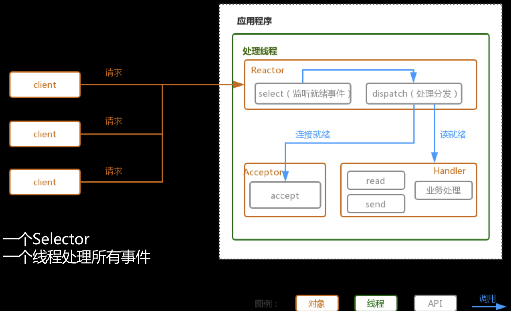
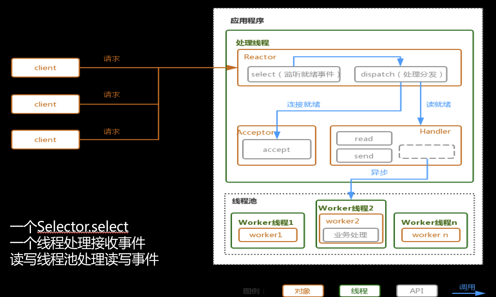
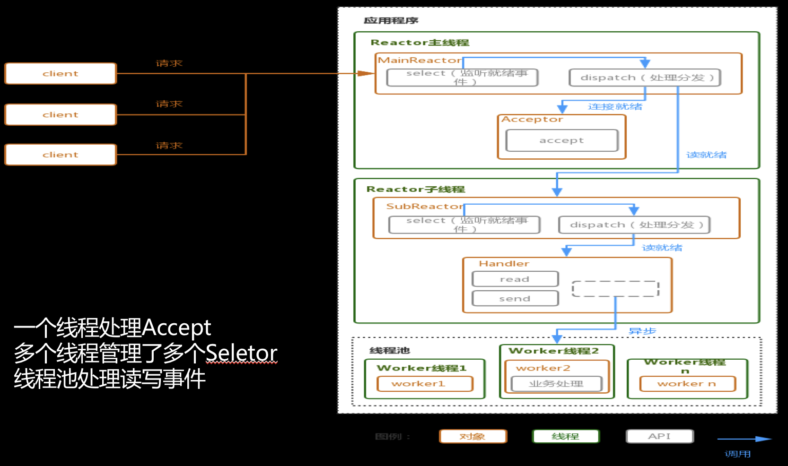
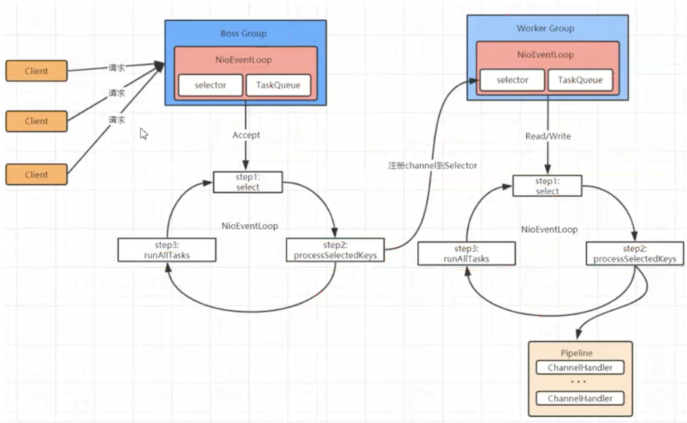

# RPC 实现

# 1、线程模型

## 1.1 阻塞IO模式

```
client-1 --请求--> APP-Handler[连接-read-业务处理-send]
client-2 --请求--> APP-Handler[连接-read-业务处理-send]
client-n --请求--> APP-Handler[连接-read-业务处理-send]
```

采用阻塞IO模式，每个连接都需要独立的线程完成相关处理。当并发数很大时就会创建大量线程，占用很多的系统资源；同时当连接创建后，如果当前线程暂时没有数据需要传输处理，那么该线程会阻塞，造成资源浪费。

## 1.2 Reactor模式

Reactor模式通过一个或多个输入同时传递给服务器的模式，服务端程序处理传入的多个请求，并将他们分派到相应的处理线程，因此Reactor模式也叫Dispatcher模式。

参考：`https://www.cnblogs.com/jing99/p/12498783.html`

### 1.2.1 单线程模式



当一个请求到来时，Reactor会专门接受请求，然后进行判断，如果此请求仅仅是一个连接请求，那么就将此任务分派给Acceptor来处理，否则如果是处理请求，那么就分派给具体的Handler来处理。这里

存在几个问题：

* 性能问题，只有一个线程，无法支撑大量请求
* 可靠性问题，一旦线程异常或进入死循环，会导致整个系统不可用，造成节点障碍

这里通过一个简单的例子进行说明

```java
// 服务端
package io.netty.example.mynio;
import java.io.IOException;
import java.net.InetSocketAddress;
import java.nio.ByteBuffer;
import java.nio.channels.SelectionKey;
import java.nio.channels.Selector;
import java.nio.channels.ServerSocketChannel;
import java.nio.channels.SocketChannel;
import java.nio.charset.StandardCharsets;
import java.util.Iterator;
import java.util.Set;

/**
 * Reactor-单线程
 **/
public class ReactorNioServer {

    public void start(int port) throws IOException {
        ServerSocketChannel serverChannel = ServerSocketChannel.open();
        serverChannel.configureBlocking(false);
        serverChannel.bind(new InetSocketAddress(port));
        Selector selector = Selector.open();
        // 将ServerSocket注册到开关上面，表明接受外部连接
        serverChannel.register(selector, SelectionKey.OP_ACCEPT);

        ByteBuffer writeBuffer = ByteBuffer.allocate(32);
        ByteBuffer readBuffer = ByteBuffer.allocate(32);
        System.out.println("server started");
        for (; ; ) {
            try {
                // 这里是选择ready的key
                selector.select();
            } catch (IOException ex) {
                ex.printStackTrace();
                break;
            }
            System.out.println("some key ready");
            Set<SelectionKey> readyKeys = selector.selectedKeys();
            Iterator<SelectionKey> iter = readyKeys.iterator();
            while (iter.hasNext()) {
                SelectionKey key = iter.next();
                iter.remove();
                try {
                    // 检查事件是否是一个新的已经就绪可以被接受的连接
                    if (key.isAcceptable()) {
                        // 一开始selector上面注册的是服务端的channel
                        ServerSocketChannel server = (ServerSocketChannel) key.channel();
                        SocketChannel client = server.accept();
                        // 将新的socket设置为非阻塞
                        client.configureBlocking(false);
                        // 这里将客户端channel注册到selector上
                        // 这里可以看到和阻塞IO的区别，就是以前阻塞等待变成了注册事件，
                        // 这样就可以一个socket监听多个socket连接
                        client.register(selector, SelectionKey.OP_WRITE | SelectionKey.OP_READ);

                        ByteBuffer buffer = ByteBuffer.allocate(1024);
                        buffer.put("connect succeed\r\n".getBytes(StandardCharsets.UTF_8));
                        buffer.flip();
                        client.write(buffer);
                    }

                    if (key.isReadable()) {
                        // 获取该选择器上的“读就绪”状态的通道
                        SocketChannel client = (SocketChannel) key.channel();
                        readBuffer.clear();
                        int len;
                        StringBuilder content = new StringBuilder();
                        while ((len = client.read(readBuffer)) > 0) {
                            readBuffer.flip();
                            content.append(new String(readBuffer.array(), 0, len,
                                StandardCharsets.UTF_8));
                            readBuffer.clear();
                        }
                        // 当读不到数据时len=0，当客户端关闭时len=-1
                        if (len < 0) {
                            System.out.println("client closed");
                            client.close();
                            key.cancel();
                        } else {
                            System.out.println("accepted data: " + content);
                        }
                        key.interestOps(SelectionKey.OP_WRITE);
                    }

                    if (key.isWritable()) {
                        SocketChannel client = (SocketChannel) key.channel();
                        writeBuffer.clear();
                        // 这里简单做了
                        // 在读取完client数据之后暂时都统一写入一个字符串
                        writeBuffer.put("read success\r\n".getBytes(StandardCharsets.UTF_8));
                        writeBuffer.flip();
                        client.write(writeBuffer);
                        key.interestOps(SelectionKey.OP_READ);
                    }
                } catch (IOException ex) {
                    try {
                        key.channel().close();
                        key.cancel();
                    } catch (IOException e) {
                        // ignore
                    }
                }
            }
        }
    }

    public static void main(String[] args) throws IOException {
        ReactorNioServer server = new ReactorNioServer();
        server.start(8888);
    }
}


// 客户端
package io.netty.example.mynio;

import java.io.IOException;
import java.net.InetSocketAddress;
import java.nio.ByteBuffer;
import java.nio.channels.SocketChannel;
import java.nio.charset.StandardCharsets;
import java.util.Scanner;

/**
 * NIO客户端
 *
 * @author YJ
 * @date 2022/8/26
 **/
public class NIOClient {


    public void start(String ip, int port) {
        SocketChannel client = null;
        ByteBuffer buffer = ByteBuffer.allocate(1024);
        try {
            client = SocketChannel.open();
            client.connect(new InetSocketAddress(ip, port));
            Scanner reader = new Scanner(System.in);
            for (; ; ) {
                // 简单做，就读取一行
                String inputLine = reader.nextLine();
                if (inputLine.equalsIgnoreCase("exit")) {
                    break;
                }
                buffer.clear();
                buffer.put(inputLine.getBytes(StandardCharsets.UTF_8));
                buffer.flip();
                client.write(buffer);
                buffer.clear();

                int len = client.read(buffer);
                if (len == -1) {
                    break;
                }
                buffer.flip();
                byte[] datas = new byte[buffer.remaining()];
                buffer.get(datas);
                System.out.println("from server data: " +
                    new String(datas, StandardCharsets.UTF_8));
                buffer.clear();
            }

        } catch (Exception e) {
            // ignore
        } finally {
            if (client != null) {
                try {
                    client.close();
                } catch (IOException e) {
                    // ignore
                }
            }
        }
    }

    public static void main(String[] args) {
        NIOClient client = new NIOClient();
        client.start("127.0.0.1", 8888);
    }
}
```

从这里可以看到，虽然使用 `selector`进行了连接管理和分发，但是都是在同一个线程中执行的。每次对于准备好了的 `key`都是循环处理，对于多个读写的channel会存在等待的问题，下面使用多线程模型进行优化。

### 1.2.2 多线程模型



这里和单线程模型一样有一个专门的NIO线程---acceptor用于监听连接请求。区别在于具体的处理可以使用标准的线程池，这里要注意，每一个请求的业务处理中包含 `read， 业务处理， send`，这里使用同一个线程。也就是一个NIO线程可以同时处理N条请求链路，但是一个链路请求之对应一个NIO线程，防止并发操作问题。

在绝大多数场景下，Reactor多线程模型都可以满足性能需求；但是，在极特殊应用场景中，一个NIO线程负责监听和处理所有的客户端连接可能会存在性能问题。例如百万客户端并发连接，或者服务端需要对客户端的握手信息进行安全认证，认证本身非常损耗性能。这类场景下，单独一个Acceptor线程可能会存在性能不足问题，为了解决性能问题，产生了第三种Reactor线程模型--主从Reactor多线程模型。

```java
package io.netty.example.mynio;
import java.io.IOException;
import java.net.InetSocketAddress;
import java.nio.ByteBuffer;
import java.nio.channels.SelectionKey;
import java.nio.channels.Selector;
import java.nio.channels.ServerSocketChannel;
import java.nio.channels.SocketChannel;
import java.nio.charset.StandardCharsets;
import java.util.Iterator;
import java.util.Set;
import java.util.concurrent.ExecutorService;
import java.util.concurrent.Executors;

/**
 * Reactor-多线程
 **/
public class MultiReactorNioServer {

    private final ExecutorService pool = Executors.newFixedThreadPool(10);

    public void start(int port) throws IOException {
        ServerSocketChannel serverChannel = ServerSocketChannel.open();
        serverChannel.configureBlocking(false);
        serverChannel.bind(new InetSocketAddress(port));
        Selector selector = Selector.open();
        // 将ServerSocket注册到开关上面，表明接受外部连接
        serverChannel.register(selector, SelectionKey.OP_ACCEPT);

        System.out.println("server started");
        for (; ; ) {
            try {
                if (selector.select() <= 0) {
                    continue;
                }
            } catch (IOException ex) {
                ex.printStackTrace();
                break;
            }
            System.out.println("some key ready");
            Set<SelectionKey> readyKeys = selector.selectedKeys();
            Iterator<SelectionKey> iter = readyKeys.iterator();
            while (iter.hasNext()) {
                SelectionKey key = iter.next();
                iter.remove();
                try {
                    // 检查事件是否是一个新的已经就绪可以被接受的连接
                    if (key.isAcceptable()) {
                        // 一开始selector上面注册的是服务端的channel
                        ServerSocketChannel server = (ServerSocketChannel) key.channel();
                        SocketChannel client = server.accept();
                        // 将新的socket设置为非阻塞
                        client.configureBlocking(false);
                        // 这里将客户端channel注册到selector上
                        // 这里可以看到和阻塞IO的区别，就是以前阻塞等待变成了注册事件，
                        // 这样就可以一个socket监听多个socket连接
                        client.register(selector, SelectionKey.OP_WRITE | SelectionKey.OP_READ);

                        ByteBuffer buffer = ByteBuffer.allocate(1024);
                        buffer.put("connect succeed\r\n".getBytes(StandardCharsets.UTF_8));
                        buffer.flip();
                        client.write(buffer);
                    }

                    if (key.isReadable() || key.isWritable()) {
                        pool.submit(new Handler(selector, (SocketChannel) key.channel(), key));
                    }
                } catch (IOException ex) {
                    try {
                        key.channel().close();
                        key.cancel();
                    } catch (IOException e) {
                        // ignore
                    }
                }
            }
        }
    }

    public static void main(String[] args) throws IOException {
        MultiReactorNioServer server = new MultiReactorNioServer();
        server.start(8888);
    }
}

package io.netty.example.mynio;
import java.nio.ByteBuffer;
import java.nio.channels.SelectionKey;
import java.nio.channels.Selector;
import java.nio.channels.SocketChannel;
import java.nio.charset.StandardCharsets;
import java.util.concurrent.Callable;

/**
 * 处理类
 **/
public class Handler implements Callable {

    private final Selector selector;

    private final SocketChannel socketChannel;

    private final SelectionKey key;

    ByteBuffer writeBuffer = ByteBuffer.allocate(32);
    ByteBuffer readBuffer = ByteBuffer.allocate(32);

    public Handler(Selector selector, SocketChannel socketChannel, SelectionKey key) {
        this.selector = selector;
        this.socketChannel = socketChannel;
        this.key = key;
    }

    @Override
    public Object call() throws Exception {
        if (!key.isReadable() && !key.isWritable()) {
            return null;
        }

        if (key.isReadable()) {
            // 获取该选择器上的“读就绪”状态的通道
            SocketChannel client = (SocketChannel) key.channel();
            readBuffer.clear();
            int len;
            StringBuilder content = new StringBuilder();
            while ((len = client.read(readBuffer)) > 0) {
                readBuffer.flip();
                content.append(new String(readBuffer.array(), 0, len, StandardCharsets.UTF_8));
                readBuffer.clear();
            }
            // 当读不到数据时len=0，当客户端关闭时len=-1
            if (len < 0) {
                System.out.println("client closed");
                client.close();
                key.cancel();
            } else {
                System.out.println("accepted data: " + content);
            }
            key.interestOps(SelectionKey.OP_WRITE);
        }

        if (key.isWritable()) {
            SocketChannel client = (SocketChannel) key.channel();
            writeBuffer.clear();
            // 这里简单做了
            // 在读取完client数据之后暂时都统一写入一个字符串
            writeBuffer.put("read success\r\n".getBytes(StandardCharsets.UTF_8));
            writeBuffer.flip();
            client.write(writeBuffer);
            key.interestOps(SelectionKey.OP_READ);
        }

        return null;
    }
}
```

这里可以看到，我们将具体的读写操作放在了线程池中进行处理，这样读写操作就不存在等待的情况。但是我们可以发现，接收客户端连接请求和处理连接请求的具体逻辑还是在一个线程中。


### 1.2.3 主从多线程模型



这种模型中，服务端用于接收客户端连接的不再是1个单独的NIO线程，而是一个独立的NIO线程池（也就是说一个Reactor主线程对应多个Reactor子线程）。Acceptor接收到客户端TCP连接请求处理完成后（可能包含接入认证等），将新创建的SocketChannel注册到I/O线程池（sub reactor线程池）的某个I/O线程上，由它负责SocketChannel的读写和编解码工作。也就是 `1+M+N`的模式，一个主线程，M个子线程，N个worker线程。

Acceptor线程池只用于客户端的登录、握手和安全认证，一旦链路建立成功，就将链路注册到后端subReactor线程池的I/O线程上，有I/O线程负责后续的I/O操作。

第三种模型比起第二种模型，是将Reactor分成两部分，mainReactor负责监听server socket，accept新连接，并将建立的socket分派给subReactor。subReactor负责多路分离已连接的socket，读写网络数据，对业务处理功能，其扔给worker线程池完成。通常，subReactor个数上可与CPU个数等同。

```java
package io.netty.example.mynio;
import java.io.IOException;
import java.net.InetSocketAddress;
import java.nio.channels.SelectionKey;
import java.nio.channels.Selector;
import java.nio.channels.ServerSocketChannel;
import java.nio.channels.SocketChannel;
import java.util.ArrayList;
import java.util.Iterator;
import java.util.List;
import java.util.Set;

/**
 * Reactor-主从多线程-主reactor
 *
 **/
public class MasterReactorNioServer {

    private List<SlaveReactorNioServer> slaves = new ArrayList<>(
        Runtime.getRuntime().availableProcessors()
    );

    public void start(int port) throws IOException {
        ServerSocketChannel serverChannel = ServerSocketChannel.open();
        serverChannel.configureBlocking(false);
        serverChannel.bind(new InetSocketAddress(port));
        Selector selector = Selector.open();
        // 将ServerSocket注册到开关上面，表明接受外部连接
        serverChannel.register(selector, SelectionKey.OP_ACCEPT);

        System.out.println("server started");
        for (; ; ) {
            try {
                if (selector.select() < 0) {
                    continue;
                }
            } catch (IOException ex) {
                ex.printStackTrace();
                break;
            }
            System.out.println("some key ready");
            Set<SelectionKey> readyKeys = selector.selectedKeys();
            Iterator<SelectionKey> iter = readyKeys.iterator();
            while (iter.hasNext()) {
                SelectionKey key = iter.next();
                iter.remove();
                SlaveReactorNioServer slave = new SlaveReactorNioServer();
                try {
                    // 检查事件是否是一个新的已经就绪可以被接受的连接
                    if (key.isAcceptable()) {
                        // 一开始selector上面注册的是服务端的channel
                        ServerSocketChannel server = (ServerSocketChannel) key.channel();
                        SocketChannel client = server.accept();
                        // 将新的socket设置为非阻塞
                        client.configureBlocking(false);

                        slave.register(client);
                        slaves.add(slave);
                    }
                } catch (IOException ex) {
                    try {
                        slaves.remove(slave);
                        key.channel().close();
                        key.cancel();
                    } catch (IOException e) {
                        // ignore
                    }
                }
            }
        }
    }

    public static void main(String[] args) throws IOException {
        MasterReactorNioServer server = new MasterReactorNioServer();
        server.start(8888);
    }
}


package io.netty.example.mynio;

import java.io.IOException;
import java.nio.ByteBuffer;
import java.nio.channels.ClosedChannelException;
import java.nio.channels.SelectionKey;
import java.nio.channels.Selector;
import java.nio.channels.SocketChannel;
import java.nio.charset.StandardCharsets;
import java.util.Iterator;
import java.util.Set;
import java.util.concurrent.ExecutorService;
import java.util.concurrent.Executors;

/**
 * Reactor-主从多线程-从reactor
 **/
public class SlaveReactorNioServer {

    private Selector selector;

    private final ByteBuffer writeBuffer = ByteBuffer.allocate(32);
    private final ByteBuffer readBuffer = ByteBuffer.allocate(32);

    private static ExecutorService pool = Executors.newFixedThreadPool(
        2 * Runtime.getRuntime().availableProcessors());

    public void register(SocketChannel socketChannel) throws ClosedChannelException {
        socketChannel.register(selector, SelectionKey.OP_READ | SelectionKey.OP_WRITE);
    }

    public SlaveReactorNioServer() throws IOException {
        // 这里新开一个selector
        selector = Selector.open();
        this.select();
    }

    public void wakeup() {
        this.selector.wakeup();
    }

    public void select() {
        pool.submit(() -> {
            while (true) {
                if (selector.select(500) <= 0) {
                    continue;
                }
                Set<SelectionKey> keys = selector.selectedKeys();
                Iterator<SelectionKey> iterator = keys.iterator();
                while (iterator.hasNext()) {
                    SelectionKey key = iterator.next();
                    iterator.remove();

                    if (key.isReadable()) {
                        // 获取该选择器上的“读就绪”状态的通道
                        SocketChannel client = (SocketChannel) key.channel();
                        readBuffer.clear();
                        int len;
                        StringBuilder content = new StringBuilder();
                        while ((len = client.read(readBuffer)) > 0) {
                            readBuffer.flip();
                            content.append(
                                new String(readBuffer.array(), 0, len, StandardCharsets.UTF_8));
                            readBuffer.clear();
                        }
                        // 当读不到数据时len=0，当客户端关闭时len=-1
                        if (len < 0) {
                            System.out.println("client closed");
                            client.close();
                            key.cancel();
                        } else {
                            System.out.println("accepted data: " + content);
                        }
                        key.interestOps(SelectionKey.OP_WRITE);
                    }

                    if (key.isWritable()) {
                        SocketChannel client = (SocketChannel) key.channel();
                        writeBuffer.clear();
                        // 这里简单做了
                        // 在读取完client数据之后暂时都统一写入一个字符串
                        writeBuffer.put("read success\r\n".getBytes(StandardCharsets.UTF_8));
                        writeBuffer.flip();
                        client.write(writeBuffer);
                        key.interestOps(SelectionKey.OP_READ);
                    }
                }
            }
        });

    }
}

```

这里要关注的重点是，当 `master-reactor`监听到连接之后，将这个连接交给 `slave-reactor`进行后续的操作，而 `slave-reactor`单独使用一个selector来管理这个连接。所有的 `selector`处理都是在线程池中处理。当然和上面图中显示有点区别，就是没有再为读写创建一个线程池，如果要用也是可以的。

上面的例子比较简陋，这里只是作为一个说明的简单例子。


### 1.2.4 netty 线程模型

`netty`的线程模型就是在上面模型基础上改进过来的，如图



这里 `BossGroup`和 `WorkGroup`可以简单理解为线程池，其中都会有 `NioEventLoop`线程，每个线程中会有 `Selector`和 `TaskQueue`。对于 `BossGroup`来说，如果接收到的请求是连接，那么首先会处理请求，并将连接注册到 `WorkGroup`上面，然后循环从队列 `TaskQueue`获取其他请求进行处理。而 `WorkGroup`中 `Selector`会处理相关开关，实际读写处理由相关 `Pipeline`中的 `handler`来处理，同样，也是循环从队列取出任务进行处理。

# 2、RPC框架

`RPC`全称是远程过程调用，借助 `RPC`可以做到像调用本地方法一样调用远程服务，是一种进程间的通信方式。比较主流的有 `Dubbo，Spring-Eureka，gRpc`。

# 3、一个简单的rpc框架实现

工程基本结构

```
spring-rpc
|_spring-rpc-api
|_spring-rpc-client
|_spring-rpc-server


```

```xml
<?xml version="1.0" encoding="UTF-8"?>
<project xmlns="http://maven.apache.org/POM/4.0.0"
  xmlns:xsi="http://www.w3.org/2001/XMLSchema-instance"
  xsi:schemaLocation="http://maven.apache.org/POM/4.0.0 https://maven.apache.org/xsd/maven-4.0.0.xsd">

    <modelVersion>4.0.0</modelVersion>
    <packaging>pom</packaging>
    <groupId>win.iot4yj</groupId>
    <artifactId>spring-rpc</artifactId>
    <version>0.0.1-SNAPSHOT</version>
    <name>spring-rpc</name>
    <description>spring-rpc</description>

    <parent>
        <groupId>org.springframework.boot</groupId>
        <artifactId>spring-boot-starter-parent</artifactId>
        <version>2.6.6</version>
        <relativePath/>
    </parent>

    <modules>
        <module>spring-rpc-server</module>
        <module>spring-rpc-client</module>
        <module>spring-rpc-api</module>
    </modules>

    <properties>
        <java.version>1.8</java.version>
    </properties>

    <dependencies>
        <dependency>
            <groupId>org.springframework.boot</groupId>
            <artifactId>spring-boot-starter-web</artifactId>
        </dependency>
        <dependency>
            <groupId>org.springframework.boot</groupId>
            <artifactId>spring-boot-starter</artifactId>
        </dependency>
        <dependency>
            <groupId>org.springframework.boot</groupId>
            <artifactId>spring-boot-starter-test</artifactId>
            <scope>test</scope>
        </dependency>
    </dependencies>

    <build>
        <plugins>
            <plugin>
                <groupId>org.springframework.boot</groupId>
                <artifactId>spring-boot-maven-plugin</artifactId>
            </plugin>
        </plugins>
    </build>
</project>

```

## 3.1 公共api模块

```xml
<?xml version="1.0" encoding="UTF-8"?>
<project xmlns="http://maven.apache.org/POM/4.0.0"
  xmlns:xsi="http://www.w3.org/2001/XMLSchema-instance"
  xsi:schemaLocation="http://maven.apache.org/POM/4.0.0 https://maven.apache.org/xsd/maven-4.0.0.xsd">

    <parent>
        <groupId>win.iot4yj</groupId>
        <artifactId>spring-rpc</artifactId>
        <version>0.0.1-SNAPSHOT</version>
    </parent>

    <modelVersion>4.0.0</modelVersion>
    <artifactId>spring-rpc-api</artifactId>
    <version>0.0.1-SNAPSHOT</version>
    <name>spring-rpc-api</name>
    <description>spring-rpc-api</description>

    <dependencies>
        <dependency>
            <groupId>com.google.guava</groupId>
            <artifactId>guava</artifactId>
            <version>23.0</version>
        </dependency>
        <dependency>
            <groupId>com.google.code.gson</groupId>
            <artifactId>gson</artifactId>
        </dependency>
    </dependencies>
</project>
```

rpc服务涉及的请求方和响应方需要使用同一套请求和响应报文

```java
package win.iot4yj.common;
public class RpcRequest {

    private String requestId;

    private String className;

    private String methodName;

    private Class<?>[] paramTypes;

    private Object[] paramValues;
}
public class RpcResponse {

    private String requestId;

    private String retCode;

    private String retMsg;

    private Object result;

    private String error;
}
```

然后创建一个简单的服务，用于后面验证

```java
package win.iot4yj.api;
import win.iot4yj.pojo.User;

public interface UserService {
    User getById(int id);
}

package win.iot4yj.pojo;
/**
 * 用户信息
 **/
public class User {
    private int id;
    private String name;
}
```

这里只是定义了api，具体的服务实现要交给服务端来实现

## 3.2 服务端

```properties
## application.properties

server.port=8081
```

```xml
<?xml version="1.0" encoding="UTF-8"?>
<project xmlns="http://maven.apache.org/POM/4.0.0"
  xmlns:xsi="http://www.w3.org/2001/XMLSchema-instance"
  xsi:schemaLocation="http://maven.apache.org/POM/4.0.0 https://maven.apache.org/xsd/maven-4.0.0.xsd">

    <parent>
        <groupId>win.iot4yj</groupId>
        <artifactId>spring-rpc</artifactId>
        <version>0.0.1-SNAPSHOT</version>
    </parent>

    <modelVersion>4.0.0</modelVersion>
    <artifactId>spring-rpc-server</artifactId>
    <version>0.0.1-SNAPSHOT</version>
    <name>spring-rpc-server</name>
    <description>spring-rpc-server</description>

    <dependencies>
        <dependency>
            <groupId>win.iot4yj</groupId>
            <artifactId>spring-rpc-api</artifactId>
            <version>0.0.1-SNAPSHOT</version>
        </dependency>

        <dependency>
            <groupId>com.google.code.gson</groupId>
            <artifactId>gson</artifactId>
            <version>2.8.9</version>
        </dependency>

        <dependency>
            <groupId>io.netty</groupId>
            <artifactId>netty-all</artifactId>
            <version>4.1.66.Final</version>
        </dependency>
        <dependency>
            <groupId>com.alibaba</groupId>
            <artifactId>fastjson</artifactId>
            <version>1.2.76</version>
            <scope>compile</scope>
        </dependency>
    </dependencies>

</project>
```

和基本的netty服务收发一样，需要创建一个netty服务类

```java
package win.iot4yj.server;
/**
 * 服务端
 **/
@Component
public class RpcServer implements DisposableBean {

    @Autowired
    private RpcServerHandler rpcServerHandler;

    EventLoopGroup bossGroup = null;
    EventLoopGroup workerGroup = null;

    public void start(String ip, int port) throws Exception {
        try {
            bossGroup = new NioEventLoopGroup(1);
            workerGroup = new NioEventLoopGroup(8);

            ServerBootstrap bootstrap = new ServerBootstrap();
            bootstrap.group(bossGroup, workerGroup)
                .channel(NioServerSocketChannel.class)
                .childHandler(new ChannelInitializer<SocketChannel>() {

                    @Override
                    protected void initChannel(SocketChannel socketChannel) throws Exception {
                        socketChannel.pipeline()
                            .addLast(new StringEncoder())
                            .addLast(new StringDecoder())
                            // 添加自己的处理器
                            .addLast(rpcServerHandler);
                    }
                });

            ChannelFuture channelFuture = bootstrap.bind(ip, port).sync();
            System.out.println("rpc服务启动成功, ip: " + ip + ", port: " + port);
            channelFuture.channel().closeFuture().sync();
        } catch (InterruptedException e) {
            e.printStackTrace();
            destroy();
        }
    }

    @Override
    public void destroy() throws Exception {
        if (Objects.nonNull(bossGroup)) {
            bossGroup.shutdownGracefully();
        }
        if (Objects.nonNull(workerGroup)) {
            workerGroup.shutdownGracefully();
        }
    }
}

```

这和之前的基本例子是类似的，我们实现的rpc通过json字符串传递，需要实现相关转换，可以直接使用自带的字符串转换工具，但是具体的报文转换还需要我们自己实现

```java
package win.iot4yj.server.handler;
/**
 * 服务端 handler
 **/
@Component
@Sharable// 设置通道共享
public class RpcServerHandler extends SimpleChannelInboundHandler<String>
    implements ApplicationContextAware {

    private static Map<String, Object> RPC_SERVICE_MAP = new HashMap<>(16);

    /**
     * 实现ApplicationContextAware之后就可以获取到所有使用特定注解标识的bean
     */
    @Override
    public void setApplicationContext(ApplicationContext applicationContext) throws BeansException {
        // 从applicationContext容器中获取所有到rpc服务
        Map<String, Object> rpcBeanMap = applicationContext.getBeansWithAnnotation(
            RpcService.class);

        for (Entry<String, Object> entry : rpcBeanMap.entrySet()) {
            Object bean = entry.getValue();

            if (Objects.isNull(bean) || bean.getClass().getInterfaces().length == 0) {
                throw new RuntimeException("bean为空，或者service未实现相关接口");
            }

            // 取实现的第一个接口，这里就是一个默认操作，也就是使用类继承的第一个接口
            // 作为bean的名字
            Class<?> rpcServiceInterface = bean.getClass().getInterfaces()[0];
            // 使用接口名字作为key
            RPC_SERVICE_MAP.put(rpcServiceInterface.getName(), bean);

            System.out.println("当前已加载的服务: " + RPC_SERVICE_MAP.toString());
        }
    }

    /**
     * 接收到请求信息
     */
    @Override
    protected void channelRead0(ChannelHandlerContext channelHandlerContext, String clientMsg)
        throws Exception {

        RpcRequest rpcRequest = JSON.parseObject(clientMsg, RpcRequest.class);
        String requestId = rpcRequest.getRequestId();
        RpcResponse rpcResponse = new RpcResponse();
        rpcResponse.setRequestId(requestId);

        try {
            rpcResponse.setResult(this.handle(rpcRequest));
        } catch (Exception e) {
            e.printStackTrace();
            rpcResponse.setRetCode("9999");
            rpcResponse.setRetMsg("调用异常");
        }

        channelHandlerContext.writeAndFlush(JSON.toJSONString(rpcResponse));
    }

    private Object handle(RpcRequest rpcRequest) throws InvocationTargetException {
        String serviceName = rpcRequest.getClassName();
        Object serviceBean = RPC_SERVICE_MAP.get(serviceName);
        if (Objects.isNull(serviceBean)) {
            throw new RuntimeException("该服务可能未实现: " + serviceName);
        }

        String methodName = rpcRequest.getMethodName();
        // 这是cglib的一个工具类
        FastClass proxyClass = FastClass.create(serviceBean.getClass());
        FastMethod method = proxyClass.getMethod(methodName, rpcRequest.getParamTypes());
        return method.invoke(serviceBean, rpcRequest.getParamValues());
    }
}

```

这里的处理主要是将接受到的请求报文解析出来，找到对应的处理业务实现，然后将其响应进行处理，换行成json字符串返回给请求方。

那这里就有个问题了，我们解析出来的的报文中我们获得了实际处理的业务类，我们需要获取到此实现的bean来进行处理。从上面的handle方法可以看到，首先是从缓存中获取到bean，然后进行处理。

而这个处理类实现了ApplicationContextAware类，此时我们可以获取到ApplicationContext，于是可以获取到所有的bean。但是并不是所有的bean我们都需要，那如何识别呢？这里我们定义一个特殊的注解，获取bean的时候只获取带此注解的bean

```java
Map<String, Object> rpcBeanMap = applicationContext.getBeansWithAnnotation(
            RpcService.class);
```

```java
package win.iot4yj.server.annotation;
/**
 * 用于暴露服务接口
 */
@Target(ElementType.TYPE)// 作用于类上
@Retention(RetentionPolicy.RUNTIME) // 运行时
public @interface RpcService {
}
```

然后我们需要启动服务端的服务，这里一个是项目基本运行的服务，另外一个是netty服务，专门用户相关请求响应的收发

```java
package win.iot4yj;

@SpringBootApplication
public class SpringRpcServerApplication implements CommandLineRunner {

    @Autowired
    private RpcServer rpcServer;

    public static void main(String[] args) {
        SpringApplication.run(SpringRpcServerApplication.class, args);

    }

    /**
     * 通过实现CommandLineRunner的run方法来在启动springboot应用的时候启动netty服务器
     */
    @Override
    public void run(String... args) throws Exception {
        // 这里在启动的时候就会 hold 住
        new Thread(() -> {
            try {
                rpcServer.start("127.0.0.1", 8888);
            } catch (Exception e) {
                e.printStackTrace();
            }
        }).start();
    }
}
```

然后定义一个基本的业务实现类

```java
package win.iot4yj.server.service.impl;
/**
 * 用户业务类
 **/
@Service
@RpcService
public class UserServiceImpl implements UserService {

    private static Map<Integer, User> USER_MAP = new HashMap<>(8);

    static {
        USER_MAP.put(1, new User(1, "张三"));
        USER_MAP.put(2, new User(2, "李四"));
        USER_MAP.put(3, new User(3, "王武"));
    }

    @Override
    public User getById(int id) {
        return USER_MAP.get(id);
    }
}
```

## 3.3 客户端

```xml
<?xml version="1.0" encoding="UTF-8"?>
<project xmlns="http://maven.apache.org/POM/4.0.0"
  xmlns:xsi="http://www.w3.org/2001/XMLSchema-instance"
  xsi:schemaLocation="http://maven.apache.org/POM/4.0.0 https://maven.apache.org/xsd/maven-4.0.0.xsd">

    <parent>
        <groupId>win.iot4yj</groupId>
        <artifactId>spring-rpc</artifactId>
        <version>0.0.1-SNAPSHOT</version>
    </parent>

    <modelVersion>4.0.0</modelVersion>
    <artifactId>spring-rpc-client</artifactId>
    <version>0.0.1-SNAPSHOT</version>
    <name>spring-rpc-client</name>
    <description>spring-rpc-client</description>

    <dependencies>
        <dependency>
            <groupId>win.iot4yj</groupId>
            <artifactId>spring-rpc-api</artifactId>
            <version>0.0.1-SNAPSHOT</version>
        </dependency>

        <dependency>
            <groupId>com.google.code.gson</groupId>
            <artifactId>gson</artifactId>
            <version>2.8.9</version>
        </dependency>

        <dependency>
            <groupId>io.netty</groupId>
            <artifactId>netty-all</artifactId>
            <version>4.1.66.Final</version>
        </dependency>
        <dependency>
            <groupId>com.alibaba</groupId>
            <artifactId>fastjson</artifactId>
            <version>1.2.76</version>
        </dependency>
    </dependencies>

</project>
```

```properties
server.port=8088
```

客户端相对复杂点，首先我们要接受外界的请求调用

```java
package win.iot4yj.controller;
/**
 * 用户控制类
 **/
@RestController
@RequestMapping("/user")
public class UserController {

    @RpcReference
    UserService userService;

    @RequestMapping("/getUserById")
    public User getUserById(int id) {
        System.out.println("收到请求");
        return userService.getById(id);
    }
}
```

从这里可以看到，我们收到请求之后交给UserService进行处理去了，但是这里却并没有实现，而是要交给远程服务来处理，于是使用注解RpcReference进行标识

```java
package win.iot4yj.client.anno;
/**
 * 引用代理类
 **/
@Target(ElementType.FIELD) // 作用于字段
@Retention(RetentionPolicy.RUNTIME) // 运行时
public @interface RpcReference {
}
```

和之前一样，需要实现netty服务

```java
package win.iot4yj.client;
/**
 * 客户端: 1、连接服务器（spring启动后就需要进行连接） 2、关闭资源 3、提供发送消息的方法
 **/
@Component
public class RpcClient implements DisposableBean {

    ExecutorService service = Executors.newCachedThreadPool();

    EventLoopGroup group = null;
    Channel channel = null;

    @Autowired
    RpcClientHandler rpcClientHandler;

    public void start(String ip, int port) throws Exception {
        try {
            group = new NioEventLoopGroup(1);
            Bootstrap bootstrap = new Bootstrap();
            bootstrap
                .group(group)
                .channel(NioSocketChannel.class)
                .handler(new ChannelInitializer<SocketChannel>() {
                    @Override
                    protected void initChannel(SocketChannel socketChannel) throws Exception {
                        socketChannel.pipeline()
                            .addLast(new StringEncoder())
                            .addLast(new StringDecoder())
                            // 添加自己的处理器
                            .addLast(rpcClientHandler);
                    }
                });

            ChannelFuture channelFuture = bootstrap.connect(ip, port).sync();
            System.out.println("rpc客户端启动成功, ip: " + ip + ", port: " + port);
            channel = channelFuture.channel();
            channel.closeFuture().sync();
        } catch (InterruptedException e) {
            e.printStackTrace();
            destroy();
        }
    }

    /**
     * 消息发送
     */
    public Object send(String msg) throws ExecutionException, InterruptedException {
        rpcClientHandler.setReqMsg(msg);
        // 这里通过线程池去执行，而发送方法是同步的
        return service.submit(rpcClientHandler).get();
    }


    @Override
    public void destroy() throws Exception {
        if (Objects.nonNull(channel)) {
            channel.close();
        }
        if (Objects.nonNull(group)) {
            group.shutdownGracefully();
        }
    }
}
```

具体的处理实现

```java
package win.iot4yj.client.handler;
/**
 * 客户端处理
 **/
@Component
public class RpcClientHandler extends SimpleChannelInboundHandler<String> implements Callable {

    private ChannelHandlerContext context;
    private String reqMsg;
    private String respMsg;

    /**
     * 通道读取就绪事件，读取服务端消息
     */
    @Override
    protected synchronized void channelRead0(ChannelHandlerContext channelHandlerContext, String msg)
        throws Exception {
        respMsg = msg;
        // 当收到响应消息之后进行唤醒
        notify();
    }

    /**
     * 通道连接就绪事件，这里只是连接上服务端，而真正要发送数据需要前端触发才行
     */
    @Override
    public void channelActive(ChannelHandlerContext ctx) throws Exception {
        context = ctx;
    }

    /**
     * 给服务端发送消息
     */
    @Override
    public synchronized Object call() throws Exception {
        // 数据发送之后需要等待响应
        context.writeAndFlush(reqMsg);
        wait();
        return respMsg;
    }

    public void setReqMsg(String reqMsg) {
        this.reqMsg = reqMsg;
    }
}
```

由于相关请求需要远程服务来进行处理，所以需要对这类服务进行识别，然后进行代理

```java
package win.iot4yj.client.processor;
/**
 * bean后置增强
 **/
@Component
public class MyBeanPostProcessor implements BeanPostProcessor {

    private final RpcClientProxy rpcClientProxy;

    @Lazy
    public MyBeanPostProcessor(RpcClientProxy rpcClientProxy) {
        this.rpcClientProxy = rpcClientProxy;
    }

    /**
     * 完成自定义注解的注入，此方法会针对所有的bean进行处理
     */
    @Override
    public Object postProcessAfterInitialization(Object bean, String beanName)
        throws BeansException {
        // 获取bean包含的所有属性字段
        Field[] declaredFields = bean.getClass().getDeclaredFields();
        for (Field field : declaredFields) {
            field.setAccessible(true);
            RpcReference annotation = field.getAnnotation(RpcReference.class);
            if (Objects.nonNull(annotation)) {
                // 如果不为空，则获取代理对象
                Object proxy = rpcClientProxy.getProxy(field.getType());
                try {
                    // 将引用设置为一个新value
                    field.set(bean, proxy);
                } catch (Exception e) {
                    e.printStackTrace();
                }
            }
        }
        return bean;
    }
}
```

这里实现了自定义的BeanPostProcessor类，可以对bean进行增强。从每个bean中获取所有属性，然后从中过滤出需要进行代理的服务。

```java
package win.iot4yj.client.proxy;
/**
 * 客户端代理类
 **/
@Component
public class RpcClientProxy {

    ConcurrentHashMap<Class, Object> SERVICE_PROXY = new ConcurrentHashMap<>();

    @Autowired
    RpcClient rpcClient;

    /**
     * 获取代理对象
     */
    public Object getProxy(Class serviceClass) {

        Object proxy = SERVICE_PROXY.get(serviceClass);

        if (Objects.nonNull(proxy)) {
            return proxy;
        }

        proxy = Proxy.newProxyInstance(this.getClass().getClassLoader(),
            new Class[]{serviceClass},
            new InvocationHandler() {
                @Override
                public Object invoke(Object proxy, Method method, Object[] args) throws Throwable {
                    // 封装请求对象
                    RpcRequest req = new RpcRequest();
                    req.setRequestId(UUID.randomUUID().toString());
                    req.setClassName(method.getDeclaringClass().getName());
                    req.setMethodName(method.getName());
                    req.setParamTypes(method.getParameterTypes());
                    req.setParamValues(args);

                    try {
                        // 发送消息
                        Object respMsg = rpcClient.send(JSON.toJSONString(req));
                        // 将消息进行转换
                        RpcResponse rpcResp = JSON.parseObject((String) respMsg, RpcResponse.class);
                        if (Objects.nonNull(rpcResp.getError())) {
                            throw new RuntimeException(rpcResp.getError());
                        }
                        if (Objects.nonNull(rpcResp.getResult())) {
                            return JSON.parseObject(rpcResp.getResult().toString(),
                                method.getReturnType());
                        }
                        return null;
                    } catch (Exception e) {
                        e.printStackTrace();
                        throw e;
                    }
                }
            }
        );
        SERVICE_PROXY.put(serviceClass, proxy);
        return proxy;
    }
}
```

最后看下启动类

```java
package win.iot4yj;

@SpringBootApplication
public class SpringRpcClientApplication implements CommandLineRunner {

    @Autowired
    private RpcClient rpcClient;

    public static void main(String[] args) {
        SpringApplication.run(SpringRpcClientApplication.class, args);
    }

    /**
     * 通过实现CommandLineRunner的run方法来在启动springboot应用的时候启动netty服务器
     */
    @Override
    public void run(String... args) throws Exception {
        // 这里在启动的时候就会 hold 住
        new Thread(() -> {
            try {
                rpcClient.start("127.0.0.1", 8888);
            } catch (Exception e) {
                e.printStackTrace();
            }
        }).start();
    }
}
```

测试

```http
http://localhost:8088/user/getUserById?id=2
```
