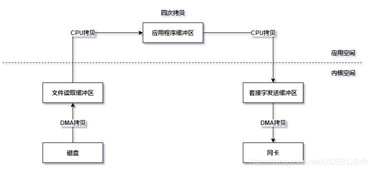
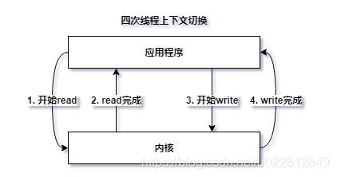
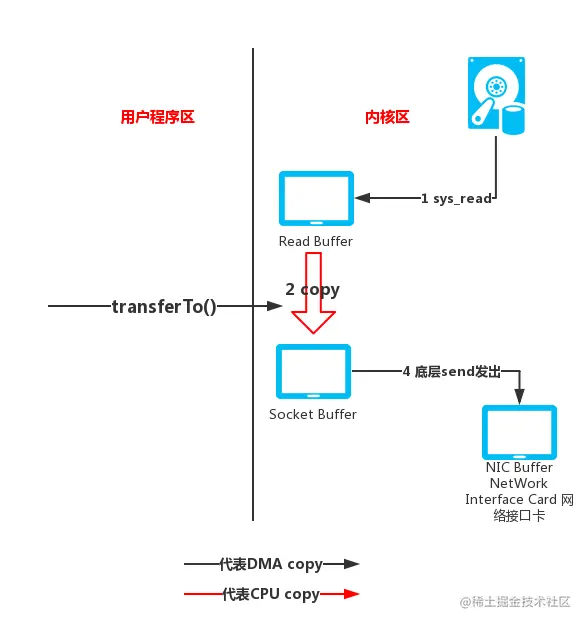
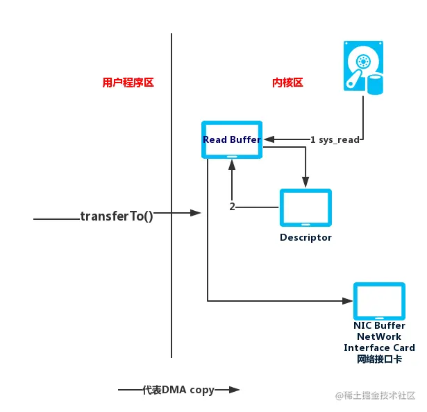

# 1. NIO解析

Netty底层是基于NIO实现的，所以需要先对NIO进行详细分析，这对后面理解Netty对相关逻辑非常有帮助

参考

[知秋大佬相关文章](https://juejin.cn/post/6844903776818561032#heading-27)

[零拷贝技术的原理与在java中应用](https://blog.csdn.net/u022812849/article/details/109805403)

[聊聊 Netty 那些事儿之从内核角度看 IO 模型](https://heapdump.cn/article/4123918)

## 1.1 相关前置知识

### 1.1.1 零拷贝

`NIO` 中的零拷贝不是说不拷贝，而是说可以减少相关拷贝。这里涉及到两个类 `DirectByteBuffery`与 `MappedByteBuffer`。其中前者继承后者前者，这里涉及到内存映射和直接传输。

**先看普通的网络请求中相关数据传输逻辑**



这里涉及两次用户态和内核态的转换，也就是两次系统调用，和四次上下文切换，一次系统调用涉及两次线程上下文切换。

四次线程上下文切换



四次拷贝

> 1、磁盘文件读取到 `OS`内核缓冲区
>
> 2、内核缓冲区拷贝到应用（`jvm`堆）缓冲区
>
> 3、应用缓冲区到 `socket`缓冲区（内核中）
>
> 4、socket缓冲区拷贝到网卡进行发送

**内存映射**

内核缓冲区和应用缓冲区映射到同一块物理内存区，这样就减少了一次拷贝，直接从磁盘文件拷贝到了应用缓冲区。也就是常说的 `mmap`方式

于是传输流程就变成了如下方式



**直接传输**

在 `Linux2.4`以后的版本又进行了改善，将 `socket buffer` 不再是一个缓冲区了，替换为了一个文件描述符，描述的是数据在内核缓冲区的数据从哪里开始，长度是多少，里面基本上不存储数据，大部分是指针，然后协议引擎 `protocol engine `（这里是 `NIC `）也是通过 `DMA `拷贝的方式从文件描述符读取。也就是说用户程序执行 `transferTo()`方法后，导致一次系统调用，从用户态切换到内核态。内在会通过 `DMA `将数据从磁盘中拷贝到 `Read buffer `。用一个文件描述符标记此次待传输数据的地址以及长度，`DMA `直接把数据从 `Read buffer `传输到 `NIC buffer `。数据拷贝过程都不用 `CPU`干预了。这里一共只有两次拷贝和两次上下文切换。



以上可以通过相关方法可知

```java
// FileChannel#transferTo

// 实际执行 FileChannelImpl#transferTo
public long transferTo(long position, long count, WritableByteChannel target) throws IOException {
    ...
    //当前文件大小
    long sz = size();
    if (position > sz)
        return 0;
    int icount = (int)Math.min(count, Integer.MAX_VALUE);
    //可传大小修正
    if ((sz - position) < icount)
        icount = (int)(sz - position);
    long n;
    // 若内核支持则使用直接传输
    if ((n = transferToDirectly(position, icount, target)) >= 0)
        return n;
    // 尝试内存映射文件传输
    if ((n = transferToTrustedChannel(position, icount, target)) >= 0)
        return n;
    // 慢速传输
    return transferToArbitraryChannel(position, icount, target);
}
```

这里可以看到，具体使用哪种方式取决于所在系统是否支持。同时第二种内存映射方式中涉及到内核缓冲区，我们写代码 `new byte[] `数组时，一般是都是“随意” 创建一个“任意大小”的数组。比如，`new byte[128]、new byte[1024]、...`

但是，对于硬盘块的读取而言，每次访问硬盘读数据时，并不是读任意大小的数据的，而是：每次读一个硬盘块或者若干个硬盘块(这是因为访问硬盘操作代价是很大的)。 因此，就需要有一个“中间缓冲区”--即内核缓冲区。先把数据从硬盘读到内核缓冲区中，然后再把数据从内核缓冲区搬到用户缓冲区。

在进行数据拷贝时，如果我们从内核缓冲区中直接命中了需要的数据，那么就直接返回了，不需要再从磁盘中拷贝了，否则没有命中，则需要从磁盘中请求 `page`，并同时读取紧随其后的几个 `page `（相当于一个预读取），所以这样我们说内核缓冲可以提升效率。但是在第一种方式中涉及拷贝次数太多，则效率相比起 `mmap`又显得低的原因。

同时还可以注意到，`mmap`这种方式由于涉及内核缓冲区，那么针对小文件的效率就很高了，但是其大小不会很大，如果文件很大的话，使用直接传输的方式效率更高。

最后 `DirectByteBuffery`与 `MappedByteBuffer`的区别就显而易见了，前者封装了直接传输操作，而后者封装的是 `mmap`，也就是只能进行文件 `IO `操作。`MappedByteBuffer `是根据 `mmap `产生的映射缓冲区，这部分缓冲区被映射到对应的文件页上，通过 `MappedByteBuffer`可以直接操作映射缓冲区，而这部分缓冲区又被映射到文件页上，操作系统通过对应内存页的调入和调出完成文件的写入和写出。

# 2 基本阻塞IO分析

```java
package io.netty.example.mynio;
/**
 * 阻塞IO服务端
 **/
public class BIOServer {

    private boolean stopFlag = false;

    public static void main(String[] args) throws InterruptedException {
        BIOServer bioServer = new BIOServer();
        bioServer.start(8888);
        Thread.sleep(1 * 60 * 1000);
        bioServer.setStopFlag(true);
    }

    public void start(int port) {
        ServerSocket sSocket = null;
        BufferedReader bufferedReader = null;
        Socket cSocket = null;
        String msg = null;
        int count = 0;
        try {
            sSocket = new ServerSocket(port);
            System.out.println(nowTimeStr() + ": server socket started now");
            cSocket = sSocket.accept();
            System.out.println(nowTimeStr() + ": id " + cSocket.hashCode() + "'s client socket "
                + "connected");
            bufferedReader = new BufferedReader(
                new InputStreamReader(cSocket.getInputStream()));
            while (true) {
                while ((msg = bufferedReader.readLine()) != null) {
                    System.out.println("Msg which received is: " + cSocket.hashCode() + " " + msg);
                    count++;
                }
                System.out.println(nowTimeStr() + ": id is " + cSocket.hashCode() + "'s client "
                    + "socket over, total msg count is " + count);
                if (!stopFlag) {
                    System.out.println(nowTimeStr() + ": server shutdown");
                    return;
                }
            }
        } catch (Exception e) {
            e.printStackTrace();
        } finally {
            try {
                if (Objects.nonNull(bufferedReader)) {
                    bufferedReader.close();
                }
                if (Objects.nonNull(cSocket)) {
                    cSocket.close();
                }
            } catch (Exception e) {
                e.printStackTrace();
            }
        }
    }

    public String nowTimeStr() {
        return LocalDateTime.now().format(DateTimeFormatter.ofPattern("yyyy-MM-dd HH:mm:ss"));
    }

    public void setStopFlag(boolean stopFlag) {
        this.stopFlag = stopFlag;
    }
}


package io.netty.example.mynio;
/**
 * 阻塞IO客户端
 **/
public class BIOClient {

    public static void main(String[] args) {
        BIOClient bioClient = new BIOClient();
        bioClient.start("127.0.0.1", 8888);
    }

    public void start(String host, int port) {
        Socket socket = null;
        BufferedReader bufferedReader = null;
        BufferedWriter bufferedWriter = null;
        int count = 0;
        String msg = null;
        try {
            socket = new Socket(host, port);
            System.out.println(nowTimeStr() + ": client socket started now");
            bufferedReader = new BufferedReader(new InputStreamReader(System.in));
            bufferedWriter = new BufferedWriter(new OutputStreamWriter(socket.getOutputStream()));
            while ((msg = bufferedReader.readLine()) != null) {
                msg = nowTimeStr() + ": 第" + (count + 1) + "条消息: " + msg + "\n";
                bufferedWriter.write(msg);
                bufferedWriter.flush();
                count++;
                if (count > 3) {
                    System.out.println(nowTimeStr() + ": client shutdown");
                    return;
                }
            }
        } catch (IOException e) {
            e.printStackTrace();
        } finally {
            try {
                if (Objects.nonNull(bufferedReader)) {
                    bufferedReader.close();
                }
                if (Objects.nonNull(bufferedWriter)) {
                    bufferedWriter.close();
                }
                if (Objects.nonNull(socket)) {
                    socket.close();
                }
            } catch (IOException e) {
                e.printStackTrace();
            }
        }
    }
    public String nowTimeStr() {
        return LocalDateTime.now().format(DateTimeFormatter.ofPattern("yyyy-MM-dd HH:mm:ss"));
    }
}
```

## 2.1 new ServerSocket(port)

```java
// ServerSocket.java
public ServerSocket(int port) throws IOException {
    this(port, 50, null);
}
public ServerSocket(int port, int backlog, InetAddress bindAddr) throws IOException {
    setImpl();
    // ...
    try {
        bind(new InetSocketAddress(bindAddr, port), backlog);
    }
    // ...
}
```

这里主要关注两个步骤

* setImpl
  这里其实就是 `new SocksSocketImpl()`，也就是一个 `socket `实现
* bind
  这里其实就是将上面的 `impl `绑定到我们指定的端口上面，然后进行监听

## 2.2 accept

```java
// ServerSocket.java
public Socket accept() throws IOException {
	// ...
        Socket s = new Socket((SocketImpl) null);
        implAccept(s);
        return s;
}
protected final void implAccept(Socket s) throws IOException {
        SocketImpl si = null;
        try {
            if (s.impl == null)
              s.setImpl();
            else {
                s.impl.reset();
            }
            si = s.impl;
            s.impl = null;
            si.address = new InetAddress();
            si.fd = new FileDescriptor();
            getImpl().accept(si);
            // ...
        } catch (IOException e) {
            // ...
        }
        s.impl = si;
        s.postAccept();
}
```

这里首先可以看到 `new` 了一个新的 `Socket`，同时设置其 ` impl` 为空。而在 `implAccept`方法中，首先在 `s.setImpl` 方法中重新 `new `了一个新的 ` impl`，然后赋值给了 `si`，**同时还设置了文件描述符** 。这里其实就是通过客户端的连接建立了一个新的 `socket`，用于数据交互。

然后最重要的步骤 `getImpl().accept(si);`

```java
// 首先getImpl获得的是 ServerSocket最初的 impl
// si 为 Socket 重新实现的一个 impl，此 Socket 可以理解为客户端过来连接
// AbstractPlainSocketImpl.java
protected void accept(SocketImpl s) throws IOException {
        acquireFD();
        try {
            socketAccept(s);
        } finally {
            releaseFD();
        }
}
// PlainSocketImpl.java
// 这个类中的socketAccept方法在Unix系统上面执行的是native方法
// 而在windows上面的实现如下
// java.net.PlainSocketImpl#socketAccept --> DualStackPlainSocketImpl
@Override
void socketAccept(SocketImpl s) throws IOException {
    int nativefd = checkAndReturnNativeFD();
    // ...
    int newfd = -1;
    InetSocketAddress[] isaa = new InetSocketAddress[1];
    if (timeout <= 0) {  //<1>
        // 系统调用，阻塞模式
        newfd = accept0(nativefd, isaa); // <2>
    } else {
        // 设置为非阻塞模式
        configureBlocking(nativefd, false);
        try {
            // 等待 timeout 时长获取新的 socket
            waitForNewConnection(nativefd, timeout);
            // 非阻塞模式连接，立即返回
            newfd = accept0(nativefd, isaa);  // <3>
            if (newfd != -1) {
                // 无法获取任何数据，则恢复为阻塞模式
                configureBlocking(newfd, true);
            }
        } finally {
            configureBlocking(nativefd, true);
        }
    } // <4>
    /* Update (SocketImpl)s' fd */
    fdAccess.set(s.fd, newfd);
    /* Update socketImpls remote port, address and localport */
    InetSocketAddress isa = isaa[0];
    s.port = isa.getPort();
    s.address = isa.getAddress();
    s.localport = localport;
    if (preferIPv4Stack && !(s.address instanceof Inet4Address))
        throw new SocketException("Protocol family not supported");
}
//java.net.PlainSocketImpl#accept0
static native int accept0(int fd, InetSocketAddress[] isaa) throws IOException;
```

这里最开始我们获取了文件描述符，最后处理结束释放了文件描述符。而真正连接时，主要是创建了一个新的文件描述符 `newfd`， 然后替换掉了原先的文件描述符。结合上面的替换 `ServerSocket#impl`可以知道其实就是用客户端的 `Socket`通道替换掉了原先服务端 `new `出来的 `Socket`（其实一开始并未与任何其他机器连接，只是作用于服务端），此时客户端和服务端就真正建立了连接。

而且我们发现这里会根据 `timeout` 的值来进行阻塞和非阻塞的切换。

```java
// ServerSocket
public synchronized void setSoTimeout(int timeout) throws SocketException {
        if (isClosed())
            throw new SocketException("Socket is closed");
        getImpl().setOption(SocketOptions.SO_TIMEOUT, new Integer(timeout));
}
// AbstractPlainSocketImpl
public void setOption(int opt, Object val) throws SocketException {
        if (isClosedOrPending()) {
            throw new SocketException("Socket Closed");
        }
        boolean on = true;
        switch (opt) {
	// ...
        case SO_TIMEOUT:
            if (val == null || (!(val instanceof Integer)))
                throw new SocketException("Bad parameter for SO_TIMEOUT");
            int tmp = ((Integer) val).intValue();
            if (tmp < 0)
                throw new IllegalArgumentException("timeout < 0");
            timeout = tmp;
            break;
	// ...
        default:
            throw new SocketException("unrecognized TCP option: " + opt);
        }
        socketSetOption(opt, on, val);
}
```

这样我们可以通过上述方法来设置超时时间。

## 2.2 BIO 中实现非阻塞

这里首先要区分同步、异步和阻塞、非阻塞的区别。同步、异步是建立在系统层面的，同步表示系统收到请求，会在响应资源准备好之前一直等待；而异步表示系统会返回一个信号给服务端，用于告知后面会如何处理这个请求。阻塞、非阻塞是在应用层面，阻塞表示在响应资源准备好之前应用一直阻塞；而非阻塞表示应用还是在执行，但是会一直检查响应资源是否准备好。

在上面例子中阻塞发生在 `accept()` 和 `read() `方法处，我们可以将他们转换为非阻塞，但是这只是在应用层面，而不是在系统层面。

```java
package io.netty.example.mynio;
/**
 * 阻塞IO服务端 --> 非阻塞模式
 **/
public class BIOServerNoB {

    private boolean stopFlag = false;

    private ExecutorService pool = Executors.newCachedThreadPool();

    public static void main(String[] args) throws InterruptedException {
        BIOServerNoB bioServer = new BIOServerNoB();
        bioServer.start(8888);
        Thread.sleep(1 * 60 * 1000);
        bioServer.setStopFlag(true);
    }

    public void start(int port) {
        ServerSocket sSocket = null;
        Socket cSocket = null;
        try {
            sSocket = new ServerSocket(port);
            // 通过设置超时时间来达到非阻塞
            sSocket.setSoTimeout(1000);
            System.out.println(nowTimeStr() + ": server socket started now");
            while (!stopFlag) {
                try {
                    cSocket = sSocket.accept();
                    System.out.println(
                        nowTimeStr() + ": id " + cSocket.hashCode() + "'s client socket "
                            + "connected");
                } catch (SocketTimeoutException e1) {
                    System.out.println("now time is: " + nowTimeStr());
                    continue;
                }
                pool.execute(new ClientSocketThread(cSocket));
            }
        } catch (Exception e) {
            e.printStackTrace();
        } finally {
            System.out.println(nowTimeStr() + ": server shutdown");
            try {
                sSocket.close();
            } catch (IOException e) {
                e.printStackTrace();
            }
        }
    }

    class ClientSocketThread extends Thread {

        private Socket socket;

        private ClientSocketThread() {
        }

        public ClientSocketThread(Socket socket) {
            this.socket = socket;
        }

        @Override
        public void run() {
            BufferedReader bufferedReader = null;
            String msg = null;
            int count = 0;
            try {
                bufferedReader = new BufferedReader(
                    new InputStreamReader(socket.getInputStream()));
                while ((msg = bufferedReader.readLine()) != null) {
                    System.out.println("Msg which received is: " + socket.hashCode() + " " + msg);
                    count++;
                }
                System.out.println(nowTimeStr() + ": id is " + socket.hashCode() + "'s client "
                    + "socket over, total msg count is " + count);
            } catch (IOException e) {
                e.printStackTrace();
            } finally {
                try {
                    if (Objects.nonNull(bufferedReader)) {
                        bufferedReader.close();
                    }
                    if (Objects.nonNull(socket)) {
                        socket.close();
                    }
                } catch (Exception e) {
                    e.printStackTrace();
                }
            }
        }
    }

    public String nowTimeStr() {
        return LocalDateTime.now().format(DateTimeFormatter.ofPattern("yyyy-MM-dd HH:mm:ss"));
    }

    public void setStopFlag(boolean stopFlag) {
        this.stopFlag = stopFlag;
    }
}
//    结果如下
//    2022-08-15 20:43:20: server socket started now
//    now time is: 2022-08-15 20:43:22
//    now time is: 2022-08-15 20:43:23
//    now time is: 2022-08-15 20:43:24
//    now time is: 2022-08-15 20:43:25
//    now time is: 2022-08-15 20:43:26
//    now time is: 2022-08-15 20:43:27
//    now time is: 2022-08-15 20:43:28
//    now time is: 2022-08-15 20:43:29
//    2022-08-15 20:43:29: id 559670971's client socket connected
//    now time is: 2022-08-15 20:43:30
//    now time is: 2022-08-15 20:43:31
//    now time is: 2022-08-15 20:43:32
//    now time is: 2022-08-15 20:43:33
//    now time is: 2022-08-15 20:43:34
//    Msg which received is: 559670971 2022-08-15 20:43:34: 第1条消息: 111
//    now time is: 2022-08-15 20:43:35
//    Msg which received is: 559670971 2022-08-15 20:43:36: 第2条消息: 222
//    now time is: 2022-08-15 20:43:36
```

这里可以看到，一直检查是否有客户端连接，只是在超时时间内进行阻塞。以上就是针对 `accept() `进行的非阻塞操作。

那对于 `read() `也是可以实现非阻塞的。首先看下如下方法

```java
// AbstractPlainSocketImpl#getInputStream
protected synchronized InputStream getInputStream() throws IOException {
        synchronized (fdLock) {
            if (isClosedOrPending())
                throw new IOException("Socket Closed");
            if (shut_rd)
                throw new IOException("Socket input is shutdown");
            if (socketInputStream == null)
                socketInputStream = new SocketInputStream(this);
        }
        return socketInputStream;
}

// SocketInputStream.java
public int read(byte b[]) throws IOException {
        return read(b, 0, b.length);
}
public int read(byte b[], int off, int length) throws IOException {
        return read(b, off, length, impl.getTimeout());
}
int read(byte b[], int off, int length, int timeout) throws IOException {
        int n;

        // EOF already encountered
        // ...

        boolean gotReset = false;

        // acquire file descriptor and do the read
        FileDescriptor fd = impl.acquireFD();
        try {
            n = socketRead(fd, b, off, length, timeout);
            if (n > 0) {
                return n;
            }
        } catch (ConnectionResetException rstExc) {
            gotReset = true;
        } finally {
            impl.releaseFD();
        }

        /*
         * We receive a "connection reset" but there may be bytes still
         * buffered on the socket
         */
        if (gotReset) {
            impl.setConnectionResetPending();
            impl.acquireFD();
            try {
                n = socketRead(fd, b, off, length, timeout);
                if (n > 0) {
                    return n;
                }
            } catch (ConnectionResetException rstExc) {
            } finally {
                impl.releaseFD();
            }
        }

        /*
         * If we get here we are at EOF, the socket has been closed,
         * or the connection has been reset.
         */
        if (impl.isClosedOrPending()) {
            throw new SocketException("Socket closed");
        }
        if (impl.isConnectionResetPending()) {
            impl.setConnectionReset();
        }
        if (impl.isConnectionReset()) {
            throw new SocketException("Connection reset");
        }
        eof = true;
        return -1;
}
private int socketRead(FileDescriptor fd,
                           byte b[], int off, int len,
                           int timeout)
        throws IOException {
        return socketRead0(fd, b, off, len, timeout);
}
```

这里同样可以看到，也是利用了超时时间，这样就可以实现 `read() `非阻塞。

```java
package io.netty.example.mynio;
/**
 * 阻塞IO服务端 --> 非阻塞模式
 **/
public class BIOServerNoBR {

    private boolean stopFlag = false;

    private ExecutorService socketPool = Executors.newCachedThreadPool();

    public static void main(String[] args) throws InterruptedException {
        BIOServerNoBR bioServer = new BIOServerNoBR();
        bioServer.start(8888);
        Thread.sleep(1 * 60 * 1000);
        bioServer.setStopFlag(true);
    }

    public void start(int port) {
        ServerSocket sSocket = null;
        Socket cSocket = null;
        try {
            sSocket = new ServerSocket(port);
            // 通过设置超时时间来达到非阻塞
            sSocket.setSoTimeout(1000);
            System.out.println(nowTimeStr() + ": server socket started now");
            while (!stopFlag) {
                try {
                    cSocket = sSocket.accept();
                    System.out.println(
                        nowTimeStr() + ": id " + cSocket.hashCode() + "'s client socket "
                            + "connected");
                } catch (SocketTimeoutException e1) {
                    System.out.println("now time is: " + nowTimeStr());
                    continue;
                }
                socketPool.execute(new ClientSocketThread(cSocket));
            }
        } catch (Exception e) {
            e.printStackTrace();
        } finally {
            System.out.println(nowTimeStr() + ": server shutdown");
            try {
                sSocket.close();
            } catch (IOException e) {
                e.printStackTrace();
            }
        }
    }

    class ClientSocketThread extends Thread {

        private Socket socket;

        private ClientSocketThread() {
        }

        public ClientSocketThread(Socket socket) {
            this.socket = socket;
        }

        @Override
        public void run() {
            BufferedReader bufferedReader = null;
            String msg = null;
            int count = 0;

            try {
                socket.setSoTimeout(1000);
            } catch (SocketException e) {
                e.printStackTrace();
            }

            try {
                bufferedReader = new BufferedReader(
                    new InputStreamReader(socket.getInputStream()));
                while (true) {
                    try {
                        while ((msg = bufferedReader.readLine()) != null) {
                            System.out.println(
                                "Msg which received is: " + socket.hashCode() + " " + msg);
                            count++;
                        }
                    } catch (IOException e) {
                        System.out.println(nowTimeStr() + ": not read data");
                        continue;
                    }
                    System.out.println(nowTimeStr() + ": id is" + socket.hashCode()
                        + "'s client socket read finish");
                    sleep(1000);
                }
            } catch (Exception e) {
                e.printStackTrace();
            } finally {
                try {
                    if (Objects.nonNull(bufferedReader)) {
                        bufferedReader.close();
                    }
                    if (Objects.nonNull(socket)) {
                        socket.close();
                    }
                } catch (Exception e) {
                    e.printStackTrace();
                }
            }
        }
    }

    public String nowTimeStr() {
        return LocalDateTime.now().format(DateTimeFormatter.ofPattern("yyyy-MM-dd HH:mm:ss"));
    }

    public void setStopFlag(boolean stopFlag) {
        this.stopFlag = stopFlag;
    }
}

//    2022-08-16 10:36:18: server socket started now
//    now time is: 2022-08-16 10:36:19
//    now time is: 2022-08-16 10:36:20
//    now time is: 2022-08-16 10:36:21
//    now time is: 2022-08-16 10:36:22
//    now time is: 2022-08-16 10:36:23
//    now time is: 2022-08-16 10:36:24
//    now time is: 2022-08-16 10:36:25
//    2022-08-16 10:36:25: id 559670971's client socket connected
//    now time is: 2022-08-16 10:36:26
//    2022-08-16 10:36:26: not read data
//    now time is: 2022-08-16 10:36:27
//    2022-08-16 10:36:27: not read data
//    now time is: 2022-08-16 10:36:28
```

注意，这里的超时时间是通过 `socket `设置的。这里我们可以将其看作最原始的 `NIO`。但是这种方式在面对大量的客户端时会存在问题，一个是线程之间的切换，另一个是虽然我们使用了线程池，但是可能会导致阻塞队列过大。此时 `NIO`可以帮助我们解决此问题，我们无须每次创建线程，`NIO`会为每个客户端新建一个 `Channel`。

# 3. NIO 分析

## 3.1 Channel 异步中断

其实 `Channel`就类似于 `Socket`的一个装饰器。

```java
package java.nio.channels;

public interface Channel extends Closeable {
    public boolean isOpen();

    public void close() throws IOException;
}

public interface InterruptibleChannel extends Channel {
    public void close() throws IOException;
}
```

这里 `Channel `接口中主要提供两个功能，一个是检查通道的状态是否正常，另外一个就是关闭。这里的close，表示线程调用次方法来关闭 `socket`。当一个线程调用后，另外一个线程调用将阻塞直到第一个线程执行完毕。如果 `Channel`关闭了，那在其上的 `IO`操作将返回 `ClosedChannelException`。

而 `InterruptibleChannel`继承了 `Channel`，同样也有一个 `close`方法，这里和 `Channel`中也是一个增强，`Channel`中表示关闭 `socket`，而 `InterruptibleChannel`表示线程中断（也就是不是通过调用 `close`方法来关闭，而是通过中断 `Channel`所在线程实现关闭）。同样如果 `Channel`关闭了，那在其上的 `IO`操作将返回 `AsynchronousClosedException`。

> 传统 `IO`是不支持中断的，所以如果代码在 `read/write`等操作阻塞的话，是无法被中断的。这就无法和 `Thead`的 `interrupt`模型配合使用了。`NIO`众多的升级点中就包含了 `IO`操作对中断的支持。`InterruptiableChannel`表示支持中断的 `Channel`。我们常用的 `FileChannel，SocketChannel，DatagramChannel`都实现了这个接口。

这里最上层的一个实现是AbstractInterruptibleChannel，在其文档中说明了如何正确的编码

```java
boolean completed = false;
try {
       begin();
       completed = ...;    // Perform blocking I/O operation
       return ...;         // Return result
} finally {
    end(completed);
}
```

`NIO`规定了，在阻塞 `IO`的语句前后，需要调用 `begin()`和 `end()`方法; 另外要求是Channel需要实现 `AbstractInterruptibleChannel#implCloseChannel `这个方法。`AbstractInterruptibleChannel`在处理中断时，会调用这个方法，使用 `Channel`的具体实现来关闭。

参考：[InterruptibleChannel 与可中断 IO](https://github.com/muyinchen/woker/blob/master/NIO/%E8%A1%A5%E5%85%85%E6%BA%90%E7%A0%81%E8%A7%A3%E8%AF%BB%EF%BC%9AInterruptibleChannel%20%E4%B8%8E%E5%8F%AF%E4%B8%AD%E6%96%AD%20IO.md)

**begin()方法**

```java
 // 保存中断处理对象实例
 private Interruptible interruptor;
 // 保存被中断线程实例
 private volatile Thread interrupted;

/**
  * Marks the beginning of an I/O operation that might block indefinitely.
  */
protected final void begin() {
    if (interruptor == null) {
	// 这里就是创建i个中断处理对象
        interruptor = new Interruptible() {
            public void interrupt(Thread target) {
                synchronized (closeLock) {
		    // 如果Channel已关闭，那么直接返回，jdk11中已经使用closed来判断
                    if (!open)
                        return;
                    open = false;
                    interrupted = target;
                    try {
			// 调用具体实现来关闭Channel
                        AbstractInterruptibleChannel.this.implCloseChannel();
                    } catch (IOException x) { }
                }
            }};
    }
    // 这里就是登记中断处理对象到当前线程
    blockedOn(interruptor);
    Thread me = Thread.currentThread();
    // 这里其实就是说如果当前线程已经中断，可能中断处理对象没有调用，这里手动再调用一次
    if (me.isInterrupted())
        interruptor.interrupt(me);
}
```

这里最主要的步骤就是将中断处理对象登记到当前线程，当当前线程被中断时就会被执行。

```java
static void blockedOn(Interruptible intr) {         // package-private
        sun.misc.SharedSecrets.getJavaLangAccess()
	.blockedOn(Thread.currentThread(), intr);
}
```

要注意，`JavaLangAccess`对象就是提供java.lang包下一些非公开的方法的访问，在 `System`初始化时创建

```java
 // java.lang.System#setJavaLangAccess

 private static void setJavaLangAccess() {
    sun.misc.SharedSecrets.setJavaLangAccess(new sun.misc.JavaLangAccess(){
         public void blockedOn(Thread t, Interruptible b) {
             t.blockedOn(b);
        }

        //...
     });
 }
```

可以看出，`sun.misc.JavaLangAccess#blockedOn`保证的就是 `java.lang.Thread#blockedOn`这个包级别私有的方法：

```java
private volatile Interruptible blocker;
private final Object blockerLock = new Object();

 /* Set the blocker field; invoked via sun.misc.SharedSecrets from java.nio code
  */
 void blockedOn(Interruptible b) {
     // 串行化blocker相关操作
     synchronized (blockerLock) {
         blocker = b;
     }
 }
```

这里也比较简单，主要是要看 `Thread`被中断时是如何调用中断处理器的

```java
public void interrupt() {
        if (this != Thread.currentThread())
            checkAccess();

        synchronized (blockerLock) {
            Interruptible b = blocker;
            if (b != null) {
                interrupt0();           // Just to set the interrupt flag
                b.interrupt(this);
                return;
            }
        }
        interrupt0();
}
```

**end()方法**

`begin()`方法负责添加 `Channel`的中断处理器到当前线程。`end()`是在 `IO`操作执行完/中断完后的操作，负责判断中断是否发生，如果发生判断是当前线程发生还是别的线程中断把当前操作的 `Channel`给关闭了，对于不同的情况，抛出不同的异常。

```java
 protected final void end(boolean completed) throws AsynchronousCloseException {
     // 清空线程的中断处理器引用，避免线程一直存活导致中断处理器无法被回收
     blockedOn(null);
     Thread interrupted = this.interrupted;
     if (interrupted != null && interrupted == Thread.currentThread()) {
         interrupted = null;
        throw new ClosedByInterruptException();
    }
     // 如果这次没有读取到数据，并且Channel被另外一个线程关闭了，则排除Channel被异步关闭的异常
     if (!completed && !open)
         throw new AsynchronousCloseException();
 }
```

**场景分析**

并发的场景分析起来就是复杂，上面的代码不多，但是场景很多，我们以 `sun.nio.ch.FileChannelImpl#read(java.nio.ByteBuffer)`为例分析一下可能的场景：

1. `A`线程 `read `，`B`线程中断 `A`线程：A线程抛出 `ClosedByInterruptException`异常
2. `A，B`线程 `read`，`C`线程中断  `A`线程

* `A`被中断时，B刚刚进入 `read` 方法：A线程抛出 `ClosedByInterruptException `异常，B线程 `ensureOpen `方法抛出 `ClosedChannelException`异常
* A被中断时，B阻塞在底层 `read`方法中：A线程抛出 `ClosedByInterruptException`异常，B线程底层方法抛出异常返回，`end`方法中抛出 `AsynchronousCloseException`异常
* A被中断时，B已经读取到数据：A线程抛出 `ClosedByInterruptException`异常，B线程正常返回

## 3.2 赋予Channel可被多路复用的能力

`Channel`是需要被 `Selector`来管理的，`Selector`根据 `Channel`的状态来分配任务，所以 `Channel`应该被注册到 `Selector`上面，同时会返回一个 `SelectionKey`对象来表示这个 `Channel`在 `Selector`上的状态。

```java
public final SelectionKey register(Selector sel, int ops,
        Object att) throws ClosedChannelException {
    synchronized (regLock) {
        // 未打开
        if (!isOpen())
            throw new ClosedChannelException();
        // 非法状态标识
        if ((ops & ~validOps()) != 0)
            throw new IllegalArgumentException();
        // 阻塞状态
        if (blocking)
            throw new IllegalBlockingModeException();
        SelectionKey k = findKey(sel);
        if (k != null) {
            // 重新给状态赋值
            k.interestOps(ops);
            // 这里就是赋予一个对象，正常情况下一般传入的是null
            // 暂且不管
            k.attach(att);
        }
        if (k == null) {
            // 新的注册
            synchronized (keyLock) {
                if (!isOpen())
                    throw new ClosedChannelException();
                k = ((AbstractSelector)sel).register(this, ops, att);
                addKey(k);
            }
        }
        return k;
    }
}
private void addKey(SelectionKey k) {
    assert Thread.holdsLock(keyLock);
    int i = 0;
    if ((keys != null) && (keyCount < keys.length)) {
        // keys中如果有空元素，则在后面直接赋值
        for (i = 0; i < keys.length; i++)
            if (keys[i] == null)
                break;
    } else if (keys == null) {
        keys =  new SelectionKey[3];
    } else {
        // keys数组长度不够了，扩容
        int n = keys.length * 2;
        SelectionKey[] ks =  new SelectionKey[n];
        for (i = 0; i < keys.length; i++)
            ks[i] = keys[i];
        keys = ks;
        i = keyCount;
    }
    // 赋值
    keys[i] = k;
    keyCount++;
}
```

上述注册逻辑较为简单。一旦 `Channel`注册到 `Selector`上，将一直保持注册状态直到被解除注册。在解除注册的时候会解除 `Selector`分配给 `Channel`的所有资源。但是 `Channel`并没有提供解除注册的方法，这里需要通过 `SelectionKey`来完成，因为 `SelectionKey `代表 `Channnel `注册，我们可以通过解除 `SelectionKey `来完成对 `Channel`注册的解除

```java
// AbstractSelectionKey
public final void cancel() {
    synchronized (this) {
        if (valid) {
            valid = false;
            ((AbstractSelector)selector()).cancel(this);
        }
    }
}
// AbstractSelector
void cancel(SelectionKey k) {
    synchronized (cancelledKeys) {
        cancelledKeys.add(k);
    }
}
```

可以看到这里并没有真正解除，而是将SelectionKey添加到了一个缓存数组中。

```java
//在下一次select操作的时候来解除那些要求cancel的key，即解除Channel注册
//sun.nio.ch.SelectorImpl#select(long)
@Override
public final int select(long timeout) throws IOException {
    if (timeout < 0)
        throw new IllegalArgumentException("Negative timeout");
    return lockAndDoSelect(null, (timeout == 0) ? -1 : timeout);
}
//sun.nio.ch.SelectorImpl#lockAndDoSelect
private int lockAndDoSelect(Consumer<SelectionKey> action, long timeout)
    throws IOException {
    synchronized (this) {
        ensureOpen();
        if (inSelect)
            throw new IllegalStateException("select in progress");
        inSelect = true;
        try {
            synchronized (publicSelectedKeys) {
                return doSelect(action, timeout);
            }
        } finally {
            inSelect = false;
        }
    }
}
//sun.nio.ch.WindowsSelectorImpl#doSelect
protected int doSelect(Consumer<SelectionKey> action, long timeout)
    throws IOException {
    assert Thread.holdsLock(this);
    this.timeout = timeout;
    processUpdateQueue();
    //重点关注此方法
    processDeregisterQueue();
    if (interruptTriggered) {
        resetWakeupSocket();
        return 0;
    }
    ...
}
// sun.nio.ch.SelectorImpl#processDeregisterQueue
protected final void processDeregisterQueue() throws IOException {
    assert Thread.holdsLock(this);
    assert Thread.holdsLock(publicSelectedKeys);
    Set<SelectionKey> cks = cancelledKeys();
    synchronized (cks) {
        if (!cks.isEmpty()) {
            Iterator<SelectionKey> i = cks.iterator();
            while (i.hasNext()) {
                SelectionKeyImpl ski = (SelectionKeyImpl)i.next();
                i.remove();
                // remove the key from the selector
                implDereg(ski);
                selectedKeys.remove(ski);
                keys.remove(ski);
                // remove from channel's key set
                deregister(ski);
                SelectableChannel ch = ski.channel();
                if (!ch.isOpen() && !ch.isRegistered())
                    ((SelChImpl)ch).kill();
            }
        }
    }
}
```

当 `Channel`关闭时，无论通过调用 `close`方法还是通过线程中断的方式，内部都会取消关于这个 `Channel`的所有 `key`，内部调用 `cancel`方法。同时 `Channel`是支持多个 `Ops`的，在 `Selector`上面是无法重复注册的，只能进行 `Ops`的改变。所以当继承了 `SelectableChannel`之后，这个 `Channel`就可以安全的由多个并发线程来使用了。

这里，要注意的是，继承了 `AbstractSelectableChannel`这个类之后，新创建的channel始终处于阻塞模式。然而与 `Selector`的多路复用有关的操作必须基于非阻塞模式，所以在注册到 `Selector`之前，必须将 `channel`置于非阻塞模式，并且在取消注册之前，`channel`可能不会返回到阻塞模式。以通过调用 `channel`的 `isBlocking`方法来确定其是否为阻塞模式。如果不修改为非阻塞模式，那么会报 `IllegalBlockingModeException`异常。

## 3.3 赋予Channel Socket能力

上面有说其实 `channel`就是 `socket`的一个装饰器，但是目前还只拥有了关闭，检查是否打开，多路复用的能力，还不具备 `socket`的能力。于是定义了一个 `NetworkChannel`的接口来赋予这种能力。这里主要是提供了绑定到某个 `socket`和管理开关 `option`的能力。

```java
public interface NetworkChannel extends Channel {
    // 绑定到某个地址
    NetworkChannel bind(SocketAddress local) throws IOException;
    // 获取到绑定地址
    SocketAddress getLocalAddress() throws IOException;
    // 设置状态配置
    <T> NetworkChannel setOption(SocketOption<T> name, T value) throws IOException;

    <T> T getOption(SocketOption<T> name) throws IOException;

    Set<SocketOption<?>> supportedOptions();
}
```

下面我们看下绑定方法

```java
//sun.nio.ch.ServerSocketChannelImpl#bind
@Override
public ServerSocketChannel bind(SocketAddress local, int backlog) throws IOException {
    synchronized (stateLock) {
        ensureOpen();
        //Using localAddress to check whether bind has been used
        if (localAddress != null)
            throw new AlreadyBoundException();
        //InetSocketAddress(0) means all addresses which have been bind to local, system will choose suitable sockets
        InetSocketAddress isa = (local == null)
                                ? new InetSocketAddress(0)
                                : Net.checkAddress(local);
        SecurityManager sm = System.getSecurityManager();
        if (sm != null)
            sm.checkListen(isa.getPort());
        NetHooks.beforeTcpBind(fd, isa.getAddress(), isa.getPort());
        Net.bind(fd, isa.getAddress(), isa.getPort());
        //Listener started, if backlog in s is smaller than 1. it will default accept 50 connections.
        Net.listen(fd, backlog < 1 ? 50 : backlog);
        localAddress = Net.localAddress(fd);
    }
    return this;
}
```

这里倒无须深究，主要就是绑定，然后监听。最终都是调用系统层级的方法来实现的。对于服务端我们需要调用 `bind`方法来实现端口绑定，而客户端则会默认调用。而监听就是监听服务端的某个端口上是否有连接过来，如果 `backlog`小于1，那么可以接受 `50`个连接。

`accept`方法基本逻辑和之前一样

```java
//sun.nio.ch.ServerSocketChannelImpl#accept()
@Override
public SocketChannel accept() throws IOException {
    acceptLock.lock();
    try {
        int n = 0;
        FileDescriptor newfd = new FileDescriptor();
        InetSocketAddress[] isaa = new InetSocketAddress[1];

        boolean blocking = isBlocking();
        try {
            begin(blocking);
            do {
		// 阻塞等待连接(当未被中断且未被关闭)
                n = accept(this.fd, newfd, isaa);
            } while (n == IOStatus.INTERRUPTED && isOpen());
        } finally {
            end(blocking, n > 0);
            assert IOStatus.check(n);
        }

        if (n < 1)
            return null;
        // 新接收的socket初始设置为阻塞模式
        IOUtil.configureBlocking(newfd, true);

        InetSocketAddress isa = isaa[0];
        // 用新接收的socket创建SocketChannel
        SocketChannel sc = new SocketChannelImpl(provider(), newfd, isa);

        // check permitted to accept connections from the remote address
        SecurityManager sm = System.getSecurityManager();
        if (sm != null) {
            try {
                //check address and port access
                sm.checkAccept(isa.getAddress().getHostAddress(), isa.getPort());
            } catch (SecurityException x) {
                sc.close();
                throw x;
            }
        }
         //return socketchannelimpl  
        return sc;

    } finally {
        acceptLock.unlock();
    }
}
```

基本的模式和之前一样，`begin`开始，`end`结束。后面的 `end(blocking, n > 0)` 的第二个参数 `completed`只是判断这个阻塞等待过程是否结束，而不是说 `Channel`关闭了。接收成功了则返回1，否则返回 `UNAVAILABLE, INTERRUPTED`。

在 `bind`之后和 `accept`之前还会有一个 `listen`方法，主要用于监听连接，0表示成功，-1表示失败。

在之前 `BIO`解析处说到当建立连接时会绑定一个新的 `SocketImpl`，然后通信时使用这个新的类对象，这里回顾一下

```java
//java.net.ServerSocket#createImpl
void createImpl() throws SocketException {
    if (impl == null)
        setImpl();
    try {
        impl.create(true);
        created = true;
    } catch (IOException e) {
        throw new SocketException(e.getMessage());
    }
}
//java.net.AbstractPlainSocketImpl#create
protected synchronized void create(boolean stream) throws IOException {
    this.stream = stream;
    if (!stream) {
        ResourceManager.beforeUdpCreate();
        // only create the fd after we know we will be able to create the socket
        fd = new FileDescriptor();
        try {
            socketCreate(false);
            SocketCleanable.register(fd);
        } catch (IOException ioe) {
            ResourceManager.afterUdpClose();
            fd = null;
            throw ioe;
        }
    } else {
        fd = new FileDescriptor();
	// 这里创建新的SocketImpl
        socketCreate(true);
        SocketCleanable.register(fd);
    }
    if (socket != null)
        socket.setCreated();
    if (serverSocket != null)
        serverSocket.setCreated();
}
@Override
void socketCreate(boolean stream) throws IOException {
    if (fd == null)
        throw new SocketException("Socket closed");

    int newfd = socket0(stream);

    fdAccess.set(fd, newfd);
}
```

这里可以看到使用系统方法 `socket0`创建了一个新的连接，然后返回了一个新的文件描述符，然后使用新的文件描述符 `newfd`替换了原有的 `fd`，这样就和新的 `Socket`建立了绑定关系。

而在 `ServerSocketChannel`中我们使用 `accept`获取客户端连接，从代码中可以清晰的看到

`new SocketChannelImpl(provider(), newfd, isa)`创建了一个新的对象。

下面来关注下开关管理相关方法

**supportedOptions**

```java
//sun.nio.ch.ServerSocketChannelImpl#supportedOptions
@Override
public final Set<SocketOption<?>> supportedOptions() {
    return DefaultOptionsHolder.defaultOptions;
}
//sun.nio.ch.ServerSocketChannelImpl.DefaultOptionsHolder
private static class DefaultOptionsHolder {
    static final Set<SocketOption<?>> defaultOptions = defaultOptions();

    private static Set<SocketOption<?>> defaultOptions() {
        HashSet<SocketOption<?>> set = new HashSet<>();
        set.add(StandardSocketOptions.SO_RCVBUF);
        set.add(StandardSocketOptions.SO_REUSEADDR);
        if (Net.isReusePortAvailable()) {
            set.add(StandardSocketOptions.SO_REUSEPORT);
        }
        set.add(StandardSocketOptions.IP_TOS);
        set.addAll(ExtendedSocketOptions.options(SOCK_STREAM));
        //返回不可修改的HashSet 
        return Collections.unmodifiableSet(set);
    }
}
//java.net.StandardSocketOptions
//socket接受缓存大小  
public static final SocketOption<Integer> SO_RCVBUF =
        new StdSocketOption<Integer>("SO_RCVBUF", Integer.class);
//是否可重用地址  
public static final SocketOption<Boolean> SO_REUSEADDR =
        new StdSocketOption<Boolean>("SO_REUSEADDR", Boolean.class);
//是否可重用port
public static final SocketOption<Boolean> SO_REUSEPORT =
        new StdSocketOption<Boolean>("SO_REUSEPORT", Boolean.class);
//Internet协议（IP）标头（header）中的服务类型（ToS）。
public static final SocketOption<Integer> IP_TOS =
        new StdSocketOption<Integer>("IP_TOS", Integer.class);
```

这其实就是一些配置管理的方法，通过内部缓存来保存。

> `Linux 3.9`之后加入了 `SO_REUSEPORT`配置，这个配置很强大，多个 `socket`(不管是处于监听还是非监听，不管是 `TCP`还是 `UDP`)只要在绑定之前设置了 `SO_REUSEPORT`属性，那么就可以绑定到完全相同的地址和端口。
>
> 为了阻止”`port `劫持”(`Port hijacking`)有一个特别的限制：所有希望共享源地址和端口的 `socket`都必须拥有相同的有效用户 `id(effective user ID)`。这样一个用户就不能从另一个用户那里”偷取”端口。另外，内核在处理 `SO_REUSEPORT socket`的时候使用了其它系统上没有用到的”特殊技巧”：
>
> 对于 `UDP socket`，内核尝试平均的转发数据报;
>
> 对于 `TCP`监听 `socket`，内核尝试将新的客户连接请求(由 `accept`返回)平均的交给共享同一地址和端口的 `socket`(服务器监听 `socket`)。
>
> 例如：一个简单的服务器程序的多个实例可以使用 `SO_REUSEPORT socket`，这样就实现一个简单的负载均衡，因为内核已经把请求的分配都做了。

**ServerSocketChannel与ServerSocket在bind处的异同**

基本差不多，当new一个ServerSocket对象时内部会调用bind方法（之前已有解析），而对于ServerSocketChannel来说，我们是直接调用的open方法来获取的，其中也会进行绑定，这种方式降低了我们的使用难度。

**FileDescriptor**

通过 `FileDescriptor` 这个类的实例来充当底层机器特定结构的不透明处理，表示打开文件，打开 `socket`或其他字节源或接收器。文件描述符的主要用途是创建一个 `FileInputStream `或 `FileOutputStream`来包含它。

我们平时所用的标准输入，输出，错误流的句柄可以如下，通常，我们不会直接使用它们，而是使用 `java.lang.System.in，java.lang.System#out，java.lang.System#err:`

```java
public static final FileDescriptor in = new FileDescriptor(0);
public static final FileDescriptor out = new FileDescriptor(1);
public static final FileDescriptor err = new FileDescriptor(2);
```

## 3.4 SocketChannel解读

这里也可以通过调用此类的 `open`方法来创建 `socket channel`。这里需要注意：

* 无法为任意预先存在的 `socket`创建 `channel`。在 `BIO`中我们是直接创建 `socket`，但是并不存在 `channel`与之对应，也无法为``socket新创建一个 `channel`。
* 新创建的 `socket channel`已打开但尚未连接。也就是需要手动调用 `connet`方法。
* 尝试在未连接的 `channel`上调用 `I/O`操作将导致抛出 `NotYetConnectedException`。
* 一旦连接后，`socket channel`会保持连接状态，直到它关闭。
* 是否有连接 `socket channel`可以通过确定调用其 `isConnected`方法。

`socket channel`支持 非阻塞连接：

* 可以先创建 `socket channel`，然后可以通过 `connect`方法建立到远程``socket的连接。
* 通过调用 `finishConnect`方法来判断连接是否完成。也就是在非阻塞连接中不断的调用此方法进行轮询。
* 判断是否正在进行连接操作可以通过调用 `isConnectionPending`方法来确定。

`socket channel`支持异步关闭，类似于 `Channel`类中的异步关闭操作：

* 如果 `socket`的输入端被一个线程关闭而另一个线程在此 `socket channel`上因在进行读操作而被阻塞，那么被阻塞线程中的读操作将不读取任何字节并将返回 -1 。
* 如果 `socket`的输出端被一个线程关闭而另一个线程在 `socket channel`上因在进行写操作而被阻塞，则被阻塞的线程将收到 `AsynchronousCloseException`。

**ServerSocketChannel与SocketChannel的open()**

```java
//java.nio.channels.SocketChannel#open()
// 一般常用此方法，因为可以接着设置为非阻塞模式
public static SocketChannel open() throws IOException {
    return SelectorProvider.provider().openSocketChannel();
}
//java.nio.channels.SocketChannel#open(java.net.SocketAddress)
//open方法可以直接传入连接的服务器地址
public static SocketChannel open(SocketAddress remote)
    throws IOException
{
    //默认是阻塞模式
    SocketChannel sc = open();
    try {
        sc.connect(remote);
    } catch (Throwable x) {
        try {
            sc.close();
        } catch (Throwable suppressed) {
            x.addSuppressed(suppressed);
        }
        throw x;
    }
    assert sc.isConnected();
    return sc;
}
//sun.nio.ch.SelectorProviderImpl#openSocketChannel
public SocketChannel openSocketChannel() throws IOException {
    return new SocketChannelImpl(this);
}
//sun.nio.ch.SocketChannelImpl#SocketChannelImpl(java.nio.channels.spi.SelectorProvider)
SocketChannelImpl(SelectorProvider sp) throws IOException {
    super(sp);
     //invoke socket function，true is TCP
    this.fd = Net.socket(true);
    this.fdVal = IOUtil.fdVal(fd);
}
//sun.nio.ch.Net#socket(boolean)
static FileDescriptor socket(boolean stream) throws IOException {
    return socket(UNSPEC, stream);
}
//sun.nio.ch.Net#socket(java.net.ProtocolFamily, boolean)
static FileDescriptor socket(ProtocolFamily family, boolean stream)
    throws IOException {
    boolean preferIPv6 = isIPv6Available() &&
        (family != StandardProtocolFamily.INET);
    return IOUtil.newFD(socket0(preferIPv6, stream, false, fastLoopback));
}
//sun.nio.ch.IOUtil#newFD
public static FileDescriptor newFD(int i) {
    FileDescriptor fd = new FileDescriptor();
    setfdVal(fd, i);
    return fd;
}
static native void setfdVal(FileDescriptor fd, int value);
```

这里在最后创建了一个新的文件描述符，我们知道 `socket`是绑定在 `channel`上面，而通过文件描述符是可以知道这个 `socket`是输入、输出还是报错，那如果想知道 `channel`的状态，那么可以将文件描述符也绑定到 `channel`上即可。

文件描述符是可以表示一个状态，也可以表示一个通道。这样我们就可以对代表 `socket`状态进行操作了，也就是改变 `SelecitonKey`对 `ops`进行操作了。这样就实现了一个状态的管理。

**SocketChannel#connect**

```java
//sun.nio.ch.SocketChannelImpl#connect
@Override
public boolean connect(SocketAddress sa) throws IOException {
    InetSocketAddress isa = Net.checkAddress(sa);
    SecurityManager sm = System.getSecurityManager();
    if (sm != null)
        sm.checkConnect(isa.getAddress().getHostAddress(), isa.getPort());

    InetAddress ia = isa.getAddress();
    if (ia.isAnyLocalAddress())
        ia = InetAddress.getLocalHost();

    try {
        readLock.lock();
        try {
            writeLock.lock();
            try {
                int n = 0;
                boolean blocking = isBlocking();
                try {
                    //支持线程中断，通过设置当前线程的Interruptible blocker属性实现
                    beginConnect(blocking, isa);
                    do {
                    //调用connect函数实现，如果采用堵塞模式，会一直等待，直到成功或出//现异常
                        n = Net.connect(fd, ia, isa.getPort());
                    } while (n == IOStatus.INTERRUPTED && isOpen());
                } finally {
                    endConnect(blocking, (n > 0));
                }
                assert IOStatus.check(n);
                //连接成功
                return n > 0;
            } finally {
                writeLock.unlock();
            }
        } finally {
            readLock.unlock();
        }
    } catch (IOException ioe) {
        // connect failed, close the channel
        close();
        throw SocketExceptions.of(ioe, isa);
    }
}
```

这里的使用模式和之前 `AbstractInterruptibleChannel`中基本一致，同时这里是非阻塞模式，无须关注连接过程中打断的场景。

```java
//sun.nio.ch.SocketChannelImpl#beginConnect
private void beginConnect(boolean blocking, InetSocketAddress isa)
    throws IOException
{   //只有阻塞的时候才会进入begin
    if (blocking) {
        // set hook for Thread.interrupt
        //支持线程中断，通过设置当前线程的Interruptible blocker属性实现
        begin();
    }
    synchronized (stateLock) {
        //默认为open, 除非调用了close方法
        ensureOpen();
        //检查连接状态
        int state = this.state;
        if (state == ST_CONNECTED)
            throw new AlreadyConnectedException();
        if (state == ST_CONNECTIONPENDING)
            throw new ConnectionPendingException();
        //断言当前的状态是否是未连接状态，如果是，赋值表示正在连接中
        assert state == ST_UNCONNECTED;
        //表示正在连接中
        this.state = ST_CONNECTIONPENDING;
        //只有未绑定本地地址也就是说未调用bind方法才执行,
        //该方法在ServerSocketChannel中也见过
        if (localAddress == null)
            NetHooks.beforeTcpConnect(fd, isa.getAddress(), isa.getPort());
        remoteAddress = isa;

        if (blocking) {
            // record thread so it can be signalled if needed
            readerThread = NativeThread.current();
        }
    }
}
//sun.nio.ch.SocketChannelImpl#endConnect
// 调用 endConnect(blocking, (n > 0));
private void endConnect(boolean blocking, boolean completed)
    throws IOException {
    endRead(blocking, completed);
    //当上面代码中n>0，说明连接成功，更新状态为ST_CONNECTED
    if (completed) {
        synchronized (stateLock) {
            if (state == ST_CONNECTIONPENDING) {
                localAddress = Net.localAddress(fd);
                state = ST_CONNECTED;
            }
        }
    }
}
//sun.nio.ch.SocketChannelImpl#endRead
private void endRead(boolean blocking, boolean completed)
    throws AsynchronousCloseException {   
    //当阻塞状态下的话，才进入
    if (blocking) {
        synchronized (stateLock) {
            readerThread = 0;
            // notify any thread waiting in implCloseSelectableChannel
            if (state == ST_CLOSING) {
                stateLock.notifyAll();
            }
        }
        //和begin成对出现，当线程中断时，抛出ClosedByInterruptException
        // remove hook for Thread.interrupt
        end(completed);
    }
}
```

对于阻塞连接来说，可以一直等待连接完成；而对于非阻塞连接，那就需要使用 `finishConnect`来检查连接是否完成了

```java
//java.net.Socket#Socket
private Socket(SocketAddress address, SocketAddress localAddr,
                boolean stream) throws IOException {
    setImpl();

    // backward compatibility
    if (address == null)
        throw new NullPointerException();

    try {
        createImpl(stream);
        if (localAddr != null)
            bind(localAddr);
	// 连接远程地址
        connect(address);
    } catch (IOException | IllegalArgumentException | SecurityException e) {
        try {
            close();
        } catch (IOException ce) {
            e.addSuppressed(ce);
        }
        throw e;
    }
}
```

上面这里是在 `Socket`构造函数中做的，其 `connect`方法由 `SocketAdaptor`实现。而一般我们使用 `SocketChannel#open`方法来获取 `SocketChannel`，然后通过 `SocketChannel#socket`方法得到 `SocketAdaptor`对象实例，这里通过 `SocketAdaptor#connect`方法来看其实现

```java
//sun.nio.ch.SocketAdaptor#connect
public void connect(SocketAddress remote) throws IOException {
    connect(remote, 0);
}

public void connect(SocketAddress remote, int timeout) throws IOException {
    // ...

    synchronized (sc.blockingLock()) {
        if (!sc.isBlocking())
            throw new IllegalBlockingModeException();

        try {
            //未设定超时则会一直在此等待直到连接或者出现异常
            // no timeout
            if (timeout == 0) {
                sc.connect(remote);
                return;
            }
            //有超时设定，则会将Socket给设定为非阻塞
            // timed connect
            sc.configureBlocking(false);
            try {
                if (sc.connect(remote))
                    return;
            } finally {
                try {
 		    // 超时之后这里恢复为阻塞状态
                    sc.configureBlocking(true);
                } catch (ClosedChannelException e) { }
            }

            long timeoutNanos = NANOSECONDS.convert(timeout, MILLISECONDS);
            long to = timeout;
            for (;;) {
                //通过计算超时时间，在允许的时间范围内无限循环来进行连接，
                //如果超时，则关闭这个Socket
                long startTime = System.nanoTime();
                if (sc.pollConnected(to)) {
		    // 这里检查连接状态
                    boolean connected = sc.finishConnect();
                    //看下文解释
                    assert connected;
                    break;
                }
                // ...
            }

        } catch (Exception x) {
            Net.translateException(x, true);
        }
    }

}
```

下面看具体 `finishConnect`逻辑

```java
//sun.nio.ch.SocketChannelImpl#finishConnect
@Override
public boolean finishConnect() throws IOException {
    try {
        readLock.lock();
        try {
            writeLock.lock();
            try {
                // no-op if already connected
                if (isConnected())
                    return true;

                boolean blocking = isBlocking();
                boolean connected = false;
                try {
                    beginFinishConnect(blocking);
                    int n = 0;
                    if (blocking) {
                        do {
                            //阻塞情况下，第二个参数传入true
                            n = checkConnect(fd, true);
                        } while ((n == 0 || n == IOStatus.INTERRUPTED) && isOpen());
                    } else {
                        //非阻塞情况下，第二个参数传入false
                        n = checkConnect(fd, false);
                    }
                    connected = (n > 0);
                } finally {
                    endFinishConnect(blocking, connected);
                }
                assert (blocking && connected) ^ !blocking;
                return connected;
            } finally {
                writeLock.unlock();
            }
        } finally {
            readLock.unlock();
        }
    } catch (IOException ioe) {
        // connect failed, close the channel
        close();
        throw SocketExceptions.of(ioe, remoteAddress);
    }
}
//sun.nio.ch.SocketChannelImpl#checkConnect
private static native int checkConnect(FileDescriptor fd, boolean block)
    throws IOException;
```

这里最终调用了一个 `native`方法，其实底层是使用 `poll`方法来查询 `socket`状态的，从而判断是否建立连接成功。由于在非堵塞模式下，`finishConnect `方法会立即返回，根据此处 `sun.nio.ch.SocketAdaptor#connect `的处理，其使用循环的方式判断连接是否建立，在我们的nio编程中，这个是不建议的，属于半成品，而是建议注册到 `Selector `，通过 `ops=OP_CONNECT `获取连接完成的 `SelectionKey `,然后调用 `finishConnect`完成连接的建立；

## 3.5 Selector

### 3.5.1 SelectionKey

`Selector`是通过 `SelectionKey`来管理 `Channel`的状态的。可以使用通过 `SelectableChannel#register`将 `channel`注册到 `Selector`上面，以便进行管理。

```java
//java.nio.channels.spi.AbstractSelectableChannel#register
public final SelectionKey register(Selector sel, int ops, Object att)
    throws ClosedChannelException {   
    // ...
    synchronized (regLock) {
       // ...
        synchronized (keyLock) {
           // ...
            SelectionKey k = findKey(sel);
            if (k != null) {
                k.attach(att);
		// 如果key已经存在，那么只是修改状态值
                k.interestOps(ops);
            } else {
                // New registration
                k = ((AbstractSelector)sel).register(this, ops, att);
                addKey(k);
            }
            return k;
        }
    }
}
//sun.nio.ch.SelectorImpl#register
protected final SelectionKey register(AbstractSelectableChannel ch,
                int ops, Object attachment) {
        if (!(ch instanceof SelChImpl))
            throw new IllegalSelectorException();
        SelectionKeyImpl k = new SelectionKeyImpl((SelChImpl)ch, this);
        k.attach(attachment);
        synchronized (publicKeys) {
            implRegister(k);
        }
        k.interestOps(ops);
        return k;
}
```

下面看下状态值的修改

```java
//sun.nio.ch.SelectionKeyImpl
public final class SelectionKeyImpl extends AbstractSelectionKey {
    private static final VarHandle INTERESTOPS =
            ConstantBootstraps.fieldVarHandle(
                    MethodHandles.lookup(),
                    "interestOps",
                    VarHandle.class,
                    SelectionKeyImpl.class, int.class);

    private final SelChImpl channel;
    private final SelectorImpl selector;

    private volatile int interestOps;
    private volatile int readyOps;

    // registered events in kernel, used by some Selector implementations
    private int registeredEvents;

    // index of key in pollfd array, used by some Selector implementations
    private int index;

    SelectionKeyImpl(SelChImpl ch, SelectorImpl sel) {
        channel = ch;
        selector = sel;
    }
   ...
}
public SelectionKey interestOps(int ops) {
        ensureValid();
        return nioInterestOps(ops);
}
public SelectionKey nioInterestOps(int ops) {
        if ((ops & ~channel().validOps()) != 0)
            throw new IllegalArgumentException();
        channel.translateAndSetInterestOps(ops, this);
        interestOps = ops;
        return this;
}
```

不同的 `channel`有各自不同的功能，其支持的操作也是不同的，各自提供了 `validOps`进行校验

```java
//java.nio.channels.SocketChannel#validOps
public final int validOps() {
    //1|4|8  1101
    return (SelectionKey.OP_READ
            | SelectionKey.OP_WRITE
            | SelectionKey.OP_CONNECT);
}
//java.nio.channels.ServerSocketChannel#validOps
public final int validOps() {
    // 16
    return SelectionKey.OP_ACCEPT;
}
//java.nio.channels.DatagramChannel#validOps
public final int validOps() {
    // 1|4
    return (SelectionKey.OP_READ
            | SelectionKey.OP_WRITE);
}
```

注意：`SelectionKey`是线程安全的。

最后注意：我们一般在写相关服务的时候，一般会获取所有准备好了的 `key`，如 `selector.selectedKeys()`，从这里可以看到时获取到所有准备好的 `key `，然后进行迭代处理，在处理的时候会将 `key`移除 `iter.remove`，但是注意，`selector`中还有一个 `keys`的集合，这个集合中的 `key`除非解除注册，不然是不会删除的。

**interestOps与readyOps**

`interestOps`表示当前 `key`需要让 `selector`监听的事件，比如读写事件，此时值为5，如果此时从客户端过来的可读请求，那么在 `selector.select()`时 `readyOps`则会设置为4，表示此时只是可写而不可读；否则 `readyOps`为5，表示可读写。

### 3.5.2 open

```java
//java.nio.channels.Selector#open
public static Selector open() throws IOException {
    return SelectorProvider.provider().openSelector();
}
```

这里通过 `SelectorProvider`来提供相关 `open`功能，根据系统不同，提供不同的 `SelectorProvider`。以 `windows`为例

```java
//sun.nio.ch.WindowsSelectorImpl#WindowsSelectorImpl
WindowsSelectorImpl(SelectorProvider sp) throws IOException {
    super(sp);
    pollWrapper = new PollArrayWrapper(INIT_CAP);
    wakeupPipe = Pipe.open();
    wakeupSourceFd = ((SelChImpl)wakeupPipe.source()).getFDVal();

    // Disable the Nagle algorithm so that the wakeup is more immediate
    SinkChannelImpl sink = (SinkChannelImpl)wakeupPipe.sink();
    (sink.sc).socket().setTcpNoDelay(true);
    wakeupSinkFd = ((SelChImpl)sink).getFDVal();

    pollWrapper.addWakeupSocket(wakeupSourceFd, 0);
}
```

这里就是获得了一个 `Selector`，而被打开后，直到 `Pipe`关闭才会关闭

```java
//java.nio.channels.spi.AbstractSelector#close
public final void close() throws IOException {
    boolean open = selectorOpen.getAndSet(false);
    if (!open)
        return;
    implCloseSelector();
}
//sun.nio.ch.SelectorImpl#implCloseSelector
@Override
public final void implCloseSelector() throws IOException {
    wakeup();
    synchronized (this) {
        implClose();
        synchronized (publicSelectedKeys) {
            // ...
        }
    }
}
//sun.nio.ch.WindowsSelectorImpl#implClose
@Override
protected void implClose() throws IOException {
    assert !isOpen();
    assert Thread.holdsLock(this);

    // prevent further wakeup
    synchronized (interruptLock) {
        interruptTriggered = true;
    }

    wakeupPipe.sink().close();
    wakeupPipe.source().close();
    pollWrapper.free();

    // Make all remaining helper threads exit
    for (SelectThread t: threads)
            t.makeZombie();
    startLock.startThreads();
}
```

这里相关细节就不做过多深究了，主要关注一个问题，就是 `Selector.select`是一个阻塞方法，那一个被阻塞在其上的线程怎样才能被唤醒呢？

* 有数据可读/写，或抛出异常
* 阻塞时间到，即超时。这个可以排出，因为阻塞情况下超时时间无法修改
* 收到一个非阻塞的信号，如 `kill`或 `pthread-kill`发出

### 3.5.3 管理SelectionKey

**注册**

```java
protected final SelectionKey register(AbstractSelectableChannel ch,
            int ops, Object attachment) {
        if (!(ch instanceof SelChImpl))
            throw new IllegalSelectorException();
        SelectionKeyImpl k = new SelectionKeyImpl((SelChImpl)ch, this);
        k.attach(attachment);
        synchronized (publicKeys) {
            implRegister(k);
        }
        k.interestOps(ops);
        return k;
}
```

这里其实就是创建一个 `key`，然后将 `key`添加到缓存中去。

**选择**

```java
// sun.nio.ch.SelectorImpl
public int select(long timeout)
    throws IOException {
    if (timeout < 0)
        throw new IllegalArgumentException("Negative timeout");
    return lockAndDoSelect((timeout == 0) ? -1 : timeout);
}
public int select() throws IOException {
    return select(0);
}
public int selectNow() throws IOException {
    return lockAndDoSelect(0);
}
private int lockAndDoSelect(long timeout) throws IOException {
        synchronized (this) {
            if (!isOpen())
                throw new ClosedSelectorException();
            synchronized (publicKeys) {
                synchronized (publicSelectedKeys) {
                    return doSelect(timeout);
                }
            }
        }
}
```

这里不同系统 `doSelect`方法有所不同，具体逻辑不再深究。对于 `select`方法来说，如果入参不传或者传入值不等于0，那么表示阻塞选择，否则表示非阻塞选择。传入值如果大于0，其实这是一种带超时时间的阻塞，如果小于0表示阻塞（无时间限制）.

# 4. Buffer

经过包装的 `Buffer`是 `Java NIO`中对于缓冲区的抽象。在 `Java`有8中基本类型：`byte、short、int、long、float、double、char、boolean `，除了 `boolean `类型外，其他的类型都有对应的 `Buffer `具体实现，可见，`Buffer `是一个用于存储特定基本数据类型的容器。再加上数据时有序存储的，而且 `Buffer `有大小限制，所以，`Buffer`可以说是特定基本数据类型的线性存储有限的序列。

> capacity - 容量
>
> position
>
> - 写入 - 表示当前位置，初始值为0，最大值为 capacity - 1
> - 读取 - 表示当前读取的起始位置，当从写模式切换到读模式时，会被置为0
>
> limit
>
> - 写模式 - limit表示还可以写入多少数据，表示当前可用的容量
> - 读模式 - limit表示能多到多少数据，当从写模式切换到读模式时，limit会被置为写模式下的position值，表示能读到的最大数据量
>
> mark - 相当于打标，初始值为-1。当调用reset时，当前position会被置为mark所在的位置。其值不能为负数，也不能大于position。如果对其设置了相关值，那么在position或者limit调整为小于mark值时需要将其丢弃，否则则调用reset时会报异常

基本用法

```java
RandomAccessFile aFile = new RandomAccessFile("data/nio-data.txt", "rw");
FileChannel inChannel = aFile.getChannel();

//设置初始容量为 48 byte
ByteBuffer buf = ByteBuffer.allocate(48);

// 往buffer中写入数据
int bytesRead = inChannel.read(buf);
while (bytesRead != -1) {
  // 转换读写模式
  buf.flip();
  // 如果buffer中有可读数据
  while(buf.hasRemaining()){
      // 读取数据
      System.out.print((char) buf.get());
  }

  buf.clear(); //清理
  bytesRead = inChannel.read(buf);
}
aFile.close();
```

## 4.1 分配

```java
//java.nio.ByteBuffer#allocate
// 堆缓冲区
public static ByteBuffer allocate(int capacity) {
    if (capacity < 0)
        throw createCapacityException(capacity);
    return new HeapByteBuffer(capacity, capacity);
}
//java.nio.ByteBuffer#allocateDirect
// 堆外缓冲区
public static ByteBuffer allocateDirect(int capacity) {
    return new DirectByteBuffer(capacity);
}
```

这里如果使用堆缓冲区，那么很简单，其实就是操作数组，不做深究。而如果使用堆外缓冲，那么则较为复杂。

这里要注意：`Buffer`没有做相关锁保护，所以不是线程安全的。

## 4.2 模式

本身是没这个说法的，只是按照我们自己的操作习惯，我们将 `Buffer`分为两种工作模式，一种是接收数据模式，一种是输出数据模式。我们可以通过 `Buffer`提供的 `flip`等操作来切换 `Buffer`的工作模式。

```java
// 初始情况
ByteBuffer.allocate(10);
// mark=-1, position=0, limit=capacity=10

// 存入5个字节
// mark=-1, position=5, limit=capacity=10

// flip:从写模式切换到读模式
// mark=-1, position=0, limit=5, capacity=10

// 如果要从读模式切换到写模式可以使用clear或者compact方法
//java.nio.Buffer#clear
// 使用之后buffer和初始化之后的状态一致了
public Buffer clear() {
    position = 0;
    limit = capacity;
    mark = -1;
    return this;
}
//java.nio.HeapByteBuffer#compact
public ByteBuffer compact() {
    System.arraycopy(hb, ix(position()), hb, ix(0), remaining());
    position(remaining());
    limit(capacity());
    discardMark();
    return this;
}
//java.nio.ByteBuffer#position
ByteBuffer position(int newPosition) {
    super.position(newPosition);
    return this;
}
//java.nio.Buffer#position(int)
public Buffer position(int newPosition) {
    if (newPosition > limit | newPosition < 0)
        throw createPositionException(newPosition);
    position = newPosition;
    if (mark > position) mark = -1;
    return this;
}
//java.nio.ByteBuffer#limit
ByteBuffer limit(int newLimit) {
    super.limit(newLimit);
    return this;
}
//java.nio.Buffer#limit(int)
public Buffer limit(int newLimit) {
    if (newLimit > capacity | newLimit < 0)
        throw createLimitException(newLimit);
    limit = newLimit;
    if (position > limit) position = limit;
    if (mark > limit) mark = -1;
    return this;
}
//java.nio.Buffer#discardMark
final void discardMark() {  
        mark = -1;
}
```

这里要注意 `compact`方法，从读模式切换到写模式的情况

```java
// 初始情况，这表示当前读数据读到位置2
// mark=-1, position=2, limit=5, capacity=10

// 调用后，也就是从上次读的截止地方开始写
// mark=-1, position=3, limit=capacity=10
```

## 4.3 其他方法

**rewind**

```java
//java.nio.Buffer#rewind
public Buffer rewind() {
    position = 0;
    mark = -1;
    return this;
}
```

这里只是将 `position`和 `mark`恢复为初始化的值，其他值不变

**duplicate**

在 `jdk9`中新增的方法，就是创建一个和原始 `buffer `一样的新 `buffer `，其中一个 `buffer`的数据变化会反应到另外一个 `buffer`上面，但是相关的 `position、limit、mark`都是独立的。同时如果原始 `Buffer `是只读的（即 `HeapByteBufferR `），那么新 `Buffer `也是只读的。如果原始 `Buffer `是 `DirectByteBuffer `，那新 `Buffer `也是 `DirectByteBuffer`。

```java
//java.nio.HeapByteBuffer#duplicate
public ByteBuffer duplicate() {
    return new HeapByteBuffer(hb,
                                this.markValue(),
                                this.position(),
                                this.limit(),
                                this.capacity(),
                                offset);
}
//java.nio.HeapByteBufferR#duplicate
public ByteBuffer duplicate() {
    return new HeapByteBufferR(hb,
                                this.markValue(),
                                this.position(),
                                this.limit(),
                                this.capacity(),
                                offset);
}
//java.nio.DirectByteBuffer#duplicate
public ByteBuffer duplicate() {
    return new DirectByteBuffer(this,
                                    this.markValue(),
                                    this.position(),
                                    this.limit(),
                                    this.capacity(),
                                    0);
}

```

从 `HeapByteBuffer`角度来说，对于**hb** 作为一个数组对象，属于对象引用传递，即新老 `Buffer`共用了同一个字节数组对象。无论谁操作，都会改变另一个。
从 `DirectByteBuffer`角度来说，直接内存看重的是地址操作，所以，其在创建这个新 `Buffer`的时候传入的是原始 `Buffer`的引用，进而可以获取到相关地址。

**asReadOnlyBuffer**

生成一个只读的缓冲区。其 `isReadOnly()`函数 将会返回true 。 对这一只读缓冲区调用 `put()`操作，会导致 `ReadOnlyBufferException`异常。

**slice**

就是 **切片** ，就是分割 `ByteBuffer`。即创建一个从原始 `ByteBuffer`的当前位置（`position`）开始的新 `ByteBuffer`，并且其容量是原始 `ByteBuffer`的剩余消费元素数量（ `limit-position`）。这个新 `ByteBuffer`与原始 `ByteBuffer`共享一段数据元素子序列，也就是设定一个offset值，这样就可以将一个相对数组第三个位置的元素看作是起点元素，此时新 `ByteBuffer`的 `position`就是0，读取的还是所传入这个 `offset`的所在值。分割出来的 `ByteBuffer`也会继承只读和直接属性。

我们来看相关源码:

```java
//java.nio.HeapByteBuffer#slice()
public ByteBuffer slice() {
    return new HeapByteBuffer(hb,
                                -1,
                                0,
                                this.remaining(),
                                this.remaining(),
                                this.position() + offset);
}
```
