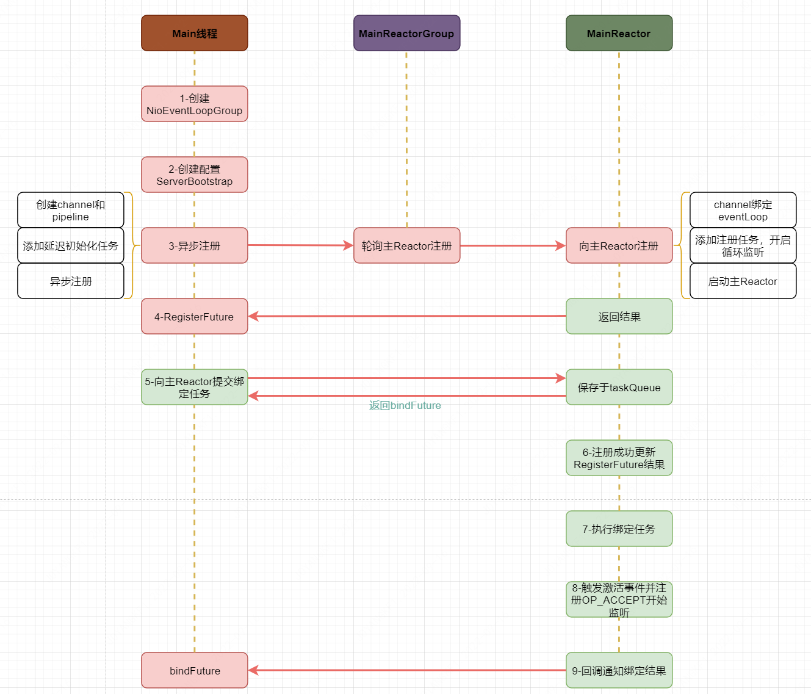

# 1. 前言

这里首先需要细致了解相关 `NIO`基础内容和 `Reactor`模型，可以查看之前的文章，这样可以很容易理解 `Netty`的相关设计。还是使用之前的一个小例子进行说明

```java
package io.netty.example.inaction.ch2;

import io.netty.bootstrap.ServerBootstrap;
import io.netty.channel.ChannelFuture;
import io.netty.channel.ChannelInitializer;
import io.netty.channel.ChannelOption;
import io.netty.channel.EventLoopGroup;
import io.netty.channel.nio.NioEventLoopGroup;
import io.netty.channel.socket.SocketChannel;
import io.netty.channel.socket.nio.NioServerSocketChannel;
import io.netty.handler.logging.LogLevel;
import io.netty.handler.logging.LoggingHandler;

/**
 * 服务端
 *
 * @author YJ
 * @date 2022/1/5
 **/
public class EchoServer {

    public static void main(String[] args) throws Exception {
        // 创建两个线程组 boosGroup、workerGroup
        // boosGroup用于监听客户端连接，专门负责与客户端的连接，并把连接注册到
        // workGroup的Selector中，设置线程数为1
        EventLoopGroup bossGroup = new NioEventLoopGroup(1);
        // 用于处理每一个连接发生的读写事件
        EventLoopGroup workerGroup = new NioEventLoopGroup(16);

        try {
            //创建服务端的启动对象，设置参数
            ServerBootstrap bootstrap = new ServerBootstrap();
            //设置两个线程组boosGroup和workerGroup
            bootstrap.group(bossGroup, workerGroup)
                //设置服务端通道实现类型
                .channel(NioServerSocketChannel.class)
                //设置线程队列得到连接个数
                .option(ChannelOption.SO_BACKLOG, 128)
                // 设置主Reactor中的handler，如果要设置多个，需要使用ChannelInitializer
                .handler(new LoggingHandler(LogLevel.INFO))
                //设置保持活动连接状态
                .childOption(ChannelOption.SO_KEEPALIVE, true)
                //使用匿名内部类的形式初始化通道对象，设置从Reactor中的handler
                .childHandler(new ChannelInitializer<SocketChannel>() {
                    @Override
                    protected void initChannel(SocketChannel socketChannel) throws Exception {
                        //给pipeline管道设置处理器
                        socketChannel.pipeline().addLast(new EchoServerHandler());
                    }
                });//给workerGroup的EventLoop对应的管道设置处理器
            System.out.println("Netty Server 准备就绪...");
            //绑定端口号，启动服务端
            ChannelFuture channelFuture = bootstrap.bind(6666).sync();
            //对关闭通道进行监听
            channelFuture.channel().closeFuture().sync();
        } finally {
            bossGroup.shutdownGracefully();
            workerGroup.shutdownGracefully();
        }
    }
}

package io.netty.example.inaction.ch2;

import io.netty.bootstrap.Bootstrap;
import io.netty.channel.ChannelFuture;
import io.netty.channel.ChannelInitializer;
import io.netty.channel.nio.NioEventLoopGroup;
import io.netty.channel.socket.SocketChannel;
import io.netty.channel.socket.nio.NioSocketChannel;

/**
 * 客户端
 **/
public class EchoClient {

    public static void main(String[] args) throws InterruptedException {
        NioEventLoopGroup eventExecutors = new NioEventLoopGroup();
        try {
            //创建bootstrap对象，配置参数
            Bootstrap bootstrap = new Bootstrap();
            //设置线程组
            bootstrap.group(eventExecutors)
                //设置客户端的通道实现类型
                .channel(NioSocketChannel.class)
                //使用匿名内部类初始化通道
                .handler(new ChannelInitializer<SocketChannel>() {
                    @Override
                    protected void initChannel(SocketChannel ch) throws Exception {
                        //添加客户端通道的处理器
                        ch.pipeline().addLast(new EchoClientHandler());
                    }
                });
            System.out.println("Netty Client 准备就绪，随时可以起飞~");
            //连接服务端
            ChannelFuture channelFuture = bootstrap.connect("127.0.0.1", 6666).sync();
            //对通道关闭进行监听
            channelFuture.channel().closeFuture().sync();
        } finally {
            //关闭线程组
            eventExecutors.shutdownGracefully();
        }
    }
}

```

从这里可以看到主要是做了几个操作，一开始进行了相关配置，然后进行了绑定，最后就是等待监听器的结果，然后将结果交给相关的处理类进行处理。`Netty` 是基于 `NIO`的，那么我们在分析的时候就需要结合 `NIO `的做法来将 `Netty`  的相关操作和 `NIO` 结合起来，这样就会更清晰。那这里肯定是在绑定方法中做了一系列初始化、注册、绑定的操作。那可以以此为入口进行分析。

> 在编写服务端网络程序时，我们首先要创建一个 `Socket`用于 `listen和bind`端口地址，我们把这个叫做 `监听Socket`,这里对应的就是 `NioServerSocketChannel.class`。当客户端连接完成三次握手，系统调用 `accept`函数会基于 `监听Socket`创建出来一个 `新的Socket`专门用于与客户端之间的网络通信我们称为 `客户端连接Socket`,这里对应的就是 `NioSocketChannel.class`
>
> 注意 `serverBootstrap.handler`设置的是服务端 `NioServerSocketChannel PipeLine`中的 `ChannelHandler`。`ServerBootstrap`启动类方法带有 `child`前缀的均是设置客户端 `NioSocketChannel`属性的。

# 2. 创建 NioEventLoopGroup

先看下 `NioEventLoopGroup`基本的继承关系

```properties
              NioEventLoopGroup[C]
                     |
             MultithreadEventLoopGroup[C]
                 |                    |
MultithreadEventExecutorGroup[C]    EventLoopGroup[I]
                 |                        |
  AbstractEventExecutorGroup[C]           |
                          |               |
                          EventExecutorGroup[I]
                             |            |
                         Iterable[I]  ScheduledExecutorService[I]                                          |
                                      ExecutorService[I]
                                          |
                                        Executor[I]

```

通过上面继承关系可以发现，主要就是 `JDK`中线程池和迭代器的功能。而在方法 `next()`中返回的是 `NioEventLoop`，这就很容易理解了，`NioEventLoopGroup`是一个包含多个 `NioEventLoop`的组，而 `NioEventLoop `可以理解为一个线程循环，这里通过 `NioEventLoop `继承 `SingleThreadEventLoop `也可以明白这点。我们可以通过调试也可以发现 `NioEventLoopGroup `中有一个 `chidren `的属性，这就是一个 `NioEventLoop`数组。

下面看一下 `NioEventLoop`中相关内容

```java
// 自身所在线程
private Thread thread;
// 优化后或者叫包装后的selector
private Selector selector;
// 原始NIO的selector
private Selector unwrappedSelector;
// 已被选择的key缓存
private SelectedSelectionKeySet selectedKeys;
// selector提供器
private final SelectorProvider provider;
// 选择器策略
private final SelectStrategy selectStrategy;
// 尾部队列
private final Queue<Runnable> tailTasks;
// 任务队列
private final Queue<Runnable> taskQueue;
// 执行器，自定义的，一般可以不传
private final Executor executor;
// 拒绝处理器
private final RejectedExecutionHandler rejectedExecutionHandler;
//定时任务队列
PriorityQueue<ScheduledFutureTask<?>> scheduledTaskQueue;
```

`NioEventLoopGroup`构造方法

```java
// NioEventLoopGroup
public NioEventLoopGroup(int nThreads) {
    this(nThreads, (Executor) null);
}
public NioEventLoopGroup(int nThreads, Executor executor) {
    // 这里选择器提供器是根据不同系统来提供不同的选择器
    this(nThreads, executor, SelectorProvider.provider());
}
public NioEventLoopGroup(
    int nThreads, Executor executor, final SelectorProvider selectorProvider) {
this(nThreads, executor, selectorProvider, DefaultSelectStrategyFactory.INSTANCE);
}

public NioEventLoopGroup(int nThreads, Executor executor, final SelectorProvider selectorProvider,
    final SelectStrategyFactory selectStrategyFactory) {
    super(nThreads, executor, selectorProvider, selectStrategyFactory, RejectedExecutionHandlers.reject());
}

// MultithreadEventExecutorGroup
protected MultithreadEventLoopGroup(int nThreads, Executor executor, Object... args) {
    super(nThreads == 0 ? DEFAULT_EVENT_LOOP_THREADS : nThreads, executor, args);
}
protected MultithreadEventExecutorGroup(int nThreads, Executor executor, Object... args) {
    this(nThreads, executor, DefaultEventExecutorChooserFactory.INSTANCE, args);
}

protected MultithreadEventExecutorGroup(int nThreads, Executor executor,
                                        EventExecutorChooserFactory chooserFactory, Object... args) {
    checkPositive(nThreads, "nThreads");
    if (executor == null) {
        // 如果没有传入则自己创建
        executor = new ThreadPerTaskExecutor(newDefaultThreadFactory());
    }
    // 事件处理器数组
    children = new EventExecutor[nThreads];
    for (int i = 0; i < nThreads; i ++) {
        boolean success = false;
        try {
            // 创建多个子的NioEventLoop
            children[i] = newChild(executor, args);
            success = true;
        } catch (Exception e) {
            // TODO: Think about if this is a good exception type
            throw new IllegalStateException("failed to create a child event loop", e);
        } finally {
            // ...
        }
    }
    // 创建选择器
    chooser = chooserFactory.newChooser(children);
    final FutureListener<Object> terminationListener = new FutureListener<Object>() {
        @Override
        public void operationComplete(Future<Object> future) throws Exception {
            if (terminatedChildren.incrementAndGet() == children.length) {
                terminationFuture.setSuccess(null);
            }
        }
    };
    for (EventExecutor e: children) {
        // 添加事件终止事件
        e.terminationFuture().addListener(terminationListener);
    }
    Set<EventExecutor> childrenSet = new LinkedHashSet<EventExecutor>(children.length);
    Collections.addAll(childrenSet, children);
    readonlyChildren = Collections.unmodifiableSet(childrenSet);
}
```

这里主要关注几点

* 自定义执行器 `Executor`如果没有传入，会默认创建
* 根据线程数，创建多个子 `NioEventLoop`，存放于 `children`数组中
* 创建执行器选择器。这个选择器就是用于选择哪个执行器来执行，其中会根据组的大小判断使用哪种选择方式，实现一种负载均衡
* 添加终止监听事件

这里补充一点，就是创建 `NioEventLoop`

```java
children[i] = newChild(executor, args);

// NioEventLoopGroup
protected EventLoop newChild(Executor executor, Object... args) throws Exception {
    // ...
    return new NioEventLoop(this, executor, selectorProvider,
            selectStrategyFactory.newSelectStrategy(),
            rejectedExecutionHandler, taskQueueFactory, tailTaskQueueFactory);
}

// NioEventLoop
NioEventLoop(NioEventLoopGroup parent, Executor executor, SelectorProvider selectorProvider,
             SelectStrategy strategy, RejectedExecutionHandler rejectedExecutionHandler,
             EventLoopTaskQueueFactory taskQueueFactory, EventLoopTaskQueueFactory tailTaskQueueFactory) {
    // 初始时addTaskWakesUp传入的是false
    super(parent, executor, false, newTaskQueue(taskQueueFactory), newTaskQueue(tailTaskQueueFactory),
            rejectedExecutionHandler);
    this.provider = ObjectUtil.checkNotNull(selectorProvider, "selectorProvider");
    this.selectStrategy = ObjectUtil.checkNotNull(strategy, "selectStrategy");
    final SelectorTuple selectorTuple = openSelector();
    this.selector = selectorTuple.selector;
    this.unwrappedSelector = selectorTuple.unwrappedSelector;
}
```

这里主要是记录下 `addTaskWakesUp`初始传入的值为 `false`，后面再详细说明。

# 3. 启动器 ServerBootstrap

```java
public class ServerBootstrap extends AbstractBootstrap<ServerBootstrap, ServerChannel>

// ServerBootstrap
// workGroup
private volatile EventLoopGroup childGroup;

// AbstractBootstrap
// boosGroup
volatile EventLoopGroup group;
```

基本的初始化操作

```java
.channel(NioServerSocketChannel.class)

// 这里其实就是使用反射创建channel
public B channel(Class<? extends C> channelClass) {
    return channelFactory(new ReflectiveChannelFactory<C>(
            ObjectUtil.checkNotNull(channelClass, "channelClass")
    ));
}
```

剩余的操作都是基本的属性设置。

这里需要注意的是，这些操作都是在主线程中完成的，可以通过 `handler`设置主 `Reactor`的 `handler`，如果是需要设置多个 `handler`，那么可以使用 `ChannelInitializer`。而针对从 `Reactor`的设置，可以使用 `childHandler`方法。

# 4.服务端注册绑定

在之前 `NIO`中进行注册如下

```java
serverChannel.register(selector, SelectionKey.OP_ACCEPT);
```

那么这里就涉及将 `channel`注册到 `selector`上面去，在服务端 `channel`为 `NioServerSocketChannel`，客户端为 `NioSocketChannel`，于是我们从服务端 `channel`入手，查看注册方法

```java
@Override
protected void doRegister() throws Exception {
    boolean selected = false;
    for (;;) {
        try {
            selectionKey = javaChannel().register(eventLoop().unwrappedSelector(), 0, this);
            return;
        } catch (CancelledKeyException e) {
            // ...
    }
}
```

其他内容暂且不管，可以清晰的看到注册逻辑，很自然的和 `NIO`就结合起来了。同时可以看到其实 `selector`对事件对轮询工作在 `Netty`中是由 `EventLoop`来完成的，我们在之前 `NIO` 中是通过循环进行检查。

```java
// AbstractBootstrap
public ChannelFuture bind(int inetPort) {
    return bind(new InetSocketAddress(inetPort));
}
public ChannelFuture bind(SocketAddress localAddress) {
    validate();
    return doBind(ObjectUtil.checkNotNull(localAddress, "localAddress"));
}
private ChannelFuture doBind(final SocketAddress localAddress) {
    // 这里就是注册
    final ChannelFuture regFuture = initAndRegister();
    final Channel channel = regFuture.channel();
    if (regFuture.cause() != null) {
        return regFuture;
    }
    // 注册完成
    if (regFuture.isDone()) {
        // At this point we know that the registration was complete and successful.
        ChannelPromise promise = channel.newPromise();
        // 绑定
        doBind0(regFuture, channel, localAddress, promise);
        return promise;
    } else {
        // 一般情况来说注册都是成功的，这里只是以防万一
        // Registration future is almost always fulfilled already, but just in case it's not.
        final PendingRegistrationPromise promise = new PendingRegistrationPromise(channel);
        regFuture.addListener(new ChannelFutureListener() {
            @Override
            public void operationComplete(ChannelFuture future) throws Exception {
                Throwable cause = future.cause();
                if (cause != null) {
                    // Registration on the EventLoop failed so fail the ChannelPromise directly to not cause an
                    // IllegalStateException once we try to access the EventLoop of the Channel.
                    promise.setFailure(cause);
                } else {
                    // Registration was successful, so set the correct executor to use.
                    // See https://github.com/netty/netty/issues/2586
                    promise.registered();

                    doBind0(regFuture, channel, localAddress, promise);
                }
            }
        });
        return promise;
    }
}
```

## 4.1 initAndRegister

下面我们看详细的注册流程

```java
final ChannelFuture initAndRegister() {
    Channel channel = null;
    try {
        // 这里是创建一个channel，一般我们会传入NioServerSocketChannel.class或者NioSocketChannel.class
        // 这里通过反射创建处channel
        channel = channelFactory.newChannel();
        init(channel);
    } catch (Throwable t) {
        if (channel != null) {
            // channel can be null if newChannel crashed (eg SocketException("too many open files"))
            channel.unsafe().closeForcibly();
            // as the Channel is not registered yet we need to force the usage of the GlobalEventExecutor
            return new DefaultChannelPromise(channel, GlobalEventExecutor.INSTANCE).setFailure(t);
        }
        // as the Channel is not registered yet we need to force the usage of the GlobalEventExecutor
        return new DefaultChannelPromise(new FailedChannel(), GlobalEventExecutor.INSTANCE).setFailure(t);
    }
    // 注册
    ChannelFuture regFuture = config().group().register(channel);
    if (regFuture.cause() != null) {
        if (channel.isRegistered()) {
            channel.close();
        } else {
            channel.unsafe().closeForcibly();
        }
    }
    return regFuture;
}
```

这里先看下 `NioServerSocketChannel`实例化

```java
public NioServerSocketChannel() {
    // newSocket返回一个ServerSocketChannel
    this(newSocket(DEFAULT_SELECTOR_PROVIDER));
}
public NioServerSocketChannel(ServerSocketChannel channel) {
    super(null, channel, SelectionKey.OP_ACCEPT);
    config = new NioServerSocketChannelConfig(this, javaChannel().socket());
}
private static ServerSocketChannel newSocket(SelectorProvider provider) {
    try {
        return provider.openServerSocketChannel();
    } catch (IOException e) {
        throw new ChannelException(
                "Failed to open a server socket.", e);
    }
}
```

这里默认返回 `ServerSocketChannelImpl`，这样就和 `NIO`联系起来了。

```java
protected AbstractNioChannel(Channel parent, SelectableChannel ch, int readInterestOp) {
    super(parent);
    this.ch = ch;
    // 设置ready的key值
    this.readInterestOp = readInterestOp;
    try {
        // 设置为非阻塞
        ch.configureBlocking(false);
    } catch (IOException e) {
        // ...
    }
}

protected AbstractChannel(Channel parent) {
    this.parent = parent;
    // channel标识
    id = newId();
    // 用于操作底层数据读写
    unsafe = newUnsafe();
    // 创建一个新的pipeline
    pipeline = newChannelPipeline();
}
```

这里可以看到和我们自己写 `NIO`服务端基本类似，除此之外，还需要注意 `unsafe`和 `pipeline`的设置。这里 `unsafe`就是一个用于操作系统底层的类。

### 4.1.1 pipeline创建和添加

```java
protected DefaultChannelPipeline newChannelPipeline() {
    return new DefaultChannelPipeline(this);
}
protected DefaultChannelPipeline(Channel channel) {
    this.channel = ObjectUtil.checkNotNull(channel, "channel");
    succeededFuture = new SucceededChannelFuture(channel, null);
    voidPromise =  new VoidChannelPromise(channel, true);

    tail = new TailContext(this);
    head = new HeadContext(this);

    head.next = tail;
    tail.prev = head;
}
```


其实就是一个双向链表，同时单独维护链表头和尾。这里可以看到初始化了一个 `pipeline`，但是还没有添加自己设置的 `handler `，同时这个 `pipeline`的头和尾都是通过一个对象创建出来的，后面要注意 `handler`之间的传播是如何进行的。

```java
// ServerBootstrap#init
p.addLast(new ChannelInitializer<Channel>() {
    @Override
    public void initChannel(final Channel ch) {
        final ChannelPipeline pipeline = ch.pipeline();
        // 这个handler就是我们初始设置的处理handler(.handler(...))
        ChannelHandler handler = config.handler();
        if (handler != null) {
            pipeline.addLast(handler);
        }
        // 添加一个ServerBootstrapAcceptor，这样就可以处理入站事件
        ch.eventLoop().execute(new Runnable() {
            @Override
            public void run() {
                pipeline.addLast(new ServerBootstrapAcceptor(
                        ch, currentChildGroup, currentChildHandler, currentChildOptions, currentChildAttrs));
            }
        });
    }
});
// DefaultChannelPipeline
public final ChannelPipeline addLast(ChannelHandler... handlers) {
    return addLast(null, handlers);
}
public final ChannelPipeline addLast(EventExecutorGroup executor, ChannelHandler... handlers) {NotNull(handlers, "handlers");
    for (ChannelHandler h: handlers) {
        if (h == null) {
            break;
        }
        addLast(executor, null, h);
    }
    return this;
}
public final ChannelPipeline addLast(EventExecutorGroup group, String name, ChannelHandler handler) {
    final AbstractChannelHandlerContext newCtx;
    synchronized (this) {
        checkMultiplicity(handler);
        newCtx = newContext(group, filterName(name, handler), handler);
        // 这里其实是添加到倒数第二个位置
        addLast0(newCtx);

        // If the registered is false it means that the channel was not registered on an eventLoop yet.
        // In this case we add the context to the pipeline and add a task that will call
        // ChannelHandler.handlerAdded(...) once the channel is registered.
        // 初始化时channel还未注册到selector上面，这里为false
        // 也就是说如果还未注册，那么ChannelInitializer.initChannel不会执行
        // 注册之后PendingHandlerAddedTask会被调用，经过一系列调用之后，
        // ChannelInitializer.handleAdded()方法会被触发，执行ChannelInitializer.initChannel
        // 后面将自己从pipeline中移除
        if (!registered) {
            newCtx.setAddPending();
            // 这里添加一个延迟任务
            callHandlerCallbackLater(newCtx, true);
            return this;
        }
        EventExecutor executor = newCtx.executor();
        if (!executor.inEventLoop()) {
            callHandlerAddedInEventLoop(newCtx, executor);
            return this;
        }
    }
    callHandlerAdded0(newCtx);
    return this;
}
```


这里可以看到，首先创建一个 `ChannelHandlerContext`并添加到 `pipeline`中。由于此时 `channel`还未注册完成，所以这里暂时添加了一个延迟任务。

```java
private void callHandlerCallbackLater(AbstractChannelHandlerContext ctx, boolean added) {
    assert !registered;

    PendingHandlerCallback task = added ? new PendingHandlerAddedTask(ctx) : new PendingHandlerRemovedTask(ctx);
    PendingHandlerCallback pending = pendingHandlerCallbackHead;
    if (pending == null) {
        pendingHandlerCallbackHead = task;
    } else {
        // Find the tail of the linked-list.
        while (pending.next != null) {
            pending = pending.next;
        }
        pending.next = task;
    }
}
```

那么这里就将主 `Reactor`的初始化任务添加到了任务队列中，等待 `channel`注册成功后执行。

### 4.1.2 init(channel)

```java
void init(Channel channel) {
    // 这里就是通过option方法设置的
    setChannelOptions(channel, newOptionsArray(), logger);
    // 这里是通过attr方法设置的
    setAttributes(channel, newAttributesArray());

    // 这里获取channel上面的pipeline，在实例化channel的时候就会创建pipeline，
    // 是一个双向链表结构
    ChannelPipeline p = channel.pipeline();

    final EventLoopGroup currentChildGroup = childGroup;
    final ChannelHandler currentChildHandler = childHandler;
    final Entry<ChannelOption<?>, Object>[] currentChildOptions = newOptionsArray(childOptions);
    final Entry<AttributeKey<?>, Object>[] currentChildAttrs = newAttributesArray(childAttrs);

    // 这里添加了一个ChannelInitializer，是一个抽象的入站handler
    // 这里添加的任务就是简化注册完毕后的初始化操作，一个工具类，在
    // 完成初始化动作之后会从pipeline中移出
    // 利用 ChannelInitializer 将初始化逻辑封装起来，当 channel
    // 注册到 eventLoop 中之后会触发事件，然后就会调用 ChannelInitializer#initChannel
    // 来执行初始化
    p.addLast(new ChannelInitializer<Channel>() {
        @Override
        public void initChannel(final Channel ch) {
            final ChannelPipeline pipeline = ch.pipeline();
            // 这个handler就是我们初始设置的处理handler(.handler(...))
            ChannelHandler handler = config.handler();
            if (handler != null) {
                pipeline.addLast(handler);
            }
            // 添加一个ServerBootstrapAcceptor，这样就可以处理入站事件
            ch.eventLoop().execute(new Runnable() {
                @Override
                public void run() {
                    pipeline.addLast(new ServerBootstrapAcceptor(
                            ch, currentChildGroup, currentChildHandler, currentChildOptions, currentChildAttrs));
                }
            });
        }
    });
}
```

这里就是一些基本初始化，关键点在 `addLast`方法。首先是将自定义的h `andler`添加到了 `pipeline`中，然后又添加了一个 `ChannelInitializer`。这里其实就是将一个初始化的 `handler（ChannelInitializer）`添加到了 `pipeline`，但是注意，这个 `pipeline`是父级的（也就是主 `Reactor`，因为这里的 `pipeline`是主 `Reactor`的 `NioServerSocketChannel`）。比如有如下使用方式

```java
ServerBootstrap bootstrap = new ServerBootstrap();
            //设置两个线程组boosGroup和workerGroup
            bootstrap.group(bossGroup, workerGroup)
                //设置服务端通道实现类型
                .channel(NioServerSocketChannel.class)
		.handler(new LogginHandler(LogLevel.INFO))
                //设置线程队列得到连接个数
                .option(ChannelOption.SO_BACKLOG, 128)
                //设置保持活动连接状态
                .childOption(ChannelOption.SO_KEEPALIVE, true)
		.childHandler(...)
```

这里我们会通过handler方法给 `bossGroup`上面的 `pipeline`设置 `handler`，而在方法i `.childHandler`方法设置的，是 `workGroup`中 `pipeline`里面的 `handler`。

同时这里还注意，异步添加了一个 `ServerBootstrapAcceptor`，这个类是用来监听客户端连接的一个入站 `handler`，那为什么要异步添加呢？

```java
ServerBootstrap sb = new ServerBootstrap();
sb.channel(...).group(...).childHandler(...).handler(
    new ChannelInitializer<Channel>() {
        @Override
        protected void initChannel(Channel ch) throws Exception {
            ChannelPipeline pipeline = ch.pipeline();
            pipeline.addLast(ourHandler);
        }
    }
);
```

以前方法上被删除的注释如下

> we add this handler via the EventLoop as the user may have used a
> ChannelInitializer as handler. In this case the initChannel(...)
> method will only be called after this method returns. Because of
> this we need to ensure we add our handler in a delayed fashion so
> all the users handler are placed in front of the ServerBootstrapAcceptor

通过这里可以看到，用户可能使用如上方式（`ChannelInitializer`）给主 `Reactor`添加 `handler`，而在主 `Reactor`的 `pipeline`中  `ServerBootstrapAcceptor`是用来处理连接请求的，当接收到连接请求之后会将相关处理转给从 `Reactor`，所以只能放在 `pipeline`的末尾，否则用户的 `handler`就无法执行到了。

**但是这里有个问题，就算是这样，如果不采用异步方式添加好像也是可以添加到末尾的。**

这里就是初始化，还需要关注一个问题，就是为什么要采用 `ChannelInitializer`方式来初始化，这是因为在初始化的时候 `channel`还未被注册到 `EventLoop`(或者说 `selector`)上去，此时需要等注册完成后再触发初始化的操作，否则是无法从 `channel`上获取 `EventLoop`的，同时这个初始化操作也应该由主 `Reactor`来完成。注册成功的执行逻辑放在后面说明。同时还有一个原因，为了保证线程安全地初始化 `pipeline `，所以初始化的动作需要由 `Reactor `线程进行，而当前线程是用户程序的启动 `Main `线程并不是 `Reactor`线程。这里不能立即初始化。

## 4.2 register

```java
ChannelFuture regFuture = config().group().register(channel);
```

这里就是 `initAndRegister`方法中的注册。

```java
// MultithreadEventLoopGroup
@Override
public ChannelFuture register(Channel channel) {
    return next().register(channel);
}
// SingleThreadEventLoop
@Override
public ChannelFuture register(Channel channel) {
    return register(new DefaultChannelPromise(channel, this));
}
// AbstractChannel.AbstractUnsafe
public final void register(EventLoop eventLoop, final ChannelPromise promise) {
    ObjectUtil.checkNotNull(eventLoop, "eventLoop");
    if (isRegistered()) {
        promise.setFailure(new IllegalStateException("registered to an event loop already"));
        return;
    }
    // 验证Reactor模型EventLoop是否与Channel的类型匹配
    // Netty对三种IO模型：Oio,Nio,Aio的支持，用户可以通过改变Netty核心类的前缀轻松切换IO模型。
    // isCompatible方法目的就是需要保证Reactor和Channel使用的是同一种IO模型。
    if (!isCompatible(eventLoop)) {
        promise.setFailure(
                new IllegalStateException("incompatible event loop type: " + eventLoop.getClass().getName()));
        return;
    }
    // 这里实现了channel和EventLoop的绑定
    AbstractChannel.this.eventLoop = eventLoop;
    // 如果是当前线程，也就是说注册操作必须由Reactor线程来完成
    if (eventLoop.inEventLoop()) {
        register0(promise);
    } else {
        try {
            // 如果当前执行线程是外部线程，则需要将register0注册操作
            // 封装程异步Task 由Reactor线程执行
            eventLoop.execute(new Runnable() {
                @Override
                public void run() {
                    register0(promise);
                }
            });
        } catch (Throwable t) {
            ...
        }
    }
}
```

这里要注意，`Server`在启动时，主 `Reactor`还未启动，此时还是在 `Main`线程中，而不是在主 `Reactor`线程中，但是后续如果还有 `channel`要注册的时候，主 `Reactor`已经启动，此时直接在当前线程（主 `Reactor`线程）进行注册，否则需要将注册操作封装成异步 `Task`，待主 `Reactor`线程启动后再进行注册。

**那主 `Reactor`什么时候启动呢？**

```java
// AbstractChannel.AbstractUnsafe
eventLoop.execute(new Runnable() {
                @Override
                public void run() {
                    register0(promise);
                }
            });
// SingleThreadEventExecutor.java
public void execute(Runnable task) {
    ObjectUtil.checkNotNull(task, "task");
    // task不是延迟任务则立即唤醒
    execute(task, !(task instanceof LazyRunnable) && wakesUpForTask(task));
}
protected boolean wakesUpForTask(Runnable task) {
    return true;
}
```

### 4.2.1 主Reactor启动

```java
// SingleThreadEventExecutor.java
private void execute(Runnable task, boolean immediate) {
    // 检查是不是在自己所在线程
    boolean inEventLoop = inEventLoop();
    // 添加任务,添加的第一个任务就是注册任务
    addTask(task);
    if (!inEventLoop) {
        // 如果当前线程不是自己的Reactor线程，那么启动
        startThread();
        // ...
    }
    // 由于任务在添加的时候，阻塞已被唤醒，这里就不需要主动wakeup(inEventLoop);
    if (!addTaskWakesUp && immediate) {
        wakeup(inEventLoop);
    }
}
```

#### 4.2.1.1 启动

```java
// SingleThreadEventExecutor.java
private void startThread() {
    if (state == ST_NOT_STARTED) {
        // 更新启动状态
        if (STATE_UPDATER.compareAndSet(this, ST_NOT_STARTED, ST_STARTED)) {
            boolean success = false;
            try {
                // 启动
                doStartThread();
                success = true;
            } finally {
                if (!success) {
                    STATE_UPDATER.compareAndSet(this, ST_STARTED, ST_NOT_STARTED);
                }
            }
        }
    }
}
private void doStartThread() {
    assert thread == null;
    // 这里创建一个新的线程来执行
    executor.execute(new Runnable() {
        @Override
        public void run() {
            // 将新创建出来的线程赋值给当前的EventLoop
            thread = Thread.currentThread();
            if (interrupted) {
                thread.interrupt();
            }

            boolean success = false;
            updateLastExecutionTime();
            try {
                // 根据EventLoop的类型决定调用具体子类的方法
                // 执行三类任务
                // 1. 监听IO事件
                // 2. 处理IO事件
                // 3. 从任务队列取任务执行
                SingleThreadEventExecutor.this.run();
                success = true;
            } catch (Throwable t) {
                logger.warn("Unexpected exception from an event executor: ", t);
            } finally {
                // ...
            }
        }
    });
}
```

我们知道线程池都会有一个属性字段来记录自己所在线程，所以这里为线程池创建一个新的线程并记录下来，这就是主 `Reactor`线程了。主 `Reactor`线程启动之后要干嘛呢？其实我们结合之前使用原始的模型可以知道，那就是三件事

* 监听 `IO`事件
* 处理 `IO`事件
* 从任务队列取出任务执行

具体的任务执行我们放在后面说明，这里就可以知道会从任务队列中取出任务进行执行，那么第一个任务就是注册任务。

#### 4.2.1.2 唤醒线程 WAKEUP_TASK

`addTaskWakesUp = true` 表示 当且仅当只有调用 `addTask`方法时 才会唤醒 `Reactor`线程

`addTaskWakesUp = false` 表示 并不是只有 `addTask`方法才能唤醒 `Reactor `还有其他方法可以唤醒 `Reactor`， 默认设置 `false`

其实在 `SingleThreadEventExecutor`的默认实现 `DefaultEventExecutor`中

```java
// ====DefaultEventExecutor.java========
@Override
protected void run() {
    for (;;) {
        // 循环取任务并执行
        Runnable task = takeTask();
        // ...
    }
}
//========SingleThreadEventExecutor.java========  
// 从taskQueue中取下一个任务，如果当前没有则阻塞
// taskQueue必须是BlockingQueue类型，否则会抛UnsupportedOperationException异常
protected Runnable takeTask() {
    assert inEventLoop();
    if (!(taskQueue instanceof BlockingQueue)) {
        throw new UnsupportedOperationException();
    }

    BlockingQueue<Runnable> taskQueue = (BlockingQueue<Runnable>) this.taskQueue;
    for (;;) {
        ScheduledFutureTask<?> scheduledTask = peekScheduledTask();
        // scheduledTaskQueue中没有延时任务
        if (scheduledTask == null) {
            Runnable task = null;
            try {
                // 阻塞在这里，直到taskQueue中有新的任务
                task = taskQueue.take();
                if (task == WAKEUP_TASK) {
                    task = null;
                }
            } catch (InterruptedException e) {
                // Ignore
            }
            return task;
        } 
        // ...
    }
}
```

这里可以看到从队列中取任务的时候会阻塞，如果队列中有新的任务，那么则可以唤醒线程进行执行，所以其构造方法传入 `addTaskWakesUp=true`（这里有点疑惑：就算唤醒了那再次循环到此处不还是阻塞吗？其实这是没问题的，只要保证异步任务能执行即可）。但是对于 `NioEventLoop `来说，阻塞的是 `selector.select()`方法，该阻塞在添加任务时不能被唤醒，所以需要执行 `wakeup(inEventLoop)`主动唤醒。

在 `NioEventLoop`创建的时候设置 `addTaskWakesUp=false`，表示需要主动唤醒，即调用 `wakeup(inEventLoop)`，在上面代码中可以看到

```java
// 唤醒主Reactor线程
if (!addTaskWakesUp && immediate) {
    wakeup(inEventLoop);
}
```

这里进行了手工唤醒。也就是说 `addTaskWakesUp` 不是用来控制“添加任务时是否唤醒线程”的，而是根据类能实现的功能，来设置 `addTaskWakesUp`的。如果类能通过其他方式唤醒，那么为 `true`，否则如果不能，那么为 `false`，需要手动唤醒。

### 4.2.2 register0

```java
// AbstractChannel
private void register0(ChannelPromise promise) {
    try {
        if (!promise.setUncancellable() || !ensureOpen(promise)) {
            return;
        }
        // 首次注册
        boolean firstRegistration = neverRegistered;
        // 注册
        doRegister();
        neverRegistered = false;
        registered = true;

        // 注册完成之后回调ChannelInitializer.handlerAdded
        pipeline.invokeHandlerAddedIfNeeded();
        // 设置regFuture为success，触发operationComplete回调，将bind操作存入Reactor任务队列
        // 等待Reactor线程执行
        safeSetSuccess(promise);
        // 触发channelRegister事件，当前的 register 操作已经成功，该事件应该被 pipeline 上
        // 所有关心 register 事件的 handler 感知到，往 pipeline 中扔一个channelRegister事件
        pipeline.fireChannelRegistered();
        // channel已经打开
        if (isActive()) {
            // 如果是首次中注册，那么触发channel激活事件
            if (firstRegistration) {
                pipeline.fireChannelActive();
            } else if (config().isAutoRead()) {
                // See https://github.com/netty/netty/issues/4805
                // 如果channel已经注册过了，就让channel去监听OP_READ事件
                beginRead();
            }
        }
    } catch (Throwable t) {
        // ...
    }
}
```

#### 4.2.2.1 注册

```java
protected void doRegister() throws Exception {
    boolean selected = false;
    for (;;) {
        try {
            // 这里就和我们自己使用NIO实现相关注册是一样的了
            selectionKey = javaChannel().register(eventLoop().unwrappedSelector(), 0, this);
            return;
        } catch (CancelledKeyException e) {
            if (!selected) {
                // 强制阻塞注册
                eventLoop().selectNow();
                selected = true;
            } else {
                // We forced a select operation on the selector before but the SelectionKey is still cached
                // for whatever reason. JDK bug ?
                throw e;
            }
        }
    }
}
```

这里就来到了熟悉的 `NIO`用法了。这里有一点很重要：就是这里将 `this`作为 `SelectionKey`的 `attachment`属性注册到了 `Selector`中了，于是就实现了 `Netty`自定义的 `Channel`和 `NIO`的绑定。

#### 4.2.2.2 初始化回调

当 `channel`注册到 `EventLoop `上之后，记得之前的主 `Reactor`还未初始化完成，这里需要进行回调

```java
// DefaultChannelPipeline.java
final void invokeHandlerAddedIfNeeded() {
    assert channel.eventLoop().inEventLoop();
    // 首次注册
    if (firstRegistration) {
        firstRegistration = false;
        callHandlerAddedForAllHandlers();
    }
}
private void callHandlerAddedForAllHandlers() {
    final PendingHandlerCallback pendingHandlerCallbackHead;
    synchronized (this) {
        // 如果未注册
        assert !registered;
        registered = true;
        pendingHandlerCallbackHead = this.pendingHandlerCallbackHead;
        this.pendingHandlerCallbackHead = null;
    }
    PendingHandlerCallback task = pendingHandlerCallbackHead;
    while (task != null) {
        task.execute();
        task = task.next;
    }
}
```

可以看到这里就是从队列中获取任务进行执行，我们队列中的第一个任务就是初始化任务。参考 `4.1.2`。还记得之前添加的第一个延时任务（主 `Reactor`初始化任务）吗？这里就会取出执行

```java
// PendingHandlerAddedTask
void execute() {
    EventExecutor executor = ctx.executor();
    if (executor.inEventLoop()) {
        // 执行任务
        callHandlerAdded0(ctx);
    } else {
        try {
            executor.execute(this);
        } catch (RejectedExecutionException e) {
            // ...
        }
    }
}
// DefaultChannelPipeline
private void callHandlerAdded0(final AbstractChannelHandlerContext ctx) {
    try {
        ctx.callHandlerAdded();
    } catch (Throwable t) {
        // ...
    }
}
// AbstractChannelHandlerContext.java
final void callHandlerAdded() throws Exception {
    // 设置handler已经被成功添加到pipeline
    if (setAddComplete()) {
        handler().handlerAdded(this);
    }
}
// ChannelInitializer.java
public void handlerAdded(ChannelHandlerContext ctx) throws Exception {
    if (ctx.channel().isRegistered()) {
        if (initChannel(ctx)) {
            removeState(ctx);
        }
    }
}
private boolean initChannel(ChannelHandlerContext ctx) throws Exception {
    if (initMap.add(ctx)) { // Guard against re-entrance.
        try {
            initChannel((C) ctx.channel());
        } catch (Throwable cause) {
            exceptionCaught(ctx, cause);
        } finally {
            if (!ctx.isRemoved()) {
                ctx.pipeline().remove(this);
            }
        }
        return true;
    }
    return false;
}
// DefaultChannelPipeline
private AbstractChannelHandlerContext remove(final AbstractChannelHandlerContext ctx) {
    // 非头和尾节点
    assert ctx != head && ctx != tail;
    synchronized (this) {
        // 从pipeline中移除
        atomicRemoveFromHandlerList(ctx);
        if (!registered) {
            // 如果此时channel还未注册成功，那么添加一个移除的任务，后面执行
            callHandlerCallbackLater(ctx, false);
            return ctx;
        }
        EventExecutor executor = ctx.executor();
        if (!executor.inEventLoop()) {
            executor.execute(new Runnable() {
                @Override
                public void run() {
                    callHandlerRemoved0(ctx);
                }
            });
            return ctx;
        }
    }
    callHandlerRemoved0(ctx);
    return ctx;
}
```

这里首先可以看到，先时执行初始化逻辑

```java
// ServerBootstrap#init
p.addLast(new ChannelInitializer<Channel>() {
    @Override
    public void initChannel(final Channel ch) {
        final ChannelPipeline pipeline = ch.pipeline();
        // 这个handler就是我们初始设置的处理handler(.handler(...))
        ChannelHandler handler = config.handler();
        if (handler != null) {
            pipeline.addLast(handler);
        }
        // 添加一个ServerBootstrapAcceptor，这样就可以处理入站事件
        ch.eventLoop().execute(new Runnable() {
            @Override
            public void run() {
                pipeline.addLast(new ServerBootstrapAcceptor(
                        ch, currentChildGroup, currentChildHandler, currentChildOptions, currentChildAttrs));
            }
        });
    }
});
```

首先添加了一个 `handler`，这个 `handler`就是我们自己设置的

```java
.handler(new LoggingHandler(LogLevel.INFO))
```

这里只是作为说明添加的，一般也无需设置。然后添加了一个 `ServerBootstrapAcceptor`。最后会将之前的 `Context`删除，`pipeline`的变化如下


这里最后说明下，每个 `ChannelHandlerContext`中都包含一个 `ChannelHandler`实例。

#### 4.2.2.3 注册回调ChannelFuture设置

```java
// AbstractChannel#register0
// 等待Reactor线程执行
safeSetSuccess(promise);
```

channel注册是一个异步流程，这里将 `channel`注册的结果 `ChannelPromise`设置为成功。还记得在绑定方法中的流程吗？

```java
// AbstractBootstrap
private ChannelFuture doBind(final SocketAddress localAddress) {
    // 这里就是注册
    final ChannelFuture regFuture = initAndRegister();
    final Channel channel = regFuture.channel();
    if (regFuture.cause() != null) {
        return regFuture;
    }
    // 这里表示注册任务结束，但并不一定是成功
    // 成功条件 isDone=true && isSuccess=ture
    if (regFuture.isDone()) {
        // At this point we know that the registration was complete and successful.
        ChannelPromise promise = channel.newPromise();
        // 绑定
        doBind0(regFuture, channel, localAddress, promise);
        return promise;
    } else {
        // 一般情况来说注册都是成功的，这里只是以防万一
        // Registration future is almost always fulfilled already, but just in case it's not.
        final PendingRegistrationPromise promise = new PendingRegistrationPromise(channel);
        regFuture.addListener(new ChannelFutureListener() {
            @Override
            public void operationComplete(ChannelFuture future) throws Exception {
                Throwable cause = future.cause();
                if (cause != null) {
                    // Registration on the EventLoop failed so fail the ChannelPromise directly to not cause an
                    // IllegalStateException once we try to access the EventLoop of the Channel.
                    promise.setFailure(cause);
                } else {
                    // Registration was successful, so set the correct executor to use.
                    // See https://github.com/netty/netty/issues/2586
                    promise.registered();

                    doBind0(regFuture, channel, localAddress, promise);
                }
            }
        });
        return promise;
    }
}
```

这里如果注册结束了，那么立即执行绑定逻辑，否则则向 `ChannelFuture`中添加一个监听器 `ChannelFutureListner`，等待注册完成后回调执行绑定。

于是这里就针对回调进行了触发

```java
// AbstractChannel
protected final void safeSetSuccess(ChannelPromise promise) {
    if (!(promise instanceof VoidChannelPromise) && !promise.trySuccess()) {
        logger.warn("Failed to mark a promise as success because it is done already: {}", promise);
    }
}
// DefaultChannelPromise
public boolean trySuccess() {
    return trySuccess(null);
}
public boolean trySuccess(V result) {
    return setSuccess0(result);
}
// DefaultPromise
private boolean setSuccess0(V result) {
    return setValue0(result == null ? SUCCESS : result);
}
private boolean setValue0(Object objResult) {
    if (RESULT_UPDATER.compareAndSet(this, null, objResult) ||
        RESULT_UPDATER.compareAndSet(this, UNCANCELLABLE, objResult)) {
        if (checkNotifyWaiters()) {
            // 唤醒监听器
            notifyListeners();
        }
        return true;
    }
    return false;
}
```

#### 4.2.2.4 绑定初探

```java
// AbstractBootstrap
private static void doBind0(
    final ChannelFuture regFuture, final Channel channel,
    final SocketAddress localAddress, final ChannelPromise promise) {
    channel.eventLoop().execute(new Runnable() {
        @Override
        public void run() {
            if (regFuture.isSuccess()) {
                channel.bind(localAddress, promise).addListener(ChannelFutureListener.CLOSE_ON_FAILURE);
            } else {
                promise.setFailure(regFuture.cause());
            }
        }
    });
}
```

这里可以看到又将绑定任务封装成了一个异步任务，等待后面执行，那这是为什么呢？毕竟这里已经是在主 `Reactor`线程中了。这就要说明一下

`channel`是否注册成功的条件是（参考 `ChannelFuture`的说明）

> 1、isDone() = ture
>
> 2、isSuccess() = ture

```java
// java.util.concurrent.Future
/**
 * Returns {@code true} if this task completed.
 *
 * Completion may be due to normal termination, an exception, or
 * cancellation -- in all of these cases, this method will return
 * {@code true}.
 *
 * @return {@code true} if this task completed
 */
boolean isDone();
```

具体逻辑后面在看。

#### 4.2.2.5 处理注册成功事件

```java
pipeline.fireChannelRegistered();
```

这里的逻辑就是注册已经完成，那么需要将这个事情让 `pipeline`中所有关系此事件的 `InboundHandler`知晓此事，我们在实现 `InboundHandler`的时候可以覆写方法

```java
@Skip
@Override
public void channelRegistered(ChannelHandlerContext ctx) throws Exception {
    ctx.fireChannelRegistered();
}

// AbstractChannelHandlerContext.java
private void invokeChannelRegistered() {
    // 如果所有的handler都被添加到了pipeline中
    if (invokeHandler()) {
        try {
            // 第一个节点是head
            ((ChannelInboundHandler) handler()).channelRegistered(this);
        } catch (Throwable t) {
            invokeExceptionCaught(t);
        }
    } else {
        // 传递到下一个ChannelHandlerContext
        fireChannelRegistered();
    }
}
```

具体逻辑就是向 `pipeline`中传递此事件，执行每一个 `InboundHandler`的 `channelRegistered`方法。

#### 4.2.2.6 激活判断

激活这里其实和上面注册成功事件的逻辑一样，也就是往 `pipeline`中扔一个激活的事件。这里的逻辑是如果已经激活，那么需要传播激活事件。具体激活逻辑后面说明。

### 4.2.3 绑定

#### 4.2.3.1 绑定

首先注意，对 `channel`的操作方法都定义在 `ChannelOutboundInvoker`中

```java
public interface ChannelOutboundInvoker {

    /**
     * Request to bind to the given {@link SocketAddress} and notify the {@link ChannelFuture} once the operation
     * completes, either because the operation was successful or because of an error.
     *
     */
    ChannelFuture bind(SocketAddress localAddress, ChannelPromise promise);
}

// AbstractChannel.java 实现
public ChannelFuture bind(SocketAddress localAddress, ChannelPromise promise) {
    return pipeline.bind(localAddress, promise);
}
```

这里会在 `pipeline`中传播 `bind`事件，触发回调所有 `ChannelHandler`的 `bind`方法，同时事件在 `pipeline`中传播是具有方向性的

* `inbound`事件：从 `HeadContext`向 `TailContext`传播
* `outbound`事件：反向传播，从 `TailContext向HeadContext`传播

而 `bind`事件被定义为 `outbound`事件，所以是反向传播的

```java
// DefaultChannelPipeline
public final ChannelFuture bind(SocketAddress localAddress, ChannelPromise promise) {
    return tail.bind(localAddress, promise);
}
// AbstractChannelHandlerContext#bind -> invokeBind
// -> HeadContext#bind
// -> AbstractChannel.java
public final void bind(final SocketAddress localAddress, final ChannelPromise promise) {
    // ...

    boolean wasActive = isActive();
    try {
        // 调用底层绑定方法
        doBind(localAddress);
    } catch (Throwable t) {
        safeSetFailure(promise, t);
        closeIfClosed();
        return;
    }
    // 这里又封装成异步任务了，主要是如果直接调用触发激活事件
    // 那么会影响safeSetSuccess的执行，延迟了监听器的回调
    if (!wasActive && isActive()) {
        invokeLater(new Runnable() {
            @Override
            public void run() {
                // 触发channel激活事件
                pipeline.fireChannelActive();
            }
        });
    }
    safeSetSuccess(promise);
}
```

这里调用了底层的 `bind`方法进行绑定，然后进行激活，最后再次唤醒监听器。

#### 4.2.3.2 激活

```java
// DefaultChannelPipeline
public final ChannelPipeline fireChannelActive() {
    AbstractChannelHandlerContext.invokeChannelActive(head);
    return this;
}
// AbstractChannelHandlerContext#invokeChannelActive
// HeadContext
public void channelActive(ChannelHandlerContext ctx) {
    // 向后传递
    ctx.fireChannelActive();
    // 如果是autoRead则自动触发read事件传播
    // 在read回调函数中触发 OP_ACCEPT 注册
    readIfIsAutoRead();
}
// AbstractChannel#read -> DefaultChannelPipeline#read()
// AbstractChannelHandlerContext#read() -> invokeRead()
// DefaultChannelPipeline#read(ctx) -> AbstractChannel#beginRead()
// AbstractNioChannel
protected void doBeginRead() throws Exception {
    // Channel.read() or ChannelHandlerContext.read() was called
    final SelectionKey selectionKey = this.selectionKey;
    if (!selectionKey.isValid()) {
        return;
    }

    readPending = true;
    // ServerSocketChannel初始化时设置的值为readInterestOp=OP_ACCEPT
    final int interestOps = selectionKey.interestOps();
    if ((interestOps & readInterestOp) == 0) {
        // 这里添加OP_ACCEPT到interestOps集合中
        selectionKey.interestOps(interestOps | readInterestOp);
    }
}
```

这里将 `OP_ACCEPT`设置到 `interestOps`集合中，这样主 `Reactor`中的 `selector`就开始监听集合中的 `IO`事件了。而主 `Reactor`主要就是监听 `OP_ACCEPT`事件。

# 5. 服务端启动总结



注意：红色表示 `Main`线程，蓝色表示主 `Reactor`线程

基本启动流程如上所示，首先会对一些类进行创建和初始化，如 `NioEventLoopGroup、ServerBootstrap、channel`。当然了 `channel`的初始化不能一开始就完成，因为此时 `chnanel`还未和 `EventLoop`绑定，也就是还未注册到 `Selector`上面，所以这里添加了一个延时注册的任务，然后去进行一个异步注册；

异步注册立马返回了一个 `RegisterFuture`，`Main`线程继续后面的步骤，也就是绑定。但是绑定的逻辑也不能立马执行，因为此时 `channel`可能还未注册成功，于是这里还是提交一个延时任务存入 `taskQueue`中，等待 `channel`注册完成；

`channel`注册完成后会返回 `RegisterFuture`结果(`promise`)，同时会启动主 `Reactor`线程。其实此时主 `Reactor`就已经开启监听事件了，但是此时 `channel`的注册和激活可能还未完成，所以也收不到相关事件。而注册完成结果会触发绑定任务开始执行，绑定完成之后会触发激活事件，此时开始监听客户端连接事件；

而这里主 `Reactor`主要就是监听连接事件，然后转交给从 `Reactor`进行处理，这个后面详细说明。

# 6. Reactor运转

前面已经说明了主 `Reactor`线程启动的相关逻辑，这里说明一下启动之后其执行任务的逻辑。


```java
// SingleThreadEventExecutor.java
private void doStartThread() {
// ...
            try {
                // 根据EventLoop的类型决定调用具体子类的方法
                // 执行三类任务
                // 1. 监听IO事件
                // 2. 处理IO事件
                // 3. 从任务队列取任务执行
                SingleThreadEventExecutor.this.run();
                success = true;
            } catch (Throwable t) {
                logger.warn("Unexpected exception from an event executor: ", t);
            } finally {
                // ...
            }
        }
    });
}

// NioEventLoop
protected void run() {
    int selectCnt = 0;
    // 就是一个死循环，和NIO中类似，其实就是一种监听
    for (;;) {
        try {
            int strategy;
            try {
                // 如果有task则selectNow，否则返回SelectStrategy.SELECT
                // 这里只要任务队列中有任务，那么就返回selectNow()，
		// 通过debug发现这里在server启动时有一个任务
                // 第一个任务就是注册任务，此时肯定是没有就绪任务的，于是strategy=0，后面
                // 过来的连接、读、写请求则strategy>0
                strategy = selectStrategy.calculateStrategy(
					selectNowSupplier, hasTasks());
                switch (strategy) {
                case SelectStrategy.CONTINUE: // NioEventLoop不支持
                    continue;
                case SelectStrategy.BUSY_WAIT: // NioEventLoop不支持
                case SelectStrategy.SELECT: // NioEventLoop唯一支持的策略

                    // 定时任务处理，下一个任务准备好执行的时间
                    long curDeadlineNanos = nextScheduledTaskDeadlineNanos();
                    if (curDeadlineNanos == -1L) {
                        curDeadlineNanos = NONE; // nothing on the calendar
                    }
                    nextWakeupNanos.set(curDeadlineNanos);
                    try {
                        if (!hasTasks()) {
                            // 没有任务则阻塞选择
                            strategy = select(curDeadlineNanos);
                        }
                    } finally {
                        // This update is just to help block unnecessary selector wakeups
                        // so use of lazySet is ok (no race condition)
                        nextWakeupNanos.lazySet(AWAKE);
                    }
                    // fall through
                default:
                }
            } catch (IOException e) {
                // ...
		continue;
            }

            selectCnt++;
            cancelledKeys = 0;
            // 主要用于从IO就绪的SelectedKeys集合中剔除已经失效的selectKey
            needsToSelectAgain = false;
            // IO比例，初始值为50，用于控制IO处理与任务队列中任务处理所占时间占比
            // 也就是IO处理时间和非IO处理时间占比，可以进行设置
            final int ioRatio = this.ioRatio;
            boolean ranTasks;
            if (ioRatio == 100) {
                try {
                    if (strategy > 0) {
                        // 监听处理相关连接、读、写事件
                        processSelectedKeys();
                    }
                } finally {
                    // Ensure we always run tasks.
                    ranTasks = runAllTasks();
                }
            } else if (strategy > 0) {
                final long ioStartTime = System.nanoTime();
                try {
                    processSelectedKeys();
                } finally {
                    // Ensure we always run tasks.
                    final long ioTime = System.nanoTime() - ioStartTime;
                    // 这里相当于非IO操作有一个超时时间，当ioRatio=10，如果IO用时100，那非IO用时900
                    ranTasks = runAllTasks(ioTime * (100 - ioRatio) / ioRatio);
                }
            } else {
                ranTasks = runAllTasks(0); // This will run the minimum number of tasks
            }

            // 判断是否触发JDK Epoll BUG 触发空轮询
            if (ranTasks || strategy > 0) {
                if (selectCnt > 
			MIN_PREMATURE_SELECTOR_RETURNS && logger.isDebugEnabled()) {
                    logger.debug("Selector.select() returned prematurely {} times in 
			a row for Selector {}.", selectCnt - 1, selector);
                }
                selectCnt = 0;
            } else if (unexpectedSelectorWakeup(selectCnt)) { 
                // 既没有IO就绪事件，也没有异步任务，Reactor线程从Selector上被异常唤醒 
		// 触发JDK Epoll空轮训BUG
                // 重新构建Selector,selectCnt归零
                selectCnt = 0;
            }
        } catch (CancelledKeyException e) {
            // Harmless exception - log anyway
            if (logger.isDebugEnabled()) {
                logger.debug(CancelledKeyException.class.getSimpleName() + " raised by a Selector {} - JDK bug?",
                        selector, e);
            }
        } catch (Error e) {
            throw e;
        } catch (Throwable t) {
            handleLoopException(t);
        } finally {
            // ...
        }
    }
}
```


## 6.1 轮询策略

计算轮询策略时有几种情况

* 有异步任务 --> 有 `IO`就绪事件 --> `stratergy>0`
* 有异步任务 --> 无 `IO`就绪事件 --> `stratergy=0`
* 无异步任务 --> `stratergy=SelectStrategy.SELECT=-1`

如果有异步任务需要执行，那么就需要立即执行，不能阻塞在 `selector`上，在返回前还调用下 `selectNow()`非阻塞查看下是否有 `IO` 就绪事件发生（`selectNowSupplier`），如果有，正好可以和异步任务一起执行。这里要表达的含义就是优先保证 `IO` 就绪事件的处理。

如果没有异步任务，同时也没有定时任务需要执行，那么就会一直阻塞在 `selector`上面等待。

如果有 `IO`事件，那么 `stratergy`数值就表示有多少个 `IO`就绪事件。


### 6.1.1 轮询超时时间

相关定时任务会保存在scheduleTaskQueue中，这里会计算下一个定时任务执行的剩余时间，并将此时间设置为Reactor线程在selector上面轮询的超时时间，这保证在定时任务即将执行之前，Reactor线程可以及时的从Selector上面被唤醒。

当然了，如果没有定时任务，同时也没有异步任务需要执行，则一直阻塞在selector上面，直到收到IO就绪事件。


### 6.1.2 轮询IO就绪事件

```java
private int select(long deadlineNanos) throws IOException {
    if (deadlineNanos == NONE) {
        // 这里是阻塞选择
        return selector.select();
    }
    // 这里不用太纠结，其实就是如果任务还剩5微妙就要执行，此时转换成
    // 毫秒则为0，所以需要凑一下。同时也说明线程在有任务的情况下
    // 至少阻塞1ms
    long timeoutMillis = deadlineToDelayNanos(deadlineNanos + 995000L) / 1000000L;
    return timeoutMillis <= 0 ? selector.selectNow() : selector.select(timeoutMillis);
}
```

这里有个点，就是当线程阻塞在selector上面时，此时过来一个异步任务提交，而此时又没有IO就绪事件，那线程怎么去执行异步任务呢？

其实这个问题在之前有过说明，需要在提交任务的时候进行唤醒

```java
// SingleThreadEventExecutor.java
// 从这里可以明白提交异步任务时线程会被唤醒
private void execute(Runnable task, boolean immediate) {
    // 检查是不是在自己所在线程
    boolean inEventLoop = inEventLoop();
    // 添加任务,添加的第一个任务就是注册任务
    addTask(task);
    if (!inEventLoop) {
        // 如果当前线程不是自己的Reactor线程，那么启动
        startThread();
        // ...
    }
    // 由于任务在添加的时候，阻塞已被唤醒，这里就不需要主动wakeup(inEventLoop);
    if (!addTaskWakesUp && immediate) {
        wakeup(inEventLoop);
    }
}
```


* `immediate：`表示提交的 `task`是否需要被立即执行。Netty中只要你提交的任务类型不是 `LazyRunnable`类型的任务，都是需要立即执行的。`immediate = true`
* `addTaskWakesUp :` `true` 表示 `当且仅当只有`调用 `addTask`方法时才会唤醒 `Reactor线程`。调用别的方法并不会唤醒 `Reactor线程`。在初始化 `NioEventLoop`时会设置为 `false`，表示 `并不是只有`addTask方法才能唤醒 `Reactor线程` 还有其他方法可以唤醒 `Reactor线程`，比如这里的 `execute方法`就会唤醒 `Reactor线程`

最后再 `finally`中还是设置了

```java
nextWakeupNanos.lazySet(AWAKE);
```

这里表示 `Reactor`线程已经被唤醒了，下次就不用在此唤醒了。


## 6.2 时间分配


```flowchart
st1=>start: start
cond1=>condition: ioRatio == 100 ?
cond2=>condition: strategy > 0 ?
op1=>operation: procesSelectedKeys()
op2=>operation: ranTasks = runAllTasks()

cond3=>condition: strategy > 0 ?
op3=>operation: procesSelectedKeys()
ranTasks = runAllTasks(timeout)

op4=>operation: ranTasks = runAllTasks(0)

e1=>end: end

st1->cond1
cond1(yes)-->cond2
cond1(no)-->cond3
cond2(yes)-->op1

op1->op2
cond2(no)-->op2
op2->e1

cond3(yes)->op3
op3->e1
cond3(no)->op4
op4->e1
```

时间分配如上图所示，`ioRatio=100`表示在执行完 `IO`事件后执行所有的异步任务，包括普通任务、尾部任务、定时任务，无时间限制。

当 `ioRatio`不为 `100`，默认为 `50`时。首先计算出 `IO`事件和任务各自可以执行的时间，然后先执行 `IO`事件，再处理异步任务。`ioRatio`值越大，表示执行 `IO`事件的时间越长

否则，当没有 `IO`事件时，则执行异步任务，最多执行 `64`个，防止事件过长影响 `IO`事件的处理。


## 6.3 处理IO就绪事件

```java
private void processSelectedKeys() {
    // 是否采用netty优化后的selectedKey集合类型 是由变量DISABLE_KEY_SET_OPTIMIZATION决定的
    // 默认为false
    if (selectedKeys != null) {
        // 使用优化过的SelectedSelectionKeySet集合
        processSelectedKeysOptimized();
    } else {
        // 使用NIO原生的
        processSelectedKeysPlain(selector.selectedKeys());
    }
}
```

这里出于对 `JDK NIO Selector`中 `selectedKeys 集合`的 `插入`和 `遍历`操作性能的考虑Netty将自己用数组实现的 `SelectedSelectionKeySet 集合`替换掉了 `JDK NIO Selector`中 `selectedKeys`的 `HashSet`实现。默认是使用优化后的。

基本原理差不多，这里还是以原生 `NIO`的情况进行说明

```java
private void processSelectedKeysPlain(Set<SelectionKey> selectedKeys) {
    if (selectedKeys.isEmpty()) {
        return;
    }

    Iterator<SelectionKey> i = selectedKeys.iterator();
    for (;;) {
        final SelectionKey k = i.next();
        final Object a = k.attachment();
        i.remove();

        if (a instanceof AbstractNioChannel) {
            processSelectedKey(k, (AbstractNioChannel) a);
        } else {
            @SuppressWarnings("unchecked")
            NioTask<SelectableChannel> task = (NioTask<SelectableChannel>) a;
            processSelectedKey(k, task);
        }
        if (!i.hasNext()) {
            break;
        }
        // 再次选择可以移除失效的key
        if (needsToSelectAgain) {
            selectAgain();
            selectedKeys = selector.selectedKeys();

            // Create the iterator again to avoid ConcurrentModificationException
            if (selectedKeys.isEmpty()) {
                break;
            } else {
                i = selectedKeys.iterator();
            }
        }
    }
}
```

这里可以看到和我们自己实现 `NIO`服务端差不多了。

### 6.3.1 处理IO事件

```java
// 在注册的时候通过attachment设置为channel实现了channel和NIO selector的绑定
// 客户端连接时 channel类型为NioServerSocketChannel
// 客户单读写事件，channel为NioSocketChannel
if (a instanceof AbstractNioChannel) {
    processSelectedKey(k, (AbstractNioChannel) a);
} else {
    @SuppressWarnings("unchecked")
    NioTask<SelectableChannel> task = (NioTask<SelectableChannel>) a;
    processSelectedKey(k, task);
}
```

`Netty`中 `SelectionKey`上的 `attachment`属性分为两种：

* 一种是常见的channel
* 另一种是 `NioTask`，这种是 `Netty`提供给用户可以自定义一些当 `channel`上发生 `IO`就绪事件时的自定义处理

```java
// AbstractNioChannel
private void processSelectedKey(SelectionKey k, AbstractNioChannel ch) {
    final AbstractNioChannel.NioUnsafe unsafe = ch.unsafe();
    // key不合法
    if (!k.isValid()) {
        final EventLoop eventLoop;
        try {
            eventLoop = ch.eventLoop();
        } catch (Throwable ignored) {
            return;
        }
        if (eventLoop == this) {
            // 如果SelectionKey已经失效则关闭对应的channel
            unsafe.close(unsafe.voidPromise());
        }
        return;
    }

    try {
        int readyOps = k.readyOps();
        // 这里是判断连接是否正常，处理连接事件
        if ((readyOps & SelectionKey.OP_CONNECT) != 0) {
            int ops = k.interestOps();
            // 先将连接事件的监听移除，否则回一直通知
            ops &= ~SelectionKey.OP_CONNECT;
            k.interestOps(ops);
            // 触发channelActive事件处理连接事件
            unsafe.finishConnect();
        }
        // 处理写事件
        if ((readyOps & SelectionKey.OP_WRITE) != 0) {
            ch.unsafe().forceFlush();
        }
        // 这里监听连接和读取请求
        if ((readyOps & (SelectionKey.OP_READ | SelectionKey.OP_ACCEPT)) != 0 || readyOps == 0) {
            unsafe.read();
        }
    } catch (CancelledKeyException ignored) {
        unsafe.close(unsafe.voidPromise());
    }
}
```

这里基本逻辑比较简单，主要涉及几种类型的 `IO`事件处理，比如连接事件，这发生在客户端，客户端这边直接不分 `bossGroup`和 `workGroup`，只有一个 `workGroup`，那直接在其上进行处理；其后客户端连接服务端，那么服务端这边产生一个 `Accept`事件，此时就得把事件交给服务端的从 `Reactor`来处理了；后续就是客户端和服务端各自处理其上的读写请求了。下面看具体的处理。


注意：

* 客户端的 `SocketChannel`支持 `OP_CONNECT, OP_READ, OP_WRITE`三个操作。

* 服务端 `ServerSocketChannel`只支持 `OP_ACCEPT`操作，在服务端由 `ServerSocketChannel`的 `accept()`方法产生的 `SocketChannel`只支持 `OP_READ, OP_WRITE`操作。

就绪条件

* `OP_ACCEPT`就绪条件：当收到一个客户端的连接请求时，该操作就绪。这是 `ServerSocketChannel`上唯一有效的操作。
* `OP_CONNECT`就绪条件：只有客户端 `SocketChannel`会注册该操作，当客户端调用 `SocketChannel.connect()`时，该操作会就绪。
* `OP_READ`就绪条件：该操作对客户端和服务端的 `SocketChannel`都有效，当 `OS`的读缓冲区中有数据可读时，该操作就绪。
* `OP_WRITE`就绪条件：该操作对客户端和服务端的 `SocketChannel`都有效，当 `OS`的写缓冲区中有空闲的空间时(大部分时候都有)，该操作就绪。

### 6.3.2 处理连接事件

客户端向服务端发起连接，并向客户端的 `Reactor`注册 `Connect事件`，当连接建立成功后，客户端的 `NioSocketChannel`就会产生 `Connect就绪事件`

```java
// AbstractNioChannel
if ((readyOps & SelectionKey.OP_CONNECT) != 0) {
    // remove OP_CONNECT as otherwise Selector.select(..) will always return without blocking
    // See https://github.com/netty/netty/issues/924
    int ops = k.interestOps();
    // 先将连接事件的监听移除，否则回一直通知
    ops &= ~SelectionKey.OP_CONNECT;
    k.interestOps(ops);
    // 触发channelActive事件处理连接事件
    unsafe.finishConnect();
}
```

这里只有在客户端才会出现连接事件，主要是触发 `channelActive`

```java
// AbstractNioChannel
public final void finishConnect() {
    try {
        boolean wasActive = isActive();
        // 调用底层NIO处理连接事件，参考之前的NIO解析
        doFinishConnect();
	// 传播连接事件
        fulfillConnectPromise(connectPromise, wasActive);
    } catch (Throwable t) {
        fulfillConnectPromise(connectPromise, annotateConnectException(t, requestedRemoteAddress));
    } finally {
        // ...
    }
}
// fulfillConnectPromise -> AbstractChannelHandlerContext#invokeChannelActive
((ChannelInboundHandler) handler()).channelActive(this);
```

这里就会调用用户自定义的 `handler`处理类的 `channelActive`方法。


### 6.3.3 处理写事件

这里要知道，当监听到写事件时，此时此事件已经在服务端的从 `Reactor`或者客户端的 `Reactor`上面了，具体的写逻辑后面再说明，这里主要关注整体的扭转逻辑。这里只是将数据发送出去。


### 6.3.4 处理 `Read` 和 `Accept` 事件

同样，这里暂不关注读事件的具体处理逻辑，和写事件处理一样，此时已经到服务端的从 `Reactor`或者客户端的 `Reactor`上面了。主要关注对 `Accept`事件的处理，关注其是如何从主 `Reactor`转交给从 `Reactor`的。

```java
// AbstractNioMessageChannel.java
public void read() {
    assert eventLoop().inEventLoop();
    final ChannelConfig config = config();
    final ChannelPipeline pipeline = pipeline();
    // 接收对端数据时，ByteBuf的分配策略，基于历史数据动态调整初始化大小，避免太大浪费空间，太小又会频繁扩容
    final RecvByteBufAllocator.Handle allocHandle = unsafe().recvBufAllocHandle();
    allocHandle.reset(config);

    boolean closed = false;
    Throwable exception = null;
    try {
        try {
            do {
                // 这里其实就是将接收到的客户端添加到缓存
                int localRead = doReadMessages(readBuf);
                if (localRead == 0) {
                    break;
                }
                if (localRead < 0) {
                    closed = true;
                    break;
                }
                // 递增已读取消息的数量
                allocHandle.incMessagesRead(localRead);
            } while (continueReading(allocHandle));
        } catch (Throwable t) {
            exception = t;
        }

        int size = readBuf.size();
        for (int i = 0; i < size; i ++) {
            readPending = false;
            // 通过pipeline传播channelRead事件
            pipeline.fireChannelRead(readBuf.get(i));
        }
        readBuf.clear();
        // 读取完毕的回调，有的Handle会根据本次读取的总字节数，自适应调整下次应该分配的缓冲区大小
        allocHandle.readComplete();
        // 通过pipeline传播ChannelReadComplete事件
        pipeline.fireChannelReadComplete();

        if (exception != null) {
            closed = closeOnReadError(exception);
            // 通过pipeline传播异常事件
            pipeline.fireExceptionCaught(exception);
        }

        if (closed) {
            inputShutdown = true;
            if (isOpen()) {
                close(voidPromise());
            }
        }
    } finally {
        if (!readPending && !config.isAutoRead()) {
            removeReadOp();
        }
    }
}
```

这里首先将接收到的 `Accept`事件请求封装到一个缓存中

```java
// NioServerSocketChannel
protected int doReadMessages(List<Object> buf) throws Exception {
    // 接收客户端的连接，获得客户端socketChannel
    SocketChannel ch = SocketUtils.accept(javaChannel());
    try {
        if (ch != null) {
            // 添加到缓存中
            buf.add(new NioSocketChannel(this, ch));
            return 1;
        }
    } catch (Throwable t) {
        // ...
    }
    return 0;
}
// NioSocketChannel->AbstractNioByteChannel
protected AbstractNioByteChannel(Channel parent, SelectableChannel ch) {
    super(parent, ch, SelectionKey.OP_READ);
}
```

**可以看到这里会重新注册一个读事件，继续监听**。

然后就是循环将此事件在主 `Reactor`的 `pipeline`中进行传递处理。还记得之前的 `pipeline`结构吗

```java
HeadContext --> ServerBootstrapAcceptor --> TailContext
```

```java
/**
 * 有客户端连接时，触发.
 * NioEventLoop会监听Selector事件，OP_ACCEPT事件到达时，触发Unsafe.read()。
 * AbstractNioMessageChannel.NioMessageUnsafe#read()
 * 它会调用ServerSocketChannel.accept()获取客户端连接，并触发channelRead()回调。
 */
@Override
@SuppressWarnings("unchecked")
public void channelRead(ChannelHandlerContext ctx, Object msg) {
    // NioSocketChannel
    final Channel child = (Channel) msg;
    // 添加到workgroup中
    child.pipeline().addLast(childHandler);
    setChannelOptions(child, childOptions, logger);
    setAttributes(child, childAttrs);
    try {
        // 将客户端channel注册到WorkerGroup,也就是接收到客户端连接之后，剩下的工作
        // 交给WorkerGroup，具体的读取逻辑由我们设置的handler处理
        childGroup.register(child).addListener(new ChannelFutureListener() {
            @Override
            public void operationComplete(ChannelFuture future) throws Exception {
                if (!future.isSuccess()) {
                    forceClose(child, future.cause());
                }
            }
        });
    } catch (Throwable t) {
        forceClose(child, t);
    }
}
```

可以看到这里就将相关具体处理交给来从 `Reactor`来处理了。后面事件就会在从 `Reactor`的 `pipeline`中传播，这样就可以执行到我们自定义的 `Handler`方法了。

以上就是相关启动和运转基本流程。

参考：

[详细图解Netty Reactor启动全流程](https://heapdump.cn/article/4129484?fromComment=true)

[taskQueue实现](https://skyao.gitbooks.io/learning-netty/content/eventloop/class_SingleThreadEventExecutor.html)

[一文聊透Netty核心引擎Reactor的运转架构](https://heapdump.cn/article/4130307)
