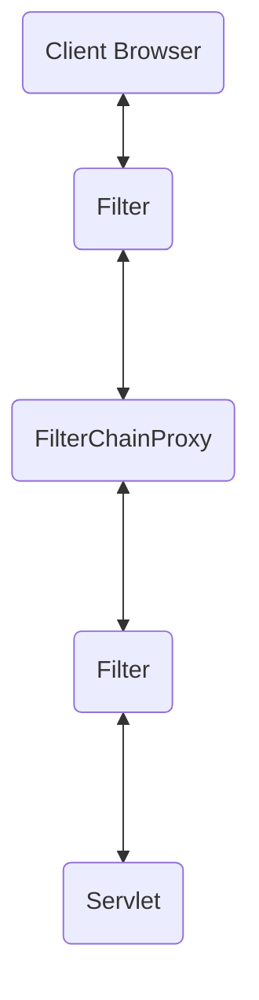
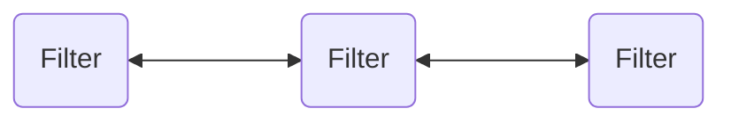

参考：《深入浅出 Spring Security》
```toc
```

## 核心功能

对于安全框架来说最核心的功能就是认证和授权。

### 认证

Security 支持多种不同的认证方式，有些是自己提供的功能，有些是第三方标准组织制定的。主要认证机制如下：
- 表单认证
- OAuth 2.0 认证
- SAML 2.0 认证
- CAS 认证
- RememberMe 自动认证
- JAAS 认证
- OpenID 去中心化认证
- Pre-Authentication Scenarios 认证
- `X509` 认证
- HTTP Basic 认证
- HTTP Digest 认证

当然还可以自定义认证。

### 授权

无论采用哪种认证方式，都不影响在 Spring Security 中使用授权功能。其支持基于 URL 的请求授权、支持方法访问授权、支持 SpEL 访问控制、支持域对象安全（ACL），同时也支持动态权限配置、支持 RBAC 权限模型等。


## 整体架构

### 认证和授权

#### 认证

在 Spring Security 中，认证（Authentication）和授权（Authorization）是分开的，所以无论什么样的认证方式，都不会影响授权，这也是其可以很方便整合外部认证方案的原因。

用户认证信息主要由 Authentication 的实现类保存，接口定义如下：

```java
public interface Authentication extends Principal, Serializable {
	// 获取用户权限
    Collection<? extends GrantedAuthority> getAuthorities();
    // 用来获取用户凭证，一般来说就是密码
    Object getCredentials();
    // 获取用户携带的详细信息，可能是当前请求之类等
    Object getDetails();
    // 获取当前用户，例如是一个用户名或者一个用户对象
    Object getPrincipal();
    // 当前用户是否认证成功
    boolean isAuthenticated();
    void setAuthenticated(boolean isAuthenticated) throws IllegalArgumentException;
}
```

认证工作主要由 AuthenticationManager 接口负责：

```java
public interface AuthenticationManager {
    Authentication authenticate(Authentication authentication) throws AuthenticationException;
}
```

返回结果有几种：
- 返回 Authentication 表示认证成功
- 跑出异常表示用户输入了无效凭证
- 返回 null 表示无法断定

AuthenticationManager 最主要的实现类是 ProviderManager，其管理了众多 AuthenticationProvider 实例，有点类似于 AuthenticationManager，但是多了一个方法来判断是否支持给定的 Authentication 类型

```java
public interface AuthenticationProvider {
    Authentication authenticate(Authentication authentication) throws AuthenticationException;
    boolean supports(Class<?> authentication);
}
```

这是因为 Authentication 有众多不同的实现类，不同的实现类由不同的 AuthenticationProvider 来处理，所以才会多一个 supports 方法来进行判断。

在一次完整的认证流程中，可能会同时存在多个 AuthenticationProvider（如同时支持 form 表单登录和短信验证码登录），多个 AuthenticationProvider 统一由 ProviderManager 管理。同时 ProviderManager 具有一个可选的父类，如果所有的认证都失败，那么会调用父类进行认证，相当于一个默认的认证。


#### 授权

在 Spring Security 的授权体系中，有两个关键接口：AccessDecisionManager，AccessDecisionVoter。

AccessDecisionVoter 是一个投票器，投票器会检查用户是否具备应有的角色，进而投出赞成、反对或者弃权票；AccessDecisionManager 则是一个决策器，来决定此次访问是否被允许。

AccessDecision Voter 和 AccessDecisionManager 都有众多的实现类，在 AccessDecisionManager 中会挨个遍历 AccessDecisionVoter，进而决定是否允许用户访问，因而 AccessDecisionVoter 和 AccessDecisionManager 两者的关系类似于 AuthenticationProvider 和 ProviderManager 的关系。

在 Spring Security 中，用户请求一个资源（通常是一个网络接口或者一个 Java 方法）所需要的角色会被封装成一个 ConfigAttribute 对象，在ConfigAttribute 中只有一个 getAttribute 方法，该方法返回一个 String 字符串，就是角色的名称。一般来说，角色名称都带有一个 ROLE 前缀，投票器 AccessDecisionVoter 所做的事情，其实就是比较用户所具备的角色和请求某个
资源所需的 ConfigAttribute 之间的关系。


### web 安全

在 Spring Security 中，认证、授权等功能都是基于过滤器来完成的。表中列出了 Spring Security 中常见的过滤器，注意这里说的是否默认加载是指引入 Spring Security 依赖之后，开发者不做任何配置时，会自动加载的过滤器。

|过滤器|过滤器作用|是否默认加载|
|-|-|-|
|ChannelProcessingFilter|过滤请求协议，如 HTTPS 和 HTTP|NO|
|WebAsyncManagerIntegrationFilter|将 WebAsyncManager 与 `Spring Secuity` 上下文进行集成|YES|
|Security ContextPersistenceFilter|在处理请求之前，将安全信息加载到 SecurityContextHolder 中以方便后续使用。请求结束后，再擦除 SecurityContextHolder 中的信息|YES|
|Header WriterFilter|头信息加入到响应中|YES|
|CorsFilter|处理跨域问题|NO|
| `CsrfFilter` |处理 CSRF 攻击|YES|
|LogoutFilter|处理注销登录|YES|
|OAuth2AuthorizationRequestRedirectFilter|处理 OAuth 2 认证重定向|NO|
| `Saml2WebSsoAuthenticationRequestFilter` |处理 SAML 认证|NO|
| `X509AuthenticationFilter` |处理 X509 认证|NO|
|AbstractPreAuthenticatedProcessingFilter|处理预认证问题|NO|
| `CasAuthenticationFilter` |处理 CAS 单点登录|NO|
|OAuth2LoginAuthenticationFilter|处理 `OAuth2` 认证|NO|
| `Saml2WebSsoAuthenticationFilter` |处理 SAML 认证|NO|
| `UseramePasswordAuthenticationFilter` |处理表单登录|YES|
|OpenIDAuthenticationFilter|处理 OpenID 认证|NO|
|DefaultLoginPageGeneratingFilter|配置默认登录页面|YES|
|DefaultLogoutPageGeneratingFilter|配置默认注销页面|YES|
|ConcurrentSessionFilter|处理 Session 有效期|NO|
|DigestAuthenticationFilter|处理 HTTP 摘要认证|NO|
|BearerTokenAuthenticationFilter|处理 `OAuth2` 认证时的 Access Token|NO|
|BasicAuthenticationFilter|处理 HttpBasic 登录|YES|
|RequestCacheAwareFilter|处理请求缓存|YES|
|SecurityContextHolderAwareRequestFilter|包装原始请求|YES
| `JaasApilntegrationFilter` |处理 JAAS 认证|NO
|RememberMeAuthenticationFilter|处理 RememberMe 登录|NO
|AnonymousAuthenticationFilter|配置匿名认证|YES
|OAuth2AuthorizationCodeGrantFilter|处理 OAuth 2 认证中的授权码|NO
|SessionManagementFilter|处理 Session 并发问题|YES
|ExceptionTranslationFilter|处理异常认证/授权中的情况|YES
|FilterSecurityInterceptor|处理授权|YES
|SwitchUserFilter|处理账户切换|NO

开发者所见到的 Spring Security 提供的功能，都是通过这些过滤器来实现的，这些过滤器按照既定的优先级排列，最终形成一个过滤器链。开发者也可以自定义过滤器，并通过 `@Order` 注解去调整自定义过滤器在过滤器链中的位置。

需要注意的是，默认过滤器并不是直接放在 Web 项目的原生过滤器链中，而是通过一个
FilterChainProxy 来统一管理。Spring Security 中的过滤器链通过 FilterChainProxy 嵌入到 Web 项目的原生过滤器链中，如图所示。


而这里的 FilterChainProxy 其实也是一组过滤器链



而这里可能不止一个过滤器链，当存在多个时，需要指定优先级，请求到达后需要通过 DelegatingFilterProxy 来将多个 FilterChain 整合到原生过滤器链中。

### 登录数据保存

如果不使用 Spring Security 这一类的安全管理框架，大部分的开发者可能会将登录用户数据保存在 Session 中，事实上，Spring Security 也是这么做的。但是，为了使用方便，Spring Security 在此基础上还做了一些改进，其中最主要的一个变化就是线程绑定。

当用户登录成功后, Spring Security 会将登录成功的用户信息保存到 SecurityContextHolder中。SecurityContextHolder 中的数据保存默认是通过 ThreadLocal 来实现的，使用 ThreadLocal创建的变量只能被当前线程访问，不能被其他线程访问和修改，也就是用户数据和请求线程绑定在一起。当登录请求处理完毕后，Spring Security 会将 SecurityContextHolder 中的数据拿出来保存到 Session 中，同时将 SecurityContextHolder 中的数据清空。以后每当有请求到来时，Spring Security 就会先从 Session 中取出用户登录数据，保存到 SecurityContextHolder 中，方便在该请求的后续处理过程中使用，同时在请求结束时将 SecurityContextHolder 中的数据拿出来保存到 Session 中，然后将 SecurityContextHolder 中的数据清空。

这一策略非常方便用户在 Controller 或者 Service 层获取当前登录用户数据，但是带来的另外一个问题就是，在子线程中想要获取用户登录数据就比较麻烦。Spring Security 对此也提供了相应的解决方案，如果开发者使用 `@Async` 注解来开启异步任务的话，那么只需要添加如下配置，使用 Spring Seeurity 提供的异步任务代理，就可以在异步任务中从 SecurityContextHolder 里边获取当前登录用户的信息：

```java
@Configuration
public class AppConfiguration extends AysncConfigureSupport {
	@Override
	public Executor getAsyncExecutor() {
		return new DelegatingSecurityContextExecutorService(Executors.newFixedThreadPool(5));
	}
}
```


## 快速入门

仓库地址：`https://github.com/yjaal/spring-security.git`

新建一个 springboot 工程后引入两个依赖

```xml
<dependency>
	<groupId>org.springframework.boot</groupId>
	<artifactId>spring-boot-starter-security</artifactId>
</dependency>
<dependency>
	<groupId>org.springframework.boot</groupId>
	<artifactId>spring-boot-starter-web</artifactId>
</dependency>
```

然后创建一个基本的 controller

```java
@RestController
@RequestMapping("/user")
public class UserController {

    @GetMapping("/hello")
    public String hello() {
        return "hello spring security";
    }
}
```

我们可以添加一些配置

```properties
# application.properties

server.port=8888  
server.servlet.context-path=/spring-security
```

然后启动，这样应用资源就被保护起来了, 使用地址

`http://localhost:8888/spring-security/user/hello`，会重定向到登陆页面 `http://localhost:8888/spring-security/login`，这里用户名是 ` user `，密码是应用启动时打印的 uuid 字符串。当然可以配置自己的用户名和密码

```properties
# application.properties

spring.security.user.name=joy  
spring.security.user.password=walp1314
```

具体的流程分析放到后面，当然登出地址 `http://localhost:8888/spring-security/logout`