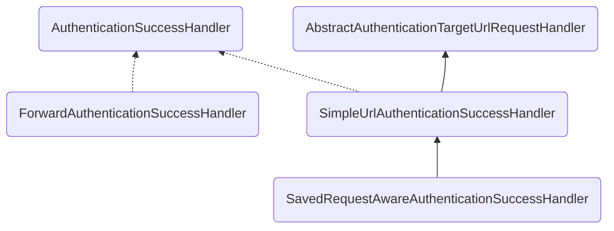
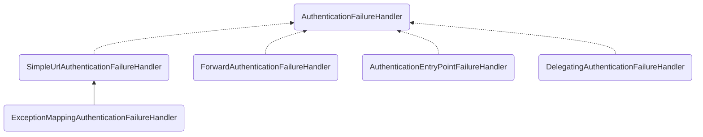
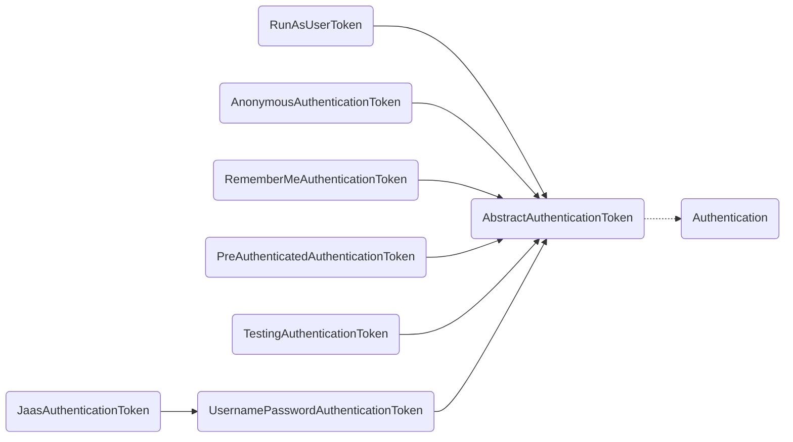
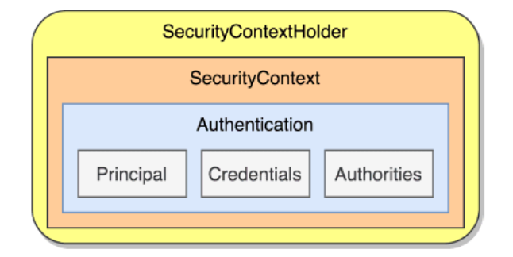
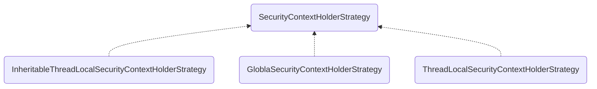
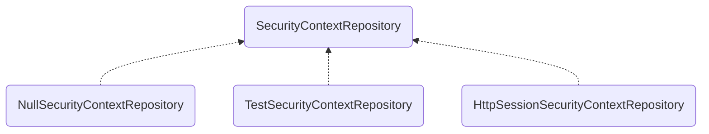
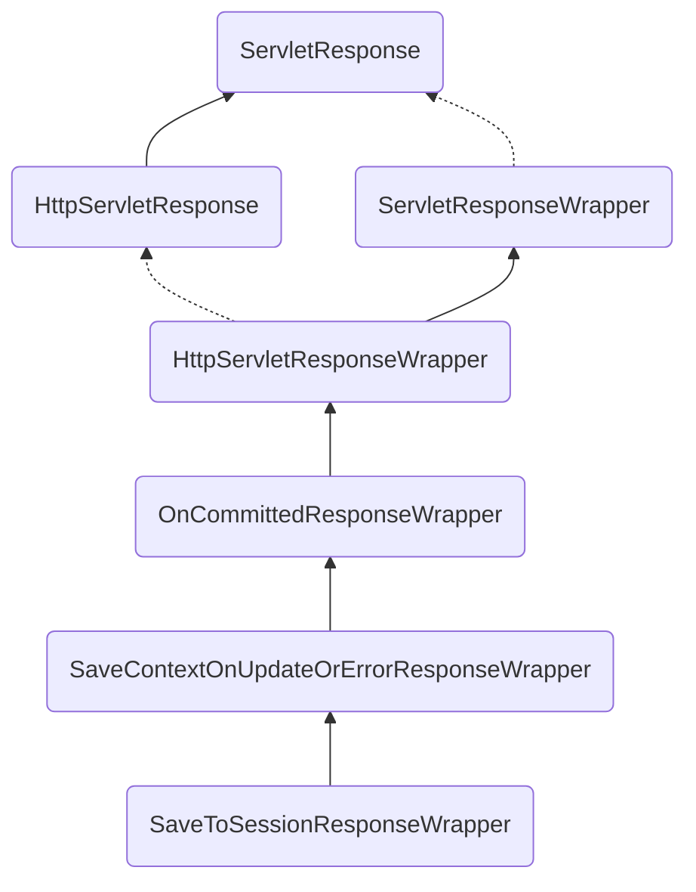
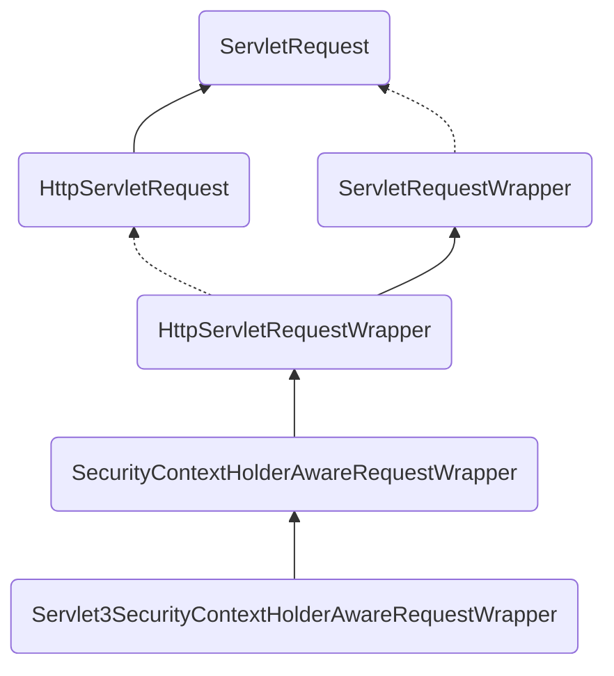

```toc
```

这里切换到分支 f_20230607_customize_form，相关前端页面可以从[仓库](https://github.com/lenve/spring-security-samples.git)中拷贝

## 基本案例


表单 `login.html`

```html
<div class="materialContainer">
    <div class="box">
        <div class="title">登录</div>
        <form action="/doLogin" method="post">
            <div class="input">
                <label for="name">用户名</label>
                <input type="text" name="name" id="name">
                <span class="spin"></span>
            </div>
            <div class="input">
                <label for="pass">密码</label>
                <input type="password" name="pass" id="pass">
                <span class="spin"></span>
            </div>
            <div class="button login">
                <button type="submit">
                    <span>登录</span>
                    <i class="fa fa-check"></i>
                </button>
            </div>
        </form>
        <a href="javascript:" class="pass-forgot">忘记密码？</a>
    </div>
</div>
```

新建一个配置类进行配置

```java
@Configuration
public class SecurityConf extends WebSecurityConfigurerAdapter {

    @Bean
    PasswordEncoder passwordEncoder() {
        return NoOpPasswordEncoder.getInstance();
    }

    @Override
    protected void configure(HttpSecurity http) throws Exception {
        http.authorizeRequests()
            .anyRequest()
            .authenticated()
            .and()
            .formLogin()
            // 指定登陆页面
            .loginPage("/login.html")
            .loginProcessingUrl("/doLogin")
            .defaultSuccessUrl("/index")
            .failureUrl("/login.html")
            .usernameParameter("name")
            .passwordParameter("pass")
            // 表示跟登录相关接口不做拦截
            .permitAll()
            .and()
            // 禁用CSRF防御，后面再说
            .csrf().disable();
    }

    /**
     * 对相关静态资源放行
     */
    @Override
    public void configure(WebSecurity web) throws Exception {
        web.ignoring().antMatchers("/js/**", "/css/**", "/images/**");
    }

    @Override
    protected void configure(AuthenticationManagerBuilder auth) throws Exception {
        auth.inMemoryAuthentication()
            .withUser("joy")
            .password("walp1314")
            .roles("admin");
    }
}
```

这里需要进行说明：

1、首先对于密码暂时不进行加密
2、对于相关前端静态资源放行
3、通过 java 配置用户名密码和角色，这样就不用在 `application.properties` 中配置了

表单需要特别说明：
- `authorizeRequests()` 表示开启权限认证
- `anyRequest().authenticated()` 方法表示对所有的请求都进行认证
- `formLogin()` 表示开启表单登录配置
- `loginPage` 配置登录页面的地址是 `/login.html`
- `loginProcessingUrl` 配置登录提交的后台接口，也就是表单中的 `action="/doLogin"`，这里表示 security 会将提交的地址设置为 `/doLogin`，这样点击提交 security 就能接收到相关用户信息来进行登录
- `fialureUrl` 配置登录失败后的跳转地址
- `usernameParameter, passwordParameter` 用来设置接收用户名和参数的变量名字，这个必须和表单中的 `name="name", name="pass"` 保持一致。

## 配置细节

### defaultSuccessUrl & successForwardUrl

登录成功后进行跳转可以通过方法 `defaultSuccessUrl` 和 `successForwardUrl` 进行设置，两者有所不同
- 前者表示登录成功后会跳转到最初的地址，比如一开始想访问的是 `/hello`，那么登录成功后就跳转到此地址。而如果用户已开始就想访问登录页面，那么就重定向到 defaultSuccessUrl 所指定的地址中
- 后者则不会，只要登录成功，就会重定向到其指定的地址。当然使用 defaultSuccessUrl 的另外一个重载方法并将第二个参数设置为 true 也可以实现此功能。

### AuthenticationSuccessHandler

其实这里的 defaultSuccessUrl 和 successForwardUrl 最终都是配置的 AuthenticationSuccessHandler 接口的实例，此类就是用来处理登录成功事项：

```java
public interface AuthenticationSuccessHandler {

    default void onAuthenticationSuccess(HttpServletRequest request, HttpServletResponse response, FilterChain chain, Authentication authentication) throws IOException, ServletException {
        this.onAuthenticationSuccess(request, response, authentication);
        chain.doFilter(request, response);
    }

    void onAuthenticationSuccess(HttpServletRequest request, HttpServletResponse response, Authentication authentication) throws IOException, ServletException;
}
```

这里有两个方法，其中 default 方法在处理特定的认证请求 Authentication Filter 中会用到。另外一个非 default 方法则用来处理登录成功的具体事项，其中 authentication 参数保存了登录成功的用户信息。



这里几个类的基本作用如下：
- SimpleUrlAuthenticationSuccessHandler 通过 AbstractAuthenticationTargetUrlRequestHandler 中的 handle 方法实现请求重定向
- SavedRequestAwareAuthenticationSuccessHandler 在 SimpleUrlAuthenticationSuccessHandler 的基础上增加了请求缓存的功能，可以记录之前请求的地址，进而在登录成功后重定向到一开始的访问地址。
- ForwardAuthenticationSuccessHandler 实现比较容易，就是一个服务端跳转

### SavedRequestAwareAuthenticationSuccessHandler

```java
// AbstractAuthenticationTargetUrlRequestHandler
public final T defaultSuccessUrl(String defaultSuccessUrl) {
	return defaultSuccessUrl(defaultSuccessUrl, false);
}
public final T defaultSuccessUrl(String defaultSuccessUrl, boolean alwaysUse) {
	SavedRequestAwareAuthenticationSuccessHandler handler = new SavedRequestAwareAuthenticationSuccessHandler();
	handler.setDefaultTargetUrl(defaultSuccessUrl);
	handler.setAlwaysUseDefaultTargetUrl(alwaysUse);
	this.defaultSuccessHandler = handler;
	return successHandler(handler);
}

// SavedRequestAwareAuthenticationSuccessHandler
public void onAuthenticationSuccess(HttpServletRequest request, HttpServletResponse response, Authentication authentication) throws ServletException, IOException {
	SavedRequest savedRequest = this.requestCache.getRequest(request, response);
	if (savedRequest == null) {
		super.onAuthenticationSuccess(request, response, authentication);
	} else {
		String targetUrlParameter = this.getTargetUrlParameter();
		if (!this.isAlwaysUseDefaultTargetUrl() && (targetUrlParameter == null || !StringUtils.hasText(request.getParameter(targetUrlParameter)))) {
			this.clearAuthenticationAttributes(request);
			String targetUrl = savedRequest.getRedirectUrl();
			this.getRedirectStrategy().sendRedirect(request, response, targetUrl);
		} else {
			this.requestCache.removeRequest(request, response);
			super.onAuthenticationSuccess(request, response, authentication);
		}
	}
}
```

基本逻辑如下：
- 首先从 requestCache 中获取缓存下来的请求，如果没有获取到，就说明用户在访问登录页之前没有访问其他页面，此时会直接重定向到 defaultSucessUrl 指定的地址。
- 如果缓存不为空，获取到用户指定的希望登录成功后重定向的地址，如用户的请求是 `http://localhost:8888/hello`,登陆后的提交地址就变成了 `http://localhost:8888/doLogin?target=/hello`，也就是 targetUrlParameter=/hello，这表示登陆成功后要跳转到此地址
	- 如果 targetUrlParameter 存在，或者用户设置了 alwaysUseDefaultTargetUrl 为 true（上面方法中为 false），那就没有必要缓存请求，会直接进行重定向。alwayUseDefaultTargetUrl 为 true，则直接重定向到此地址，否则重定向到 targetUrlParameter 指定的地址。
	- 否则，清掉缓存，直接重定向到 defaultSuccessUrl 指定的地址

当然用户也可以自己指定 SavedRequestAwareAuthenticationSuccessHandler

```java
//SecurityConf#configure
.successHandler(successhandler())

SavedRequestAwareAuthenticationSuccessHandler successHandler() {
	SavedRequestAwareAuthenticationSuccessHandler handler = 
		new SavedRequestAwareAuthenticationSuccessHandler();
	handler.setDefaultTargeturl("/index”)；
	handler.setTargeturlParameter("target ");
	return handler;
```

这里指定了 targetUrlParameter 为 target，这样用户就可以在登陆请求中，通过 target 来指定跳转地址了

```html
action="/doLogin?target=/hello" method="post"
```

这样登录成功后就始终跳转到 "/hello" 接口了。


### ForwardAuthenticationSuccessHandler

此类实现很简单，就是进行一个服务端请求转发

```java
public void onAuthenticationSuccess(HttpServletRequest request, HttpServletResponse response, Authentication authentication) throws IOException, ServletException {
	request.getRequestDispatcher(this.forwardUrl).forward(request, response);
}
```

### 无需跳转场景

参考 tag：`customize_form_v2`

AuthenticationSuccessHandler 默认的三个实现类，无论是哪一个，都是用来处理页面跳转的。有时候页面跳转并不能满足我们的需求，特别是现在流行的前后端分离开发中，用户登录成功后，就不再需要页面跳转了，只需要给前端返回一个 JSON 数据即可，告诉前端登录成功还是登录失败，前端收到消息之后自行处理。像这样的需求，我们可以通过自定义 AuthenticationSuccessHandler 的实现类来完成：

```java
public class MyAuthenticationSuccessHandler implements AuthenticationSuccessHandler {

    @Override
    public void onAuthenticationSuccess(HttpServletRequest request, HttpServletResponse response,
        Authentication authentication) throws IOException, ServletException {
        response.setContentType("application/json;charset=utf-8");
        HashMap<String, Object> resp = new HashMap<>();
        resp.put("status", 200);
        resp.put("msg", "login succ");
        ObjectMapper om = new ObjectMapper();
        String s = om.writeValueAsString(resp);
        response.getWriter().write(s);
    }
}
```

然后修改配置类

```java
// SecurityConf#configure
// .defaultSuccessUrl("/index")  
.successHandler(new MyAuthenticationSuccessHandler())
```

### 登录失败

`AuthenticationFailureffandler` 接口中只有一个 onAuthenticationFailure 方法，用来处理登录失败请求，request 和 response 参数很好理解，最后的 exception 则表示登录失败的异常信息。Spring Security 中为 AuthenticationFailureHandler 一共提供了五个实现类，如图所示。



相关基本功能如下：

- (1) SimpleUrlAuthenticationFailureHandler 默认的处理逻辑就是通过重定向跳转到登录页面，当然也可以通过配置 forwardToDestination 属性将重定向改为服务器端跳转，failureUrl 方法的底层实现逻辑就是 `SimpleUrlAuthenticationFailureHandler`。
- (2) ExceptionMappingAuthenticationFailureHandler 可以实现根据不同的异常类型，映射到不同的路径。
- (3) ForwardAuthenticationFailureHandler 表示通过服务器端跳转来重新回到登录页面，FailureForwardUrl 方法的底层实现逻辑就是 ForwardAuthenticationFailureHandler.
- (4) AuthenticationEntryPointFailureHandler 是 Spring Security 5.2 新引进的处理类，可以通过 AuthenticationEntryPoint 来处理登录异常。
- (5) DelegatingAuthenticationFailureHandler 可以实现为不同的异常类型配置不同的登录失败处理回调。

和之前登录成功一样，这里也可以自定义失败处理

```java
protected void configure(HttpSecurity http) throws Exception {
	http.authorizeRequests()
		.anyRequest()
		.authenticated()
		.and()
		.formLogin()
		// 指定登陆页面
		.loginPage("/login.html")
		.loginProcessingUrl("/doLogin")
        .defaultSuccessUrl("/index")
		.failureHandler(failureHandler())
		.usernameParameter("name")
		.passwordParameter("pass")
		.permitAll()
		.and()
		.csrf().disable();
}

SimpleUrlAuthenticationFailureHandler failureHandler() {
	SimpleUrlAuthenticationFailureHandler handler = new SimpleUrlAuthenticationFailureHandler("/login.html");
	handler.setUseForward(true);
	return handler;
}
```

这里将 forwardToDestination 属性设置为 true，这样登录失败后通过服务器端跳转回到登录界面，达到和使用 failureForwardUrl 一样的效果。和登录成功一样，我们也可以自己实现 `AuthenticationFailureHandler` 来实现返回给前端 json 数据，而不是跳转。

### 注销登录

默认情况下，我们使用地址 `http://localhost:8888/logout` 可以实现注销功能，其实就是如同下面配置

```java
protected void configure(HttpSecurity http) throws Exception {
	http.authorizeRequests()
		.anyRequest()
		.authenticated()
		.and()
		.formLogin()
		// ...

		// 注销登录
		.and()
		.logout()
		.logoutUrl("/logout")
		.invalidateHttpSession(true)
		.clearAuthentication(true)
		.logoutSuccessUrl("/login.html")

		.and()
		.csrf().disable();
}
```

注销成功后会跳转到登录页面
- `logout()` 开启注销登录配置
- `logoutUrl` 指定登录请求地址，默认是 GET 请求，路径为 `/logout`
- `invalidateHttpSession` 表示是否使 session 失效，默认为 true
- `clearAuthentication` 表示是否清除认证信息，默认是 true
- `logoutSuccessUrl` 表示注销登录后跳转地址

也可以通知指定请求的方法：

```java
protected void configure(HttpSecurity http) throws Exception {
	http.authorizeRequests()
		.anyRequest()
		.authenticated()
		.and()
		.formLogin()
		// ...

		// 注销登录
		.and()
		.logout()
		.logoutRequestMatcher(new OrRequestMatch(
			new AntPathRequestMatcher("/logout1", "GET"),
			new AntPathRequestMatcher("/logout2", "POST")
			))
		.logoutSuccessHandler((req, response, auth) -> {
			response.setContentType("application/json;charset=utf-8");  
			HashMap<String, Object> resp = new HashMap<>();  
			resp.put("status", 200);  
			resp.put("msg", "logout1 succ");  
			ObjectMapper om = new ObjectMapper();  
			String s = om.writeValueAsString(resp);  
			response.getWriter().write(s);
		})
		.invalidateHttpSession(true)
		.clearAuthentication(true)

		.and()
		.csrf().disable();
}
```

这里指定了两个注销地址，分别是两种方式，但是响应处理相同，都是返回 json 数据，而不是跳转页面。当然也可以分开设定

```java
protected void configure(HttpSecurity http) throws Exception {
	http.authorizeRequests()
		.anyRequest()
		.authenticated()
		.and()
		.formLogin()
		// ...

		// 注销登录
		.and()
		.logout()
		.logoutRequestMatcher(new OrRequestMatch(
			new AntPathRequestMatcher("/logout1", "GET"),
			new AntPathRequestMatcher("/logout2", "POST")
			))
		.logoutSuccessHandlerFor((req, response, auth) -> {
			response.setContentType("application/json;charset=utf-8");  
			HashMap<String, Object> resp = new HashMap<>();  
			resp.put("status", 200);  
			resp.put("msg", "logout1 succ");  
			ObjectMapper om = new ObjectMapper();  
			String s = om.writeValueAsString(resp);  
			response.getWriter().write(s);
		},new AntPathRequestMatcher("/logout1", "GET"))
		.logoutSuccessHandlerFor((req, response, auth) -> {
			response.setContentType("application/json;charset=utf-8");  
			HashMap<String, Object> resp = new HashMap<>();  
			resp.put("status", 200);  
			resp.put("msg", "logout2 succ");  
			ObjectMapper om = new ObjectMapper();  
			String s = om.writeValueAsString(resp);  
			response.getWriter().write(s);
		},new AntPathRequestMatcher("/logout2", "POST"))
		.invalidateHttpSession(true)
		.clearAuthentication(true)

		.and()
		.csrf().disable();
}
```


## 登录用户数据获取

登录成功之后，在后续的业务逻辑中，开发者可能还需要获取登录成功的用户对象，如
果不使用任何安全管理框架，那么可以将用户信息保存在 HtpSession 中，以后需要的时候直接从 HttpSession 中获取数据。在 Spring Security 中，用户登录信息本质上还是保存在 HttpSession 中，但是为了方便使用，Spring Seeurity 对 HttpSession 中的用户信息进行了封装，封装之后，开发者若再想获取用户登录数据就会有两种不同的思路：

(1) 从 SecurityContextHolder 中获取。
(2）从当前请求对象中获取。

无论是哪种获取方式，都离不开一个重要的对象：Authentication。在 Spring Security 中，Authentication 对象主要有两方面的功能：
- 作为 AuthenticationManager 的输入参数，提供用户身份认证的凭证，当它作为一个输入参数时，它的 isAuthenticated 方法返回 false，表示用户还未认证。
- 代表已经经过身份认证的用户，此时的 Authentication 可以从 `SeeurityContext` 中获取。

一个 Authentication 对象主要包含三个方面的信息：
- principal：定义认证的用户。如果用户使用用户名/密码的方式登录，principal 通常就是一个 UserDetails 对象。
- credentials：登录凭证，一般就是指密码。当用户登录成功之后，登录凭证会被自动擦除，以防止泄漏。
- authorities：用户被授予的权限信息。

Java 本身提供了 Principal 接口用来描述认证主体，可以代表一个公司、个人或者登录 ID。

```java
public interface Authentication extends Principal, Serializable {
	// 获取授予的权限信息
    Collection<? extends GrantedAuthority> getAuthorities();
	// 获取用户凭证，一般指密码
    Object getCredentials();
	// 获取用户详情，可能是当前的请求之类的信息
    Object getDetails();
	// 获取认证主体
    Object getPrincipal();
	// 是否认证成功了
    boolean isAuthenticated();
    void setAuthenticated(boolean isAuthenticated) throws IllegalArgumentException;
}
```

相关实现如图



这里对每个类的功能做一个大概介绍：

- AbstractAuthenticationToken：该类实现了 Authentication 和 CredentialsContainer 两个接口，在 AbstractAuthenticationToken 中对 Authentication 接口定义的各个数据获取方法进行了实现，CredentialsContainer 则提供了登录凭证擦除方法。一般在登录成功后，为了防止用户信息泄漏，可以将登录凭证（例如密码）擦除。

- RememberMeAuthenticationToken：如果用户使用 RememberMe 的方式登录，登录信息将封装在 RememberMeAuthenticationToken 中。

- TestingAuthenticationToken：单元测试时封装的用户对象。

- AnonymousAuthenticationToken：匿名登录时封装的用户对象。

- RunAsUserToken：替换验证身份时封装的用户对象。

- `UseramePasswordAuthenticationToken`：表单登录时封装的用户对象。

- `JaasAuthenticationToken`：JAAS 认证时封装的用户对象。

- `PreAuthenticatedAuthenticationToken`： Pre-Authentication 场景下封装的用户对象。

在这些 Authentication 的实例中，最常用的有两个：`UseramePasswordAuthenticationToken` 和 `RememberMeAuthenticationToken`。在之前的案例对应的用户认证对象就是 `UsernamePasswordAuthenticationToken`。

### 从 SecurityContextHolder 中获取

```java
// UserController
@GetMapping("/user")
public void userInfoQry() {
	// 这里是通过一个静态方法获取的，也就表示在哪里都可以获取到用户信息
	Authentication authentication = SecurityContextHolder.getContext().getAuthentication();
	String name = authentication.getName();
	Collection<? extends GrantedAuthority> authorities = authentication.getAuthorities();
	System.out.println("name: " + name);

	Gson gson = new Gson();
	System.out.println("authorities: " + gson.toJson(authorities));
}
```

```
name: joy
authorities: [{"role":"ROLE_admin"}]
```

#### SecurityContextHolder

SecurityContextHolder 中存储的是 SecurityContext，SecurityContext 中存储的则是 Authentication，三者的关系如图所示。



首先在 SecurityContextHolder 中存放的是 SecurityContext, SecurityContextHolder 中定义了三种不同的数据存储策略，这实际上是一种典型的策略模式：
- `MODE_THREADLOCAL`：这种存放策略是将 SecurityContext 存放在 ThreadLocal中，大家知道 ThreadLocal 的特点是在哪个线程中存储就要在哪个线程中读取，这其实非常适合 Web 应用，因为在默认情况下，一个请求无论经过多少 Filter 到达 Servlet，都是由一个线程来处理的。这也是 SecurityContextHolder 的默认存储策略，这种存储策略意味着如果在具体的业务处理代码中，开启了子线程，在子线程中去获取登录用户数据，就会获取不到。
- `MODE_INHERITABLETHREADLOCAL`：这种存储模式适用于多线程环境，如果希望在子线程中也能够获取到登录用户数据，那么可以使用这种存储模式。
- `MODE_GLOBAL`：这种存储模式实际上是将数据保存在一个静态变量中，在 Java Web 开发中，这种模式很少使用到

接口中用来规范存储策略的方法如下：
```java
public interface SecurityContextHolderStrategy {
	// 清除存储的SecurityContext对象
    void clearContext();
	// 获取存储的SecurityContext对象
    SecurityContext getContext();
	// 设置存储的SecurityContext对象
    void setContext(SecurityContext context);
	// 创建一个空的SecurityContext对象
    SecurityContext createEmptyContext();
}
```

此接口一共有三个实现类，对应了三种不同的存储策略，如图所示



具体实现原理这里先不细究了，这里要说明的是，如果要在子线程中获取用户信息，则需要使用 InheritableThreadLocalSecurityContextHolderStrategy 对应的 `MODE_INHERITABLETHREADLOCAL` 模式，默认的存储策略是通过 `System.getProperty` 加载的，可以通过配置 `VM options` 进行设置

```
-Dspring.security.strategy=MODE_INHERITABLETHREADLOCAL
```

#### SecurityContextPersistenceFilter

默认情况下，在 Spring Security 过滤器链中，SecurityContextPersistenceFilter 是第二道防线，位于 WebAsyncManagerIntegrationFilter 之后。从 Security ContextPersistenceFilter 这个过滤器的名字上就可以推断出来，它的作用是为了存储 SecurityContext 而设计的。

整体上来说，SecurityContextPersistenceFilter 主要做两件事情：
(1）当一个请求到来时，从 HttpSession 中获取 SecurityContext 并存入 SecurityContextHolder 中，这样在同一个请求的后续处理过程中，开发者始终可以通过 SecurityContextHolder获取到当前登录用户信息。
(2）当一个请求处理完毕时，从 SecurityContextHolder 中获取 SecurityContext 并存入 HttpSession 中（主要针对异步 Servlet），方便下一个请求到来时，再从 HttpSession 中拿出来使用，同时擦除 SecurityContextHolder 中的登录用户信息。

> 在 SecurityContextPersistenceFilter 过滤器中，当一个请求处理完毕时，从 SecurityContextHolder 中获取 SecurityContext 存入 HttpSession 中，这一步的操作主要是针对异步 Servlet。如果不是异步 Servlet, 在响应提交时，就会将 SecurityContext 保存到 HttpSession 中了，而不会等到在 SecurityContextPersistenceFilter 过滤器中再去存储。

*SecurityContextRepository*

其实将 SecurityContext 存入 HttpSession，或者从 HttpSession 中加载数据并转为 SecurityContext 对象，这些事情都是由 SecurityContextRepository 接口的实现类完成的，因此这里我们就先从 SecurityContextRepository 接口开始看起。

```java
public interface SecurityContextRepository {
	// 加载SecurityContext对象，对于未登录用户，这里返回一个空的SecurityContext
	// 对象。这里空对象是指不存在Authentication对象，而不是返回null
    SecurityContext loadContext(HttpRequestResponseHolder requestResponseHolder);
	// 保存SecurityContext对象
    void saveContext(SecurityContext context, HttpServletRequest request, HttpServletResponse response);
	// 判断SecurityContext对象是否存在
    boolean containsContext(HttpServletRequest request);
}
```

其有三个实现类，如图所示



TestSecurityContextRepository 为单元测试提供支持
NullSecurityContextRepository 实现类中，loadContext 方法总是返回一个空的 SecurityContext 对象，SaveContext 方法未做任何实现，containsContext 方法总是返回 false，所以 NullSecurityContextRepository 实现类实际上未做 SecurityContext 的存储工作。

在 Spring Security 中默认使用的实现类是 `HttpSessionSecurityContextRepository`，通过
`HttpSessionSecurityContextRepository` 实现了将 SecurityContext 存储到 HttpSession 以及从 HttpSession 中加载 SecurityContext 出来。这里我们来重点看一下 `HttpSessionSecurityContextRepository` 类。

*HttpSessionSecurityContextRepository*

此类中封装了两个内部类，SaveToSessionResponseWrapper 和 SaveToSessionRequestWrapper 分别来处理请求和响应相关的存储工作。

*SaveToSessionResponseWrapper*


这里看到其实就是对 HttpServletResponse 进行了相关功能增强
- HttpServletResponseWrapper: 它是 HttpServletResponse 的装饰类，利用 HttpServletResponse Wrapper 可以方便地操作参数和输出流等。
- OnCommittedResponseWrapper: 对 HttpServletResponseWrapper 功能进行了增强，最重要的增强在于可以获取 HttpServletResponse 的提交行为。当 HttpServletResponse 的 sendError、 sendRedirect、 flushBuffer、 flush 以及 close 等方法被调用时，onResponseCommitted 方法会被触发，开发者可以在 onResponseCommitted 方法中做一些数据保存操作，例如保存 SecurityContext。不过 OnCommittedResponseWrapper 中的 onResponseCommitted 方法只是一个抽象方法，并没有具体的实现，具体的实现则在它的实现类 SaveContextOnUpdateOrErrorResponseWrapper 中。
- SaveContextOnUpdateOrErrorResponseWrapper：该类对 onResponseCommitted 方法做了实现。声明了一个 contextSaved 变量，表示 SecurityContext 是否己经存储成功。当 HttpServletResponse 提交时，会调用 onResponseCommitted 方法，在 onResponseCommitted 方法中调用 saveContext 方法，将 SecurityContext 保存到 HttpSession 中，同时将 contextSaved 变量标记为 true。saveContext 方法在这里也是一个抽象方法，具体的实现则在 SaveToSessionResponseWrapper 类中。

*SaveToSessionResponseWrapper*

在 SaveToSessionResponseWrapper 中其实主要定义了三个方法：saveContext、 contextChanged 以及 createNewSessionIfAllowed。其核心功能就是在 HttpServletResponse 提交时，将 SecurityContext 保存到 HttpSession 中。

- saveContext：该方法主要是用来保存 SecurityContext，如果 authentication 对象为 null 或者它是一个匿名对象，则不需要保存 SecurityContext。如果 httpSession 不为 null 并且 `authBeforeExecution` 也不为 null，就从 httpSession 中将保存的登录用户数据移除，这个主要是为了防止开发者在注销成功的回调中继续调用 `chain.doFilter`方法，进而导致原始的登录信息无法清除的问题；如果 HttpSession 为 null，则去创建一个 HttpSession 对象；最后，如果 SecurityContext 发生了变化，或者 httpSession 中没有保存 SecurityContext，则调用 httpSession 中的 setAttribute 方法将 SecurityContext 保存起来。
- contextChanged：该方法主要用来判析 SecurityContext 是否发生变化，因为在程序运行过程中，开发者可能修改了 SecurityContext 中的 Authentication 对象。
- createNewSessionIfAllowed：该方法用来创建一个 HttpSession 对象。


*SaveToSessionRequestWrapper*

SaveToSessionRequestWrapper 类实际上是在 Spring Security 3.2 之后出现的封装类，在 Spring Security 3.2 之前并不存在 SaveToSessionRequest Wrapper 类。封装的 SaveToSessionRequestWrapper 类主要作用是禁止在异步 Servlet 提交时，自动保存 SecurityContext。

在异步 Servlet 中，当任务执行完毕之后，HttpServletResponse 也会自动提交，在提交的过程中会自动保存 SecurityContext 到 HttpSession 中，但是由于是在子线程中，因此无法获取到 SecurityContext 对象 (SecurityContextHolder 默认将数据存储在 ThreadLocal 中），所以会保存失败。如果开发者使用了异步 Servlet，则默认情况下会禁用 HttpServletResponse
提交时自动保存 SecurityContext 这一功能，改为在 SecurityContextPersistenceFilter 过滤器中完成 SecurityContext 保存操作。

其实 HttpSessionSecurityContextRepository 的主要功能就是对 HttpSession（SecurityContext）进行一个加载和存储的功能。这些功能都将在 SecurityContextPersistenceFilter 中调用。其基本逻辑比较容易

```java
private void doFilter(HttpServletRequest request, HttpServletResponse response, FilterChain chain)
		throws IOException, ServletException {
	// 这个参数是为了保证过滤器只执行一次
	if (request.getAttribute(FILTER_APPLIED) != null) {
		chain.doFilter(request, response);
		return;
	}
	request.setAttribute(FILTER_APPLIED, Boolean.TRUE);
	// 表示是否要在过滤器链执行之前确保会话有效，由于较为耗时，默认为false
	if (this.forceEagerSessionCreation) {
		HttpSession session = request.getSession();
		if (this.logger.isDebugEnabled() && session.isNew()) {
			this.logger.debug(LogMessage.format("Created session %s eagerly", session.getId()));
		}
	}
	// 构建HttpRequestResponseHolder对象
	HttpRequestResponseHolder holder = new HttpRequestResponseHolder(request, response);
	// 加载SecurityContext，这里的repo就是
	// HttpSessionSecurityContextRepository实例
	SecurityContext contextBeforeChainExecution = this.repo.loadContext(holder);
	try {
		// 将获取到的SecurityContext存入SecurityContextHolder
		// 后面就可以通过静态方法获取到用户信息了
		SecurityContextHolder.setContext(contextBeforeChainExecution);
		if (contextBeforeChainExecution.getAuthentication() == null) {
			logger.debug("Set SecurityContextHolder to empty SecurityContext");
		}
		else {
			if (this.logger.isDebugEnabled()) {
				this.logger
						.debug(LogMessage.format("Set SecurityContextHolder to %s", contextBeforeChainExecution));
			}
		}
		// 这里的request和response已经是被封装过后的对象了，也就是
		// SaveToSessionResponseWrapper，SaveToSessionRequestWrapper
		chain.doFilter(holder.getRequest(), holder.getResponse());
	}
	finally {
		// 注意，这里已经是在过滤器链最后了
		// 获取最新的SecurityContext对象
		SecurityContext contextAfterChainExecution = SecurityContextHolder.getContext();
		// 将SecurityContext清理掉
		SecurityContextHolder.clearContext();
		// 保存SecurityContext
		this.repo.saveContext(contextAfterChainExecution, holder.getRequest(), holder.getResponse());
		request.removeAttribute(FILTER_APPLIED);
		this.logger.debug("Cleared SecurityContextHolder to complete request");
	}
}
```

这就是整个 SecurityContextPersistenceFilter 过滤器的工作逻辑。一言以蔽之，请求在到达 SecurityContextPersistenceFilter 过滤器之后，先从 HttpSession 中读取 SecurityContext 出来，并存入 SecurityContextHolder 之中以备后续使用；当请求离开SecurityContextPersistenceFilter 过滤器的时候，获取最新的 SecurityContext 并存入 HttpSession 中，同时清空SecurityContextHolder
中的登录用户信息。

### 从当前请求对象中获取

```java
// UserController
@GetMapping("/authentication")
public void authentication(Authentication authentication) {
	Gson gson = new Gson();
	System.out.println("authentication: " + gson.toJson(authentication));
}

@GetMapping("/principal")
public void principal(Principal principal) {
	Gson gson = new Gson();
	System.out.println("principal: " + gson.toJson(principal));
}
```

```
authentication: {"principal":{"username":"joy","authorities":[{"role":"ROLE_admin"}],"accountNonExpired":true,"accountNonLocked":true,"credentialsNonExpired":true,"enabled":true},"authorities":[{"role":"ROLE_admin"}],"details":{"remoteAddress":"0:0:0:0:0:0:0:1","sessionId":"2AEC60295671AD384DB3C6660D70D1FF"},"authenticated":true}
```

用过 Spring MVC 的读者都知道，Controller 中方法的参数都是当前请求 `HttpServletRequest` 带来的。毫无疑问，前面的 Authentication 和 Principal 参数也都是 HttpServletRequest 带来的，那么这些数据到底是何时放入 Http ServletRequest 的呢？又是以何种形式存在的呢？接下来我们一起分析一下。

在 Servlet 规范中，最早有三个和安全管理相关的方法：
```java
// 获取登录用户名
public String getRemoteUser();
// 判断当前登录用户是否具备某一个指定的角色
public boolean isUserInRole(String role);
// 获取当前认证主体
public java.Security.Principal getUserPrincipal();
```

从 Servlet 3.0 开始，在这三个方法的基础之上，又增加了三个和安全管理相关的方法：
```java
// 判断当前请求是否认证成功
public boolean authenticate (HttpServletResponse response)
Throws IOException, ServletException;

public void login (String username, String password) throws ServletException;

public void logout () throws ServletException;
```

不过 HttpServletRequest 只是一个接口，这些安全认证相关的方法，在不同环境下会有不同的实现。如果是一个普通的 web 项目，不使用任何框架，那么默认实现是 Tomcat 中的 RequestFacade，这里暂不深究。

如果使用了 Spring Security 框架，那在 Controller 中拿到的 HttpServletRequest 实例其实是 `Servlet3SecurityContextHolderAwareRequestWrapper`，基本继承关系如下



SecurityContextHolderAwareRequestWrapper 类主要实现了 Servlet 3.0 之前和安全管理相关的三个方法。Servlet 3.0 中新增的三个安全管理相关的方法，
则在 Servlet3SecurityContextHolderAwareRequestWrapper 类中实现。获取用户登录信息主要和前面三个方法有关，因此这里我们主要来看一下 SecurityContextHolderAwareRequestWrapper 类中相关方法的实现。具体源码比较简单，这里不细究了

(1) getAuthentication：该方法用来获取当前登录对象 Authentication，获取方式就是我们前面所讲的从 SecurityContextHolder 中获取。如果不是匿名对象就返回，否则就返回 null。
(2） getRemoteUser：该方法返回了当前登录用户的用户名，如果 Authentication 对象中存储的 Principal 是当前登录用户对象，则返回用户名；如果 Authentication 对象中存储的 Principal 是当前登录用户名（字符串），则直接返回即可。
(3) getUserPrincipal：该方法返回当前登录用户对象，其实就是Authentication 的实例。
(4) isGranted：该方法是一个私有方法，作用是判断当前登录用户是否具备某一个指定的角色。判断逻辑也很简单，先对传入进来的角色进行预处理，有的情况下可能需要添加 ROLE 前缀，角色前缀的问题在本书后面的章节中会做详细介绍，这里先不做过多的展开。然后调用 `Authentication#getAuthorities` 方法，获取当前登录用户所具备的所有角色，最后再和传入进来的参数进行比较。
(5) isUserInRole：该方法调用 isGranted 方法，进而实现判断当前用户是否具备某一个指定角色的功能。

可以看到我们通过 HttpServletRequest 就可以获取到很多用户登录信息了

```java
// UserController
@GetMapping("/info")
public void info(HttpServletRequest req) {
	String remoteUser = req.getRemoteUser();
	Authentication authentication = (Authentication) req.getUserPrincipal();
	System.out.println("remoteUser: " + remoteUser);
	Gson gson = new Gson();
	System.out.println("authentication: " + gson.toJson(authentication));
}
```

之前我们说过 SecurityContextHolderAwareRequestFilter 会对请求和响应进行再包装，每一次包装都会增加新功能，相关功能就是这样被添加进原始的请求和响应中的。

## 用户定义

相关代码参考分支：f_20230608_user_define

在前面的案例中，我们的登录用户是基于配置文件来配置的（本质是基于内存），但是
在实际开发中，这种方式肯定是不可取的，在实际项目中，用户信息肯定要存入数据库之中。

Spring Security 支持多种用户定义方式，接下来我们就逐个来看一下这些定义方式。通过前面的介绍，大家对于 UserDetailsService 以及它的子类都有了一定的了解，自定义用户其实就是使用 UserDetailsService 的不同实现类来提供用户数据，同时将配置好的 UserDetailsService 配置给AuthenticationManagerBuilder，系统再将 UserDetailsService 提供给
AuthenticationProvider 使用。


### 基于内存

之前的例子就用使用此类方式

```java
//SecurityConf
@Override
protected void configure(AuthenticationManagerBuilder auth) throws Exception {
	auth.inMemoryAuthentication()
		.withUser("joy")
		.password("walp1314")
		.roles("admin");
}
```

当然还可以这样写

```java
protected void configure(AuthenticationManagerBuilder auth) throws Exception {
	InMemoryUserDetailsManager manager = new InMemoryUserDetailsManager();
	manager.createUser(
		User.withUsername("joy")
		.password("walp1314").roles("admin").build());
	auth.userDetailsService(manager);
}
```

### 基于 `JdbcUserDetailsManager`

JdbcUserDetailsManager 支持将用户数据持久化到数据库，同时它封裝了一系列操作用户的方法，例如用户的添加、更新、查找等。
Spring Security 中为 `JdbcUserDetailsManager` 提供了数据库脚本，位置在
`org/springframework/security/core/userdetails/jdbc/users.ddl`

```sql
create table users(username varchar_ignorecase(50) not null primary key,password varchar_ignorecase(500) not null,enabled boolean not null);  
create table authorities (username varchar_ignorecase(50) not null,authority varchar_ignorecase(50) not null,constraint fk_authorities_users foreign key(username) references users(username));

create unique index ix_auth_username on authorities (username,authority);
```

这里一般也不用，就不细究了，看下面的基于 MyBatis

### 基于 `Mybatis`

相关集成引入的包

```xml
<!--【数据库】DAO框架 mybatis-->
<dependency>
	<groupId>org.mybatis.spring.boot</groupId>
	<artifactId>mybatis-spring-boot-starter</artifactId>
	<version>2.2.2</version>
</dependency>
<!--【数据库】DAO框架分页插件-->
<dependency>
	<groupId>com.github.pagehelper</groupId>
	<artifactId>pagehelper-spring-boot-starter</artifactId>
	<version>1.4.3</version>
</dependency>
<!--  【数据库】mysql driver  -->
<dependency>
	<groupId>mysql</groupId>
	<artifactId>mysql-connector-java</artifactId>
	<version>8.0.29</version>
</dependency>
<!--【数据库】数据库连接池-->
<dependency>
	<groupId>com.alibaba</groupId>
	<artifactId>druid</artifactId>
	<version>1.2.11</version>
</dependency>
```

同时添加一个插件

```xml
<plugin>
	<!--代码生成器-->
	<groupId>org.mybatis.generator</groupId>
	<artifactId>mybatis-generator-maven-plugin</artifactId>
	<version>1.4.1</version>
	<configuration>
		<verbose>true</verbose>
		<overwrite>true</overwrite>
		<!-- mybatis-generator配置文件路径 -->
		<configurationFile>${basedir}/src/main/resources/mybatis/generator/generator-config.xml</configurationFile>
	</configuration>
</plugin>
```

当然集成这么多内容可能目前用不到，但是既然需要集成，就整个完整的。本身由于涉及到相关的用户，权限，所以这里暂时就设计完整一点，参考[[用户管理系统 - 用户权限设计从入门到精通]]，当然还有更复杂的设计这里就不细究了。

```sql
create table t_user (
    id varchar(32) not null unique,
    email varchar(255),
    username varchar(255) not null unique comment '英文名',
    name varchar(255) not null comment '中文名',
    password varchar(255),
    mobile varchar(14) comment '手机号',
    enabled tinyint(1) default null comment '账户是否可用, 1-可用,0-不可用',
    account_non_expired tinyint(1) default null comment '账户没有过期, 1-没有过期,0-过期',
    account_non_locked tinyint(1) default null comment '账户没有锁定, 1-未锁定,0-锁定',
    credentials_non_expired tinyint(1) default null comment '凭证(密码)没有过期, 1-没有过期,0-过期',
    create_time datetime NOT NULL DEFAULT CURRENT_TIMESTAMP COMMENT '创建时间',
    update_time datetime NOT NULL DEFAULT CURRENT_TIMESTAMP ON UPDATE CURRENT_TIMESTAMP COMMENT '最后更新时间',
    primary key (id),
    key idx_username(username)
) ENGINE=InnoDB DEFAULT CHARSET=utf8 COLLATE=utf8_bin ROW_FORMAT=COMPACT COMMENT='用户表';

create table t_role (
    id varchar(32) not null unique,
    parent_id varchar(32) not null comment '父级角色id',
    role_name varchar(64) not null comment '角色名称',
    role_desc varchar(255) comment '角色描述',
    create_time datetime NOT NULL DEFAULT CURRENT_TIMESTAMP COMMENT '创建时间',
    update_time datetime NOT NULL DEFAULT CURRENT_TIMESTAMP ON UPDATE CURRENT_TIMESTAMP COMMENT '最后更新时间',
    primary key (id),
    key idx_parent_id(parent_id)
) ENGINE=InnoDB DEFAULT CHARSET=utf8 COLLATE=utf8_bin ROW_FORMAT=COMPACT COMMENT='角色表';

create table t_permission (
    id varchar(32) not null unique,
    p_name varchar(64) not null comment '权限名称',
    p_content varchar(255) not null comment '权限内容,比如url',
    p_desc varchar(255) comment '权限描述',
    create_time datetime NOT NULL DEFAULT CURRENT_TIMESTAMP COMMENT '创建时间',
    update_time datetime NOT NULL DEFAULT CURRENT_TIMESTAMP ON UPDATE CURRENT_TIMESTAMP COMMENT '最后更新时间',
    primary key (id)
) ENGINE=InnoDB DEFAULT CHARSET=utf8 COLLATE=utf8_bin ROW_FORMAT=COMPACT COMMENT='权限表';

create table t_role_permission (
    id varchar(32) not null unique,
    role_id varchar(32) not null comment '角色id',
    p_id varchar(32) not null comment '权限id',
    create_time datetime NOT NULL DEFAULT CURRENT_TIMESTAMP COMMENT '创建时间',
    update_time datetime NOT NULL DEFAULT CURRENT_TIMESTAMP ON UPDATE CURRENT_TIMESTAMP COMMENT '最后更新时间',
    primary key (id),
    key idx_role_id(role_id),
    key idx_p_id(p_id)
) ENGINE=InnoDB DEFAULT CHARSET=utf8 COLLATE=utf8_bin ROW_FORMAT=COMPACT COMMENT='角色权限表';

create table t_user_role (
    id varchar(32) not null unique,
    user_id varchar(32) not null comment '用户id',
    role_id varchar(32) not null comment '角色id',
    create_time datetime NOT NULL DEFAULT CURRENT_TIMESTAMP COMMENT '创建时间',
    update_time datetime NOT NULL DEFAULT CURRENT_TIMESTAMP ON UPDATE CURRENT_TIMESTAMP COMMENT '最后更新时间',
    primary key (id),
    key idx_user_id(user_id),
    key idx_role_id(role_id)
) ENGINE=InnoDB DEFAULT CHARSET=utf8 COLLATE=utf8_bin ROW_FORMAT=COMPACT COMMENT='用户角色表';
```

然后使用之前应用的 mybatis 插件生成相关类。最后要在启动类加上扫描注解
`@MapperScan(basePackages = "win.iot4yj.dao")`。整合涉及到的文件如下

```
application.yml
mybatis-config.xml
generator-config.xml
generator.properties
```

这里一定注意相关配置，特别是 pom 文件中关于 resource 的配置以及 yml 文件中的关于 mvc 的配置，很容易导致找不到相关页面报 404.

下面先看下具体实现，首先是要实现一个承载用户和角色的类

```java
package win.iot4yj.dto;

import java.util.ArrayList;
import java.util.Collection;
import java.util.List;
import org.springframework.security.core.GrantedAuthority;
import org.springframework.security.core.authority.SimpleGrantedAuthority;
import org.springframework.security.core.userdetails.UserDetails;
import win.iot4yj.entity.Role;
import win.iot4yj.entity.User;

/**
 * 用户dto类，需要实现UserDetails
 *
 * @author YJ
 * @date 2023/6/9
 **/
public class UserDto extends User implements UserDetails {

    private List<Role> roles = new ArrayList<>();

    @Override
    public Collection<? extends GrantedAuthority> getAuthorities() {
        List<SimpleGrantedAuthority> authorities = new ArrayList<>();
        for (Role role : roles) {
            SimpleGrantedAuthority authority = new SimpleGrantedAuthority(
                role.getRoleName());
            authorities.add(authority);
        }
        return authorities;
    }

    @Override
    public boolean isAccountNonExpired() {
        return this.getAccountNonExpired();
    }

    @Override
    public boolean isAccountNonLocked() {
        return this.getAccountNonLocked();
    }

    @Override
    public boolean isCredentialsNonExpired() {
        return this.getCredentialsNonExpired();
    }

    @Override
    public boolean isEnabled() {
        return this.getEnabled();
    }

    public List<Role> getRoles() {
        return roles;
    }

    public void setRoles(List<Role> roles) {
        this.roles = roles;
    }
}
```

这里要注意相关方法的覆写，特别是几个 `isXxx` 方法，这里继承了 security 的 UserDetails 类。而 service 类实现其实就是要查询出用户以及用户所拥有的角色。然后对于配置类 SecurityConf 类，主要是

```java
protected void configure(AuthenticationManagerBuilder auth) throws Exception {
	auth.userDetailsService(userDetailsService);
}
```

如果登陆失败，会直接跳转，没有相关的错误信息，其实可以自己实现一个错误处理类

```java
// SecurityConf#configure(HttpSecurity http)
.failureHandler(new MyAuthenticationFailHandler())


// MyAuthenticationFailHandler
public class MyAuthenticationFailHandler implements AuthenticationFailureHandler {

    @Override
    public void onAuthenticationFailure(HttpServletRequest request, HttpServletResponse response,
        AuthenticationException exception) throws IOException, ServletException {
        String message = exception.getMessage();
        System.out.println("-----error msg: " + message);

        request.getRequestDispatcher("/login.html").forward(request, response);
    }
}
```

