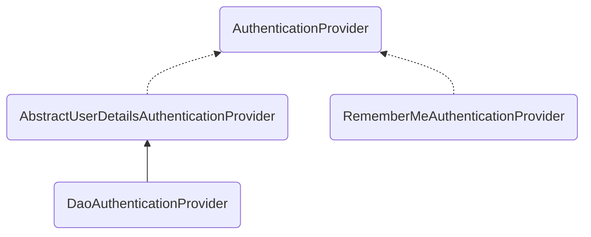
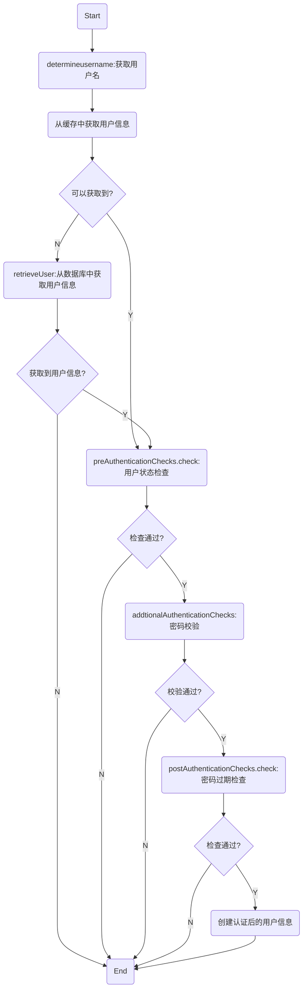
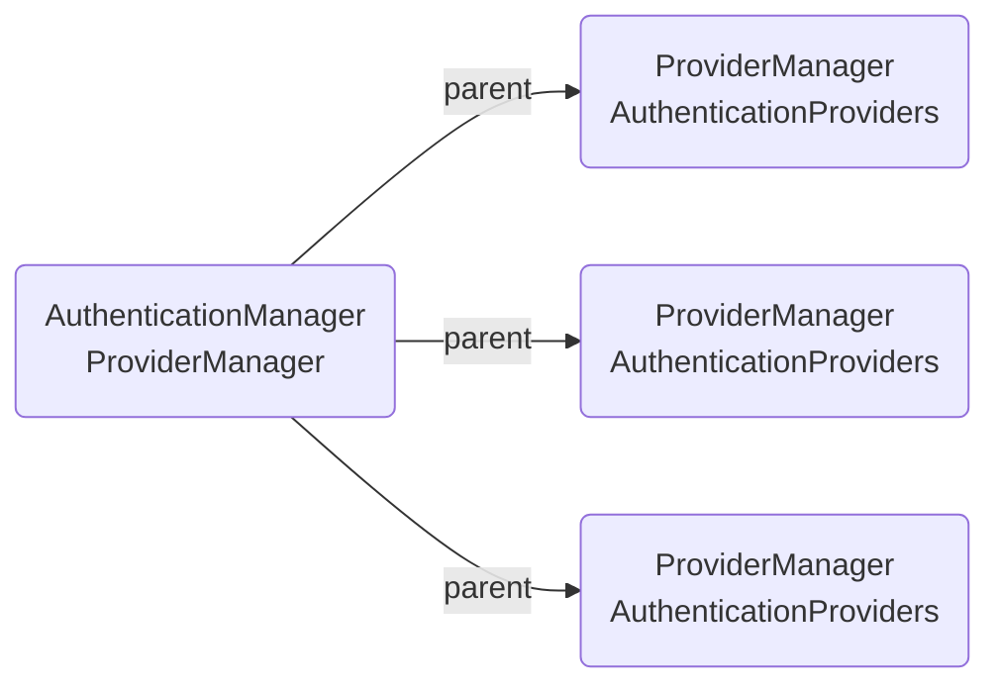
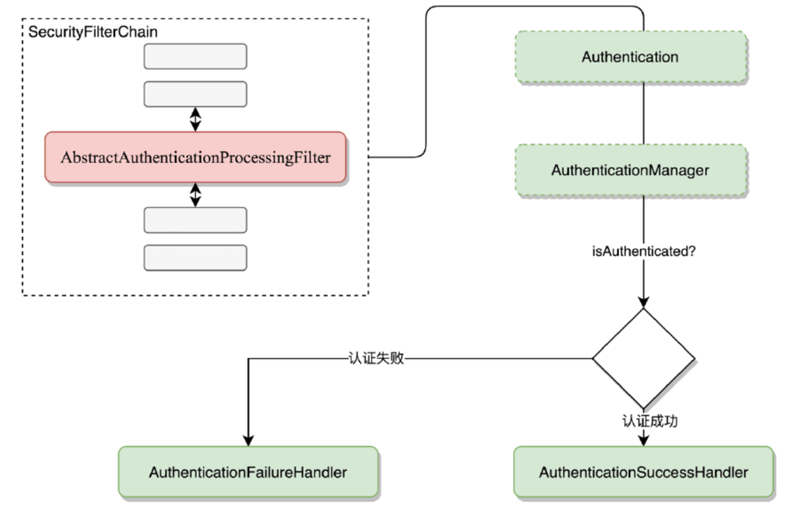
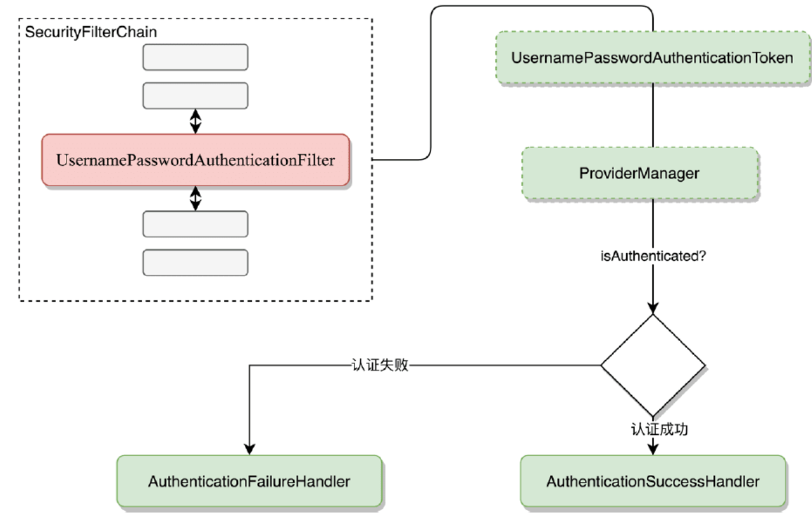

```toc

```


## 登陆流程分析

### AuthenticationManager

从名称上可以看出，AuthenticationManager 是一个认证管理器，它定义了 Spring Security 过滤器要如何执行认证操作。AuthenticationManager 在认证成功后，会返回一个 Authentication 对象。这个 Authentication 对象会被设置到 SecurityContextHolder 中。如果开发者不想用 Spring Security 提供的一套认证机制，那么也可以自定义认证流程，认证成功后，手动将 Authentication
存入 SecurityContextHolder 中。

AuthenticationMenager 是一个接口，它有着诸多的实现类，开发者也可以自定义
AuthenticationManager 的实现类，不过在实际应用中，我们使用最多的是 ProviderManager。在 Spring Security 框架中，默认也是使用 ProviderManager。

### AuthenticationProvider

```java
public interface AuthenticationProvider {
	// 具体的身份认证
	Authentication authenticate(Authentication authentication) throws AuthenticationException;
	// 判断当前AuthenticationProvider是否支持对应的身份类型
	boolean supports(Class<?> authentication);
}
```


`DaoAuthenticationProvider` 并没有重写 authenticate 方法，所以具体的认证逻辑在 AbstractUserDetailsAuthenticationProvider 的 authenticate 方法中。

- (1) 声明一个用户缓存对象 userCache，默认情况下没有启用缓存对象。
- (2) hideUserNotFoundExceptions 表示是否隐藏用户名查找失败的异常，默认为 true。为了确保系统安全，用户在登录失败时只会给出一个模糊提示，例如“用户名或密码输入错误”。在 Spring Security 内部，如果用户名查找失败，则会抛出 UsernameNotFoundException 异常，但是该异常会被自动隐藏，转而通过一个 BadCredentialsException 异常来代替它，这样，开发者在处理登录失败异常时，无论是用户名输入错误还是密码输入错误，收到的总是 BadCredentialsException，这样做的一个好处是可以避免新手程序员将用户名输入错误和密码输入错误两个异常分开提示。
- (3 ) forcePrincipalAsString 表示是否强制将 Principal 对象当成字符串来处理，默认是 false。Authentication 中的 principal 属性类型是一个 Object，正常来说，通过 principal 属性可以获取到当前登录用户对象（即 UserDetails），但是如果 forcePrincipalAsString 设置为 true，则 Authentication 中的 principal 属性返回就是当前登录用户名，而不是用户对象。
- (4) preAuthenticationChecks 对象则是用于做用户状态检查，在用户认证过程中，需要检验用户状态是否正常，例如账户是否被锁定、账户是否可用、账户是否过期等。
- (5) postAuthenticationChecks 对象主要负责在密码校验成功后，检查密码是否过期。
- (6) additionalAuthenticationChecks 是一个抽象方法，主要就是校验密码，具体的实现在 `DaoAuthenticationProvider` 中。
- (7) authenticate 方法就是核心的校验方法了。



以上就是认证的基本流程，当然实际流程还要稍微复杂一点，可以查看源码。认证后的对象中包含认证主体、凭证以及角色等信息。

这里有些方法是在子类中实现的，可以查看 `DaoAuthenticationProvider` 的相关源码。这里对相关方法进行说明：
- `preAuthenticationChecks.check`：这个方法是在 DefaultPreAuthenticationChecks 类中实现的，接收一个 UserDetails 类，从我们之前接入数据库的 `UserDto` 可以明白，我们需要实现 UserDetails 类。
- `postAuthenticationChecks.chekc`: 这个方法是在 DefaultPostAuthenticationChecks 中实现的，类似于上面的方法。这要就要求数据库中需要有相关的字段，当然如果没有，可以在 `UserDto` 中自己进行实现相关逻辑。
- `additionalAuthenticationChecks`：此方法在 `DaoAuthenticationProvider` 中实现。其实就是校验凭证（或者说密码），当然如果存在加密，那还需要解密。
- `retrieveUser`：此方法在 `DaoAuthenticationProvider` 中实现。此方法主要是规定获取用户信息的方式，通过 `UserDetailsService#loadUserByUsername` 获得，如果我们存在数据库中，那么可以通过实现此接口，然后实现此方法来定义自己的获取方式。
- `createSuccessAuthentication`：此方法就是创建最终认证后的用户信息对象。

### ProviderManager

```java
public class ProviderManager implements AuthenticationManager
```

在 Spring Security 中，由于系统可能同时支持多种不同的认证方式，例如同时支持用户名/密码认证、RememberMe 认证、手机号码动态认证等，而不同的认证方式对应了不同的AuthenticationProvider，所以一个完整的认证流程可能由多个 AuthenticationProvider 来提供。

多个 AuthenticationProvider 将组成一个列表，这个列表将由 ProviderManager 代理。换句话说，在 ProviderManager 中存在一个 AuthenticationProvider 列表，在 ProviderManager 中遍历列表中的每一个 AuthenticationProvider 去执行身份认证，最终得到认证结果。ProviderManager 本身也可以再配置一个 AuthenticationManager 作为 parent，这样当 ProviderManager 认证失败之后，就可以进入到 parent 中再次进行认证。理论上来说，ProviderManager 的 parent 可以是任意类型的 AuthenticationManager，但是通常都是由 ProviderManager 来扮演 parent 的角色，也就是 ProviderManager 是 ProviderManager 的 parent。

ProviderManager 本身也可以有多个，多个 ProviderManager 共用同一个 parent，当存在多个过滤器链的时候非常有用。当存在多个过滤器链时，不同的路径可能对应不同的认证方式，但是不同路径可能又会同时存在一些共有的认证方式, 这些共有的认证方式可以在 parent 中统一处理。如下图所示，当然实际情况一般不会这么复杂。


主要看下其中的 `ProviderManager#authenticate` 方法

```java
for (AuthenticationProvider provider : getProviders()) {
	if (!provider.supports(toTest)) {
		continue;
	}
	try {
		result = provider.authenticate(authentication);
		if (result != null) {
			copyDetails(authentication, result);
			break;
		}
	} catch
}
```
可以很好理解，就是遍历每一个 AuthenticationProvider，在验证之前先检查是不是支持这种登陆验证方式。

现在，大家己经熟悉了 Authentication、 AuthenticationManager、 AuthenticationProvider 以及 ProviderManager 的工作原理了，接下来的问题就是这些组件如何跟登录关联起来？这就涉及一个重要的过滤器—AbstractAuthenticationProcessingFilter。

### AbstractAuthenticationProcessingFilter

作为 Spring Security 过滤器链中的一环，AbstractAuthenticationProcessingFilter 可以用来处
理任何提交给它的身份认证，图描述了 `AbstractAutheaticationProeessingFifer` 的工作流程。


AbstractAuthenticationProcessingFilter 作为一个抽象类，如果使用用户名/密码的方式登录，那么它对应的实现类是 UsernamePasswordAuthenticationFilter，构造出来的 Authentication 对象则是 UsernamePasswordAuthenticationToken。至于 `AuthenticationManager`，前面已经说过，一般情况下它的实现类就是 ProviderManager，这里在 ProviderManager 中进行认证，认证成功就会进入认证成功的回调，否则进入认证失败的回调。因此，我们可以对上面的流程图再做进一步细化，如图所示。



同样的，如果有多种认证方式，那么就有多种 filter 实现，共同构成一个过滤器链。具体的逻辑可以查看源码。


## 配置多个数据源

略

## 添加登陆验证码

添加依赖

```xml
<!-- 简单的验证码生成工具，可以使用其他的如JCaptcha，或者 Google reCAPTCHA -->
<dependency>
	<groupId>com.github.penggle</groupId>
	<artifactId>kaptcha</artifactId>
	<version>2.3.2</version>
</dependency>
```

配置

```java
@Configuration
public class KaptchaConfig {

    @Bean
    Producer kaptcha() {
        Properties properties = new Properties();
        properties.setProperty("kaptcha.imgage.width", "150");
        properties.setProperty("kaptcha.imgage.height", "150");
        properties.setProperty("kaptcha.textproducer.char.string", "0123456789");
        properties.setProperty("kaptcha.textproducer.char.length", "6");

        Config config = new Config(properties);
        DefaultKaptcha defaultKaptcha = new DefaultKaptcha();
        defaultKaptcha.setConfig(config);
        return defaultKaptcha;
    }
}
```

这里提供类验证码的生成方式

```java
public class KaptchaAuthenticationProvider extends DaoAuthenticationProvider {

    @Override
    public Authentication authenticate(Authentication authentication)
        throws AuthenticationException {
        HttpServletRequest req =
            ((ServletRequestAttributes) RequestContextHolder.getRequestAttributes()).getRequest();
        String kaptcha = req.getParameter("verify_code");
        String sessionKaptcha = (String) req.getSession().getAttribute("verify_code");
        if (kaptcha != null && sessionKaptcha != null && kaptcha.equalsIgnoreCase(sessionKaptcha)) {
            return super.authenticate(authentication);
        }
        throw new AuthenticationServiceException("验证码输入错误");
    }
}
```

这里提供了验证码的验证方式，还需要对 security 进行配置

```java
// SecurityConfig
@Bean
AuthenticationProvider kaptchaAuthenticationProvider() {
	KaptchaAuthenticationProvider provider = new KaptchaAuthenticationProvider();
	provider.setPasswordEncoder(passwordEncoder());
	provider.setUserDetailsService(userDetailsService);
	return provider;
}

public AuthenticationManager authenticationManagerBean() throws Exception {
	ProviderManager manager = new ProviderManager(kaptchaAuthenticationProvider());
	return manager;
}
```
这里提供了一个 provider 交给 AuthenticationManager 进行管理，同时 `KaptchaAuthenticationProvider` 只是针对验证码进行验证，具体的加密方式和用户数据提供还是交给别的类来处理。

当然了，还得提供一个获取验证码的接口

```java
@RestController
public class VerifyCodeController {

    @Autowired
    private Producer producer;

    @GetMapping("/verifyCode.jpg")
    public void getVerifyCOde(HttpServletResponse resp, HttpSession session) throws IOException {
        resp.setContentType("image/jpeg");
        String text = producer.createText();
        session.setAttribute("verify_code", text);
        BufferedImage image = producer.createImage(text);
        try (ServletOutputStream out = resp.getOutputStream()) {
            ImageIO.write(image, "jpg", out);
        }
    }
}
```

同时需要对此接口的请求放行

```java
// SecurityConf#configure(HttpSecurity http)
protected void configure(HttpSecurity http) throws Exception {
	http.authorizeRequests()
		// 放行验证码获取请求
		.antMatchers("/verifyCode.jpg").permitAll()
		.anyRequest()
		...
```

登陆页面

```html
<!--login.html-->
<div class="form-group">
	<label for="verify_code" class="text-info">验证码</label>
	<input type="text" name="verify_code" id="verify_code" class="form-control">
	
	<span class="spin"></span>
</div>
```

具体代码放在分支 f_20230612_verify_code 上，暂时不合入主分支，因为后面有更好的方式。