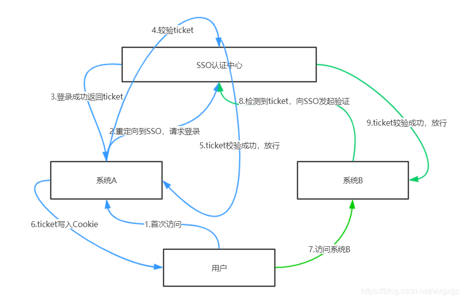
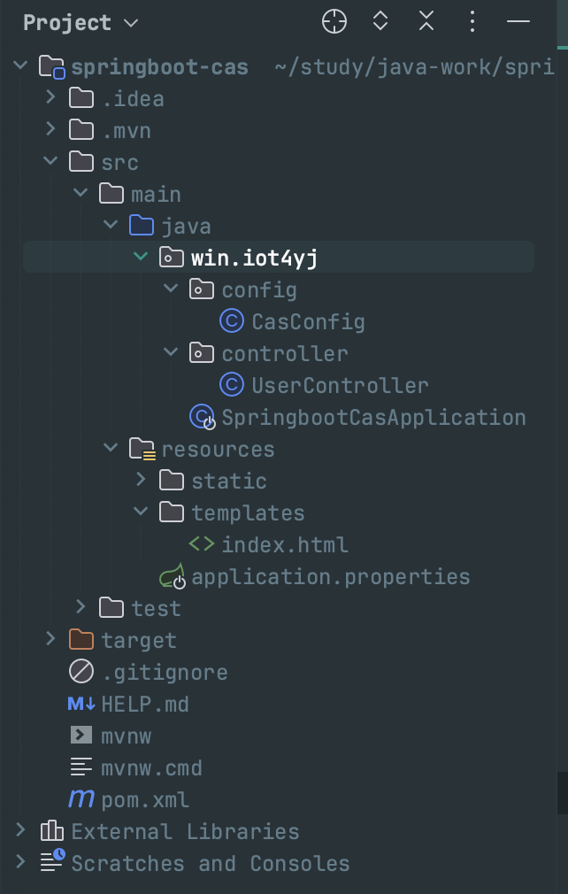

```toc
```

## sso 基本原理



这里先学习一个简单的例子，`cas sso` 的基本原理如图，这里就不细说了。基本项目结构如下




这里先给出 `pom` 文件

```xml
<?xml version="1.0" encoding="UTF-8"?>
<project xmlns="http://maven.apache.org/POM/4.0.0" xmlns:xsi="http://www.w3.org/2001/XMLSchema-instance"
	xsi:schemaLocation="http://maven.apache.org/POM/4.0.0 https://maven.apache.org/xsd/maven-4.0.0.xsd">
	<modelVersion>4.0.0</modelVersion>
	<parent>
		<groupId>org.springframework.boot</groupId>
		<artifactId>spring-boot-starter-parent</artifactId>
		<version>2.7.6</version>
		<relativePath/> <!-- lookup parent from repository -->
	</parent>
	<groupId>win.iot4yj</groupId>
	<artifactId>springboot-cas</artifactId>
	<version>0.0.1-SNAPSHOT</version>
	<name>cas-client</name>
	<description>cas-client</description>

	<properties>
		<project.build.sourceEncoding>UTF-8</project.build.sourceEncoding>
		<project.reporting.outputEncoding>UTF-8</project.reporting.outputEncoding>
		<java.version>1.8</java.version>
	</properties>
	<dependencies>
		<dependency>
			<groupId>org.springframework.boot</groupId>
			<artifactId>spring-boot-starter-web</artifactId>
		</dependency>
		<dependency>
			<groupId>org.springframework.boot</groupId>
			<artifactId>spring-boot-starter-tomcat</artifactId>
		</dependency>
		<!--其实在现在都用spring-boot-starter-tomcat-3.1.0中内嵌jakarta中相关包来
		替换javax.servlet了，但是有些组件还是用的以前的包，这里再次添加一下-->
<!--		<dependency>-->
<!--			<groupId>javax.servlet</groupId>-->
<!--			<artifactId>javax.servlet-api</artifactId>-->
<!--			<version>3.1.0</version>-->
<!--			<scope>provided</scope>-->
<!--		</dependency>-->
		<dependency>
			<groupId>org.springframework.boot</groupId>
			<artifactId>spring-boot-starter-thymeleaf</artifactId>
			<version>2.7.6</version>
		</dependency>
		<dependency>
			<groupId>net.unicon.cas</groupId>
			<artifactId>cas-client-autoconfig-support</artifactId>
			<version>2.3.0-GA</version>
		</dependency>
<!--		<dependency>-->
<!--			<groupId>org.springframework.security</groupId>-->
<!--			<artifactId>spring-security-cas</artifactId>-->
<!--			<version>5.7.5</version>-->
<!--		</dependency>-->

		<dependency>
			<groupId>com.google.code.gson</groupId>
			<artifactId>gson</artifactId>
			<version>2.10.1</version>
		</dependency>
		<dependency>
			<groupId>org.springframework.boot</groupId>
			<artifactId>spring-boot-starter-test</artifactId>
			<scope>test</scope>
		</dependency>

	</dependencies>

	<build>
		<plugins>
			<plugin>
				<groupId>org.springframework.boot</groupId>
				<artifactId>spring-boot-maven-plugin</artifactId>
			</plugin>
		</plugins>
	</build>

</project>
```

配置文件 `application.properties`

```properties
server.port=8888
server.servlet.context-path=/cas-client

# cas服务地址
cas.server-url-prefix=https://localhost:8443/cas
# cas服务登陆地址，casServerLoginUrl
cas.server-login-url=${cas.server-url-prefix}/login
# 客户端地址
cas.client-host-url=http://localhost:${server.port}${server.servlet.context-path}
cas.validation-type=CAS3
# 服务端登出地址
casClientLogoutUrl=https://localhost:8443/cas/logout

# Spring Boot官方文档建议在开发时将缓存关闭
spring.thymeleaf.cache=false

# 定位模板的目录
spring.mvc.view.prefix=classpath:/templates/
# 给返回的页面添加后缀名
spring.mvc.view.suffix=.html
```


```java

package win.iot4yj.config;


import org.jasig.cas.client.authentication.AuthenticationFilter;
import org.jasig.cas.client.session.SingleSignOutFilter;
import org.jasig.cas.client.session.SingleSignOutHttpSessionListener;
import org.jasig.cas.client.util.AssertionThreadLocalFilter;
import org.jasig.cas.client.util.HttpServletRequestWrapperFilter;
import org.jasig.cas.client.validation.Cas30ProxyReceivingTicketValidationFilter;
import org.springframework.beans.factory.annotation.Value;
import org.springframework.boot.autoconfigure.condition.ConditionalOnProperty;
import org.springframework.boot.web.servlet.FilterRegistrationBean;
import org.springframework.boot.web.servlet.ServletListenerRegistrationBean;
import org.springframework.context.annotation.Bean;
import org.springframework.context.annotation.Configuration;
import org.springframework.core.Ordered;


@Configuration
@ConditionalOnProperty(value = "cas.loginType", havingValue = "cas")
public class CasConfig {

    @Value("$(cas.server-login-url)")
    private String casServerLoginUrl;

    /**
     * 客户端地址:当访问这个地址时会重定向到casServerLoginUrl
     */
    @Value("$(cas.client-host-url)")
    private String serverName;

    @Value("$(cas.server-url-prefix")
    private String casServerUrlPrefix;

    /**
     * 监听退出功能
     */
    @Bean
    public ServletListenerRegistrationBean<SingleSignOutHttpSessionListener> servletListenerRegistrationBean() {
        ServletListenerRegistrationBean<SingleSignOutHttpSessionListener> listenerReg =
            new ServletListenerRegistrationBean<>();
        listenerReg.setListener(new SingleSignOutHttpSessionListener());
        listenerReg.setOrder(Ordered.HIGHEST_PRECEDENCE);
        return listenerReg;
    }

    /**
     * 单点登录退出
     */
    @Bean
    public FilterRegistrationBean<SingleSignOutFilter> singleSignOutFilter() {
        FilterRegistrationBean<SingleSignOutFilter> registrationBean =
            new FilterRegistrationBean<>();
        registrationBean.setFilter(new SingleSignOutFilter());
        registrationBean.addUrlPatterns("/*");
        registrationBean.setName("CAS Single Sign Out Filter");
        registrationBean.setOrder(1);
        return registrationBean;
    }

    /**
     * 单点登录认证
     */
    @Bean
    public FilterRegistrationBean<AuthenticationFilter> AuthenticationFilter() {
        FilterRegistrationBean<AuthenticationFilter> registrationBean =
            new FilterRegistrationBean<>();
        registrationBean.setFilter(new AuthenticationFilter());
        registrationBean.addUrlPatterns("/*");
        registrationBean.setName("CAS FAuthentication filter");
        registrationBean.addInitParameter("casServerLoginUrl", casServerLoginUrl);
        registrationBean.addInitParameter("serverName", serverName);
        registrationBean.setOrder(1);
        return registrationBean;
    }

    /**
     * 单点登录ticket校验
     */
    @Bean
    public FilterRegistrationBean<Cas30ProxyReceivingTicketValidationFilter> Cas30ProxyReceivingTicketValidationFilter() {
        FilterRegistrationBean<Cas30ProxyReceivingTicketValidationFilter> registrationBean =
            new FilterRegistrationBean<>();
        registrationBean.setFilter(new Cas30ProxyReceivingTicketValidationFilter());
        registrationBean.addUrlPatterns("/*");
        registrationBean.setName("CAS Validation Filter");
        registrationBean.addInitParameter("casServerUrlPrefix", casServerUrlPrefix);
        registrationBean.addInitParameter("serverName", serverName);
        registrationBean.setOrder(1);
        return registrationBean;
    }

    /**
     * 单点登录请求包装
     */
    @Bean
    public FilterRegistrationBean<HttpServletRequestWrapperFilter> httpServletRequestWrapperFilter() {
        FilterRegistrationBean<HttpServletRequestWrapperFilter> registrationBean =
            new FilterRegistrationBean<>();
        registrationBean.setFilter(new HttpServletRequestWrapperFilter());
        registrationBean.addUrlPatterns("/*");
        registrationBean.setName("CAS HttpServletRequest Wrapper Filter");
        registrationBean.setOrder(1);
        return registrationBean;
    }

    /**
     * 通过此过滤器可以通过AssertionHolder来获取用户的登陆名
     * <p> AssertionHolder.getAssertion().getPrincipal().getName()
     */
    public FilterRegistrationBean<AssertionThreadLocalFilter> casAssertionThreadLocalFilter() {
        FilterRegistrationBean<AssertionThreadLocalFilter> registration = new FilterRegistrationBean<>();
        registration.setFilter(new AssertionThreadLocalFilter());
        registration.setName("CAS Assertion Thread Local Filter");
        registration.addUrlPatterns("/*");
        registration.setOrder(1);
        registration.setAsyncSupported(true);
        return registration;
    }
}
```

这里对相关配置进行说明：
- `SingleSignOutHttpSessionListener, SingleSignOutFilter` 用于监听登出操作
- `AuthenticationFilter` 用于认证。比如我们使用地址 `http://localhost:8888/cas-client/user/login` 登陆，此过滤器会将请求拦截，然后重定向到 `https://localhost:8443/cas/login?service=http://localhost:8888/cas-client/user/login`。也就是使用 `cas` 服务器的登陆界面进行登陆（我们自己是不需要写登陆界面和相关 post 请求方法的）。注意，这里登陆完成之后会根据我们的地址进行跳转，首先要跳转到客户端哪里是根据配置 ` cas. client-host-url ` 来定的，具体路由到哪个页面是根据后面一截 ` /user/login ` 来确定的。这里是 get 请求。
- `Cas30ProxyReceivingTicketValidationFilter` 用于验证 ticket 工作。登陆完成之后服务器把 ticket 给浏览器，浏览器再访问客户端的时候拿到这个 ticket 再去服务器进行验证。验证完成之后会生成一个 session 给到浏览器，然后再访问具体接口。
- `HttpServletRequestWrapperFilter, AssertionThreadLocalFilter` 这两个是用于获取一些登陆信息的。

```java
package win.iot4yj.controller;

import com.google.gson.Gson;
import javax.servlet.http.HttpServletRequest;
import javax.servlet.http.HttpSession;
import org.springframework.stereotype.Controller;
import org.springframework.util.Assert;
import org.springframework.web.bind.annotation.GetMapping;
import org.springframework.web.bind.annotation.RequestMapping;

/**
 * 用户相关接口
 *
 * @author YJ
 * @date 2023/5/31
 **/
@Controller
@RequestMapping("/user")
public class UserController {

    @GetMapping("/login")
    public String login(HttpServletRequest request) {
        HttpSession session = request.getSession();
        Assert.notNull(session, "session为空");
        Gson gson = new Gson();
        System.out.println("登陆, session: " + gson.toJson(session));
        return "index";
    }

    @GetMapping("logout")
    public String logout(HttpServletRequest request) {
        request.getSession().invalidate();
        // 清除当前会话
        // 将用户重定向到CAS服务器的登出URL
        return "redirect:https://localhost:8443/cas/logout";
    }
}
```

```html
<!DOCTYPE html>  
<html lang="en" xmlns:th="http://www.thymeleaf.org">  
  
<head>  
<meta charset="UTF-8" />  
<title>Hello CAS</title>  
</head>  
<body>  
<h1>hello CAS</h1>  
<br>  
欢迎：<p th:text="${session._const_cas_assertion_.principal.name}"></p>  
  
<a href="/user/logout">安全退出</a>  
</body>  
</html>
```

> 注意：spring boot 默认开启了静态文件的配置，任何放在 static 文件夹下的资源都是静态文件。引用静态文件时以"/"或者前缀不加任何定位符，都会去 static 文件夹下查找。  

这里使用了 thymeleaf 框架。可以看到最后跳转访问到 `user/login` 也是一个 get 请求。我们可以拿到相关用户信息和相关 session。注意：如果不是前后端分离，则使用 `@Controller` 注解。如果使用的是 json 数据，则使用 `@RestController`。

止于登出操作直接就是一个后端重定向操作，只是在操作之前将 session 清理掉。

目前这种方式并不是最好的了，因为需要保存 session 或者 ticket 信息，而且登陆验证流程较长，可能使用 spring security 结合 JWT 更好，待续。