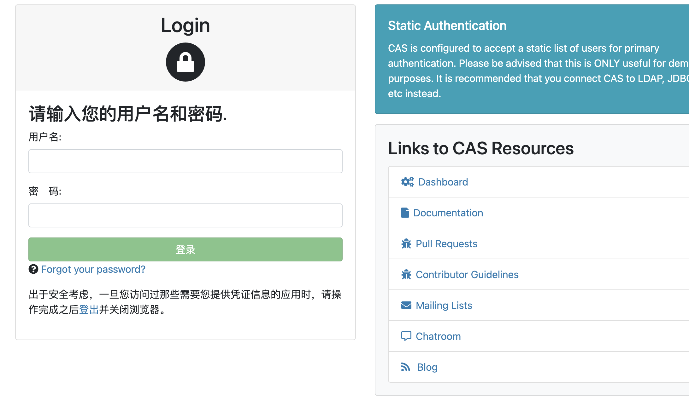

```toc

```

## 基本说明

服务端地址： `https://github.com/apereo/cas-overlay-template/tree/5.3`

官网地址： `https://github.com/apereo/cas`

仓库： `https://repo1.maven.org/maven2/org/apereo/cas/`
这里可以直接下载相关包，`cas-server-webapp-tomcat，cas-server-webapp-undertow`。这里下载 `cas-server-webapp-tomcat-5.3.14` 版本（使用 `jdk1.8 `）。这里不涉及服务端改造，可以直接下载 `war` 包使用。


`Tomcat` 使用 `apache-tomcat-9.0.75`。


## Tomcat 配置

### 生成私钥和证书

配置支持 https

```
keytool -genkeypair -alias tomcatHttps -keypass walp1314 -storepass walp1314 \
-dname "C=CN,ST=GD,L=SZ,O=localhost,OU=dev,CN=localhost" \
-keyalg RSA -keysize 2048 -validity 3650 -keystore /Users/YJ/soft/apache-tomcat-9.0.75/tomcatHttps.keystore
```

**参数说明**

-   storepass keystore 文件存储密码
-   keypass 私钥加解密密码
-   alias 实体别名(包括证书私钥)
-   dname 证书个人信息
-   keyalt 采用公钥算法，默认是DSA
-   keysize 密钥长度(DSA算法对应的默认算法是sha1withDSA，不支持2048长度，此时需指定RSA)
-   validity 有效期
-   keystore 指定 keystore 文件

注意：这里使用 `-dname` 指定相关信息时不要随便写，比如这里填的是 `localhost`，那么就只能识别 `localhost`，否则会识别不了。

### 导出

```
keytool -exportcert -keystore /Users/YJ/soft/apache-tomcat-9.0.75/tomcatHttps.keystore -file /Users/YJ/soft/apache-tomcat-9.0.75/tomcatHttps.cer -alias tomcatHttps -storepass walp1314
```

### 导入到 jdk 证件库

```
keytool -import -trustcacerts -alias tomcatHttps -file /Users/YJ/soft/apache-tomcat-9.0.75/tomcatHttps.cer -keystore "/Users/YJ/soft/open-jdk8/Contents/Home/jre/lib/security/cacerts"
```

这里的密码是 `changeit`。

### Tomcat 配置

在
```bash
/Users/YJ/soft/apache-tomcat-9.0.75/conf/server.xml
```

添加

```xml
<Connector port="8443" protocol="org.apache.coyote.http11.Http11Protocol" maxThreads="150" SSLEnabled="true" scheme="https" secure="true" clientAuth="false" sslProtocol="TLS" keystoreFile="/Users/YJ/soft/apache-tomcat-9.0.75/tomcatHttps.keystore" keystorePass="walp1314" />
```

然后访问 `https://localhost:8443`，如果无法访问，则将上面的配置修改为

```xml
<Connector port="8443" protocol="HTTP/1.1" maxThreads="150" SSLEnabled="true" scheme="https" secure="true" clientAuth="false" sslProtocol="TLS" keystoreFile="/Users/YJ/soft/apache-tomcat-9.0.75/tomcatHttps.keystore" keystorePass="walp1314" />
```

如果还是无法访问则将文件中的这段注释掉

```xml
<Listener className="org.apache.catalina.core.AprLifecycleListener" SSLEngine="on" />
```

## CAS 服务启动

将服务端的 war 包拷贝到 tomcat/webapp 下面，然后启动，使用地址
`https://localhost:8443/cas-server` 就可以看到 CAS 服务端的登陆界面了。



这里服务端的用户名密码保存在项目中的文件中
```
// /Users/YJ/soft/apache-tomcat-9.0.75/webapps/cas-server/WEB-INF/classes/application.properties

// 用户名：casuser，密码:Mellon
cas.authn.accept.users=casuser::Mellon
```

## CAS 相关配置

这里要说明一下，就是启动 `cas` 服务端之后可以将项目目录修改为 ` cas `，这个和 ` application. properties ` 中的配置是一致的。

### 日志路径

```xml
<!-- cas/WEB-INF/classes/log4j2.xml-->
<Configuration monitorInterval="5" packages="org.apereo.cas.logging">
    <Properties>
        <Property name="baseDir">/Users/YJ/soft/apache-tomcat-9.0.75/cas-logs</Property>
    </Properties>
```


## 用户认证配置


### 数据源配置

之前使用的用户名密码是直接写死在配置文件中的，实际生产中肯定不行，生产中一般需要使用数据库。下面首先修改下配置文件

```properties
// application.properties

#cas.authn.accept.users=casuser::Mellon

#数据库配置
#配置密码加密
cas.authn.jdbc.query[0].passwordEncoder.type=DEFAULT
cas.authn.jdbc.query[0].passwordEncoder.characterEncoding=UTF-8
cas.authn.jdbc.query[0].passwordEncoder.encodingAlgorithm=MD5

cas.authn.jdbc.query[0].sql=SELECT * FROM cas_user WHERE username =?   

cas.authn.jdbc.query[0].url=jdbc:mysql://localhost:3306/studyDB?useUnicode=true&characterEncoding=UTF-8&autoReconnect=true&useSSL=false
cas.authn.jdbc.query[0].dialect=org.hibernate.dialect.MySQLDialect
cas.authn.jdbc.query[0].user=root
cas.authn.jdbc.query[0].password=walp1314
cas.authn.jdbc.query[0].driverClass=com.mysql.jdbc.Driver

cas.authn.jdbc.query[0].fieldPassword=PASSWORD

#是否开启json识别功能,默认为false  
cas.serviceRegistry.initFromJson=true  
#忽略https安全协议，使用 HTTP 协议  
cas.tgc.secure=false
#加载json资源
cas.serviceRegistry.json.location=classpath:/services
```


### 相关包

```
cas-server-support-jdbc-5.3.14.jar  
cas-server-support-jdbc-authentication-5.3.14.jar  
cas-server-support-jdbc-drivers-5.3.14.jar  
cas-server-support-generic-5.3.14.jar  
mysql-connector-java-5.1.49.jar
```

将这些包拷贝到目录 `/Users/YJ/soft/apache-tomcat-9.0.75/webapps/cas/WEB-INF/lib` 中

### 数据库

插入数据 （密码是 `walp1314` 的 `MD5` 值）

```sql
insert cas_user(id, email, username, name, password)  
value (1, '', 'joyang', 'joyang', '3c173537d0ec2b32835414abe156cc32');

-- 密码获取
select MD5('walp1314') from dual
```

这样就可以登陆成功了，具体可以查看日志（`catalina.out `）。

### 支持 http

修改 `WEB-INF\classes\services\HTTPSandIMAPS-10000001.json`，增加 `http` 协议 （`serviceId` 中增加）：

```json
{
  "@class" : "org.apereo.cas.services.RegexRegisteredService",
  "serviceId" : "^(https|http|imaps)://.*",
  "name" : "HTTPS and IMAPS",
  "id" : 10000001,
  "description" : "This service definition authorizes all application urls that support HTTPS and IMAPS protocols.",
  "evaluationOrder" : 10000
}
```