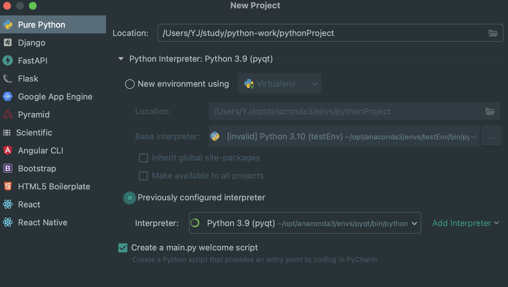
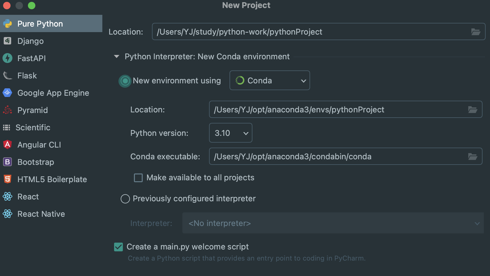

# 1、python   pip   anaconda

首先需要安装`python`，而`python3.4`版本之后自带`pip`。`pip`是一个`python`的包下载和管理工具。`anaconda`是一个`python`包下载、管理和环境管理工具。

`anaconda`中默认包含了一系列开发所需要的工具包，同时可以新建多个开发环境，如在不同环境中使用不同的`python`版本。比如我们可以在`anaconda`中新建一个环境，然后配置相关工具，当然如果所需要的某个工具包是`anaconda`没有的，可以通过`pip`在**对应的环境**中下载。

# 2、pycharm with anaconda

这里可以先在 anaconda 新建一个环境，然后在 pycharm 选择这个环境

当然也可以直接在pycharm中选择新创建

这里就会创建一个`pythonProject`的环境。

# 3、PyQt

`PyQt`是使用`python`来调用`Qt`库实现一些桌面应用开发。我们可以使用`QtDesigner`设计页面，但是这个页面其实是`xml`文件，然后在`pycharm`中可以将这个`xml`文件转换成`python`文件。

而`Qt Creator` 则是一个完整的`Qt``应用开发应用，可以使用qml`来开发页面（当然也可以进行页面设计，因为其中内嵌了`QtDesigner`）。其中也可以使用`python`进行开发，当然使用`CPP`更是可行。
