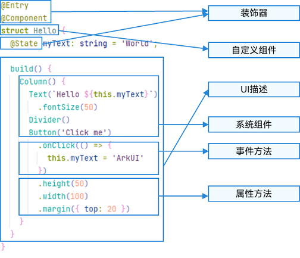

**注意：自定义变量不能与基础通用属性或事件名重复**

- 装饰器： 用于装饰类、结构、方法以及变量，并赋予其特殊的含义。如上述示例中 `@Entry、@Component` 和 `@State` 都是装饰器，[@Component](https://developer.huawei.com/consumer/cn/doc/harmonyos-guides-V5/arkts-create-custom-components-V5#%E8%87%AA%E5%AE%9A%E4%B9%89%E7%BB%84%E4%BB%B6%E7%9A%84%E5%9F%BA%E6%9C%AC%E7%BB%93%E6%9E%84) 表示自定义组件，[@Entry](https://developer.huawei.com/consumer/cn/doc/harmonyos-guides-V5/arkts-create-custom-components-V5#%E8%87%AA%E5%AE%9A%E4%B9%89%E7%BB%84%E4%BB%B6%E7%9A%84%E5%9F%BA%E6%9C%AC%E7%BB%93%E6%9E%84) 表示该自定义组件为入口组件，[@State](https://developer.huawei.com/consumer/cn/doc/harmonyos-guides-V5/arkts-state-V5) 表示组件中的状态变量，状态变量变化会触发UI刷新。
    
- [UI描述](https://developer.huawei.com/consumer/cn/doc/harmonyos-guides-V5/arkts-declarative-ui-description-V5)：以声明式的方式来描述UI的结构，例如 `build()` 方法中的代码块。
    
- [自定义组件](https://developer.huawei.com/consumer/cn/doc/harmonyos-guides-V5/arkts-create-custom-components-V5)：可复用的UI单元，可组合其他组件，如上述被`@Component`装饰的struct Hello。
    
- 系统组件：ArkUI框架中默认内置的基础和容器组件，可直接被开发者调用，比如示例中的`Column、Text、Divider、Button`。
    
- 属性方法：组件可以通过链式调用配置多项属性，如`fontSize()、width()、height()、backgroundColor()`等。
    
- 事件方法：组件可以通过链式调用设置多个事件的响应逻辑，如跟随在Button后面的`onClick()`。
    
- 系统组件、属性方法、事件方法具体使用可参考[基于ArkTS的声明式开发范式](https://developer.huawei.com/consumer/cn/doc/harmonyos-references-V5/ts-universal-events-click-V5)。
    

除此之外，ArkTS扩展了多种语法范式来使开发更加便捷：

- [@Builder](https://developer.huawei.com/consumer/cn/doc/harmonyos-guides-V5/arkts-builder-V5)/[@BuilderParam](https://developer.huawei.com/consumer/cn/doc/harmonyos-guides-V5/arkts-builderparam-V5)：特殊的封装UI描述的方法，细粒度的封装和复用UI描述。
    
- [@Extend](https://developer.huawei.com/consumer/cn/doc/harmonyos-guides-V5/arkts-extend-V5)/[@Styles](https://developer.huawei.com/consumer/cn/doc/harmonyos-guides-V5/arkts-style-V5)：扩展内置组件和封装属性样式，更灵活地组合内置组件。
    
- [stateStyles](https://developer.huawei.com/consumer/cn/doc/harmonyos-guides-V5/arkts-statestyles-V5)：多态样式，可以依据组件的内部状态的不同，设置不同样式。

