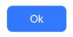
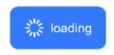
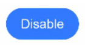
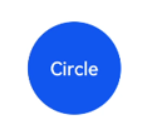
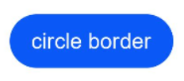
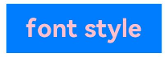

```toc
```


Button是按钮组件，通常用于响应用户的点击操作，其类型包括胶囊按钮、圆形按钮、普通按钮。Button做为容器使用时可以通过添加子组件实现包含文字、图片等元素的按钮。具体用法请参考[Button](https://developer.huawei.com/consumer/cn/doc/harmonyos-references-V5/ts-basic-components-button-V5)。

## 创建按钮

Button通过调用接口来创建，接口调用有以下两种形式：

**创建不包含子组件的按钮**

```ts
Button(label?: ResourceStr, options?: { type?: ButtonType, stateEffect?: boolean })
```

其中，label用来设置按钮文字，type用于设置Button类型，stateEffect属性设置Button是否开启点击效果。

```ts
Button('Ok', { type: ButtonType.Normal, stateEffect: true }) 
  .borderRadius(8) 
  .backgroundColor(0x317aff) 
  .width(90)
  .height(40)
```




**创建包含子组件的按钮**

```ts
Button(options?: {type?: ButtonType, stateEffect?: boolean})
```

只支持包含一个子组件，子组件可以是基础组件或者容器组件。

```ts
Button({ type: ButtonType.Normal, stateEffect: true }) {
  Row() {
    Image($r('app.media.loading')).width(20).height(40).margin({ left: 12 })
    Text('loading').fontSize(12).fontColor(0xffffff).margin({ left: 5, right: 12 })
  }.alignItems(VerticalAlign.Center)
}.borderRadius(8).backgroundColor(0x317aff).width(90).height(40)
```




## 设置按钮类型

Button有三种可选类型，分别为胶囊类型（Capsule）、圆形按钮（Circle）和普通按钮（Normal），通过type进行设置。

- 胶囊按钮（默认类型）
    此类型按钮的圆角自动设置为高度的一半，不支持通过borderRadius属性重新设置圆角。

```ts
Button('Disable', { type: ButtonType.Capsule, stateEffect: false }) 
  .backgroundColor(0x317aff) 
  .width(90)
  .height(40)
```



- 圆形按钮
	此类型按钮为圆形，不支持通过borderRadius属性重新设置圆角。

```ts
Button('Circle', { type: ButtonType.Circle, stateEffect: false }) 
  .backgroundColor(0x317aff) 
  .width(90) 
  .height(90)
```


- 普通按钮
	此类型的按钮默认圆角为0，支持通过borderRadius属性重新设置圆角。

```ts
Button('Ok', { type: ButtonType.Normal, stateEffect: true }) 
  .borderRadius(8) 
  .backgroundColor(0x317aff) 
  .width(90)
  .height(40)
```


## 自定义样式

- 设置边框弧度。

	使用通用属性来自定义按钮样式。例如通过borderRadius属性设置按钮的边框弧度。

```ts
Button('circle border', { type: ButtonType.Normal }) 
  .borderRadius(20)
  .height(40)
```



- 设置文本样式。

	通过添加文本样式设置按钮文本的展示样式。

```ts
Button('font style', { type: ButtonType.Normal }) 
  .fontSize(20) 
  .fontColor(Color.Pink) 
  .fontWeight(800)
```



- 设置背景颜色。

	添加backgroundColor属性设置按钮的背景颜色。

```ts
Button('background color').backgroundColor(0xF55A42)
```

- 创建功能型按钮。
	为删除操作创建一个按钮。

```ts
let MarLeft: Record<string, number> = { 'left': 20 }
Button({ type: ButtonType.Circle, stateEffect: true }) {
  Image($r('app.media.ic_public_delete_filled')).width(30).height(30)
}.width(55).height(55).margin(MarLeft).backgroundColor(0xF55A42)
```


## 添加事件

Button组件通常用于触发某些操作，可以绑定onClick事件来响应点击操作后的自定义行为。

```ts
Button('Ok', { type: ButtonType.Normal, stateEffect: true }) 
  .onClick(()=>{ 
    console.info('Button onClick') 
  })
```


