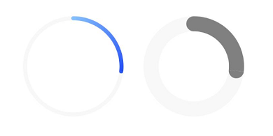
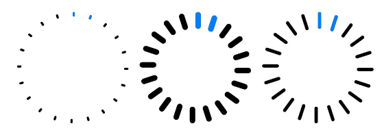
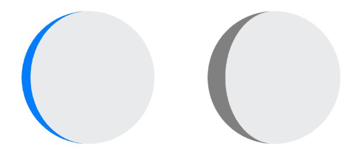
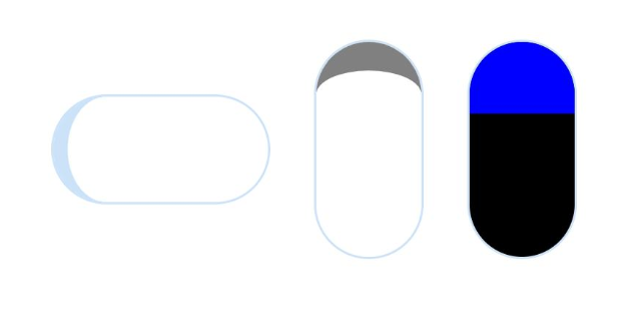

```toc
```

Progress是进度条显示组件，显示内容通常为目标操作的当前进度。具体用法请参考 [Progress](https://developer.huawei.com/consumer/cn/doc/harmonyos-references-V5/ts-basic-components-progress-V5)。


## 创建进度条

Progress通过调用接口来创建，接口调用形式如下：

```ts
Progress(options: {value: number, total?: number, type?: ProgressType})
```

其中，value用于设置初始进度值，total用于设置进度总长度，type用于设置Progress样式。

```ts
Progress({ value: 24, total: 100, type: ProgressType.Linear }) // 创建一个进度总长为100，初始进度值为24的线性进度条
```


## 设置进度条样式

Progress有5种可选类型，通过ProgressType可以设置进度条样式，ProgressType类型包括：`ProgressType.Linear`（线性样式）、 `ProgressType.Ring`（环形无刻度样式）、`ProgressType.ScaleRing`（环形有刻度样式）、`ProgressType.Eclipse`（圆形样式）和 `ProgressType.Capsule`（胶囊样式）。

**线性样式**

如上所示

>说明
从API version9开始，组件高度大于宽度时，自适应垂直显示；组件高度等于宽度时，保持水平显示。


**环形无刻度样式进度条**

```ts
// 从左往右，1号环形进度条，默认前景色为蓝色渐变，默认strokeWidth进度条宽度为2.0vp
Progress({ value: 40, total: 150, type: ProgressType.Ring }).width(100).height(100)
// 从左往右，2号环形进度条
Progress({ value: 40, total: 150, type: ProgressType.Ring }).width(100).height(100)
    .color(Color.Grey)    // 进度条前景色为灰色
    .style({ strokeWidth: 15})    // 设置strokeWidth进度条宽度为15.0vp
```




**环形有刻度样式进度条**

```ts
Progress({ value: 20, total: 150, type: ProgressType.ScaleRing }).width(100).height(100)
    .backgroundColor(Color.Black)
    .style({ scaleCount: 20, scaleWidth: 5 })    // 设置环形有刻度进度条总刻度数为20，刻度宽度为5vp
Progress({ value: 20, total: 150, type: ProgressType.ScaleRing }).width(100).height(100)
    .backgroundColor(Color.Black)
    .style({ strokeWidth: 15, scaleCount: 20, scaleWidth: 5 })    // 设置环形有刻度进度条宽度15，总刻度数为20，刻度宽度为5vp
Progress({ value: 20, total: 150, type: ProgressType.ScaleRing }).width(100).height(100)
    .backgroundColor(Color.Black)
    .style({ strokeWidth: 15, scaleCount: 20, scaleWidth: 3 })    // 设置环形有刻度进度条宽度15，总刻度数为20，刻度宽度为3vp
```




**圆形样式进度条**

```ts
// 从左往右，1号圆形进度条，默认前景色为蓝色
Progress({ value: 10, total: 150, type: ProgressType.Eclipse }).width(100).height(100)
// 从左往右，2号圆形进度条，指定前景色为灰色
Progress({ value: 20, total: 150, type: ProgressType.Eclipse }).color(Color.Grey).width(100).height(100)
```



**胶囊样式进度条**

```ts
Progress({ value: 10, total: 150, type: ProgressType.Capsule }).width(100).height(50)
Progress({ value: 20, total: 150, type: ProgressType.Capsule }).width(50).height(100).color(Color.Grey)
Progress({ value: 50, total: 150, type: ProgressType.Capsule }).width(50).height(100).color(Color.Blue).backgroundColor(Color.Black)
```



说明

- 头尾两端圆弧处的进度展示效果与`ProgressType.Eclipse`样式相同。
- 中段处的进度展示效果为矩形状长条，与`ProgressType.Linear`线性样式相似。
- 组件高度大于宽度的时候自适应垂直显示。


