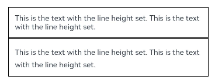

```toc
```

## 概述

文本通常涵盖用户输入的信息、呈现的文本内容以及小图标，这些元素共同构建了用户与系统间的交互界面，提升了操作的便捷性与信息展示的直观性。

开发者可根据实际应用场景选择合适的文本组件进行页面开发。

| 文本组件名称                                                                                                                                                                                                                                             | 应用场景                                                                                                                                                                                                                                                                                                                                               |
| :------------------------------------------------------------------------------------------------------------------------------------------------------------------------------------------------------------------------------------------------- | :------------------------------------------------------------------------------------------------------------------------------------------------------------------------------------------------------------------------------------------------------------------------------------------------------------------------------------------------- |
| 文本（[Text](https://developer.huawei.com/consumer/cn/doc/harmonyos-references-V5/ts-basic-components-text-V5)/[Span](https://developer.huawei.com/consumer/cn/doc/harmonyos-references-V5/ts-basic-components-span-V5)）                              | 主要用于显示静态文本。开发者可以使用Text组件配合Span组件创建文本节点，也可以使用属性字符串（[StyledString](https://developer.huawei.com/consumer/cn/doc/harmonyos-references-V5/ts-universal-styled-string-V5#styledstring)/[MutableStyledString](https://developer.huawei.com/consumer/cn/doc/harmonyos-references-V5/ts-universal-styled-string-V5#mutablestyledstring)）节点生成文本信息并接入Text组件。 |
| 文本输入（[TextInput](https://developer.huawei.com/consumer/cn/doc/harmonyos-references-V5/ts-basic-components-textinput-V5)/[TextArea](https://developer.huawei.com/consumer/cn/doc/harmonyos-references-V5/ts-basic-components-textarea-V5)）          | 当需要在单行输入框（TextInput）或多行输入框（TextArea）输入纯文本时，应优先考虑使用此文本组件。                                                                                                                                                                                                                                                                                           |
| 富文本（[RichEditor](https://developer.huawei.com/consumer/cn/doc/harmonyos-references-V5/ts-basic-components-richeditor-V5)）                                                                                                                          | 当需要在编辑框内插入图片或者自定义图标等述求时，应优先考虑使用此文本组件。                                                                                                                                                                                                                                                                                                              |
| 图标小符号（[SymbolGlyph](https://developer.huawei.com/consumer/cn/doc/harmonyos-references-V5/ts-basic-components-symbolglyph-V5)/[SymbolSpan](https://developer.huawei.com/consumer/cn/doc/harmonyos-references-V5/ts-basic-components-symbolspan-V5)） | 当需要显示小图标时，应优先考虑使用此文本组件。                                                                                                                                                                                                                                                                                                                            |


## 创建文本

Text是文本组件，通常用于展示用户视图，如显示文章的文字内容。Span则用于呈现显示行内文本。

具体用法请参考 [Text](https://developer.huawei.com/consumer/cn/doc/harmonyos-references-V5/ts-basic-components-text-V5) 和 [Span](https://developer.huawei.com/consumer/cn/doc/harmonyos-references-V5/ts-basic-components-span-V5) 组件的使用说明。

Text可通过以下两种方式来创建：

- string字符串。
```ts
Text('我是一段文本')
```


- 引用 Resource 资源

资源引用类型可以通过 `$r` 创建Resource类型对象，文件位置为`/resources/base/element/string.json`。

```ts
Text($r('app.string.module_desc'))
  .baselineOffset(0)
  .fontSize(30)
  .border({ width: 1 })
  .padding(10)
  .width(300)
```


## 添加子组件

[Span](https://developer.huawei.com/consumer/cn/doc/harmonyos-references-V5/ts-basic-components-span-V5) 只能作为 [Text](https://developer.huawei.com/consumer/cn/doc/harmonyos-references-V5/ts-basic-components-text-V5) 和 [RichEditor](https://developer.huawei.com/consumer/cn/doc/harmonyos-references-V5/ts-basic-components-richeditor-V5) 组件的子组件显示文本内容。可以在一个Text内添加多个Span来显示一段信息，例如产品说明书、承诺书等。

- 创建 Span

Span组件必须嵌入在Text组件中才能显示，单独的Span组件不会呈现任何内容。Text与Span同时配置文本内容时，Span内容覆盖Text内容。

```ts
Text('我是Text') {
  Span('我是Span')
}
.padding(10)
.borderWidth(1)
```

- 设置文本装饰线及颜色

通过 [decoration](https://developer.huawei.com/consumer/cn/doc/harmonyos-references-V5/ts-basic-components-span-V5#decoration) 设置文本装饰线及颜色。

```ts
Text() {
  // 中划线
  Span('我是Span1，').fontSize(16).fontColor(Color.Grey)
    .decoration({ type: TextDecorationType.LineThrough, color: Color.Red })
    // 下划线
  Span('我是Span2').fontColor(Color.Blue).fontSize(16)
    .fontStyle(FontStyle.Italic)
    .decoration({ type: TextDecorationType.Underline, color: Color.Black })
    // 上划线
  Span('，我是Span3').fontSize(16).fontColor(Color.Grey)
    .decoration({ type: TextDecorationType.Overline, color: Color.Green })
}
.borderWidth(1)
.padding(10)
```


- 通过 [textCase](https://developer.huawei.com/consumer/cn/doc/harmonyos-references-V5/ts-basic-components-span-V5#textcase) 设置文字一直保持大写或者小写状态。

```ts
Text() {
  Span('I am Upper-span').fontSize(12)
    .textCase(TextCase.UpperCase)
}
.borderWidth(1)
.padding(10)
```


- 添加事件

由于Span组件无尺寸信息，事件仅支持添加点击事件 [onClick](https://developer.huawei.com/consumer/cn/doc/harmonyos-references-V5/ts-universal-events-click-V5#onclick)。

```ts
Text() {
  Span('I am Upper-span').fontSize(12)
    .textCase(TextCase.UpperCase)
    .onClick(() => {
      console.info('我是Span——onClick');
    })
}
```


## 自定义文本样式

- 通过[textAlign](https://developer.huawei.com/consumer/cn/doc/harmonyos-references-V5/ts-basic-components-text-V5#textalign)属性设置文本对齐样式。

```ts
Text('左对齐')
  .width(300)
  .textAlign(TextAlign.Start)
  .border({ width: 1 })
  .padding(10)
Text('中间对齐')
  .width(300)
  .textAlign(TextAlign.Center)
  .border({ width: 1 })
  .padding(10)
Text('右对齐')
  .width(300)
  .textAlign(TextAlign.End)
  .border({ width: 1 })
  .padding(10)
```

- 通过 [textOverflow](https://developer.huawei.com/consumer/cn/doc/harmonyos-references-V5/ts-basic-components-text-V5#textoverflow) 属性控制文本超长处理，textOverflow需配合 [maxLines](https://developer.huawei.com/consumer/cn/doc/harmonyos-references-V5/ts-basic-components-text-V5#maxlines) 一起使用（默认情况下文本自动折行）。

```ts
Text('This is the setting of textOverflow to Clip text content This is the setting of textOverflow to None text content. This is the setting of textOverflow to Clip text content This is the setting of textOverflow to None text content.')
  .width(250)
  .textOverflow({ overflow: TextOverflow.None })
  .maxLines(1)
  .fontSize(12)
  .border({ width: 1 })
  .padding(10)
Text('我是超长文本，超出的部分显示省略号。I am an extra long text, with ellipses displayed for any excess。')
  .width(250)
  .textOverflow({ overflow: TextOverflow.Ellipsis })
  .maxLines(1)
  .fontSize(12)
  .border({ width: 1 })
  .padding(10)
Text('当文本溢出其尺寸时，文本将滚动显示。When the text overflows its dimensions, the text will scroll for displaying.')       
  .width(250)
  .textOverflow({ overflow: TextOverflow.MARQUEE })                 
  .maxLines(1)       
  .fontSize(12)
  .border({ width: 1 })
  .padding(10)                       
```


- 通过 [lineHeight](https://developer.huawei.com/consumer/cn/doc/harmonyos-references-V5/ts-basic-components-text-V5#lineheight) 属性设置文本行高。

```ts
Text('This is the text with the line height set. This is the text with the line height set.')
  .width(300).fontSize(12).border({ width: 1 }).padding(10)
Text('This is the text with the line height set. This is the text with the line height set.')
  .width(300).fontSize(12).border({ width: 1 }).padding(10)
  .lineHeight(20)
```




- 通过 [decoration](https://developer.huawei.com/consumer/cn/doc/harmonyos-references-V5/ts-basic-components-text-V5#decoration) 属性设置文本装饰线样式及其颜色。

```ts
Text('This is the text')
  .decoration({
    type: TextDecorationType.LineThrough,
    color: Color.Red
  })
  .borderWidth(1).padding(10).margin(5)
Text('This is the text')
  .decoration({
    type: TextDecorationType.Overline,
    color: Color.Red
  })
  .borderWidth(1).padding(10).margin(5)
Text('This is the text')
  .decoration({
    type: TextDecorationType.Underline,
    color: Color.Red
  })
  .borderWidth(1).padding(10).margin(5)
```

- 通过 [baselineOffset](https://developer.huawei.com/consumer/cn/doc/harmonyos-references-V5/ts-basic-components-text-V5#baselineoffset) 属性设置文本基线的偏移量。

```ts
Text('This is the text content with baselineOffset 0.')
  .baselineOffset(0)
  .fontSize(12)
  .border({ width: 1 })
  .padding(10)
  .width('100%')
  .margin(5)
Text('This is the text content with baselineOffset 30.')
// 下方偏移
  .baselineOffset(30)
  .fontSize(12)
  .border({ width: 1 })
  .padding(10)
  .width('100%')
  .margin(5)
Text('This is the text content with baselineOffset -20.')
// 上方偏移
  .baselineOffset(-20)
  .fontSize(12)
  .border({ width: 1 })
  .padding(10)
  .width('100%')
  .margin(5)
```


- 通过[letterSpacing](https://developer.huawei.com/consumer/cn/doc/harmonyos-references-V5/ts-basic-components-text-V5#letterspacing)属性设置文本字符间距。

```ts
Text('This is the text content with letterSpacing 0.')
  .letterSpacing(0)
  .fontSize(12)
  .border({ width: 1 })
  .padding(10)
  .width('100%')
  .margin(5)
Text('This is the text content with letterSpacing 3.')
  .letterSpacing(3)
  .fontSize(12)
  .border({ width: 1 })
  .padding(10)
  .width('100%')
  .margin(5)
Text('This is the text content with letterSpacing -1.')
  .letterSpacing(-1)
  .fontSize(12)
  .border({ width: 1 })
  .padding(10)
  .width('100%')
  .margin(5)
```

- 通过 [minFontSize](https://developer.huawei.com/consumer/cn/doc/harmonyos-references-V5/ts-basic-components-text-V5#minfontsize) 与 [maxFontSize](https://developer.huawei.com/consumer/cn/doc/harmonyos-references-V5/ts-basic-components-text-V5#maxfontsize) 自适应字体大小。

	minFontSize用于设置文本的最小显示字号，maxFontSize用于设置文本的最大显示字号。*这两个属性必须同时设置才能生效*，并且需要与 [maxLines](https://developer.huawei.com/consumer/cn/doc/harmonyos-references-V5/ts-basic-components-text-V5#maxlines) 属性或布局大小限制配合使用，单独设置任一属性将不会产生效果。

```ts
Text('我的最大字号为30，最小字号为5，宽度为250，maxLines为1')
  .width(250)
  .maxLines(1)
  .maxFontSize(30)
  .minFontSize(5)
  .border({ width: 1 })
  .padding(10)
  .margin(5)
Text('我的最大字号为30，最小字号为5，宽度为250，maxLines为2')
  .width(250)
  .maxLines(2)
  .maxFontSize(30)
  .minFontSize(5)
  .border({ width: 1 })
  .padding(10)
  .margin(5)
Text('我的最大字号为30，最小字号为15，宽度为250,高度为50')
  .width(250)
  .height(50)
  .maxFontSize(30)
  .minFontSize(15)
  .border({ width: 1 })
  .padding(10)
  .margin(5)
Text('我的最大字号为30，最小字号为15，宽度为250,高度为100')
  .width(250)
  .height(100)
  .maxFontSize(30)
  .minFontSize(15)
  .border({ width: 1 })
  .padding(10)
  .margin(5)
```

- 通过 [textCase](https://developer.huawei.com/consumer/cn/doc/harmonyos-references-V5/ts-basic-components-text-V5#textcase) 属性设置文本大小写。

```ts
Text('This is the text content with textCase set to Normal.')
  .textCase(TextCase.Normal)
  .padding(10)
  .border({ width: 1 })
  .padding(10)
  .margin(5)
// 文本全小写展示
Text('This is the text content with textCase set to LowerCase.')
  .textCase(TextCase.LowerCase)
  .border({ width: 1 })
  .padding(10)
  .margin(5)
// 文本全大写展示
Text('This is the text content with textCase set to UpperCase.')
  .textCase(TextCase.UpperCase)
  .border({ width: 1 })
  .padding(10)
  .margin(5)
```

- 通过 [copyOption](https://developer.huawei.com/consumer/cn/doc/harmonyos-references-V5/ts-basic-components-text-V5#copyoption9) 属性设置文本是否可复制粘贴。

```ts
Text("这是一段可复制文本")
  .fontSize(30)
  .copyOption(CopyOptions.InApp)
```


## 添加事件

Text组件可以添加通用事件，可以绑定 [onClick](https://developer.huawei.com/consumer/cn/doc/harmonyos-references-V5/ts-universal-events-click-V5#onclick)、[onTouch](https://developer.huawei.com/consumer/cn/doc/harmonyos-references-V5/ts-universal-events-touch-V5#ontouch) 等事件来响应操作。

```ts
Text('点我')
  .onClick(() => {
      console.info('我是Text的点击响应事件');
   })
```


