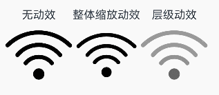
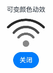

```toc
```

SymbolGlyph是图标小符号组件，便于使用精美的图标，如渲染多色图标和使用动效图标。SymbolSpan作为Text组件的子组件，可在文本中穿插显示图标小符号。具体用法请参考[SymbolGlyph](https://developer.huawei.com/consumer/cn/doc/harmonyos-references-V5/ts-basic-components-symbolglyph-V5)和[SymbolSpan](https://developer.huawei.com/consumer/cn/doc/harmonyos-references-V5/ts-basic-components-symbolspan-V5)组件的文档。

## 创建图标

SymbolGlyph通过`$r`引用Resource资源来创建，目前仅支持系统预置的Symbol资源名。相关资源可参考[系统图标](https://developer.huawei.com/consumer/cn/doc/design-guides/system-icons-0000001929854962)。

```ts
SymbolGlyph($r('sys.symbol.ohos_folder_badge_plus'))
  .fontSize(96)
  .renderingStrategy(SymbolRenderingStrategy.SINGLE)
  .fontColor([Color.Black, Color.Green, Color.White])
```


## 添加到文本中

[SymbolSpan](https://developer.huawei.com/consumer/cn/doc/harmonyos-references-V5/ts-basic-components-symbolspan-V5)可作为[Text](https://developer.huawei.com/consumer/cn/doc/harmonyos-references-V5/ts-basic-components-text-V5)的子组件用于显示图标小符号。可以在一个Text组件内添加多个SymbolSpan，从而展示一串连续的图标。

- 创建SymbolSpan
    SymbolSpan组件必须嵌入在Text组件中才能显示，单独的SymbolSpan组件不会呈现任何内容。

```ts
Text() {
  SymbolSpan($r('sys.symbol.ohos_trash'))
    .fontWeight(FontWeight.Normal)
    .fontSize(96)
}
```

- 通过 [fontSize](https://developer.huawei.com/consumer/cn/doc/harmonyos-references-V5/ts-basic-components-symbolspan-V5#fontsize) 属性设置SymbolSpan的大小。

```ts
Row() {
  Column() {
    Text("48")
    Text() {
      SymbolSpan($r('sys.symbol.ohos_folder_badge_plus'))
        .fontSize(48)
        .renderingStrategy(SymbolRenderingStrategy.SINGLE)
        .fontColor([Color.Black, Color.Green, Color.White])
    }
  }

  Column() {
    Text("72")
    Text() {
      SymbolSpan($r('sys.symbol.ohos_folder_badge_plus'))
        .fontSize(72)
        .renderingStrategy(SymbolRenderingStrategy.SINGLE)
        .fontColor([Color.Black, Color.Green, Color.White])
    }
  }

  Column() {
    Text("96")
    Text() {
      SymbolSpan($r('sys.symbol.ohos_folder_badge_plus'))
        .fontSize(96)
        .renderingStrategy(SymbolRenderingStrategy.SINGLE)
        .fontColor([Color.Black, Color.Green, Color.White])
    }
  }
}
```


- 通过 [fontWeight](https://developer.huawei.com/consumer/cn/doc/harmonyos-references-V5/ts-basic-components-symbolspan-V5#fontweight) 属性设置SymbolSpan组件的粗细。
```ts
Row() {
  Column() {
    Text("Light")
    Text() {
      SymbolSpan($r('sys.symbol.ohos_trash'))
        .fontWeight(FontWeight.Lighter)
        .fontSize(96)
    }
  }

  Column() {
    Text("Normal")
    Text() {
      SymbolSpan($r('sys.symbol.ohos_trash'))
        .fontWeight(FontWeight.Normal)
        .fontSize(96)
    }
  }

  Column() {
    Text("Bold")
    Text() {
      SymbolSpan($r('sys.symbol.ohos_trash'))
        .fontWeight(FontWeight.Bold)
        .fontSize(96)
    }
  }
}
```

- 通过 [fontColor](https://developer.huawei.com/consumer/cn/doc/harmonyos-references-V5/ts-basic-components-symbolspan-V5#fontcolor) 属性设置SymbolSpan的颜色。

```ts
Row() {
  Column() {
    Text("Black")
    Text() {
        SymbolSpan($r('sys.symbol.ohos_folder_badge_plus'))
          .fontSize(96)
          .fontColor([Color.Black])
    }
  }

  Column() {
    Text("Green")
    Text() {
      SymbolSpan($r('sys.symbol.ohos_folder_badge_plus'))
        .fontSize(96)
        .fontColor([Color.Green])
    }
  }

  Column() {
    Text("Pink")
    Text() {
      SymbolSpan($r('sys.symbol.ohos_folder_badge_plus'))
        .fontSize(96)
        .fontColor([Color.Pink])
    }
  }
}
```

- 通过 [renderingStrategy](https://developer.huawei.com/consumer/cn/doc/harmonyos-references-V5/ts-basic-components-symbolspan-V5#renderingstrategy) 属性设置SymbolSpan的渲染策略。

```ts
Row() {
  Column() {
    Text("单色")
    Text() {
      SymbolSpan($r('sys.symbol.ohos_folder_badge_plus'))
        .fontSize(96)
        .renderingStrategy(SymbolRenderingStrategy.SINGLE)
        .fontColor([Color.Black, Color.Green, Color.White])
    }
  }

  Column() {
    Text("多色")
    Text() {
      SymbolSpan($r('sys.symbol.ohos_folder_badge_plus'))
        .fontSize(96)
        .renderingStrategy(SymbolRenderingStrategy.MULTIPLE_COLOR)
        .fontColor([Color.Black, Color.Green, Color.White])
    }
  }

  Column() {
    Text("分层")
    Text() {
      SymbolSpan($r('sys.symbol.ohos_folder_badge_plus'))
        .fontSize(96)
        .renderingStrategy(SymbolRenderingStrategy.MULTIPLE_OPACITY)
        .fontColor([Color.Black, Color.Green, Color.White])
    }
  }
}
```


- 通过 [effectStrategy](https://developer.huawei.com/consumer/cn/doc/harmonyos-references-V5/ts-basic-components-symbolspan-V5#effectstrategy) 属性设置SymbolSpan的动效策略。

```ts
Row() {
  Column() {
    Text("无动效")
    Text() {
      SymbolSpan($r('sys.symbol.ohos_wifi'))
        .fontSize(96)
        .effectStrategy(SymbolEffectStrategy.NONE)
    }
  }

  Column() {
    Text("整体缩放动效")
    Text() {
      SymbolSpan($r('sys.symbol.ohos_wifi'))
        .fontSize(96)
        .effectStrategy(SymbolEffectStrategy.SCALE)
    }
  }

  Column() {
    Text("层级动效")
    Text() {
      SymbolSpan($r('sys.symbol.ohos_wifi'))
        .fontSize(96)
        .effectStrategy(SymbolEffectStrategy.HIERARCHICAL)
    }
  }
}
```



- SymbolSpan不支持通用事件。

## 自定义图标动效

相较于effectStrategy属性在启动时即触发动效，可以通过以下两种方式来控制动效的播放状态，以及选择更多样化的动效策略。

关于effectStrategy属性与symbolEffect属性的多种动态属性使用及生效原则，详情请参阅[SymbolGlyph.symbolEffect](https://developer.huawei.com/consumer/cn/doc/harmonyos-references-V5/ts-basic-components-symbolglyph-V5#symboleffect12-1)属性的说明。

- 通过设置SymbolEffect属性，可以同时配置SymbolGlyph的动效策略及其播放状态。
```ts
@State isActive: boolean = true;
Column() {
  Text("可变颜色动效")
  SymbolGlyph($r('sys.symbol.ohos_wifi'))
    .fontSize(96)
    .symbolEffect(new HierarchicalSymbolEffect(EffectFillStyle.ITERATIVE), this.isActive)
  Button(this.isActive ? '关闭' : '播放').onClick(() => {
    this.isActive = !this.isActive;
  })
}
```



- 通过设置SymbolEffect属性，可以同时指定SymbolGlyph的动画效果策略及其播放触发条件。
```ts
@State triggerValueReplace: number = 0;
Column() {
  Text("弹跳动效")
  SymbolGlyph($r('sys.symbol.ellipsis_message_1'))
    .fontSize(96)
    .fontColor([Color.Gray])
    .symbolEffect(new BounceSymbolEffect(EffectScope.WHOLE, EffectDirection.UP), this.triggerValueReplace)
  Button('trigger').onClick(() => {
    this.triggerValueReplace = this.triggerValueReplace + 1;
  })
}
```


## 添加事件
SymbolGlyph组件可以添加通用事件，例如绑定 [onClick](https://developer.huawei.com/consumer/cn/doc/harmonyos-references-V5/ts-universal-events-click-V5#onclick)、[onTouch](https://developer.huawei.com/consumer/cn/doc/harmonyos-references-V5/ts-universal-events-touch-V5#ontouch) 等事件来响应操作。

```ts
@State wifiColor: ResourceColor = Color.Black;
SymbolGlyph($r('sys.symbol.ohos_wifi'))
  .fontSize(96)
  .fontColor([this.wifiColor])
  .onClick(() => {
    this.wifiColor = Color.Gray;
  })
```

