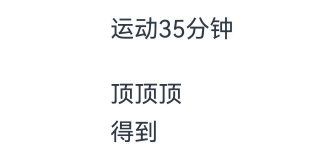

```toc
```

属性字符串 `StyledString/MutableStyledString`（其中 MutableStyledString 继承自 StyledString，下文统称为 StyledString），可用于在字符或段落级别上设置文本样式。将 StyledString 应用到文本组件上，可以采用多种方式修改文本，包括调整字号、添加字体颜色、使文本具备可点击性，以及通过自定义方式绘制文本等。具体使用方法请参考[属性字符串](https://developer.huawei.com/consumer/cn/doc/harmonyos-references-V5/ts-universal-styled-string-V5#%E5%B1%9E%E6%80%A7%E5%AD%97%E7%AC%A6%E4%B8%B2)的文档。

属性字符串提供多种类型样式对象，涵盖各种常见的文本样式格式，例如文本装饰线样式、文本行高样式、文本阴影样式等。也可以自行创建 CustomSpan，以应用自定义样式。

## 创建并应用 StyledString 和 MutableStyledString

可以通过TextController提供的 [setStyledString](https://developer.huawei.com/consumer/cn/doc/harmonyos-references-V5/ts-basic-components-text-V5#setstyledstring12) 方法，将属性字符串附加到文本组件，并推荐在 [onPageShow](https://developer.huawei.com/consumer/cn/doc/harmonyos-references-V5/ts-custom-component-lifecycle-V5#onpageshow) 中触发绑定。

>说明
在aboutToAppear中调用setStyledString方法时，由于该方法运行阶段组件尚未完成创建并成功挂载节点树，因此无法在页面初始化时显示属性字符串。

```ts
@Entry
@Component
struct styled_string_demo1 {
  styledString1: StyledString = new StyledString("运动45分钟");
  mutableStyledString1: MutableStyledString = new MutableStyledString("运动35分钟");
  controller1: TextController = new TextController();
  controller2: TextController = new TextController();

  async onPageShow() {
    this.controller1.setStyledString(this.styledString1);
    this.controller2.setStyledString(this.mutableStyledString1);
  }

  build() {
    Column() {
      // 显示属性字符串
      Text(undefined, { controller: this.controller1 })
      Text(undefined, { controller: this.controller2 })
    }
    .width('100%')
  }
}
```


## 设置文本样式

属性字符串目前提供了 [TextStyle](https://developer.huawei.com/consumer/cn/doc/harmonyos-references-V5/ts-universal-styled-string-V5#textstyle)、[TextShadowStyle](https://developer.huawei.com/consumer/cn/doc/harmonyos-references-V5/ts-universal-styled-string-V5#textshadowstyle)、[DecorationStyle](https://developer.huawei.com/consumer/cn/doc/harmonyos-references-V5/ts-universal-styled-string-V5#decorationstyle)、[BaselineOffsetStyle](https://developer.huawei.com/consumer/cn/doc/harmonyos-references-V5/ts-universal-styled-string-V5#baselineoffsetstyle)、[LineHeightStyle](https://developer.huawei.com/consumer/cn/doc/harmonyos-references-V5/ts-universal-styled-string-V5#lineheightstyle)、[LetterSpacingStyle](https://developer.huawei.com/consumer/cn/doc/harmonyos-references-V5/ts-universal-styled-string-V5#letterspacingstyle) 各种Style对象来实现设置文本的各类样式。

- 创建及应用文本字体样式对象（TextStyle）

```ts
import { LengthMetrics } from '@kit.ArkUI';

@Entry
@Component
struct styled_string_demo2 {
  textStyleAttrs: TextStyle =
    new TextStyle({ fontWeight: FontWeight.Bolder, fontSize: LengthMetrics.vp(24), fontStyle: FontStyle.Italic });
  mutableStyledString: MutableStyledString = new MutableStyledString("运动35分钟 目标达成", [
    {
      start: 2,
      length: 2,
      styledKey: StyledStringKey.FONT,
      styledValue: this.textStyleAttrs
    },
    {
      start: 7,
      length: 4,
      styledKey: StyledStringKey.FONT,
      styledValue: new TextStyle({ fontColor: Color.Orange, fontSize: LengthMetrics.vp(12) })
    }
  ]);
  controller: TextController = new TextController();

  async onPageShow() {
    this.controller.setStyledString(this.mutableStyledString);
  }

  build() {
    Column() {
      // 显示属性字符串
      Text(undefined, { controller: this.controller })
        .margin({ top: 10 })
    }
    .width('100%')
  }
}
```


- 创建及应用文本阴影对象（TextShadowStyle）

```ts
// xxx.ets
@Entry
@Component
struct styled_string_demo3 {
  mutableStyledString: MutableStyledString = new MutableStyledString("运动35分钟", [
    {
      start: 0,
      length: 3,
      styledKey: StyledStringKey.TEXT_SHADOW,
      styledValue: new TextShadowStyle({
        radius: 5,
        type: ShadowType.COLOR,
        color: Color.Red,
        offsetX: 10,
        offsetY: 10
      })
    }
  ]);
  controller: TextController = new TextController();

  async onPageShow() {
    this.controller.setStyledString(this.mutableStyledString);
  }

  build() {
    Column() {
      // 显示属性字符串
      Text(undefined, { controller: this.controller })
    }
    .width('100%')
  }
}
```

- 创建及应用文本装饰线对象（DecorationStyle）

```ts
// xxx.ets
@Entry
@Component
struct styled_string_demo4 {
  mutableStyledString: MutableStyledString = new MutableStyledString("运动35分钟", [
    {
      start: 0,
      length: 3,
      styledKey: StyledStringKey.DECORATION,
      styledValue: new DecorationStyle({ type: TextDecorationType.LineThrough, color: Color.Red })
    }
  ]);
  controller: TextController = new TextController();

  async onPageShow() {
    this.controller.setStyledString(this.mutableStyledString);
  }

  build() {
    Column() {
      // 显示属性字符串
      Text(undefined, { controller: this.controller })
    }
    .width('100%')
  }
}
```


- 创建及应用文本基线偏移量对象（BaselineOffsetStyle）

```ts
import { LengthMetrics } from '@kit.ArkUI';

// xxx.ets
@Entry
@Component
struct styled_string_demo5 {
  mutableStyledString: MutableStyledString = new MutableStyledString("运动35分钟", [
    {
      start: 0,
      length: 3,
      styledKey: StyledStringKey.BASELINE_OFFSET,
      styledValue: new BaselineOffsetStyle(LengthMetrics.px(20))
    }
  ]);
  controller: TextController = new TextController();

  async onPageShow() {
    this.controller.setStyledString(this.mutableStyledString);
  }

  build() {
    Column() {
      // 显示属性字符串
      Text(undefined, { controller: this.controller })
    }
    .width('100%')
  }
}
```


- 创建及应用文本行高对象（LineHeightStyle）

```ts
import { LengthMetrics } from '@kit.ArkUI';

// xxx.ets
@Entry
@Component
struct styled_string_demo6 {
  mutableStyledString: MutableStyledString = new MutableStyledString("运动35分钟\n顶顶顶\n得到", [
    {
      start: 8,
      length: 3,
      styledKey: StyledStringKey.LINE_HEIGHT,
      styledValue: new LineHeightStyle(LengthMetrics.vp(50))
    }
  ]);
  controller: TextController = new TextController();

  async onPageShow() {
    this.controller.setStyledString(this.mutableStyledString);
  }

  build() {
    Column() {
      // 显示属性字符串
      Text(undefined, { controller: this.controller })
    }
    .width('100%')
    .margin({ top: 10 })
  }
}
```


- 创建及应用文本字符间距对象（LetterSpacingStyle）

```ts
import { LengthMetrics, LengthUnit } from '@kit.ArkUI';

// xxx.ets
@Entry
@Component
struct styled_string_demo7 {
  mutableStyledString: MutableStyledString = new MutableStyledString("运动35分钟", [
    {
      start: 0,
      length: 2,
      styledKey: StyledStringKey.LETTER_SPACING,
      styledValue: new LetterSpacingStyle(new LengthMetrics(20, LengthUnit.VP))
    }
  ]);
  controller: TextController = new TextController();

  async onPageShow() {
    this.controller.setStyledString(this.mutableStyledString);
  }

  build() {
    Column() {
      // 显示属性字符串
      Text(undefined, { controller: this.controller })
    }
    .width('100%')
  }
}
```


## 设置段落样式

可通过[ParagraphStyle](https://developer.huawei.com/consumer/cn/doc/harmonyos-references-V5/ts-universal-styled-string-V5#paragraphstyle)设置段落样式布局。下图显示了如何分割文本中的段落，段落以换行符 \n 结尾。

以下代码示例展示了如何创建ParagraphStyle并应用。如果将ParagraphStyle附加到段落开头末尾或之间的任何位置，均会应用样式，非段落区间内则不会应用样式。

```ts
import { LengthMetrics } from '@kit.ArkUI';

@Entry
@Component
struct Index {
  titleParagraphStyleAttr: ParagraphStyle = new ParagraphStyle({
    textAlign: TextAlign.Center
  });
  paragraphStyleAttr1: ParagraphStyle = new ParagraphStyle({
    textIndent: LengthMetrics.vp(15)
  });
  lineHeightStyle1: LineHeightStyle = new LineHeightStyle(new LengthMetrics(24));
  paragraphStyleString1: MutableStyledString =
    new MutableStyledString("段落标题\n正文第一段落开始0123456789正文第一段落结束。", [
      {
        start: 0,
        length: 4,
        styledKey: StyledStringKey.PARAGRAPH_STYLE,
        styledValue: this.titleParagraphStyleAttr
      },
      {
        start: 0,
        length: 4,
        styledKey: StyledStringKey.LINE_HEIGHT,
        styledValue: new LineHeightStyle(new LengthMetrics(50))
      },
      {
        start: 0,
        length: 4,
        styledKey: StyledStringKey.FONT,
        styledValue: new TextStyle({ fontSize: LengthMetrics.vp(24), fontWeight: FontWeight.Bolder })
      },
      {
        start: 5,
        length: 3,
        styledKey: StyledStringKey.PARAGRAPH_STYLE,
        styledValue: this.paragraphStyleAttr1
      },
      {
        start: 5,
        length: 20,
        styledKey: StyledStringKey.LINE_HEIGHT,
        styledValue: this.lineHeightStyle1
      }
    ])

  controller: TextController = new TextController();

  async onPageShow() {
    this.controller.setStyledString(this.paragraphStyleString1);
  }

  build() {
    Column() {
      // 显示属性字符串
      Text(undefined, { controller: this.controller })
    }
    .width('100%')
  }
}
```


除了可以在创建属性字符串时就预设样式，也可以后续通过 [replaceStyle](https://developer.huawei.com/consumer/cn/doc/harmonyos-references-V5/ts-universal-styled-string-V5#replacestyle) 清空原样式替换新样式, 同时需要在附加的文本组件controller上主动触发更新绑定的属性字符串。

```ts
import { LengthMetrics } from '@kit.ArkUI';
//段落不设置缩进配置最大行数及超长显示方式
paragraphStyleAttr3: ParagraphStyle = new ParagraphStyle({ textAlign: TextAlign.End, maxLines: 1, wordBreak: WordBreak.BREAK_ALL, overflow: TextOverflow.Ellipsis});
// 后续某个节点触发更新段落样式
controller: TextController = new TextController();
this.paragraphStyledString1.replaceStyle({
  start: 5,
  length: 3,
  styledKey: StyledStringKey.PARAGRAPH_STYLE,
  styledValue: this.paragraphStyleAttr3
});
this.controller.setStyledString(this.paragraphStyledString1);
```


## 使用图片


## 设置事件


