```toc
```

## 概述

列表是一种复杂的容器，当列表项达到一定数量，内容超过屏幕大小时，可以自动提供滚动功能。它适合用于呈现同类数据类型或数据类型集，例如图片和文本。在列表中显示数据集合是许多应用程序中的常见要求（如通讯录、音乐列表、购物清单等）。

使用列表可以轻松高效地显示结构化、可滚动的信息。通过在 [List](https://developer.huawei.com/consumer/cn/doc/harmonyos-references-V5/ts-container-list-V5) 组件中按垂直或者水平方向线性排列子组件 [ListItemGroup](https://developer.huawei.com/consumer/cn/doc/harmonyos-references-V5/ts-container-listitemgroup-V5) 或 [ListItem](https://developer.huawei.com/consumer/cn/doc/harmonyos-references-V5/ts-container-listitem-V5)，为列表中的行或列提供单个视图，或使用[循环渲染](https://developer.huawei.com/consumer/cn/doc/harmonyos-guides-V5/arkts-rendering-control-foreach-V5)迭代一组行或列，或混合任意数量的单个视图和ForEach结构，构建一个列表。List组件支持使用条件渲染、循环渲染、懒加载等[渲染控制](https://developer.huawei.com/consumer/cn/doc/harmonyos-guides-V5/arkts-rendering-control-overview-V5)方式生成子组件。

## 布局与约束

列表作为一种容器，会自动按其滚动方向排列子组件，向列表中添加组件或从列表中移除组件会重新排列子组件。

如下图所示，在垂直列表中，List按垂直方向自动排列ListItemGroup或ListItem。

ListItemGroup用于列表数据的分组展示，其子组件也是ListItem。ListItem表示单个列表项，可以包含单个子组件。

**图1** List、ListItemGroup和ListItem组件关系


>说明:List的子组件必须是ListItemGroup或ListItem，ListItem和ListItemGroup必须配合List来使用。

### 布局

List除了提供垂直和水平布局能力、超出屏幕时可以滚动的自适应[延伸能力](https://developer.huawei.com/consumer/cn/doc/harmonyos-guides-V5/adaptive-layout-V5#%E5%BB%B6%E4%BC%B8%E8%83%BD%E5%8A%9B)之外，还提供了自适应交叉轴方向上排列个数的布局能力。

利用垂直布局能力可以构建单列或者多列垂直滚动列表，如下图所示。

**图2** 垂直滚动列表（左：单列；右：多列）
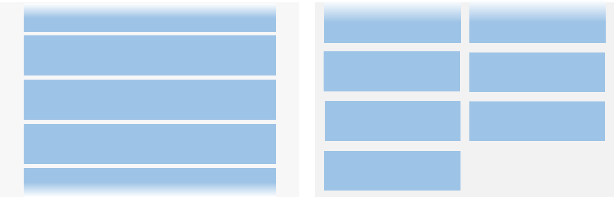


利用水平布局能力可以是构建单行或多行水平滚动列表，如下图所示。
**图3** 水平滚动列表（左：单行；右：多行）
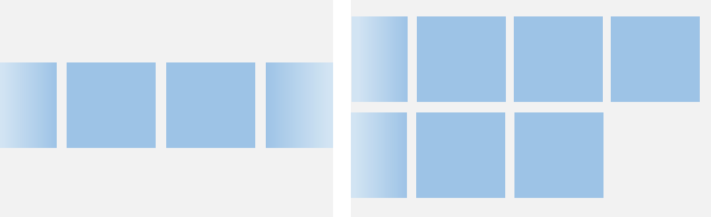

Grid和WaterFlow也可以实现单列、多列布局，如果布局每列等宽，且不需要跨行跨列布局，相比Gird和WaterFlow，则更推荐使用List。

### 约束

列表的主轴方向是指子组件列的排列方向，也是列表的滚动方向。垂直于主轴的轴称为交叉轴，其方向与主轴方向相互垂直。

如下图所示，垂直列表的主轴是垂直方向，交叉轴是水平方向；水平列表的主轴是水平方向，交叉轴是垂直方向。

**图4** 列表的主轴与交叉轴
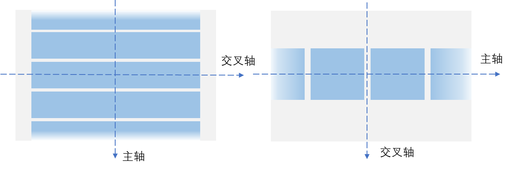

如果List组件主轴或交叉轴方向设置了尺寸，则其对应方向上的尺寸为设置值。

如果List组件主轴方向没有设置尺寸，当List子组件主轴方向总尺寸小于List的父组件尺寸时，List主轴方向尺寸自动适应子组件的总尺寸。

如下图所示，一个垂直列表B没有设置高度时，其父组件A高度为200vp，若其所有子组件C的高度总和为150vp，则此时列表B的高度为150vp。

**图5** 列表主轴高度约束示例1（**A**: List的父组件; **B**: List组件; **C**: List的所有子组件）
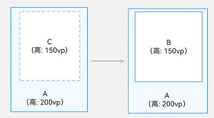

其实就相当于通过 List 的所有子组件尺寸和来规定 List 组件的尺寸。


如果子组件主轴方向总尺寸超过List父组件尺寸时，List主轴方向尺寸适应List的父组件尺寸。

如下图所示，同样是没有设置高度的垂直列表B，其父组件A高度为200vp，若其所有子组件C的高度总和为300vp，则此时列表B的高度为200vp。

**图6** 列表主轴高度约束示例2（**A**: List的父组件; **B**: List组件; **C**: List的所有子组件）

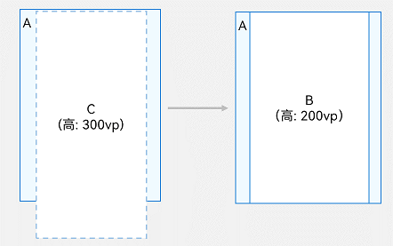

其实就是不能超出父组件的尺寸。List组件交叉轴方向在没有设置尺寸时，其尺寸默认自适应父组件尺寸。


## 开发布局

### 设置主轴方向

List组件主轴默认是垂直方向，即默认情况下不需要手动设置List方向，就可以构建一个垂直滚动列表。

若是水平滚动列表场景，将List的listDirection属性设置为Axis. Horizontal即可实现。listDirection默认为Axis. Vertical，即主轴默认是垂直方向。

```ts
List() {
  // ...
}
.listDirection(Axis.Horizontal)
```

### 设置交叉轴布局

List组件的交叉轴布局可以通过lanes和alignListItem属性进行设置，lanes属性用于确定交叉轴排列的列表项数量，alignListItem用于设置子组件在交叉轴方向的对齐方式。

List组件的lanes属性通常用于在不同尺寸的设备自适应构建不同行数或列数的列表，即一次开发、多端部署的场景，例如[歌单列表](https://developer.huawei.com/consumer/cn/doc/harmonyos-guides-V5/music-album-page-V5#%E6%AD%8C%E5%8D%95%E5%88%97%E8%A1%A8)。lanes属性的取值类型是"number | [LengthConstrain](https://developer.huawei.com/consumer/cn/doc/harmonyos-references-V5/ts-types-V5#lengthconstrain)"，即整数或者LengthConstrain类型。以垂直列表为例，如果将lanes属性设为2，表示构建的是一个两列的垂直列表，如图2中右图所示。lanes的默认值为1，即默认情况下，垂直列表的列数是1。

```ts
List() {
  // ...
}
.lanes(2)
```

当其取值为LengthConstrain类型时，表示会根据LengthConstrain与List组件的尺寸自适应决定行或列数。

```ts
@Entry
@Component
struct EgLanes {
  @State egLanes: LengthConstrain = { minLength: 200, maxLength: 300 }
  build() {
    List() {
      // ...
    }
    .lanes(this.egLanes)
  }
}
```

例如，假设在垂直列表中设置了lanes的值为{ minLength: 200, maxLength: 300 }。此时，

- 当List组件宽度为300vp时，由于minLength为200vp，此时列表为一列。
    
- 当List组件宽度变化至400vp时，符合两倍的minLength，则此时列表自适应为两列。
    

同样以垂直列表为例，当alignListItem属性设置为ListItemAlign. Center表示列表项在水平方向上居中对齐。alignListItem的默认值是ListItemAlign. Start，即列表项在列表交叉轴方向上默认按首部对齐。

```ts
List() {
  // ...
}
.alignListItem(ListItemAlign.Center)
```


## 在列表中显示数据

列表视图垂直或水平显示项目集合，在行或列超出屏幕时提供滚动功能，使其适合显示大型数据集合。在最简单的列表形式中，List静态地创建其列表项ListItem的内容。

**图7** 城市列表


```ts
@Entry
@Component
struct CityList {
  build() {
    List() {
      ListItem() {
        Text('北京').fontSize(24)
      }

      ListItem() {
        Text('杭州').fontSize(24)
      }

      ListItem() {
        Text('上海').fontSize(24)
      }
    }
    .backgroundColor('#FFF1F3F5')
    .alignListItem(ListItemAlign.Center)
  }
}
```

由于在ListItem中只能有一个根节点组件，不支持以平铺形式使用多个组件。因此，若列表项是由多个组件元素组成的，则需要将这多个元素组合到一个容器组件内或组成一个自定义组件。

**图8** 联系人列表项示例
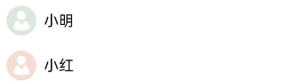


如上图所示，联系人列表的列表项中，每个联系人都有头像和名称。此时，需要将Image和Text封装到一个Row容器内。

```ts
List() {
  ListItem() {
    Row() {
      Image($r('app.media.iconE'))
        .width(40)
        .height(40)
        .margin(10)

      Text('小明')
        .fontSize(20)
    }
  }

  ListItem() {
    Row() {
      Image($r('app.media.iconF'))
        .width(40)
        .height(40)
        .margin(10)

      Text('小红')
        .fontSize(20)
    }
  }
}
```


## 迭代列表内容

通常，应用通过数据集合动态地创建列表。使用[循环渲染](https://developer.huawei.com/consumer/cn/doc/harmonyos-guides-V5/arkts-rendering-control-foreach-V5)可从数据源中迭代获取数据，并在每次迭代过程中创建相应的组件，降低代码复杂度。

ArkTS通过[ForEach](https://developer.huawei.com/consumer/cn/doc/harmonyos-guides-V5/arkts-rendering-control-foreach-V5)提供了组件的循环渲染能力。以简单形式的联系人列表为例，将联系人名称和头像数据以Contact类结构存储到contacts数组，使用ForEach中嵌套ListItem的形式来代替多个平铺的、内容相似的ListItem，从而减少重复代码。

```ts
import { util } from '@kit.ArkTS'

class Contact {
  key: string = util.generateRandomUUID(true);
  name: string;
  icon: Resource;

  constructor(name: string, icon: Resource) {
    this.name = name;
    this.icon = icon;
  }
}

@Entry
@Component
struct SimpleContacts {
  private contacts: Array<object> = [
    new Contact('小明', $r("app.media.iconA")),
    new Contact('小红', $r("app.media.iconB")),
  ]

  build() {
    List() {
      ForEach(this.contacts, (item: Contact) => {
        ListItem() {
          Row() {
            Image(item.icon)
              .width(40)
              .height(40)
              .margin(10)
            Text(item.name).fontSize(20)
          }
          .width('100%')
          .justifyContent(FlexAlign.Start)
        }
      }, (item: Contact) => JSON.stringify(item))
    }
    .width('100%')
  }
}
```

在List组件中，ForEach除了可以用来循环渲染ListItem，也可以用来循环渲染ListItemGroup。ListItemGroup的循环渲染详细使用请参见[支持分组列表](https://developer.huawei.com/consumer/cn/doc/harmonyos-guides-V5/arkts-layout-development-create-list-V5#%E6%94%AF%E6%8C%81%E5%88%86%E7%BB%84%E5%88%97%E8%A1%A8)。

## 自定义列表样式

### 设置内容间距

在初始化列表时，如需在列表项之间添加间距，可以使用space参数。例如，在每个列表项之间沿主轴方向添加10vp的间距：

```ts
List({ space: 10 }) {
  // ...
}
```

### 添加分隔线

分隔线用来将界面元素隔开，使单个元素更加容易识别。如下图所示，当列表项左边有图标（如蓝牙图标），由于图标本身就能很好的区分，此时分隔线从图标之后开始显示即可。

**图9** 设置列表分隔线样式
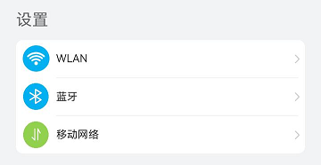

List提供了divider属性用于给列表项之间添加分隔线。在设置divider属性时，可以通过strokeWidth和color属性设置分隔线的粗细和颜色。

startMargin和endMargin属性分别用于设置分隔线距离列表侧边起始端的距离和距离列表侧边结束端的距离。

```ts
class DividerTmp {
  strokeWidth: Length = 1
  startMargin: Length = 60
  endMargin: Length = 10
  color: ResourceColor = '#ffe9f0f0'

  constructor(strokeWidth: Length, startMargin: Length, endMargin: Length, color: ResourceColor) {
    this.strokeWidth = strokeWidth
    this.startMargin = startMargin
    this.endMargin = endMargin
    this.color = color
  }
}
@Entry
@Component
struct EgDivider {
  @State egDivider: DividerTmp = new DividerTmp(1, 60, 10, '#ffe9f0f0')
  build() {
    List() {
      // ...
    }
    .divider(this.egDivider)
  }
}
```

此示例表示从距离列表侧边起始端60vp开始到距离结束端10vp的位置，画一条粗细为1vp的分割线，可以实现图9设置列表分隔线的样式。

说明

1. 分隔线的宽度会使ListItem之间存在一定间隔，当List设置的内容间距小于分隔线宽度时，ListItem之间的间隔会使用分隔线的宽度。
    
2. 当List存在多列时，分割线的startMargin和endMargin作用于每一列上。
    
3. List组件的分隔线画在两个ListItem之间，第一个ListItem上方和最后一个ListItem下方不会绘制分隔线。
    

### 添加滚动条

当列表项高度（宽度）超出屏幕高度（宽度）时，列表可以沿垂直（水平)方向滚动。在页面内容很多时，若用户需快速定位，可拖拽滚动条，如下图所示。

在使用List组件时，可通过scrollBar属性控制列表滚动条的显示。scrollBar的取值类型为[BarState](https://developer.huawei.com/consumer/cn/doc/harmonyos-references-V5/ts-appendix-enums-V5#barstate)，当取值为`BarState.Auto`表示按需显示滚动条。此时，当触摸到滚动条区域时显示控件，可上下拖拽滚动条快速浏览内容，拖拽时会变粗。若不进行任何操作，2秒后滚动条自动消失。

scrollBar属性API version 9及以下版本默认值为`BarState.Off`，从API version 10版本开始默认值为`BarState.Auto`。

```ts
List() {
  // ...
}
.scrollBar(BarState.Auto)
```


## 支持分组列表

在列表中支持数据的分组展示，可以使列表显示结构清晰，查找方便，从而提高使用效率。分组列表在实际应用中十分常见，如下图所示联系人列表。

**图11** 联系人分组列表
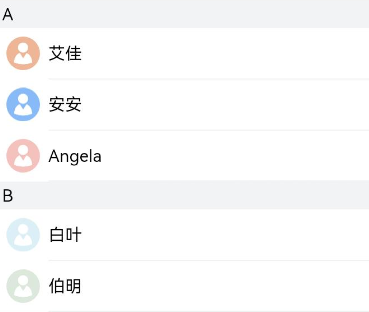


在List组件中使用ListItemGroup对项目进行分组，可以构建二维列表。

在List组件中可以直接使用一个或者多个ListItemGroup组件，ListItemGroup的宽度默认充满List组件。在初始化ListItemGroup时，可通过header参数设置列表分组的头部组件。

```ts
@Entry
@Component
struct ContactsList {
  
  @Builder itemHead(text: string) {
    // 列表分组的头部组件，对应联系人分组A、B等位置的组件
    Text(text)
      .fontSize(20)
      .backgroundColor('#fff1f3f5')
      .width('100%')
      .padding(5)
  }

  build() {
    List() {
      ListItemGroup({ header: this.itemHead('A') }) {
        // 循环渲染分组A的ListItem
      }

      ListItemGroup({ header: this.itemHead('B') }) {
        // 循环渲染分组B的ListItem
      }
    }
  }
}
```

如果多个ListItemGroup结构类似，可以将多个分组的数据组成数组，然后使用ForEach对多个分组进行循环渲染。例如在联系人列表中，将每个分组的联系人数据contacts（可参考[迭代列表内容](https://developer.huawei.com/consumer/cn/doc/harmonyos-guides-V5/arkts-layout-development-create-list-V5#%E8%BF%AD%E4%BB%A3%E5%88%97%E8%A1%A8%E5%86%85%E5%AE%B9)章节）和对应分组的标题title数据进行组合，定义为数组contactsGroups。然后在ForEach中对contactsGroups进行循环渲染，即可实现多个分组的联系人列表。可参考[添加粘性标题](https://developer.huawei.com/consumer/cn/doc/harmonyos-guides-V5/arkts-layout-development-create-list-V5#%E6%B7%BB%E5%8A%A0%E7%B2%98%E6%80%A7%E6%A0%87%E9%A2%98)章节示例代码。

## 添加粘性标题

粘性标题是一种常见的标题模式，常用于定位字母列表的头部元素。如下图所示，在联系人列表中滚动A部分时，B部分开始的头部元素始终处于A的下方。而在开始滚动B部分时，B的头部会固定在屏幕顶部，直到所有B的项均完成滚动后，才被后面的头部替代。

粘性标题不仅有助于阐明列表中数据的表示形式和用途，还可以帮助用户在大量信息中进行数据定位，从而避免用户在标题所在的表的顶部与感兴趣区域之间反复滚动。

就比如上面例子在滑动时如果 A 分组下面的内容没有被全部滑动出去，那么 A 就会固定在上面，直到 A 下面的所有内容都滑出屏幕才会跟着滑动出去。
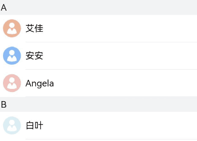


List组件的sticky属性配合ListItemGroup组件使用，用于设置ListItemGroup中的头部组件是否呈现吸顶效果或者尾部组件是否呈现吸底效果。

通过给List组件设置sticky属性为StickyStyle.Header，即可实现列表的粘性标题效果。如果需要支持吸底效果，可以通过footer参数初始化ListItemGroup的底部组件，并将sticky属性设置为`StickyStyle.Footer`。

```ts
import { util } from '@kit.ArkTS'
class Contact {
  key: string = util.generateRandomUUID(true);
  name: string;
  icon: Resource;

  constructor(name: string, icon: Resource) {
    this.name = name;
    this.icon = icon;
  }
}
class ContactsGroup {
  title: string = ''
  contacts: Array<object> | null = null
  key: string = ""
}
export let contactsGroups: object[] = [
  {
    title: 'A',
    contacts: [
      new Contact('艾佳', $r('app.media.iconA')),
      new Contact('安安', $r('app.media.iconB')),
      new Contact('Angela', $r('app.media.iconC')),
    ],
    key: util.generateRandomUUID(true)
  } as ContactsGroup,
  {
    title: 'B',
    contacts: [
      new Contact('白叶', $r('app.media.iconD')),
      new Contact('伯明', $r('app.media.iconE')),
    ],
    key: util.generateRandomUUID(true)
  } as ContactsGroup,
  // ...
]
@Entry
@Component
struct ContactsList {
  // 定义分组联系人数据集合contactsGroups数组
  @Builder itemHead(text: string) {
    // 列表分组的头部组件，对应联系人分组A、B等位置的组件
    Text(text)
      .fontSize(20)
      .backgroundColor('#fff1f3f5')
      .width('100%')
      .padding(5)
  }
  build() {
    List() {
      // 循环渲染ListItemGroup，contactsGroups为多个分组联系人contacts和标题title的数据集合
      ForEach(contactsGroups, (itemGroup: ContactsGroup) => {
        ListItemGroup({ header: this.itemHead(itemGroup.title) }) {
          // 循环渲染ListItem
          if (itemGroup.contacts) {
            ForEach(itemGroup.contacts, (item: Contact) => {
              ListItem() {
                // ...
              }
            }, (item: Contact) => JSON.stringify(item))
          }
        }
      }, (itemGroup: ContactsGroup) => JSON.stringify(itemGroup))
    }.sticky(StickyStyle.Header)  // 设置吸顶，实现粘性标题效果
  }
}
```


## 控制滚动位置

控制滚动位置在实际应用中十分常见，例如当新闻页列表项数量庞大，用户滚动列表到一定位置时，希望快速滚动到列表底部或返回列表顶部。此时，可以通过控制滚动位置来实现列表的快速定位，如下图所示。

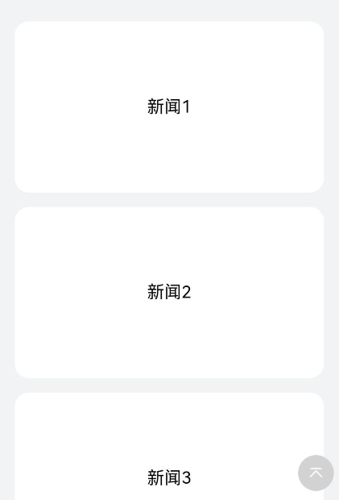

List组件初始化时，可以通过scroller参数绑定一个[Scroller](https://developer.huawei.com/consumer/cn/doc/harmonyos-references-V5/ts-container-scroll-V5#scroller)对象，进行列表的滚动控制。例如，用户在新闻应用中，点击新闻页面底部的返回顶部按钮时，就可以通过Scroller对象的scrollToIndex方法使列表滚动到指定的列表项索引位置。

首先，需要创建一个Scroller的对象listScroller。

```ts
private listScroller: Scroller = new Scroller();
```

然后，通过将listScroller用于初始化List组件的scroller参数，完成listScroller与列表的绑定。在需要跳转的位置指定scrollToIndex的参数为0，表示返回列表顶部。

```ts
Stack({ alignContent: Alignment.Bottom }) {
  // 将listScroller用于初始化List组件的scroller参数，完成listScroller与列表的绑定。
  List({ space: 20, scroller: this.listScroller }) {
    // ...
  }

  Button() {
    // ...
  }
  .onClick(() => {
    // 点击按钮时，指定跳转位置，返回列表顶部
    this.listScroller.scrollToIndex(0)
  })
}
```

## 响应滚动位置

许多应用需要监听列表的滚动位置变化并作出响应。例如，在联系人列表滚动时，如果跨越了不同字母开头的分组，则侧边字母索引栏也需要更新到对应的字母位置。

除了字母索引之外，滚动列表结合多级分类索引在应用开发过程中也很常见，例如购物应用的商品分类页面，多级分类也需要监听列表的滚动位置。

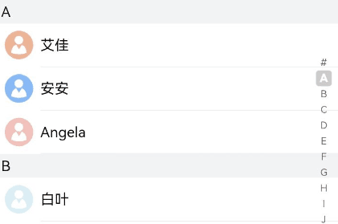


如上图所示，当联系人列表从A滚动到B时，右侧索引栏也需要同步从选中A状态变成选中B状态。此场景可以通过监听List组件的onScrollIndex事件来实现，右侧索引栏需要使用字母表索引组件[AlphabetIndexer](https://developer.huawei.com/consumer/cn/doc/harmonyos-references-V5/ts-container-alphabet-indexer-V5)。

在列表滚动时，根据列表此时所在的索引值位置firstIndex，重新计算字母索引栏对应字母的位置selectedIndex。由于AlphabetIndexer组件通过selected属性设置了选中项索引值，当selectedIndex变化时会触发AlphabetIndexer组件重新渲染，从而显示为选中对应字母的状态。

```ts
const alphabets = ['#', 'A', 'B', 'C', 'D', 'E', 'F', 'G', 'H', 'I', 'J', 'K',
  'L', 'M', 'N', 'O', 'P', 'Q', 'R', 'S', 'T', 'U', 'V', 'W', 'X', 'Y', 'Z'];
@Entry
@Component
struct ContactsList {
  @State selectedIndex: number = 0;
  private listScroller: Scroller = new Scroller();

  build() {
    Stack({ alignContent: Alignment.End }) {
      List({ scroller: this.listScroller }) {}
      .onScrollIndex((firstIndex: number) => {
        // 根据列表滚动到的索引值，重新计算对应联系人索引栏的位置this.selectedIndex
      })

      // 字母表索引组件
      AlphabetIndexer({ arrayValue: alphabets, selected: 0 })
        .selected(this.selectedIndex)
    }
  }
}
```

>说明：计算索引值时，ListItemGroup 作为一个整体占一个索引值，不计算ListItemGroup 内部ListItem的索引值。


## 响应列表项侧滑

侧滑菜单在许多应用中都很常见。例如，通讯类应用通常会给消息列表提供侧滑删除功能，即用户可以通过向左侧滑列表的某一项，再点击删除按钮删除消息，如下图所示。其中，列表项头像右上角标记设置参考[给列表项添加标记](https://developer.huawei.com/consumer/cn/doc/harmonyos-guides-V5/arkts-layout-development-create-list-V5#%E7%BB%99%E5%88%97%E8%A1%A8%E9%A1%B9%E6%B7%BB%E5%8A%A0%E6%A0%87%E8%AE%B0)。

**图15** 侧滑删除列表项
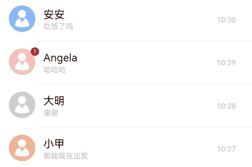


ListItem的[swipeAction属性](https://developer.huawei.com/consumer/cn/doc/harmonyos-references-V5/ts-container-listitem-V5#swipeaction9)可用于实现列表项的左右滑动功能。swipeAction属性方法初始化时有必填参数SwipeActionOptions，其中，start参数表示设置列表项右滑时起始端滑出的组件，end参数表示设置列表项左滑时尾端滑出的组件。

在消息列表中，end参数表示设置ListItem左滑时尾端划出自定义组件，即删除按钮。在初始化end方法时，将滑动列表项的索引传入删除按钮组件，当用户点击删除按钮时，可以根据索引值来删除列表项对应的数据，从而实现侧滑删除功能。

1. 实现尾端滑出组件的构建。
```ts
@Builder itemEnd(index: number) {
  // 构建尾端滑出组件
  Button({ type: ButtonType.Circle }) {
    Image($r('app.media.ic_public_delete_filled'))
      .width(20)
      .height(20)
  }
  .onClick(() => {
    // this.messages为列表数据源，可根据实际场景构造。点击后从数据源删除指定数据项。
    this.messages.splice(index, 1);
  })
}
```

2. 绑定swipeAction属性到可左滑的ListItem上。
```ts
// 构建List时，通过ForEach基于数据源this.messages循环渲染ListItem。
ListItem() {
  // ...
}
.swipeAction({
  end: {
    // index为该ListItem在List中的索引值。
    builder: () => { this.itemEnd(index) },
  }
}) // 设置侧滑属性.
```


