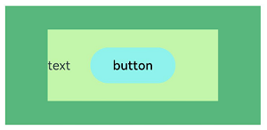

```toc
```


## 概述

层叠布局（StackLayout）用于在屏幕上预留一块区域来显示组件中的元素，提供元素可以重叠的布局。层叠布局通过[Stack](https://developer.huawei.com/consumer/cn/doc/harmonyos-references-V5/ts-container-stack-V5)容器组件实现位置的固定定位与层叠，容器中的子元素依次入栈，后一个子元素覆盖前一个子元素，子元素可以叠加，也可以设置位置。

层叠布局具有较强的页面层叠、位置定位能力，其使用场景有广告、卡片层叠效果等。

如图1，Stack作为容器，容器内的子元素的顺序为`Item1->Item2->Item3`。


## 开发布局

Stack组件为容器组件，容器内可包含各种子元素。其中子元素默认进行居中堆叠。子元素被约束在Stack下，进行自己的样式定义以及排列。

```ts
// xxx.ets
let MTop:Record<string,number> = { 'top': 50 }

@Entry
@Component
struct StackExample {
  build() {
    Column(){
      Stack({ }) {
        Column(){}.width('90%').height('100%').backgroundColor('#ff58b87c')
        Text('text').width('60%').height('60%').backgroundColor('#ffc3f6aa')
        Button('button').width('30%').height('30%').backgroundColor('#ff8ff3eb').fontColor('#000')
      }.width('100%').height(150).margin(MTop)
    }
  }
}
```




## 对齐方式

Stack组件通过[alignContent参数](https://developer.huawei.com/consumer/cn/doc/harmonyos-references-V5/ts-container-stack-V5#aligncontent)实现位置的相对移动。如图2所示，支持九种对齐方式。


```ts
// xxx.ets
@Entry
@Component
struct StackExample {
  build() {
    Stack({ alignContent: Alignment.TopStart }) {
      Text('Stack').width('90%').height('100%').backgroundColor('#e1dede').align(Alignment.BottomEnd)
      Text('Item 1').width('70%').height('80%').backgroundColor(0xd2cab3).align(Alignment.BottomEnd)
      Text('Item 2').width('50%').height('60%').backgroundColor(0xc1cbac).align(Alignment.BottomEnd)
    }.width('100%').height(150).margin({ top: 5 })
  }
}
```

这里要注意：
- 在 Stack 中定义的对齐方式是针对 Stack 中的子组件的对齐方式
- 而子组件中的 Text 中设定的对齐方式是针对 Text 中的文本，如果子组件也是一个容器组件，那么就是针对孙组件的对齐方式。*但是效果好像不是太对，只能上中下，并不能上右对齐这种*。

## Z 序控制

Stack容器中兄弟组件显示层级关系可以通过[Z序控制](https://developer.huawei.com/consumer/cn/doc/harmonyos-references-V5/ts-universal-attributes-z-order-V5)的zIndex属性改变。zIndex值越大，显示层级越高，即zIndex值大的组件会覆盖在zIndex值小的组件上方。

在层叠布局中，如果后面子元素尺寸大于前面子元素尺寸，则前面子元素完全隐藏。

```ts
Stack({ alignContent: Alignment.BottomStart }) {
  Column() {
    Text('Stack子元素1').textAlign(TextAlign.End).fontSize(20)
  }.width(100).height(100).backgroundColor(0xffd306)

  Column() {
    Text('Stack子元素2').fontSize(20)
  }.width(150).height(150).backgroundColor(Color.Pink)

  Column() {
    Text('Stack子元素3').fontSize(20)
  }.width(200).height(200).backgroundColor(Color.Grey)
}.width(350).height(350).backgroundColor(0xe0e0e0)
```

上图中，最后的子元素3的尺寸大于前面的所有子元素，所以，前面两个元素完全隐藏。改变子元素1，子元素2的zIndex属性后，可以将元素展示出来。


