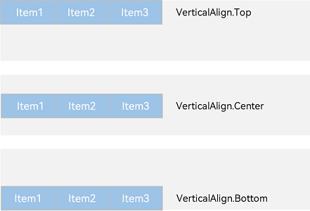
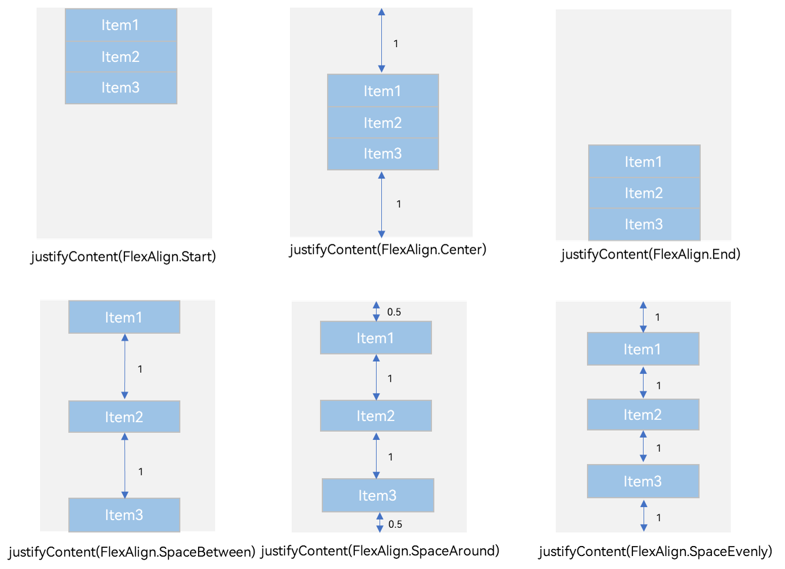

```toc
```

## 概述

线性布局（LinearLayout）是开发中最常用的布局，通过线性容器[Row](https://developer.huawei.com/consumer/cn/doc/harmonyos-references-V5/ts-container-row-V5)和[Column](https://developer.huawei.com/consumer/cn/doc/harmonyos-references-V5/ts-container-column-V5)构建。线性布局是其他布局的基础，其子元素在线性方向上（水平方向和垂直方向）依次排列。线性布局的排列方向由所选容器组件决定，Column容器内子元素按照垂直方向排列，Row容器内子元素按照水平方向排列。根据不同的排列方向，开发者可选择使用Row或Column容器创建线性布局。

Column 容器子元素排列


Row 容器内子元素排列


## 基本概念

- 布局容器：具有布局能力的容器组件，可以承载其他元素作为其子元素，布局容器会对其子元素进行尺寸计算和布局排列。
    
- 布局子元素：布局容器内部的元素。
    
- 主轴：线性布局容器在布局方向上的轴线，子元素默认沿主轴排列。Row容器主轴为水平方向（交叉轴为垂直方向），Column容器主轴为垂直方向（交叉轴为水平方向）。
    
- 交叉轴：垂直于主轴方向的轴线。Row容器交叉轴为垂直方向，Column容器交叉轴为水平方向。
    
- 间距：布局子元素的间距。

## 布局子元素在排列方向上的间距

在布局容器内，可以通过space属性设置排列方向上子元素的间距，使各子元素在排列方向上有等间距效果。


```ts
Column({ space: 20 }) {
  Text('space: 20').fontSize(15).fontColor(Color.Gray).width('90%')
  Row().width('90%').height(50).backgroundColor(0xF5DEB3)
  Row().width('90%').height(50).backgroundColor(0xD2B48C)
  Row().width('90%').height(50).backgroundColor(0xF5DEB3)
}.width('100%')
```


## 布局子元素在交叉轴上的对齐方式

在布局容器内，可以通过alignItems属性设置子元素在交叉轴（排列方向的垂直方向）上的对齐方式。且在各类尺寸屏幕中，表现一致。其中，交叉轴为垂直方向时，取值为[VerticalAlign](https://developer.huawei.com/consumer/cn/doc/harmonyos-references-V5/ts-appendix-enums-V5#verticalalign)类型，水平方向取值为[HorizontalAlign](https://developer.huawei.com/consumer/cn/doc/harmonyos-references-V5/ts-appendix-enums-V5#horizontalalign)类型。

alignSelf属性用于控制单个子元素在容器交叉轴上的对齐方式，其优先级高于alignItems属性，如果设置了alignSelf属性，则在单个子元素上会覆盖alignItems属性。

### Column容器内子元素在水平方向上的排列


### Row容器内子元素在垂直方向上的排列




## 布局字元素在主轴上的排列方式

在布局容器内，可以通过justifyContent属性设置子元素在容器主轴上的排列方式。可以从主轴起始位置开始排布，也可以从主轴结束位置开始排布，或者均匀分割主轴的空间。

### Column容器内子元素在垂直方向上的排列




### Row容器内子元素在水平方向上的排列


## 自适应拉伸

在线性布局下，常用空白填充组件 [Blank](https://developer.huawei.com/consumer/cn/doc/harmonyos-references-V5/ts-basic-components-blank-V5)，在容器主轴方向自动填充空白空间，达到自适应拉伸效果。Row和Column作为容器，只需要添加宽高为百分比，当屏幕宽高发生变化时，会产生自适应效果。

```ts
@Entry
@Component
struct BlankExample {
  build() {
    Column() {
      Row() {
        Text('Bluetooth').fontSize(18)
        Blank()
        Toggle({ type: ToggleType.Switch, isOn: true })
      }.backgroundColor(0xFFFFFF).borderRadius(15).padding({ left: 12 }).width('100%')
    }.backgroundColor(0xEFEFEF).padding(20).width('100%')
  }
}
```


## 自适应缩放

自适应缩放是指子元素随容器尺寸的变化而按照预设的比例自动调整尺寸，适应各种不同大小的设备。在线性布局中，可以使用以下两种方法实现自适应缩放。

- 父容器尺寸确定时，使用layoutWeight属性设置子元素和兄弟元素在主轴上的权重，忽略元素本身尺寸设置，使它们在任意尺寸的设备下自适应占满剩余空间。

```ts
@Entry
@Component
struct layoutWeightExample {
  build() {
    Column() {
      Text('1:2:3').width('100%')
      Row() {
        Column() {
          Text('layoutWeight(1)')
            .textAlign(TextAlign.Center)
        }.layoutWeight(1).backgroundColor(0xF5DEB3).height('100%')

        Column() {
          Text('layoutWeight(2)')
            .textAlign(TextAlign.Center)
        }.layoutWeight(2).backgroundColor(0xD2B48C).height('100%')

        Column() {
          Text('layoutWeight(3)')
            .textAlign(TextAlign.Center)
        }.layoutWeight(3).backgroundColor(0xF5DEB3).height('100%')

      }.backgroundColor(0xffd306).height('30%')

      Text('2:5:3').width('100%')
      Row() {
        Column() {
          Text('layoutWeight(2)')
            .textAlign(TextAlign.Center)
        }.layoutWeight(2).backgroundColor(0xF5DEB3).height('100%')

        Column() {
          Text('layoutWeight(5)')
            .textAlign(TextAlign.Center)
        }.layoutWeight(5).backgroundColor(0xD2B48C).height('100%')

        Column() {
          Text('layoutWeight(3)')
            .textAlign(TextAlign.Center)
        }.layoutWeight(3).backgroundColor(0xF5DEB3).height('100%')
      }.backgroundColor(0xffd306).height('30%')
    }
  }
}
```

就是使用 layoutWeight 来设置权重


- 父容器尺寸确定时，使用百分比设置子元素和兄弟元素的宽度，使他们在任意尺寸的设备下保持固定的自适应占比。

```ts
@Entry
@Component
struct WidthExample {
  build() {
    Column() {
      Row() {
        Column() {
          Text('left width 20%')
            .textAlign(TextAlign.Center)
        }.width('20%').backgroundColor(0xF5DEB3).height('100%')

        Column() {
          Text('center width 50%')
            .textAlign(TextAlign.Center)
        }.width('50%').backgroundColor(0xD2B48C).height('100%')

        Column() {
          Text('right width 30%')
            .textAlign(TextAlign.Center)
        }.width('30%').backgroundColor(0xF5DEB3).height('100%')
      }.backgroundColor(0xffd306).height('30%')
    }
  }
}
```

使用 width 设置权重

## 自适应延伸

自适应延伸是指在不同尺寸设备下，当页面的内容超出屏幕大小而无法完全显示时，可以通过滚动条进行拖动展示。这种方法适用于线性布局中内容无法一屏展示的场景。通常有以下两种实现方式。

- [在List中添加滚动条](https://developer.huawei.com/consumer/cn/doc/harmonyos-guides-V5/arkts-layout-development-create-list-V5#%E6%B7%BB%E5%8A%A0%E6%BB%9A%E5%8A%A8%E6%9D%A1)：当List子项过多一屏放不下时，可以将每一项子元素放置在不同的组件中，通过滚动条进行拖动展示。可以通过scrollBar属性设置滚动条的常驻状态，edgeEffect属性设置拖动到内容最末端的回弹效果。
    
- 使用Scroll组件：在线性布局中，开发者可以进行垂直方向或者水平方向的布局。当一屏无法完全显示时，可以在Column或Row组件的外层包裹一个可滚动的容器组件Scroll来实现可滑动的线性布局。
    
    垂直方向布局中使用Scroll组件：

```ts
@Entry
@Component
struct ScrollExample {
  scroller: Scroller = new Scroller();
  private arr: number[] = [0, 1, 2, 3, 4, 5, 6, 7, 8, 9];

  build() {
    Scroll(this.scroller) {
      Column() {
        ForEach(this.arr, (item?:number|undefined) => {
          if(item){
            Text(item.toString())
            .width('90%')
            .height(150)
            .backgroundColor(0xFFFFFF)
            .borderRadius(15)
            .fontSize(16)
            .textAlign(TextAlign.Center)
            .margin({ top: 10 })
          }
        }, (item:number) => item.toString())
      }.width('100%')
    }
    .backgroundColor(0xDCDCDC)
    .scrollable(ScrollDirection.Vertical) // 滚动方向为垂直方向
    .scrollBar(BarState.On) // 滚动条常驻显示
    .scrollBarColor(Color.Gray) // 滚动条颜色
    .scrollBarWidth(10) // 滚动条宽度
    .edgeEffect(EdgeEffect.Spring) // 滚动到边沿后回弹
  }
}
```


