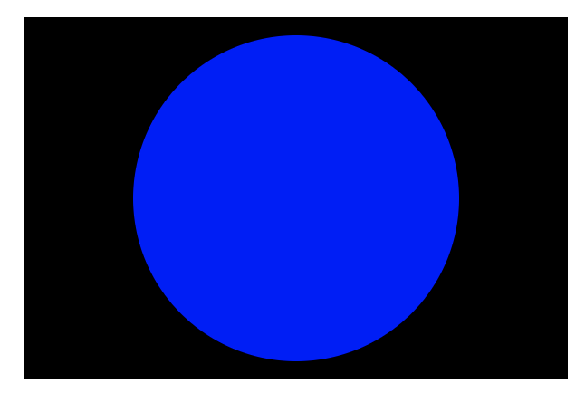

```toc
```

## “头”——元信息

```html
<!DOCTYPE html>
<html lang="zh-CN">
  <head>
    <meta charset="utf-8" />
    <title>我的测试页面</title>
  </head>
  <body>
    <p>这是我的页面</p>
  </body>
</html>
```

HTML 头部包含 HTML `<head>` 元素的内容，与 `<body>` 元素内容不同，页面在浏览器加载后它的内容不会在浏览器中显示，它的作用是保存页面的一些元数据。

### <meta> 元素

元数据就是描述数据的数据，而 HTML 有一个“官方的”方式来为一个文档添加元数据—— `<meta>` 元素。当然，其他在这篇文章中提到的东西也可以被当作元数据。有很多不同种类的 `<meta>` 元素可以被包含进你的页面的 `<head>` 元素。

*指定字符编码*

```html
<meta charset="utf-8" />
```


*添加作者和描述*

许多 `<meta>` 元素包含了 `name` 和 `content` 属性：

- `name` 指定了 meta 元素的类型；说明该元素包含了什么类型的信息。
- `content` 指定了实际的元数据内容。

这两个 meta 元素对于定义你的页面的作者和提供页面的简要描述是很有用的。让我们看一个例子：

```html
<meta name="author" content="Chris Mills" />
<meta
  name="description"
  content="The MDN Web Docs Learning Area aims to provide
complete beginners to the Web with all they need to know to get
started with developing web sites and applications." />
```

### 自定义图标

页面添加网页图标的方式有：

1. 将其保存在与网站的索引页面相同的目录中，以 `.ico` 格式保存（大多数浏览器支持更通用的格式，如 `.gif` 或 `.png`）
2. 将以下行添加到 HTML 的 [`<head>`](https://developer.mozilla.org/zh-CN/docs/Web/HTML/Element/head) 块中以引用它：

```html
<link rel="icon" href="favicon.ico" type="image/x-icon" />
```

### 使用 css 和 javascript

如今，几乎你使用的所有网站都会使用 [CSS](https://developer.mozilla.org/zh-CN/docs/Glossary/CSS) 来让网页更加炫酷，并使用 [JavaScript](https://developer.mozilla.org/zh-CN/docs/Glossary/JavaScript) 来让网页有交互功能，比如视频播放器、地图、游戏以及更多功能。这些应用在网页中很常见，它们分别使用 [`<link>`](https://developer.mozilla.org/zh-CN/docs/Web/HTML/Element/link) 元素以及 [`<script>`](https://developer.mozilla.org/zh-CN/docs/Web/HTML/Element/script) 元素。

- [`<link>`](https://developer.mozilla.org/zh-CN/docs/Web/HTML/Element/link) 元素经常位于文档的头部，它有 2 个属性，`rel="stylesheet"` 表明这是文档的样式表，而 `href` 包含了样式表文件的路径：

```html
<link rel="stylesheet" href="my-css-file.css" />
```

- [`<script>`](https://developer.mozilla.org/zh-CN/docs/Web/HTML/Element/script) 元素也应当放在文档的头部，并包含 `src` 属性来指向需要加载的 JavaScript 文件路径，同时最好加上 `defer` 以告诉浏览器在解析完成 HTML 后再加载 JavaScript。这样可以确保在加载脚本之前浏览器已经解析了所有的 HTML 内容。这样你就不会因为 JavaScript 试图访问页面上不存在的 HTML 元素而产生错误。实际上有很多方法来处理在你的页面上加载 JavaScript，但对于现代浏览器来说，这是最可靠的方法（对于其他方法，请阅读[脚本加载策略](https://developer.mozilla.org/zh-CN/docs/Learn/JavaScript/First_steps/What_is_JavaScript#%E8%84%9A%E6%9C%AC%E8%B0%83%E7%94%A8%E7%AD%96%E7%95%A5)）。


## 文本处理基础

### 标题和段落- `<p>,<h1>`

在 HTML 中，每个段落是通过 [`<p>`](https://developer.mozilla.org/zh-CN/docs/Web/HTML/Element/p) 元素标签进行定义的，比如下面这样：

```html
<p>我是一个段落，千真万确。</p>
```

每个标题（Heading）都必须被包裹在一个标题元素中：

```html
<h1>我是文章的标题</h1>
```

一共有六种标题元素标签—— [h1](https://developer.mozilla.org/zh-CN/docs/Web/HTML/Element/Heading_Elements)、[h2](https://developer.mozilla.org/zh-CN/docs/Web/HTML/Element/Heading_Elements)、[h3](https://developer.mozilla.org/zh-CN/docs/Web/HTML/Element/Heading_Elements)、[h4](https://developer.mozilla.org/zh-CN/docs/Web/HTML/Element/Heading_Elements)、[h5](https://developer.mozilla.org/zh-CN/docs/Web/HTML/Element/Heading_Elements) 和 [h6](https://developer.mozilla.org/zh-CN/docs/Web/HTML/Element/Heading_Elements)。每个元素代表文档中不同级别的内容：`<h1>` 表示主标题，`<h2>` 表示二级子标题，`<h3>` 表示三级子标题，依此类推。

### 列表- `<ul>,<li>,<ol>`

#### 无序列表

比如购物清单

```html
<ul>
  <li>豆浆</li>
  <li>油条</li>
  <li>豆汁</li>
  <li>焦圈</li>
</ul>
```

#### 有序列表

```html
<ol>
  <li>豆浆</li>
  <li>油条</li>
  <li>豆汁</li>
  <li>焦圈</li>
</ol>
```

当然列表可以多层嵌套使用

### 强调- `<em>, <strong>`

在 HTML 中我们用 [`<em>`](https://developer.mozilla.org/zh-CN/docs/Web/HTML/Element/em)（emphasis）元素来标记这样的情况。这样做既可以让文档读起来更有趣，也可以被屏幕阅读器识别，并以不同的语调发出。浏览器默认样式为斜体，但你不应该纯粹为了获得斜体风格而使用这个标签。为了获得斜体样式，你应该使用 [`<span>`](https://developer.mozilla.org/zh-CN/docs/Web/HTML/Element/span) 元素和一些 CSS，或者是 [`<i>`](https://developer.mozilla.org/zh-CN/docs/Web/HTML/Element/i) 元素（见下文）。

```html
<p>我很<em>庆幸</em>你没有<em>迟到</em>。</p>

<p>这杯液体<strong>毒性很大</strong>——如果饮用了它，你<strong>可能<em>会死</em></strong>。</p>
```

### 斜体字、粗体字、下划线- `<i>,<b>,<u>`

到目前为止，我们所讨论的元素都有明确的相关语义。[`<b>`](https://developer.mozilla.org/zh-CN/docs/Web/HTML/Element/b)、[`<i>`](https://developer.mozilla.org/zh-CN/docs/Web/HTML/Element/i) 和 [`<u>`](https://developer.mozilla.org/zh-CN/docs/Web/HTML/Element/u) 的情况却有点复杂。它们出现于人们要在文本中使用粗体、斜体、下划线但 CSS 仍然不被完全支持的时期。像这样仅仅影响表象而且没有语义的元素，被称为**表象元素**（presentational elements）并且不应该再被使用。

## 创建超链接

### 超文本链接- `<a>`

```html
<a href="https://developer.mozilla.org/zh-CN/">
  <h1>MDN Web 文档</h1>
</a>
<p>自从 2005 年起，就开始记载包括 CSS、HTML、JavaScript 等网络技术。</p>
```


### 图片链接- ``

```html
<a href="https://developer.mozilla.org/zh-CN/">
  
</a>
```

### 使用 title 属性添加支持信息

这旨在包含关于链接的补充信息，例如页面包含什么样的信息或需要注意的事情。

```html
<p>
  我创建了一个指向<a href="https://www.mozilla.org/zh-CN/"
   title="了解 Mozilla 使命以及如何参与贡献的最佳站点。">Mozilla 主页</a>的超链接。
</p>
```

结果就是：当鼠标指针悬停在链接上时，标题将作为提示信息出现

### 下载时使用 download 属性

如下的例子会让人反感：

- 你在使用低带宽连接的情况下，点击一个链接，意外地突然开始下载大文件。

```html
<p>
  <a href="https://www.example.com/large-report.pdf">
    下载销售报告（PDF，大小为 10 MB）
  </a>
</p>
```

这里需要使用 download 属性

```html
<a href="https://download.mozilla.org/?product=firefox-latest-ssl&os=win64&lang=zh-CN"
   download="firefox-latest-64bit-installer.exe">
  下载最新的 Firefox 中文版 - Windows（64 位）
</a>
```

其实加上这个属性后，当我们点击链接时会弹出让我们选择本地文件夹，当然，我们也可以选择关闭不下载。

## 文本格式进阶

### 描述列表- `<dl>,<dt>,<dd>`

这种列表的目的是标记一组项目及其相关描述，例如术语和定义，或者是问题和答案等。和之前的列表不同，这里会产生一种缩进格式

```html
<dl>
  <dt>内心独白</dt>
    <dd>戏剧中，某个角色对自己的内心活动或感受进行念白表演，这些台词只面向观众，而其他角色不会听到。</dd>
  <dt>语言独白</dt>
    <dd>戏剧中，某个角色把自己的想法直接进行念白表演，观众和其他角色都可以听到。</dd>
  <dt>旁白</dt>
    <dd>戏剧中，为渲染幽默或戏剧性效果而进行的场景之外的补充注释念白，只面向观众，内容一般都是角色的感受、想法、以及一些背景信息等。</dd>
</dl>
```

效果如下：

```
内心独白
	戏剧中，某个角色对自己的内心活动或感受进行念白表演，这些台词
	只面向观众，而其他角色不会听到。
语言独白
	戏剧中，某个角色把自己的想法直接进行念白表演，观众和其他角色
	都可以听到。
旁白
	戏剧中，为渲染幽默或戏剧性效果而进行的场景之外的补充注释念
	白，只面向观众，内容一般都是角色的感受、想法、以及一些背景信
	息等。
```

*单个术语多个描述*

```html
<dl>
  <dt>旁白</dt>
  <dd>
    戏剧中，为渲染幽默或戏剧性效果而进行的场景之外的补充注释念白，只面向观众，内容一般都是角色的感受、想法、以及一些背景信息等。
  </dd>
  <dd>
    写作中，指与当前主题相关的一段内容，通常不适于直接置于内容主线中，因此置于附近的其他位置（通常位于主线内容旁边一个文本框内）。
  </dd>
</dl>
```

效果如下：

```
旁白
	戏剧中，为渲染幽默或戏剧性效果而进行的场景之外的补充注释念
	白，只面向观众，内容一般都是角色的感受、想法、以及一些背景信
	息等。
	写作中，指与当前主题相关的一段内容，通常不适于直接置于内容主
	线中，因此置于附近的其他位置（通常位于主线内容旁边一个文本框
	内）。
```

### 引用

#### 块引用- `<blockquote>`

如果一个块级内容（一个段落、多个段落、一个列表等）从其他地方被引用，你应该把它用 [`<blockquote>`](https://developer.mozilla.org/zh-CN/docs/Web/HTML/Element/blockquote) 元素包裹起来表示，并且在 [`cite`](https://developer.mozilla.org/zh-CN/docs/Web/HTML/Element/blockquote#cite) 属性里用 URL 来指向引用的资源。例如，下面的示例代码就是引用的 MDN 的 `<blockquote>` 元素页面：

```html
<p>Here is a blockquote:</p>
<blockquote
  cite="https://developer.mozilla.org/en-US/docs/Web/HTML/Element/blockquote">
  <p>
    The <strong>HTML <code>&lt;blockquote&gt;</code> Element</strong> (or
    <em>HTML Block Quotation Element</em>) indicates that the enclosed text is
    an extended quotation.
  </p>
</blockquote>
```

这里引用的块内容会缩进，这里的 cite 主要是用于表明这段内容引用自哪里。

#### 行内引用- `<q>`

和上面类似

```html
<p>The quote element — <code>&lt;q&gt;</code> — is <q cite="https://developer.mozilla.org/en-US/docs/Web/HTML/Element/q">intended
for short quotations that don't require paragraph breaks.</q></p>
```

#### 引文- `<cite>`

[`cite`](https://developer.mozilla.org/zh-CN/docs/Web/HTML/Element/blockquote#cite) 属性的内容看起来很有用，但不幸的是，浏览器、屏幕阅读器并没有充分利用它。如果不使用 JavaScript 或 CSS 编写自己的解决方案，就没有办法让浏览器显示 `cite` 的内容。如果你想在页面上提供引文的来源，你需要在文本中通过链接或其他适当的方式来提供它。

这里有 [`<cite>`](https://developer.mozilla.org/zh-CN/docs/Web/HTML/Element/cite) 元素，但它是为了包含所引用资源的标题（如书名）。然而，你没有理由不把 `<cite>` 内的文字以某种方式链接到引用源。

```html
<p>
  According to the
  <a href="/en-US/docs/Web/HTML/Element/blockquote">
    <cite>MDN blockquote page</cite></a>:
</p>

<blockquote cite="https://developer.mozilla.org/en-US/docs/Web/HTML/Element/blockquote">
  <p>The <strong>HTML <code>&lt;blockquote&gt;</code> Element</strong> (or <em>HTML Block
  Quotation Element</em>) indicates that the enclosed text is an extended quotation.</p>
</blockquote>

<p>The quote element — <code>&lt;q&gt;</code> — is <q cite="https://developer.mozilla.org/en-US/docs/Web/HTML/Element/q">intended
for short quotations that don't require paragraph breaks.</q> — <a href="/en-US/docs/Web/HTML/Element/q">
<cite>MDN q page</cite></a>.</p>
```

效果就是引文默认的字体样式为斜体。

### 缩略语- `<abbr>`

```html
<p>
  我们使用 <abbr title="超文本标记语言（Hyper text Markup Language）">HTML</abbr> 来组织网页文档。
</p>

<p>
  第 33 届<abbr title="夏季奥林匹克运动会">奥运会</abbr>将于 2024 年 8 月在法国巴黎举行。
</p>
```

其实就是当鼠标放在缩略语上面时会显示全称或者说明

### 标记联系方式- `<address>`

```html
<address>
  <p>
    Chris Mills<br />
    Manchester<br />
    The Grim North<br />
    UK
  </p>

  <ul>
    <li>Tel: 01234 567 890</li>
    <li>Email: me@grim-north.co.uk</li>
  </ul>
</address>
```

好像也没有啥特殊

### 上标和下标- `<sup>,<sub>`

```html
<p>
  咖啡因的化学方程式是
  C<sub>8</sub>H<sub>10</sub>N<sub>4</sub>O<sub>2</sub>。
</p>
<p>如果 x<sup>2</sup> 的值为 9，那么 x 的值必为 3 或 -3。</p>
```


### 展示代码

有大量的 HTML 元素可以来标记计算机代码：

- [`<code>`](https://developer.mozilla.org/zh-CN/docs/Web/HTML/Element/code)：用于标记计算机通用代码。
- [`<pre>`](https://developer.mozilla.org/zh-CN/docs/Web/HTML/Element/pre)：用于保留空白字符（通常用于代码块）——如果文本中使用了缩进或多余的空白，浏览器将忽略它，你将不会在呈现的页面上看到它。但是，如果你将文本包含在 `<pre></pre>` 标签中，那么空白将会以与你在文本编辑器中看到的相同的方式渲染出来。
- [`<var>`](https://developer.mozilla.org/zh-CN/docs/Web/HTML/Element/var)：用于标记具体变量名。
- [`<kbd>`](https://developer.mozilla.org/zh-CN/docs/Web/HTML/Element/kbd)：用于标记输入电脑的键盘（或其他类型）输入。
- [`<samp>`](https://developer.mozilla.org/zh-CN/docs/Web/HTML/Element/samp)：用于标记计算机程序的输出。

让我们看看一些例子。你应该尝试运行一下（尝试运行一下 [other-semantics.html](https://github.com/mdn/learning-area/blob/master/html/introduction-to-html/advanced-text-formatting/other-semantics.html) 样例文件的拷贝）：

```html
<pre><code>const para = document.querySelector('p');

para.onclick = function() {
  alert('噢，噢，噢，别点我了。');
}</code></pre>

<p>
  请不要使用 <code>&lt;font&gt;</code> 、 <code>&lt;center&gt;</code> 等表象元素。
</p>

<p>
  在上述的 JavaScript 示例中，<var>para</var> 表示一个段落元素。
</p>

<p>按 <kbd>Ctrl</kbd>/<kbd>Cmd</kbd> + <kbd>A</kbd> 选择全部内容。</p>

<pre>$ <kbd>ping mozilla.org</kbd>
<samp>PING mozilla.org (63.245.215.20): 56 data bytes
64 bytes from 63.245.215.20: icmp_seq=0 ttl=40 time=158.233 ms</samp></pre>
```

### 标记时间和日期- `<time>`

```html
<time datetime="2016-01-20">2016 年 1 月 20 日</time>
```


## 文档与网站架构

### 文档的基本组成部分

网页的外观多种多样，但是除了全屏视频或游戏，或艺术作品页面，或只是结构不当的页面以外，都倾向于使用类似的标准组件：

*页眉*

通常横跨于整个页面顶部有一个大标题 和/或 一个标志。这是网站的主要一般信息，通常存在于所有网页。

*导航栏*

指向网站各个主要区段的超链接。通常用菜单按钮、链接或标签页表示。类似于标题栏，导航栏通常应在所有网页之间保持一致，否则会让用户感到疑惑，甚至无所适从。许多 web 设计人员认为导航栏是标题栏的一部分，而不是独立的组件，但这并非绝对；还有人认为，两者独立可以提供更好的 [无障碍访问特性](https://developer.mozilla.org/zh-CN/docs/Learn/Accessibility)，因为屏幕阅读器可以更清晰地分辨二者。

*主内容*

中心的大部分区域是当前网页大多数的独有内容，例如视频、文章、地图、新闻等。这些内容是网站的一部分，且会因页面而异。

*侧边栏*

一些外围信息、链接、引用、广告等。通常与主内容相关（例如一个新闻页面上，侧边栏可能包含作者信息或相关文章链接），还可能存在其他的重复元素，如辅助导航系统。

*页脚*

横跨页面底部的狭长区域。和标题一样，页脚是放置公共信息（比如版权声明或联系方式）的，一般使用较小字体，且通常为次要内容。还可以通过提供快速访问链接来进行 [SEO](https://developer.mozilla.org/zh-CN/docs/Glossary/SEO)。

为了实现语义化标记，HTML 提供了明确这些区段的专用标签，例如：

- [`<header>`](https://developer.mozilla.org/zh-CN/docs/Web/HTML/Element/header)：页眉。
- [`<nav>`](https://developer.mozilla.org/zh-CN/docs/Web/HTML/Element/nav)：导航栏。
- [`<main>`](https://developer.mozilla.org/zh-CN/docs/Web/HTML/Element/main)：主内容。主内容中还可以有各种子内容区段，可用[`<article>`](https://developer.mozilla.org/zh-CN/docs/Web/HTML/Element/article)、[`<section>`](https://developer.mozilla.org/zh-CN/docs/Web/HTML/Element/section) 和 [`<div>`](https://developer.mozilla.org/zh-CN/docs/Web/HTML/Element/div) 等元素表示。
- [`<aside>`](https://developer.mozilla.org/zh-CN/docs/Web/HTML/Element/aside)：侧边栏，经常嵌套在 [`<main>`](https://developer.mozilla.org/zh-CN/docs/Web/HTML/Element/main) 中。
- [`<footer>`](https://developer.mozilla.org/zh-CN/docs/Web/HTML/Element/footer)：页脚。

```html
<!DOCTYPE html>
<html>
  <head>
    <meta charset="utf-8">
    <title>二次元俱乐部</title>
    <link href="https://fonts.googleapis.com/css?family=Open+Sans+Condensed:300|Sonsie+One" rel="stylesheet">
    <link href="https://fonts.googleapis.com/css?family=ZCOOL+KuaiLe" rel="stylesheet">
    <link href="style.css" rel="stylesheet">
  </head>

  <body>
    <header> <!-- 本站所有网页的统一主标题 -->
      <h1>聆听电子天籁之音</h1>
    </header>

    <nav> <!-- 本站统一的导航栏 -->
      <ul>
        <li><a href="#">主页</a></li>
        <!-- 共 n 个导航栏项目，省略…… -->
      </ul>

      <form> <!-- 搜索栏是站点内导航的一个非线性的方式。 -->
        <input type="search" name="q" placeholder="要搜索的内容">
        <input type="submit" value="搜索">
      </form>
    </nav>

    <main> <!-- 网页主体内容 -->
      <article>
        <!-- 此处包含一个 article（一篇文章），内容略…… -->
      </article>

      <aside> <!-- 侧边栏在主内容右侧 -->
        <h2>相关链接</h2>
        <ul>
          <li><a href="#">这是一个超链接</a></li>
          <!-- 侧边栏有 n 个超链接，略略略…… -->
        </ul>
      </aside>
    </main>

    <footer> <!-- 本站所有网页的统一页脚 -->
      <p>© 2050 某某保留所有权利</p>
    </footer>
  </body>
</html>
```

这里相关的布局工作需要交给 CSS。

### 布局元素的细节

现在，你只需要理解以下主要元素的意义：

- [`<main>`](https://developer.mozilla.org/zh-CN/docs/Web/HTML/Element/main) 存放每个页面独有的内容。每个页面上只能用一次 `<main>`，且直接位于 [`<body>`](https://developer.mozilla.org/zh-CN/docs/Web/HTML/Element/body) 中。最好不要把它嵌套进其他元素。
- [`<article>`](https://developer.mozilla.org/zh-CN/docs/Web/HTML/Element/article) 包围的内容即一篇文章，与页面其他部分无关（比如一篇博文）。
- [`<section>`](https://developer.mozilla.org/zh-CN/docs/Web/HTML/Element/section) 与 `<article>` 类似，但 `<section>` 更适用于组织页面使其按功能（比如迷你地图、一组文章标题和摘要）分块。一般的最佳用法是：以 [标题](https://developer.mozilla.org/zh-CN/docs/Learn/HTML/Howto/Set_up_a_proper_title_hierarchy) 作为开头；也可以把一篇 `<article>` 分成若干部分并分别置于不同的 `<section>` 中，也可以把一个区段 `<section>` 分成若干部分并分别置于不同的 `<article>` 中，取决于上下文。
- [`<aside>`](https://developer.mozilla.org/zh-CN/docs/Web/HTML/Element/aside) 包含一些间接信息（术语条目、作者简介、相关链接，等等）。
- [`<header>`](https://developer.mozilla.org/zh-CN/docs/Web/HTML/Element/header) 是简介形式的内容。如果它是 [`<body>`](https://developer.mozilla.org/zh-CN/docs/Web/HTML/Element/body) 的子元素，那么就是网站的全局页眉。如果它是 [`<article>`](https://developer.mozilla.org/zh-CN/docs/Web/HTML/Element/article) 或[`<section>`](https://developer.mozilla.org/zh-CN/docs/Web/HTML/Element/section) 的子元素，那么它是这些部分特有的页眉（此 `<header>` 非彼 [标题](https://developer.mozilla.org/zh-CN/docs/Learn/HTML/Introduction_to_HTML/The_head_metadata_in_HTML#%e5%a2%9e%e5%8a%a0%e4%b8%80%e4%b8%aa%e6%a0%87%e9%a2%98)）。
- [`<nav>`](https://developer.mozilla.org/zh-CN/docs/Web/HTML/Element/nav) 包含页面主导航功能。其中不应包含二级链接等内容。
- [`<footer>`](https://developer.mozilla.org/zh-CN/docs/Web/HTML/Element/footer) 包含了页面的页脚部分


### 无语义元素- `<span>,<div>`

有时你会发现，对于一些要组织的项目或要包装的内容，现有的语义元素均不能很好对应。有时候你可能只想将一组元素作为一个单独的实体来修饰来响应单一的用 [CSS](https://developer.mozilla.org/zh-CN/docs/Glossary/CSS) 或 [JavaScript](https://developer.mozilla.org/zh-CN/docs/Glossary/JavaScript)。为了应对这种情况，HTML 提供了 [`<div>`](https://developer.mozilla.org/zh-CN/docs/Web/HTML/Element/div) 和 [`<span>`](https://developer.mozilla.org/zh-CN/docs/Web/HTML/Element/span) 元素。应配合使用 [`class`](https://developer.mozilla.org/zh-CN/docs/Web/HTML/Global_attributes#class) 属性提供一些标签，使这些元素能易于查询。

[`<span>`](https://developer.mozilla.org/zh-CN/docs/Web/HTML/Element/span) 是一个内联的（inline）无语义元素，最好只用于无法找到更好的语义元素来包含内容时，或者不想增加特定的含义时。例如：

```html
<p>国王喝得酩酊大醉，在凌晨 1 点时才回到自己的房间，踉跄地走过门口。<span class="editor-note">[编辑批注：此刻舞台灯光应变暗]</span>.</p>
```

这里，“编辑批注”仅仅是对舞台剧导演提供额外指引；没有具体语义。对于视力正常的用户，CSS 应将批注内容与主内容稍微隔开一些。

[`<div>`](https://developer.mozilla.org/zh-CN/docs/Web/HTML/Element/div) 是一个块级无语义元素，应仅用于找不到更好的块级元素时，或者不想增加特定的意义时。例如，一个电子商务网站页面上有一个一直显示的购物车组件。

```html
<div class="shopping-cart">
  <h2>购物车</h2>
  <ul>
    <li>
      <p><a href=""><strong>银耳环</strong></a>：$99.95.</p>
      
    </li>
    <li>
      ...
    </li>
  </ul>
  <p>售价：$237.89</p>
</div>
```

### 换行元素- `<br>`

`<br>` 可在段落中进行换行；`<br>` 是唯一能够生成多个短行结构（例如邮寄地址或诗歌）的元素。比如：

```html
<p>从前有个人叫小高<br>
他说写 HTML 感觉最好<br>
但他写的代码结构语义一团糟<br>
他写的标签谁也懂不了。</p>
```

### 主题性中断元素- `<hr>`

`<hr>` 元素在文档中生成一条水平分割线，表示文本中主题的变化（例如话题或场景的改变）。一般就是一条水平的直线。例如：

```html
<p>原来这唐僧是个慈悯的圣僧。他见行者哀告，却也回心转意道：“既如此说，且饶你这一次。再休无礼。如若仍前作恶，这咒语颠倒就念二十遍！”行者道：“三十遍也由你，只是我不打人了。”却才伏侍唐僧上马，又将摘来桃子奉上。唐僧在马上也吃了几个，权且充饥。</p>
<hr />
<p>却说那妖精，脱命升空。原来行者那一棒不曾打杀妖精，妖精出神去了。他在那云端里，咬牙切齿，暗恨行者道：“几年只闻得讲他手段，今日果然话不虚传。那唐僧已此不认得我，将要吃饭。若低头闻一闻儿，我就一把捞住，却不是我的人了。不期被他走来，弄破我这勾当，又几乎被他打了一棒。若饶了这个和尚，诚然是劳而无功也。我还下去戏他一戏。”</p>
```

## 多媒体与嵌入

### 图片- ``

举个例子来看，如果你有一幅文件名为 `dinosaur.jpg` 的图片，且它与你的 HTML 页面存放在相同路径下，那么你可以这样嵌入它：

```html

```

当然还可以使用绝对路径

```html

```

但是如果非必要，一般不要这么做，这比较消耗资源

#### 备选文本- `<alt>`

它的值应该是对图片的文字描述，用于在图片无法显示或不能被看到的情况。例如，上面的例子可以做如下改进：

```html

```

其实就是当图片获取不到时展示到一段说明文本。

#### 宽度和高度

```html

```

#### 图片标题

```html

```
当鼠标放在图片上时会显示标题


#### 为图片搭配说明文字- `<figure>,<figcaption>`

有很多种方法让你添加一段说明文字来搭配图片。比如，没有人会阻止你这么做：

```html
<div class="figure">
  
  <p>曼彻斯特大学博物馆展出的一只霸王龙的化石</p>
</div>
```

这是可以的， [`<p>`](https://developer.mozilla.org/zh-CN/docs/Web/HTML/Element/p) 中包含了你需要的内容，以及方便使用 CSS 的一种很好的风格。但是这里有一个问题，从语义的角度上来讲，[``](https://developer.mozilla.org/zh-CN/docs/Web/HTML/Element/img) 和 [`<p>`](https://developer.mozilla.org/zh-CN/docs/Web/HTML/Element/p) 并没有什么联系。

有一个更好的做法是使用 HTML5 的 [`<figure>`](https://developer.mozilla.org/zh-CN/docs/Web/HTML/Element/figure) 和 [`<figcaption>`](https://developer.mozilla.org/zh-CN/docs/Web/HTML/Element/figcaption) 元素，它正是为此而被创造出来的：为图片提供一个语义容器，在标题和图片之间建立清晰的关联。我们之前的例子可以重写为：

```html
<figure>
  
  <figcaption>曼彻斯特大学博物馆展出的一只霸王龙的化石</figcaption>
</figure>
```

注意 [`<figure>`](https://developer.mozilla.org/zh-CN/docs/Web/HTML/Element/figure) 里不一定要是一张图片，只要是一个这样的独立内容单元：

- 用简洁、易懂的方式表达意图。
- 可以置于页面线性流的某处。
- 为主要内容提供重要的补充说明。

[`<figure>`](https://developer.mozilla.org/zh-CN/docs/Web/HTML/Element/figure) 可以是几张图片、一段代码、音视频、方程、表格或别的。

#### CSS 背景图片

你也可以使用 CSS 把图片嵌入网站中（JavaScript 也行，不过那是另外一个故事了），这个 CSS 属性 [`background-image`](https://developer.mozilla.org/zh-CN/docs/Web/CSS/background-image) 和另其他 `background-*` 属性是用来放置背景图片的。比如，为页面中的所有段落设置一个背景图片，你可以这样做：

```css
p {
  background-image: url("images/dinosaur.jpg");
}
```


### 视频和音频

#### `<video>` 元素

[`<video>`](https://developer.mozilla.org/zh-CN/docs/Web/HTML/Element/video) 允许你轻松地嵌入一段视频。一个简单的例子如下：

```html
<video src="rabbit320.webm" controls>
  <p>你的浏览器不支持 HTML5 视频。可点击<a href="rabbit320.mp4">此链接</a>观看</p>
</video>
```

当中的一些属性如下：

[`src`](https://developer.mozilla.org/zh-CN/docs/Web/HTML/Element/video#src)

同 [``](https://developer.mozilla.org/zh-CN/docs/Web/HTML/Element/img) 标签使用方式相同，`src` 属性指向你想要嵌入网页当中的视频资源，他们的使用方式完全相同。

[`controls`](https://developer.mozilla.org/zh-CN/docs/Web/HTML/Element/video#controls)

用户必须能够控制视频和音频的回放功能。你可以使用 `controls` 来包含浏览器提供的控件界面，同时你也可以使用合适的 [JavaScript API](https://developer.mozilla.org/zh-CN/docs/Web/API/HTMLMediaElement) 创建自己的界面。界面中至少要包含开始、停止以及调整音量的功能。

#### 使用多个播放源以提高兼容性- `<source>`

```html
<video controls>
  <source src="rabbit320.mp4" type="video/mp4">
  <source src="rabbit320.webm" type="video/webm">
  <p>你的浏览器不支持 HTML5 视频。可点击<a href="rabbit320.mp4">此链接</a>观看</p>
</video>
```

每个 `<source>` 标签页含有一个 `type` 属性，这个属性是可选的，但是建议你添加上这个属性 — 它包含了视频文件的 [MIME types](https://developer.mozilla.org/zh-CN/docs/Glossary/MIME_type) ，同时浏览器也会通过检查这个属性来迅速的跳过那些不支持的格式。如果你没有添加 `type` 属性，浏览器会尝试加载每一个文件，直到找到一个能正确播放的格式，这样会消耗掉大量的时间和资源。


#### 其他 `<vedio>` 特性

这里有许多你可以用在 HTML5 `<video>` 上的特性，请看我们的第三个例子：

```html
<video controls width="400" height="400"
       autoplay loop muted
       poster="poster.png">
  <source src="rabbit320.mp4" type="video/mp4">
  <source src="rabbit320.webm" type="video/webm">
  <p>你的浏览器不支持 HTML5 视频。可点击<a href="rabbit320.mp4">此链接</a>观看</p>
</video>
```

[`width`](https://developer.mozilla.org/zh-CN/docs/Web/HTML/Element/video#width) 和 [`height`](https://developer.mozilla.org/zh-CN/docs/Web/HTML/Element/video#height)
你可以用属性控制视频的尺寸，也可以用 [CSS](https://developer.mozilla.org/zh-CN/docs/Glossary/CSS) 来控制视频尺寸。无论使用哪种方式，视频都会保持它原始的长宽比 — 也叫做**纵横比**。如果你设置的尺寸没有保持视频原始长宽比，那么视频边框将会拉伸，而未被视频内容填充的部分，将会显示默认的背景颜色。

[`autoplay`](https://developer.mozilla.org/zh-CN/docs/Web/HTML/Element/video#autoplay)
这个属性会使音频和视频内容立即播放，即使页面的其他部分还没有加载完全。建议不要应用这个属性在你的网站上，因为用户们会比较反感自动播放的媒体文件。

[`loop`](https://developer.mozilla.org/zh-CN/docs/Web/HTML/Element/video#loop)
这个属性可以让音频或者视频文件循环播放。同样不建议使用，除非有必要。

[`muted`](https://developer.mozilla.org/zh-CN/docs/Web/HTML/Element/video#muted)
这个属性会导致媒体播放时，默认关闭声音。

[`poster`](https://developer.mozilla.org/zh-CN/docs/Web/HTML/Element/video#poster)
这个属性指向了一个图像的 URL，这个图像会在视频播放前显示。通常用于粗略的预览或者广告。

[`preload`](https://developer.mozilla.org/zh-CN/docs/Web/HTML/Element/video#preload)
这个属性被用来缓冲较大的文件，有 3 个值可选：

- `"none"` ：不缓冲
- `"auto"` ：页面加载后缓存媒体文件
- `"metadata"` ：仅缓冲文件的元数据

你可以点击[这里](https://mdn.github.io/learning-area/html/multimedia-and-embedding/video-and-audio-content/extra-video-features.html)查看以上的例子，也可以点击[这里](https://github.com/mdn/learning-area/blob/gh-pages/html/multimedia-and-embedding/video-and-audio-content/extra-video-features.html)查看源代码。注意我们并没有使用 autoplay 属性在这个版本的例子中 — 如果当页面一加载就开始播放视频的话，就不会看到 poster 属性的效果了。

#### `<audio>` 标签

[`<audio>`](https://developer.mozilla.org/zh-CN/docs/Web/HTML/Element/audio) 标签与 [`<video>`](https://developer.mozilla.org/zh-CN/docs/Web/HTML/Element/video) 标签的使用方式几乎完全相同，有一些细微的差别比如下面的边框不同，一个典型的例子如下：

```html
<audio controls>
  <source src="viper.mp3" type="audio/mp3">
  <source src="viper.ogg" type="audio/ogg">
  <p>你的浏览器不支持 HTML5 音频，可点击<a href="viper.mp3">此链接</a>收听。</p>
</audio>
```

音频播放器所占用的空间比视频播放器要小，由于它没有视觉部件 — 你只需要显示出能控制音频播放的控件。一些与 HTML5 `<video>` 的差异如下：

- [`<audio>`](https://developer.mozilla.org/zh-CN/docs/Web/HTML/Element/audio) 标签不支持 `width`/`height` 属性 — 由于其并没有视觉部件，也就没有可以设置 `width`/`height` 的内容。
- 同时也不支持 `poster` 属性 — 同样，没有视觉部件。


#### 重新播放媒体

任何时候，你都可以在 Javascript 中调用 [`load ()`]( https://developer.mozilla.org/zh-CN/docs/Web/API/HTMLMediaElement/load "load ()") 方法来重置媒体。如果有多个由 [`<source>`](https://developer.mozilla.org/zh-CN/docs/Web/HTML/Element/source) 标签指定的媒体来源，浏览器会从选择媒体来源开始重新加载媒体。

```js
const mediaElem = document.getElementById("my-media-element");
mediaElem.load();
```


#### 显示音轨文本- `<track>`

给那些听不懂音频语言的人们提供一个音频内容的副本岂不是一件很棒的事情吗？所以，感谢 HTML5 `<video>` 使之成为可能，有了 [WebVTT (en-US)]( https://developer.mozilla.org/en-US/docs/Web/API/WebVTT_API "Currently only available in English (US)") 格式，你可以使用 [`<track>`](https://developer.mozilla.org/zh-CN/docs/Web/HTML/Element/track) 标签。

WebVTT 是一个格式，用来编写文本文件，这个文本文件包含了众多的字符串，这些字符串会带有一些元数据，它们可以用来描述这个字符串将会在视频中显示的时间，甚至可以用来描述这些字符串的样式以及定位信息。这些字符串叫做 **cues** ，你可以根据不同的需求来显示不同的样式，最常见的如下：

subtitles
通过添加翻译字幕，来帮助那些听不懂外国语言的人们理解音频当中的内容。

captions
同步翻译对白，或是描述一些有重要信息的声音，来帮助那些不能听音频的人们理解音频中的内容。

timed descriptions
将文字转换为音频，用于服务那些有视觉障碍的人。

一个典型的 WebVTT 文件如下：

```webvtt
WEBVTT

1
00:00:22.230 --> 00:00:24.606
第一段字幕

2
00:00:30.739 --> 00:00:34.074
第二段

  ...
```

让其与 HTML 媒体一起显示，你需要做如下工作：

1. 以 .vtt 后缀名保存文件。
2. 用 [`<track>`](https://developer.mozilla.org/zh-CN/docs/Web/HTML/Element/track) 标签链接 .vtt 文件， `<track>` 标签需放在 `<audio>` 或 `<video>` 标签当中，同时需要放在所有 `<source>` 标签之后。使用 [`kind`](https://developer.mozilla.org/zh-CN/docs/Web/HTML/Element/track#kind) 属性来指明是哪一种类型，如 subtitles、captions、descriptions。然后，使用 [`srclang`](https://developer.mozilla.org/zh-CN/docs/Web/HTML/Element/track#srclang) 来告诉浏览器你是用什么语言来编写的 subtitles。

如下：

```html
<video controls>
    <source src="example.mp4" type="video/mp4">
    <source src="example.webm" type="video/webm">
    <track kind="subtitles" src="subtitles_en.vtt" srclang="en">
</video>
```


### 从 object 到 iframe-其他嵌入技术

让我们继续深入学习，来看一些能让你在网页中嵌入各种内容类型的元素：[`<iframe>`](https://developer.mozilla.org/zh-CN/docs/Web/HTML/Element/iframe), [`<embed>`](https://developer.mozilla.org/zh-CN/docs/Web/HTML/Element/embed) 和 [`<object>`](https://developer.mozilla.org/zh-CN/docs/Web/HTML/Element/object) 元素。`<iframe>`用于嵌入其他网页，另外两个元素则允许你嵌入 PDF，SVG，甚至 Flash——一种正在被淘汰的技术，但你仍然会时不时的看到它。


#### `<iframe>` 详解

[`<iframe>`](https://developer.mozilla.org/zh-CN/docs/Web/HTML/Element/iframe) 元素旨在允许你将其他 Web 文档嵌入到当前文档中。这很适合将第三方内容嵌入你的网站，你可能无法直接控制，也不希望实现自己的版本——例如来自在线视频提供商的视频，[Disqus](https://disqus.com/) 等评论系统，在线地图提供商，广告横幅等。你通过本课程使用的实时可编辑示例就是使用 `<iframe>` 实现的。

```html
<iframe src="https://developer.mozilla.org/zh-CN/docs/Glossary"
        width="100%" height="500" frameborder="0"
        allowfullscreen sandbox>
  <p> <a href="https://developer.mozilla.org/zh-CN/docs/Glossary">
    Fallback link for browsers that don't support iframes
  </a> </p>
</iframe>
```

此示例包括使用以下所需的 `<iframe>` 基本要素：

[`allowfullscreen`](https://developer.mozilla.org/zh-CN/docs/Web/HTML/Element/iframe#attr-allowfullscreen)
如果设置，`<iframe>`则可以通过[全屏 API](https://developer.mozilla.org/zh-CN/docs/Web/API/Fullscreen_API) 设置为全屏模式（稍微超出本文的范围）。

[`frameborder`](https://developer.mozilla.org/zh-CN/docs/Web/HTML/Element/iframe#attr-frameborder)
如果设置为 1，则会告诉浏览器在此框架和其他框架之间绘制边框，这是默认行为。0 删除边框。不推荐这样设置，因为在 [CSS 中](https://developer.mozilla.org/zh-CN/docs/Glossary/CSS)可以更好地实现相同的效果。[`border`](https://developer.mozilla.org/zh-CN/docs/Web/CSS/border)`: none;`

[`src`](https://developer.mozilla.org/zh-CN/docs/Web/HTML/Element/iframe#attr-src)
该属性与 [`<video>`](https://developer.mozilla.org/zh-CN/docs/Web/HTML/Element/video) / 元素表示文档中的图像。[``](https://developer.mozilla.org/zh-CN/docs/Web/HTML/Element/img)一样包含指向要嵌入文档的 URL 路径。

[`width`](https://developer.mozilla.org/zh-CN/docs/Web/HTML/Element/iframe#attr-width) 和 [`height`](https://developer.mozilla.org/zh-CN/docs/Web/HTML/Element/iframe#attr-height)
这些属性指定你想要的 iframe 的宽度和高度。

备选内容
与 [`<video>`](https://developer.mozilla.org/zh-CN/docs/Web/HTML/Element/video) 等其他类似元素相同，你可以在 `<iframe></iframe>` 标签之间包含备选内容，如果浏览器不支持 `<iframe>`，将会显示备选内容，这种情况下，我们已经添加了一个到该页面的链接。现在你几乎不可能遇到任何不支持 `<iframe>` 的浏览器。

[`sandbox`](https://developer.mozilla.org/zh-CN/docs/Web/HTML/Element/iframe#attr-sandbox)
该属性需要在已经支持其他 `<iframe>` 功能（例如 IE 10 及更高版本）但稍微更现代的浏览器上才能工作，该属性可以提高安全性设置；我们将在下一节中更加详细地谈到。

#### 安全隐患

浏览器制造商和 Web 开发人员了解到网络上的坏人（通常被称为**黑客**，或更准确地说是**破解者**），如果他们试图恶意修改你的网页或欺骗人们进行不想做的事情时常把 iframe 作为共同的攻击目标（官方术语：**攻击向量**），例如显示用户名和密码等敏感信息。因此，规范工程师和浏览器开发人员已经开发了各种安全机制，使`<iframe>`更加安全，这有些最佳方案值得我们考虑——我们将在下面介绍其中的一些。

- 只有在必要时嵌入
- 使用 HTTPS
- 始终使用 sandbox 属性
- 配置 CSP 指令


### 添加矢量图形

#### SVG 是什么

[SVG](https://developer.mozilla.org/zh-CN/docs/Web/SVG) 是用于描述矢量图像的 [XML](https://developer.mozilla.org/zh-CN/docs/Glossary/XML) 语言。它基本上是像 HTML 一样的标记，只是你有许多不同的元素来定义要显示在图像中的形状，以及要应用于这些形状的效果。SVG 用于标记图形，而不是内容。非常简单，你有一些元素来创建简单图形，如 [`<circle>`](https://developer.mozilla.org/zh-CN/docs/Web/SVG/Element/circle) 和 [`<rect>`](https://developer.mozilla.org/zh-CN/docs/Web/SVG/Element/rect)。更高级的 SVG 功能包括 [`<feColorMatrix>`](https://developer.mozilla.org/zh-CN/docs/Web/SVG/Element/feColorMatrix)（使用变换矩阵转换颜色）[`<animate>`](https://developer.mozilla.org/zh-CN/docs/Web/SVG/Element/animate) （矢量图形的动画部分）和 [`<mask>`](https://developer.mozilla.org/zh-CN/docs/Web/SVG/Element/mask)（在图像顶部应用模板）

作为一个简单的例子，以下代码创建一个圆和一个矩形：

```html
<svg version="1.1"
     baseProfile="full"
     width="300" height="200"
     xmlns="http://www.w3.org/2000/svg">
  <rect width="100%" height="100%" fill="black" />
  <circle cx="150" cy="100" r="90" fill="blue" />
</svg>
```



#### 将 svg 添加到页面

##### 快捷方式-使用 ``

```html

```

优点
- 快速，熟悉的图像语法与`alt`属性中提供的内置文本等效。
- 可以通过在[`<a>`](https://developer.mozilla.org/zh-CN/docs/Web/HTML/Element/a)元素嵌套``，使图像轻松地成为超链接。

缺点
- 无法使用 JavaScript 操作图像。
- 如果要使用 CSS 控制 SVG 内容，则必须在 SVG 代码中包含内联 CSS 样式。 （从 SVG 文件调用的外部样式表不起作用）
- 不能用 CSS 伪类来重设图像样式（如`:focus`）。

##### 使用 `<svg>`

```html
<svg width="300" height="200">
    <rect width="100%" height="100%" fill="green" />
</svg>
```

优点
- 将 SVG 内联减少 HTTP 请求，可以减少加载时间。
- 您可以为 SVG 元素分配`class`和`id`，并使用 CSS 修改样式，无论是在 SVG 中，还是 HTML 文档中的 CSS 样式规则。实际上，您可以使用任何 [SVG 外观属性](https://developer.mozilla.org/zh-CN/docs/Web/SVG/Attribute#presentation_attributes) 作为 CSS 属性。
- 内联 SVG 是唯一可以让您在 SVG 图像上使用 CSS 交互（如`:focus`）和 CSS 动画的方法（即使在常规样式表中）。
- 您可以通过将 SVG 标记包在[`<a>`](https://developer.mozilla.org/zh-CN/docs/Web/HTML/Element/a)元素中，使其成为超链接。

缺点
- 这种方法只适用于在一个地方使用的 SVG。多次使用会导致资源密集型维护（resource-intensive maintenance）。
- 额外的 SVG 代码会增加 HTML 文件的大小。
- 浏览器不能像缓存普通图片一样缓存内联 SVG。
- 您可能会在[`<foreignObject>`](https://developer.mozilla.org/zh-CN/docs/Web/SVG/Element/foreignObject) 元素中包含回退，但支持 SVG 的浏览器仍然会下载任何后备图像。你需要考虑仅仅为支持过时的浏览器，而增加额外开销是否真的值得。

##### 使用 `<iframe>` 嵌入

```html
<iframe src="triangle.svg" width="500" height="500" sandbox>
    
</iframe>
```

不推荐

### 响应式图片

其实就是为了适应不同分辨率的屏幕或者不同大小尺寸的设备而显示不同的图片。

#### 分辨率切换

```html

```

`srcset` 和 `sizes` 属性看起来很复杂，但是如果你按照上图所示进行格式化，那么他们并不是很难理解，每一行有不同的属性值。每个值都包含逗号分隔的列表，列表的每一部分由三个子部分组成。让我们来看看每一个内容：

**`srcset`** 定义了浏览器可选择的图片设置以及每个图片的大小，每张图片信息的设置和前一个用逗号隔开，每个设置要写：

1. 一个**文件名**（`elva-fairy-480w.jpg`）
2. 一个空格
3. **图片的固有宽度**（以像素为单位）（480w）。

**`sizes`** 定义了一组媒体条件（例如屏幕宽度）并且指明当某些媒体条件为真时，什么样的图片尺寸是最佳选择——这就是我们之前提到的提示。上面的示例中，在每个逗号之前，我们写：

1. 一个**媒体条件**（`(max-width:600px)`）——你会在 [CSS 主题](https://developer.mozilla.org/zh-CN/docs/Learn/CSS)中学到更多相关的知识，这里我们说一个媒体条件描述了一种屏幕可能处于的状态。上面示例中，我们说“当视口的宽度小于等于 600px 时”。
2. 一个空格
3. 当媒体条件为真时，图像将填充的**槽的宽度**（`480px`）

有了这些属性后，浏览器会：

1. 检查设备宽度
2. 检查 `sizes` 列表中哪个媒体条件是第一个为真
3. 查看给予该媒体查询的槽大小
4. 加载 `srcset` 列表中引用的最接近所选的槽大小的图像


#### 分辨率切换-相同尺寸，不同分辨率

如果你要支持多分辨率显示，但希望每个人在屏幕上看到的图片的实际尺寸是相同的，你可以使用 `srcset` 结合 x 语法——一种更简单的语法——而不用 `sizes`，来让浏览器选择合适分辨率的图片。

```html

```


### 美术设计- `<picture>`

**美术设计问题**涉及到更改显示的图像以适应不同的显示尺寸。例如，如果在桌面浏览器上的一个网站上显示一张大的、横向的照片，照片中央有个人，然后当在移动端浏览器上浏览这个网站时，照片会缩小，这时照片上的人会变得非常小，看起来会很糟糕。这种情况可能在移动端显示一个更小的、聚焦到这个人的肖像图会更好。[`<picture>`](https://developer.mozilla.org/zh-CN/docs/Web/HTML/Element/picture) 元素允许我们这样实现。

让我们改用 [`<picture>`](https://developer.mozilla.org/zh-CN/docs/Web/HTML/Element/picture)！就像 [`<video>` 和 `<audio>`](https://developer.mozilla.org/zh-CN/docs/Learn/HTML/Multimedia_and_embedding/Video_and_audio_content)，[`<picture>`](https://developer.mozilla.org/zh-CN/docs/Web/HTML/Element/picture) 元素包含了一些 [`<source>`](https://developer.mozilla.org/zh-CN/docs/Web/HTML/Element/source) 元素，它使浏览器在不同资源间做出选择，紧跟着的是最重要的 [``](https://developer.mozilla.org/zh-CN/docs/Web/HTML/Element/img) 元素。

```html
<picture>
  <source media="(max-width: 799px)" srcset="elva-480w-close-portrait.jpg" />
  <source media="(min-width: 800px)" srcset="elva-800w.jpg" />
  
</picture>
```

- `<source>` 元素包含一个 `media` 属性，这一属性包含一个媒体条件——就像第一个 `srcset` 例子，这些条件来决定哪张图片会显示——第一个条件返回真，那么就会显示这张图片。在上述示例中，如果视窗的宽度为 799px 或更少，第一个 `<source>` 元素的图片就会显示。如果视窗的宽度是 800px 或更大，就显示第二张图片。
- `srcset` 属性包含要显示图片的路径。请注意，正如我们在 `` 上面看到的那样，`<source>` 可以使用引用多个图像的 `srcset` 属性，还有 `sizes` 属性。所以你可以通过一个 `<picture>` 元素提供多个图片，不过也可以给每个图片提供多分辨率的图片。实际上，你可能不想经常做这样的事情。
- 在任何情况下，你都必须在 `</picture>` 之前正确提供一个 `` 元素以及它的 `src` 和 `alt` 属性，否则不会有图片显示。当媒体条件都不返回真的时候（你可以在这个例子中删除第二个 `<source>` 元素），它会显示默认图片；如果浏览器不支持 `<picture>` 元素时，它可以作为后备方案。

#### 为什么不适用 css 和 js 来实现

当浏览器开始加载一个页面，它会在主解析器开始加载和解析页面的 CSS 和 JavaScript 之前先下载（预加载）任意的图片。这种有用的机制总体上会减少页面加载时间，但是它对响应式图片没有帮助，所以需要类似 `srcset` 的实现方法。因为你不能先加载好 [``](https://developer.mozilla.org/zh-CN/docs/Web/HTML/Element/img) 元素后，再用 JavaScript 检测可视窗口的宽度，如果觉得大小不合适，再动态地加载小的图片替换已经加载好的图片，这样的话，原始的图像已经被加载了，然后你又加载了小的图像，这反而更不“响应”了。

#### 使用现代图像格式

像 [WebP](https://developer.mozilla.org/zh-CN/docs/Web/Media/Formats/Image_types#webp_image) 和 [AVIF](https://developer.mozilla.org/zh-CN/docs/Web/Media/Formats/Image_types#avif_image) 等新型图片格式可以做到高质量的同时保持较低的文件大小，如今这些格式已有相对广泛的浏览器支持，且几乎没有“历史包袱”。

`<picture>` 让我们能继续满足老式浏览器的需要。你可以在 `type` 属性中提供 MIME 类型，这样浏览器就能立即拒绝其不支持的文件类型：

```html
<picture>
  <source type="image/svg+xml" srcset="pyramid.svg" />
  <source type="image/webp" srcset="pyramid.webp" />
  
</picture>
```

- 不要使用 `media` 属性，除非你也需要用到美术设计。
- 在 `<source>` 元素中，你只可以引用在 `type` 中声明的文件类型。
- 像之前一样，如果必要，你可以在 `srcset` 和 `sizes` 中使用逗号分割的列表。


## 表格- `<table>,<tr>,<td>`

HTML 表格应该用于表格数据，这正是 HTML 表格设计出来的用途。不幸的是，许多人习惯用 HTML 表格来实现网页布局，请不要这样使用。

*基本语法*
- thead：定义表格头部
- tbody：定义表格主体
- tfoot：定义表格尾部
- tr：定义定义行
- td：定义列 每一格数据
- th：定义标题单元格，大多数浏览器会把表头显示为粗体居中的文本

```text
tip：
1.如果在table下直接定义tr，结构自动会补全tbody，像thead这些标签可以不写，浏览器会自动帮我们补全
2.table没有写宽度，则由内容撑开
3.如果当前列某一个宽度变化 整列都发生变化
4.如果当前行某一个高度发生变化，则整行都发生变化
5.margin无法实现表格的单元格直接的间隔
```

*table 中常用的属性*

- border：定义表格边线，表格默认是没有边线的。
- colspan：单元格占多少列（跨列）
- rowspan：单元格占多少行（跨行）
- border-collapse: collapse; 当设置 border="1"的时候，默认单元格都会有一条边线，使用这个样式可以避免这种情况

*示例*

```html
<!doctype html>
<html>
<head>
    <meta charset='utf-8'>
    <meta name='keywords' content='关键字，关键词'>
    <meta name='description' content='描述信息'>
    <title>课程表</title>
    <link rel='stylesheet' href='css/reset.css'>
    <style type="text/css">
        .box {
            width: 510px;
            height: 500px;
            margin: 20px auto;
        }

        .table_text {
            font-family: "楷体";
            font-size: 22px;
            text-align: center;
            /* 让表格边线为单条线 */
            border-collapse: collapse;
            border: 1px solid red;
        }
    </style>
</head>

<body>
    <div class="box">
        <table border="1" class="table_text">
            <tr>
                <td colspan="7">小学生课程信息表</td>
            </tr>
            <colgroup>
                <col>
                <col style="background-color: yellow;">
                <col>
                <col style="background-color: red;">
            </colgroup>
            <tr>
                <th>星期一</th>
                <th>星期二</th>
                <th>星期三</th>
                <th>星期四</th>
                <th>星期五</th>
                <th>星期六</th>
                <th>星期日</th>
            </tr>
            <tr>
                <td>语文</td>
                <td>语文</td>
                <td>语文</td>
                <td>语文</td>
                <td>语文</td>
                <td rowspan="5">无</td>
                <td rowspan="5">无</td>
            </tr>
            <tr>
                <td>数学</td>
                <td>数学</td>
                <td>数学</td>
                <td>数学</td>
                <td>数学</td>
            </tr>
            <tr>
                <td>狗语</td>
                <td>狗语</td>
                <td>狗语</td>
                <td>狗语</td>
                <td>狗语</td>
            </tr>
            <tr>
                <td>体育</td>
                <td>体育</td>
                <td>体育</td>
                <td>体育</td>
                <td>体育</td>
            </tr>
        </table>
    </div>
</body>

</html>
```

这里使用 `<colgroup>,<col>` 设定一列的样式，如果某列不想设置，就直接不添加任何属性。对应的可以使用 `<rowgroup>,<row>` 来设定一行的样式。

表格中还可以嵌套表格。

## 表单- `<form>`

1.基本语法：

```html
<form action="URL" method="GET/POST">
  <!-- 表单内容 -->
</form>

```
- `action` 属性：指定表单提交的目标 URL，可以是相对 URL 或绝对 URL。
- `method` 属性：指定提交表单时使用的 HTTP 方法，常见的有 GET 和 POST。

2.表单内容
在 `<form>` 标签中，可以放置各种表单元素和相关内容，例如：

- `<input>`：用于创建输入字段，如文本框、复选框、单选按钮等。
- `<textarea>`：用于创建多行文本输入框。
- `<select>` 和 `<option>`：用于创建下拉列表框。
- `<button>`：用于创建按钮。
- `<label>`：用于定义表单字段的标签。
- `<fieldset>` 和 `<legend>`：用于创建表单的分组和标题。
- 其他 HTML 元素，用于布局和组织表单内容。

3.表单提交
当用户填写完表单并点击提交按钮时，表单数据将被发送到指定的 `action` URL。根据指定的 `method` 属性，表单数据可以通过 HTTP GET 或 POST 方法提交。

- GET 方法：表单数据将附加在 URL 的查询字符串中，适用于数据量较小且不敏感的情况。
- POST 方法：表单数据将作为请求的主体内容发送，适用于数据量较大或敏感的情况。

4.其他属性
`<form>` 标签还支持其他属性和功能，例如：
- `name` 属性：给表单指定一个名称。
- `target` 属性：指定提交后的响应在哪个窗口或框架中显示。
- `enctype` 属性：指定表单数据的编码类型，常见的有 `application/x-www-form-urlencoded` 和 `multipart/form-data`。

5.示例：
```html
<!DOCTYPE html>
<html>
<head>
  <title>登录</title>
</head>
<body>
  <h2>用户登录</h2>
  <form action="login.php" method="POST">
    <div>
      <label for="username">用户名:</label>
      <input type="text" id="username" name="username" required>
    </div>
    <div>
      <label for="password">密码:</label>
      <input type="password" id="password" name="password" required>
    </div>
    <div>
      <input type="submit" value="登录">
    </div>
  </form>
</body>
</html>
```

## 块容器- `<div>`

一般用于组织布局，经常使用 js 进行控制。

## 输入- `<input>`

`<input>` 是 HTML 中用于创建各种输入控件的元素，可以用于接收用户的输入数据。它是一个自闭合标签，没有闭合标签。

以下是一些 `<input>` 元素的常见使用示例：

1.文本输入框：

```html
<input type="text" name="username" placeholder="请输入用户名" />
```

上述示例创建了一个文本输入框，`type` 属性被设置为 "text"，`name` 属性用于指定该字段的名称，`placeholder` 属性用于显示在输入框中的提示文本。

2.密码输入框：

```html
<input type="password" name="password" placeholder="请输入密码" />
```

上述示例创建了一个密码输入框，`type` 属性被设置为 "password"，用户输入的内容会被隐藏。

3.单选按钮：

```html
<input type="radio" name="gender" value="male" /> 男性 <input type="radio" name="gender" value="female" /> 女性
```

上述示例创建了两个单选按钮，它们具有相同的 `name` 属性，但不同的 `value` 属性，用户只能选择其中一个选项。

4.复选框：

```html
<form onsubmit="event.preventDefault(); handleFormSubmit();">
  <input type="checkbox" name="option" value="Option 1">
  <label for="option1">选项 1</label>
  <input type="checkbox" name="option" value="Option 2">
  <label for="option2">选项 2</label>
  <input type="checkbox" name="option" value="Option 3">
  <label for="option3">选项 3</label>
  <button type="submit">提交</button>
</form>
```

上述示例创建了一个复选框，用户可以选择或取消选择该选项。注意：这里最后可以通过 option 获取到所选择的值。


这只是 `<input>` 元素的一小部分用法示例，还有其他类型的输入控件，如文件上传、日期选择、下拉列表等。根据具体需求，可以设置不同的 `type` 属性和其他属性来实现不同的输入功能。通常需要与 `<form>` 一起使用，将输入的数据提交到服务器。

5.文件上传

```html
<form action="/upload" method="post" enctype="multipart/form-data">
  <input type="file" name="fileUpload" />
  <input type="submit" value="上传" />
</form>
```
`<input>` 元素的 `type` 属性被设置为 "file"，用于选择要上传的文件。表单的 `enctype` 属性被设置为 "multipart/form-data"，以支持文件上传。

6.日期选择

```html
<label for="birthdate">选择生日：</label>
<input type="date" id="birthdate" name="birthdate" />
```
上述示例创建了一个日期选择输入框。`<input>` 元素的 `type` 属性被设置为 "date"，用户可以通过浏览器提供的日期选择器选择日期。

7.type 属性值
以下是一些常见的 `<input>` 类型：

- `text`: 文本输入框，用于输入文本内容。
- `password`: 密码输入框，输入的内容会被隐藏。
- `email`: 用于输入电子邮件地址。
- `number`: 用于输入数值。
- `checkbox`: 复选框，表示可以选择多个选项。
- `radio`: 单选按钮，表示只能选择一个选项。
- `submit`: 提交按钮，用于提交表单数据。
- `reset`: 重置按钮，用于重置表单数据。
- `button`: 普通按钮，用于触发自定义操作。

除了上述类型，还有一些其他类型如下：

- `date`: 用于选择日期。
- `file`: 文件上传控件。
- `hidden`: 隐藏字段，不显示在页面上。
- `image`: 图像按钮，可以用图像作为按钮。
- `color`: 用于选择颜色。

8.进度条

```html
<label for="age">年龄：</label>
<input type="range" min="18" max="50" name="age" value="23" />
```

## 文本- `<textarea>`

`<textarea>` 标签用于创建多行文本输入框，可以让用户输入和编辑多行文本内容。以下是 `<textarea>` 的基本使用方法：

```html
<textarea rows="4" cols="50" name="message">默认文本内容</textarea>
```

- `rows` 属性指定了文本框的行数（垂直方向的大小），可以根据需要进行调整。
- `cols` 属性指定了文本框的列数（水平方向的大小），可以根据需要进行调整。
- `name` 属性用于指定表单提交时的字段名称，以便在服务器端处理用户输入。

可以根据具体需求来设置 `<textarea>` 的行数、列数、默认内容和名称。用户可以通过文本框内的滚动条来滚动和编辑多行文本内容。

```html
<form>
  <textarea rows="6" cols="30" name="message">这是一个多行文本输入框</textarea>
  <br>
  <input type="submit" value="提交">
</form>
```

## 按钮- `<button>`

指定 `<input type="button">` 和使用 `<button>` 标签之间有一些区别和注意事项：

1. 语义化： `<button>` 元素更具语义化，因为它被专门用于创建按钮。相比之下，`<input type="button">` 元素更通用，可以用于创建不同类型的按钮。
    
2. 内容： `<button>` 元素可以包含文本或其他嵌套元素，而 `<input type="button">` 元素只能显示指定的值。
    

```html
<!-- 使用 <button> 标签 --> 
<button type="button">Click Me</button> 

<!-- 使用 <input> 元素 --> 
<input type="button" value="Click Me">
```

3. 默认行为： `<button>` 元素在没有指定 `type` 属性时，默认的 `type` 是 "submit"，而 `<input type="button">` 元素则是 "button"。这意味着如果在 `<form>` 元素内部使用 `<button>` 元素而没有指定 `type` 属性，它将作为提交按钮处理，而不是普通的按钮。
    
4. JavaScript 访问： 使用 JavaScript 时，`<button>` 元素比 `<input type="button">` 元素更容易访问和操作，因为它可以作为 DOM 元素直接引用，而无需使用选择器。

两种按钮实现

```html
<label for="submit1">提交1:</label>
<input name="submit1" type="submit" value="提交">
<br>
<label for="submit2">提交2:</label>
<button name="submit2" type="submit">提交</button>
```


## 下拉列表- `<select>,<option>,<optgroup>`

这里给出两个例子

```html
<form>
  <label for="fruit">选择水果：</label>
  <select name="fruit" id="fruit">
    <option value="apple">苹果</option>
    <option value="banana">香蕉</option>
    <option value="orange">橙子</option>
  </select>
  <br>
  <input type="submit" value="提交">
</form>

<form>
  <label for="fruit">选择水果：</label>
  <select name="fruit" id="fruit">
    <optgroup label="热带水果">
      <option value="mango">芒果</option>
      <option value="pineapple">菠萝</option>
      <option value="papaya">木瓜</option>
    </optgroup>
    <optgroup label="柑橘类水果">
      <option value="orange">橙子</option>
      <option value="grapefruit">葡萄柚</option>
      <option value="lemon">柠檬</option>
    </optgroup>
  </select>
  <br>
  <input type="submit" value="提交">
</form>

```

第一个例子是常规的使用，第二个例子是使用 `<optgroup>` 进行了分组。这里 `<select>` 的 `name="fruit"`，后面的值就是 `value="具体选择的某个option的value"`。


## 标签- `<label>`

参考之前的例子中的使用方法。主要关注属性 `for`，这个是用来和其他标签的 `name` 进行关联的。

## 导航- `<nav>`

```html
<nav>
  <ul>
    <li><a href="#">首页</a></li>
    <li><a href="#">关于我们</a></li>
    <li><a href="#">产品</a></li>
    <li><a href="#">联系我们</a></li>
  </ul>
</nav>
```

这个是一个新增的标签，主要是提供更好的语义化和可访问性。但是其实使用 `<div>` 同样可以实现相同的效果。

## 文档中的节或区域- `<section>`

与 `<nav>` 类似，`<section>` 标签是 HTML5 新增的语义化标签，用于标记文档中的一个独立的区域或内容块。它通常用于将页面内容按照主题、主要部分或功能进行组织和分隔。

`<section>` 标签没有特定的样式或布局，它只是一个用于标记内容的容器。你可以根据具体的需求在 `<section>` 中包含任意类型的内容，例如文本、图像、表格、列表等。

```html
<section>
  <h2>关于我们</h2>
  <p>这是我们公司的介绍。</p>
  
</section>

<section>
  <h2>产品列表</h2>
  <ul>
    <li>产品1</li>
    <li>产品2</li>
    <li>产品3</li>
  </ul>
</section>
```

## 独立的文章内容- `<article>`

`<article>` 标签是 HTML5 新增的语义化标签，用于标记独立、完整的文章或内容块。它通常用于包含独立的、与页面其余部分不直接相关的内容，比如博客文章、新闻报道、论坛帖子等。

```html
<article>
  <h2>文章标题</h2>
  <p>这是一篇关于某个主题的文章内容。</p>
  <p>更多详细内容...</p>
</article>
```

在上面的示例中，我们使用 `<article>` 标签将文章的标题和内容包裹起来，表示这是一个独立的文章块。你可以根据实际需求在 `<article>` 中添加任意类型的内容，包括标题、段落、图片、表格等。

## 侧边栏- `<aside>`

`<aside>` 标签是 HTML5 新增的语义化标签，用于表示与页面主要内容相关但不是核心内容的部分。通常用于侧边栏、注释、引用、广告等辅助内容。

`<aside>` 标签可以用于将与主要内容有一定关联性的内容区域独立出来，使其在视觉上与主要内容区分开来。它可以放置在 `<article>`、`<section>` 或其他元素内部，也可以放置在页面的侧边栏或主要内容区域之外。

```html
<section>
  <h2>主要内容</h2>
  <p>这是页面的主要内容部分。</p>

  <aside>
    <h3>相关链接</h3>
    <ul>
      <li><a href="#">链接 1</a></li>
      <li><a href="#">链接 2</a></li>
      <li><a href="#">链接 3</a></li>
    </ul>
  </aside>
</section>
```

在上面的示例中，我们使用 `<aside>` 标签将相关链接部分独立出来，作为辅助内容显示在页面中。`<aside>` 中的内容与 `<section>` 中的主要内容有一定的关联性，但不是核心内容。

请注意，`<aside>` 标签不仅仅用于侧边栏，它可以根据实际需求放置在页面中的任何位置。它的具体样式和布局可以通过 CSS 进行自定义。

## 绘制图形、动画- `<canvas>`

`<canvas>` 元素用于在网页上绘制图形、图像、动画等。通过使用 JavaScript 脚本，可以在 `<canvas>` 元素上进行绘制操作。

以下是一个简单的 `<canvas>` 使用示例：

```html
<canvas id="myCanvas" width="400" height="200"></canvas>

<script>
  // 获取 canvas 元素
  const canvas = document.getElementById('myCanvas');
  // 获取绘图上下文
  const context = canvas.getContext('2d');

  // 绘制矩形
  context.fillStyle = 'red';  // 设置填充颜色
  context.fillRect(50, 50, 200, 100);  // 绘制矩形

  // 绘制文本
  context.font = '20px Arial';  // 设置字体样式
  context.fillStyle = 'white';  // 设置文本颜色
  context.fillText('Hello, Canvas!', 100, 150);  // 绘制文本
</script>
```

在上面的示例中，我们首先通过 `document.getElementById()` 方法获取了 `<canvas>` 元素，并通过 `getContext('2d')` 方法获取了绘图上下文。然后，我们使用绘图上下文的方法和属性来绘制矩形和文本。

请注意，`<canvas>` 元素的 `width` 和 `height` 属性用于设置绘图区域的宽度和高度。同时，我们使用 JavaScript 脚本来操作绘图上下文完成具体的绘制操作。

## 进度条- `<progress>`

`<progress>` 标签用于表示任务的进度或完成情况。它可以在页面上显示一个进度条，以可视化地表示任务的完成度。

`<progress>` 标签具有两个必需属性：

- `value`：表示当前的进度值。它应该是一个介于最小值和最大值之间的数值。
- `max`：表示进度的最大值。它应该是一个大于最小值的数值。

以下是一个示例，展示了如何使用 `<progress>` 标签：

```html
<p>任务完成进度：</p>
<progress value="50" max="100"></progress>
```

注意：这里的进度条和之前使用 `<input>` 标签实现的进度条是不一样的，这里实现的进度条用于展示，其具体的值也是由后台控制的，而 `<input>` 实现的进度条用于和用户交互，比如让用户选择某个值。

## 时间- `<time>`

`<time>` 元素用于表示日期和时间，以及与之相关的信息。它可以帮助浏览器和搜索引擎更好地理解日期和时间数据。

`<time>` 元素可以有两个主要属性：`datetime` 和 `pubdate`。

- `datetime` 属性用于指定日期和时间的值。这个值应该使用标准的日期和时间格式，例如 `YYYY-MM-DD` 或 `YYYY-MM-DDTHH:MM:SS`。例如：`<time datetime="2023-06-01">June 1, 2023</time>`。
    
- `pubdate` 属性用于指示日期和时间是否是发布日期。它是一个布尔属性，可以设置为 `pubdate` 或省略。例如：`<time datetime="2023-06-01" pubdate>June 1, 2023</time>`。
    

以下是一个示例，展示如何使用 `<time>` 元素来表示日期和时间：

```html
<p>发布日期：<time datetime="2023-06-01" pubdate>June 1, 2023</time></p>
<p>最后更新时间：<time datetime="2023-05-30T15:30:00">May 30, 2023, 15:30</time></p>
```

## 输入字段的选项列表- `<datalist>`

- `<datalist>` 元素用于定义输入字段（如 `<input>` 或 `<textarea>`）的选项列表。它为用户提供了在输入时选择预定义选项的功能。`<datalist>` 元素必须与 `<input>` 元素的 `list` 属性配合使用，以建立二者之间的关联。

以下是一个使用 `<datalist>` 元素的示例：

```html
<label for="fruit">选择水果：</label>
<input list="fruits" id="fruit" name="fruit" placeholder="选择水果">
<datalist id="fruits">
  <option value="苹果">
  <option value="香蕉">
  <option value="橙子">
  <option value="草莓">
  <option value="葡萄">
</datalist>
```

在上面的示例中，`<input>` 元素的 `list` 属性与 `<datalist>` 元素的 `id` 属性相对应，从而将两者关联起来。用户在输入框中输入时，会自动弹出包含预定义选项的下拉列表。

这个和下拉列表有点类似，但是还是有区别的，下拉列表时提供一组值让我们选择，而这里是让我们输入，而这里只是相当于给用户一个提示，用户可以选择其中一个，也可以自己输入。

## 可展开/折叠的详细内容- `<details>`

`<details>` 元素用于创建可折叠的内容块，用户可以点击标题来展开或收起内容。它通常与 `<summary>` 元素配合使用，用于显示标题。

```html
<details>
  <summary>点击展开详细信息</summary>
  <p>这里是详细信息的内容。</p>
</details>
```

## 摘要或标题- `<summary>`

参考上面内容。

## 对话框- `<dialog>`

`<dialog>` 元素用于创建模态对话框，它提供了一种在页面上显示交互式内容并阻止用户与页面其他部分进行交互的方式。下面是一个基本的使用示例：
```html
<!DOCTYPE html>
<html>

<head>
    <style>
        dialog {
            width: 300px;
            /* 设置对话框宽度 */
            padding: 20px;
            /* 设置内边距 */
            background-color: green;
            /* 设置背景颜色 */
            border: 1px solid red;
            /* 设置边框 */
            border-radius: 5px;
            /* 设置边框圆角 */
        }
    </style>
</head>

<body>
    <button onclick="openDialog()">打开对话框</button>

    <dialog id="myDialog">
        <p>这是一个模态对话框</p>
        <button onclick="closeDialog()">关闭对话框</button>
    </dialog>

    <script>
        function openDialog() {
            var dialog = document.getElementById('myDialog');
            dialog.showModal(); // 打开对话框
        }

        function closeDialog() {
            var dialog = document.getElementById('myDialog');
            dialog.close(); // 关闭对话框
        }
    </script>
</body>

</html>
```

在上述示例中，我们使用 `<dialog>` 元素创建了一个模态对话框。通过设置相应的 CSS 样式，我们定义了对话框的外观，例如宽度、内边距、背景颜色和边框样式。通过 JavaScript 的 `showModal()` 方法可以打开对话框，并通过 `close()` 方法关闭对话框。

需要注意的是，`<dialog>` 元素的兼容性因浏览器而异，不是所有浏览器都支持该元素。在使用 `<dialog>` 元素时，最好在目标浏览器中进行测试以确保正常工作，并提供替代方案以供不支持的浏览器使用。

## 插槽- `<slot>`

其实就是一个占位，可以插入一个代码片段

```html
<!DOCTYPE html>
<html>
<head>
  <style>
    .container {
      border: 1px solid #ccc;
      padding: 10px;
    }
  </style>
</head>
<body>
  <div class="container">
    <h2>这是一个组件</h2>
    <slot></slot> <!-- 定义插槽 -->
  </div>
</body>
</html>
```

在使用这个组件时，您可以在组件标记的位置插入内容，这些内容将显示在插槽中。下面是一个使用组件的示例：

```html
<div class="container">
  <h2>这是一个组件</h2>
  <p>插槽中的内容</p> <!-- 插入内容到插槽中 -->
</div>
```