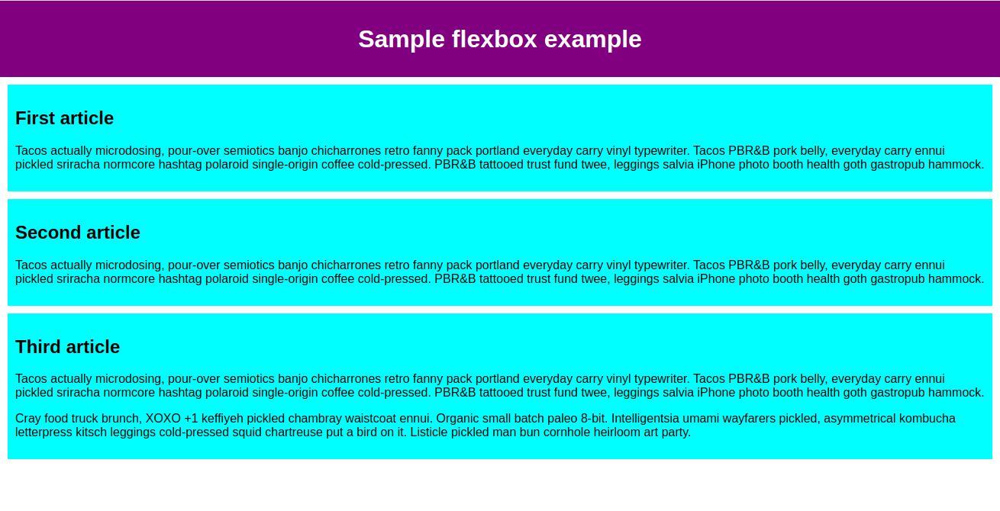

```toc

```

## 类型、类和 ID 选择器

```css
/*对html中所有的<h1>标签进行设定*/
h1

/*对html中所有的class=box进行设定*/
.box{}

/*对html中所有的id=unique进行设定*/
#unique{}
```

**全局选择器**
>全局选择器，是由一个星号（`*`）代指的，它选中了文档中的所有内容（或者是父元素中的所有内容，比如，它紧随在其他元素以及邻代运算符之后的时候）。

```css
/*选择器正选中`<article>`元素的_任何_第一子元素*/
article *:first-child {

}
```

**类选择器**

```html
<div class="notebox">
    This is an informational note.
</div>

<div class="notebox warning">
    This note shows a warning.
</div>

<div class="notebox danger">
    This note shows danger!
</div>

<div class="danger">
    This won't get styled — it also needs to have the notebox class
</div>
```

```css
.notebox {
  border: 4px solid #666;
  padding: .5em;
}

.notebox.warning {
  border-color: orange;
  font-weight: bold;
}

.notebox.danger {
  border-color: red;
  font-weight: bold;
}
```

这里主要是看下类有多个值时如何使用。同时第一个 `.notebox` 设置对样式对所有存在 `class="notebox"` 对元素都有效，但是如果后面再次设置，比如 `.notebox.warning` 时如果同样也设置了 `border` 属性，那么会将之前的设置进行覆盖。

**ID 选择器**

`ID` 选择器优先级大于所有其他选择器。如果不是唯一，可以指定某个标签

```html
<h1 id="heading">ID selector</h1>
<p>Veggies es bonus vobis, proinde vos postulo essum magis kohlrabi welsh onion daikon amaranth tatsoi tomatillo
    melon azuki bean garlic.</p>

<p id="one">Gumbo beet greens corn soko <strong>endive</strong> gumbo gourd. Parsley shallot courgette tatsoi pea sprouts fava bean collard
    greens dandelion okra wakame tomato. Dandelion cucumber earthnut pea peanut soko zucchini.</p>
```

```css
#one {
    background-color: yellow;
}
/*只针对h1标签中id为heading的元素*/
h1#heading {
    color: rebeccapurple;
}
```


## 标签属性选择器

```css
/*这组选择器根据一个元素上的某个标签的属性的存在以选择元素的不同方式*/
a[title]{}

/*根据一个有特定值的标签属性是否存在来选择*/
a[href="https://example.com"] { }
```

### 存否和值选择器

这些选择器允许基于一个元素自身是否存在（例如 `href`）或者基于各式不同的按属性值的匹配，来选取元素。

|选择器|示例|描述|
|-|-|-|
| `[attr]` | `a[title]` |匹配带有一个名为_attr_的属性的元素——方括号里的值。|
| `[attr=value]` | `a[href="https://example.com"]` |匹配带有一个名为_attr_的属性的元素，其值正好为_value_——引号中的字符串。|
| `[attr~=value]` | `p[class~="special"]` |匹配带有一个名为_attr_的属性的元素，其值正为_value_，或者匹配带有一个_attr_属性的元素，其值有一个或者更多，至少有一个和_value_匹配。注意，在一列中的好几个值，是用空格隔开的。|
| `[attr\|=value] ` | ` div[lang\|=zh] ` |匹配带有一个名为_attr_的属性的元素，其值可正好为_value_，或者开始为_value_，后面紧随着一个连字符。|
注意：最后一行的竖线进行了转义。

### 子字符串匹配选择器

这些选择器让更高级的属性的值的子字符串的匹配变得可行。例如，如果你有 `box-warning` 和 `box-error` 类，想把开头为“box-”字符串的每个物件都匹配上的话，你可以用 `[class^="box-"]` 来把它们两个都选中。

|选择器|示例|描述|
|-|-|-|
| `[attr^=value]` | `li[class^="box-"]` |匹配带有一个名为_attr_的属性的元素，其值开头为_value_子字符串。|
| `[attr$=value]` | `li[class$="-box"]` |匹配带有一个名为_attr_的属性的元素，其值结尾为_value_子字符串|
| `[attr*=value]` | `li[class*="box"]` |匹配带有一个名为_attr_的属性的元素，其值的字符串中的任何地方，至少出现了一次_value_子字符串。|

### 大小写敏感

如果你想在大小写不敏感的情况下，匹配属性值的话，你可以在闭合括号之前，使用 `i` 值。这个标记告诉浏览器，要以大小写不敏感的方式匹配 ASCII 字符。没有了这个标记的话，值会按照文档语言对大小写的处理方式，进行匹配——HTML 中是大小写敏感的。

```html
<h1>Case-insensitivity</h1>
<ul>
    <li class="a">Item 1</li>
    <li class="A">Item 2</li>
    <li class="Ab">Item 3</li>
</ul>
```


```css
li[class^="a"] {
    background-color: yellow;
}

li[class^="a" i] {
    color: red;
}
```

## 伪类与伪元素

```css
/*`:hover`伪类会在鼠标指针悬浮到一个元素上的时候选择这个元素*/
a:hover { }

/*还可以包含了伪元素，选择一个元素的某个部分而不是元素自己。例如，`::first-line`是会选择一个元素（下面的情况中是`<p>`）中的第一行，类似`<span>`包在了第一个被格式化的行外面，然后选择这个`<span>`。*/
p::first-line { }
```

伪类是选择器的一种，它用于选择处于特定状态的元素，比如当它们是这一类型的第一个元素时，或者是当鼠标指针悬浮在元素上面的时候。它们表现得会像是你向你的文档的某个部分应用了一个类一样，帮你在你的标记文本中减少多余的类，让你的代码更灵活、更易于维护。伪类就是开头为冒号的关键字。


### 伪元素是什么

伪元素以类似方式表现，不过表现得是像你往标记文本中加入全新的 HTML 元素一样，而不是向现有的元素上应用类。伪元素开头为双冒号 `::`

例如，如果你想选中一段的第一行，你可以把它用一个 `<span>` 元素包起来，然后使用元素选择器；不过，如果包起来的单词/字符数目长于或者短于父元素的宽度，这样做会失败。由于我们一般不会知道一行能放下多少单词/字符——因为屏幕宽度或者字体大小改变的时候这也会变——通过改变 HTML 的方式来可预测地这么做是不可能的。

`::first-line`伪元素选择器会值得信赖地做到这件事——即使单词/字符的数目改变，它也只会选中第一行。


### 把伪类和伪元素结合起来

如果你想让第一段的第一行加粗，你需要把 `:first-child` 和 `::first-line` 选择器放到一起。试着编辑前面的实时示例，让它使用下面的 CSS。这里的意思是，我们想选择一个 `<article>` 元素里面的第一个 `<p>` 元素的第一行。

```css
article p:first-child::first-line {
  font-size: 120%;
  font-weight: bold;
}
```

### 生成带有 `::before,::after` 的内容

有一组特别的伪元素，它们和 [`content`](https://developer.mozilla.org/zh-CN/docs/Web/CSS/content) 属性一同使用，使用 CSS 将内容插入到你的文档中中。

```html
<p class="box">Content in the box in my HTML page.</p>
```

```css
.box::before {
    content: "This should show before the other content. ";
} 
```

这里会在 html 中文本前面插入一段文本，但是一般也不这么做，这些伪元素的更推荐的用法是插入一个图标，例如下面的示例加入的一个小箭头，作为一个视觉性的提示，而且我们并不希望屏幕阅读器读出它。

这些伪元素经常用于插入空字符串，其后可以像页面上的其他元素被样式化。

下个示例，我们已经用 `::before`伪元素加入了个空字符串。我们把它设为了`display: block`，以让它可以用 width 和 height 进行样式化。然后我们可以用 CSS 像任何元素那样样式化。你可以摆弄 CSS，改变它的外观和行为。

```css
.box::before {
    content: "";
    display: block;
    width: 100px;
    height: 100px;
    background-color: rebeccapurple;
    border: 1px solid black;
} 
```

```html
<p class="box">Content in the box in my HTML page.</p>
```


### 伪类导航

|选择器|描述|示例|
|-|-|-|
| `:active` |在用户激活（例如点击）元素的时候匹配。|
| `:any-link` |匹配一个链接的`:link`和`:visited`状态。|
| `:blank` |匹配空输入值的[`<input>`元素](https://developer.mozilla.org/zh-CN/docs/Web/HTML/Element/input)。|
| `:checked` |匹配处于选中状态的单选或者复选框。|
| `:current` |匹配正在展示的元素，或者其上级元素。|如果你有一个导航菜单，并希望在用户点击导航链接时突出显示当前活动的链接|
| `:default` |匹配一组相似的元素中默认的一个或者更多的 UI 元素。|比如默认选中的选择框|
| `:dir` |基于其方向性（HTML [`dir`](https://developer.mozilla.org/zh-CN/docs/Web/HTML/Global_attributes/dir) 属性或者 CSS [`direction`](https://developer.mozilla.org/zh-CN/docs/Web/CSS/direction) 属性的值）匹配一个元素。| `:dir(ltr),:dir(rtl)` 文字显示从左到右或者从右到左 |
| `:disabled` |匹配处于关闭状态的用户界面元素|其实就是针对标签中使用 disabled 修饰的元素，也就是禁用，比如 `<input>` 如果使用此修饰，那么就无法输入 |
| `:empty` |匹配除了可能存在的空格外，没有子元素的元素。|
| `:enabled` |匹配处于开启状态的用户界面元素。|与 `:disabled` 相反，仅适用于 `<input>,<button>` 等 |
| `:first` |匹配[分页媒体](https://developer.mozilla.org/zh-CN/docs/Web/CSS/Paged_Media)的第一页。|
| `:first-child` |匹配兄弟元素中的第一个元素。|
| `:first-of-type` |匹配兄弟元素中第一个某种类型的元素。| `p:first-of-type { /* 应用于同级 <p> 元素中的第一个 <p> 元素的样式 */ }`|
| `:focus` |当一个元素有焦点的时候匹配。|
| `:focus-visible` |当元素有焦点，且焦点对用户可见的时候匹配。|`:focus-visible` 伪类选择器类似于 `:focus` 伪类选择器，它也选择当前获得焦点的元素。但与 `:focus` 不同的是，`:focus-visible` 只选择那些用户可以感知到的焦点元素。换句话说，它会忽略那些在用户界面中不可见的元素（例如通过键盘操作而不是鼠标操作获得焦点的元素）。|
| `focus-within` |匹配有焦点的元素，以及子代元素有焦点的元素。|
| `future(en-US)` |匹配当前元素之后的元素。|
| `:hover` |当用户悬浮到一个元素之上的时候匹配。|
| `:indeterminate` |匹配未定态值的 UI 元素，通常为[复选框](https://developer.mozilla.org/zh-CN/docs/Web/HTML/Element/input/checkbox)。| `input[type="checkbox"]:indeterminate { /* 应用于处于不确定状态的复选框的样式 */ }`|
| `:in-range` |用一个区间匹配元素，当值处于区间之内时匹配。|比如 `<input type="number" id="age" name="age" min="18" max="60">` 用此属性修饰可以达到输入正确的值才显示颜色|
| `:invalid` |匹配诸如 `<input>` 的位于不可用状态的元素。| `input[type="email"]:invalid { border-color: red; }` 对邮箱进行校验|
| `:lang` |基于语言（HTML[lang](https://developer.mozilla.org/zh-CN/docs/Web/HTML/Global_attributes/lang)属性的值）匹配元素。|
| `:last-child` |匹配兄弟元素中最末的那个元素。|
| `:last-of-type` |匹配兄弟元素中最后一个某种类型的元素。|
| `:left` |在[分页媒体 (en-US)](https://developer.mozilla.org/en-US/docs/Web/CSS/CSS_paged_media "Currently only available in English (US)")中，匹配左手边的页。|
| `:link` |匹配未曾访问的链接。|
| `:local-link(en-US)` |匹配指向和当前文档同一网站页面的链接。|
| `:is()` |匹配传入的选择器列表中的任何选择器。|
| `:not` |匹配作为值传入自身的选择器未匹配的物件。|
| `:nth-child` |匹配一列兄弟元素中的元素——兄弟元素按照_an+b_形式的式子进行匹配（比如 2n+1 匹配元素 1、3、5、7 等。即所有的奇数个）。|
| `:nth-of-type` |匹配某种类型的一列兄弟元素（比如，`<p>`元素）——兄弟元素按照_an+b_形式的式子进行匹配（比如 2n+1 匹配元素 1、3、5、7 等。即所有的奇数个）。|
| `:nth-last-child` |匹配一列兄弟元素，从后往前倒数。兄弟元素按照_an+b_形式的式子进行匹配（比如 2n+1 匹配按照顺序来的最后一个元素，然后往前两个，再往前两个，诸如此类。从后往前数的所有奇数个）。|从后往前数|
| `:nth-last-of-type` |匹配某种类型的一列兄弟元素（比如，`<p>`元素），从后往前倒数。兄弟元素按照_an+b_形式的式子进行匹配（比如 2n+1 匹配按照顺序来的最后一个元素，然后往前两个，再往前两个，诸如此类。从后往前数的所有奇数个）。|
| `:only-child` |匹配没有兄弟元素的元素。|
| `:only-of-type` |匹配兄弟元素中某类型仅有的元素。|
| `:optional` |匹配不是必填的 form 元素。|
| `:out-of-range` |按区间匹配元素，当值不在区间内的的时候匹配。|
| `:past(en-US)` |匹配当前元素之前的元素。|
| `:placeholder-shown` |匹配显示占位文字的 input 元素。|针对 `<input>,<textarea>`，比如当未选中时展示某种样式 |
| `:playing` |匹配代表音频、视频或者相似的能“播放”或者“暂停”的资源的，且正在“播放”的元素。|
| `:paused` |匹配代表音频、视频或者相似的能“播放”或者“暂停”的资源的，且正在“暂停”的元素。|
| `:read-only` |匹配用户不可更改的元素。|
| `:read-write` |匹配用户可更改的元素。|
| `:required` |匹配必填的 form 元素。|
| `:right` |在[分页媒体 (en-US)](https://developer.mozilla.org/en-US/docs/Web/CSS/CSS_paged_media "Currently only available in English (US)")中，匹配右手边的页。|
| `:root` |匹配文档的根元素。|
| `:scope` |匹配任何为参考点元素的的元素。|
| `:valid` |匹配诸如`<input>`元素的处于可用状态的元素。|
| `:target` |匹配当前 URL 目标的元素（例如如果它有一个匹配当前[URL 分段](https://en.wikipedia.org/wiki/Fragment_identifier)的元素）。|
| `:visited` |匹配已访问链接。|


相关例子：

**`:invalid`**
```html
<!DOCTYPE html>
<html>
<head>
  <style>
    input[type="email"]:invalid {
      border-color: green;
    }
    input[type="email"]:invalid::placeholder {
      color: red;
    }
  </style>
</head>
<body>
  <form>
    <label for="email">Email：</label>
    <input type="email" id="email" name="email" required placeholder="请输入有效的电子邮件地址">
    <button type="submit">提交</button>
  </form>
</body>
</html>
```
使用 `input[type="email"]:invalid` 选择器选择了类型为 `email` 并且无效的输入框，并将其边框颜色设置为红色。我们还使用 `::placeholder` 伪元素选择器来选择输入框中的占位符文本，并将其颜色也设置为红色，以提醒用户输入有效的电子邮件地址。

**`:is(selector) :not(selector)`**
```html
<!DOCTYPE html>
<html>
<head>
  <style>
    :is(h1, h2, h3) {
      color: red;
    }

    :is(.important, .highlight) {
      background-color: yellow;
    }

    :is(p:not(.special)) {
      font-style: italic;
    }
  </style>
</head>
<body>
  <h1>Title 1</h1>
  <h2>Title 2</h2>
  <h3>Title 3</h3>
  <p class="important">Important paragraph</p>
  <p class="highlight">Highlighted paragraph</p>
  <p class="special">Special paragraph</p>
  <p>Normal paragraph</p>
</body>
</html>
```

**`:nth-child()`**
```html
<!DOCTYPE html>
<html>
<head>
    <style>
        /* 选择第一个子元素 */
        li:nth-child(1) {
        color: red;
        }

        /* 选择偶数位置的子元素 */
        li:nth-child(even) {
        background-color: lightgray;
        }

        /* 选择3n+2位置的子元素 */
        li:nth-child(3n+2) {
        font-weight: bold;
        }
    </style>
</head>
<body>
    <ul>
        <li>Item 1</li>
        <li>Item 2</li>
        <li>Item 3</li>
        <li>Item 4</li>
        <li>Item 5</li>
    </ul>
</body>
</html>
```

需要注意的是，`:nth-child()` 选择器的计数是基于所有子元素，而不仅仅是相同类型的元素。因此，如果父元素中包含其他类型的元素（如文本节点或注释节点），它们也会被计算在内。

### 伪元素导航

|伪元素|描述|示例|
|-|-|-|
| `::before` |用于在元素内容前插入生成的内容。||
| `::after` |用于在元素内容后插入生成的内容。||
| `::first-letter` |用于选择元素内容的第一个字母或字。||
| `::first-line` |用于选择元素内容的第一行。||
| `::selection` |用于选择用户选中的文本部分。||
| `::placeholder` |用于选择输入框中的占位符文本。||
| `::marker` |用于选择列表项标记的部分。|就是选择某个选项时展示某种样式|
| `::backdrop` |用于选择全屏模式下的背景元素。|比如视频播放全屏时的背景色，但是注意兼容性|
| `::cue` |用于选择 `<audio>` 和 `<video>` 元素中的音频和视频提示。||
| `::slotted` |用于选择插入到 `<slot>` 元素中的内容。||

**`:before vs ::before`**
在 CSS 中，`:before` 和 `::before` 都是伪元素选择器，用于在元素的内容前插入生成的内容。

`::before` 是 CSS3 中引入的伪元素选择器的新语法，用两个冒号表示，例如 `::before`。它用于向目标元素的内容前插入生成的内容，可以通过 CSS 属性来设置生成的内容的样式。而 `:before` 时旧版中的伪元素写法，不推荐使用。

**`::selection`**

当使用 `::selection` 选择器时，可以为选中的文本设置样式。下面是一个使用 `::selection` 的例子：
```html
<head>
  <style>
    p::selection {
      background-color: yellow;
    }
  </style>
</head>
<body>
  <h1>示例文本</h1>
  <p>这是一段示例文本，当您在页面中选择时，将应用 ::selection 的样式。</p>
</body>
```

当选择文本时背景会变为黄色。

**`::placeholder`**

可以为表单元素的占位符文本设置样式。下面是一个使用 `::placeholder` 的例子：
```html
<head>
  <style>
    input::placeholder {
      color: red;
      font-style: italic;
    }
  </style>
</head>
<body>
  <input type="text" placeholder="请输入内容">
</body>
```
其实就是设置输入框的样式。不要和标签中的 placeholder 弄混，标签中是设置输入框中默认文本，一般是提示性文本。


## 关系选择器

### 后代选择器

```html
<div class="box"><p>Text in .box</p></div>
<p>Text not in .box</p>
```

```css
.box p {
    color: red;
}
```

这里只会匹配处于带有 `.box` 类的元素里面的 `<p>` 元素。


### 子代关系选择器

子代关系选择器是个大于号（`>`），只会在选择器选中直接子元素的时候匹配。继承关系上更远的后代则不会匹配。例如，只选中作为 `<article>` 的直接子元素的 `<p>` 元素：

```html
<ul>
    <li>Unordered item</li>
    <li>Unordered item
        <ol>
            <li>Item 1</li>
            <li>Item 2</li>
        </ol>
    </li>
</ul>
```

```css
ul > li {
    border-top: 5px solid red;
} 
```

这里只会选择 `<ul>` 的直接子代 `<li>` 进行设置，对于更远的子代则不会。

### 邻接兄弟

邻接兄弟选择器（`+`）用来选中恰好处于另一个在继承关系上同级的元素旁边的物件。例如，选中所有紧随 `<p>` 元素之后的 `` 元素：

```css
h1 + p {
    font-weight: bold;
    background-color: #333;
    color: #fff;
    padding: .5em;
}  
```

```html
<article>
    <h1>A heading</h1>
    <!--只会选择此<p>标签进行渲染-->
    <p>Veggies es bonus vobis, proinde vos postulo essum magis kohlrabi welsh onion daikon amaranth tatsoi tomatillo
            melon azuki bean garlic.</p>

    <p>Gumbo beet greens corn soko endive gumbo gourd. Parsley shallot courgette tatsoi pea sprouts fava bean collard
            greens dandelion okra wakame tomato. Dandelion cucumber earthnut pea peanut soko zucchini.</p>
</article>
```

### 通用兄弟

如果你想选中一个元素的兄弟元素，即使它们不直接相邻，你还是可以使用通用兄弟关系选择器（`~`）。要选中所有的 `<p>` 元素后_任何地方_的 `` 元素，我们会这样做：

```html
<article>
    <h1>A heading</h1>
    <p>I am a paragraph.</p>
    <div>I am a div</div>
    <p>I am another paragraph.</p>
</article>
```

```css
h1 ~ p {
    font-weight: bold;
    background-color: #333;
    color: #fff;
    padding: .5em;
}
```

### 使用关系选择器

你能用关系选择器，将任何在我们前面的学习过程中学到的选择器组合起来，选出你的文档中的一部分。例如如果我们想选中为 `<ul>` 的直接子元素的带有“a”类的列表项的话，我可以用下面的代码。

```css
ul > li[class="a"]  {  }
```


## 层叠与继承

### 冲突规则

CSS 代表**层叠样式表**（Cascading Style Sheets），理解第一个词*层叠*（cascade）很重要——层叠的表现方式是理解 CSS 的关键。

在某些时候，在做一个项目过程中你会发现一些应该产生效果的样式没有生效。通常的原因是你创建了两个应用于同一个元素的规则。与 [**层叠**](https://developer.mozilla.org/zh-CN/docs/Web/CSS/Cascade) 密切相关的概念是 [**优先级**（specificity）](https://developer.mozilla.org/zh-CN/docs/Web/CSS/Specificity)，决定在发生冲突的时候应该使用哪条规则。设计元素样式的规则可能不是期望的规则，因此需要了解这些机制是如何工作的。

这里也有 [**继承**](https://developer.mozilla.org/zh-CN/docs/Web/CSS/Inheritance) 的概念，也就是在默认情况下，一些 css 属性继承当前元素的父元素上设置的值，有些则不继承。这也可能导致一些和期望不同的结果。

### 层叠

样式表 [**层叠**](https://developer.mozilla.org/zh-CN/docs/Web/CSS/Cascade) ——简单的说，就是 CSS 规则的顺序很重要；当应用两条同级别的规则到一个元素的时候，写在后面的就是实际使用的规则。

```html
<h1>This is my heading.</h1>
```

```css
h1 { 
    color: red; 
}
h1 { 
    color: blue; 
}
```

这里最终展示的颜色是 blue

### 优先级

浏览器是根据[优先级](https://developer.mozilla.org/zh-CN/docs/Web/CSS/Specificity)来决定当多个规则有不同选择器对应相同的元素的时候需要使用哪个规则。它基本上是一个衡量选择器具体选择哪些区域的尺度：

- 一个元素选择器不是很具体，则会选择页面上该类型的所有元素，所以它的优先级就会低一些。
- 一个类选择器稍微具体点，则会选择该页面中有特定 `class` 属性值的元素，所以它的优先级就要高一点。

```html
<h1 class="main-heading">This is my heading.</h1>
```

```css
.main-heading { 
    color: red; 
}
        
h1 { 
    color: blue; 
}
```

这里最终会展示 red，因为使用 class 选择更为准确。


### 继承

继承也需要在上下文中去理解——一些设置在父元素上的 CSS 属性是可以被子元素继承的，有些则不能。

举一个例子，如果你设置一个元素的 `color` 和 `font-family`，每个在里面的元素也都会有相同的属性，除非你直接在元素上设置属性。

```html
<p>As the body has been set to have a color of blue this is inherited through the descendants.</p>
<p>We can change the color by targeting the element with a selector, such as this <span>span</span>.</p>
```

```css
body {
    color: blue;
}

span {
    color: black;
}
```

这里所有元素都继承了 body 的设置，但是 span 做了单独设置，则使用自己独有的设置。


### 理解继承

```html
<head>
    <style>
        .main {
            color: rebeccapurple;
            border: 2px solid #ccc;
            padding: 1em;
        }
        .special {
            color: red;
            font-weight: bold;
        }
    </style>
</head>
<body>
    <ul class="main">
        <li>Item One</li>
        <li>Item Two
            <ul>
                <li>2.1</li>
                <li>2.2</li>
            </ul>
        </li>
        <li>Item Three
            <ul class="special">
                <li>3.1
                    <ul>
                        <li>3.1.1</li>
                        <li>3.1.2</li>
                    </ul>
                </li>
                <li>3.2</li>
            </ul>
        </li>
    </ul>
</body>
```

像 `width`（上面提到的）、`margin`、`padding` 和 `border` 不会被继承。如果 border 可以被继承，每个列表和列表项都会获得一个边框——可能就不是我们想要的结果！

尽管每个 CSS 属性页都列出了属性是否被继承，但我们通常可以通过常识来判断哪些属性属于默认继承。

### 控制继承

CSS 为控制继承提供了五个特殊的通用属性值。每个 CSS 属性都可以接收这些值。

[`inherit`](https://developer.mozilla.org/zh-CN/docs/Web/CSS/inherit)
设置该属性会使子元素属性和父元素相同。实际上，就是“开启继承”。

[`initial`](https://developer.mozilla.org/zh-CN/docs/Web/CSS/initial)
将属性的值重置为默认值。通过将属性值设置为 `initial`，可以清除继承的值，将属性恢复为默认值。

[`revert`](https://developer.mozilla.org/en-US/docs/Web/CSS/revert "Currently only available in English (US)")
这个关键字用于将属性值恢复为继承的值（如果有的话），否则将其重置为默认值。`revert` 实际上是一个组合关键字，它会根据继承链上的最近的一个具有继承值的祖先元素来确定属性值。

[`revert-layer` (en-US)](https://developer.mozilla.org/en-US/docs/Web/CSS/revert-layer "Currently only available in English (US)")
这个关键字是 CSS Houdini 的一部分，目前尚未广泛支持。它类似于 `revert`，但与 `revert` 不同的是，`revert-layer` 可以在更细粒度的层次上控制继承值的恢复。

[`unset`](https://developer.mozilla.org/zh-CN/docs/Web/CSS/unset)
这个关键字组合了 `inherit`、`initial` 和 `revert` 的行为。它会根据属性是否有继承值来决定是继承还是重置为默认值。如果属性有继承值，则继承该值；如果没有继承值，则将属性重置为默认值。

```html
<head>
    <style>
        body {
            color: green;/*默认不会继承*/
        }
        .my-class-1 a {
            color: inherit;/*开启继承*/
        }
        .my-class-2 a {
            color: initial;/*初始值为黑色*/
        }
        .my-class-3 a {
            color: unset;
        }
    </style>
</head>
<body>
    <ul>
        <li>Default <a href="#">link</a> color</li>
        <li class="my-class-1">Inherit the <a href="#">link</a> color</li>
        <li class="my-class-2">Initial the <a href="#">link</a> color</li>
        <li class="my-class-3">Unset the <a href="#">link</a> color</li>
    </ul>
</body>
```


### 重置所有属性值

CSS 的简写属性 [`all`](https://developer.mozilla.org/zh-CN/docs/Web/CSS/all) 可以用于同时将这些继承值中的一个应用于（几乎）所有属性。它的值可以是其中任意一个（`inherit`、`initial`、`unset` 或 `revert`）。这是一种撤销对样式所做更改的简便方法，以便回到之前已知的起点。

可以使用 `all: unset;` 或者 `all: initial;`。这些属性将重置元素的所有属性到初始值或默认值。

使用`all: unset;`会将元素的所有属性值重置为初始值，并清除任何继承值或显式设置的值。

使用`all: initial;`会将元素的所有属性值重置为其默认值，这些默认值由浏览器规定。

下面是一个示例，展示如何重置元素的所有属性值：

```
.reset { all: unset; }

<div class="reset"> 
	<!-- 其他内容 --> 
</div>
```
通过将 `reset` 类应用到 `<div>` 元素，它的所有属性值都将被重置为初始值或默认值。

### 理解层叠

现在，我们将要了解层叠如何定义在不止一个元素的时候怎么应用 CSS 规则。有三个因素需要考虑，根据重要性排序如下，后面的更重要：

- 资源顺序
	我们已经看到了顺序对于层叠的重要性。如果你有超过一条规则，而且都是相同的权重，那么最后面的规则会应用。可以理解为后面的规则覆盖前面的规则，直到最后一个开始设置样式。
- 优先级
	你会发现在一些情况下，有些规则在最后出现，但是却应用了前面的具有冲突的规则。这是因为前面的有更高的**优先级**——它范围更小，因此浏览器就把它选择为元素的样式。就像前面看到的，类选择器的权重大于元素选择器，因此类上定义的属性将覆盖应用于元素上的属性。
	这里需要注意虽然我们考虑的是选择器，以及应用在选中对象上的规则，但不会覆盖所有规则，只覆盖相同的属性。这样可以避免重复的 CSS。一种常见的做法是给基本元素定义通用样式，然后给不同的元素创建对应的类。
- 重要程度

一个选择器的优先级可以说是由三个不同的值（或分量）相加，可以认为是百（ID）十（类）个（元素）——三位数的三个位数：

- **ID**：选择器中包含 ID 选择器则百位得一分。
- **类**：选择器中包含类选择器、属性选择器或者伪类则十位得一分。
- **元素**：选择器中包含元素、伪元素选择器则个位得一分。

|选择器|	ID|	类|	元素|	优先级|
|-|-|-|-|-|
| `h1` |	0|	0|	1|	0-0-1|
| `h1 + p::first-letter` |	0|	0|	3|	0-0-3|
| `li > a[href*="en-US"] > .inline-warning` |	0|	2|	2|	0-2-2|
| `#identifier` |	1|	0|	0|	1-0-0|
| `button:not(#mainBtn, .cta)` |	1|	0|	1|	1-0-1|

### 内联样式

内联样式，即 [`style`](https://developer.mozilla.org/zh-CN/docs/Web/HTML/Global_attributes#style) 属性内的样式声明，优先于所有普通的样式，无论其优先级如何。这样的声明没有选择器，但它们的优先级可以理解为 1-0-0-0；即无论选择器中有多少个 ID，它总是比其他任何优先级的权重都要高。

## 盒模型

在 CSS 中我们广泛地使用两种“盒子” —— **块级盒子** (**block box**) 和 **内联盒子** (**inline box**)。这两种盒子会在**页面流**（page flow）和元素之间的关系方面表现出不同的行为：

块级元素（Block-level Elements）是指以块的形式显示的元素，它们会独占一行或一块区域，垂直排列。常见的块级元素有 `<div>、<p>、<h1>~<h6>、<ul>、<ol>、<li>、<header>、<footer>` 等。块级元素可以设置宽度、高度、内外边距以及其他样式属性，并且会在水平方向上填满其父容器的可用空间。

内联元素（Inline Elements）是指以行内的形式显示的元素，它们不会独占一行，可以在同一行内显示多个元素。常见的内联元素有 `<span>、<a>、<strong>、<em>、、<input>` 等。内联元素通常只占据其内容所需要的空间，并且不会破坏文本的流动性。内联元素的宽度和高度无法直接设置，但可以通过其他属性（如 padding、margin）间接影响其尺寸。

在 CSS 盒模型中，块级元素和内联元素都是由一个或多个盒子组成的。块级元素会生成一个块级盒子（Block Box），它会独占一行并填满父容器的宽度。内联元素会生成一个内联盒子（Inline Box），它会根据内容的大小自动调整宽度，并可以与其他内联盒子在同一行内显示。

需要注意的是，CSS 中的块级元素和内联元素的分类是基于默认的显示属性（display property）来确定的。通过设置元素的 `display` 属性，我们可以改变元素的显示方式，使其在视觉上表现为块级元素或内联元素。例如，将 `<div>` 元素的 `display` 属性设置为 `inline` 可以使其变为内联元素。

如果将一个内联元素的 display 设置为 block，那么同样可以设置其长度和宽度。

### block 模型

CSS 中组成一个块级盒子需要：

- **Content box**: 这个区域是用来显示内容，大小可以通过设置 [`width`](https://developer.mozilla.org/zh-CN/docs/Web/CSS/width) 和 [`height`](https://developer.mozilla.org/zh-CN/docs/Web/CSS/height).
- **Padding box**: 包围在内容区域外部的空白区域；大小通过 [`padding`](https://developer.mozilla.org/zh-CN/docs/Web/CSS/padding) 相关属性设置。
- **Border box**: 边框盒包裹内容和内边距。大小通过 [`border`](https://developer.mozilla.org/zh-CN/docs/Web/CSS/border) 相关属性设置。
- **Margin box**: 这是最外面的区域，是盒子和其他元素之间的空白区域。大小通过 [`margin`](https://developer.mozilla.org/zh-CN/docs/Web/CSS/margin) 相关属性设置。

如下图：


在标准模型中，如果你给盒设置 `width` 和 `height`，实际设置的是 _content box_。padding 和 border 再加上设置的宽高一起决定整个盒子的大小。

假设定义了 `width`, `height`, `margin`, `border`, and `padding`:

```css
.box {
  width: 350px;
  height: 150px;
  margin: 25px;
  padding: 25px;
  border: 5px solid black;
}
```

如果使用标准模型，实际占用空间的宽高分别为：宽度 = 410px (350 + 25 + 25 + 5 + 5)，高度 = 210px (150 + 25 + 25 + 5 + 5)。

### 外边距，内边距，边框

#### 外边距-`margin`

外边距是盒子周围一圈看不到的空间。它会把其他元素从盒子旁边推开。外边距属性值可以为正也可以为负。设置负值会导致和其他内容重叠。无论使用标准模型还是替代模型，外边距总是在计算可见部分后额外添加。

我们可以使用 [`margin`](https://developer.mozilla.org/zh-CN/docs/Web/CSS/margin) 属性一次控制一个元素的所有边距，或者每边单独使用等价的普通属性控制：
- [`margin-top`](https://developer.mozilla.org/zh-CN/docs/Web/CSS/margin-top)
- [`margin-right`](https://developer.mozilla.org/zh-CN/docs/Web/CSS/margin-right)
- [`margin-bottom`](https://developer.mozilla.org/zh-CN/docs/Web/CSS/margin-bottom)
- [`margin-left`](https://developer.mozilla.org/zh-CN/docs/Web/CSS/margin-left)

`margin` 属性可以接受多个值，用于设置元素的上、右、下、左四个方向的外边距。常用的写法包括：

- `margin: 10px;`：设置所有方向的外边距为 10 像素。
- `margin: 10px 20px;`：设置上下外边距为 10 像素，左右外边距为 20 像素。
- `margin: 10px 20px 30px;`：设置上外边距为 10 像素，左右外边距为 20 像素，下外边距为 30 像素。
- `margin: 10px 20px 30px 40px;`：设置上外边距为 10 像素，右外边距为 20 像素，下外边距为 30 像素，左外边距为 40 像素。

此外，还可以使用以下特殊值来设置外边距：

- `auto`：自动计算外边距，通常用于居中元素。
- `inherit`：继承父元素的外边距值。
- `initial`：将外边距重置为初始值。
- `unset`：将外边距重置为继承或初始值。


```html
<!DOCTYPE html>
<html>
<head>
    <style>
        .box {
            width: 200px;
            height: 200px;
            background-color: red;
            margin: 50px;
        }
        .negative-margin {
            background-color: green;
            margin-top: -60px;
            margin-left: -30px;
        }
    </style>
</head>
<body>
    <div class="box">正常盒子</div>
    <div class="box negative-margin">使用负边距</div>
</body>
</html>
```

具体的布局


#### 外边距折叠

如果你有两个外边距相接的元素，这些外边距将合并为一个外边距，即最大的单个外边距的大小。

在下面的例子中，我们有两个段落。顶部段落的页 `margin-bottom`为 50px。第二段的`margin-top` 为 30px。因为外边距折叠的概念，所以框之间的实际外边距是 50px，而不是两个外边距的总和。


```html
<head>
    <style>
        .one {
            margin-bottom: 50px;
        }

        .two {
            margin-top: 30px;
        }
    </style>
</head>

<body>
    <div class="container">
        <p class="one">I am paragraph one.</p>
        <p class="two">I am paragraph two.</p>
    </div>
</body>
```

其实就是第一个段落的下外边距和第二个段落的上外边距折叠为一个，其大小为 `50px`，而不是 `80px=50px+30px`。


#### 边框- `border`

^96aaeb

可以使用 [`border`](https://developer.mozilla.org/zh-CN/docs/Web/CSS/border) 属性一次设置所有四个边框的宽度、颜色和样式。

分别设置每边的宽度、颜色和样式，可以使用：

- [`border-top`](https://developer.mozilla.org/zh-CN/docs/Web/CSS/border-top)
- [`border-right`](https://developer.mozilla.org/zh-CN/docs/Web/CSS/border-right)
- [`border-bottom`](https://developer.mozilla.org/zh-CN/docs/Web/CSS/border-bottom)
- [`border-left`](https://developer.mozilla.org/zh-CN/docs/Web/CSS/border-left)

设置所有边的颜色、样式或宽度，请使用以下属性：

- [`border-width`](https://developer.mozilla.org/zh-CN/docs/Web/CSS/border-width)
- [`border-style`](https://developer.mozilla.org/zh-CN/docs/Web/CSS/border-style)
- [`border-color`](https://developer.mozilla.org/zh-CN/docs/Web/CSS/border-color)

设置单边的颜色、样式或宽度，可以使用最细粒度的普通属性之一：

- [`border-top-width`](https://developer.mozilla.org/zh-CN/docs/Web/CSS/border-top-width)
- [`border-top-style`](https://developer.mozilla.org/zh-CN/docs/Web/CSS/border-top-style)
- [`border-top-color`](https://developer.mozilla.org/zh-CN/docs/Web/CSS/border-top-color)
- [`border-right-width`](https://developer.mozilla.org/zh-CN/docs/Web/CSS/border-right-width)
- [`border-right-style`](https://developer.mozilla.org/zh-CN/docs/Web/CSS/border-right-style)
- [`border-right-color`](https://developer.mozilla.org/zh-CN/docs/Web/CSS/border-right-color)
- [`border-bottom-width`](https://developer.mozilla.org/zh-CN/docs/Web/CSS/border-bottom-width)
- [`border-bottom-style`](https://developer.mozilla.org/zh-CN/docs/Web/CSS/border-bottom-style)
- [`border-bottom-color`](https://developer.mozilla.org/zh-CN/docs/Web/CSS/border-bottom-color)
- [`border-left-width`](https://developer.mozilla.org/zh-CN/docs/Web/CSS/border-left-width)
- [`border-left-style`](https://developer.mozilla.org/zh-CN/docs/Web/CSS/border-left-style)
- [`border-left-color`](https://developer.mozilla.org/zh-CN/docs/Web/CSS/border-left-color)

相关属性都比较好理解，这里主要看下 `border-style` 的取值：

- `none`：没有边框，不显示边框线。
- `solid`：实线边框，边框以实线形式显示。
- `dashed`：虚线边框，边框以虚线形式显示。
- `dotted`：点线边框，边框以点线形式显示。
- `double`：双线边框，边框以两条线重叠显示。
- `groove`：凹槽边框，边框呈现为凹陷的外观。
- `ridge`：脊状边框，边框呈现为凸起的外观。
- `inset`：内凹边框，边框呈现为内凹的外观。
- `outset`：外凸边框，边框呈现为外凸的外观。

几个例子

```css
.box{
	/*width, style, color*/
	border: 2px solid green;
}

.box{
	/*top right bottom left*/
	border-style: solid dashed dotted double;
	/*四个值：下,右,下,左*/
	/*三个值：下,右左,下*/
	/*两个值：上下,左右*/
}
```

#### 内边距-`padding`

内边距位于边框和内容区域之间。与外边距不同，您不能有负数量的内边距，所以值必须是 0 或正的值。应用于元素的任何背景都将显示在内边距后面，内边距通常用于将内容推离边框。

可以使用 [`padding`](https://developer.mozilla.org/zh-CN/docs/Web/CSS/padding) 简写属性控制元素所有边，或者每边单独使用等价的普通属性：

- [`padding-top`](https://developer.mozilla.org/zh-CN/docs/Web/CSS/padding-top)
- [`padding-right`](https://developer.mozilla.org/zh-CN/docs/Web/CSS/padding-right)
- [`padding-bottom`](https://developer.mozilla.org/zh-CN/docs/Web/CSS/padding-bottom)
- [`padding-left`](https://developer.mozilla.org/zh-CN/docs/Web/CSS/padding-left)


### inline 模型

Inline box（内联盒子）是 CSS 中一种常见的盒子类型，用于包含内联元素或匿名内联文本。Inline box 沿着文本流方向水平排列，并根据内容的大小自动调整其宽度和高度。

内联元素（如 `<span>`、`<a>`、`<em>` 等）默认生成 inline box。Inline box 的特点包括：

1. 宽度由内容决定：Inline box 的宽度通常由内容的长度决定，会自动调整以适应内容的大小。它不会强制换行，而是在一行上连续显示，直到遇到换行符或强制换行的 CSS 属性。
2. 高度由行高决定：Inline box 的高度由行高（line height）属性决定。它会根据行高属性将内容垂直居中对齐。
3. 水平排列：Inline box 沿着文本流方向水平排列，从左到右或从右到左，具体取决于文本方向的设置。
4. 不独占一行：多个 Inline box 可以在同一行上连续显示，它们会自动根据内容的大小进行布局，直到一行放不下为止。

可以通过 CSS 的 `display` 属性来控制元素的盒子类型，将块级元素转换为内联盒子，例如 `display: inline;`。这样就可以改变元素的布局行为，使其在一行上水平排列。

比如下面的例子

```html
<!DOCTYPE html>
<html>
<head>
    <style>
        span {
            margin: 20px;
            padding: 20px;
            width: 80px;
            height: 50px;
            background-color: lightblue;
            border: 2px solid blue;
        }
    </style>
</head>
<body>
    <p>
        I am a paragraph and this is a <span>span-xxxxxxxxxxxxxx</span> inside that paragraph. A span is an inline element and so does
        not
        respect width and height.
    </p>
</body>
</html>
```

这里当修改 `<span>` 中内容长度时其整体宽度也会跟着增加，同时会和第二行有一定的重叠，但是还是和其他内容在一行之中。

### 使用 `display:inline-block `

display 有一个特殊的值，它在内联和块之间提供了一个中间状态。这对于以下情况非常有用：您不希望一个项切换到新行，但希望它可以设定宽度和高度，并避免上面看到的重叠。

一个元素使用 `display: inline-block`，实现我们需要的块级的部分效果：

- 设置`width` 和`height` 属性会生效。
- `padding`, `margin`, 以及`border` 会推开其他元素。

但是，它不会跳转到新行，如果显式添加 `width` 和 `height` 属性，它只会变得比其内容更大。

如果我们对上面的例子进行设置，此时其宽度和高度就是固定的了，如果内容过长，可能会超出。

适用于以下场景：

1. 水平排列的块级元素：`inline-block` 允许块级元素在同一行上水平排列。这在创建导航菜单、工具栏、按钮组等水平布局的元素时非常有用。
2. 图片和文字的组合：`inline-block` 可以让图片和文字在同一行上显示，方便创建图文混排的效果，比如新闻列表、产品展示等。
3. 等宽容器：`inline-block` 允许多个元素以等宽的方式排列，比如创建网格布局、瀑布流布局等。
4. 表单元素布局：`inline-block` 可以用于水平布局表单元素，例如将表单字段和对应的标签放在同一行上，使布局更紧凑。
5. 替代浮动布局：在过去，浮动布局常用于创建多列布局。而现在，`inline-block` 可以替代浮动布局的使用，提供更简洁、可控制的多列布局方案。

总的来说，`inline-block` 适用于需要在行内显示块级元素，并且需要控制元素尺寸、位置、水平排列等情况。

### display

CSS 的 `display` 属性有多种取值，用于指定元素的显示方式。以下是一些常见的取值：

- `block`：生成块级盒子，元素独占一行，并可以设置宽度、高度等属性。
- `inline`：生成内联盒子，元素在同一行内显示，并根据内容自动调整宽度和高度。
- `inline-block`：结合了`inline`和`block`的特性，元素在同一行内显示，并可以设置宽度、高度等属性。
- `none`：元素不显示，并且在布局中不占据空间，用于控制元素的显示与隐藏。会使元素完全从渲染树中移除，包括其子元素和后代元素。这意味着元素的所有样式和布局属性都不会应用，也不会触发任何与显示相关的事件。相当于元素在页面中完全不存在。
- `flex`：启用弹性布局，元素可以按照弹性盒模型的规则进行布局。
- `grid`：启用网格布局，元素可以按照网格布局的规则进行布局。
- `table`：将元素作为表格显示，包括表格行、表格单元格等。
- `inline-table`：将元素作为内联表格显示。以表格的结构呈现，并在行内显示，类似于内联元素。它的表现方式类似于`inline-block`，但具有表格特性。与普通的`display: table;`不同，`inline-table`允许表格元素在一行内显示，而不会独占一行。
- `table-cell`：将元素作为表格单元格显示。
- `table-row`：将元素作为表格行显示。
- `list-item`：将元素作为列表项显示。这个不推荐


### flex 布局

`flex` 是 CSS 中的一个属性，用于创建灵活的布局容器。它是 Flexbox 布局模型的核心属性之一。

Flexbox 布局模型是一种用于在容器中对子元素进行弹性布局的方法。通过在容器上设置 `display: flex`，可以创建一个 Flex 容器，并在其中使用 `flex` 属性来定义子元素的布局行为。

主要的概念和特性包括：

1. Flex 容器：通过将容器元素的 `display` 设置为 `flex`，将其变为 Flex 容器。
2. Flex 项目：容器中的每个子元素都被称为 Flex 项目，它们通过 `flex` 属性来控制其在容器内的布局行为。
3. 主轴和交叉轴：Flex 布局是一个二维布局模型，其中包含一个主轴和一个交叉轴。默认情况下，主轴是水平方向，交叉轴是垂直方向。
4. Flex 容器属性：通过设置 Flex 容器上的属性，如 `flex-direction`、`justify-content`、`align-items` 等，可以控制 Flex 项目在容器内的排列方式、对齐方式等。
5. Flex 项目属性：通过设置 Flex 项目上的属性，如 `flex-grow`、`flex-shrink`、`flex-basis` 等，可以控制 Flex 项目在容器内的伸缩比例、初始大小等。

通过灵活使用 `flex` 属性以及其他与 Flexbox 相关的属性，可以实现各种复杂的布局效果，如水平居中、垂直居中、等宽布局、自适应布局等。


### grid 网格布局

`display: grid` 是 CSS 中的一个属性，用于创建网格布局。它是 CSS Grid 布局模型的核心属性之一。

CSS Grid 布局模型是一种二维布局系统，允许开发者将网页内容划分为行和列，以创建复杂的布局结构。通过在容器上设置 `display: grid`，将其变为 Grid 容器，并使用 `grid-template-columns`、`grid-template-rows`、`grid-gap` 等属性来定义网格的结构和间距。

主要的概念和特性包括：

1. Grid 容器：通过将容器元素的 `display` 设置为 `grid`，将其变为 Grid 容器。
2. 网格行和列：Grid 容器中的行和列是网格的基本单元，可以使用 `grid-template-columns` 和 `grid-template-rows` 属性来定义它们的大小和数量。
3. 网格单元格：网格中的每个单元格是一个网格项，可以使用 `grid-column` 和 `grid-row` 属性来指定它们所占据的行和列。
4. 网格线：网格线是网格的分隔线，可以使用 `grid-gap` 属性来定义网格行和列之间的间距。
5. 自动布局：Grid 布局提供了自动布局的能力，可以使用 `grid-auto-columns` 和 `grid-auto-rows` 属性来定义在没有显式指定的情况下，网格项所占据的行和列的大小。


```html
<!DOCTYPE html>
<html>
<head>
    <style>
        .grid-container {
            display: grid;
            /* 定义三列，每列宽度为相等的一份 */
            grid-template-columns: repeat(3, 1fr);
            /* 设置行和列之间的间距 */
            grid-gap: 30px;
        }

        .grid-item {
            background-color: #ddd;
            padding: 50px;/*内边距，元素内容和边框之间的空间*/
            text-align: center;/*文本居中*/
        }
    </style>
</head>
<body>
    <div class="grid-container">
        <div class="grid-item">1</div>
        <div class="grid-item">2</div>
        <div class="grid-item">3</div>
        <div class="grid-item">4</div>
        <div class="grid-item">5</div>
        <div class="grid-item">6</div>
    </div>
</body>
</html>
```

这里相关元素就会展示成网格样式。这里要注意的是 padding 表示元素内容与内边框之间的距离为 50px，但是要注意：元素内容本身也是要占用一定空间的，虽然显示为矩形，但是距离上下左右内边框的距离确实都是 50px。


### table 布局

`display: table` 和 `display: grid` 是两种不同的布局方式。

`display: table`用于创建表格布局，它基于HTML表格元素（`<table>`, `<tr>`, `<td>`, 等等）。使用`display: table`时，元素会按照表格的结构进行布局，有行和列的概念，并且具有表格特有的性质，如单元格合并、自动调整列宽等。表格布局适合用于展示数据的结构化呈现，如数据表、日历等。

`display: grid`则是一种强大的网格布局系统，通过将元素划分为行和列的网格单元来布局页面。网格布局提供了更灵活的布局方式，可以自定义网格单元的大小、位置和间距，以实现各种复杂的布局需求。网格布局适用于构建各种类型的布局，包括响应式布局、多列布局、平铺式布局等。

主要区别如下：

- 表格布局（`display: table`）是基于表格元素的布局方式，而网格布局（`display: grid`）是一种更灵活的网格系统。
- 表格布局适合用于展示结构化数据，网格布局适合用于构建各种布局需求。
- 网格布局提供了更灵活的控制网格单元的大小、位置和间距的能力，而表格布局的单元格尺寸和位置由浏览器自动调整。

`display: table-cell` 和 `display: table-row` 是用于创建表格布局的两个关键属性。

- `display: table-cell` 用于定义表格中的单元格。将元素设置为 `display: table-cell` 后，它会表现得像一个表格单元格，具有表格单元格的特性。它会自动根据表格布局进行调整，包括自动调整宽度、高度、垂直对齐等。可以通过设置单元格的样式来调整单元格的外观，如背景颜色、边框等。
    
- `display: table-row` 用于定义表格中的行。将元素设置为 `display: table-row` 后，它会表现得像一行，具有表格行的特性。在行内可以包含多个单元格元素（`display: table-cell`），这些单元格会按照表格的结构进行布局。行的高度会根据其中单元格的高度自动调整。
    

这两个属性通常与 `display: table` 结合使用，用于创建表格布局。通过将元素设置为 `display: table`，然后在内部使用 `display: table-row` 和 `display: table-cell`，可以创建具有表格结构的布局。这样的布局具有表格的特性，包括自动调整单元格大小、自动调整行高度等。

需要注意的是，表格布局是一种相对传统的布局方式，而现代的网页布局往往使用更灵活的方法，如使用 `flexbox` 或 `grid` 布局。表格布局主要适用于需要展示结构化数据的情况，而在一般的页面布局中，更推荐使用其他布局方式。


```html
<!DOCTYPE html>
<html>
<head>
    <style>
        .table {
            display: table;
        }

        .table-row {
            display: table-row;
            background-color: green;
        }

        .table-cell {
            display: table-cell;
            padding: 10px;
            border: 1px solid red;
        }
    </style>
</head>
<body>
    <div class="table">
        <div class="table-row">
            <div class="table-cell">Cell 1</div>
            <div class="table-cell">Cell 2</div>
            <div class="table-cell">Cell 3</div>
        </div>
        <div class="table-row">
            <div class="table-cell">Cell 4</div>
            <div class="table-cell">Cell 5</div>
            <div class="table-cell">Cell 6</div>
        </div>
    </div>

</body>
</html>
```

## 背景与边框

	### 背景颜色- `backgroud-color`

[`background-color`](https://developer.mozilla.org/zh-CN/docs/Web/CSS/background-color) 属性定义了 CSS 中任何元素的背景颜色。属性接受任何有效的 [`<color>`](https://developer.mozilla.org/zh-CN/docs/Web/CSS/color_value) 值。`background-color` 背景色填充的区域包括元素的内容区域、内边距区域和边框区域。

```html
<div class="box">
  <h2>Background Colors</h2>
  <p>Try changing the background <span>colors</span>.</p>
</div>
```

```css
.box {
  background-color: #567895;
}

h2 {
  background-color: black;
  color: white;/*字体颜色*/
}
span {
  background-color: rgba(255,255,255,.5);
}
```

以下是一些示例用法：

```css
/* 使用预定义颜色名称 */
div {
  background-color: red;
}

/* 使用十六进制颜色值 */
div {
  background-color: #FF0000;
}

/* 使用 RGB 颜色值 */
div {
  background-color: rgb(255, 0, 0);
}

/* 使用 RGBA 颜色值 */
div {
  background-color: rgba(255, 0, 0, 0.5);
}
```

这里 RGBA 颜色中的 A 表示透明度，取值 0～1 之间。

### 背景图片- `background-image`

`background-image` 是 CSS 中用于设置元素背景图像的属性。通过 `background-image` 可以指定一个或多个图像作为元素的背景。

#### 使用相对路径或绝对路径指定图像的 URL：

```css
background-image: url("path/to/image.jpg");
background-image: url("https://example.com/image.jpg");
```

- 使用 `linear-gradient()` 或 `radial-gradient()` 创建渐变背景：

```css
background-image: linear-gradient(to right, red, blue);
background-image: radial-gradient(circle, red, blue);
```

有两种主要的渐变色函数可供使用：`linear-gradient()` 和 `radial-gradient()`。
1. 线性渐变（`linear-gradient()`）：线性渐变创建一个从一种颜色到另一种颜色的平滑过渡。

```css
.element {
  background-image: linear-gradient(direction, color-stop1, color-stop2, ...);
}
```
其中：

- `direction` 表示渐变的方向，可以使用角度值（如 `45deg`）、关键词（如 `to right`）或关键词组合（如 `to top left`）来指定。
- `color-stop` 是颜色的位置和值。可以使用百分比、像素值或关键词（如 `top`、`left`、`center`）来指定位置，然后后面跟上具体的颜色值。

例如，创建从上到下的红色到蓝色的线性渐变背景：

```css
.element {
  background-image: linear-gradient(to bottom, red, blue);
}
```

2. 径向渐变（`radial-gradient()`）：径向渐变创建一个以一个点为中心，向外辐射的颜色过渡。

```css
.element {
  background-image: radial-gradient(shape size at position, start-color, ..., last-color);
}
```

其中：
- `shape size` 表示渐变的形状和大小，可以使用关键词（如 `circle`、`ellipse`）或长度值（如 `10px`、`50%`）来指定。
- `at position` 表示渐变的中心位置，可以使用关键词（如 `top`、`left`、`center`）或坐标值（如 `10px 20px`）来指定。
- `start-color` 和 `last-color` 是颜色过渡的起始颜色和最终颜色。


#### 使用多个图像叠加，通过逗号分隔：

```css
background-image: url("image1.jpg"), url("image2.jpg");
```

这样可以使得所有图片从上到下叠加在一起，但是一般可以调整每个图片所占的空间以及位置。

#### 图片与 box 大小匹配- `background-repeat`

如果背景图片的尺寸比原本的盒子大，那么图片会被裁剪以适应盒子的大小。只会显示盒子内部与图片尺寸相匹配的部分，超出盒子范围的部分将被隐藏。

如果背景图片的尺寸比原本的盒子小，那么图片将会被重复平铺以填充整个盒子。重复方式可以通过 `background-repeat` 属性进行控制，常见的选项有：

- `repeat`：默认值，横向和纵向都重复平铺图片。
- `repeat-x`：仅在横向上重复平铺图片。
- `repeat-y`：仅在纵向上重复平铺图片。
- `no-repeat`：不重复平铺图片，只显示一次。

#### 图片大小和位置- `background-position/size`

每个背景图片的位置、尺寸和重复方式分别由 `background-position`、`background-size` 和 `background-repeat` 属性来控制。

- `background-position` 属性用于指定每个背景图片的位置。可以使用关键词（如 `top`、`left`、`center`）或具体的像素值或百分比值来指定位置。
- `background-size` 属性用于指定每个背景图片的尺寸。可以使用关键词（如 `auto` `cover`、`contain`）或具体的像素值或百分比值来指定尺寸。

通过调整每个背景图片的位置、尺寸和重复方式，可以创建出不同的叠加效果，从而实现更丰富多样的背景样式。

注意：
- `auto`：默认值，保持图像原始尺寸。
- `cover`：浏览器将使图像足够大，使它完全覆盖了盒子区域，同时仍然保持其宽高比。在这种情况下，图像的部分区域可能会跳出盒子外。
- `contain`：浏览器会将图像调整到适合框内的尺寸。在这种情况下，如果图像的长宽比与盒子的长宽比不同，你可能会在图像的两边或顶部和底部出现空隙。

以下是常用的 `background-position` 值及其说明：

1. 关键词值：
    - `left`：将背景图片靠左对齐。
    - `center`：将背景图片水平和垂直方向上居中对齐。
    - `right`：将背景图片靠右对齐。
    - `top`：将背景图片靠顶部对齐。
    - `bottom`：将背景图片靠底部对齐。
2. 百分比值：
    - 使用百分比值可以相对于背景区域的宽度和高度来定位背景图片。例如，`background-position: 50% 50%;` 将背景图片水平和垂直方向上居中对齐。
3. 像素值：
    - 使用像素值可以精确地指定背景图片*相对于背景区域*的位置。例如，`background-position: 10px 20px;` 将背景图片向右移动 10 像素，向下移动 20 像素。
4. 组合值：
    - 可以将水平方向和垂直方向的位置值组合在一起，以指定背景图片的具体位置。例如，`background-position: left top;` 将背景图片靠左对齐、靠顶部对齐。
5. 多背景定位：
    - 如果设置了多个背景图片，可以使用逗号分隔的值来为每个背景图片指定不同的位置。例如，`background-position: top left, center, bottom right;` 分别指定了三个背景图片的位置。

注意：一般设置的顺序是水平方向，垂直方向。

### 背景附加- `background-attachment`

这是用 [`background-attachment`](https://developer.mozilla.org/zh-CN/docs/Web/CSS/background-attachment) 属性控制的，它可以取以下值：

- `scroll`：默认值。使元素的背景在页面滚动时滚动。如果滚动了元素内容，则背景不会移动。实际上，背景被固定在页面的相同位置，所以它会随着页面的滚动而滚动。
- `fixed`：使元素的背景固定在视口上，这样当页面或元素内容滚动时，它就不会滚动。它将始终保持在屏幕上相同的位置。
- `local`：背景图像会随着元素的内容滚动而滚动。这意味着当元素内部的内容滚动时，背景图像也会随之滚动，而不受页面滚动的影响。

[`background-attachment`](https://developer.mozilla.org/zh-CN/docs/Web/CSS/background-attachment) 属性只有在有内容要滚动时才会有效果。

### background 简写

`background` 是一个用于简化设置背景相关属性的缩写属性。它可以同时设置 `background-color`、`background-image`、`background-repeat`、`background-position`、`background-size`、`background-attachment` 这些属性的值。

一般顺序为

```css
background: [color] [image] [repeat] [attachment] [position] / [size];
```

但是不是强制的，如

```css
.box {
  background: linear-gradient(
        105deg,
        rgba(255, 255, 255, 0.2) 39%,
        rgba(51, 56, 57, 1) 96%
      ) center center / 400px 200px no-repeat, url(big-star.png) center
      no-repeat, rebeccapurple;/*最后一个是color*/
}
```

### 边框

基本用法之前有说明过

![[2.css基础#^96aaeb]]

#### 圆角- `border-radius`

圆角可以应用于元素的四个角，使其呈现圆形或椭圆形的外观。

`border-radius` 属性接受一个或多个值，用于指定不同角的圆角大小。常见的用法包括：

- 单个值：指定所有四个角的圆角大小，创建一个等半径的圆角。
- 两个值：第一个值指定左上角和右下角的圆角大小，第二个值指定右上角和左下角的圆角大小，创建一个椭圆形的圆角。
- 四个值：分别指定左上角、右上角、右下角和左下角的圆角大小，可以创建不同大小的圆角。

例如：

```css
border-radius: 10px; /* 创建一个等半径的圆角 */
border-radius: 10px 20px; /* 创建一个椭圆形的圆角 */
border-radius: 10px 20px 30px 40px; /* 创建不同大小的圆角 */
```

此外，还可以使用 `border-top-left-radius`、`border-top-right-radius`、`border-bottom-right-radius` 和 `border-bottom-left-radius` 分别设置单独的角的圆角大小。

## 文本方向- `writing-mode`

`writing-mode` 属性用于控制文本的书写方向和排列方式。它决定了文本是水平排列还是垂直排列，以及文本的方向是从左到右还是从右到左。

`writing-mode` 属性可以接受以下值：

1. `horizontal-tb`：默认值，表示文本从左到右水平排列，从上到下垂直排列。
2. `vertical-rl`：表示文本从上到下垂直排列，从右到左水平排列。
3. `vertical-lr`：表示文本从上到下垂直排列，从左到右水平排列。
4. `sideways-rl`：表示文本以垂直方向从右到左倾斜排列。
5. `sideways-lr`：表示文本以垂直方向从左到右倾斜排列。

## 溢出的内容- `overflow`

`overflow` 属性用于控制当内容超出其容器尺寸时的显示和处理方式。它可以应用于包含块（容器）的元素。

`overflow` 属性有以下几个可能的取值：

1. `visible`：默认值。内容超出容器时会显示在容器之外。
2. `hidden`：超出容器的内容会被裁剪隐藏，不显示在容器之外。
3. `scroll`：如果内容超出容器，会显示滚动条以便查看被裁剪的内容。
4. `auto`：自动决定是否显示滚动条。如果内容超出容器，则显示滚动条；否则，不显示滚动条。

可以通过将 `overflow` 应用于容器元素来控制其内容的溢出行为。这对于限制内容的显示范围、创建可滚动区域等非常有用。


## 值和单位

#### 数字、长度和百分比

你可能会发现自己在 CSS 中使用了各种数值数据类型。以下全部归类为数值：

|数值类型|描述|
|-|-|
| `<integer>` |	`<integer>` 是一个整数，比如 1024 或 -55。|
| `<number>` |	`<number>` 表示一个小数——它可能有小数点后面的部分，也可能没有，例如 0.255、128 或 -1.2。|
| `<dimension>` |	`<dimension>` 是一个 `<number>` 它有一个附加的单位，例如 45 deg、5 s 或 10 px。`<dimension>` 是一个伞形类别，包括 `<length>`、`<angle>`、`<time>` 和 `<resolution>` 类型。|
| `<percentage>` |	`<percentage>` 表示一些其他值的一部分，例如 50%。百分比值总是相对于另一个量。例如，一个元素的长度相对于其父元素的长度。|

#### 绝对长度单位和相对长度单位

绝对长度单位常用的就是 `px:像素`。相对长度单位常用的就是 `em`，表示在 [font-size](https://developer.mozilla.org/zh-CN/docs/Web/CSS/font-size) 中使用是相对于父元素的字体大小，在其他属性中使用是相对于自身的字体大小，如 [width]( https://developer.mozilla.org/zh-CN/docs/ Web/CSS/width) 。还有就是 `rem`，表示根元素字体大小。

在 CSS 中，`em` 和 `rem` 是用于指定长度单位的相对单位。

- `em` 单位是相对于元素的字体大小。如果一个元素的字体大小为 16px，那么 `1em` 等于 16px，`2em` 等于 32px，以此类推。当应用于除字体大小以外的属性时，`em` 单位相对于元素的字体大小计算。
- `rem` 单位是相对于根元素（通常是 `<html>` 元素）的字体大小。根元素的字体大小默认为 16px，因此 `1rem` 等于 16px，`2rem` 等于 32px，以此类推。与 `em` 不同，`rem` 单位在整个文档中具有一致的值。

相对单位（如 `em` 和 `rem`）的优势在于它们能够根据上下文进行自适应调整，使得在不同屏幕尺寸或调整字体大小的情况下能够更好地适应布局。使用相对单位可以提高响应性和可维护性。

需要注意的是，使用 `em` 和 `rem` 单位时，应该考虑父元素的字体大小对子元素的影响，特别是对于嵌套的元素。

#### 百分比

具体来说，使用百分比单位可以在以下情况下指定尺寸或属性值：

1. 相对于父元素的尺寸：例如，如果一个元素的宽度设置为 `50%`，那么它的宽度将相对于其父元素的宽度来计算。如果父元素的宽度为 200px，那么这个元素的宽度就会是 100px。
2. 相对于包含块的尺寸：在一些情况下，元素的尺寸可能相对于包含块来计算。例如，如果一个元素的高度设置为 `50%`，并且它的包含块是一个具有固定高度的容器，那么这个元素的高度将是包含块高度的一半。
3. 相对于其他属性值的计算：有些属性值可以接受百分比单位来进行计算。例如，`padding` 属性和 `margin` 属性中的百分比值可以相对于元素的宽度进行计算。

#### 数字

有些值接受数字，不添加任何单位。接受无单位数字的属性的一个例子是不透明度属性（`opacity`），它控制元素的不透明度（它的透明程度）。此属性接受 `0`（完全透明）和 `1`（完全不透明）之间的数字。

在颜色中可以表示 16 进制数字颜色。

#### HSL 和 HSLA 值

HSL 模型中的三个分量表示：

1. 色调（Hue）：它表示颜色的种类或类型，可以理解为在色轮上的位置，取值范围为 0 到 360 度，其中 0 和 360 表示红色，120 表示绿色，240 表示蓝色，以此类推。
2. 饱和度（Saturation）：它表示颜色的鲜艳程度或纯度，取值范围为 0% 到 100%，其中 0% 表示灰色，100% 表示最鲜艳的颜色。
3. 亮度（Lightness）：它表示颜色的明暗程度，取值范围为 0% 到 100%，其中 0% 表示黑色，100% 表示白色。

HSLA 与 HSL 模型类似，只是多了一个 Alpha 通道，用于表示颜色的透明度。Alpha 通道的取值范围为 0 到 1，其中 0 表示完全透明，1 表示完全不透明。


## 函数

在 CSS 中，有多种内置函数可以用于处理属性值。以下是一些常见的 CSS 函数：

-  `rgb()` 和 `rgba()`：用于设置颜色值，可以指定红、绿、蓝和透明度通道的值。如 `rgba(red, green, blue, 0.1)`
- `hsl()` 和 `hsla()`：用于设置颜色值，可以指定色调、饱和度、亮度和透明度通道的值。如 `hsla(120, 60%, 70%, 0.5)`
-  `url()`：用于设置背景图像或其他资源的 URL。
-  `calc()`：用于进行简单的数学计算，例如计算盒模型的宽度或高度。如 `calc(12px + 2rem)`
-  `var()`：用于使用 CSS 变量，允许在多个样式规则中共享和动态更新值。
```css
:root {
  /*设置一个变量*/
  --primary-color: blue;
}
body {
  color: var(--primary-color, red);/*red是默认值*/
}
```

-  `attr()`：用于获取 HTML 元素的属性值，并将其作为 CSS 属性的值。

```html
<style>
  .custom-element::before {
    content: attr(data-content);
  }
</style>
<div class="custom-element" data-content="Hello, World!"></div>
```

-  `linear-gradient()` 和 `radial-gradient()`：用于创建线性渐变和径向渐变的背景图像。
-  `min()` 和 `max()`：用于选择属性值的最小或最大值。
-  `clamp()`：用于限制属性值的范围，将其限制在最小值和最大值之间。语法上，`clamp()` 函数的格式如下：`clamp(min, preferred, max)`。`clamp(200px, 50%, 500px);` 表示将元素的宽度限制在 200px 和 500px 之间。如果可用空间足够，元素的宽度将尽可能地接近首选值 50%。如果可用空间不足，元素的宽度将被调整为最小值 200px。
-  `rotate()`、`scale()`、`translate()` 和 `skew()`：用于变换元素的旋转、缩放、平移和倾斜。
	`rotate(angle)`：将元素按给定角度旋转。角度可以是正数表示顺时针旋转，负数表示逆时针旋转。例如：`rotate(45deg)` 表示顺时针旋转 45 度。
	`scale(x, y)`：按给定的比例缩放元素的大小。参数 `x` 和 `y` 分别表示水平和垂直方向的缩放比例。例如：`scale(2, 1.5)` 表示水平方向放大为原来的 2 倍，垂直方向放大为原来的 1.5 倍。
	`translate(x, y)`：将元素沿着水平和垂直方向移动给定的距离。参数 `x` 和 `y` 分别表示水平和垂直方向的移动距离。例如：`translate(50px, -20px)` 表示向右移动 50 像素，向上移动 20 像素。
	`skew(x-angle, y-angle)`：按给定角度进行元素的斜切变形。参数 `x-angle` 和 `y-angle` 分别表示水平和垂直方向的斜切角度。例如：`skew(20deg, -10deg)` 表示水平方向斜切 20 度，垂直方向斜切 -10 度。不推荐使用。
-  `box-shadow()`：用于添加盒子阴影效果。
-  `text-shadow()`：用于添加文本阴影效果。
-  `transform()`：用于应用 2D 或 3D 变换效果，如旋转、缩放、平移等。
-  `transition()`：用于定义 CSS 过渡效果，实现属性值的平滑过渡。
- `animation()`：用于创建 CSS 动画效果，可以定义关键帧和动画属性。
- `filter()`：用于对元素应用图像滤镜效果，如模糊、饱和度、对比度调整等。
- `counter()` 和 `counters()`：用于定义和操作 CSS 计数器，用于生成序号。

## 调整大小

在 CSS 中，你可以使用以下属性来调整元素的大小：

1. `width`：设置元素的宽度。可以使用像素（px）、百分比（%）、视窗单位（vw）等作为单位。
2. `height`：设置元素的高度。同样可以使用像素、百分比、视窗单位等作为单位。
3. `max-width`：设置元素的最大宽度。可以防止元素的宽度超过指定的最大值。
4. `max-height`：设置元素的最大高度。可以防止元素的高度超过指定的最大值。
5. `min-width`：设置元素的最小宽度。可以确保元素的宽度不会小于指定的最小值。
6. `min-height`：设置元素的最小高度。可以确保元素的高度不会小于指定的最小值。

这里要注意的是，如果使用百分比时的基准是什么，对于一个处于另外一个容器当中的盒子，如果你给予了子盒子一个百分数作为宽度，那么它指的是父容器宽度的百分数。**当然还可以通过视口单位来设置，`vh` 和 `vw` 单位是相对于视口的尺寸，而不是相对于父元素或其他元素的尺寸。**

```css
.element {
  width: 30vw;
  height: 50vh;
}
```

这将使元素的宽度为视口宽度的30%，高度为视口高度的50%。注意：这里不是相对于父元素的大小了。

## 排版

### 弹性盒子

先给出一个例子

```html
<!DOCTYPE html>
<html lang="en-us">

<head>
    <meta charset="utf-8">
    <meta name="viewport" content="width=device-width">
    <title>Flexbox 0 — starting code</title>
    <style>
        html {
            font-family: sans-serif;
        }

        body {
            margin: 0;
        }

        header {
            background: purple;
            height: 100px;
        }

        h1 {
            text-align: center;
            color: white;
            line-height: 100px;
            margin: 0;
        }

        article {
            padding: 10px;
            margin: 2px;
            background: aqua;
        }
    </style>
</head>

<body>
    <header>
        <h1>Sample flexbox example</h1>
    </header>

    <section>
        <article>
            <h2>First article</h2>

            <p>Tacos actually microdosing, pour-over semiotics banjo chicharrones retro fanny pack portland everyday
                carry vinyl typewriter. Tacos PBR&B pork belly, everyday carry ennui pickled sriracha normcore hashtag
                polaroid single-origin coffee cold-pressed. PBR&B tattooed trust fund twee, leggings salvia iPhone photo
                booth health goth gastropub hammock.</p>
        </article>

        <article>
            <h2>Second article</h2>

            <p>Tacos actually microdosing, pour-over semiotics banjo chicharrones retro fanny pack portland everyday
                carry vinyl typewriter. Tacos PBR&B pork belly, everyday carry ennui pickled sriracha normcore hashtag
                polaroid single-origin coffee cold-pressed. PBR&B tattooed trust fund twee, leggings salvia iPhone photo
                booth health goth gastropub hammock.</p>
        </article>

        <article>
            <h2>Third article</h2>

            <p>Tacos actually microdosing, pour-over semiotics banjo chicharrones retro fanny pack portland everyday
                carry vinyl typewriter. Tacos PBR&B pork belly, everyday carry ennui pickled sriracha normcore hashtag
                polaroid single-origin coffee cold-pressed. PBR&B tattooed trust fund twee, leggings salvia iPhone photo
                booth health goth gastropub hammock.</p>

            <p>Cray food truck brunch, XOXO +1 keffiyeh pickled chambray waistcoat ennui. Organic small batch paleo
                8-bit. Intelligentsia umami wayfarers pickled, asymmetrical kombucha letterpress kitsch leggings
                cold-pressed squid chartreuse put a bird on it. Listicle pickled man bun cornhole heirloom art party.
            </p>
        </article>
    </section>
</body>
</html>
```



这种就是一种最普通的流式排版。此时指定布局为 flexible 形式

```css
section {
	display: flex;
}
```


多列布局具有大小相等的列，并且列的高度都是一样。可以理解为一种自适应的布局，如果我们将其中的文本删除一些，每个 section 占据的大小也就不一样了。

### flex 模型


- **主轴**（main axis）是沿着 flex 元素放置的方向延伸的轴（比如页面上的横向的行、纵向的列）。该轴的开始和结束被称为 **main start** 和 **main end**。
- **交叉轴**（cross axis）是垂直于 flex 元素放置方向的轴。该轴的开始和结束被称为 **cross start** 和 **cross end**。
- 设置了 `display: flex` 的父元素（在本例中是 [`<section>`](https://developer.mozilla.org/zh-CN/docs/Web/HTML/Element/section)）被称之为 **flex 容器（flex container）。**
- 在 flex 容器中表现为弹性的盒子的元素被称之为 **flex 项**（**flex item**）（本例中是 [`<article>`](https://developer.mozilla.org/zh-CN/docs/Web/HTML/Element/article) 元素。

### `flex-direciton`

此属性用于指定主轴的方向，默认是 row，也就是从左往右自适应。

### `flex-wrap`

对于上面的例子来说，如果 seciton 太多时，就可能超过页面大小，需要使用滑轮查看，可以使用

```css
flex-wrap: wrap;
```
进行折行。当然也可以直接指定每个 section 占据的宽度

```css
flex: 200px;
```

### `flex-flow` 缩写

可以将
```css
flex-direction: row;
flex-wrap: wrap;
```

替换为

```css
flex-flow: row wrap;
```

### flex 项的动态尺寸

修改
```css
section {
	display: flex;
}

article {
	padding: 10px;
	margin: 10px;
	background: aqua;
	flex: 1;
}

article:nth-of-type(3) {
	flex: 2;
}
```

这里对 article 设置了
```css
flex: 1;
```

这表示每个元素占用空间都是相等的，占用的空间是在设置 padding 和 margin 之后剩余的空间。因为它是一个比例，这意味着将每个 flex 项的设置为 400000 的效果和 1 的时候是完全一样的。

而后面的

```css
article:nth-of-type(3) {
	flex: 2;
}
```

现在当你刷新，你会看到第三个 [`<article>`](https://developer.mozilla.org/zh-CN/docs/Web/HTML/Element/article) 元素占用了两倍的可用宽度和剩下的一样——现在总共有四个比例单位可用。也就是前面两个 section 占据页面的 1/4，剩下的 section 占据 1/2。

还可以指定 flex 的最小值

```css
article {
  flex: 1 200px;
}

article:nth-of-type(3) {
  flex: 2 200px;
}
```

也就是先分配 200px，剩下的按比例分配。、

其实 `flex:1;` 这种设定是一种简写

1. `flex-grow`（弹性增长因子）：定义了弹性项目相对于其他项目在弹性容器中可以增长的比例。这个值是一个无单位的数字，表示当有额外空间时，项目应该占用的可用空间的比例。例如，如果所有弹性项目的 `flex-grow` 值都是1，它们将平均分配可用空间。如果一个项目的 `flex-grow` 值是2，而另一个项目的值是1，那么第一个项目在有额外空间时将占用比第二个项目多一倍的空间。
    
2. `flex-shrink`（弹性收缩因子）：定义了弹性项目相对于其他项目在弹性容器中可以收缩的比例。这个值也是一个无单位的数字，表示当空间不足时，项目应该收缩的比例。如果所有弹性项目的`flex-shrink`值都是1，它们将按比例收缩以适应容器。如果一个项目的`flex-shrink`值是2，而另一个项目的值是1，那么第一个项目在空间不足时将以比第二个项目多一倍的比例收缩。
    
3. `flex-basis`（弹性基准值）：定义了弹性项目在未进行任何弹性增长或收缩之前的初始大小。它可以是一个长度值（如像素或百分比），也可以是`auto`表示由项目的内容决定。
    

### 水平和垂直对齐

例子

```html
<!DOCTYPE html>
<html lang="en-us">

<head>
    <meta charset="utf-8">
    <meta name="viewport" content="width=device-width">
    <title>Flexbox align 0 — starting code</title>
    <style>
        html {
            font-family: sans-serif;
        }

        body {
            width: 70%;
            max-width: 960px;
            margin: 20px auto;
        }

        button {
            font-size: 18px;
            line-height: 1.5;
            width: 15%;
        }

        div {
            height: 100px;
            border: 1px solid black;
        }

    </style>
</head>

<body>
    <div>
        <button>Smile</button>
        <button>Laugh</button>
        <button>Wink</button>
        <button>Shrug</button>
        <button>Blush</button>
    </div>
</body>

</html>
```

这里相关的 button 排列是从左上角开始排列。此时进行布局设置

```css
div {
	height: 100px;
	border: 1px solid black;
	display: flex;
	align-items: center;
	justify-content: space-around;
}
```

此时按钮就居中排列

[`align-items`](https://developer.mozilla.org/zh-CN/docs/Web/CSS/align-items) 控制 flex 项在交叉轴上的位置。

- 默认的值是 `stretch`，其会使所有 flex 项沿着交叉轴的方向拉伸以填充父容器。如果父容器在交叉轴方向上没有固定宽度（即高度），则所有 flex 项将变得与最长的 flex 项一样长（即高度保持一致）。我们的第一个例子在默认情况下得到相等的高度的列的原因。
- 在上面规则中我们使用的 `center` 值会使这些项保持其原有的高度，但是会在交叉轴居中。这就是那些按钮垂直居中的原因。
- 你也可以设置诸如 `flex-start` 或 `flex-end` 这样使 flex 项在交叉轴的开始或结束处对齐所有的值。查看 [`align-items`](https://developer.mozilla.org/zh-CN/docs/Web/CSS/align-items) 了解更多。

你可以用 [`align-self`](https://developer.mozilla.org/zh-CN/docs/Web/CSS/align-self) 属性覆盖 [`align-items`](https://developer.mozilla.org/zh-CN/docs/Web/CSS/align-items) 的行为。比如，你可以这样：

```css
button:first-child {
  align-self: flex-end;
}
```

这样第一个 button 就排到最后了。

[`justify-content`](https://developer.mozilla.org/zh-CN/docs/Web/CSS/justify-content) 控制 flex 项在主轴上的位置。

- 默认值是 `flex-start`，这会使所有 flex 项都位于主轴的开始处。
- 你也可以用 `flex-end` 来让 flex 项到结尾处。
- `center` 在 `justify-content` 里也是可用的，可以让 flex 项在主轴居中。
- 而我们上面用到的值 `space-around` 是很有用的——它会使所有 flex 项沿着主轴均匀地分布，在任意一端都会留有一点空间。如果是 center 就会并排在一起，不留空隙。
- 还有一个值是 `space-between`，它和 `space-around` 非常相似，只是它不会在两端留下任何空间。

### flex 项排序

弹性盒子也有可以改变 flex 项的布局位置的功能，而不会影响到源顺序（即 dom 树里元素的顺序）。这也是传统布局方式很难做到的一点。

```css
button:first-child{
	order: 1;
}
```

刷新下，然后你会看到“Smile”按钮移动到了主轴的末尾。下面我们谈下它实现的一些细节：

- 所有 flex 项默认的 [`order`](https://developer.mozilla.org/zh-CN/docs/Web/CSS/order) 值是 0。
- order 值大的 flex 项比 order 值小的在显示顺序中更靠后。
- 相同 order 值的 flex 项按源顺序显示。所以假如你有四个元素，其 order 值分别是 2，1，1 和 0，那么它们的显示顺序就分别是第四，第二，第三，和第一。
- 第三个元素显示在第二个后面是因为它们的 order 值一样，且第三个元素在源顺序中排在第二个后面。

你也可以给 order 设置负值使它们比值为 0 的元素排得更前面。比如，你可以设置“Blush”按钮排在主轴的最前面：

```css
button:last-child {
  order: -1;
}
```

### flex 嵌套

```html
<!DOCTYPE html>
<html lang="en-us">
  <head>
    <meta charset="utf-8">
    <meta name="viewport" content="width=device-width">
    <title>Complex flexbox example</title>
    <style>
      html {
        font-family: sans-serif;
      }

      body {
        margin: 0;
      }

      header {
        background: purple;
        height: 100px;
      }

      h1 {
        text-align: center;
        color: white;
        line-height: 100px;
        margin: 0;
      }

      article {
        padding: 10px;
        margin: 10px;
        background: aqua;
      }

      /* Add your flexbox CSS below here */

      section {
        display: flex;
      }

      article {
        flex: 1 200px;
      }

      article:nth-of-type(3) {
        flex: 3 200px;
        display: flex;
        flex-flow: column;
      }

      article:nth-of-type(3) div:first-child {
        flex: 1 100px;
        display: flex;
        flex-flow: row wrap;
        align-items: center;
        justify-content: space-around;
      }

      button {
        flex: 1 auto;
        margin: 5px;
        font-size: 18px;
        line-height: 1.5;
      }
      
    </style>
  </head>
  <body>
    <header>
      <h1>Complex flexbox example</h1>
    </header>

    <section>
      <article>
        <h2>First article</h2>

        <p>Tacos actually microdosing, pour-over semiotics banjo chicharrones retro fanny pack portland everyday carry vinyl typewriter. Tacos PBR&B pork belly, everyday carry ennui pickled sriracha normcore hashtag polaroid single-origin coffee cold-pressed. PBR&B tattooed trust fund twee, leggings salvia iPhone photo booth health goth gastropub hammock.</p>
      </article>

      <article>
        <h2>Second article</h2>

        <p>Tacos actually microdosing, pour-over semiotics banjo chicharrones retro fanny pack portland everyday carry vinyl typewriter. Tacos PBR&B pork belly, everyday carry ennui pickled sriracha normcore hashtag polaroid single-origin coffee cold-pressed. PBR&B tattooed trust fund twee, leggings salvia iPhone photo booth health goth gastropub hammock.</p>
      </article>

      <article>
        <div>
          <button>Smile</button>
          <button>Laugh</button>
          <button>Wink</button>
          <button>Shrug</button>
          <button>Blush</button>
        </div>
        <div>
          <p>Tacos actually microdosing, pour-over semiotics banjo chicharrones retro fanny pack portland everyday carry vinyl typewriter. Tacos PBR&B pork belly, everyday carry ennui pickled sriracha normcore hashtag polaroid single-origin coffee cold-pressed. PBR&B tattooed trust fund twee, leggings salvia iPhone photo booth health goth gastropub hammock.</p>
        </div>
        <div>
          <p>Cray food truck brunch, XOXO +1 keffiyeh pickled chambray waistcoat ennui. Organic small batch paleo 8-bit. Intelligentsia umami wayfarers pickled, asymmetrical kombucha letterpress kitsch leggings cold-pressed squid chartreuse put a bird on it. Listicle pickled man bun cornhole heirloom art party.</p>
        </div>
      </article>
    </section>
  </body>
</html>
```

弹性盒子也能创建一些颇为复杂的布局。设置一个元素为 flex 项，那么他同样成为一个 flex 容器，它的孩子（直接子节点）也表现为弹性盒子。
