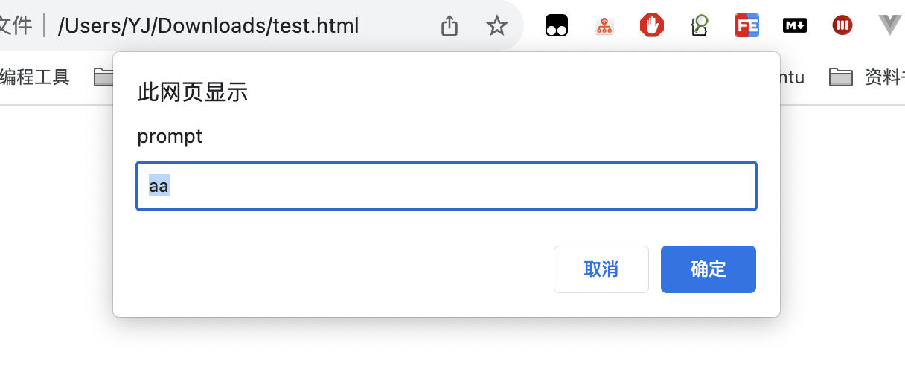

```toc
```

## 变量声明

一般有三种声明方式 `let, const, var`，推荐第一种方式。

### `var` 没有块级作用域

用 `var` 声明的变量，不是函数作用域就是全局作用域。它们在代码块外也是可见的（译注：也就是说，`var` 声明的变量只有函数作用域和全局作用域，没有块级作用域）。

```js
if (true) {
  var test = true; // 使用 "var" 而不是 "let"
}

alert(test); // true，变量在 if 结束后仍存在
```

### `var` 允许重新声明

如果我们用 let 在同一作用域下将同一个变量声明两次，则会出现错误：

```js
let user;
let user; // SyntaxError: 'user' has already been declared
```

使用 `var`，我们可以重复声明一个变量，不管多少次都行。如果我们对一个已经声明的变量使用 `var`，这条新的声明语句会被忽略：

```js
var user = "Pete";
var user = "John"; // 这个 "var" 无效（因为变量已经声明过了）
// ……不会触发错误
alert(user); // John
```

### `var` 声明的变量，可以在其声明语句前被使用

当函数开始的时候，就会处理 `var` 声明（脚本启动对应全局变量）。

换言之，`var` 声明的变量会在函数开头被定义，与它在代码中定义的位置无关（这里不考虑定义在嵌套函数中的情况）。

```js
function sayHi() {
  phrase = "Hello";
  alert(phrase);
  var phrase;
}
sayHi();
```

人们将这种行为称为“提升”（英文为 “hoisting” 或 “raising”），因为所有的 `var` 都被“提升”到了函数的顶部。虽然声明被提升了，但是赋值却不会。

```js
function sayHi() {
  alert(phrase);
  var phrase = "Hello";
}
sayHi();
```

声明在函数刚开始执行的时候（“提升”）就被处理了，但是赋值操作始终是在它出现的地方才起作用。所以这段代码实际上是这样工作的：

```js
function sayHi() {
  var phrase; // 在函数刚开始时进行变量声明
  alert(phrase); // undefined
  phrase = "Hello"; // ……赋值 — 当程序执行到这一行时。
}
sayHi();
```

因为所有的 `var` 声明都是在函数开头处理的，我们可以在任何地方引用它们。但是在它们被赋值之前都是 undefined。

### 命名

JavaScript 的变量命名有两个限制：
1. 变量名称必须仅包含字母、数字、符号 `$` 和 `_`。
2. 首字符必须非数字。

### 常量

```js
const myBirthday = '18.04.1982';
```

## 数据类型

在 JavaScript 中有 8 种基本的数据类型（注：7 种原始类型和 1 种引用类型）。
我们可以将任何类型的值存入变量。例如，一个变量可以在前一刻是个字符串，下一刻就存储一个数字：

```js
// 没有错误
let message = "hello";
message = 123456;
```

允许这种操作的编程语言，例如 JavaScript，被称为“动态类型”（dynamically typed）的编程语言，意思是虽然编程语言中有不同的数据类型，但是你定义的变量并不会在定义后，被限制为某一数据类型。

### Number 类型

```js
let n = 123;
n = 12.345;
```

_number_ 类型代表整数和浮点数。

数字可以有很多操作，比如，乘法 `*`、除法 `/`、加法 `+`、减法 `-`等等。除了常规的数字，还包括所谓的“特殊数值（“special numeric values”）”也属于这种类型：`Infinity`、`-Infinity`和 `NaN`。

-  `Infinity` 代表数学概念中的 [无穷大](https://en.wikipedia.org/wiki/Infinity) ∞。是一个比任何数字都大的特殊值。我们可以通过除以 0 来得到它：

```js
alert( 1 / 0 ); // Infinity
```

	或者在代码中直接使用它：

```js
Alert ( Infinity ); // Infinity
```

- NaN 代表一个计算错误。它是一个不正确的或者一个未定义的数学操作所得到的结果，比如：

```js
Alert ( "not a number" / 2 ); // NaN，这样的除法是错误的
```

NaN 是粘性的。任何对 NaN 的进一步数学运算都会返回 NaN：

```js
Alert ( NaN + 1 ); // NaN
Alert ( 3 * NaN ); // NaN
Alert ( "not a number" / 2 - 1 ); // NaN
```

所以，如果在数学表达式中有一个 NaN，会被传播到最终结果（只有一个例外：NaN ** 0 结果为 1）。


### BigInt 类型

在 JavaScript 中，“number” 类型无法安全地表示大于 `(253-1)`（即 `9007199254740991`），或小于 `-(253-1)` 的整数。

在大多数情况下，`±(253-1)` 范围就足够了，但有时候我们需要整个范围非常大的整数，例如用于密码学或微秒精度的时间戳。

`BigInt` 类型是最近被添加到 JavaScript 语言中的，用于表示任意长度的整数。

可以通过将 `n` 附加到整数字段的末尾来创建 `BigInt` 值。

```js
// 尾部的 "n" 表示这是一个 BigInt 类型
const bigInt = 1234567890123456789012345678901234567890n;
```


### String 类型

AvaScript 中的字符串必须被括在引号里。

```js
Let str = "Hello";
Let str 2 = 'Single quotes are ok too';
let phrase = `can embed another ${str}`;
```

在 JavaScript 中，有三种包含字符串的方式。

双引号："Hello".
单引号：'Hello'.
反引号：`Hello`.
双引号和单引号都是“简单”引用，在 JavaScript 中两者几乎没有什么差别。

反引号是功能扩展引号。它们允许我们通过将变量和表达式包装在 ${…} 中，来将它们嵌入到字符串中。例如：

```js
let name = "John";

// 嵌入一个变量
alert( `Hello, ${name}!` ); // Hello, John!

// 嵌入一个表达式
alert( `the result is ${1 + 2}` ); // the result is 3
```

`${…}` 内的表达式会被计算，计算结果会成为字符串的一部分。可以在 `${…}` 内放置任何东西：诸如名为 `name` 的变量，或者诸如 `1 + 2` 的算数表达式，或者其他一些更复杂的。

### Boolean 类型

boolean 类型仅包含两个值：`true` 和 `false`。

### null 值

特殊的 null 值不属于上述任何一种类型。它构成了一个独立的类型，只包含 null 值：

```js
Let age = null;
```

相比较于其他编程语言，JavaScript 中的 null 不是一个“对不存在的 object 的引用”或者 “null 指针”。

JavaScript 中的 null 仅仅是一个代表“无”、“空”或“值未知”的特殊值。上面的代码表示 age 是未知的。

### undefined 值

特殊值 undefined 和 null 一样自成类型。Undefined 的含义是未被赋值。如果一个变量已被声明，但未被赋值，那么它的值就是 undefined：

```js
Let age;

Alert (age); // 弹出 "undefined"
```

从技术上讲，可以显式地将 undefined 赋值给变量：

```js
Let age = 100;

// 将值修改为 undefined
Age = undefined;

Alert (age); // "undefined"
```
但是不建议这样做。

### Object 和 Symbol 类型

`object` 类型是一个特殊的类型。

其他所有的数据类型都被称为“原始类型”，因为它们的值只包含一个单独的内容（字符串、数字或者其他）。相反，`object` 则用于储存数据集合和更复杂的实体。

因为它非常重要，所以我们对其进行单独讲解。在充分学习了原始类型后，我们将会在 [对象](https://zh.javascript.info/object) 一章中介绍 `object`。

`symbol` 类型用于创建对象的唯一标识符。我们在这里提到 `symbol` 类型是为了完整性，但我们要在学完 `object` 类型后再学习它。

### typeof 运算符

`typeof` 运算符返回参数的类型。当我们想要分别处理不同类型值的时候，或者想快速进行数据类型检验时，非常有用。

对 `typeof x` 的调用会以字符串的形式返回数据类型：

```js
typeof undefined // "undefined"
typeof 0 // "number"
typeof 10n // "bigint"
typeof true // "boolean"
typeof "foo" // "string"
typeof Symbol("id") // "symbol"
typeof Math // "object"  (1)
typeof null // "object"  (2)
typeof alert // "function"  (3)
```

## 交互：alert、prompt 和 confirm

alert 会在页面弹出一个小窗口

Prompt 函数接收两个参数：

```js
let title = "prompt";
let default = "aa";
result = prompt (title, default);
```

浏览器会显示一个带有文本消息的模态窗口，还有 input 框和确定/取消按钮。

`title` -显示给用户的文本
`default` -可选的第二个参数，指定 input 框的初始值。




语法：

```js
result = confirm (question);
```
Confirm 函数显示一个带有 question 以及确定和取消两个按钮的模态窗口。点击确定返回 true，点击取消返回 false。


## 类型转换

大多数情况下，运算符和函数会自动将赋予它们的值转换为正确的类型。比如，`alert` 会自动将任何值都转换为字符串以进行显示。算术运算符会将值转换为数字。

### 字符串转换

当我们需要一个字符串形式的值时，就会进行字符串转换。比如，alert (value) 将 value 转换为字符串类型，然后显示这个值。我们也可以显式地调用 String (value) 来将 value 转换为字符串类型：

```js
let value = true;
alert(typeof value); // boolean

value = String(value); // 现在，值是一个字符串形式的 "true"
alert(typeof value); // string
```

字符串转换最明显。`false` 变成 `"false"`，`null` 变成 `"null"` 等。

### 数字类型转换

在算术函数和表达式中，会自动进行 number 类型转换。

比如，当把除法 / 用于非 number 类型：

```js
alert ( "6" / "2" ); // 3, string 类型的值被自动转换成 number 类型后进行计算
```

我们也可以使用 Number (value) 显式地将这个 value 转换为 number 类型。

```js
let str = "123";
alert (typeof str); // string

let num = Number (str); // 变成 number 类型 123

alert (typeof num); // number
```

当我们从 string 类型源（如文本表单）中读取一个值，但期望输入一个数字时，通常需要进行显式转换。

如果该字符串不是一个有效的数字，转换的结果会是 NaN。例如：

```js
let age = Number ("an arbitrary string instead of a number");

Alert (age); // NaN，转换失败
```

Number 类型转换规则：

|值|转换后|
|-|-|
|undefined|NaN|
|null|0|
|true/false|1/0|
|string|去掉首尾空白字符（空格、换行符 `\n`、制表符 `\t` 等）后的纯数字字符串中含有的数字。如果剩余字符串为空，则转换结果为 `0`。否则，将会从剩余字符串中“读取”数字。当类型转换出现 error 时返回 `NaN`。|

```js
alert( Number("   123   ") ); // 123
alert( Number("123z") );      // NaN（从字符串“读取”数字，读到 "z" 时出现错误）
alert( Number(true) );        // 1
alert( Number(false) );       // 0
```

请注意 `null` 和 `undefined` 在这有点不同：`null` 变成数字 `0`，`undefined` 变成 `NaN`。

### 布尔型转换

布尔（boolean）类型转换是最简单的一个。它发生在逻辑运算中（稍后我们将进行条件判断和其他类似的东西），但是也可以通过调用 Boolean(value) 显式地进行转换。

转换规则如下：
- 直观上为“空”的值（如 `0`、空字符串、`null`、`undefined` 和 `NaN`）将变为 `false`。
- 其他值变成 `true`。


## 基础运算符，数学运算

### 数学运算

支持以下数学运算：

- 加法 `+`,
- 减法 `-`,
- 乘法 `*`,
- 除法 `/`,
- 取余 `%`,
- 求幂 `**`，如 `2 ** 2 = 4`


### 一元运算符 +

一元运算符加号，或者说，加号 `+` 应用于单个值，对数字没有任何作用。但是如果运算元不是数字，加号 `+` 则会将其转化为数字。

例如：
```js
// 对数字无效
let x = 1;
alert( +x ); // 1

let y = -2;
alert( +y ); // -2

// 转化非数字
alert( +true ); // 1
alert( +"" );   // 0
```

它的效果和 `Number(...)` 相同，但是更加简短。

### 位运算符

位运算符把运算元当做 32 位整数，并在它们的二进制表现形式上操作。这些运算符不是 JavaScript 特有的。大部分的编程语言都支持这些运算符。

下面是位运算符：

- 按位与 ( `&` )
- 按位或 ( `|` )
- 按位异或 ( `^` )
- 按位非 ( `~` )
- 左移 ( `<<` )
- 右移 ( `>>` )
- 无符号右移 ( `>>>` )


### 逗号运算符

逗号运算符能让我们处理多个表达式，使用 , 将它们分开。每个表达式都运行了，但是只有最后一个的结果会被返回。

举个例子：

```js
let a = (1 + 2, 3 + 4);
alert( a ); // 7（3 + 4 的结果）
```

## 值比较

### 字符串比较

在比较字符串的大小时，JavaScript 会使用“字典（dictionary）”或“词典（lexicographical）”顺序进行判定。换言之，字符串是按字符（母）逐个进行比较的。

例如：

```js
alert( 'Z' > 'A' ); // true
alert( 'Glow' > 'Glee' ); // true
alert( 'Bee' > 'Be' ); // true
```


### 不同类型间的比较

当对不同类型的值进行比较时，JavaScript 会首先将其转化为数字（number）再判定大小。

例如：

```js
alert( '2' > 1 ); // true，字符串 '2' 会被转化为数字 2
alert( '01' == 1 ); // true，字符串 '01' 会被转化为数字 1
```

对于布尔类型值，`true` 会被转化为 `1`、`false` 转化为 `0`。

### 严格相等

普通的相等性检查 == 存在一个问题，它不能区分出 0 和 false：

```js
alert ( 0 == false ); // true
```

也同样无法区分空字符串和 false：

```js
alert ( '' == false ); // true
```

**严格相等运算符 `===` 在进行比较时不会做任何的类型转换。**

换句话说，如果 `a` 和 `b` 属于不同的数据类型，那么 `a === b` 不会做任何的类型转换而立刻返回 `false`。

```js
alert( 0 === false ); // false，因为被比较值的数据类型不同
```

### 对 null 和 undefined 进行比较

当使用严格相等 === 比较二者时

它们不相等，因为它们属于不同的类型。

```js
alert ( null === undefined ); // false
```

当使用非严格相等 == 比较二者时

JavaScript 存在一个特殊的规则，会判定它们相等。它们俩就像“一对恋人”，仅仅等于对方而不等于其他任何的值（只在非严格相等下成立）。

```js
alert ( null == undefined ); // true
```

当使用数学式或其他比较方法 < > <= >= 时：

Null/undefined 会被转化为数字：null 被转化为 0，undefined 被转化为 NaN。

奇怪的结果：null vs 0

通过比较 null 和 0 可得：

```js
alert ( null > 0 );  // (1) false
alert ( null == 0 ); // (2) false
alert ( null >= 0 ); // (3) true
```
是的，上面的结果完全打破了你对数学的认识。在最后一行代码显示“null 大于等于 0”的情况下，前两行代码中一定会有一个是正确的，然而事实表明它们的结果都是 false。

为什么会出现这种反常结果，这是因为相等性检查 `==` 和普通比较符 `> < >= <=` 的代码逻辑是相互独立的。进行值的比较时，`null` 会被转化为数字，因此它被转化为了 `0`。这就是为什么（3）中 `null >= 0` 返回值是 true，（1）中 `null > 0` 返回值是 false。

另一方面，`undefined` 和 `null` 在相等性检查 `==` 中不会进行任何的类型转换，它们有自己独立的比较规则，所以除了它们之间互等外，不会等于任何其他的值。这就解释了为什么（2）中 `null == 0` 会返回 false。

特立独行的 undefined
Undefined 不应该被与其他值进行比较：

```js
alert ( undefined > 0 ); // false (1)
alert ( undefined < 0 ); // false (2)
alert ( undefined == 0 ); // false (3)
```

为何它看起来如此厌恶 0？返回值都是 false！

原因如下：

- (1) 和 (2) 都返回 false 是因为 undefined 在比较中被转换为了 NaN，而 NaN 是一个特殊的数值型值，它与任何值进行比较都会返回 false。
- (3) 返回 false 是因为这是一个相等性检查，而 undefined 只与 null 相等，不会与其他值相等。

## 空值合并运算符 `??`

`a ?? b` 的结果是：
- 如果 `a` 是已定义的，则结果为 `a`，
- 如果 `a` 不是已定义的，则结果为 `b`。
换句话说，如果第一个参数不是 `null/undefined`，则 `??` 返回第一个参数。否则，返回第二个参数。

其优先级和与或非运算符一样。

## 函数

只有在没有局部变量的情况下才会使用外部变量。如果在函数内部声明了同名变量，那么函数会 **遮蔽** 外部变量。

```js
function showMsg(from, text){
    alert(from + ": " + text);
}
showMsg("Ann");
```

这里函数有两个参数，如果其中一个参数不传，不会报错，此时 text 变量就是 undefined。一般会给相关参数设置默认值

```js
function showMessage(from, text = "no text given") {
  alert( from + ": " + text );
}
showMessage("Ann"); // Ann: no text given
```


## 函数表达式

在 JavaScript 中，函数不是“神奇的语言结构”，而是一种特殊的值。

```js
let sayHi = function() {
  alert( "Hello" );
};
```


### JavaScript 引擎会在 **什么时候** 创建函数

**函数表达式是在代码执行到达时被创建，并且仅从那一刻起可用。**

一旦代码执行到赋值表达式 `let sum = function…` 的右侧，此时就会开始创建该函数，并且可以从现在开始使用（分配，调用等）。

函数声明则不同。

**在函数声明被定义之前，它就可以被调用。**

例如，一个全局函数声明对整个脚本来说都是可见的，无论它被写在这个脚本的哪个位置。

## 箭头函数，基础知识

创建函数还有另外一种非常简单的语法，并且这种方法通常比函数表达式更好。

```js
let sum = (a, b) => a + b;

/* 这个箭头函数是下面这个函数的更短的版本：

let sum = function(a, b) {
  return a + b;
};
*/

alert( sum(1, 2) ); // 3
```

还有多行箭头函数

```js
let sum = (a, b) => {  // 花括号表示开始一个多行函数
  let result = a + b;
  return result; // 如果我们使用了花括号，那么我们需要一个显式的 “return”
};

alert( sum(1, 2) ); // 3
```


