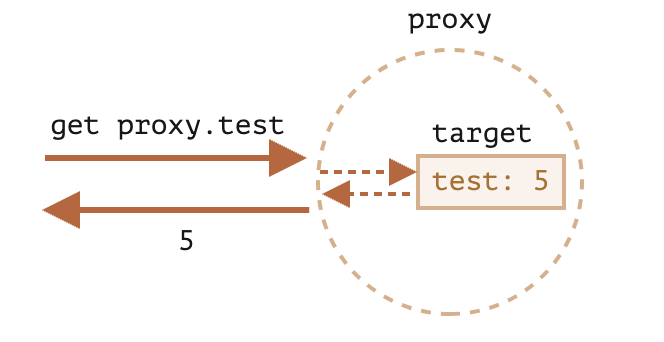

```toc
```


## Proxy 和 Reflect

一个 `Proxy` 对象包装另一个对象并拦截诸如读取/写入属性和其他操作，可以选择自行处理它们，或者透明地允许该对象处理它们。

### Proxy

语法：

```js
let proxy = new Proxy(target, handler)
```

- `target` —— 是要包装的对象，可以是任何东西，包括函数。
- `handler` —— 代理配置：带有“捕捉器”（“traps”，即拦截操作的方法）的对象。比如 `get` 捕捉器用于读取 `target` 的属性，`set` 捕捉器用于写入 `target` 的属性，等等。

对 `proxy` 进行操作，如果在 `handler` 中存在相应的捕捉器，则它将运行，并且 Proxy 有机会对其进行处理，否则将直接对 target 进行处理。

首先，让我们创建一个没有任何捕捉器的代理（Proxy）：

```js
let target = {};
let proxy = new Proxy(target, {}); // 空的 handler 对象

proxy.test = 5; // 写入 proxy 对象 (1)
alert(target.test); // 5，test 属性出现在了 target 中！

alert(proxy.test); // 5，我们也可以从 proxy 对象读取它 (2)

for(let key in proxy) alert(key); // test，迭代也正常工作 (3)
```

由于没有捕捉器，所有对 `proxy` 的操作都直接转发给了 `target`。

1. 写入操作 `proxy.test=` 会将值写入 `target`。
2. 读取操作 `proxy.test` 会从 `target` 返回对应的值。
3. 迭代 `proxy` 会从 `target` 返回对应的值。

我们可以看到，没有任何捕捉器，`proxy` 是一个 `target` 的透明包装器（wrapper）。



`Proxy` 是一种特殊的“奇异对象（exotic object）”。它没有自己的属性。如果 `handler` 为空，则透明地将操作转发给 `target`。

要激活更多功能，让我们添加捕捉器。

对于对象的大多数操作，JavaScript 规范中有一个所谓的“内部方法”，它描述了最底层的工作方式。例如 `[[Get]]`，用于读取属性的内部方法，`[[Set]]`，用于写入属性的内部方法，等等。这些方法仅在规范中使用，我们不能直接通过方法名调用它们。

Proxy 捕捉器会拦截这些方法的调用。它们在 [proxy 规范](https://tc39.es/ecma262/#sec-proxy-object-internal-methods-and-internal-slots) 和下表中被列出。

对于每个内部方法，此表中都有一个捕捉器：可用于添加到 `new Proxy` 的 `handler` 参数中以拦截操作的方法名称：


|内部方法|Handler 方法|何时触发|
|-|-|-|
| `[[Get]]`	|get	|读取属性|
| `[[Set]]` |	set|写入属性|
| `[[HasProperty]]` |has	|in 操作符|
| `[[Delete]] ` |	deleteProperty|	delete 操作符|
| `[[Call]]`	|apply	|函数调用|
| `[[Construct]]`	|construct|	new 操作符|
| `[[GetPrototypeOf]] `	|getPrototypeOf| `Object.getPrototypeOf` |
| `[[SetPrototypeOf]]` |	setPrototypeOf|	`Object.setPrototypeOf` |
| `[[IsExtensible]] ` |	isExtensible	| `Object.isExtensible` |
| `[[PreventExtensions]]` |	preventExtensions| `Object.preventExtensions` |
| `[[DefineOwnProperty]] `	|defineProperty|	`Object.defineProperty, Object.defineProperties` |
| `[[GetOwnProperty]]`	|getOwnPropertyDescriptor|	`Object.getOwnPropertyDescriptor, for.. in, Object.keys/values/entries` |
| `[[OwnPropertyKeys]]` |	ownKeys| `Object.getOwnPropertyNames, Object.getOwnPropertySymbols, for.. in, Object.keys/values/entries` |


*不变量*
JavaScript 强制执行某些不变量 —— 内部方法和捕捉器必须满足的条件。

其中大多数用于返回值：

- `[[Set]]` 如果值已成功写入，则必须返回 `true`，否则返回 `false`。
- `[[Delete]]` 如果已成功删除该值，则必须返回 `true`，否则返回 `false`。
- ……依此类推，我们将在下面的示例中看到更多内容。

还有其他一些不变量，例如：

- 应用于代理（proxy）对象的 `[[GetPrototypeOf]]`，必须返回与应用于被代理对象的 `[[GetPrototypeOf]]` 相同的值。换句话说，读取代理对象的原型必须始终返回被代理对象的原型。

捕捉器可以拦截这些操作，但是必须遵循上面这些规则。

### 带有 get 捕捉器的默认值

最常见的捕捉器是用于读取/写入的属性。

要拦截读取操作，`handler` 应该有 `get(target, property, receiver)` 方法。

读取属性时触发该方法，参数如下：

- `target` —— 是目标对象，该对象被作为第一个参数传递给 `new Proxy`，
- `property` —— 目标属性名，
- `receiver` —— 如果目标属性是一个 getter 访问器属性，则 `receiver` 就是本次读取属性所在的 `this` 对象。通常，这就是 `proxy` 对象本身（或者，如果我们从 proxy 继承，则是从该 proxy 继承的对象）。现在我们不需要此参数，因此稍后我们将对其进行详细介绍。

让我们用 `get` 来实现一个对象的默认值。

我们将创建一个对不存在的数组项返回 `0` 的数组。

通常，当人们尝试获取不存在的数组项时，他们会得到 `undefined`，但是我们在这将常规数组包装到代理（proxy）中，以捕获读取操作，并在没有要读取的属性的时返回 `0`：

```js
let numbers = [0, 1, 2];

numbers = new Proxy(numbers, {
  get(target, prop) {
    if (prop in target) {
      return target[prop];
    } else {
      return 0; // 默认值
    }
  }
});

alert( numbers[1] ); // 1
alert( numbers[123] ); // 0（没有这个数组项）
```

首先要说明下 `in` 的几种用法，一种当然是遍历集合。还有就是作为运算符使用。比如

```js
let obj = {
	name: "jack",
	age : 9
};
alert("name" in obj);// true
```

相当于是判断属性是否存在于对象中，而用于数组时，索引就是属性，所以可以像上面那样使用。

这种用法很适合一些词典翻译类的场景

```js
let dictionary = {
  'Hello': 'Hola',
  'Bye': 'Adiós'
};

dictionary = new Proxy(dictionary, {
  get(target, phrase) { // 拦截读取属性操作
    if (phrase in target) { //如果词典中有该短语
      return target[phrase]; // 返回其翻译
    } else {
      // 否则返回未翻译的短语
      return phrase;
    }
  }
});

// 在词典中查找任意短语！
// 最坏的情况也只是它们没有被翻译。
alert( dictionary['Hello'] ); // Hola
alert( dictionary['Welcome to Proxy']); // Welcome to Proxy（没有被翻译）
```

这里要注意代理如何覆盖变量

```js
dictionary = new Proxy(dictionary, ...);
```

代理应该在所有地方都完全替代目标对象。目标对象被代理后，任何人都不应该再引用目标对象。否则很容易搞砸。

### 使用 set 捕捉器进行验证


