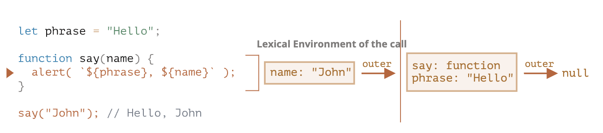

```toc

```


## Rest 参数与 Spread 语法

在 JavaScript 中，很多内建函数都支持传入任意数量的参数。

例如：

- `Math.max(arg1, arg2, ..., argN)` —— 返回参数中的最大值。
- `Object.assign(dest, src1, ..., srcN)` —— 依次将属性从 `src1..N` 复制到 `dest`。
- ……等。

### Rest 参数 ...

在 JavaScript 中，无论函数是如何定义的，你都可以在调用它时传入任意数量的参数。

例如：

```js
function sum(a, b) {
  return a + b;
}

alert( sum(1, 2, 3, 4, 5) );
```

虽然这里这个函数不会因为传入过多的参数而报错。但是，当然，只有前两个参数被求和了。

我们可以在函数定义中声明一个数组来收集参数。语法是这样的：`...变量名`，这将会声明一个数组并指定其名称，其中存有剩余的参数。这三个点的语义就是“收集剩余的参数并存进指定数组中”。

```js
function sumAll(...args) { // 数组名为 args
  let sum = 0;

  for (let arg of args) sum += arg;

  return sum;
}

alert( sumAll(1) ); // 1
alert( sumAll(1, 2) ); // 3
alert( sumAll(1, 2, 3) ); // 6
```

### `arguments` 变量

有一个名为 `arguments` 的特殊类数组对象可以在函数中被访问，该对象以参数在参数列表中的索引作为键，存储所有参数。

```js
function showName() {
  alert( arguments.length );
  alert( arguments[0] );
  alert( arguments[1] );

  // 它是可遍历的
  // for(let arg of arguments) alert(arg);
}

// 依次显示：2，Julius，Caesar
showName("Julius", "Caesar");

// 依次显示：1，Ilya，undefined（没有第二个参数）
showName("Ilya");
```

在过去，JavaScript 中不支持 rest 参数语法，而使用 `arguments` 是获取函数所有参数的唯一方法。现在它仍然有效，我们可以在一些老代码里找到它。

**箭头函数没有 `"arguments"`**

### Spread 语法

如果我们有一个数组 `[3, 5, 1]`，我们该如何用它调用 `Math.max` 呢？

直接“原样”传入这个数组是不会奏效的，因为 `Math.max` 期望的是列表形式的数值型参数，而不是一个数组：

```js
let arr = [3, 5, 1];

alert( Math.max(arr) ); // NaN
```

**Spread 语法** 可以解决这个问题！它看起来和 rest 参数很像，也使用 `...`，但是二者的用途完全相反。当在函数调用中使用 `...arr` 时，它会把可迭代对象 `arr` “展开”到参数列表中。

以 `Math.max` 为例：

```js
let arr = [3, 5, 1];

alert( Math.max(...arr) ); // 5（spread 语法把数组转换为参数列表）
```

我们还可以通过这种方式传入多个可迭代对象：

```js
let arr1 = [1, -2, 3, 4];
let arr2 = [8, 3, -8, 1];

alert( Math.max(...arr1, ...arr2) ); // 8
```

还可以使用 spread 语法来合并数组：

```js
let arr = [3, 5, 1];
let arr2 = [8, 9, 15];

let merged = [0, ...arr, 2, ...arr2];

alert(merged); // 0,3,5,1,2,8,9,15（0，然后是 arr，然后是 2，然后是 arr2）
```

使用 spread 语法将字符串转换为字符数组：

```js
let str = "Hello";

alert( [...str] ); // H,e,l,l,o
```

Spread 语法内部使用了迭代器来收集元素，与 `for..of` 的方式相同。对于这个特定任务，我们还可以使用 `Array.from` 来实现，因为该方法会将一个可迭代对象（如字符串）转换为数组：

```js
let str = "Hello";

// Array.from 将可迭代对象转换为数组
alert( Array.from(str) ); // H,e,l,l,o
```

运行结果与 `[...str]` 相同。

不过 `Array.from(obj)` 和 `[...obj]` 存在一个细微的差别：

- `Array.from` 适用于类数组对象也适用于可迭代对象。
- Spread 语法只适用于可迭代对象。

因此，对于将一些“东西”转换为数组的任务，`Array.from` 往往更通用。


### 复制 array/object

还记得我们 [之前讲过的](https://zh.javascript.info/object-copy#cloning-and-merging-object-assign) `Object.assign()` 吗？

使用 spread 语法也可以做同样的事情（译注：也就是进行浅拷贝）。

```js
let arr = [1, 2, 3];

let arrCopy = [...arr]; // 将数组 spread 到参数列表中
                        // 然后将结果放到一个新数组

// 两个数组中的内容相同吗？
alert(JSON.stringify(arr) === JSON.stringify(arrCopy)); // true

// 两个数组相等吗？
alert(arr === arrCopy); // false（它们的引用是不同的）

// 修改我们初始的数组不会修改副本：
arr.push(4);
alert(arr); // 1, 2, 3, 4
alert(arrCopy); // 1, 2, 3
```

也可以通过相同的方式来复制一个对象：

```js
let obj = { a: 1, b: 2, c: 3 };

let objCopy = { ...obj }; // 将对象 spread 到参数列表中
                          // 然后将结果返回到一个新对象

// 两个对象中的内容相同吗？
alert(JSON.stringify(obj) === JSON.stringify(objCopy)); // true

// 两个对象相等吗？
alert(obj === objCopy); // false (not same reference)

// 修改我们初始的对象不会修改副本：
obj.d = 4;
alert(JSON.stringify(obj)); // {"a":1,"b":2,"c":3,"d":4}
alert(JSON.stringify(objCopy)); // {"a":1,"b":2,"c":3}
```

这种方式比使用 `let arrCopy = Object.assign([], arr)` 复制数组，或使用 `let objCopy = Object.assign({}, obj)` 复制对象来说更为简便。因此，只要情况允许，我们倾向于使用它。


## 变量作用域，闭包

### 代码块

如果在代码块 `{...}` 内声明了一个变量，那么这个变量只在该代码块内可见。

### 嵌套函数

如果一个函数是在另一个函数中创建的，该函数就被称为“嵌套”函数。

```js
function sayHiBye(firstName, lastName) {
  // 辅助嵌套函数使用如下
  function getFullName() {
    return firstName + " " + lastName;
  }

  alert( "Hello, " + getFullName() );
  alert( "Bye, " + getFullName() );
}
```

### 词法环境

#### 变量

在 JavaScript 中，每个运行的函数，代码块 `{...}` 以及整个脚本，都有一个被称为 **词法环境（Lexical Environment）** 的内部（隐藏）的关联对象。

词法环境对象由两部分组成：

1. **环境记录（Environment Record）** —— 一个存储所有局部变量作为其属性（包括一些其他信息，例如 `this` 的值）的对象。
2. 对 **外部词法环境** 的引用，与外部代码相关联。

下面这段代码

```js
// 1. execution start.
let phrase; // 2.
phrase = "Hello"; // 3.
phrase = "Bye"; // 4.
```

词法环境的变化如下

```
[phrase:<uninitialized>] --> null
[phrase:<undefined>]
[phrase:"Hello"]
[phrase:"Bye"]
```

#### 函数声明

一个函数其实也是一个值，就像变量一样。**不同之处在于函数声明的初始化会被立即完成。**当创建了一个词法环境（Lexical Environment）时，函数声明会立即变为即用型函数（不像 `let` 那样直到声明处才可用）。

```js
let phrase = "Hello";
function say(name){
	alert(`${phrase}, ${name}`)
}
say("John");
```

#### 内部和外部的词法环境

在一个函数运行时，在调用刚开始时，会自动创建一个新的词法环境以存储这个调用的局部变量和参数。

在这个函数调用期间，我们有两个词法环境：内部一个（用于函数调用）和外部一个（全局）：

- 内部词法环境与 `say` 的当前执行相对应。它具有一个单独的属性：`name`，函数的参数。我们调用的是 `say("John")`，所以 `name` 的值为 `"John"`。
- 外部词法环境是全局词法环境。它具有 `phrase` 变量和函数本身。



这里的要点就是对外部此法环境的引用。

**当代码要访问一个变量时 —— 首先会搜索内部词法环境，然后搜索外部环境，然后搜索更外部的环境，以此类推，直到全局词法环境。**

如果在任何地方都找不到这个变量，那么在严格模式下就会报错（在非严格模式下，为了向下兼容，给未定义的变量赋值会创建一个全局变量）。


#### 返回函数

```js
function makeCounter() {
  let count = 0;

  return function() {
    return count++;
  };
}

let counter = makeCounter();
```

在每次 `makeCounter()` 调用的开始，都会创建一个新的词法环境对象，以存储该 `makeCounter` 运行时的变量。所有的函数在“诞生”时都会记住创建它们的词法环境。从技术上讲，这里没有什么魔法：所有函数都有名为 `[[Environment]]` 的隐藏属性，该属性保存了对创建该函数的词法环境的引用。

因此，`counter.[[Environment]]` 有对 `{count: 0}` 词法环境的引用。这就是函数记住它创建于何处的方式，与函数被在哪儿调用无关。`[[Environment]]` 引用在函数创建时被设置并永久保存。

#### 闭包

[闭包]( https://en.wikipedia.org/wiki/Closure_ (computer_programming)) 是指一个函数可以记住其外部变量并可以访问这些变量。在某些编程语言中，这是不可能的，或者应该以一种特殊的方式编写函数来实现。但如上所述，在 JavaScript 中，所有函数都是天生闭包的（只有一个例外，将在 ["new Function" 语法](https://zh.javascript.info/new-function) 中讲到）。

也就是说：JavaScript 中的函数会自动通过隐藏的 `[[Environment]]` 属性记住创建它们的位置，所以它们都可以访问外部变量。


### 垃圾收集

通常，函数调用完成后，会将词法环境和其中的所有变量从内存中删除。因为现在没有任何对它们的引用了。与 JavaScript 中的任何其他对象一样，词法环境仅在可达时才会被保留在内存中。

但是，如果有一个嵌套的函数在函数结束后仍可达，则它将具有引用词法环境的 `[[Environment]]` 属性。

在下面这个例子中，即使在（外部）函数执行完成后，它的词法环境仍然可达。因此，此词法环境仍然有效。

例如：

```js
function f() {
  let value = 123;

  return function() {
    alert(value);
  }
}

let g = f(); // g.[[Environment]] 存储了对相应 f() 调用的词法环境的引用
```

当词法环境对象变得不可达时，它就会死去（就像其他任何对象一样）。换句话说，它仅在至少有一个嵌套函数引用它时才存在。在下面的代码中，嵌套函数被删除后，其封闭的词法环境（以及其中的 `value`）也会被从内存中删除：

```js
function f() {
  let value = 123;

  return function() {
    alert(value);
  }
}

let g = f(); // 当 g 函数存在时，该值会被保留在内存中

g = null; // ……现在内存被清理了
```

*实际开发中的优化*

正如我们所看到的，理论上当函数可达时，它外部的所有变量也都将存在。

但在实际中，JavaScript 引擎会试图优化它。它们会分析变量的使用情况，如果从代码中可以明显看出有未使用的外部变量，那么就会将其删除。

**在 V8（Chrome，Edge，Opera）中的一个重要的副作用是，此类变量在调试中将不可用。**

打开 Chrome 浏览器的开发者工具，并尝试运行下面的代码。

当代码执行暂停时，在控制台中输入 `alert(value)`。

```js
function f() {
  let value = Math.random();

  function g() {
    debugger; // 在 Console 中：输入 alert(value); No such variable!
  }

  return g;
}

let g = f();
g();
```

正如你所见的 —— No such variable! 理论上，它应该是可以访问的，但引擎把它优化掉了。

## 全局对象

全局对象提供可在任何地方使用的变量和函数。默认情况下，这些全局变量内建于语言或环境中。**在浏览器中，它的名字是 “window”，对 `Node.js` 而言，它的名字是 “global”，其它环境可能用的是别的名字。**

最近，`globalThis` 被作为全局对象的标准名称加入到了 JavaScript 中，所有环境都应该支持该名称。所有主流浏览器都支持它。

全局对象的所有属性都可以被直接访问：

```js
alert("Hello");
// 等同于
window.alert("Hello");
```

## 函数对象，NFE

我们已经知道，在 JavaScript 中，函数也是一个值。而 JavaScript 中的每个值都有一种类型，那么函数是什么类型呢？在 JavaScript 中，函数的类型是对象。


### 属性“name”

函数对象包含一些便于使用的属性。比如，一个函数的名字可以通过属性 “name” 来访问：

```js
function sayHi() {
  alert("Hi");
}

alert(sayHi.name); // sayHi
```

### 属性“length”

还有另一个内建属性 “length”，它返回函数入参的个数，比如：

```js
function f1(a) {}
function f2(a, b) {}
function many(a, b, ...more) {}

alert(f1.length); // 1
alert(f2.length); // 2
alert(many.length); // 2
```

可以看到，**rest 参数不参与计数。**

属性 `length` 有时在操作其它函数的函数中用于做 [内省/运行时检查（introspection）]( https://zh.wikipedia.org/wiki/%E5%86%85%E7%9C%81_ (%E8%AE%A1%E7%AE%97%E6%9C%BA%E7%A7%91%E5%AD%A6))。

比如，下面的代码中函数 `ask` 接受一个询问答案的参数 `question` 和可能包含任意数量 `handler` 的参数 `...handlers`。当用户提供了自己的答案后，函数会调用那些 `handlers`。我们可以传入两种 `handlers`：

- 一种是无参函数，它仅在用户给出肯定回答时被调用。
- 一种是有参函数，它在两种情况都会被调用，并且返回一个答案。

为了正确地调用 `handler`，我们需要检查 `handler.length` 属性。我们的想法是，我们用一个简单的无参数的 `handler` 语法来处理积极的回答（最常见的变体），但也要能够提供通用的 handler：

```js
function ask(question, ...handlers) {
  let isYes = confirm(question);

  for(let handler of handlers) {
    if (handler.length == 0) {
      if (isYes) handler();
    } else {
      handler(isYes);
    }
  }

}

// 对于肯定的回答，两个 handler 都会被调用
// 对于否定的回答，只有第二个 handler 被调用
ask("Question?", () => alert('You said yes'), result => alert(result));
```

### 自定义属性

也可以添加我们自己的属性。这里我们添加了 `counter` 属性，用来跟踪总的调用次数：

```js
function sayHi() {
  alert("Hi");

  // 计算调用次数
  sayHi.counter++;
}
sayHi.counter = 0; // 初始值

sayHi(); // Hi
sayHi(); // Hi

alert( `Called ${sayHi.counter} times` ); // Called 2 times
```

*属性不是变量*
>被赋值给函数的属性，比如 `sayHi.counter = 0`，**不会** 在函数内定义一个局部变量 `counter`。换句话说，属性 `counter` 和变量 `let counter` 是毫不相关的两个东西。

函数属性有时会用来替代闭包。例如，我们可以使用函数属性将 [变量作用域，闭包](https://zh.javascript.info/closure) 章节中 counter 函数的例子进行重写：

```js
function makeCounter() {
  // 不需要这个了
  // let count = 0

  function counter() {
    return counter.count++;
  };

  counter.count = 0;

  return counter;
}

let counter = makeCounter();
alert( counter() ); // 0
alert( counter() ); // 1
```

### 命名函数表达式

命名函数表达式（NFE，Named Function Expression），指带有名字的函数表达式的术语。例如，让我们写一个普通的函数表达式：

```js
let sayHi = function(who) {
  alert(`Hello, ${who}`);
};
```

然后给它加一个名字：

```js
let sayHi = function func(who) {
  alert(`Hello, ${who}`);
};
```

我们这里得到了什么吗？为它添加一个 `"func"` 名字的目的是什么？首先请注意，它仍然是一个函数表达式。在 `function` 后面加一个名字 `"func"` 没有使它成为一个函数声明，因为它仍然是作为赋值表达式中的一部分被创建的。

添加这个名字当然也没有打破任何东西。函数依然可以通过 `sayHi()` 来调用：

```js
let sayHi = function func(who) {
  alert(`Hello, ${who}`);
};

sayHi("John"); // Hello, John
```

**关于名字 `func` 有两个特殊的地方，这就是添加它的原因：**

1. 它允许函数在内部引用自己。
2. 它在函数外是不可见的。

例如，下面的函数 `sayHi` 会在没有入参 `who` 时，以 `"Guest"` 为入参调用自己：

```js
let sayHi = function func(who) {
  if (who) {
    alert(`Hello, ${who}`);
  } else {
    func("Guest"); // 使用 func 再次调用函数自身
  }
};

sayHi(); // Hello, Guest

// 但这不工作：
func(); // Error, func is not defined（在函数外不可见）
```

我们为什么使用 `func` 呢？为什么不直接使用 `sayHi` 进行嵌套调用？当然，在大多数情况下我们可以这样做：

```js
let sayHi = function(who) {
  if (who) {
    alert(`Hello, ${who}`);
  } else {
    sayHi("Guest");
  }
};
```

**上面这段代码的问题在于 `sayHi` 的值可能会被函数外部的代码改变。如果该函数被赋值给另外一个变量（译注：也就是原变量被修改），那么函数就会开始报错：**

```js
let sayHi = function(who) {
  if (who) {
    alert(`Hello, ${who}`);
  } else {
    sayHi("Guest"); // Error: sayHi is not a function
  }
};

let welcome = sayHi;
sayHi = null;

welcome(); // Error，嵌套调用 sayHi 不再有效！
```


## `new Function` 语法

### 语法

```js
let func = new Function ([arg1, arg2, ...argN], functionBody);
```

该函数是通过使用参数 `arg1...argN` 和给定的 `functionBody` 创建的。下面这个例子可以帮助你理解创建语法。这是一个带有两个参数的函数：

```js
let sum = new Function('a', 'b', 'return a + b');

alert( sum(1, 2) ); // 3
```

与我们已知的其他方法相比，这种方法最大的不同在于，它实际上是通过运行时通过参数传递过来的字符串创建的。

以前的所有声明方法都需要我们 —— 程序员，在脚本中编写函数的代码。**但是 `new Function` 允许我们将任意字符串变为函数。** 例如，我们可以从服务器接收一个新的函数并执行它：

```js
let str = ... 动态地接收来自服务器的代码 ...

let func = new Function(str);
func();
```


### 闭包

通常，闭包是指使用一个特殊的属性 `[[Environment]]` 来记录函数自身的创建时的环境的函数。它具体指向了函数创建时的词法环境。（我们在 [变量作用域，闭包](https://zh.javascript.info/closure) 一章中对此进行了详细的讲解）。

**但是如果我们使用 `new Function` 创建一个函数，那么该函数的 `[[Environment]]` 并不指向当前的词法环境，而是指向全局环境。因此，此类函数无法访问外部（outer）变量，只能访问全局变量。**

```js
function getFunc() {
  let value = "test";
  let func = new Function('alert(value)');
  return func;
}
// 这里func函数无法访问外部变量value
getFunc()(); // error: value is not defined
```

将其与常规行为进行比较：

```js
function getFunc() {
  let value = "test";
  let func = function() { alert(value); };
  return func;
}

getFunc()(); // "test"，从 getFunc 的词法环境中获取的
```

`new Function` 的这种特性看起来有点奇怪，不过在实际中却非常实用。

想象一下我们必须通过一个字符串来创建一个函数。在编写脚本时我们不会知道该函数的代码（这也就是为什么我们不用常规方法创建函数），但在执行过程中会知道了。我们可能会从服务器或其他来源获取它。

我们的新函数需要和主脚本进行交互。如果这个函数能够访问外部（outer）变量会怎么样？

问题在于，在将 JavaScript 发布到生产环境之前，需要使用 **压缩程序（minifier）** 对其进行压缩 —— 一个特殊的程序，通过删除多余的注释和空格等压缩代码 —— 更重要的是，将局部变量命名为较短的变量。

例如，如果一个函数有 `let userName`，压缩程序会把它替换为 `let a`（如果 a 已被占用了，那就使用其他字符），剩余的局部变量也会被进行类似的替换。一般来说这样的替换是安全的，毕竟这些变量是函数内的局部变量，函数外的任何东西都无法访问它。在函数内部，压缩程序会替换所有使用了这些变量的代码。压缩程序很聪明，它会分析代码的结构，而不是呆板地查找然后替换，因此它不会“破坏”你的程序。

但是在这种情况下，如果使 `new Function` 可以访问自身函数以外的变量，它也很有可能无法找到重命名的 `userName`，这是因为新函数的创建发生在代码压缩以后，变量名已经被替换了。

**即使我们可以在 `new Function` 中访问外部词法环境，我们也会受挫于压缩程序。**此外，这样的代码在架构上很差并且容易出错。

当我们需要向 `new Function` 创建出的新函数传递数据时，我们必须显式地通过参数进行传递。

## 调度：setTimeout 和 setInterval

有时我们并不想立即执行一个函数，而是等待特定一段时间之后再执行。这就是所谓的“计划调用（scheduling a call）”。

目前有两种方式可以实现：

- `setTimeout` 允许我们将函数推迟到一段时间间隔之后再执行。
- `setInterval` 允许我们重复运行一个函数，从一段时间间隔之后开始运行，之后以该时间间隔连续重复运行该函数。

### setTimeout

语法：

```js
let timerId = setTimeout(func|code, [delay], [arg1], [arg2], ...)
```

参数说明：

`func|code`
想要执行的函数或代码字符串。 一般传入的都是函数。由于某些历史原因，支持传入代码字符串，但是不建议这样做。

`delay`
执行前的延时，以毫秒为单位（1000 毫秒 = 1 秒），默认值是 0；

`arg1`，`arg2`…
要传入被执行函数（或代码字符串）的参数列表（IE9 以下不支持）

例如，在下面这个示例中，`sayHi()` 方法会在 1 秒后执行：

```js
function sayHi() {
  alert('Hello');
}

setTimeout(sayHi, 1000);
```

带参数的情况：

```js
function sayHi(phrase, who) {
  alert( phrase + ', ' + who );
}

setTimeout(sayHi, 1000, "Hello", "John"); // Hello, John
```

如果第一个参数位传入的是字符串，JavaScript 会自动为其创建一个函数。所以这么写也是可以的：

```js
setTimeout("alert('Hello')", 1000);
```

但是，不建议使用字符串，我们可以使用箭头函数代替它们，如下所示：

```js
setTimeout(() => alert('Hello'), 1000);
```


### clearTimeout 取消调度

`setTimeout` 在调用时会返回一个“定时器标识符（timer identifier）”，在我们的例子中是 `timerId`，我们可以使用它来取消执行。

取消调度的语法

```js
let timerId = setTimeout(...);
clearTimeout(timerId);
```


### setInterval

`setInterval` 方法和 `setTimeout` 的语法相同：

```js
let timerId = setInterval(func|code, [delay], [arg1], [arg2], ...)
```

所有参数的意义也是相同的。不过与 `setTimeout` 只执行一次不同，`setInterval` 是每间隔给定的时间周期性执行。想要阻止后续调用，我们需要调用 `clearInterval(timerId)`。

下面的例子将每间隔 2 秒就会输出一条消息。5 秒之后，输出停止：

```js
// 每 2 秒重复一次
let timerId = setInterval(() => alert('tick'), 2000);

// 5 秒之后停止
setTimeout(() => { clearInterval(timerId); alert('stop'); }, 5000);
```

### 嵌套的 setTimeout

周期性调度有两种方式。一种是使用 `setInterval`，另外一种就是嵌套的 `setTimeout`，就像这样：

```js
/** instead of:
let timerId = setInterval(() => alert('tick'), 2000);
*/

let timerId = setTimeout(function tick() {
  alert('tick');
  timerId = setTimeout(tick, 2000); // (*)
}, 2000);
```

上面这个 `setTimeout` 在当前这一次函数执行完时 `(*)` 立即调度下一次调用。*嵌套的 `setTimeout` 要比 `setInterval` 灵活得多。采用这种方式可以根据当前执行结果来调度下一次调用，因此下一次调用可以与当前这一次不同。*

例如，我们要实现一个服务（server），每间隔 5 秒向服务器发送一个数据请求，但如果服务器过载了，那么就要降低请求频率，比如将间隔增加到 10、20、40 秒等。

以下是伪代码：

```js
let delay = 5000;

let timerId = setTimeout(function request() {
  ...发送请求...

  if (request failed due to server overload) {
    // 下一次执行的间隔是当前的 2 倍
    delay *= 2;
  }

  timerId = setTimeout(request, delay);

}, delay);
```

### 零延时的 setTimeout

这儿有一种特殊的用法：`setTimeout(func, 0)`，或者仅仅是 `setTimeout(func)`。这样调度可以让 `func` 尽快执行。但是只有在当前正在执行的脚本执行完成后，调度程序才会调用它。

也就是说，该函数被调度在当前脚本执行完成“之后”立即执行。例如，下面这段代码会先输出 “Hello”，然后立即输出 “World”：

```js
setTimeout(() => alert("World"));

alert("Hello");
```


## 装饰器模式和转发，call/apply

JavaScript 在处理函数时提供了非凡的灵活性。它们可以被传递，用作对象，现在我们将看到如何在它们之间 **转发（forward）** 调用并 **装饰（decorate）** 它们。

### 透明缓存

假设我们有一个 CPU 重负载的函数 `slow(x)`，但它的结果是稳定的。换句话说，对于相同的 `x`，它总是返回相同的结果。

如果经常调用该函数，我们可能希望将结果缓存（记住）下来，以避免在重新计算上花费额外的时间。

但是我们不是将这个功能添加到 `slow()` 中，而是创建一个包装器（wrapper）函数，该函数增加了缓存功能。正如我们将要看到的，这样做有很多好处。

下面是代码和解释：

```js
function slow(x) {
  // 这里可能会有重负载的 CPU 密集型工作
  alert(`Called with ${x}`);
  return x;
}

function cachingDecorator(func) {
  let cache = new Map();

  return function(x) {
    if (cache.has(x)) {    // 如果缓存中有对应的结果
      return cache.get(x); // 从缓存中读取结果
    }

    let result = func(x);  // 否则就调用 func

    cache.set(x, result);  // 然后将结果缓存（记住）下来
    return result;
  };
}

slow = cachingDecorator(slow);

alert( slow(1) ); // slow(1) 被缓存下来了，并返回结果
alert( "Again: " + slow(1) ); // 返回缓存中的 slow(1) 的结果

alert( slow(2) ); // slow(2) 被缓存下来了，并返回结果
alert( "Again: " + slow(2) ); // 返回缓存中的 slow(2) 的结果
```

在上面的代码中，`cachingDecorator` 是一个 **装饰器（decorator）**：一个特殊的函数，它接受另一个函数并改变它的行为。

其思想是，我们可以为任何函数调用 `cachingDecorator`，它将返回缓存包装器。这很棒啊，因为我们有很多函数可以使用这样的特性，而我们需要做的就是将 `cachingDecorator` 应用于它们。

### 使用 `func.call` 设定上下文

上面提到的缓存装饰器不适用于对象方法。例如，在下面的代码中，`worker.slow()` 在装饰后停止工作：

```js
// 我们将对 worker.slow 的结果进行缓存
let worker = {
  someMethod() {
    return 1;
  },

  slow(x) {
    // 可怕的 CPU 过载任务
    alert("Called with " + x);
    return x * this.someMethod(); // (*)
  }
};

// 和之前例子中的代码相同
function cachingDecorator(func) {
  let cache = new Map();
  return function(x) {
    if (cache.has(x)) {
      return cache.get(x);
    }
    let result = func(x); // (**)
    cache.set(x, result);
    return result;
  };
}

alert( worker.slow(1) ); // 原始方法有效

worker.slow = cachingDecorator(worker.slow); // 现在对其进行缓存

alert( worker.slow(2) ); // 蛤！Error: Cannot read property 'someMethod' of undefined
```

错误发生在试图访问 `this.someMethod` 并失败了的 `(*)` 行中。你能看出来为什么吗？

原因是包装器将原始函数调用为 `(**)` 行中的 `func(x)`。并且，当这样调用时，函数将得到 `this = undefined`。如果尝试运行下面这段代码，我们会观察到类似的问题：

```js
let func = worker.slow;
func(2);
```

因此，包装器将调用传递给原始方法，但没有上下文 `this`。因此，发生了错误。

有一个特殊的内建函数方法 [func.call(context, …args)](https://developer.mozilla.org/zh/docs/Web/JavaScript/Reference/Global_Objects/Function/call)，它允许调用一个显式设置 `this` 的函数。语法如下：

```js
func.call(context, arg1, arg2, ...)
```

它运行 `func`，提供的第一个参数作为 `this`，后面的作为参数（arguments）。

```js
func(1, 2, 3);
func.call(obj, 1, 2, 3)
```

在下面的代码中，我们在不同对象的上下文中调用 `sayHi`：`sayHi.call(user)` 运行 `sayHi` 并提供了 `this=user`，然后下一行设置 `this=admin`：

```js
function sayHi() {
  alert(this.name);
}

let user = { name: "John" };
let admin = { name: "Admin" };

// 使用 call 将不同的对象传递为 "this"
sayHi.call( user ); // John
sayHi.call( admin ); // Admin
```

在我们的例子中，我们可以在包装器中使用 `call` 将上下文传递给原始函数：

```js
let worker = {
  someMethod() {
    return 1;
  },

  slow(x) {
    alert("Called with " + x);
    return x * this.someMethod(); // (*)
  }
};

function cachingDecorator(func) {
  let cache = new Map();
  return function(x) {
    if (cache.has(x)) {
      return cache.get(x);
    }
    let result = func.call(this, x); // 现在 "this" 被正确地传递了
    cache.set(x, result);
    return result;
  };
}

worker.slow = cachingDecorator(worker.slow); // 现在对其进行缓存

alert( worker.slow(2) ); // 工作正常
alert( worker.slow(2) ); // 工作正常，没有调用原始函数（使用的缓存）
```

### 传递多个参数

之前，对于单个参数 `x`，我们可以只使用 `cache.set(x, result)` 来保存结果，并使用 `cache.get(x)` 来检索并获取结果。但是现在，我们需要记住 **参数组合** `(min,max)` 的结果。原生的 `Map` 仅将单个值作为键（key）。

这儿有许多解决方案可以实现：

1. 实现一个新的（或使用第三方的）类似 map 的更通用并且允许多个键的数据结构。
2. 使用嵌套 map：`cache.set(min)` 将是一个存储（键值）对 `(max, result)` 的 `Map`。所以我们可以使用 `cache.get(min).get(max)` 来获取 `result`。
3. 将两个值合并为一个。为了灵活性，我们可以允许为装饰器提供一个“哈希函数”，该函数知道如何将多个值合并为一个值。

对于许多实际应用，第三种方式就足够了，所以我们就用这个吧。

```js
let worker = {
  slow(min, max) {
    alert(`Called with ${min},${max}`);
    return min + max;
  }
};

function cachingDecorator(func, hash) {
  let cache = new Map();
  return function() {
    let key = hash(arguments); // (*)
    if (cache.has(key)) {
      return cache.get(key);
    }

    let result = func.call(this, ...arguments); // (**)

    cache.set(key, result);
    return result;
  };
}

function hash(args) {
  return args[0] + ',' + args[1];
}

worker.slow = cachingDecorator(worker.slow, hash);

alert( worker.slow(3, 5) ); // works
alert( "Again " + worker.slow(3, 5) ); // same (cached)
```

这里其实就是对所有参数进行一个 hash，然后根据 hash 值来判断是否使用缓存。

### `func.apply`

我们可以使用 `func.apply(this, arguments)` 代替 `func.call(this, ...arguments)`。内建方法 [func.apply](https://developer.mozilla.org/zh/docs/Web/JavaScript/Reference/Global_Objects/Function/apply) 的语法是：

```js
func.apply(context, args)
```

`call` 和 `apply` 之间唯一的语法区别是，`call` 期望一个参数列表，而 `apply` 期望一个包含这些参数的类数组对象。

因此，这两个调用几乎是等效的：

```js
func.call(context, ...args);
func.apply(context, args);
```

它们使用给定的上下文和参数执行相同的 `func` 调用。只有一个关于 `args` 的细微的差别：

- Spread 语法 `...` 允许将 **可迭代对象** `args` 作为列表传递给 `call`。
- `apply` 只接受 **类数组** `args`。

对于即可迭代又是类数组的对象，例如一个真正的数组，我们使用 `call` 或 `apply` 均可，但是 `apply` 可能会更快，因为大多数 JavaScript 引擎在内部对其进行了优化。

将所有参数连同上下文一起传递给另一个函数被称为“呼叫转移（call forwarding）”。

这是它的最简形式：

```js
let wrapper = function() {
  return func.apply(this, arguments);
};
```

### 借用一种方法

现在，让我们对哈希函数再做一个较小的改进：

```js
function hash(args) {
  return args[0] + ',' + args[1];
}

// 或者

function hash(args) {
  return args.join();
}
```

不幸的是，这不行。因为我们正在调用 `hash(arguments)`，`arguments` 对象既是可迭代对象又是类数组对象，但它并不是真正的数组。不过，有一种简单的方法可以使用数组的 join 方法：

```js
function hash() {
  alert( [].join.call(arguments) ); // 1,2
}

hash(1, 2);
```

这个技巧被称为 **方法借用（method borrowing）**。我们从常规数组 `[].join` 中获取（借用）join 方法，并使用 `[].join.call` 在 `arguments` 的上下文中运行它。

### 装饰器和函数属性

通常，用装饰的函数替换一个函数或一个方法是安全的，除了一件小东西。如果原始函数有属性，例如 `func.calledCount` 或其他，则装饰后的函数将不再提供这些属性。因为这是装饰器。因此，如果有人使用它们，那么就需要小心。

例如，在上面的示例中，如果 `slow` 函数具有任何属性，而 `cachingDecorator(slow)` 则是一个没有这些属性的包装器。

## 函数绑定

当将对象方法作为回调进行传递，例如传递给 `setTimeout`，这儿会存在一个常见的问题：“丢失 `this`”。

### 丢失 this
我们已经看到了丢失 `this` 的例子。一旦方法被传递到与对象分开的某个地方 —— `this` 就丢失。

下面是使用 `setTimeout` 时 `this` 是如何丢失的：

```js
let user = {
  firstName: "John",
  sayHi() {
    alert(`Hello, ${this.firstName}!`);
  }
};

setTimeout(user.sayHi, 1000); // Hello, undefined!
```

这是因为 `setTimeout` 获取到了函数 `user.sayHi`，但它和对象分离开了。最后一行可以被重写为：

```js
let f = user.sayHi;
setTimeout(f, 1000); // 丢失了 user 上下文
```

### 解决方案 1: 包装器

```js
let user = {
  firstName: "John",
  sayHi() {
    alert(`Hello, ${this.firstName}!`);
  }
};

setTimeout(function() {
  user.sayHi(); // Hello, John!
}, 1000);
```

现在它可以正常工作了，因为它从外部词法环境中获取到了 `user`，就可以正常地调用方法了。

相同的功能，但是更简短：

```js
setTimeout(() => user.sayHi(), 1000); // Hello, John!
```

看起来不错，但是我们的代码结构中出现了一个小漏洞。

如果在 `setTimeout` 触发之前（有一秒的延迟！）`user` 的值改变了怎么办？那么，突然间，它将调用错误的对象！

```js
let user = {
  firstName: "John",
  sayHi() {
    alert(`Hello, ${this.firstName}!`);
  }
};

setTimeout(() => user.sayHi(), 1000);

// ……user 的值在不到 1 秒的时间内发生了改变
user = {
  sayHi() { alert("Another user in setTimeout!"); }
};

// Another user in setTimeout!
```

下一个解决方案保证了这样的事情不会发生。

### 解决方案 2:bind

函数提供了一个内建方法 [bind](https://developer.mozilla.org/zh/docs/Web/JavaScript/Reference/Global_Objects/Function/bind)，它可以绑定 `this`。基本的语法是：

```js
// 稍后将会有更复杂的语法
let boundFunc = func.bind(context);
```

`func.bind(context)` 的结果是一个特殊的类似于函数的“外来对象（exotic object）”，它可以像函数一样被调用，并且透明地（transparently）将调用传递给 `func` 并设定 `this=context`。

换句话说，`boundFunc` 调用就像绑定了 `this` 的 `func`。举个例子，这里的 `funcUser` 将调用传递给了 `func` 同时 `this=user`：

```js
let user = {
  firstName: "John"
};

function func() {
  alert(this.firstName);
}

let funcUser = func.bind(user);
funcUser(); // John
```

### 部分（应用）函数（partial functions）

到现在为止，我们只在谈论绑定 `this`。让我们再深入一步。我们不仅可以绑定 `this`，还可以绑定参数（arguments）。虽然很少这么做，但有时它可以派上用场。

`bind` 的完整语法如下：

```js
let bound = func.bind(context, [arg1], [arg2], ...);
```

它允许将上下文绑定为 `this`，以及绑定函数的部分参数。

例如，我们有一个乘法函数 `mul(a, b)`：

```js
function mul(a, b) {
  return a * b;
}
```

让我们使用 `bind` 在该函数基础上创建一个 `double` 函数：

```js
function mul(a, b) {
  return a * b;
}

let double = mul.bind(null, 2);

alert( double(3) ); // = mul(2, 3) = 6
alert( double(4) ); // = mul(2, 4) = 8
alert( double(5) ); // = mul(2, 5) = 10
```

对 `mul.bind(null, 2)` 的调用创建了一个新函数 `double`，它将调用传递到 `mul`，将 `null` 绑定为上下文，*并将 `2` 绑定为第一个参数*。并且，参数（arguments）均被“原样”传递。

它被称为 [函数的部分应用（partial function application）](https://en.wikipedia.org/wiki/Partial_application) —— 我们通过绑定先有函数的一些参数来创建一个新函数。

请注意，这里我们实际上没有用到 `this`。但是 `bind` 需要它，所以我们必须传入 `null` 之类的东西。


### 在没有上下文情况下的 partial

当我们想绑定一些参数（arguments），但是不想绑定上下文 `this`，应该怎么办？例如，对于一个对象方法。原生的 `bind` 不允许这种情况。我们不可以省略上下文直接跳到参数（arguments）。

幸运的是，仅绑定参数（arguments）的函数 `partial` 比较容易实现。像这样：

```js
function partial(func, ...argsBound) {
  return function(...args) { // (*)
    return func.call(this, ...argsBound, ...args);
  }
}

// 用法：
let user = {
  firstName: "John",
  say(time, phrase) {
    alert(`[${time}] ${this.firstName}: ${phrase}!`);
  }
};

// 添加一个带有绑定时间的 partial 方法
user.sayNow = partial(user.say, new Date().getHours() + ':' + new Date().getMinutes());

user.sayNow("Hello");
// 类似于这样的一些内容：
// [10:00] John: Hello!
```

`partial(func[, arg1, arg2...])` 调用的结果是一个包装器 `(*)`，它调用 `func` 并具有以下内容：

- 与它获得的函数具有相同的 `this`（对于 `user.sayNow` 调用来说，它是 `user`）
- 然后给它 `...argsBound` —— 来自于 `partial` 调用的参数（`"10:00"`）
- 然后给它 `...args` —— 给包装器的参数（`"Hello"`）

使用 spread 可以很容易实现这些操作，对吧？

此外，还有来自 lodash 库的现成的 [_.partial](https://lodash.com/docs#partial) 实现。

## 深入理解箭头函数

### 箭头函数没有 this

正如我们在 [对象方法，"this"](https://zh.javascript.info/object-methods) 一章中所学到的，箭头函数没有 `this`。如果访问 `this`，则会从外部获取。

例如，我们可以使用它在对象方法内部进行迭代：

```js
let group = {
  title: "Our Group",
  students: ["John", "Pete", "Alice"],

  showList() {
    this.students.forEach(
      student => alert(this.title + ': ' + student)
    );
  }
};

group.showList();
```

这里 `forEach` 中使用了箭头函数，所以其中的 `this.title` 其实和外部方法 `showList` 的完全一样。那就是：`group.title`。

如果我们使用正常的函数，则会出现错误：

```js
let group = {
  title: "Our Group",
  students: ["John", "Pete", "Alice"],

  showList() {
    this.students.forEach(function(student) {
      // Error: Cannot read property 'title' of undefined
      alert(this.title + ': ' + student);
    });
  }
};

group.showList();
```

报错是因为 `forEach` 运行它里面的这个函数，但是这个函数的 `this` 为默认值 `this=undefined`，因此就出现了尝试访问 `undefined.title` 的情况。但箭头函数就没事，因为它们没有 `this`。

**不能对箭头函数进行 `new` 操作**

### 箭头函数没有 arguments

箭头函数也没有 `arguments` 变量。当我们需要使用当前的 `this` 和 `arguments` 转发一个调用时，这对装饰器（decorators）来说非常有用。

例如，`defer(f, ms)` 获得了一个函数，并返回一个包装器，该包装器将调用延迟 `ms` 毫秒：

```js
function defer(f, ms) {
  return function() {
    setTimeout(() => f.apply(this, arguments), ms);
  };
}

function sayHi(who) {
  alert('Hello, ' + who);
}

let sayHiDeferred = defer(sayHi, 2000);
sayHiDeferred("John"); // 2 秒后显示：Hello, John
```

不用箭头函数的话，可以这么写：

```js
function defer(f, ms) {
  return function(...args) {
    let ctx = this;
    setTimeout(function() {
      return f.apply(ctx, args);
    }, ms);
  };
}
```