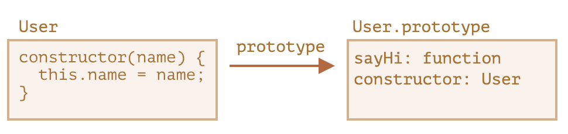
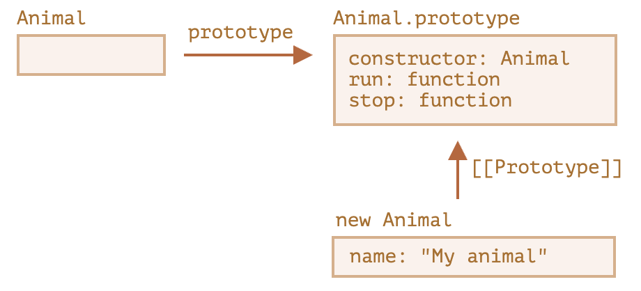
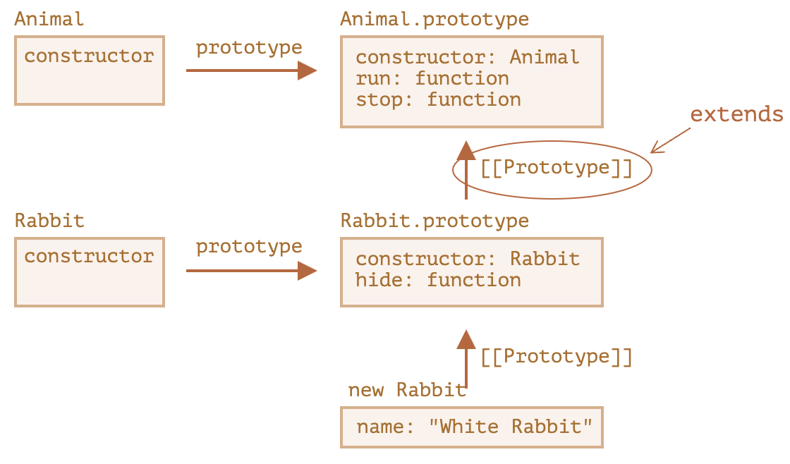
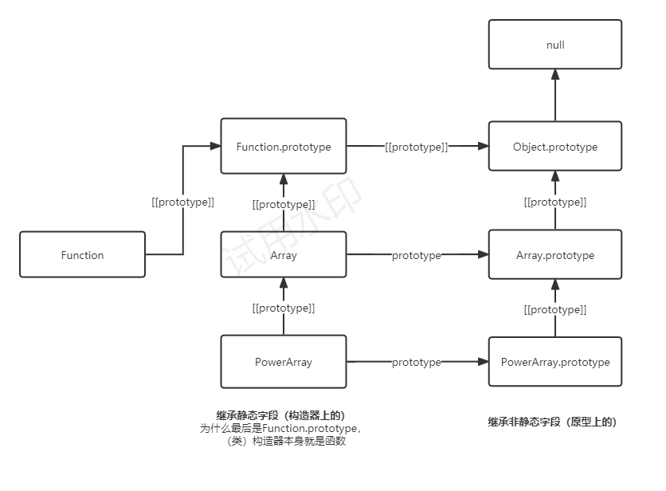

```toc
```

## Class 基本语法

```js
class MyClass {
  // class 方法
  constructor() { ... }
  method1() { ... }
  method2() { ... }
  method3() { ... }
  ...
}
```

然后使用 `new MyClass()` 来创建具有上述列出的所有方法的新对象。`new` 会自动调用 `constructor()` 方法，因此我们可以在 `constructor()` 中初始化对象。

```js
class User {
  constructor(name) {
    this.name = name;
  }
  sayHi() {
    alert(this.name);
  }
}

// 用法：
let user = new User("John");
user.sayHi();
```

在 JavaScript 中，类是一种函数。

```js
class User {
  constructor(name) { this.name = name; }
  sayHi() { alert(this.name); }
}

// 佐证：User 是一个函数
alert(typeof User); // function
```

`class User {...}` 构造实际上做了如下的事儿：

1. 创建一个名为 `User` 的函数，该函数成为类声明的结果。该函数的代码来自于 `constructor` 方法（如果我们不编写这种方法，那么它就被假定为空）。
2. 存储类中的方法，例如 `User.prototype` 中的 `sayHi`。

我们可以将 `class User` 声明的结果解释为：



```js
class User {
  constructor(name) { this.name = name; }
  sayHi() { alert(this.name); }
}

// class 是一个函数
alert(typeof User); // function

// ...或者，更确切地说，是 constructor 方法
alert(User === User.prototype.constructor); // true

// 方法在 User.prototype 中，例如：
alert(User.prototype.sayHi); // sayHi 方法的代码

// 在原型中实际上有两个方法
alert(Object.getOwnPropertyNames(User.prototype)); // constructor, sayHi
```

### 不仅仅是语法糖

人们常说 `class` 是一个语法糖（旨在使内容更易阅读，但不引入任何新内容的语法），因为我们实际上可以在不使用 `class` 的情况下声明相同的内容：

```js
// 用纯函数重写 class User

// 1. 创建构造器函数
function User(name) {
  this.name = name;
}
// 函数的原型（prototype）默认具有 "constructor" 属性，
// 所以，我们不需要创建它

// 2. 将方法添加到原型
User.prototype.sayHi = function() {
  alert(this.name);
};

// 用法：
let user = new User("John");
user.sayHi();
```

这个定义的结果与使用类得到的结果基本相同。因此，这确实是将 `class` 视为一种定义构造器及其原型方法的语法糖的理由。

尽管，它们之间存在着重大差异：
- 首先，通过 `class` 创建的函数具有特殊的内部属性标记 `[[IsClassConstructor]]: true`。因此，它与手动创建并不完全相同。编程语言会在许多地方检查该属性。例如，与普通函数不同，必须使用 `new` 来调用它：
```js
class User {
  constructor() {}
}

alert(typeof User); // function
User(); // Error: Class constructor User cannot be invoked without 'new'
```

此外，大多数 JavaScript 引擎中的类构造器的字符串表示形式都以 “class…” 开头

```js
class User {
  constructor() {}
}

alert(User); // class User { ... }
```
    
- 类方法不可枚举。类定义将 `"prototype"` 中的所有方法的 `enumerable` 标志设置为 `false`。这很好，因为如果我们对一个对象调用 `for..in` 方法，我们通常不希望 class 方法出现。
- 类总是使用 `use strict`。在类构造中的所有代码都将自动进入严格模式。

### 类表达式

```js
let User = class {
  sayHi() {
    alert("Hello");
  }
};
```

类表达式可能也应该有一个名字。如果类表达式有名字，那么该名字仅在类内部可见：

```js
// “命名类表达式（Named Class Expression）”
// (规范中没有这样的术语，但是它和命名函数表达式类似)
let User = class MyClass {
  sayHi() {
    alert(MyClass); // MyClass 这个名字仅在类内部可见
  }
};

new User().sayHi(); // 正常运行，显示 MyClass 中定义的内容

alert(MyClass); // error，MyClass 在外部不可见
```

甚至可以动态地“按需”创建类，就像这样：

```js
function makeClass(phrase) {
  // 声明一个类并返回它
  return class {
    sayHi() {
      alert(phrase);
    }
  };
}

// 创建一个新的类
let User = makeClass("Hello");

new User().sayHi(); // Hello
```

### getters/setters

就像对象字面量，类可能包括 getters/setters，计算属性（computed properties）等。这是一个使用 `get/set` 实现 `user.name` 的示例：

```js
class User {
  constructor(name) {
    // 调用 setter
    this.name = name;
  }
  get name() {
    return this._name;
  }
  set name(value) {
    if (value.length < 4) {
      alert("Name is too short.");
      return;
    }
    this._name = value;
  }
}

let user = new User("John");
alert(user.name); // John

user = new User(""); // Name is too short.
```

“类字段”是一种允许添加任何属性的语法。例如，让我们在 `class User` 中添加一个 `name` 属性：

```js
class User {
  name = "John";

  sayHi() {
    alert(`Hello, ${this.name}!`);
  }
}

new User().sayHi(); // Hello, John!
```

所以，我们就只需在表达式中写 " = "，就这样。类字段重要的不同之处在于，它们会在每个独立对象中被设好，而不是设在 `User.prototype`：

```js
class User {
  name = "John";
}

let user = new User();
alert(user.name); // John
alert(User.prototype.name); // undefined
```

### 使用类字段制作绑定方法

JavaScript 中的函数具有动态的 `this`。它取决于调用上下文。因此，如果一个对象方法被传递到某处，或者在另一个上下文中被调用，则 `this` 将不再是对其对象的引用。例如，此代码将显示 `undefined`：

```js
class Button {
  constructor(value) {
    this.value = value;
  }
  click() {
    alert(this.value);
  }
}

let button = new Button("hello");
setTimeout(button.click, 1000); // undefined
```

这个问题被称为“丢失 `this`”。

我们在 [函数绑定](https://zh.javascript.info/bind) 一章中讲过，有两种可以修复它的方式：

1. 传递一个包装函数，例如 `setTimeout(() => button.click(), 1000)`。
2. 将方法绑定到对象，例如在 constructor 中。

类字段提供了另一种非常优雅的语法：
```js
class Button {
  constructor(value) {
    this.value = value;
  }
  click = () => {
    alert(this.value);
  }
}

let button = new Button("hello");
setTimeout(button.click, 1000); // hello
```

类字段 `click = () => {...}` 是基于每一个对象被创建的，在这里对于每一个 `Button` 对象都有一个独立的方法，在内部都有一个指向此对象的 `this`。我们可以把 `button.click` 传递到任何地方，而且 `this` 的值总是正确的。


## 类继承

### extends

```js
class Animal {
  constructor(name) {
    this.speed = 0;
    this.name = name;
  }
  run(speed) {
    this.speed = speed;
    alert(`${this.name} runs with speed ${this.speed}.`);
  }
  stop() {
    this.speed = 0;
    alert(`${this.name} stands still.`);
  }
}

let animal = new Animal("My animal");
```

这是我们对对象 `animal` 和 class `Animal` 的图形化表示：



让我们创建一个继承自 `Animal` 的 `class Rabbit`：

```js
class Rabbit extends Animal {
  hide() {
    alert(`${this.name} hides!`);
  }
}

let rabbit = new Rabbit("White Rabbit");

rabbit.run(5); // White Rabbit runs with speed 5.
rabbit.hide(); // White Rabbit hides!
```

基本的类继承链路




### 在 extends 后允许任意表达式

```js
function f(phrase) {
  return class {
    sayHi() { alert(phrase); }
  };
}

class User extends f("Hello") {}

new User().sayHi(); // Hello
```

### 重写方法

```js
class Animal {

  constructor(name) {
    this.speed = 0;
    this.name = name;
  }

  run(speed) {
    this.speed = speed;
    alert(`${this.name} runs with speed ${this.speed}.`);
  }

  stop() {
    this.speed = 0;
    alert(`${this.name} stands still.`);
  }

}

class Rabbit extends Animal {
  hide() {
    alert(`${this.name} hides!`);
  }

  stop() {
    super.stop(); // 调用父类的 stop
    this.hide(); // 然后 hide
  }
}

let rabbit = new Rabbit("White Rabbit");

rabbit.run(5); // White Rabbit runs with speed 5.
rabbit.stop(); // White Rabbit stands still. White Rabbit hides!
```

这里覆写了父类方法 stop，但是并不是完全覆写，我们只是在父类的方法上面进行了扩充，对于父类方法的逻辑，使用 `super.stop()` 调用。

**箭头函数没有 super**

如果被访问，它会从外部函数获取。例如：

```js
class Rabbit extends Animal {
  stop() {
    setTimeout(() => super.stop(), 1000); // 1 秒后调用父类的 stop
  }
}
```

箭头函数中的 `super` 与 `stop()` 中的是一样的，所以它能按预期工作。如果我们在这里指定一个“普通”函数，那么将会抛出错误：

```js
// 意料之外的 super
setTimeout(function() { super.stop() }, 1000);
```

### 重写 constructor

根据 [规范](https://tc39.github.io/ecma262/#sec-runtime-semantics-classdefinitionevaluation)，如果一个类扩展了另一个类并且没有 `constructor`，那么将生成下面这样的“空” `constructor`：

```js
class Rabbit extends Animal {
  // 为没有自己的 constructor 的扩展类生成的
  constructor(...args) {
    super(...args);
  }
}
```

它调用了父类的 `constructor`，并传递了所有的参数。如果我们没有写自己的 constructor，就会出现这种情况。

现在，我们给 `Rabbit` 添加一个自定义的 constructor。除了 `name` 之外，它还会指定 `earLength`。

```js
class Animal {
  constructor(name) {
    this.speed = 0;
    this.name = name;
  }
  // ...
}

class Rabbit extends Animal {

  constructor(name, earLength) {
    this.speed = 0;
    this.name = name;
    this.earLength = earLength;
  }

  // ...
}

// 不工作！
let rabbit = new Rabbit("White Rabbit", 10); // Error: this is not defined.
```

我们得到了一个报错。现在我们没法新建 rabbit。是什么地方出错了？简短的解释是：

**继承类的 constructor 必须调用 `super(...)`，并且 (!) 一定要在使用 `this` 之前调用。**

但这是为什么呢？这里发生了什么？确实，这个要求看起来很奇怪。当然，本文会给出一个解释。让我们深入细节，这样你就可以真正地理解发生了什么。

在 JavaScript 中，继承类（所谓的“派生构造器”，英文为 “derived constructor”）的构造函数与其他函数之间是有区别的。派生构造器具有特殊的内部属性 `[[ConstructorKind]]:"derived"`。这是一个特殊的内部标签。

该标签会影响它的 `new` 行为：

- 当通过 `new` 执行一个常规函数时，它将创建一个空对象，并将这个空对象赋值给 `this`。
- 但是当继承的 constructor 执行时，它不会执行此操作。它期望父类的 constructor 来完成这项工作。

因此，派生的 constructor 必须调用 `super` 才能执行其父类（base）的 constructor，否则 `this` 指向的那个对象将不会被创建。并且我们会收到一个报错。

为了让 `Rabbit` 的 constructor 可以工作，它需要在使用 `this` 之前调用 `super()`，就像下面这样：

```js
class Animal {

  constructor(name) {
    this.speed = 0;
    this.name = name;
  }

  // ...
}

class Rabbit extends Animal {

  constructor(name, earLength) {
    super(name);
    this.earLength = earLength;
  }

  // ...
}

// 现在可以了
let rabbit = new Rabbit("White Rabbit", 10);
alert(rabbit.name); // White Rabbit
alert(rabbit.earLength); // 10
```


### 重写类字段

```js
class Animal {
  name = 'animal';

  constructor() {
    alert(this.name); // (*)
  }
}

class Rabbit extends Animal {
  name = 'rabbit';
}

new Animal(); // animal
new Rabbit(); // animal
```

这里，`Rabbit` 继承自 `Animal`，并且用它自己的值重写了 `name` 字段。因为 `Rabbit`中没有自己的构造器，所以 `Animal` 的构造器被调用了。

有趣的是在这两种情况下：`new Animal()` 和 `new Rabbit()`，在 `(*)` 行的 `alert`都打印了 `animal`。

**换句话说，父类构造器总是会使用它自己字段的值，而不是被重写的那一个。**

更具体一点

```js
class Animal {
  showName() {  // 而不是 this.name = 'animal'
    alert('animal');
  }

  constructor() {
    this.showName(); // 而不是 alert(this.name);
  }
}

class Rabbit extends Animal {
  showName() {
    alert('rabbit');
  }
}

new Animal(); // animal
new Rabbit(); // rabbit
```

实际上，原因在于字段初始化的顺序。类字段是这样初始化的：

- 对于基类（还未继承任何东西的那种），在构造函数调用前初始化。
- 对于派生类，在 `super()` 后立刻初始化。

在我们的例子中，`Rabbit` 是派生类，里面没有 `constructor()`。正如先前所说，这相当于一个里面只有 `super(...args)` 的空构造器。

所以，`new Rabbit()` 调用了 `super()`，因此它执行了父类构造器，并且（根据派生类规则）只有在此之后，它的类字段才被初始化。在父类构造器被执行的时候，`Rabbit` 还没有自己的类字段，这就是为什么 `Animal` 类字段被使用了。

### 深入：内部探究和 `[[HomeObject]]`

一般看起来 `super.method()` 调用的基本逻辑是 `this.__proto__.method`。但是这个方法是行不通的

```js
let animal = {
  name: "Animal",
  eat() {
    alert(`${this.name} eats.`);
  }
};

let rabbit = {
  __proto__: animal,
  name: "Rabbit",
  eat() {
    // 这就是 super.eat() 可以大概工作的方式
    this.__proto__.eat.call(this); // (*)
  }
};

rabbit.eat(); // Rabbit eats.
```

在 `(*)` 这一行，我们从原型（`animal`）中获取 `eat`，并在当前对象的上下文中调用它。请注意，`.call(this)` 在这里非常重要，因为简单的调用 `this.__proto__.eat()`将在原型的上下文中执行 `eat`，而非当前对象。

在上面的代码中，它确实按照了期望运行：我们获得了正确的 `alert`。

现在，让我们在原型链上再添加一个对象。我们将看到这件事是如何被打破的：

```js
let animal = {
  name: "Animal",
  eat() {
    alert(`${this.name} eats.`);
  }
};

let rabbit = {
  __proto__: animal,
  eat() {
    // ...bounce around rabbit-style and call parent (animal) method
    this.__proto__.eat.call(this); // (*)
  }
};

let longEar = {
  __proto__: rabbit,
  eat() {
    // ...do something with long ears and call parent (rabbit) method
    this.__proto__.eat.call(this); // (**)
  }
};

longEar.eat(); // Error: Maximum call stack size exceeded
```

这里会出现死循环导致出错

1、在 `longEar.eat()` 中，`(**)` 这一行调用 `rabbit.eat` 并为其提供 `this=longEar`。
```js
// 在 longEar.eat() 中我们有 this = longEar
this.__proto__.eat.call(this) // (**)
// 变成了
longEar.__proto__.eat.call(this)
// 也就是
rabbit.eat.call(this);
```

2、之后在 `rabbit.eat` 的 `(*)` 行中，我们希望将函数调用在原型链上向更高层传递，但是 `this=longEar`，所以 `this.__proto__.eat` 又是 `rabbit.eat`！

```js
// 在 rabbit.eat() 中我们依然有 this = longEar
this.__proto__.eat.call(this) // (*)
// 变成了
longEar.__proto__.eat.call(this)
// 或（再一次）
rabbit.eat.call(this);
```

一直循环。

为了提供解决方法，JavaScript 为函数添加了一个特殊的内部属性：`[[HomeObject]]`。当一个函数被定义为类或者对象方法时，它的 `[[HomeObject]]` 属性就成为了该对象。然后 `super` 使用它来解析（resolve）父原型及其方法。让我们看看它是怎么工作的，首先，对于普通对象：

```js
let animal = {
  name: "Animal",
  eat() {         // animal.eat.[[HomeObject]] == animal
    alert(`${this.name} eats.`);
  }
};

let rabbit = {
  __proto__: animal,
  name: "Rabbit",
  eat() {         // rabbit.eat.[[HomeObject]] == rabbit
    super.eat();
  }
};

let longEar = {
  __proto__: rabbit,
  name: "Long Ear",
  eat() {         // longEar.eat.[[HomeObject]] == longEar
    super.eat();
  }
};

// 正确执行
longEar.eat();  // Long Ear eats.
```

它基于 `[[HomeObject]]` 运行机制按照预期执行。一个方法，例如 `longEar.eat`，知道其 `[[HomeObject]]` 并且从其原型中获取父方法。并没有使用 `this`。

### 方法并不是"自由"的

正如我们之前所知道的，函数通常都是“自由”的，并没有绑定到 JavaScript 中的对象。正因如此，它们可以在对象之间复制，并用另外一个 `this` 调用它。

`[[HomeObject]]` 的存在违反了这个原则，因为方法记住了它们的对象。`[[HomeObject]]` 不能被更改，所以这个绑定是永久的。

在 JavaScript 语言中 `[[HomeObject]]` 仅被用于 `super`。所以，如果一个方法不使用 `super`，那么我们仍然可以视它为自由的并且可在对象之间复制。但是用了 `super`再这样做可能就会出错。

下面是复制后错误的 `super` 结果的示例：

```js
let animal = {
  sayHi() {
    alert(`I'm an animal`);
  }
};

// rabbit 继承自 animal
let rabbit = {
  __proto__: animal,
  sayHi() {
    super.sayHi();
  }
};

let plant = {
  sayHi() {
    alert("I'm a plant");
  }
};

// tree 继承自 plant
let tree = {
  __proto__: plant,
  sayHi: rabbit.sayHi // (*)
};

tree.sayHi();  // I'm an animal (?!?)
```

调用 `tree.sayHi()` 显示 “I’m an animal”。这绝对是错误的。

原因很简单：

- 在 `(*)` 行，`tree.sayHi` 方法是从 `rabbit` 复制而来。也许我们只是想避免重复代码？
- 它的 `[[HomeObject]]` 是 `rabbit`，因为它是在 `rabbit` 中创建的。没有办法修改 `[[HomeObject]]`。
- `tree.sayHi()` 内具有 `super.sayHi()`。它从 `rabbit` 中上溯，然后从 `animal` 中获取方法。

### 方法，不是函数属性

`[[HomeObject]]` 是为类和普通对象中的方法定义的。但是对于对象而言，方法必须确切指定为 `method()`，而不是 `"method: function()"`，这种是属性的定义方式。

这个差别对我们来说可能不重要，但是对 JavaScript 来说却非常重要。

在下面的例子中，使用非方法（non-method）语法进行了比较。未设置 `[[HomeObject]]` 属性，并且继承无效：

```js
let animal = {
  eat: function() { // 这里是故意这样写的，而不是 eat() {...
    // ...
  }
};

let rabbit = {
  __proto__: animal,
  eat: function() {
    super.eat();
  }
};

rabbit.eat();  // 错误调用 super（因为这里没有 [[HomeObject]]）
```


## 静态属性和静态方法

可以把一个方法作为一个整体赋值给类。这样的方法被称为 **静态的（static）**。在一个类的声明中，它们以 `static` 关键字开头，如下所示：

```js
class User {
  static staticMethod() {
    alert(this === User);
  }
}

User.staticMethod(); // true
```

这实际上跟直接将其作为属性赋值的作用相同：

```js
class User { }

User.staticMethod = function() {
  alert(this === User);
};

User.staticMethod(); // true
```

在 `User.staticMethod()` 调用中的 `this` 的值是类构造器 `User` 自身（*“点符号前面的对象”规则*）。通常，静态方法用于实现属于整个类，但不属于该类任何特定对象的函数。

### 静态属性

静态的属性也是可能的，它们看起来就像常规的类属性，但前面加有 `static`：

```js
class Article {
  static publisher = "Levi Ding";
}

alert( Article.publisher ); // Levi Ding
```


这等同于直接给 `Article` 赋值：

```js
Article.publisher ="Levi Ding";
```

### 继承静态属性和方法

静态属性和方法是可被继承的。例如，下面这段代码中的 `Animal.compare` 和 `Animal.planet` 是可被继承的，可以通过 `Rabbit.compare` 和 `Rabbit.planet` 来访问：

```js
class Animal {
  static planet = "Earth";

  constructor(name, speed) {
    this.speed = speed;
    this.name = name;
  }

  run(speed = 0) {
    this.speed += speed;
    alert(`${this.name} runs with speed ${this.speed}.`);
  }

  static compare(animalA, animalB) {
    return animalA.speed - animalB.speed;
  }

}

// 继承于 Animal
class Rabbit extends Animal {
  hide() {
    alert(`${this.name} hides!`);
  }
}

let rabbits = [
  new Rabbit("White Rabbit", 10),
  new Rabbit("Black Rabbit", 5)
];

rabbits.sort(Rabbit.compare);

rabbits[0].run(); // Black Rabbit runs with speed 5.

alert(Rabbit.planet); // Earth
```

## 私有的和受保护的属性和方法

### 内部接口和外部接口

在 JavaScript 中，有两种类型的对象字段（属性和方法）：

- 公共的：可从任何地方访问。它们构成了外部接口。到目前为止，我们只使用了公共的属性和方法。
- 私有的：只能从类的内部访问。这些用于内部接口。

### 受保护的"waterAmount"

```js
class CoffeeMachine {
  waterAmount = 0; // 内部的水量

  constructor(power) {
    this.power = power;
    alert( `Created a coffee-machine, power: ${power}` );
  }

}

// 创建咖啡机
let coffeeMachine = new CoffeeMachine(100);

// 加水
coffeeMachine.waterAmount = 200;
```

现在，属性 `waterAmount` 和 `power` 是公共的。我们可以轻松地从外部将它们 get/set 成任何值。

让我们将 `waterAmount` 属性更改为受保护的属性，以对其进行更多控制。例如，我们不希望任何人将它的值设置为小于零的数。

**受保护的属性通常以下划线 `_` 作为前缀。**
>这不是在语言级别强制实施的，但是程序员之间有一个众所周知的约定，即不应该从外部访问此类型的属性和方法。所以我们的属性将被命名为 `_waterAmount`：

```js
class CoffeeMachine {
  _waterAmount = 0;

  set waterAmount(value) {
    if (value < 0) {
      value = 0;
    }
    this._waterAmount = value;
  }

  get waterAmount() {
    return this._waterAmount;
  }

  constructor(power) {
    this._power = power;
  }

}

// 创建咖啡机
let coffeeMachine = new CoffeeMachine(100);

// 加水
coffeeMachine.waterAmount = -10; // _waterAmount 将变为 0，而不是 -10
```

### 只读的"power"

要做到这一点，我们只需要设置 getter，而不设置 setter：

```js
class CoffeeMachine {
  // ...

  constructor(power) {
    this._power = power;
  }

  get power() {
    return this._power;
  }

}

// 创建咖啡机
let coffeeMachine = new CoffeeMachine(100);

alert(`Power is: ${coffeeMachine.power}W`); // 功率是：100W

coffeeMachine.power = 25; // Error（没有 setter）
```

大多数时候首选 `get.../set...` 函数，像这样：

```js
class CoffeeMachine {
  _waterAmount = 0;

  setWaterAmount(value) {
    if (value < 0) value = 0;
    this._waterAmount = value;
  }

  getWaterAmount() {
    return this._waterAmount;
  }
}

new CoffeeMachine().setWaterAmount(100);
```

### 私有的"`#waterLimit`"

这是一个马上就会被加到规范中的已完成的 Javascript 提案，它为私有属性和方法提供语言级支持。私有属性和方法应该以 `#` 开头。它们只在类的内部可被访问。例如，这儿有一个私有属性 `#waterLimit` 和检查水量的私有方法 `#fixWaterAmount`：

```js
class CoffeeMachine {
  #waterLimit = 200;

  #fixWaterAmount(value) {
    if (value < 0) return 0;
    if (value > this.#waterLimit) return this.#waterLimit;
  }

  setWaterAmount(value) {
    this.#waterLimit = this.#fixWaterAmount(value);
  }
}

let coffeeMachine = new CoffeeMachine();

// 不能从类的外部访问类的私有属性和方法
coffeeMachine.#fixWaterAmount(123); // Error
coffeeMachine.#waterLimit = 1000; // Error
```

在语言级别，`#` 是该字段为私有的特殊标志。我们无法从外部或从继承的类中访问它。私有字段与公共字段不会发生冲突。我们可以同时拥有私有的 `#waterAmount` 和公共的 `waterAmount` 字段。例如，让我们使 `waterAmount` 成为 `#waterAmount` 的一个访问器：

```js
class CoffeeMachine {

  #waterAmount = 0;

  get waterAmount() {
    return this.#waterAmount;
  }

  set waterAmount(value) {
    if (value < 0) value = 0;
    this.#waterAmount = value;
  }
}

let machine = new CoffeeMachine();

machine.waterAmount = 100;
alert(machine.#waterAmount); // Error
```

*私有字段不能通过 this[name] 访问*

## 扩展内建类

内建的类，例如 `Array`，`Map` 等也都是可以扩展的（extendable）。例如，这里有一个继承自原生 `Array` 的类 `PowerArray`：

```js
// 给 PowerArray 新增了一个方法（可以增加更多）
class PowerArray extends Array {
  isEmpty() {
    return this.length === 0;
  }
}

let arr = new PowerArray(1, 2, 5, 10, 50);
alert(arr.isEmpty()); // false

let filteredArr = arr.filter(item => item >= 10);
alert(filteredArr); // 10, 50
alert(filteredArr.isEmpty()); // false
```

**注意：内建的方法例如 `filter`，`map` 等 —— 返回的正是子类 `PowerArray` 的新对象。它们内部使用了对象的 `constructor` 属性来实现这一功能。**

在上面的例子中，

```js
arr.constructor === PowerArray
```

当 `arr.filter()` 被调用时，它的内部使用的是 `arr.constructor` 来创建新的结果数组，而不是使用原生的 `Array`。这真的很酷，因为我们可以在结果数组上继续使用 `PowerArray` 的方法。

可以给这个类添加一个特殊的静态 getter `Symbol.species`。如果存在，则应返回 JavaScript 在内部用来在 `map` 和 `filter` 等方法中创建新实体的 `constructor`。

如果我们希望像 `map` 或 `filter` 这样的内建方法返回常规数组，我们可以在 `Symbol.species` 中返回 `Array`，就像这样

```js
class PowerArray extends Array {
  isEmpty() {
    return this.length === 0;
  }

  // 内建方法将使用这个作为 constructor
  static get [Symbol.species]() {
    return Array;
  }
}

let arr = new PowerArray(1, 2, 5, 10, 50);
alert(arr.isEmpty()); // false

// filter 使用 arr.constructor[Symbol.species] 作为 constructor 创建新数组
let filteredArr = arr.filter(item => item >= 10);

// filteredArr 不是 PowerArray，而是 Array
alert(filteredArr.isEmpty()); // Error: filteredArr.isEmpty is not a function
```

正如你所看到的，现在 `.filter` 返回 `Array`。所以扩展的功能不再传递。`Symbol.species` 方法的作用就在于此。

### 内建内没有静态方法继承

内建对象有它们自己的静态方法，例如 `Object.keys`，`Array.isArray` 等。我们所知道的，原生的类互相扩展。例如，`Array` 扩展自 `Object`。通常，当一个类扩展另一个类时，静态方法和非静态方法都会被继承。这已经在 [静态属性和静态方法](https://zh.javascript.info/static-properties-methods#statics-and-inheritance) 中详细地解释过了。

但内建类却是一个例外。它们相互间不继承静态方法。

例如，`Array` 和 `Date` 都继承自 `Object`，所以它们的实例都有来自 `Object.prototype` 的方法。但 `Array.[[Prototype]]` 并不指向 `Object`，所以它们没有例如 `Array.keys()`（或 `Date.keys()`）这些静态方法。

下面看一张图更容易理解


在 JavaScript 中，`[[Prototype]]` 和 `prototype` 是两个不同的概念。

1. **`[[Prototype]]`（隐式原型）:**
    
    - `[[Prototype]]` 是对象的一个内部属性，用于实现对象之间的继承关系。
    - 当访问对象的属性时，如果对象本身没有这个属性，JavaScript 引擎会沿着对象的 `[[Prototype]]` 链向上查找，直到找到该属性或者到达原型链的顶端（通常是 `Object.prototype`）。
    - 可以通过 `Object.getPrototypeOf(obj)` 或者 `.__proto__` 来访问对象的 `[[Prototype]]`。
    
```js
const obj = {};
const proto = { x: 10 };

// 设置 obj 的原型为 proto，只针对obj这个实例，而不是Object这个对象
Object.setPrototypeOf(obj, proto);

// obj 继承了 proto 的属性 x
console.log(obj.x); // 10
```
    
2. **`prototype`（显式原型）:**
    
    - `prototype` 是函数对象特有的属性，它指向一个对象，通常被用作构造函数的原型对象。
    - 当创建一个实例对象时，该对象会继承构造函数的 `prototype`。
    - 只有函数对象才有 `prototype` 属性。
    
```js
function Person() {}

// 设置 Person 的 prototype，所有通过 new Person() 创建的对象都会继承这个 prototype
Person.prototype = {
  greet: function() {
    console.log('Hello!');
  }
};

const personObj = new Person();
personObj.greet(); // Hello!
```
    

**总结：**

- `[[Prototype]]` 是对象间继承的机制，是所有对象都有的内部属性。
- `prototype` 是函数对象特有的属性，用于构造函数和实例之间的原型链关系。


## 类检查：`instanceof`

```js
class Rabbit {}
let rabbit = new Rabbit();

// rabbit 是 Rabbit class 的对象吗？
alert( rabbit instanceof Rabbit ); // true
```

还可以与构造函数一起使用：

```js
// 这里是构造函数，而不是 class
function Rabbit() {}

alert( new Rabbit() instanceof Rabbit ); // true
```

通常，`instanceof` 在检查中会将原型链考虑在内。此外，我们还可以在静态方法 `Symbol.hasInstance` 中设置自定义逻辑。

`obj instanceof Class` 算法的执行过程大致如下：

1. 如果这儿有静态方法 `Symbol.hasInstance`，那就直接调用这个方法：

```js
// 设置 instanceOf 检查
// 并假设具有 canEat 属性的都是 animal
class Animal {
  static [Symbol.hasInstance](obj) {
    if (obj.canEat) return true;
  }
}

let obj = { canEat: true };

alert(obj instanceof Animal); // true：Animal[Symbol.hasInstance](obj) 被调用
```

2. 大多数 class 没有 `Symbol.hasInstance`。在这种情况下，标准的逻辑是：使用 `obj instanceOf Class` 检查 `Class.prototype` 是否等于 `obj` 的原型链中的原型之一。

>说明：
> `Symbol.hasInstance` 是一个内置的 JavaScript Symbol，用于自定义对象的 `instanceof` 运算符行为。
>
> 当一个对象被用作 `instanceof` 运算符的右操作数时，JavaScript 引擎会检查这个对象是否具有一个名为 `Symbol.hasInstance` 的方法。如果该方法存在并是一个函数，那么它将被调用，用于检查左操作数是否为右操作数的实例。这个方法会接收一个参数，即待检查的对象


### 使用 `Object.prototype.toString` 方法来揭示类型

一个普通对象被转化为字符串时为 `[object Object]`：
```js
let obj = {};

alert(obj); // [object Object]
alert(obj.toString()); // 同上
```

这是通过 `toString` 方法实现的。但是这儿有一个隐藏的功能，该功能可以使 `toString` 实际上比这更强大。我们可以将其作为 `typeof` 的增强版或者 `instanceof`的替代方法来使用。

听起来挺不可思议？那是自然，精彩马上揭晓。

按照 [规范](https://tc39.github.io/ecma262/#sec-object.prototype.tostring) 所讲，内建的 `toString` 方法可以被从对象中提取出来，并在任何其他值的上下文中执行。其结果取决于该值。

- 对于 number 类型，结果是 `[object Number]`
- 对于 boolean 类型，结果是 `[object Boolean]`
- 对于 `null`：`[object Null]`
- 对于 `undefined`：`[object Undefined]`
- 对于数组：`[object Array]`
- ……等（可自定义）

```js
// 方便起见，将 toString 方法复制到一个变量中
let objectToString = Object.prototype.toString;

// 它是什么类型的？
let arr = [];

alert( objectToString.call(arr) ); // [object Array]
```

这里我们用到了在 [装饰器模式和转发，call/apply](https://zh.javascript.info/call-apply-decorators) 一章中讲过的 [call](https://developer.mozilla.org/zh/docs/Web/JavaScript/Reference/Global_Objects/function/call) 方法来在上下文 `this=arr` 中执行函数 `objectToString`。

在内部，`toString` 的算法会检查 `this`，并返回相应的结果。再举几个例子：

```js
let s = Object.prototype.toString;

alert( s.call(123) ); // [object Number]
alert( s.call(null) ); // [object Null]
alert( s.call(alert) ); // [object Function]
```


### `Symbol.toStringTag`

可以使用特殊的对象属性 `Symbol.toStringTag` 自定义对象的 `toString` 方法的行为。

例如：
```js
let user = {
  [Symbol.toStringTag]: "User"
};

alert( {}.toString.call(user) ); // [object User]
```

## `Mixin` 模式

其实就是因为单继承可能会导致一些麻烦，有时候就是想多继承

```js
// mixin
let sayHiMixin = {
  sayHi() {
    alert(`Hello ${this.name}`);
  },
  sayBye() {
    alert(`Bye ${this.name}`);
  }
};

// 用法：
class User {
  constructor(name) {
    this.name = name;
  }
}

// 拷贝方法
Object.assign(User.prototype, sayHiMixin);

// 现在 User 可以打招呼了
new User("Dude").sayHi(); // Hello Dude!
```

这里没有继承，只有一个简单的方法拷贝。所以 `User` 可以从另一个类继承，还可以包括 mixin 来 "mix-in“ 其它方法，就像这样：

```js
class User extends Person {
  // ...
}

Object.assign(User.prototype, sayHiMixin);
```

Mixin 可以在自己内部使用继承。