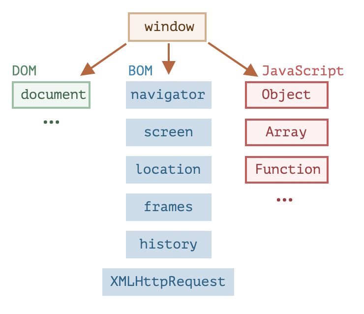

```toc
```

主机环境提供了自己的对象和语言核心以外的函数。Web 浏览器提供了一种控制网页的方法。Node.JS 提供了服务器端功能，等等。

下面是 JavaScript 在浏览器中运行时的鸟瞰示意图：


有一个叫做 `window` 的“根”对象。它有两个角色：

1. 首先，它是 JavaScript 代码的全局对象，如 [全局对象](https://zh.javascript.info/global-object) 一章所述。
2. 其次，它代表“浏览器窗口”，并提供了控制它的方法。

例如，我们可以将它用作全局对象：

```js
function sayHi() {
  alert("Hello");
}

// 全局函数是全局对象的方法：
window.sayHi();
```

## 文档对象模型-DOM

文档对象模型（Document Object Model），简称 DOM，将所有页面内容表示为可以修改的对象。

`document` 对象是页面的主要“入口点”。我们可以使用它来更改或创建页面上的任何内容。

HTML 文档的主干是标签（tag）。根据文档对象模型（DOM），每个 HTML 标签都是一个对象。嵌套的标签是闭合标签的“子标签（children）”。标签内的文本也是一个对象。所有这些对象都可以通过 JavaScript 来访问，我们可以使用它们来修改页面。

例如，`document.body` 是表示 `<body>` 标签的对象。运行这段代码会使 `<body>` 保持 3 秒红色状态:

```js
document.body.style.background = 'red'; // 将背景设置为红色
setTimeout(() => document.body.style.background = '', 3000); // 恢复回去
```


## 浏览器对象模型-BOM

浏览器对象模型（Browser Object Model），简称 BOM，表示由浏览器（主机环境）提供的用于处理文档（document）之外的所有内容的其他对象。

例如：

- [navigator](https://developer.mozilla.org/zh/docs/Web/API/Window/navigator) 对象提供了有关浏览器和操作系统的背景信息。navigator 有许多属性，但是最广为人知的两个属性是：`navigator.userAgent` —— 关于当前浏览器，`navigator.platform` —— 关于平台（有助于区分 Windows/Linux/Mac 等）。
- [location](https://developer.mozilla.org/zh/docs/Web/API/Window/location) 对象允许我们读取当前 URL，并且可以将浏览器重定向到新的 URL。

这是我们可以如何使用 `location` 对象的方法：

```js
alert(location.href); // 显示当前 URL
if (confirm("Go to Wikipedia?")) {
  location.href = "https://wikipedia.org"; // 将浏览器重定向到另一个 URL
}
```

函数 `alert/confirm/prompt` 也是 BOM 的一部分：它们与文档（document）没有直接关系，但它代表了与用户通信的纯浏览器方法。


