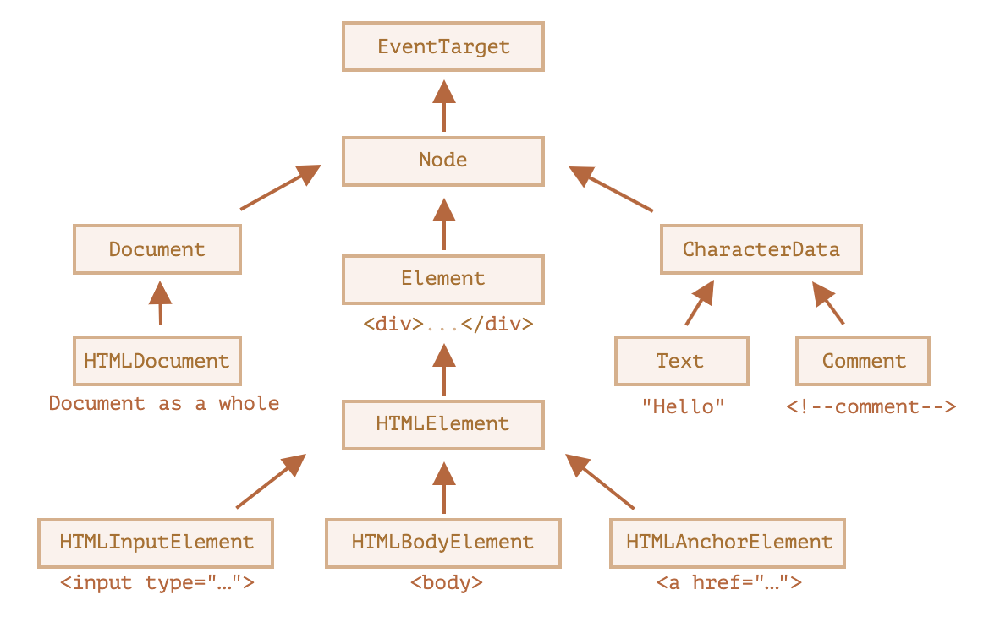

```toc
```


## DOM 节点类

不同的 DOM 节点可能有不同的属性。例如，标签 `<a>` 相对应的元素节点具有链接相关的（link-related）属性，标签 `<input>` 相对应的元素节点具有与输入相关的属性，等。文本节点与元素节点不同。但是所有这些标签对应的 DOM 节点之间也存在共有的属性和方法，因为所有类型的 DOM 节点都形成了一个单一层次的结构（single hierarchy）。

每个 DOM 节点都属于相应的内建类。

层次结构（hierarchy）的根节点是 [EventTarget](https://dom.spec.whatwg.org/#eventtarget)，[Node](https://dom.spec.whatwg.org/#interface-node) 继承自它，其他 DOM 节点继承自 Node。

下图做了进一步说明：


类如下所示：

- [EventTarget](https://dom.spec.whatwg.org/#eventtarget) —— 是一切的根“抽象（abstract）”类。
    该类的对象从未被创建。它作为一个基础，以便让所有 DOM 节点都支持所谓的“事件（event）”，我们会在之后学习它。
    
- [Node](http://dom.spec.whatwg.org/#interface-node) —— 也是一个“抽象”类，充当 DOM 节点的基础。
    它提供了树的核心功能：`parentNode`，`nextSibling`，`childNodes` 等（它们都是 getter）。`Node` 类的对象从未被创建。但是还有一些继承自它的其他类（因此继承了 `Node` 的功能）。
    
- [Document](https://dom.spec.whatwg.org/#interface-document) 由于历史原因通常被 `HTMLDocument` 继承（尽管最新的规范没有规定）—— 是一个整体的文档。
    全局变量 `document` 就是属于这个类。它作为 DOM 的入口。
    
- [CharacterData](https://dom.spec.whatwg.org/#interface-characterdata) —— 一个“抽象”类，被下述类继承：
    - [Text](https://dom.spec.whatwg.org/#interface-text) —— 对应于元素内部文本的类，例如 `<p>Hello</p>` 中的 `Hello`。
    - [Comment](https://dom.spec.whatwg.org/#interface-comment) —— 注释类。它们不会被展示出来，但每个注释都会成为 DOM 中的一员。
- [Element](http://dom.spec.whatwg.org/#interface-element) —— 是 DOM 元素的基础类。
    它提供了元素级导航（navigation），如 `nextElementSibling`，`children`，以及搜索方法，如 `getElementsByTagName` 和 `querySelector`。
    
    浏览器不仅支持 HTML，还支持 XML 和 SVG。因此，`Element` 类充当的是更具体的类的基础：`SVGElement`，`XMLElement`（我们在这里不需要它）和 `HTMLElement`。
    
- 最后，[HTMLElement](https://html.spec.whatwg.org/multipage/dom.html#htmlelement) —— 是所有 HTML 元素的基础类。我们大部分时候都会用到它。
    它会被更具体的 HTML 元素继承：
    
    - [HTMLInputElement](https://html.spec.whatwg.org/multipage/forms.html#htmlinputelement) —— `<input>` 元素的类，
    - [HTMLBodyElement](https://html.spec.whatwg.org/multipage/semantics.html#htmlbodyelement) —— `<body>` 元素的类，
    - [HTMLAnchorElement](https://html.spec.whatwg.org/multipage/semantics.html#htmlanchorelement) —— `<a>` 元素的类，
    - ……等。

还有很多其他标签具有自己的类，可能还具有特定的属性和方法，而一些元素，如 `<span>`、`<section>`、`<article>` 等，没有任何特定的属性，所以它们是 `HTMLElement` 类的实例。

因此，给定节点的全部属性和方法都是继承链的结果。例如，我们考虑一下 `<input>` 元素的 DOM 对象。它属于 [HTMLInputElement](https://html.spec.whatwg.org/multipage/forms.html#htmlinputelement) 类。

它获取属性和方法，并将其作为下列类（按继承顺序列出）的叠加：

- `HTMLInputElement` —— 该类提供特定于输入的属性，
- `HTMLElement` —— 它提供了通用（common）的 HTML 元素方法（以及 getter 和 setter）
- `Element` —— 提供通用（generic）元素方法，
- `Node` —— 提供通用 DOM 节点属性，
- `EventTarget` —— 为事件（包括事件本身）提供支持，
- ……最后，它继承自 `Object`，因为像 `hasOwnProperty` 这样的“普通对象”方法也是可用的。

我们可以通过回调来查看 DOM 节点类名，因为对象通常都具有 `constructor` 属性。它引用类的 constructor，`constructor.name` 就是它的名称：

```js
alert( document.body.constructor.name ); // HTMLBodyElement
```

或者我们可以对其使用 `toString` 方法：

```js
alert( document.body ); // [object HTMLBodyElement]
```

我们还可以使用 `instanceof` 来检查继承：

```js
alert( document.body instanceof HTMLBodyElement ); // true
alert( document.body instanceof HTMLElement ); // true
alert( document.body instanceof Element ); // true
alert( document.body instanceof Node ); // true
alert( document.body instanceof EventTarget ); // true
```

正如我们所看到的，DOM 节点是常规的 JavaScript 对象。它们使用基于原型的类进行继承。

在浏览器中，使用 `console.dir(elem)` 输出元素来查看也是非常容易的。在控制台中，你可以看到 `HTMLElement.prototype` 和 `Element.prototype` 等。

**console.dir(elem) 与 console.log(elem)**

大多数浏览器在其开发者工具中都支持这两个命令：`console.log` 和 `console.dir`。它们将它们的参数输出到控制台中。对于 JavaScript 对象，这些命令通常做的是相同的事。

但对于 DOM 元素，它们是不同的：

- `console.log(elem)` 显示元素的 DOM 树。
- `console.dir(elem)` 将元素显示为 DOM 对象，非常适合探索其属性。

你可以在 `document.body` 上尝试一下。


## nodeType 属性

`nodeType` 属性提供了另一种“过时的”用来获取 DOM 节点类型的方法。

它有一个数值型值（numeric value）：

- 对于元素节点 `elem.nodeType == 1`，
- 对于文本节点 `elem.nodeType == 3`，
- 对于 document 对象 `elem.nodeType == 9`，
- 在 [规范](https://dom.spec.whatwg.org/#node) 中还有一些其他值。

```js
<body>
  <script>
  let elem = document.body;

  // 让我们检查一下：elem 中的节点类型是什么？
  alert(elem.nodeType); // 1 => element

  // 它的第一个子节点的类型是……
  alert(elem.firstChild.nodeType); // 3 => text

  // 对于 document 对象，类型是 9
  alert( document.nodeType ); // 9
  </script>
</body>
```

在现代脚本中，我们可以使用 `instanceof` 和其他基于类的检查方法来查看节点类型，但有时 `nodeType` 可能更简单。我们只能读取 `nodeType` 而不能修改它。

## 标签：nodeName 和 tagName

给定一个 DOM 节点，我们可以从 `nodeName` 或者 `tagName` 属性中读取它的标签名：

```js
alert( document.body.nodeName ); // BODY
alert( document.body.tagName ); // BODY
```

tagName 和 nodeName 之间有什么不同吗？

当然，差异就体现在它们的名字上，但确实有些微妙。

- `tagName` 属性仅适用于 `Element` 节点。
- `nodeName` 是为任意 `Node` 定义的：
    - 对于元素，它的意义与 `tagName` 相同。
    - 对于其他节点类型（text，comment 等），它拥有一个对应节点类型的字符串。

换句话说，`tagName` 仅受元素节点支持（因为它起源于 `Element` 类），而 `nodeName` 则可以说明其他节点类型。

例如，我们比较一下 `document` 的 `tagName` 和 `nodeName`，以及一个注释节点：

```html
<body><!-- comment -->
  <script>
    // for comment
    alert( document.body.firstChild.tagName ); // undefined（不是一个元素）
    alert( document.body.firstChild.nodeName ); // #comment

    // for document
    alert( document.tagName ); // undefined（不是一个元素）
    alert( document.nodeName ); // #document
  </script>
</body>
```

如果我们只处理元素，那么 `tagName` 和 `nodeName` 这两种方法，我们都可以使用，没有区别。

## innerHTML-内容

[innerHTML](https://w3c.github.io/DOM-Parsing/#the-innerhtml-mixin) 属性允许将元素中的 HTML 获取为字符串形式。其实就是整个 `body` 内容。

我们也可以修改它。因此，它是更改页面最有效的方法之一。

下面这个示例显示了 `document.body` 中的内容，然后将其完全替换：

```html
<body>
  <p>A paragraph</p>
  <div>A div</div>
  <script>
    alert( document.body.innerHTML ); // 读取当前内容
    document.body.innerHTML = 'The new BODY!'; // 替换它
  </script>
</body>
```

我们可以尝试插入无效的 HTML，浏览器会修复我们的错误：

```html
<body>
  <script>
    document.body.innerHTML = '<b>test'; // 忘记闭合标签
    alert( document.body.innerHTML ); // <b>test</b>（被修复了）
  </script>
</body>
```

不要使用 `innerHTML+=`，其做了以下工作：
1. 移除旧的内容。
2. 然后写入新的 `innerHTML`（新旧结合）。

所以会导致原有内容完全重写，和我们最初目的不一致。

## outerHTML-元素的完整 HTML

`outerHTML` 属性包含了元素的完整 HTML。就像 `innerHTML` 加上元素本身一样。下面是一个示例：

```html
<div id="elem">Hello <b>World</b></div>
<script>
  alert(elem.outerHTML); // <div id="elem">Hello <b>World</b></div>
</script>
```

**注意：与 `innerHTML` 不同，写入 `outerHTML` 不会改变元素。而是在 DOM 中替换它。** 是的，听起来很奇怪，它确实很奇怪，这就是为什么我们在这里对此做了一个单独的注释。看一下。

考虑下面这个示例：

```html
<div>Hello, world!</div>

<script>
  let div = document.querySelector('div');

  // 使用 <p>...</p> 替换 div.outerHTML
  div.outerHTML = '<p>A new element</p>'; // (*)

  // 蛤！'div' 还是原来那样！
  alert(div.outerHTML); // <div>Hello, world!</div> (**)
</script>
```

在 `div.outerHTML=...` 中发生的事情是：

- `div` 被从文档（document）中移除。
- 另一个 HTML 片段 `<p>A new element</p>` 被插入到其位置上。
- `div` 仍拥有其旧的值。新的 HTML 没有被赋值给任何变量。


## nodeValue, data-文本节点内容

`innerHTML` 属性仅对元素节点有效。

其他节点类型，例如文本节点，具有它们的对应项：`nodeValue` 和 `data` 属性。这两者在实际使用中几乎相同，只有细微规范上的差异。因此，我们将使用 `data`，因为它更短。

读取文本节点和注释节点的内容的示例：

```html
<body>
  Hello
  <!-- Comment -->
  <script>
    let text = document.body.firstChild;
    alert(text.data); // Hello

    let comment = text.nextSibling;
    alert(comment.data); // Comment
  </script>
</body>
```


## textContent-纯文本

`textContent` 提供了对元素内的 **文本** 的访问权限：仅文本，去掉所有 `<tags>`。例如：

```html
<div id="news">
  <h1>Headline!</h1>
  <p>Martians attack people!</p>
</div>

<script>
  // Headline! Martians attack people!
  alert(news.textContent);
</script>
```

正如我们所看到，只返回文本，就像所有 `<tags>` 都被剪掉了一样，但实际上其中的文本仍然存在。在实际开发中，用到这样的文本读取的场景非常少。

**写入 `textContent` 要有用得多，因为它允许以“安全方式”写入文本。**

假设我们有一个用户输入的任意字符串，我们希望将其显示出来。

- 使用 `innerHTML`，我们将其“作为 HTML”插入，带有所有 HTML 标签。
- 使用 `textContent`，我们将其“作为文本”插入，所有符号（symbol）均按字面意义处理。

比较两者：

```html
<body>
    <div id="elem1"></div>
    <div id="elem2"></div>
    <script>
        let pro = prompt("what's your name", "<b>Winnie-the-Pooh</b>");

        let elem1 = document.getElementById("elem1");
        let elem2 = document.getElementById("elem2");

        elem1.innerHTML = pro;
        elem2.textContent = pro;
    </script>
</body>
```

1. 第一个 `<div>` 获取 name “作为 HTML”：所有标签都变成标签，所以我们可以看到粗体的 name。
2. 第二个 `<div>` 获取 name “作为文本”，因此我们可以从字面上看到 `<b>Winnie-the-Pooh!</b>`。

## hidden 属性

“hidden” 特性（attribute）和 DOM 属性（property）指定元素是否可见。

我们可以在 HTML 中使用它，或者使用 JavaScript 对其进行赋值，如下所示：
```html
<div>Both divs below are hidden</div>
<div id="elem" hidden>With the attribute "hidden"</div>
<div>JavaScript assigned the property "hidden"</div>

<script>
    let divs = document.body.getElementsByTagName("div");
    let elem = divs[1];
    elem.hidden = false;
</script>
```

从技术上来说，`hidden` 与 `style="display:none"` 做的是相同的事。但 `hidden` 写法更简洁。

## 更多属性

DOM 元素还有其他属性，特别是那些依赖于 class 的属性：

- `value` —— `<input>`，`<select>` 和 `<textarea>`（`HTMLInputElement`，`HTMLSelectElement`……）的 value。
- `href` —— `<a href="...">`（`HTMLAnchorElement`）的 href。
- `id` —— 所有元素（`HTMLElement`）的 “id” 特性（attribute）的值。
- ……以及更多其他内容……

例如：

```html
<input type="text" id="elem" value="value">

<script>
  alert(elem.type); // "text"
  alert(elem.id); // "elem"
  alert(elem.value); // value
</script>
```


