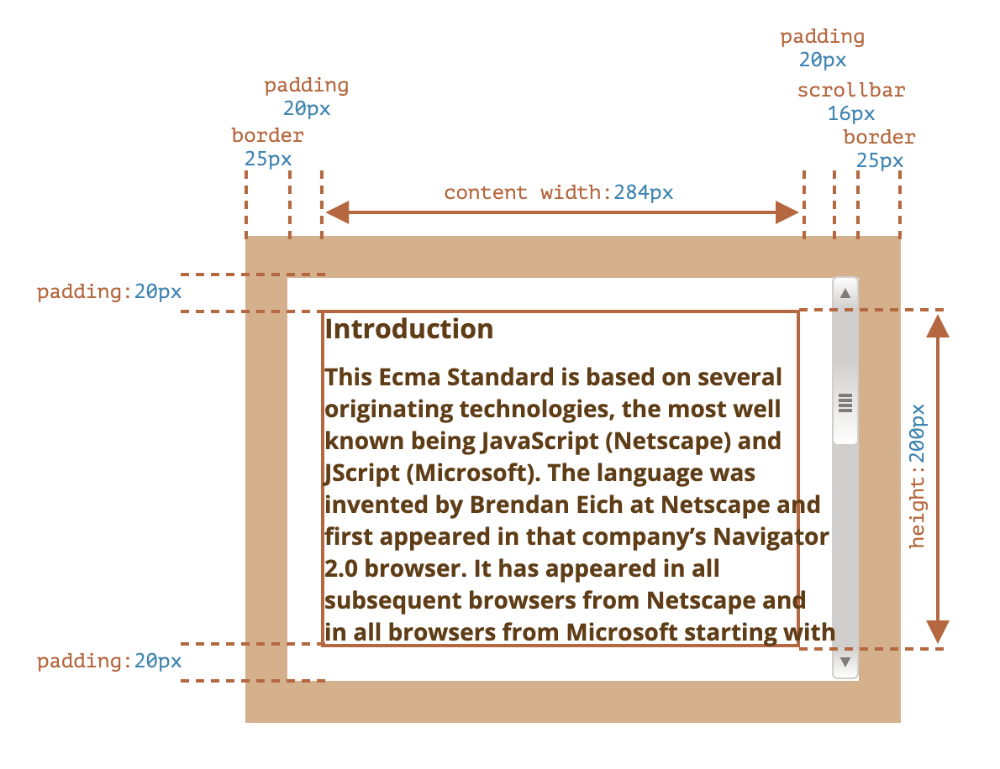
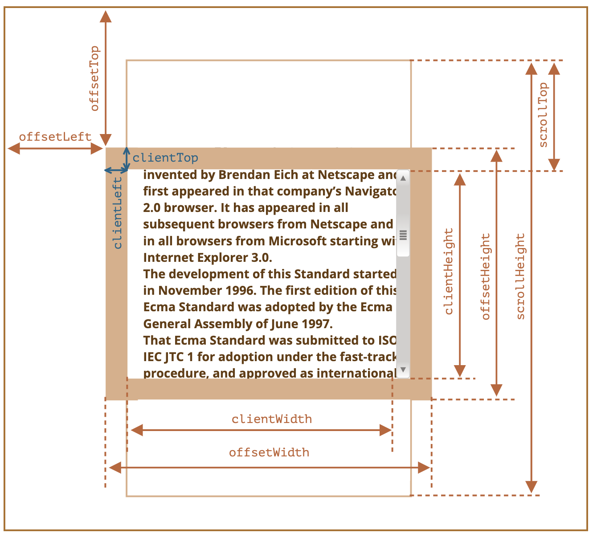

```toc
```


## 示例元素

```html
<div id="example">
  ...Text...
</div>
<style>
  #example {
    width: 300px;
    height: 200px;
    border: 25px solid #E8C48F;
    padding: 20px;
    overflow: auto;
  }
</style>
```

它有边框（border），内边距（padding）和滚动（scrolling）等全套功能。但没有外边距（margin），因为它们不是元素本身的一部分，并且它们没什么特殊的属性。

这个元素看起来就像这样：



## 几何

这是带有几何属性的整体图片：



这些属性的值在技术上讲是数字，但这些数字其实是“像素（pixel）”，因此它们是像素测量值。

### offsetParent, offsetLeft/Top


