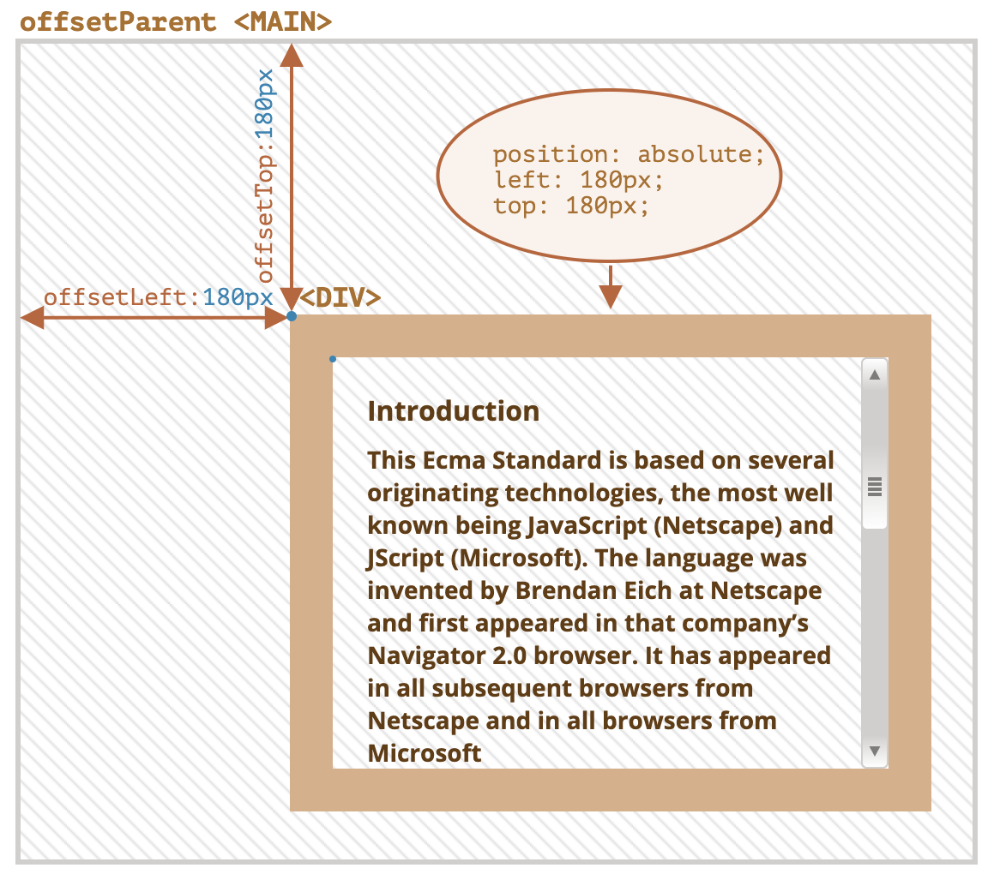
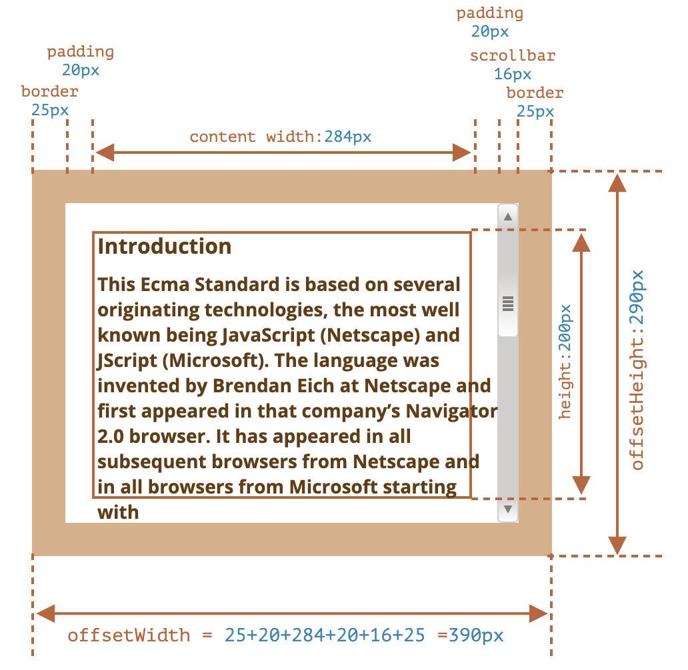
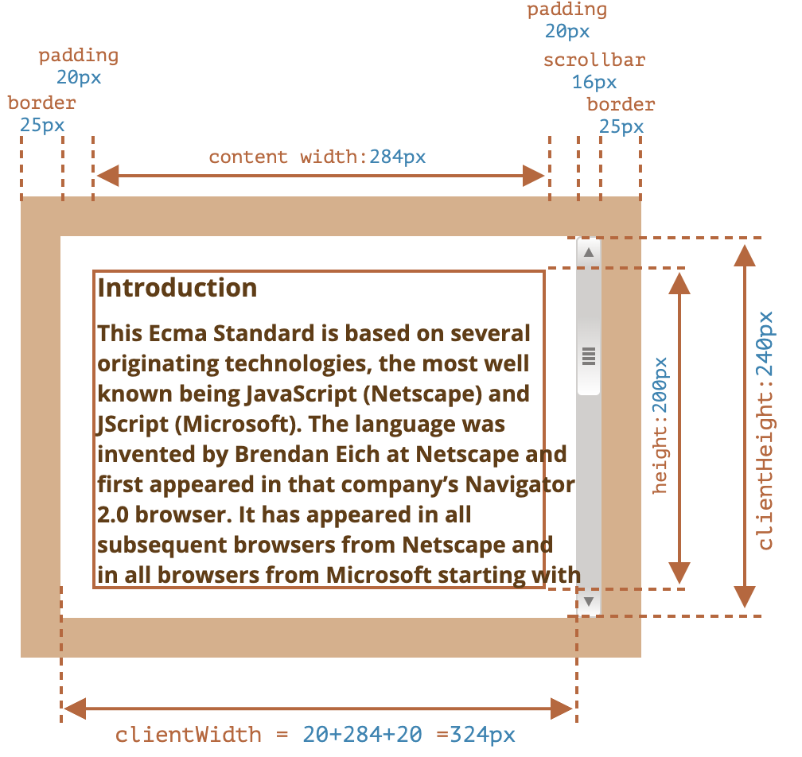
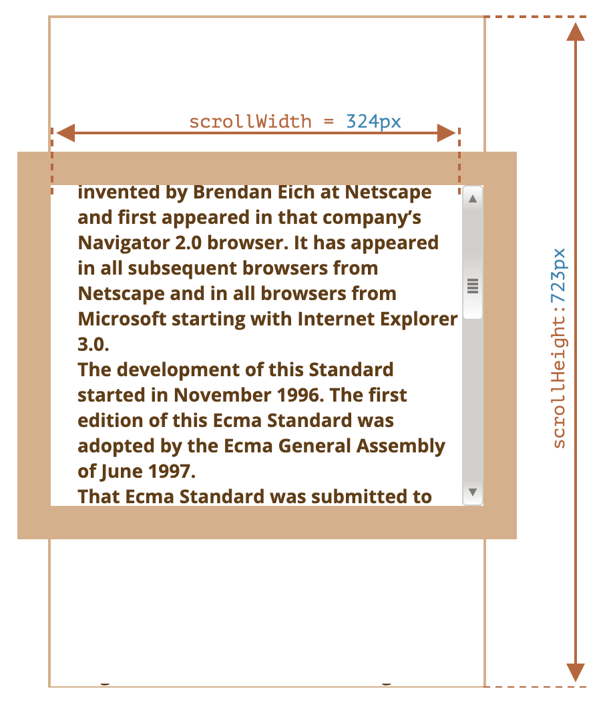

```toc
```


## 示例元素

```html
<div id="example">
  ...Text...
</div>
<style>
  #example {
    width: 300px;
    height: 200px;
    border: 25px solid #E8C48F;
    padding: 20px;
    overflow: auto;
  }
</style>
```

它有边框（border），内边距（padding）和滚动（scrolling）等全套功能。但没有外边距（margin），因为它们不是元素本身的一部分，并且它们没什么特殊的属性。

这个元素看起来就像这样：


## 几何

这是带有几何属性的整体图片：


这些属性的值在技术上讲是数字，但这些数字其实是“像素（pixel）”，因此它们是像素测量值。

### offsetParent, offsetLeft/Top

这些属性很少使用，但它们仍然是“最外面”的几何属性，所以我们将从它们开始。

`offsetParent` 是最接近的祖先（ancestor），在浏览器渲染期间，它被用于计算坐标。最近的祖先为下列之一：

1. CSS 定位的（`position` 为 `absolute`、`relative`、`fixed` 或 `sticky`），
2. 或 `<td>`，`<th>`，`<table>`，
3. 或 `<body>`。

属性 `offsetLeft/offsetTop` 提供相对于 `offsetParent` 左上角的 x/y 坐标。

在下面这个例子中，内部的 `<div>` 有 `<main>` 作为 `offsetParent`，并且 `offsetLeft/offsetTop` 让它从左上角位移（`180`）：

```html
<main style="position: relative" id="main">
  <article>
    <div id="example" style="position: absolute; left: 180px; top: 180px">...</div>
  </article>
</main>
<script>
  alert(example.offsetParent.id); // main
  alert(example.offsetLeft); // 180（注意：这是一个数字，不是字符串 "180px"）
  alert(example.offsetTop); // 180
</script>
```




也就是这里的 offsetLeft 和 offsetTop 对应 left 和 top。

有以下几种情况下，`offsetParent` 的值为 `null`：

1. 对于未显示的元素（`display:none` 或者不在文档中）。
2. 对于 `<body>` 与 `<html>`。
3. 对于带有 `position:fixed` 的元素。


### offsetWidth/Height现在，让我们继续关注元素本身。

这两个属性是最简单的。它们提供了元素的“外部” width/height。或者，换句话说，它的完整大小（包括边框）。



对于我们的示例元素：
- `offsetWidth = 390` —— 外部宽度（width），可以计算为内部 CSS-width（`300px`）加上 padding（`2 * 20px`）和 border（`2 * 25px`）。
- `offsetHeight = 290` —— 外部高度（height）。


### clientTop/Left

在元素内部，我们有边框（border）。

为了测量它们，可以使用 `clientTop` 和 `clientLeft`。

在我们的例子中：
- `clientLeft = 25` —— 左边框宽度
- `clientTop = 25` —— 上边框宽度

如果设置了 border 值，那其实就表明上面这两个值是一致的。

### clientWidth/Height

这些属性提供了元素边框内区域的大小。

它们包括了 “content width” 和 “padding”，但不包括滚动条宽度（scrollbar）：


在上图中，我们首先考虑 `clientHeight`。

这里没有水平滚动条，所以它恰好是 border 内的总和：CSS-height `200px` 加上顶部和底部的 padding（`2 * 20px`），总计 `240px`。

现在 `clientWidth` —— 这里的 “content width” 不是 `300px`，而是 `284px`，因为被滚动条占用了 `16px`。所以加起来就是 `284px` 加上左侧和右侧的 padding，总计 `324px`。

**如果这里没有 padding，那么 `clientWidth/Height` 代表的就是内容区域，即 border 和 scrollbar（如果有）内的区域。**

### scrollWidth/Height

这些属性就像 `clientWidth/clientHeight`，但它们还包括滚动出（隐藏）的部分：


在上图中：

- `scrollHeight = 723` —— 是内容区域的完整内部高度，包括滚动出的部分。
- `scrollWidth = 324` —— 是完整的内部宽度，这里我们没有水平滚动，因此它等于 `clientWidth`。

我们可以使用这些属性将元素展开（expand）到整个 width/height。注意：scrollWidth 不包含 scrollbar。

### scrollLeft/scrollTop

属性 `scrollLeft/scrollTop` 是元素的隐藏、滚动部分的 width/height。在下图中，我们可以看到带有垂直滚动块的 `scrollHeight` 和 `scrollTop`。


换句话说，`scrollTop` 就是“已经滚动了多少”。大多数几何属性是只读的，但是 `scrollLeft/scrollTop` 是可修改的，并且浏览器会滚动该元素。

## 不要从 CSS 中获取 width/height

我们刚刚介绍了 DOM 元素的几何属性，它们可用于获得宽度、高度和计算距离。

但是，正如我们在 [样式和类](https://zh.javascript.info/styles-and-classes) 一章所知道的那样，我们可以使用 `getComputedStyle` 来读取 CSS-width 和 height。

那为什么不像这样用 `getComputedStyle` 读取元素的 width 呢？

```js
let elem = document.body;
alert( getComputedStyle(elem).width ); // 显示 elem 的 CSS width
```

为什么我们应该使用几何属性呢？这里有两个原因：

1. 首先，CSS `width/height` 取决于另一个属性：`box-sizing`，它定义了“什么是” CSS 宽度和高度。出于 CSS 的目的而对 `box-sizing` 进行的更改可能会破坏此类 JavaScript 操作。
    
2. 其次，CSS 的 `width/height` 可能是 `auto`，例如内联（inline）元素：

```html
<span id="elem">Hello!</span>
<script>
  alert( getComputedStyle(elem).width ); // auto
</script>
```

从 CSS 的观点来看，`width:auto` 是完全正常的，但在 JavaScript 中，我们需要一个确切的 `px` 大小，以便我们在计算中使用它。因此，这里的 CSS 宽度没什么用。


