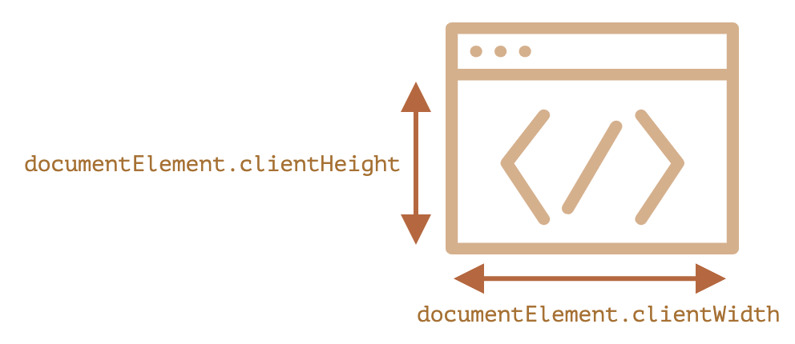

```toc
```

## 窗口的 width/height

为了获取窗口（window）的宽度和高度，我们可以使用 `document.documentElement` 的 `clientWidth/clientHeight`：



如
```js
console.log(document.documentElement.clientHeight);
```


**不是 `window.innerWidth/innerHeight`**

浏览器也支持像 `window.innerWidth/innerHeight` 这样的属性。它们看起来像我们想要的，那为什么不使用它们呢？

如果这里存在一个滚动条，并且滚动条占用了一些空间，那么 `clientWidth/clientHeight` 会提供没有滚动条（减去它）的 width/height。换句话说，它们返回的是可用于内容的文档的可见部分的 width/height。

`window.innerWidth/innerHeight` 包括了滚动条。如果这里有一个滚动条，它占用了一些空间，那么这两行代码会显示不同的值：

```js
alert( window.innerWidth ); // 整个窗口的宽度
alert( document.documentElement.clientWidth ); // 减去滚动条宽度后的窗口宽度
```

在大多数情况下，我们需要 **可用** 的窗口宽度以绘制或放置某些东西。也就是说，在滚动条内（如果有）。所以，我们应该使用 `documentElement.clientHeight/clientWidth`。


## 文档的 width/height

从理论上讲，由于根文档元素是 `document.documentElement`，并且它包围了所有内容，因此我们可以通过使用 `documentElement.scrollWidth/scrollHeight` 来测量文档的完整大小。

但是在该元素上，对于整个文档，这些属性均无法正常工作。在 Chrome/Safari/Opera 中，如果没有滚动条，`documentElement.scrollHeight` 甚至可能小于 `documentElement.clientHeight`！很奇怪，对吧？

为了可靠地获得完整的文档高度，我们应该采用以下这些属性的最大值：

```js
let scrollHeight = Math.max(
  document.body.scrollHeight, document.documentElement.scrollHeight,
  document.body.offsetHeight, document.documentElement.offsetHeight,
  document.body.clientHeight, document.documentElement.clientHeight
);

alert('Full document height, with scrolled out part: ' + scrollHeight);
```

## 获得当前滚动

DOM 元素的当前滚动状态在其 `scrollLeft/scrollTop` 属性中。

对于文档滚动，在大多数浏览器中，我们可以使用 `document.documentElement.scrollLeft/scrollTop`，但在较旧的基于 WebKit 的浏览器中则不行，例如在 Safari（bug [5991](https://bugs.webkit.org/show_bug.cgi?id=5991)）中，我们应该使用 `document.body` 而不是 `document.documentElement`。

幸运的是，我们根本不必记住这些特性，因为我们可以从 `window.pageXOffset/pageYOffset` 中获取页面当前滚动信息：

```js
// window.pageXOffset 是 window.scrollX 的别名。
// window.pageYOffset 是 window.scrollY 的别名。
alert('当前已从顶部滚动：' + window.pageYOffset);
alert('当前已从左侧滚动：' + window.pageXOffset);
```
这些属性是只读的。

## 滚动：scrollTo，ScrollBy，ScrollIntoView

**重要：**
>必须在 DOM 完全构建好之后才能通过 JavaScript 滚动页面。例如，如果我们尝试通过 `<head>` 中的脚本滚动页面，它将无法正常工作。


可以通过更改 `scrollTop/scrollLeft` 来滚动常规元素。我们可以使用 `document.documentElement.scrollTop/scrollLeft` 对页面进行相同的操作（Safari 除外，而应该使用 `document.body.scrollTop/Left` 代替）。

或者，有一个更简单的通用解决方案：使用特殊方法 [window.scrollBy(x,y)](https://developer.mozilla.org/zh/docs/Web/API/Window/scrollBy) 和 [window.scrollTo(pageX,pageY)](https://developer.mozilla.org/zh/docs/Web/API/Window/scrollTo)。

- 方法 `scrollBy(x,y)` 将页面滚动至 **相对于当前位置的 `(x, y)` 位置**。例如，`scrollBy(0,10)` 会将页面向下滚动 `10px`。
- 方法 `scrollTo(pageX,pageY)` 将页面滚动至 **绝对坐标**，使得可见部分的左上角具有相对于文档左上角的坐标 `(pageX, pageY)`。就像设置了 `scrollLeft/scrollTop` 一样。要滚动到最开始，我们可以使用 `scrollTo(0,0)`。


### ScrollIntoView


为了完整起见，让我们再介绍一种方法：[elem.scrollIntoView(top)](https://developer.mozilla.org/zh/docs/Web/API/Element/scrollIntoView)。

对 `elem.scrollIntoView(top)` 的调用将滚动页面以使 `elem` 可见。它有一个参数：

- 如果 `top=true`（默认值），页面滚动，使 `elem` 出现在窗口顶部。元素的上边缘将与窗口顶部对齐。
- 如果 `top=false`，页面滚动，使 `elem` 出现在窗口底部。元素的底部边缘将与窗口底部对齐。


### 禁止滚动

有时候我们需要使文档“不可滚动”。例如，当我们需要用一条需要立即引起注意的大消息来覆盖文档时，我们希望访问者与该消息而不是与文档进行交互。

要使文档不可滚动，只需要设置 `document.body.style.overflow = "hidden"`。该页面将“冻结”在其当前滚动位置上。我们还可以使用相同的技术来冻结其他元素的滚动，而不仅仅是 `document.body`。

这个方法的缺点是会使滚动条消失。如果滚动条占用了一些空间，它原本占用的空间就会空出来，那么内容就会“跳”进去以填充它。


```js
// 禁止滚动
document.body.style.overflow = "hidden";
// 恢复滚动
document.body.style.overflow = ""
```


