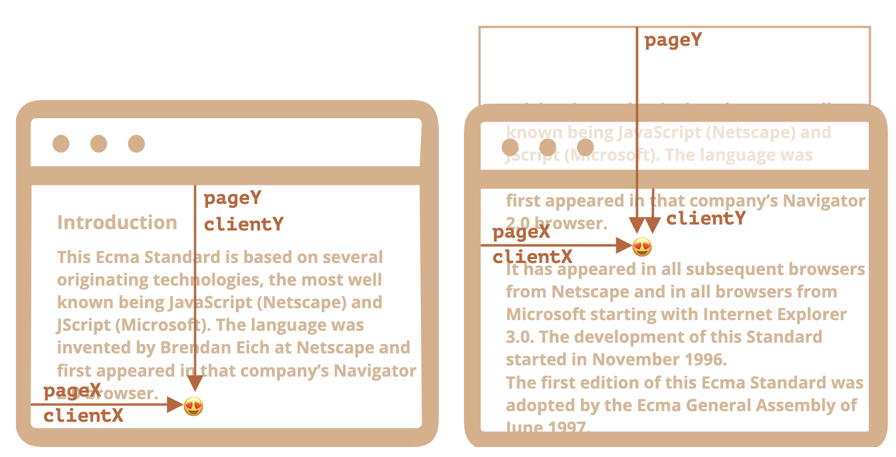
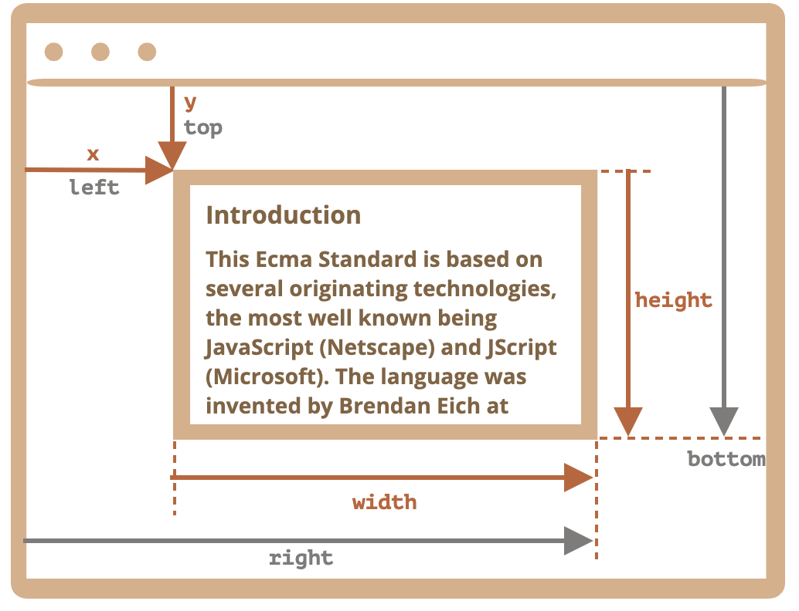

```toc
```


大多数 JavaScript 方法处理的是以下两种坐标系中的一个：

1. **相对于窗口** —— 类似于 `position:fixed`，从窗口的顶部/左侧边缘计算得出。
    - 我们将这些坐标表示为 `clientX/clientY`，当我们研究事件属性时，就会明白为什么使用这种名称来表示坐标。
2. **相对于文档** —— 与文档根（document root）中的 `position:absolute` 类似，从文档的顶部/左侧边缘计算得出。
    - 我们将它们表示为 `pageX/pageY`。

当页面滚动到最开始时，此时窗口的左上角恰好是文档的左上角，它们的坐标彼此相等。但是，在文档移动之后，元素的窗口相对坐标会发生变化，因为元素在窗口中移动，而元素在文档中的相对坐标保持不变。

在下图中，我们在文档中取一点，并演示了它滚动之前（左）和之后（右）的坐标：



当文档滚动了：

- `pageY` —— 元素在文档中的相对坐标保持不变，从文档顶部（现在已滚动出去）开始计算。
- `clientY` —— 窗口相对坐标确实发生了变化（箭头变短了），因为同一个点越来越靠近窗口顶部。

## 元素坐标：getBoundingClientRect

方法 `elem.getBoundingClientRect()` 返回最小矩形的窗口坐标，该矩形将 `elem` 作为内建 [DOMRect](https://www.w3.org/TR/geometry-1/#domrect) 类的对象。

主要的 `DOMRect` 属性：

- `x/y` —— 矩形原点相对于窗口的 X/Y 坐标，
- `width/height` —— 矩形的 width/height（可以为负）。

此外，还有派生（derived）属性：

- `top/bottom` —— 顶部/底部矩形边缘的 Y 坐标，
- `left/right` —— 左/右矩形边缘的 X 坐标。

下面这张是 `elem.getBoundingClientRect()` 的输出的示意图：



正如你所看到的，`x/y` 和 `width/height` 对矩形进行了完整的描述。可以很容易地从它们计算出派生（derived）属性：

- `left = x`
- `top = y`
- `right = x + width`
- `bottom = y + height`

请注意：

- 坐标可能是小数，例如 `10.5`。这是正常的，浏览器内部使用小数进行计算。在设置 `style.left/top` 时，我们不是必须对它们进行舍入。
- 坐标可能是负数。例如滚动页面，使 `elem` 现在位于窗口的上方，则 `elem.getBoundingClientRect().top` 为负数。


## `elementFromPoint(x,y)`

对 `document.elementFromPoint(x, y)` 的调用会返回在窗口坐标 `(x, y)` 处嵌套最多（the most nested）的元素 (其实就是从用户来看，最上面的元素，因为 css 往往可能会有多个元素叠加在一起)。这里的坐标 `x` 和 `y` 是相对于视口（viewport）的像素位置，而不是相对于文档的绝对位置。这意味着，如果页面有滚动，你需要考虑滚动的距离来获取正确的元素。

语法如下：

```js
let elem = document.elementFromPoint(x, y);
```

例如，下面的代码会高亮显示并输出现在位于窗口中间的元素的标签：

```js
let centerX = document.documentElement.clientWidth / 2;
let centerY = document.documentElement.clientHeight / 2;

let elem = document.elementFromPoint(centerX, centerY);

elem.style.background = "red";
alert(elem.tagName);
```

因为它使用的是窗口坐标，所以元素可能会因当前滚动位置而有所不同。

## 用于 fixed 定位

大多数时候，我们需要使用坐标来确定某些内容的位置。

想要在某元素附近展示内容，我们可以使用 `getBoundingClientRect` 来获取这个元素的坐标，然后使用 CSS `position` 以及 `left/top`（或 `right/bottom`）。

例如，下面的函数 `createMessageUnder(elem, html)` 在 `elem` 下显示了消息：

```js
let elem = document.getElementById("coords-show-mark");

function createMessageUnder(elem, html) {
  // 创建 message 元素
  let message = document.createElement('div');
  // 在这里最好使用 CSS class 来定义样式
  message.style.cssText = "position:fixed; color: red";

  // 分配坐标，不要忘记 "px"！
  let coords = elem.getBoundingClientRect();

  message.style.left = coords.left + "px";
  message.style.top = coords.bottom + "px";

  message.innerHTML = html;

  return message;
}

// 用法：
// 在文档中添加 message 保持 5 秒
let message = createMessageUnder(elem, 'Hello, world!');
document.body.append(message);
setTimeout(() => message.remove(), 5000);
```

是请注意一个重要的细节：滚动页面时，消息就会从按钮流出。原因很显然：message 元素依赖于 `position:fixed`，因此当页面滚动时，它仍位于窗口的同一位置。要改变这一点，我们需要使用基于文档（document）的坐标和 `position:absolute` 样式。

## 文档坐标

文档相对坐标从文档的左上角开始计算，而不是窗口。

在 CSS 中，窗口坐标对应于 `position:fixed`，而文档坐标与顶部的 `position:absolute` 类似。

我们可以使用 `position:absolute` 和 `top/left` 来把某些内容放到文档中的某个位置，以便在页面滚动时，元素仍能保留在该位置。但是我们首先需要正确的坐标。

这里没有标准方法来获取元素的文档坐标。但是写起来很容易。

这两个坐标系统通过以下公式相连接：

- `pageY` = `clientY` + 文档的垂直滚动出的部分的高度。
- `pageX` = `clientX` + 文档的水平滚动出的部分的宽度。

函数 `getCoords(elem)` 将从 `elem.getBoundingClientRect()` 获取窗口坐标，并向其中添加当前滚动：

```js
// 获取元素的文档坐标
function getCoords(elem) {
  let box = elem.getBoundingClientRect();

  return {
    top: box.top + window.pageYOffset,// pageYOffset就是滚动部分
    right: box.right + window.pageXOffset,
    bottom: box.bottom + window.pageYOffset,
    left: box.left + window.pageXOffset
  };
}
```

如果在上面的示例中，我们将其与 `position:absolute` 一起使用，则在页面滚动时，消息仍停留在元素附近。

修改后的 `createMessageUnder` 函数：

```js
function createMessageUnder(elem, html) {
  let message = document.createElement('div');
  message.style.cssText = "position:absolute; color: red";

  let coords = getCoords(elem);

  message.style.left = coords.left + "px";
  message.style.top = coords.bottom + "px";

  message.innerHTML = html;

  return message;
}
```

也就是如果设置为绝对位置，那么获得位置后将不会再改变，否则会因为滚动而改变。


