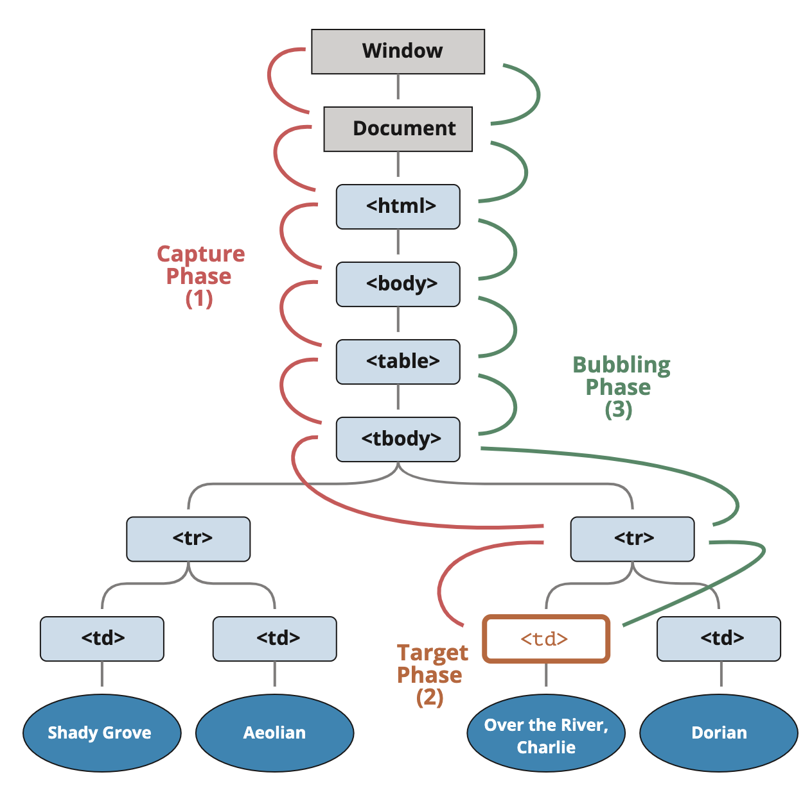

```toc
```

让我们从一个示例开始。

处理程序（handler）被分配给了 `<div>`，但是如果你点击任何嵌套的标签（例如 `<em>` 或 `<code>`），该处理程序也会运行：

```html
<div onclick="alert('The handler!')">
  <em>If you click on <code>EM</code>, the handler on <code>DIV</code> runs.</em>
</div>
```

这是不是有点奇怪？如果实际上点击的是 `<em>`，为什么在 `<div>` 上的处理程序会运行？

## 冒泡

冒泡（bubbling）原理很简单。

**当一个事件发生在一个元素上，它会首先运行在该元素上的处理程序，然后运行其父元素上的处理程序，然后一直向上到其他祖先上的处理程序。**

假设我们有 3 层嵌套 `FORM > DIV > P`，它们各自拥有一个处理程序：

```html
<style>
  body * {
    margin: 10px;
    border: 1px solid blue;
  }
</style>

<form onclick="alert('form')">FORM
  <div onclick="alert('div')">DIV
    <p onclick="alert('p')">P</p>
  </div>
</form>
```

点击内部的 `<p>` 会首先运行 `onclick`：
1. 在该 `<p>` 上的。
2. 然后是外部 `<div>` 上的。
3. 然后是外部 `<form>` 上的。
4. 以此类推，直到最后的 `document` 对象。

因此，如果我们点击 `<p>`，那么我们将看到 3 个 alert：`p` → `div` → `form`。

这个过程被称为“冒泡（bubbling）”，因为事件从内部元素“冒泡”到所有父级，就像在水里的气泡一样。

**几乎**所有事件都会冒泡。
>这句话中的关键词是“几乎”。例如，`focus` 事件不会冒泡。同样，我们以后还会遇到其他例子。但这仍然是例外，而不是规则，大多数事件的确都是冒泡的。


## `event.target`

父元素上的处理程序始终可以获取事件实际发生位置的详细信息。

**引发事件的那个嵌套层级最深的元素被称为目标元素,可以通过 `event.target` 访问。**

注意与 `this`（=`event.currentTarget`）之间的区别：

- `event.target` —— 是引发事件的“目标”元素，它在冒泡过程中不会发生变化。
- `this` —— 是“当前”元素，其中有一个当前正在运行的处理程序。

例如，如果我们有一个处理程序 `form.onclick`，那么它可以“捕获”表单内的所有点击。无论点击发生在哪里，它都会冒泡到 `<form>` 并运行处理程序。在 `form.onclick` 处理程序中：

- `this`（= `event.currentTarget`）是 `<form>` 元素，**因为处理程序在它上面运行。**
- `event.target` 是表单中实际被点击的元素。

```html
<!DOCTYPE HTML>
<html>

<head>
  <meta charset="utf-8">
  <link rel="stylesheet" href="example.css">
</head>

<body>
  A click shows both <code>event.target</code> and <code>this</code> to compare:

  <form id="form">FORM
    <div>DIV
      <p>P</p>
    </div>
  </form>

  <script>
  form.onclick = function(event) {
    event.target.style.backgroundColor = 'yellow';
    // chrome needs some time to paint yellow
    setTimeout(() => {
      alert("target = " + event.target.tagName + ", this=" + this.tagName);
      event.target.style.backgroundColor = ''
    }, 0);
  };
  </script>
</body>
</html>
```

```css
form {
  background-color: green;
  position: relative;
  width: 150px;
  height: 150px;
  text-align: center;
  cursor: pointer;
}

div {
  background-color: blue;
  position: absolute;
  top: 25px;
  left: 25px;
  width: 100px;
  height: 100px;
}

p {
  background-color: red;
  position: absolute;
  top: 25px;
  left: 25px;
  width: 50px;
  height: 50px;
  line-height: 50px;
  margin: 0;
}

body {
  line-height: 25px;
  font-size: 16px;
}
```


## 停止冒泡

冒泡事件从目标元素开始向上冒泡。通常，它会一直上升到 `<html>`，然后再到 `document` 对象，有些事件甚至会到达 `window`，它们会调用路径上所有的处理程序。

但是任意处理程序都可以决定事件已经被完全处理，并停止冒泡。用于停止冒泡的方法是 `event.stopPropagation()`。例如，如果你点击 `<button>`，这里的 `body.onclick` 不会工作：

```html
<body onclick="alert(`the bubbling doesn't reach here`)">
  <button onclick="event.stopPropagation()">Click me</button>
</body>
```

**`event.stopImmediatePropagation()`**

如果一个元素在一个事件上有多个处理程序，即使其中一个停止冒泡，其他处理程序仍会执行。换句话说，`event.stopPropagation()` 停止向上移动，但是当前元素上的其他处理程序都会继续运行。

有一个 `event.stopImmediatePropagation()` 方法，可以用于停止冒泡，并阻止当前元素上的处理程序运行。使用该方法之后，其他处理程序就不会被执行。

**不要在没有需要的情况下停止冒泡！**
>通常，没有真正的必要去阻止冒泡。一项看似需要阻止冒泡的任务，可以通过其他方法解决。其中之一就是使用自定义事件，稍后我们会介绍它们。此外，我们还可以将我们的数据写入一个处理程序中的 `event` 对象，并在另一个处理程序中读取该数据，这样我们就可以向父处理程序传递有关下层处理程序的信息。

## 捕获

事件处理的另一个阶段被称为“捕获（capturing）”。它很少被用在实际开发中，但有时是有用的。

[DOM 事件](http://www.w3.org/TR/DOM-Level-3-Events/)标准描述了事件传播的 3 个阶段：

1. 捕获阶段（Capturing phase）—— 事件（从 Window）向下走近元素。
2. 目标阶段（Target phase）—— 事件到达目标元素。
3. 冒泡阶段（Bubbling phase）—— 事件从元素上开始冒泡。

下面是在表格中点击 `<td>` 的图片，摘自规范：



也就是说：点击 `<td>`，事件首先通过祖先链向下到达元素（捕获阶段），然后到达目标（目标阶段），最后上升（冒泡阶段），在途中调用处理程序。

**之前，我们只讨论了冒泡，因为捕获阶段很少被使用。通常我们看不到它。**

使用 `on<event>` 属性或使用 HTML 特性（attribute）或使用两个参数的 `addEventListener(event, handler)` 添加的处理程序，对捕获一无所知，它们仅在第二阶段和第三阶段运行。

为了在捕获阶段捕获事件，我们需要将处理程序的 `capture` 选项设置为 `true`：

```js
elem.addEventListener(..., {capture: true})
// 或者，用 {capture: true} 的别名 "true"
elem.addEventListener(..., true)
```

`capture` 选项有两个可能的值：
- 如果为 `false`（默认值），则在冒泡阶段设置处理程序。
- 如果为 `true`，则在捕获阶段设置处理程序。

请注意，虽然形式上有 3 个阶段，但第 2 阶段（“目标阶段”：事件到达元素）没有被单独处理：捕获阶段和冒泡阶段的处理程序都在该阶段被触发。让我们来看看捕获和冒泡：

```js
<style>
  body * {
    margin: 10px;
    border: 1px solid blue;
  }
</style>

<form>FORM
  <div>DIV
    <p>P</p>
  </div>
</form>

<script>
  for(let elem of document.querySelectorAll('*')) {
    elem.addEventListener("click", e => alert(`Capturing: ${elem.tagName}`), true);
    elem.addEventListener("click", e => alert(`Bubbling: ${elem.tagName}`));
  }
</script>
```

上面这段代码为文档中的 **每个** 元素都设置了点击处理程序，以查看哪些元素上的点击事件处理程序生效了。

如果你点击了 `<p>`，那么顺序是：
1. `HTML` → `BODY` → `FORM` → `DIV`（捕获阶段第一个监听器）：
2. `P`（目标阶段，触发两次，因为我们设置了两个监听器：捕获和冒泡）
3. `DIV` → `FORM` → `BODY` → `HTML`（冒泡阶段，第二个监听器）。

有一个属性 `event.eventPhase`，它告诉我们捕获事件的阶段数。但它很少被使用，因为我们通常是从处理程序中了解到它。

**要移除处理程序，`removeEventListener` 需要同一阶段**
>如果我们 `addEventListener(..., true)`，那么我们应该在 `removeEventListener(..., true)` 中提到同一阶段，以正确删除处理程序。


**同一元素的同一阶段的监听器按其设置顺序运行**
>如果我们在同一阶段有多个事件处理程序，并通过 `addEventListener` 分配给了相同的元素，则它们的运行顺序与创建顺序相同：

```js
elem.addEventListener("click", e => alert(1)); // 会先被触发
elem.addEventListener("click", e => alert(2));
```


