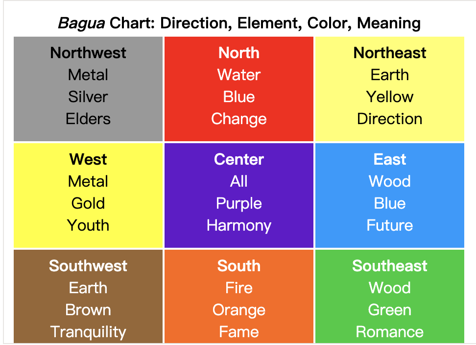

```toc
```

捕获和冒泡允许我们实现最强大的事件处理模式之一，即 **事件委托** 模式。

这个想法是，如果我们有许多以类似方式处理的元素，那么就不必为每个元素分配一个处理程序 —— 而是将单个处理程序放在它们的共同祖先上。

在处理程序中，我们获取 `event.target` 以查看事件实际发生的位置并进行处理。让我们看一个示例 —— 反映中国古代哲学的 [八卦图](http://en.wikipedia.org/wiki/Ba_gua)。如下所示：



```html
<table>
  <tr>
    <th colspan="3"><em>Bagua</em> Chart: Direction, Element, Color, Meaning</th>
  </tr>
  <tr>
    <td class="nw"><strong>Northwest</strong><br>Metal<br>Silver<br>Elders</td>
    <td class="n">...</td>
    <td class="ne">...</td>
  </tr>
  <tr>...2 more lines of this kind...</tr>
  <tr>...2 more lines of this kind...</tr>
</table>
```

该表格有 9 个单元格（cell），但可以有 99 个或 9999 个单元格，这都不重要。

**我们的任务是在点击时高亮显示被点击的单元格 `<td>`。**

与其为每个 `<td>`（可能有很多）分配一个 `onclick` 处理程序 —— 我们可以在 `<table>` 元素上设置一个“捕获所有”的处理程序。它将使用 `event.target` 来获取点击的元素并高亮显示它。

```js
let selectedTd;

table.onclick = function(event) {
  let target = event.target; // 在哪里点击的？
  if (target.tagName != 'TD') return; // 不在 TD 上？那么我们就不会在意
  highlight(target); // 高亮显示它
};

function highlight(td) {
  if (selectedTd) { // 移除现有的高亮显示，如果有的话
    selectedTd.classList.remove('highlight');
  }
  selectedTd = td;
  selectedTd.classList.add('highlight'); // 高亮显示新的 td
}
```

此代码不会关心在表格中有多少个单元格。我们可以随时动态添加/移除 `<td>`，高亮显示仍然有效。尽管如此，但还是存在缺陷。点击可能不是发生在 `<td>` 上，而是发生在其内部。在我们的例子中，如果我们看一下 HTML 内部，我们可以看到 `<td>` 内还有嵌套的标签，例如 `<strong>`：

```html
<td>
  <strong>Northwest</strong>
  ...
</td>
```

下面是改进后的代码：

```js
table.onclick = function(event) {
  let td = event.target.closest('td'); // (1)
  if (!td) return; // (2)
  if (!table.contains(td)) return; // (3)
  highlight(td); // (4)
};
```

解释：
1. `elem.closest(selector)` 方法返回与 `selector` 匹配的最近的祖先。在我们的例子中，我们从源元素开始向上寻找 `<td>`。
2. 如果 `event.target` 不在任何 `<td>` 中，那么调用将立即返回，因为这里没有什么事儿可做。
3. 对于嵌套的表格，`event.target` 可能是一个 `<td>`，但位于当前表格之外。因此我们需要检查它是否是 **我们的表格中的** `<td>`。
4. 如果是的话，就高亮显示它。

## 委托示例：标记中的行为

事件委托还有其他用途。例如，我们想要编写一个有“保存”、“加载”和“搜索”等按钮的菜单。并且，这里有一个具有 `save`、`load` 和 `search` 等方法的对象。如何匹配它们？

第一个想法可能是为每个按钮分配一个单独的处理程序。但是有一个更优雅的解决方案。我们可以为整个菜单添加一个处理程序，并为具有方法调用的按钮添加 `data-action` 特性（attribute）：

```html
<div id="menu">
  <button data-action="save">Save</button>
  <button data-action="load">Load</button>
  <button data-action="search">Search</button>
</div>

<script>
  class Menu {
    constructor(elem) {
      this._elem = elem;
      elem.onclick = this.onClick.bind(this); // (*)
    }
    save() {
      alert('saving');
    }
    load() {
      alert('loading');
    }
    search() {
      alert('searching');
    }

    onClick(event) {
      let action = event.target.dataset.action;
      if (action) {
        this[action]();
      }
    };
  }

  new Menu(menu);
</script>
```

请注意，`this.onClick` 在 `(*)` 行中被绑定到了 `this`。这很重要，因为否则内部的 `this` 将引用 DOM 元素（`elem`），而不是 `Menu` 对象，那样的话，`this[action]` 将不是我们所需要的。**这就是委托的关键所在，也就是说我们将元素的 onclick 方法委托给了 menu 实例，后续的处理都有 menu 实例的 onClick 方法来处理。**

注意：这里 `this._elem=elem` 暂时是没有作用。

## "行为"模式

我们还可以使用事件委托将“行为（behavior）”以 **声明方式** 添加到具有特殊特性（attribute）和类的元素中。

行为模式分为两个部分：

1. 我们将自定义特性添加到描述其行为的元素。
2. 用文档范围级的处理程序追踪事件，如果事件发生在具有特定特性的元素上 —— 则执行行为（action）。


### 行为：计数器

例如，这里的特性 `data-counter` 给按钮添加了一个“点击增加”的行为。

```html
Counter: <input type="button" value="1" data-counter>
One more counter: <input type="button" value="2" data-counter>

<script>
  document.addEventListener('click', function(event) {
    if (event.target.dataset.counter != undefined) { // 如果这个特性存在...
      event.target.value++;
    }
  });
</script>
```

我们可以根据需要使用 `data-counter` 特性，多少都可以。我们可以随时向 HTML 添加新的特性。使用事件委托，我们属于对 HTML 进行了“扩展”，添加了描述新行为的特性。

**对于文档级的处理程序 —— 始终使用的是 `addEventListener`**
>当我们将事件处理程序分配给 `document` 对象时，我们应该始终使用 `addEventListener`，而不是 `document.on<event>`，因为后者会引起冲突：新的处理程序会覆盖旧的处理程序。对于实际项目来说。在 `document` 上有许多由代码的不同部分设置的处理程序，这是很正常的。


