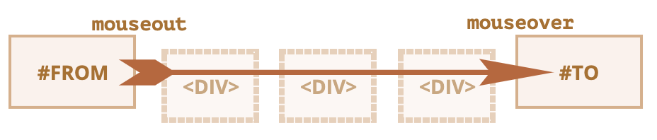
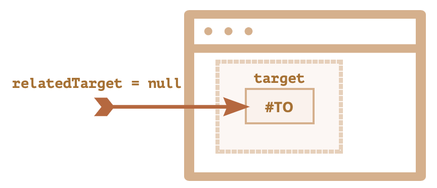

```toc
```
## 事件 mouseover/mouseout, relatedTarget

当鼠标指针移到某个元素上时，`mouseover` 事件就会发生，而当鼠标离开该元素时，`mouseout` 事件就会发生。

这些事件很特别，因为它们具有 `relatedTarget` 属性。此属性是对 `target` 的补充。当鼠标从一个元素离开并去往另一个元素时，其中一个元素就变成了 `target`，另一个就变成了 `relatedTarget`。

对于 `mouseover`：
- `event.target` —— 是鼠标移过的那个元素。
- `event.relatedTarget` —— 是鼠标来自的那个元素（`relatedTarget` → `target`）。

`mouseout` 则与之相反：
- `event.target` —— 是鼠标离开的元素。
- `event.relatedTarget` —— 是鼠标移动到的，当前指针位置下的元素（`target` → `relatedTarget`）。

## 跳过元素

当鼠标移动时，就会触发 `mousemove` 事件。但这并不意味着每个像素都会导致一个事件。浏览器会一直检查鼠标的位置。如果发现了变化，就会触发事件。这意味着，如果访问者非常快地移动鼠标，那么某些 DOM 元素就可能被跳过：


如果鼠标从上图所示的 `#FROM` 快速移动到 `#TO` 元素，则中间的 `<div>`（或其中的一些）元素可能会被跳过。`mouseout` 事件可能会在 `#FROM` 上被触发，然后立即在 `#TO` 上触发 `mouseover`。

这对性能很有好处，因为可能有很多中间元素。我们并不真的想要处理每一个移入和离开的过程。另一方面，我们应该记住，鼠标指针并不会“访问”所有元素。它可以“跳过”一些元素。

特别是，鼠标指针可能会从窗口外跳到页面的中间。在这种情况下，`relatedTarget` 为 `null`，因为它是从石头缝里蹦出来的（nowhere）：



**如果 `mouseover` 被触发了，则必须有 `mouseout`**
>在鼠标快速移动的情况下，中间元素可能会被忽略，但是我们可以肯定一件事：如果鼠标指针“正式地”进入了一个元素（生成了 `mouseover` 事件），那么一旦它离开，我们就会得到 `mouseout`。

## 当移动到一个字元素时 mouseout

`mouseout` 的一个重要功能 —— 当鼠标指针从元素移动到其后代时触发，例如在下面的这个 HTML 中，从 `#parent` 到 `#child`：

```html
<div id="parent">
  <div id="child">...</div>
</div>
```

如果我们在 `#parent` 上，然后将鼠标指针更深入地移入 `#child`，在 `#parent` 上我们会得到 `mouseout`！因此，如果它转到另一个元素（甚至是一个后代），那么它将离开前一个元素。

请注意事件处理的另一个重要的细节。后代的 `mouseover` 事件会冒泡。因此，如果 `#parent` 具有 `mouseover` 处理程序，它将被触发：

你可以在下面这个示例中很清晰地看到这一点：`<div id="child">` 位于 `<div id="parent">` 内部。`#parent` 元素上有 `mouseover/out` 的处理程序，这些处理程序用于输出事件详细信息。

如果你将鼠标从 `#parent` 移动到 `#child`，那么你会看到在 `#parent` 上有两个事件:

1. `mouseout [target: parent]`（离开 parent），然后
2. `mouseover [target: child]`（来到 child，冒泡）。

```html
<!DOCTYPE html>
<html lang="en-us">
<head>
    <meta charset="utf-8">
    <style>
        #parent {
            background: #99C0C3;
            width: 160px;
            height: 120px;
            position: relative;
        }

        #child {
            background: #FFDE99;
            width: 50%;
            height: 50%;
            position: absolute;
            left: 50%;
            top: 50%;
            transform: translate(-50%, -50%);
        }

        textarea {
            height: 140px;
            width: 300px;
            display: block;
        }
    </style>
</head>

<body>
    <div id="parent" onmouseover="mouselog(event)" onmouseout="mouselog(event)">parent
        <div id="child">child</div>
    </div>

    <textarea id="text"></textarea>
    <input type="button" onclick="text.value=''" value="Clear">
    <script>
        function mouselog(event) {
            let d = new Date();
            text.value += `${d.getHours()}:${d.getMinutes()}:${d.getSeconds()} | ${event.type} [target: ${event.target.id}]\n`.replace(/(:|^)(\d\D)/, '$10$2');
            text.scrollTop = text.scrollHeight;
        }
    </script>
</body>
</html>
```

如上例所示，当鼠标指针从 `#parent` 元素移动到 `#child` 时，会在父元素上触发两个处理程序：`mouseout` 和 `mouseover`：

```js
parent.onmouseout = function(event) {
  /* event.target: parent element */
};
parent.onmouseover = function(event) {
  /* event.target: child element (bubbled) */
};
```

**如果我们不检查处理程序中的 `event.target`，那么似乎鼠标指针离开了 `#parent` 元素，然后立即回到了它上面。**

但是事实并非如此！鼠标指针仍然位于父元素上，它只是更深入地移入了子元素。如果离开父元素时有一些行为（action），例如一个动画在 `parent.onmouseout` 中运行，当鼠标指针深入 `#parent` 时，我们并不希望发生这种行为。

为了避免它，我们可以在处理程序中检查 `relatedTarget`，如果鼠标指针仍在元素内，则忽略此类事件。另外，我们可以使用其他事件：`mouseenter` 和 `mouseleave`，它们没有此类问题.

## 事件 mouseenter 和 mouseleave

事件 `mouseenter/mouseleave` 类似于 `mouseover/mouseout`。它们在鼠标指针进入/离开元素时触发。

但是有两个重要的区别：
1. 元素内部与后代之间的转换不会产生影响。
2. 事件 `mouseenter/mouseleave` 不会冒泡。也就无法委托


