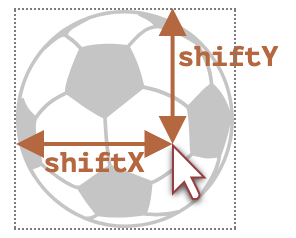

```toc
```

## 拖放算法

基础的拖放算法如下所示：
1. 在 `mousedown` 上 —— 根据需要准备要移动的元素（也许创建一个它的副本，向其中添加一个类或其他任何东西）。
2. 然后在 `mousemove` 上，通过更改 `position:absolute` 情况下的 `left/top` 来移动它。
3. 在 `mouseup` 上 —— 执行与完成的拖放相关的所有行为。

这些都是基础内容。稍后，我们将看到如何实现其他功能，例如当我们将一个东西拖动到一个元素上方时，高亮显示该元素。

下面是拖放一个球的实现代码：

```js
// 在ball上面监听mousedown事件
ball.onmousedown = function(event) {
  // (1) 准备移动：确保 absolute，并通过设置 z-index 以确保球在顶部
  ball.style.position = 'absolute';
  ball.style.zIndex = 1000;

  // 将其从当前父元素中直接移动到 body 中
  // 以使其定位是相对于 body 的
  document.body.append(ball);

  // 现在球的中心在 (pageX, pageY) 坐标上
  function moveAt(pageX, pageY) {
    ball.style.left = pageX - ball.offsetWidth / 2 + 'px';
    ball.style.top = pageY - ball.offsetHeight / 2 + 'px';
  }

  // 将我们绝对定位的球移到指针下方
  moveAt(event.pageX, event.pageY);

  function onMouseMove(event) {
    moveAt(event.pageX, event.pageY);
  }

  // (2) 在 mousemove 事件上移动球，在document上面监听此事件
  document.addEventListener('mousemove', onMouseMove);

  // (3) 放下球，并移除不需要的处理程序
  ball.onmouseup = function() {
    document.removeEventListener('mousemove', onMouseMove);
    ball.onmouseup = null;
  };
};
```

如果我们运行这段代码，我们会发现一些奇怪的事情。在拖放的一开始，球“分叉”了：我们开始拖动它的“克隆”。

这是因为浏览器有自己的对图片和一些其他元素的拖放处理。它会在我们进行拖放操作时自动运行，并与我们的拖放处理产生了冲突。

禁用它：

```js
ball.ondragstart = function() {
  return false;
};
```

我们在 `document` 上跟踪 `mousemove`，而不是在 `ball` 上。乍一看，鼠标似乎总是在球的上方，我们可以将 `mousemove` 放在球上。

但正如我们所记得的那样，`mousemove` 会经常被触发，但不会针对每个像素都如此。因此，在快速移动鼠标后，鼠标指针可能会从球上跳转至文档中间的某个位置（甚至跳转至窗口外）。因此，我们应该监听 `document` 以捕获它。


## 修正定位

在上述示例中，球在移动时，球的中心始终位于鼠标指针下方：

```js
ball.style.left = pageX - ball.offsetWidth / 2 + 'px';
ball.style.top = pageY - ball.offsetHeight / 2 + 'px';
```

不错，但这存在副作用。要启动拖放，我们可以在球上的任意位置 `mousedown`。但是，如果从球的边缘“抓住”球，那么球会突然“跳转”以使球的中心位于鼠标指针下方。如果我们能够保持元素相对于鼠标指针的初始偏移，那就更好了。

例如，我们按住球的边缘处开始拖动，那么在拖动时，鼠标指针应该保持在一开始所按住的边缘位置上。




让我们更新一下我们的算法：

- 1. 当访问者按下按钮（`mousedown`）时 —— 我们可以在变量 `shiftX/shiftY` 中记住鼠标指针到球左上角的距离。我们应该在拖动时保持这个距离。

我们可以通过坐标相减来获取这个偏移：

```js
// onmousedown
let shiftX = event.clientX - ball.getBoundingClientRect().left;
let shiftY = event.clientY - ball.getBoundingClientRect().top;
```

这里 `event.clientX` 和 `event. clientY ` 表示鼠标的坐标，而通过 `getBoundingClientRect` 可以获得球的坐标。

- 2. 然后，在拖动球时，我们将鼠标指针相对于球的这个偏移也考虑在内，像这样：

```js
// onmousemove
// 球具有 position: absolute
ball.style.left = event.pageX - shiftX + 'px';
ball.style.top = event.pageY - shiftY + 'px';
```

最终代码
```js
ball.onmousedown = function(event) {

	let shiftX = event.clientX - ball.getBoundingClientRect().left;
	let shiftY = event.clientY - ball.getBoundingClientRect().top;
	
	ball.style.position = 'absolute';
	ball.style.zIndex = 1000;
	document.body.append(ball);
	
	moveAt(event.pageX, event.pageY);
	
	// 移动现在位于坐标 (pageX, pageY) 上的球
	// 将初始的偏移考虑在内
	function moveAt(pageX, pageY) {
	  ball.style.left = pageX - shiftX + 'px';
	  ball.style.top = pageY - shiftY + 'px';
	}
	...
}

ball.ondragstart = function() {
  return false;
};
```


## 潜在的放置目标

在前面的示例中，球可以被放置（drop）到“任何地方”。在实际中，我们通常是将一个元素放到另一个元素上。例如，将一个“文件”放置到一个“文件夹”或者其他地方。

抽象地讲，我们取一个 “draggable” 的元素，并将其放在 “droppable” 的元素上。
```js

```

这就表示一个可放置的元素。

当我们拖动时，可拖动元素一直是位于其他元素上的。而鼠标事件只发生在顶部元素上，而不是发生在那些下面的元素。于是也就无法针对下面的元素触发相关事件。

例如，下面有两个 `<div>` 元素，红色的在蓝色的上面（完全覆盖）。这里，在蓝色的 `<div>` 中没有办法来捕获事件，因为红色的 `<div>` 在它上面：

```html
<style>
  div {
    width: 50px;
    height: 50px;
    position: absolute;
    top: 0;
  }
</style>
<div style="background:blue" onmouseover="alert('never works')"></div>
<div style="background:red" onmouseover="alert('over red!')"></div>
```

那如何才能让球放置在某个元素上面时针对下面那个元素触发相关的事件呢？

有一个叫做 `document.elementFromPoint(clientX, clientY)` 的方法。它会返回在给定的窗口相对坐标处的嵌套的最深的元素（如果给定的坐标在窗口外，则返回 `null`）。如果同一坐标上有多个重叠的元素，则返回最上面的元素。

完整例子

```css
#gate {
  cursor: pointer;
  margin-bottom: 100px;
  width: 83px;
  height: 46px;
}

#ball {
  cursor: pointer;
  width: 40px;
  height: 40px;
}
```

```html
<!doctype html>
<html>
<head>
  <meta charset="UTF-8">
  <link rel="stylesheet" href="style.css">
</head>
<body>
  <p>Drag the ball.</p>
  
  
  <script>
    let currentDroppable = null;

    ball.onmousedown = function(event) {

      let shiftX = event.clientX - ball.getBoundingClientRect().left;
      let shiftY = event.clientY - ball.getBoundingClientRect().top;

      ball.style.position = 'absolute';
      ball.style.zIndex = 1000;
      document.body.append(ball);

      moveAt(event.pageX, event.pageY);

      function moveAt(pageX, pageY) {
        ball.style.left = pageX - shiftX + 'px';
        ball.style.top = pageY - shiftY + 'px';
      }

      function onMouseMove(event) {
        moveAt(event.pageX, event.pageY);

        ball.hidden = true;
        // 找到当前鼠标位置最顶层的元素，但是需要先隐藏ball元素，因为此时ball是最顶层的
        let elemBelow = document.elementFromPoint(event.clientX, event.clientY);
        // 如果上面不将ball隐藏，这里打印就是ball
        // 如果隐藏了，那么放在空地方的时候是没有id的，但是如果移动到门框
        // 那么打印的就是gate
        console.log("test1: " + elemBelow.id);
        ball.hidden = false;

        if (!elemBelow) return;
	    // 从最顶层元素开始寻找，找到一个dropable类的元素
        let droppableBelow = elemBelow.closest('.droppable');
        // 这里移动到门框的时候就打印的是gate
        console.log("test1: " + droppableBelow.id);
        // 初始化时还没有将球放到门框上，此时不相等
        if (currentDroppable != droppableBelow) {
          // 此时为null，将背景颜色设置为空
          // 注意：它们两个的值都可能为 null
          //   currentDroppable=null —— 如果我们在此事件之前，鼠标指针不是在一个 droppable 的元素上（例如空白处）
          //   droppableBelow=null —— 如果现在，在当前事件中，我们的鼠标指针不是在一个 droppable 的元素上
          if (currentDroppable) {
            // 处理“飞出” droppable 的元素时的处理逻辑（移除高亮）
            leaveDroppable(currentDroppable);
          }
          // 此时将其赋值
          currentDroppable = droppableBelow;
          if (currentDroppable) { 
            // 处理“飞入” droppable 的元素时的逻辑
            enterDroppable(currentDroppable);
          }
        }
      }
	  // 在mousemove事件中执行moMouseMove
      document.addEventListener('mousemove', onMouseMove);

      ball.onmouseup = function() {
      // 在mousemove事件中移除moMouseMove
        document.removeEventListener('mousemove', onMouseMove);
        ball.onmouseup = null;
      };

    };
    function enterDroppable(elem) {
      elem.style.background = 'pink';
    }
    function leaveDroppable(elem) {
      elem.style.background = '';
    }
    // 阻止默认拖放行为
    ball.ondragstart = function() {
      return false;
    };
  </script>
</body>
</html>
```

这里有几个点需要注意：
- 判断 `if (currentDroppable != droppableBelow)`，表示只有当飞入或飞出才进行处理，如果在球框内部或者球框外部，则不执行，而 `currentDroppable = droppableBelow` 也是此作用
- 飞入时 `currentDroppable` 为空，此时 `droppableBelow` 为 gate，于是将背景设置为红色。
- 飞出时 `currentDroppable` 为 gate，此时 `droppableBelow` 为空，此时清除背景。