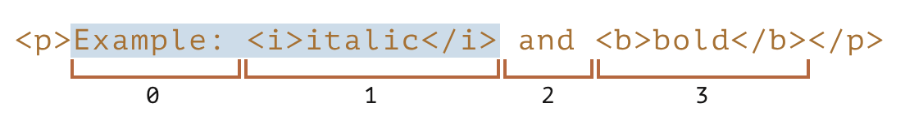
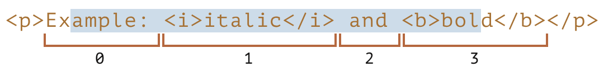
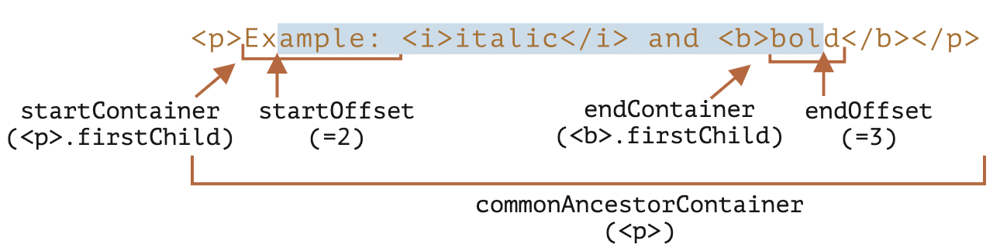
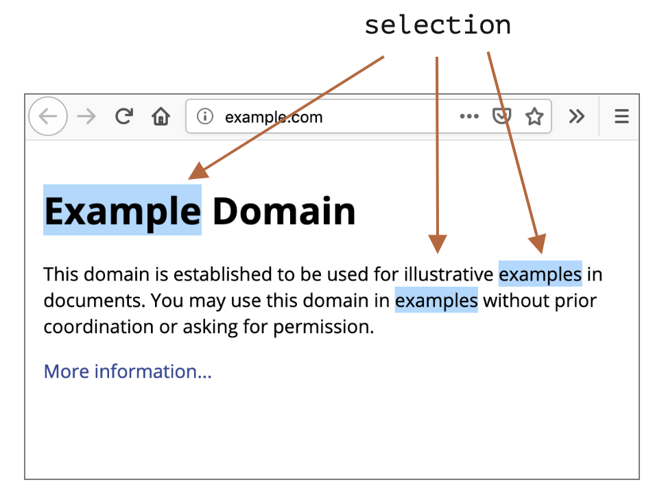

```toc
```


## 范围

选择的基本概念是 [Range](https://dom.spec.whatwg.org/#ranges)：本质上是一对“边界点”：范围起点和范围终点。在没有任何参数的情况下，创建一个 `Range` 对象：

```js
let range = new Range();
```

然后，我们可以使用 `range.setStart(node, offset)` 和 `range.setEnd(node, offset)` 来设置选择边界。

### 选择部分文本

这两种方法中的第一个参数 `node` 都可以是文本节点或元素节点，而第二个参数的含义依赖于此。

**如果 `node` 是一个文本节点，那么 `offset` 则必须是其文本中的位置。**

例如，对于给定的 `<p>Hello</p>`，我们可以像下面这样创建一个包含字母 “ll” 的范围：

```html
<p id="p">Hello</p>
<script>
  let range = new Range();
  range.setStart(p.firstChild, 2);
  range.setEnd(p.firstChild, 4);

  // 对 range 进行 toString 处理，range 则会把其包含的内容以文本的形式返回
  console.log(range); // ll
</script>
```

在这里，我们获取 `<p>` 的第一个子节点（即文本节点）并指定其中的文本位置。

### 选择元素节点

**如果 `node` 是一个元素节点，那么 `offset` 则必须是子元素的编号。** 这对于创建包含整个节点的范围很方便，而不是在其文本中的某处停止。例如，我们有一个更复杂的文档片段：

```html
<p id="p">Example: <i>italic</i> and <b>bold</b></p>
```

这是它的 DOM 结构，包含元素和文本节点：


让我们为 `"Example: <i>italic</i>"` 设置一个范围。正如我们所看到的，这个短语正好由 `<p>` 的索引为 `0` 和 `1` 的两个子元素组成。



- 起点以 `<p>` 作为父节点 `node`，`0` 作为偏移量。
    因此，我们可以将其设置为 `range.setStart(p, 0)`。
    
- 终点也是以 `<p>` 作为父节点 `node`，但以 `2` 作为偏移量（它指定最大范围，但不包括 `offset`）。
    因此，我们可以将其设置为 `range.setEnd(p, 2)`。

```html
<p id="p">Example: <i>italic</i> and <b>bold</b></p>

<script>
  let range = new Range();

  range.setStart(p, 0);
  range.setEnd(p, 2);

  // 范围的 toString 以文本形式返回其内容，不带标签
  console.log(range); // Example: italic

  // 将此范围应用于文档选择，后文有解释
  document.getSelection().addRange(range);
</script>
```


### 选择更大的片段

让我们在示例中选择一个更大的片段，像这样：



我们已经知道如何实现它了。我们只需要将起点和终点设置为文本节点中的相对偏移量即可。

我们需要创建一个范围，它：
- 从 `<p>` 的第一个子节点的位置 2 开始（选择 "Ex**ample:** " 中除前两个字母外的所有字母）
- 到 `<b>` 的第一个子节点的位置 3 结束（选择 “**bol**d” 的前三个字母，就这些）：

```html
<p id="p">Example: <i>italic</i> and <b>bold</b></p>

<script>
  let range = new Range();

  range.setStart(p.firstChild, 2);
  range.setEnd(p.querySelector('b').firstChild, 3);

  console.log(range); // ample: italic and bol

  // 使用此范围进行选择（后文有解释）
  window.getSelection().addRange(range);
</script>
```


## range 属性

我们在上面的示例中创建的 `range` 对象具有以下属性：



- `startContainer`，`startOffset` —— 起始节点和偏移量，
    - 在上例中：分别是 `<p>` 中的第一个文本节点和 `2`。
- `endContainer`，`endOffset` —— 结束节点和偏移量，
    - 在上例中：分别是 `<b>` 中的第一个文本节点和 `3`。
- `collapsed` —— 布尔值，如果范围在同一点上开始和结束（所以范围内没有内容）则为 `true`，
    - 在上例中：`false`
- `commonAncestorContainer` —— 在范围内的所有节点中最近的共同祖先节点，
    - 在上例中：`<p>`


## 选择范围的方法

设置范围的起点：

- `setStart(node, offset)` 将起点设置在：`node` 中的位置 `offset`
- `setStartBefore(node)` 将起点设置在：`node` 前面
- `setStartAfter(node)` 将起点设置在：`node` 后面

设置范围的终点（类似的方法）：

- `setEnd(node, offset)` 将终点设置为：`node` 中的位置 `offset`
- `setEndBefore(node)` 将终点设置为：`node` 前面
- `setEndAfter(node)` 将终点设置为：`node` 后面

从技术上讲，`setStart/setEnd` 可以做任何事，但是更多的方法提供了更多的便捷性。

在所有这些方法中，`node` 都可以是文本或者元素节点：对于文本节点，偏移量 `offset` 跨越的是很多字母，而对于元素节点则跨越的是很多子节点。

更多创建范围的方法：

- `selectNode(node)` 设置范围以选择整个 `node`
- `selectNodeContents(node)` 设置范围以选择整个 `node` 的内容
- `collapse(toStart)` 如果 `toStart=true` 则设置 end=start，否则设置 start=end，从而折叠范围
- `cloneRange()` 创建一个具有相同起点/终点的新范围


## 编辑范围的方法

创建范围后，我们可以使用以下方法操作其内容：

- `deleteContents()` —— 从文档中删除范围中的内容
- `extractContents()` —— 从文档中删除范围中的内容，并将删除的内容作为 [DocumentFragment](https://zh.javascript.info/modifying-document#document-fragment) 返回
- `cloneContents()` —— 复制范围中的内容，并将复制的内容作为 [DocumentFragment](https://zh.javascript.info/modifying-document#document-fragment) 返回
- `insertNode(node)` —— 在范围的起始处将 `node` 插入文档
- `surroundContents(node)` —— 使用 `node` 将所选范围中的内容包裹起来。要使此操作有效，则该范围必须包含其中所有元素的开始和结束标签：不能像 `<i>abc` 这样的部分范围。


## 选择

就是使用鼠标及性能选择。

`Range` 是用于管理选择范围的通用对象。尽管如此，创建一个 `Range` 并不意味着我们可以在屏幕上看到一个内容选择。

我们可以创建 `Range` 对象并传递它们 —— 但它们并不会在视觉上选择任何内容。

文档选择是由 `Selection` 对象表示的，可通过 `window.getSelection()` 或 `document.getSelection()` 来获取。一个选择可以包括零个或多个范围。至少，[Selection API 规范](https://www.w3.org/TR/selection-api/) 是这么说的。不过实际上，只有 Firefox 允许使用 Ctrl+click (Mac 上用 Cmd+click) 在文档中选择多个范围。

这是在 Firefox 中做的一个具有 3 个范围的选择的截图：



其他浏览器最多支持 1 个范围。正如我们将看到的，某些 `Selection` 方法暗示可能有多个范围，但同样，在除 Firefox 之外的所有浏览器中，范围最多是 1。

## 选择属性

如前所述，理论上一个选择可能包含多个范围。我们可以使用下面这个方法获取这些范围对象：
- `getRangeAt(i)` —— 获取第 `i` 个范围，`i` 从 `0` 开始。在除 Firefox 之外的所有浏览器中，仅使用 `0`。

此外，还有更方便的属性。与范围类似，选择的起点被称为“锚点（anchor）”，终点被称为“焦点（focus）”。

主要的选择属性有：
- `anchorNode` —— 选择的起始节点，
- `anchorOffset` —— 选择开始的 `anchorNode` 中的偏移量，
- `focusNode` —— 选择的结束节点，
- `focusOffset` —— 选择结束处 `focusNode` 的偏移量，
- `isCollapsed` —— 如果未选择任何内容（空范围）或不存在，则为 `true` 。
- `rangeCount` —— 选择中的范围数，除 Firefox 外，其他浏览器最多为 `1`。


### 选择和范围的起点和终点对比

选择（selection）的锚点/焦点和 `Range` 的起点和终点有一个很重要的区别。正如我们所知道的，`Range` 对象的起点必须在其终点之前。

但对于选择，并不总是这样的。我们可以在两个方向上使用鼠标进行选择：“从左到右”或“从右到左”。

换句话说，当按下鼠标按键，然后它在文档中向前移动时，它结束的位置（焦点）将在它开始的位置（锚点）之后。

## 选择事件

有一些事件可以跟踪选择：
- `elem.onselectstart` —— 当在元素 `elem` 上（或在其内部）**开始**选择时。例如，当用户在元素 `elem` 上按下鼠标按键并开始移动指针时。
    - 阻止默认行为取消了选择的开始。因此，从该元素开始选择变得不可能，但该元素仍然是可选择的。用户只需要从其他地方开始选择。
- `document.onselectionchange` —— 当选择发生变化或开始时。
    - 请注意：此处理程序只能在 `document` 上设置。它跟踪的是 `document` 中的所有选择。

### 选择跟踪演示

```html
<p id="p">Select me: <i>italic</i> and <b>bold</b></p>

From <input id="from" disabled> – To <input id="to" disabled>
<script>
  document.onselectionchange = function() {
    let selection = document.getSelection();
    let {anchorNode, anchorOffset, focusNode, focusOffset} = selection;

    // anchorNode 和 focusNode 通常是文本节点
    from.value = `${anchorNode?.data}, offset ${anchorOffset}`;
    to.value = `${focusNode?.data}, offset ${focusOffset}`;
  };
</script>
```

## 选择方法

我们可以通过添加/移除范围来处理选择：

- `getRangeAt(i)` —— 获取从 `0` 开始的第 i 个范围。在除 Firefox 之外的所有浏览器中，仅使用 `0`。
- `addRange(range)` —— 将 `range` 添加到选择中。如果选择已有关联的范围，则除 Firefox 外的所有浏览器都将忽略该调用。
- `removeRange(range)` —— 从选择中删除 `range`。
- `removeAllRanges()` —— 删除所有范围。
- `empty()` —— `removeAllRanges` 的别名。

还有一些方便的方法可以直接操作选择范围，而无需中间的 `Range` 调用：

- `collapse(node, offset)` —— 用一个新的范围替换选定的范围，该新范围从给定的 `node` 处开始，到偏移 `offset` 处结束。
- `setPosition(node, offset)` —— `collapse` 的别名。
- `collapseToStart()` —— 折叠（替换为空范围）到选择起点，
- `collapseToEnd()` —— 折叠到选择终点，
- `extend(node, offset)` —— 将选择的焦点（focus）移到给定的 `node`，位置偏移 `offset`，
- `setBaseAndExtent(anchorNode, anchorOffset, focusNode, focusOffset)` —— 用给定的起点 `anchorNode/anchorOffset` 和终点 `focusNode/focusOffset` 来替换选择范围。选中它们之间的所有内容。
- `selectAllChildren(node)` —— 选择 `node` 的所有子节点。
- `deleteFromDocument()` —— 从文档中删除所选择的内容。
- `containsNode(node, allowPartialContainment = false)` —— 检查选择中是否包含 `node`（若第二个参数是 `true`，则只需包含 `node` 的部分内容即可）

对于大多数需求，这些方法就够了，无需访问底层的（underlying）`Range` 对象。

例如，选择段落 `<p>` 的全部内容：

```html
<p id="p">Select me: <i>italic</i> and <b>bold</b></p>

<script>
  // 从 <p> 的第 0 个子节点选择到最后一个子节点
  document.getSelection().setBaseAndExtent(p, 0, p, p.childNodes.length);
</script>
```


## 表单控件中的选择

诸如 `input` 和 `textarea` 等表单元素提供了 [专用的选择 API](https://html.spec.whatwg.org/#textFieldSelection)，没有 `Selection` 或 `Range` 对象。由于输入值是纯文本而不是 HTML，因此不需要此类对象，一切都变得更加简单。

属性：
- `input.selectionStart` —— 选择的起始位置（可写），
- `input.selectionEnd` —— 选择的结束位置（可写），
- `input.selectionDirection` —— 选择方向，其中之一：“forward”，“backward” 或 “none”（例如使用鼠标双击进行的选择），

事件：
- `input.onselect` —— 当某个东西被选择时触发。

方法：
- `input.select()` —— 选择文本控件中的所有内容（可以是 `textarea` 而不是 `input`），
- `input.setSelectionRange(start, end, [direction])` —— 在给定方向上（可选），从 `start` 一直选择到 `end`。
- `input.setRangeText(replacement, [start], [end], [selectionMode])` —— 用新文本替换范围中的文本。
    
    可选参数 `start` 和 `end`，如果提供的话，则设置范围的起点和终点，否则使用用户的选择。
    
    最后一个参数 `selectionMode` 决定替换文本后如何设置选择。可能的值为：
    
    - `"select"` —— 将选择新插入的文本。
    - `"start"` —— 选择范围将在插入的文本之前折叠（光标将在其之前）。
    - `"end"` —— 选择范围将在插入的文本之后折叠（光标将紧随其后）。
    - `"preserve"` —— 尝试保留选择。这是默认值。

现在，让我们看看这些方法的实际使用。

### 示例：跟踪选择

```html
<textarea id="area" style="width:80%;height:60px">
Selecting in this text updates values below.
</textarea>
<br>
From <input id="from" disabled> – To <input id="to" disabled>

<script>
  area.onselect = function() {
    from.value = area.selectionStart;
    to.value = area.selectionEnd;
  };
</script>
```

请注意：

- `onselect` 是在某项被选择时触发，而在选择被删除时不触发。
- 根据 [规范](https://w3c.github.io/selection-api/#dfn-selectionchange)，表单控件内的选择不应该触发 `document.onselectionchange` 事件，因为它与 `document` 选择和范围不相关。一些浏览器会生成它，但我们不应该依赖它。


## 使不可选

要使某些内容不可选，有三种方式：

1. 使用 CSS 属性 `user-select: none`。

```html
<style>
#elem {
  user-select: none;
}
</style>
<div>Selectable <div id="elem">Unselectable</div> Selectable</div>
```

这样不允许选择从 `elem` 开始。但是用户可以在其他地方开始选择，并将 `elem` 包含在内。然后 `elem` 将成为 `document.getSelection()` 的一部分，因此选择实际发生了，但是在复制粘贴中，其内容通常会被忽略。
    
2. 防止 `onselectstart` 或 `mousedown` 事件中的默认行为。

```html
<div>Selectable <div id="elem">Unselectable</div> Selectable</div>

<script>
  elem.onselectstart = () => false;
</script>
```

这样可以防止在 `elem` 上开始选择，但是访问者可以在另一个元素上开始选择，然后扩展到 `elem`。当同一行为上有另一个事件处理程序触发选择时（例如 `mousedown`），这会很方便。因此我们禁用选择以避免冲突，仍然允许复制 `elem` 内容。
    
3. 我们还可以使用 `document.getSelection().empty()` 来在选择发生后清除选择。很少使用这种方法，因为这会在选择项消失时导致不必要的闪烁。


