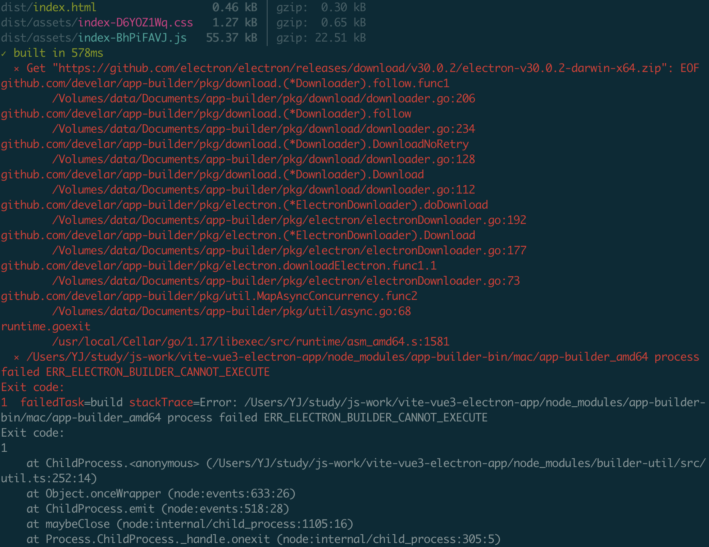
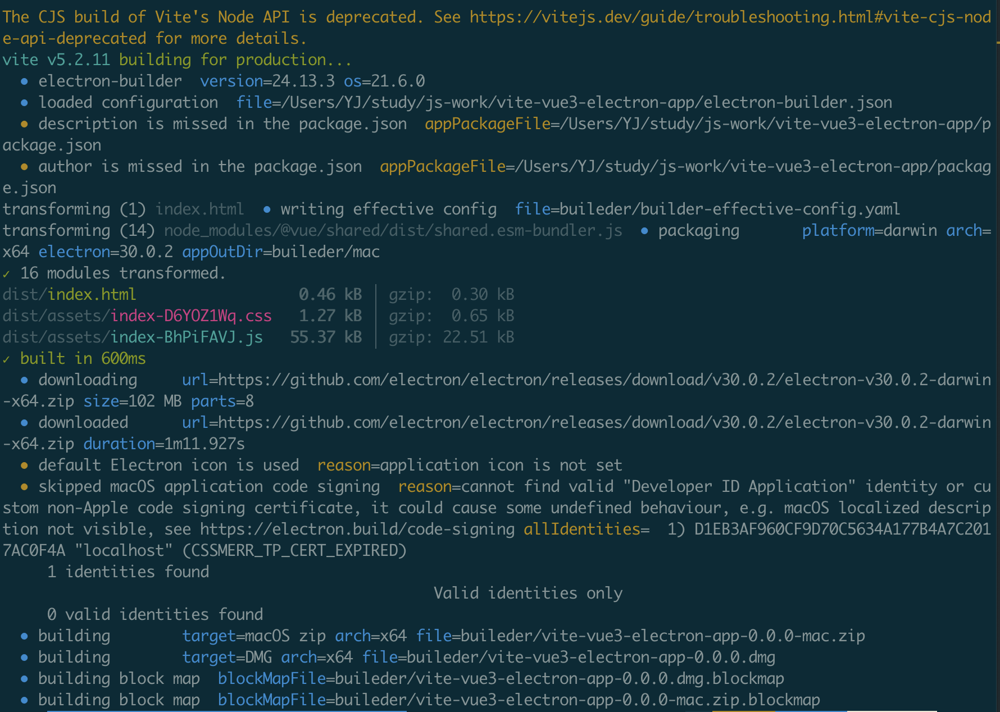

```toc
```
参考：`https://blog.csdn.net/L_15737525552/article/details/131884028`

代码：`https://github.com/yjaal/vite-vue3-electron-app`

## 创建 `vite+vue3` 项目

```sh
npm create vite@latest

✔ Project name: … vite-vue3-electron-app
✔ Select a framework: › Vue
✔ Select a variant: › JavaScript

Scaffolding project in /Users/YJ/study/js-work/vite-vue3-electron-app...

Done. Now run:

  cd vite-vue3-electron-app
  npm install
  npm run dev
```

此时就创建好了，下面进行安装运行

```sh
cd vite-vue3-electron-app
npm i
npm run dev
```


## 安装 electron

```sh
## 这里是全局安装
npm i -s electron -D
```

## 集成 electron

先在 src 同级创建一个 electron 目录，然后创建 `main.js`

也可以从官网拷贝：`https://www.electronjs.org/zh/docs/latest/tutorial/tutorial-first-app#%E5%AE%8C%E6%95%B4%E5%AE%9E%E7%8E%B0%E4%BB%A3%E7%A0%81`

```js
// 控制应用生命周期和创建原生浏览器窗口的模组
const { app, BrowserWindow, Menu } = require('electron')
const path = require('path')
// process.env['ELECTRON_DISABLE_SECURITY_WARNINGS'] = true // 关闭控制台的警告
 
function createWindow() {
  // 创建浏览器窗口
  const mainWindow = new BrowserWindow({
    width: 1200,
    height: 800,
    webPreferences: {
      // 书写渲染进程中的配置
      nodeIntegration: true, //开启true这一步很重要,目的是为了vue文件中可以引入node和electron相关的API
      contextIsolation: false, // 可以使用require方法
      enableRemoteModule: true, // 可以使用remote方法
    },
  })
 
  // 监听html
  mainWindow.loadFile(path.resolve(__dirname, '../dist/index.html'))
}
// 这段程序将会在 Electron 结束初始化
// 和创建浏览器窗口的时候调用
// 部分 API 在 ready 事件触发后才能使用。
app.whenReady().then(() => {
  createWindow()
 
  app.on('activate', function () {
    // 通常在 macOS 上，当点击 dock 中的应用程序图标时，如果没有其他
    // 打开的窗口，那么程序会重新创建一个窗口。
    if (BrowserWindow.getAllWindows().length === 0) createWindow()
  })
})
 
// 除了 macOS 外，当所有窗口都被关闭的时候退出程序。 因此，通常对程序和它们在
// 任务栏上的图标来说，应当保持活跃状态，直到用户使用 Cmd + Q 退出。
app.on('window-all-closed', function () {
  if (process.platform !== 'darwin') app.quit()
})
```

修改 `package.json`

```json
{
  "name": "vite-vue3-electron-app",
  "private": true,
  "version": "0.0.0",
  // "type": "module", 这里要注释
  "main": "electron/main.js", // 这里添加刚才创建的main.js
  "scripts": {
    "dev": "vite",
    "build": "vite build",
    "preview": "vite preview",
    "electron:dev": "electron ."// 添加运行命令
  },
  "dependencies": {
    "vue": "^3.4.21"
  },
  "devDependencies": {
    "@vitejs/plugin-vue": "^5.0.4",
    "vite": "^5.2.0"
  }
}
```

此时进行运行

```sh
npm run electron:dev
```

此时会得到一个空白的页面，因为现在监听的是 vue 打包后的 dist 文件夹中 `index.html`。但其实此时我们还没有打包，可以使用 `npm run build` 进行编译。

## 配置加载代码热更新

安装`electron-reload`
```sh
npm i electron-reload
```

在 `electron/main.js` 添加代码

```js
let env = 'pro2'
  // 配置热更新
  if (env == 'pro') {
    const elePath = path.join(__dirname, '../node_modules/electron')
    require('electron-reload')('../', {
      electron: require(elePath),
    })
    // 热更新监听窗口
    mainWindow.loadURL('http://localhost:8888')
    // 打开开发工具
    mainWindow.webContents.openDevTools()
  } else {
    // 生产环境中要加载文件，打包的版本
    // Menu.setApplicationMenu(null)
    // 加载 index.html
```

完整代码

```js
// 控制应用生命周期和创建原生浏览器窗口的模组
const { app, BrowserWindow, Menu } = require('electron')
const path = require('path')
// process.env['ELECTRON_DISABLE_SECURITY_WARNINGS'] = true // 关闭控制台的警告

function createWindow() {
    // 创建浏览器窗口
    const mainWindow = new BrowserWindow({
        width: 1200,
        height: 800,
        webPreferences: {
            // 书写渲染进程中的配置
            nodeIntegration: true, //开启true这一步很重要,目的是为了vue文件中可以引入node和electron相关的API
            contextIsolation: false, // 可以使用require方法
            enableRemoteModule: true, // 可以使用remote方法
        },
    })

    let env = 'pro2'
    // 配置热更新
    if (env == 'pro') {
        const elePath = path.join(__dirname, '../node_modules/electron')
        require('electron-reload')('../', {
            electron: require(elePath),
        })
        // 热更新监听窗口
        mainWindow.loadURL('http://localhost:8888')
        // 打开开发工具
        mainWindow.webContents.openDevTools()
    } else {
        // 生产环境中要加载文件，打包的版本
        // Menu.setApplicationMenu(null)
        // 加载 index.html

        // 监听html
        mainWindow.loadFile(path.resolve(__dirname, '../dist/index.html'))
    }
}
// 这段程序将会在 Electron 结束初始化
// 和创建浏览器窗口的时候调用
// 部分 API 在 ready 事件触发后才能使用。
app.whenReady().then(() => {
    createWindow()

    app.on('activate', function () {
        // 通常在 macOS 上，当点击 dock 中的应用程序图标时，如果没有其他
        // 打开的窗口，那么程序会重新创建一个窗口。
        if (BrowserWindow.getAllWindows().length === 0) createWindow()
    })
})

// 除了 macOS 外，当所有窗口都被关闭的时候退出程序。 因此，通常对程序和它们在
// 任务栏上的图标来说，应当保持活跃状态，直到用户使用 Cmd + Q 退出。
app.on('window-all-closed', () => {
    if (process.platform !== 'darwin') {
        app.quit()
    }
})
```

其中的 env 是阀门, 方便打包成 app，开发中热更新就使用 `env=pro` 就好了，因为监听的是8888端口，所以我们需要去更改 vue 的运行端口，在根目录文件 `vite.config.js` 中加入以下代码

```js
import { defineConfig } from 'vite'
import vue from '@vitejs/plugin-vue'

// https://vitejs.dev/config/
export default defineConfig({
  plugins: [vue()],
  server: {
    port: 8888,
    cors: true,// 允许跨域
    hmr: true,// 开启热更新
  },
  base: './', // 配合electron打包
})
```

开启两个终端，一个终端运行 vue 的项目启动，因为默认配置就是 `npm run dev`，另一个终端运行 `npm run electron:dev` ，此时就会发现代码可以热更新了。一定要先启动 vue 项目，然后启动 electron 项目，不然页面为空白页。

## 打包成 APP

electron 打包需要打包插件，我这里使用的是 electron-builder 需要全局安装

```sh
npm i electron-builder -D
```

在 `vite.config.js` 中更改根路径，新增 base，在上面代码中已经添加

在 `package.json` 中新增打包命令

```
"electron:build": "vite build & electron-builder build --config electron-builder.json"
```


在src同级目录中新建打包配置文件`electron-builder.json`，在里面加入以下代码
```json
{
    "productName": "vite-vue3-electron-app",
    "files": [
        "./electron/main.js",
        "./dist"
    ],
    "extraFiles": [
        "./videos",
        "./cvideo"
    ],
    "directories": {
        "output": "./buileder"
    }
}
```

打包前要在`main.js`中的env改成非pro 可以是pro2或者其他都可以，不是pro就行

运行打包命令

```sh
npm run electron:build
```

出现错误

```
> vite-vue3-electron-app@0.0.0 electron:build
> vite build & electron-builder build --config electron-builder.json

The CJS build of Vite's Node API is deprecated. See https://vitejs.dev/guide/troubleshooting.html#vite-cjs-node-api-deprecated for more details.
vite v5.2.11 building for production...
✓ 16 modules transformed.
dist/index.html                  0.46 kB │ gzip:  0.30 kB
dist/assets/index-D6YOZ1Wq.css   1.27 kB │ gzip:  0.65 kB
dist/assets/index-BhPiFAVJ.js   55.37 kB │ gzip: 22.51 kB
✓ built in 520ms
  • electron-builder  version=24.13.3 os=21.6.0
  • loaded configuration  file=/Users/YJ/study/js-work/vite-vue3-electron-app/electron-builder.json
  • description is missed in the package.json  appPackageFile=/Users/YJ/study/js-work/vite-vue3-electron-app/package.json
  • author is missed in the package.json  appPackageFile=/Users/YJ/study/js-work/vite-vue3-electron-app/package.json
  ⨯ Cannot compute electron version from installed node modules - none of the possible electron modules are installed.
See https://github.com/electron-userland/electron-builder/issues/3984#issuecomment-504968246
```

检查

```sh
npm ls electron                             
vite-vue3-electron-app@0.0.0 /Users/YJ/study/js-work/vite-vue3-electron-app
└── (empty)

npm ls electron-builder     
vite-vue3-electron-app@0.0.0 /Users/YJ/study/js-work/vite-vue3-electron-app
└── electron-builder@24.13.3
```

重新安装 electron
```sh
cd vite-vue3-electron-app
npm i electron -D

npm ls electron   
vite-vue3-electron-app@0.0.0 /Users/YJ/study/js-work/vite-vue3-electron-app
└── electron@30.0.2
```

然后打包发现还是报错，好像是 electron 版本太高，于是我将版本调低

```json
{
  "name": "vite-vue3-electron-app",
  "private": true,
  "version": "0.0.0",
  "main": "electron/main.js",
  "scripts": {
    "dev": "vite",
    "build": "vite build",
    "preview": "vite preview",
    "electron:dev": "electron .",
    "electron:build": "vite build & electron-builder build --config electron-builder.json"
  },
  "dependencies": {
    "electron-reload": "^2.0.0-alpha.1",
    "vue": "^3.4.21"
  },
  "devDependencies": {
    "@vitejs/plugin-vue": "^5.0.4",
    "electron": "^29.1.5",
    "electron-builder": "^24.13.3",
    "vite": "^5.2.0"
  }
}
```

再次打包时发现还是下载的高版本，但是打包可以成功了，有点奇怪





在 mac 下面可以打包成 windows 的安装包，反之亦然

这是相关命令配置
```json
"build:win": "vite build && electron-builder --win",
"build:mac": "vite build && electron-builder --mac"
```

在 `electron-builder.json` 中添加

```json
{
  "productName": "my-app-electron",
  "appId": "com.electron.myapp",
  "directories": {
    "output": "dist"
  },
  "files": [
    "dist/**/*",
    "package.json"
  ],
  "extraMetadata": {
    "main": "dist/main/index.js"
  },
  "mac": {
    "target": "dmg",
    "icon": "build/icon.icns"
  },
  "win": {
    "target": "nsis",
    "icon": "build/icon.ico"
  }
}
```