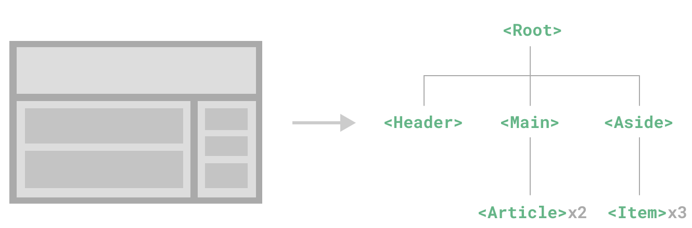
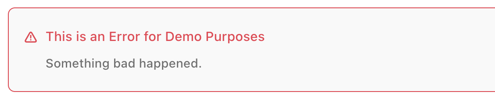

```toc
```
组件允许我们将 UI 划分为独立的、可重用的部分，并且可以对每个部分进行单独的思考。在实际应用中，组件常常被组织成层层嵌套的树状结构：



这和我们嵌套 HTML 元素的方式类似，Vue 实现了自己的组件模型，使我们可以在每个组件内封装自定义内容与逻辑。Vue 同样也能很好地配合原生 Web Component。如果你想知道 Vue 组件与原生 Web Components 之间的关系，可以[阅读此章节](https://cn.vuejs.org/guide/extras/web-components.html)。

## 定义一个组件

当使用构建步骤时，我们一般会将 Vue 组件定义在一个单独的 `.vue` 文件中，这被叫做[单文件组件](https://cn.vuejs.org/guide/scaling-up/sfc.html) (简称 SFC)：

```html
<script setup>
import { ref } from 'vue'

const count = ref(0)
</script>

<template>
  <button @click="count++">You clicked me {{ count }} times.</button>
</template>
```

当不使用构建步骤时，一个 Vue 组件以一个包含 Vue 特定选项的 JavaScript 对象来定义：

```js
import { ref } from 'vue'

export default {
  setup() {
    const count = ref(0)
    return { count }
  },
  template: `
    <button @click="count++">
      You clicked me {{ count }} times.
    </button>`
  // 也可以针对一个 DOM 内联模板：
  // template: '#my-template-element'
}
```

这里的模板是一个内联的 JavaScript 字符串，Vue 将会在运行时编译它。你也可以使用 ID 选择器来指向一个元素 (通常是原生的 `<template>` 元素)，Vue 将会使用其内容作为模板来源。

上面的例子中定义了一个组件，并在一个 `.js` 文件里默认导出了它自己，但你也可以通过具名导出在一个文件中导出多个组件。

## 使用组件

要使用一个子组件，我们需要在父组件中导入它。假设我们把计数器组件放在了一个叫做 `ButtonCounter.vue` 的文件中，这个组件将会以默认导出的形式被暴露给外部。

```html
<script setup>
import ButtonCounter from './ButtonCounter.vue'
</script>

<template>
  <h1>Here is a child component!</h1>
  <ButtonCounter />
</template>
```

通过 `<script setup>`，导入的组件都在模板中直接可用。

当然，你也可以全局地注册一个组件，使得它在当前应用中的任何组件上都可以使用，而不需要额外再导入。关于组件的全局注册和局部注册两种方式的利弊，我们放在了[组件注册](https://cn.vuejs.org/guide/components/registration.html)这一章节中专门讨论。

组件可以被重用任意多次：

```html
<h1>Here is a child component!</h1>
<ButtonCounter />
<ButtonCounter />
<ButtonCounter />
```

## 传递 props

如果我们正在构建一个博客，我们可能需要一个表示博客文章的组件。我们希望所有的博客文章分享相同的视觉布局，但有不同的内容。要实现这样的效果自然必须向组件中传递数据，例如每篇文章标题和内容，这就会使用到 props，其实就是定一个名字以及这个名字对应的字段。

Props 是一种特别的 attributes，你可以在组件上声明注册。要传递给博客文章组件一个标题，我们必须在组件的 props 列表上声明它。这里要用到 [`defineProps`](https://cn.vuejs.org/api/sfc-script-setup.html#defineprops-defineemits) 宏：

```html
<!-- BlogPost.vue -->
<script setup>
defineProps(['title'])
</script>

<template>
  <h4>{{ title }}</h4>
</template>
```

`defineProps` 是一个仅 `<script setup>` 中可用的编译宏命令，并不需要显式地导入。声明的 props 会自动暴露给模板。`defineProps` 会返回一个对象，其中包含了可以传递给组件的所有 props：

```js
const props = defineProps(['title'])
console.log(props.title)
```

如果你没有使用 `<script setup>`，props 必须以 `props` 选项的方式声明，props 对象会作为 `setup()` 函数的第一个参数被传入：

```js
export default {
  props: ['title'],
  setup(props) {
    console.log(props.title)
  }
}
```

一个组件可以有任意多的 props，默认情况下，所有 prop 都接受任意类型的值。

当一个 prop 被注册后，可以像这样以自定义 attribute 的形式传递数据给它：

```html
<BlogPost title="My journey with Vue" />
<BlogPost title="Blogging with Vue" />
<BlogPost title="Why Vue is so fun" />
```

在实际应用中，我们可能在父组件中会有如下的一个博客文章数组：

```js
const posts = ref([
  { id: 1, title: 'My journey with Vue' },
  { id: 2, title: 'Blogging with Vue' },
  { id: 3, title: 'Why Vue is so fun' }
])
```

这种情况下，我们可以使用 `v-for` 来渲染它们：

```html
<BlogPost
  v-for="post in posts"
  :key="post.id"
  :title="post.title"
 />
```

## 监听事件

让我们继续关注我们的 `<BlogPost>` 组件。我们会发现有时候它需要与父组件进行交互。例如，要在此处实现无障碍访问的需求，将博客文章的文字能够放大，而页面的其余部分仍使用默认字号。

父组件 `App.vue`
```html
<script setup>
import { ref } from 'vue'
import BlogPost from './BlogPost.vue'
  
const posts = ref([
  { id: 1, title: 'My journey with Vue' },
  { id: 2, title: 'Blogging with Vue' },
  { id: 3, title: 'Why Vue is so fun' }
])

const postFontSize = ref(1)
</script>

<template>
	<div :style="{ fontSize: postFontSize + 'em' }">
    <BlogPost
      v-for="post in posts"
      :key="post.id"
      :title="post.title"
      @enlarge-text="postFontSize += 0.1"
    ></BlogPost>
  </div>
</template>
```

子组件 `BlogPost.vue`

```js
<script setup>
defineProps(['title'])
defineEmits(['enlarge-text'])
</script>

<template>
  <div class="blog-post">
    <h4>{{ title }}</h4>
    <button @click="$emit('enlarge-text')">Enlarge text</button>
  </div>
</template>
```

这里子组件中定义了一个按钮，同时通过调用内置的 [**`$emit`** 方法](https://cn.vuejs.org/api/component-instance.html#emit)，通过传入事件名称来抛出一个事件，而父组件使用 `@enlarge-text` 进行一个绑定，以此来监听子组件的事件。同时注意，点击按钮时只有父组件中相关内容会放大，而子组件中的按钮则不会。

组件之间的信息交流通常遵循以下几种模式：

1. **父传子 (Props)**: 父组件通过属性 (props) 向子组件传递数据。子组件不能修改这些数据，只能读取它们。
    
2. **子传父 (`𝑒𝑚𝑖𝑡`)**: 子组件通过触发事件 (emit): 子组件通过触发事件 (emit) 向父组件发送信息。父组件监听这些事件，并根据事件执行相应的处理逻辑。**此事件是专门用于子组件向父组件传递信息的一个工具**
    
3. **兄弟间通信**: 兄弟组件不直接通信，而是通过共同的父组件作为中介，或者使用全局事件总线 (Event Bus)、Vuex 状态管理器等技术手段间接通信。
    
4. **Provide / Inject**: Vue 提供了一种更简单的方式在祖先组件中提供数据，然后在子孙组件中注入这些数据，但这主要用于祖先到后代的单向数据流，不是用于频繁的数据交换。
    
5. **Vue Router 的状态管理**：在涉及路由的状态传递时，可以利用路由参数或查询参数。
    
6. **Vuex**: 对于更复杂的应用，可能会使用 Vuex 这样的状态管理库来集中管理应用的所有状态，从而实现跨组件的状态共享和通信。

所以，确实需要定义特定的方法（如监听器、事件处理器等）来监控和响应这些通信机制，以实现父子级或组件间的信息交换。这也体现了Vue框架中数据流的单向或特定模式的双向绑定理念，确保数据流动的可预测性和组件的清晰职责划分。


## 通过插槽来分配内容

一些情况下我们会希望能和 HTML 元素一样向组件中传递内容：

```html
<AlertBox>
  Something bad happened.
</AlertBox>
```

我们期望能渲染成这样：


这可以通过 Vue 的自定义 `<slot>` 元素来实现：

```html
<!-- AlertBox.vue -->
<template>
  <div class="alert-box">
    <strong>This is an Error for Demo Purposes</strong>
    <slot />
  </div>
</template>

<style scoped>
.alert-box {
  /* ... */
}
</style>
```

如上所示，我们使用 `<slot>` 作为一个占位符，父组件传递进来的内容就会渲染在这里。

## 动态组件

父组件 `App.vue`
```html
<script setup>
import Home from './Home.vue'
import Posts from './Posts.vue'
import Archive from './Archive.vue'
import { ref } from 'vue'
 
const currentTab = ref('Home')

const tabs = {
  Home,
  Posts,
  Archive
}
</script>

<template>
  <div class="demo">
    <button
       v-for="(_, tab) in tabs"
       :key="tab"
       :class="['tab-button', { active: currentTab === tab }]"
       @click="currentTab = tab"
     >
      {{ tab }}
    </button>
	  <component :is="tabs[currentTab]" class="tab"></component>
  </div>
</template>

<style>
.demo {
  font-family: sans-serif;
  border: 1px solid #eee;
  border-radius: 2px;
  padding: 20px 30px;
  margin-top: 1em;
  margin-bottom: 40px;
  user-select: none;
  overflow-x: auto;
}

.tab-button {
  padding: 6px 10px;
  border-top-left-radius: 3px;
  border-top-right-radius: 3px;
  border: 1px solid #ccc;
  cursor: pointer;
  background: #f0f0f0;
  margin-bottom: -1px;
  margin-right: -1px;
}
.tab-button:hover {
  background: #e0e0e0;
}
.tab-button.active {
  background: #e0e0e0;
}
.tab {
  border: 1px solid #ccc;
  padding: 10px;
}
</style>
```

几个子组件
`Home.vue`
```html
<template>
  <div class="tab">
    Home component
  </div>
</template>
```

`Posts.vue`
```html
<template>
  <div class="tab">
    Posts component
  </div>
</template>
```

`Archive.vue`
```html
<template>
  <div class="tab">
    Archive component
  </div>
</template>
```

有些场景会需要在两个组件间来回切换，比如 Tab 界面：

```html
<!-- currentTab 改变时组件也改变 -->
<component :is="tabs[currentTab]"></component>
```

在上面的例子中，被传给 `:is` 的值可以是以下几种：

- 被注册的组件名
- 导入的组件对象

你也可以使用 `is` attribute 来创建一般的 HTML 元素。

当使用 `<component :is="...">` 来在多个组件间作切换时，被切换掉的组件会被卸载。我们可以通过 [`<KeepAlive>` 组件](https://cn.vuejs.org/guide/built-ins/keep-alive.html)强制被切换掉的组件仍然保持“存活”的状态。

基本解释：
- **选项卡按钮**: 使用 `v-for` 指令遍历 `tabs` 对象的键（这里是选项卡的名称），为每个选项卡生成一个按钮。`:key` 设置为当前迭代的键值，确保每个按钮有唯一的标识。`:class` 绑定动态类，根据 `currentTab` 的值决定是否应用 `active` 类，从而高亮显示当前选中的按钮。
- **点击事件**: 每个按钮上的 `@click` 事件监听器，当点击时更新 `currentTab` 的值，使其等于当前按钮对应的选项卡名称，从而切换选项卡。
- **动态组件**: 使用 `<component>` 标签和 `:is` 特性来动态渲染当前选中的组件。`:is` 的值绑定到 `tabs[currentTab]`，这意味着它会根据 `currentTab` 的值加载并显示对应的组件（`Home`, `Posts`, 或 `Archive`）。
- **样式类**: 模板中还提到了两个CSS类名——`.tab-button` 和 `.tab`，这些类名应当在相应的CSS中定义，用于控制按钮和组件的样式。

注意：`<component>` 中的 class 名字 `class="tab"` 只是一个名字，没有具体含义，与 `tab-button` 类似。

其实就是这里渲染了三个按钮，其中的 `tab` 的值不同，而通过点击事件监听当前 `tab` 的值，也就是 `currentTab` 的值，进行比较，以此来展示对应的组件。


## DOM 内模板解析注意事项

如果你想在 DOM 中直接书写 Vue 模板，Vue 则必须从 DOM 中获取模板字符串。由于浏览器的原生 HTML 解析行为限制，有一些需要注意的事项。

TIP：
请注意下面讨论只适用于直接在 DOM 中编写模板的情况。如果你使用来自以下来源的字符串模板，就不需要顾虑这些限制了：
- 单文件组件
- 内联模板字符串 (例如 `template: '...'`)
- `<script type="text/x-template">`


### 大小写区分
HTML 标签和属性名称是不分大小写的，所以浏览器会把任何大写的字符解释为小写。这意味着当你使用 DOM 内的模板时，无论是 PascalCase 形式的组件名称、camelCase 形式的 prop 名称还是 v-on 的事件名称，都需要转换为相应等价的 kebab-case (短横线连字符) 形式：

```js
// JavaScript 中的 camelCase
const BlogPost = {
  props: ['postTitle'],
  emits: ['updatePost'],
  template: `
    <h3>{{ postTitle }}</h3>
  `
}
```

```html
<!-- HTML 中的 kebab-case -->
<blog-post post-title="hello!" @update-post="onUpdatePost"></blog-post>
```


### 闭合标签

我们在上面的例子中已经使用过了闭合标签 (self-closing tag)：

```html
<MyComponent />
```

这是因为 Vue 的模板解析器支持任意标签使用 `/>` 作为标签关闭的标志。然而在 DOM 内模板中，我们必须显式地写出关闭标签：

```html
<my-component></my-component>
```

这是由于 HTML 只允许[一小部分特殊的元素](https://html.spec.whatwg.org/multipage/syntax.html#void-elements)省略其关闭标签，最常见的就是 `<input>` 和 ``。对于其他的元素来说，如果你省略了关闭标签，原生的 HTML 解析器会认为开启的标签永远没有结束，用下面这个代码片段举例来说：

```html
<my-component /> <!-- 我们想要在这里关闭标签... -->
<span>hello</span>
```

将被解析为：

```html
<my-component>
  <span>hello</span>
</my-component> <!-- 但浏览器会在这里关闭标签 -->
```

### 元素位置限制

某些 HTML 元素对于放在其中的元素类型有限制，例如 `<ul>`，`<ol>`，`<table>` 和 `<select>`，相应的，某些元素仅在放置于特定元素中时才会显示，例如 `<li>`，`<tr>` 和 `<option>`。

这将导致在使用带有此类限制元素的组件时出现问题。例如：

```html
<table>
  <blog-post-row></blog-post-row>
</table>
```

自定义的组件 `<blog-post-row>` 将作为无效的内容被忽略，因而在最终呈现的输出中造成错误。我们可以使用特殊的 [`is` attribute](https://cn.vuejs.org/api/built-in-special-attributes.html#is) 作为一种解决方案：

```html
<table>
  <tr is="vue:blog-post-row"></tr>
</table>
```

>TIP：当使用在原生 HTML 元素上时，`is` 的值必须加上前缀 `vue:` 才可以被解析为一个 Vue 组件。这一点是必要的，为了避免和原生的[自定义内置元素](https://html.spec.whatwg.org/multipage/custom-elements.html#custom-elements-customized-builtin-example)相混淆。


