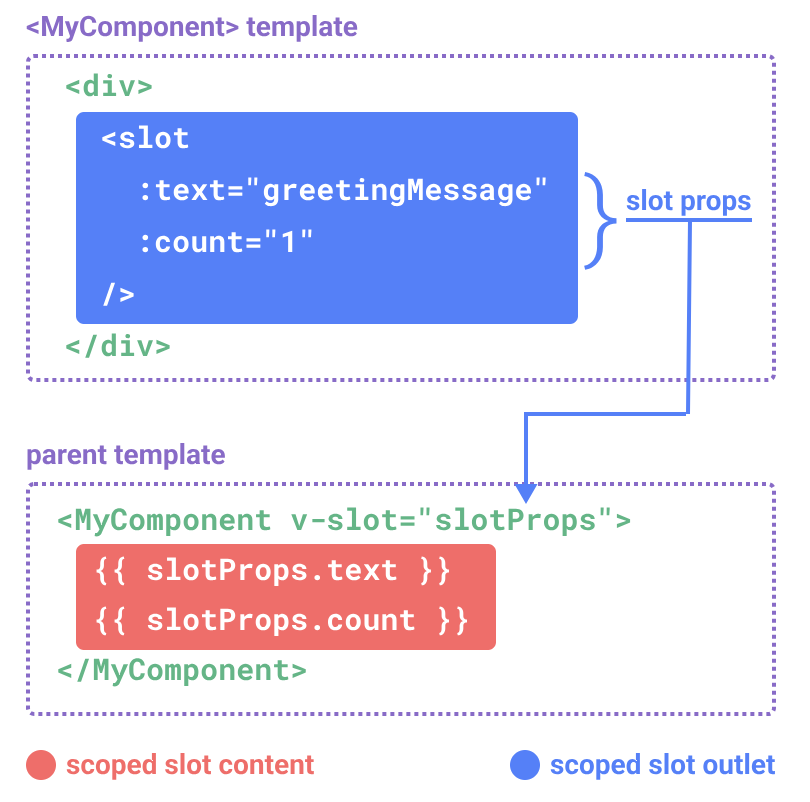

```toc
```

## 插槽内容与出口

在之前的章节中，我们已经了解到组件能够接收任意类型的 JavaScript 值作为 props，但组件要如何接收模板内容呢？在某些场景中，我们可能想要为子组件传递一些模板片段，让子组件在它们的组件中渲染这些片段。

举例来说，这里有一个 `<FancyButton>` 组件，可以像这样使用：

```html
<FancyButton>
  Click me! <!-- 插槽内容 -->
</FancyButton>
```

而 `<FancyButton>` 的模板是这样的：

```html
<button class="fancy-btn">
  <slot></slot> <!-- 插槽出口 -->
</button>
```

`<slot>` 元素是一个**插槽出口** (slot outlet)，标示了父元素提供的**插槽内容** (slot content) 将在哪里被渲染。

最终渲染出的 DOM 是这样：

```html
<button class="fancy-btn">Click me!</button>
```

通过使用插槽，`<FancyButton>` 仅负责渲染外层的 `<button>` (以及相应的样式)，而其内部的内容由父组件提供。

理解插槽的另一种方式是和下面的 JavaScript 函数作类比，其概念是类似的：

```js
// 父元素传入插槽内容
FancyButton('Click me!')

// FancyButton 在自己的模板中渲染插槽内容
function FancyButton(slotContent) {
  return `<button class="fancy-btn">
      ${slotContent}
    </button>`
}
```

插槽内容可以是任意合法的模板内容，不局限于文本。例如我们可以传入多个元素，甚至是组件：

```html
<FancyButton>
  <span style="color:red">Click me!</span>
  <AwesomeIcon name="plus" />
</FancyButton>
```

通过使用插槽，`<FancyButton>` 组件更加灵活和具有可复用性。现在组件可以用在不同的地方渲染各异的内容，但同时还保证都具有相同的样式。

Vue 组件的插槽机制是受[原生 Web Component `<slot>` 元素](https://developer.mozilla.org/en-US/docs/Web/HTML/Element/slot)的启发而诞生，同时还做了一些功能拓展，这些拓展的功能我们后面会学习到。

## 渲染作用域

插槽内容可以访问到父组件的数据作用域，因为插槽内容本身是在父组件模板中定义的。举例来说：

```html
<span>{{ message }}</span>
<FancyButton>{{ message }}</FancyButton>
```

这里的两个 `{{ message }}` 插值表达式渲染的内容都是一样的。

插槽内容**无法访问**子组件的数据。Vue 模板中的表达式只能访问其定义时所处的作用域，这和 JavaScript 的词法作用域规则是一致的。换言之：

> 父组件模板中的表达式只能访问父组件的作用域；子组件模板中的表达式只能访问子组件的作用域。

## 默认内容

在外部没有提供任何内容的情况下，可以为插槽指定默认内容。比如有这样一个 `<SubmitButton>` 组件：

```html
<button type="submit">
  <slot></slot>
</button>
```

如果我们想在父组件没有提供任何插槽内容时在 `<button>` 内渲染“Submit”，只需要将“Submit”写在 `<slot>` 标签之间来作为默认内容：

```html
<button type="submit">
  <slot>
    Submit <!-- 默认内容 -->
  </slot>
</button>
```

现在，当我们在父组件中使用 `<SubmitButton>` 且没有提供任何插槽内容时：

```html
<SubmitButton />
```

“Submit”将会被作为默认内容渲染：

```html
<button type="submit">Submit</button>
```

但如果我们提供了插槽内容：

```html
<SubmitButton>Save</SubmitButton>
```

那么被显式提供的内容会取代默认内容：

```html
<button type="submit">Save</button>
```


## 具名插槽

有时在一个组件中包含多个插槽出口是很有用的。举例来说，在一个 `<BaseLayout>` 组件中，有如下模板：

```html
<div class="container">
  <header>
    <!-- 标题内容放这里 -->
  </header>
  <main>
    <!-- 主要内容放这里 -->
  </main>
  <footer>
    <!-- 底部内容放这里 -->
  </footer>
</div>
```

对于这种场景，`<slot>` 元素可以有一个特殊的 attribute `name`，用来给各个插槽分配唯一的 ID，以确定每一处要渲染的内容：

```html
<div class="container">
  <header>
    <slot name="header"></slot>
  </header>
  <main>
    <slot></slot>
  </main>
  <footer>
    <slot name="footer"></slot>
  </footer>
</div>
```

这类带 `name` 的插槽被称为具名插槽 (named slots)。没有提供 `name` 的 `<slot>` 出口会隐式地命名为“default”。

在父组件中使用 `<BaseLayout>` 时，我们需要一种方式将多个插槽内容传入到各自目标插槽的出口。此时就需要用到**具名插槽**了：

要为具名插槽传入内容，我们需要使用一个含 `v-slot` 指令的 `<template>` 元素，并将目标插槽的名字传给该指令：

```html
<BaseLayout>
  <template v-slot:header>
    <!-- header 插槽的内容放这里 -->
  </template>
</BaseLayout>
```

`v-slot` 有对应的简写 `#`，因此 `<template v-slot:header>` 可以简写为 `<template #header>`。其意思就是“将这部分模板片段传入子组件的 header 插槽中”。

下面我们给出完整的、向 `<BaseLayout>` 传递插槽内容的代码，指令均使用的是缩写形式：

```html
<BaseLayout>
  <template #header>
    <h1>Here might be a page title</h1>
  </template>

  <template #default>
    <p>A paragraph for the main content.</p>
    <p>And another one.</p>
  </template>

  <template #footer>
    <p>Here's some contact info</p>
  </template>
</BaseLayout>
```

当一个组件同时接收默认插槽和具名插槽时，所有位于顶级的非 `<template>` 节点都被隐式地视为默认插槽的内容。所以上面也可以写成：

```html
<BaseLayout>
  <template #header>
    <h1>Here might be a page title</h1>
  </template>

  <!-- 隐式的默认插槽 -->
  <p>A paragraph for the main content.</p>
  <p>And another one.</p>

  <template #footer>
    <p>Here's some contact info</p>
  </template>
</BaseLayout>
```

现在 `<template>` 元素中的所有内容都将被传递到相应的插槽。最终渲染出的 HTML 如下：

```html
<div class="container">
  <header>
    <h1>Here might be a page title</h1>
  </header>
  <main>
    <p>A paragraph for the main content.</p>
    <p>And another one.</p>
  </main>
  <footer>
    <p>Here's some contact info</p>
  </footer>
</div>
```


## 条件插槽

有时你需要根据插槽是否存在来渲染某些内容。

你可以结合使用 [$slots](https://cn.vuejs.org/api/component-instance.html#slots) 属性与 [v-if](https://cn.vuejs.org/guide/essentials/conditional.html#v-if) 来实现。

在下面的示例中，我们定义了一个卡片组件，它拥有三个条件插槽：`header`、`footer` 和 `default`。当 header、footer 或 default 存在时，我们希望包装它们以提供额外的样式：

```html
<template>
  <div class="card">
    <div v-if="$slots.header" class="card-header">
      <slot name="header" />
    </div>
    
    <div v-if="$slots.default" class="card-content">
      <slot />
    </div>
    
    <div v-if="$slots.footer" class="card-footer">
      <slot name="footer" />
    </div>
  </div>
</template>
```


## 动态插槽名

[动态指令参数](https://cn.vuejs.org/guide/essentials/template-syntax.html#dynamic-arguments)在 `v-slot` 上也是有效的，即可以定义下面这样的动态插槽名：

```html
<base-layout>
  <template v-slot:[dynamicSlotName]>
    ...
  </template>

  <!-- 缩写为 -->
  <template #[dynamicSlotName]>
    ...
  </template>
</base-layout>
```

注意这里的表达式和动态指令参数受相同的[语法限制](https://cn.vuejs.org/guide/essentials/template-syntax.html#dynamic-argument-syntax-constraints)。

## 作用域插槽

在上面的[渲染作用域](https://cn.vuejs.org/guide/components/slots.html#render-scope)中我们讨论到，插槽的内容无法访问到子组件的状态。

然而在某些场景下插槽的内容可能想要同时使用父组件域内和子组件域内的数据。要做到这一点，我们需要一种方法来让子组件在渲染时将一部分数据提供给插槽。

我们也确实有办法这么做！可以像对组件传递 props 那样，向一个插槽的出口上传递 attributes：

```html
<!-- <MyComponent> 的模板 -->
<div>
  <slot :text="greetingMessage" :count="1"></slot>
</div>
```

当需要接收插槽 props 时，默认插槽和具名插槽的使用方式有一些小区别。下面我们将先展示默认插槽如何接受 props，通过子组件标签上的 `v-slot` 指令，直接接收到了一个插槽 props 对象：

```html
<MyComponent v-slot="slotProps">
  {{ slotProps.text }} {{ slotProps.count }}
</MyComponent>
```




子组件传入插槽的 props 作为了 `v-slot` 指令的值，可以在插槽内的表达式中访问。

你可以将作用域插槽类比为一个传入子组件的函数。子组件会将相应的 props 作为参数传给它：

```js
MyComponent({
  // 类比默认插槽，将其想成一个函数
  default: (slotProps) => {
    return `${slotProps.text} ${slotProps.count}`
  }
})

function MyComponent(slots) {
  const greetingMessage = 'hello'
  return `<div>${
    // 在插槽函数调用时传入 props
    slots.default({ text: greetingMessage, count: 1 })
  }</div>`
}
```

实际上，这已经和作用域插槽的最终代码编译结果、以及手动编写[渲染函数](https://cn.vuejs.org/guide/extras/render-function.html)时使用作用域插槽的方式非常类似了。

`v-slot="slotProps"` 可以类比这里的函数签名，和函数的参数类似，我们也可以在 `v-slot` 中使用解构：

```html
<MyComponent v-slot="{ text, count }">
  {{ text }} {{ count }}
</MyComponent>
```


### 具名作用域插槽

具名作用域插槽的工作方式也是类似的，插槽 props 可以作为 `v-slot` 指令的值被访问到：`v-slot:name="slotProps"`。当使用缩写时是这样：

```html
<MyComponent>
  <template #header="headerProps">
    {{ headerProps }}
  </template>

  <template #default="defaultProps">
    {{ defaultProps }}
  </template>

  <template #footer="footerProps">
    {{ footerProps }}
  </template>
</MyComponent>
```

向具名插槽中传入 props：

```html
<slot name="header" message="hello"></slot>
```

注意插槽上的 `name` 是一个 Vue 特别保留的 attribute，不会作为 props 传递给插槽。因此最终 `headerProps` 的结果是 `{ message: 'hello' }`。

如果你同时使用了具名插槽与默认插槽，则需要为默认插槽使用显式的 `<template>` 标签。尝试直接为组件添加 `v-slot` 指令将导致编译错误。这是为了避免因默认插槽的 props 的作用域而困惑。举例：

```html
<!-- 该模板无法编译 -->
<template>
  <MyComponent v-slot="{ message }">
    <p>{{ message }}</p>
    <template #footer>
      <!-- message 属于默认插槽，此处不可用 -->
      <p>{{ message }}</p>
    </template>
  </MyComponent>
</template>
```

为默认插槽使用显式的 `<template>` 标签有助于更清晰地指出 `message` 属性在其他插槽中不可用：

```html
<template>
  <MyComponent>
    <!-- 使用显式的默认插槽 -->
    <template #default="{ message }">
      <p>{{ message }}</p>
    </template>

    <template #footer>
      <p>Here's some contact info</p>
    </template>
  </MyComponent>
</template>
```


### 高级列表组件示例

你可能想问什么样的场景才适合用到作用域插槽，这里我们来看一个 `<FancyList>` 组件的例子。它会渲染一个列表，并同时会封装一些加载远端数据的逻辑、使用数据进行列表渲染、或者是像分页或无限滚动这样更进阶的功能。然而我们希望它能够保留足够的灵活性，将对单个列表元素内容和样式的控制权留给使用它的父组件。

```html
<!--App.vue-->
<script setup>
import FancyList from './FancyList.vue'
</script>

<template>
  <FancyList api-url="url" :per-page="10">
    <template #item="{ body, username, likes }">
      <div class="item">
        <p>{{ body }}</p>
        <p class="meta">by {{ username }} | {{ likes }} likes</p>
      </div>
    </template>
  </FancyList>
</template>

<style scoped>
.meta {
  font-size: 0.8em;
  color: #42b883;
}
</style>

<!--FancyList.vue-->
<script setup>
import { ref } from 'vue'

const props = defineProps(['api-url', 'per-page'])

const items = ref([])

// mock remote data fetching
setTimeout(() => {
  items.value = [
    { body: 'Scoped Slots Guide', username: 'Evan You', likes: 20 },
	{ body: 'Vue Tutorial', username: 'Natalia Tepluhina', likes: 10 }
  ]
}, 1000)
</script>

<template>
  <ul>
    <li v-if="!items.length">
      Loading...
    </li>
    <li v-for="item in items">
      <slot name="item" v-bind="item"/>
    </li>
  </ul>
</template>

<style scoped>
  ul {
    list-style-type: none;
    padding: 5px;
    background: linear-gradient(315deg, #42d392 25%, #647eff);
  }
  li {
    padding: 5px 20px;
    margin: 10px;
    background: #fff;
  }
</style>
```

### 无渲染组件

上面的 `<FancyList>` 案例同时封装了可重用的逻辑 (数据获取、分页等) 和视图输出，但也将部分视图输出通过作用域插槽交给了消费者组件来管理。

如果我们将这个概念拓展一下，可以想象的是，一些组件可能只包括了逻辑而不需要自己渲染内容，视图输出通过作用域插槽全权交给了消费者组件。我们将这种类型的组件称为**无渲染组件**。

这里有一个无渲染组件的例子，一个封装了追踪当前鼠标位置逻辑的组件：

```html
<!--App.vue-->
<script setup>
import MouseTracker from './MouseTracker.vue'
</script>

<template>
	<MouseTracker v-slot="{ x, y }">
  	Mouse is at: {{ x }}, {{ y }}
	</MouseTracker>
</template>

<!--MouseTracker.vue-->
<script setup>
import { ref, onMounted, onUnmounted } from 'vue'
  
const x = ref(0)
const y = ref(0)

const update = e => {
  x.value = e.pageX
  y.value = e.pageY
}

onMounted(() => window.addEventListener('mousemove', update))
onUnmounted(() => window.removeEventListener('mousemove', update))
</script>

<template>
  <slot :x="x" :y="y"/>
</template>
```

虽然这个模式很有趣，但大部分能用无渲染组件实现的功能都可以通过组合式 API 以另一种更高效的方式实现，并且还不会带来额外组件嵌套的开销。之后我们会在[组合式函数](https://cn.vuejs.org/guide/reusability/composables.html)一章中介绍如何更高效地实现追踪鼠标位置的功能。

尽管如此，作用域插槽在需要**同时**封装逻辑、组合视图界面时还是很有用，就像上面的 `<FancyList>` 组件那样。


