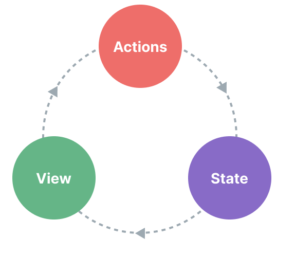

```toc
```

## 什么是状态管理

理论上来说，每一个 Vue 组件实例都已经在“管理”它自己的响应式状态了。我们以一个简单的计数器组件为例：

```html
<script setup>
import { ref } from 'vue'

// 状态
const count = ref(0)

// 动作
function increment() {
  count.value++
}
</script>

<!-- 视图 -->
<template>{{ count }}</template>
```

它是一个独立的单元，由以下几个部分组成：

- **状态**：驱动整个应用的数据源；
- **视图**：对**状态**的一种声明式映射；
- **交互**：状态根据用户在**视图**中的输入而作出相应变更的可能方式。

下面是“单向数据流”这一概念的简单图示：



然而，当我们有**多个组件共享一个共同的状态**时，就没有这么简单了：

1. 多个视图可能都依赖于同一份状态。
2. 来自不同视图的交互也可能需要更改同一份状态。

对于情景 1，一个可行的办法是将共享状态“提升”到共同的祖先组件上去，再通过 props 传递下来。然而在深层次的组件树结构中这么做的话，很快就会使得代码变得繁琐冗长。这会导致另一个问题：[Prop 逐级透传问题](https://cn.vuejs.org/guide/components/provide-inject.html#prop-drilling)。

对于情景 2，我们经常发现自己会直接通过模板引用获取父/子实例，或者通过触发的事件尝试改变和同步多个状态的副本。但这些模式的健壮性都不甚理想，很容易就会导致代码难以维护。

一个更简单直接的解决方案是抽取出组件间的共享状态，放在一个全局单例中来管理。这样我们的组件树就变成了一个大的“视图”，而任何位置上的组件都可以访问其中的状态或触发动作。

## 用响应式 API 做简单状态管理

如果你有一部分状态需要在多个组件实例间共享，你可以使用 [`reactive()`](https://cn.vuejs.org/api/reactivity-core.html#reactive) 来创建一个响应式对象，并将它导入到多个组件中：

```js
// store.js
import { reactive } from 'vue'

export const store = reactive({
  count: 0
})
```

```html
<!-- ComponentA.vue -->
<script setup>
import { store } from './store.js'
</script>

<template>From A: {{ store.count }}</template>

<!-- ComponentB.vue -->
<script setup>
import { store } from './store.js'
</script>

<template>From B: {{ store.count }}</template>
```

现在每当 `store` 对象被更改时，`<ComponentA>` 与 `<ComponentB>` 都会自动更新它们的视图。现在我们有了单一的数据源。

然而，这也意味着任意一个导入了 `store` 的组件都可以随意修改它的状态：

```html
<template>
  <button @click="store.count++">
    From B: {{ store.count }}
  </button>
</template>
```

虽然这在简单的情况下是可行的，但从长远来看，可以被任何组件任意改变的全局状态是不太容易维护的。为了确保改变状态的逻辑像状态本身一样集中，建议在 store 上定义方法，方法的名称应该要能表达出行动的意图：

```js
// store.js
import { reactive } from 'vue'

export const store = reactive({
  count: 0,
  increment() {
    this.count++
  }
})
```

```html
<template>
  <button @click="store.increment()">
    From B: {{ store.count }}
  </button>
</template>
```

除了我们这里用到的单个响应式对象作为一个 store 之外，你还可以使用其他[响应式 API](https://cn.vuejs.org/api/reactivity-core.html) 例如 `ref()` 或是 `computed()`，或是甚至通过一个[组合式函数](https://cn.vuejs.org/guide/reusability/composables.html)来返回一个全局状态：

```js
import { ref } from 'vue'

// 全局状态，创建在模块作用域下
const globalCount = ref(1)

export function useCount() {
  // 局部状态，每个组件都会创建
  const localCount = ref(1)

  return {
    globalCount,
    localCount
  }
}
```

## Pinia

虽然我们的手动状态管理解决方案在简单的场景中已经足够了，但是在大规模的生产应用中还有很多其他事项需要考虑：

- 更强的团队协作约定
- 与 Vue DevTools 集成，包括时间轴、组件内部审查和时间旅行调试
- 模块热更新 (HMR)
- 服务端渲染支持

[Pinia](https://pinia.vuejs.org/zh/) 就是一个实现了上述需求的状态管理库，由 Vue 核心团队维护，对 Vue 2 和 Vue 3 都可用。


