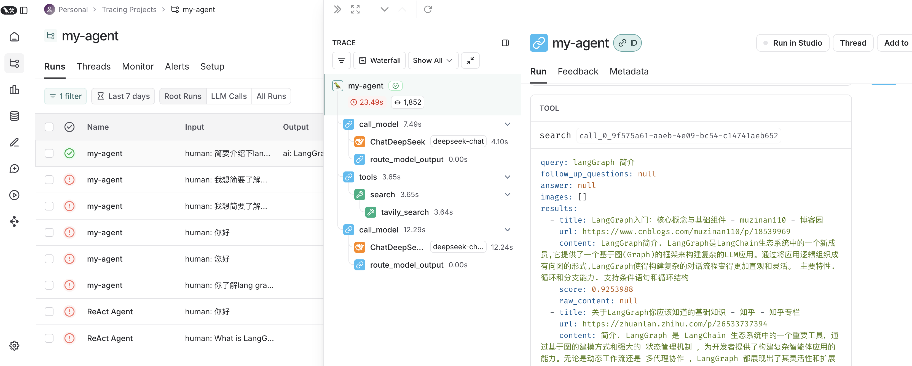

```toc
```

## 安装 LangGraph CLI

这个其实就是 LangGraph Studio

```shell
pip install --upgrade "langgraph-cli[inmem]"
```

## 创建一个 LangGraph 应用

从 `react-agent` 模板创建一个新应用。这个模板是一个简单的智能体，可以灵活地扩展到许多工具中。

```shell
# ~/study/python-work
langgraph new my-agent --template react-agent-python

# 安装依赖
cd my-agent
pip install -e .

# 在当前目录中可以找到一个.env.example，将此文件copy为.env文件。填写相关信息
vim .env
TAVILY_API_KEY=tvly-dYdh
OPENAI_API_KEY=sk-vuetovtiiurg

LANGSMITH_PROJECT=my-agent
LANGSMITH_TRACING=true
LANGSMITH_ENDPOINT="https://api.smith.langchain.com"
LANGSMITH_API_KEY="lsv2__3204f615cd"
```

这里如果没有 tavily 的 apiKey，直接去官网申请。而 LangSmith 的 apiKey 也是一样。

## 启动 LangGraph 服务器

```shell
langgraph dev
```


- API: [http://localhost:2024](http://localhost:2024/)
- 文档: [ http://localhost:2024/docs ]( http://localhost:2024/docs )
- LangGraph 工作室 Web 界面: [https://smith.langchain.com/studio/?baseUrl=http://127.0.0.1:2024](https://smith.langchain.com/studio/?baseUrl=http://127.0.0.1:2024)


注意事项，相关配置需要看 langsmith 是否支持，像初始化工程中通过 `langchain.chat_models.init_chat_model` 获取模型服务时就不支持千问模型，当然我们可以自己手动修改，这里我们使用 deepseek 平台。

配置

```
DEEPSEEK_API_KEY=sk-94156966a5
```

```python
# configuration.py
# default="anthropic/claude-3-5-sonnet-20240620",
default="deepseek/deepseek-chat"
```

```python
# utils.py
return init_chat_model(model, model_provider=provider, base_url="https://api.deepseek.com/v1")
```

还是使用 `langgraph dev` 启动然后通过 web 方式访问，LangGraph Studio 总是连接不上，这样就可以进行聊天了




