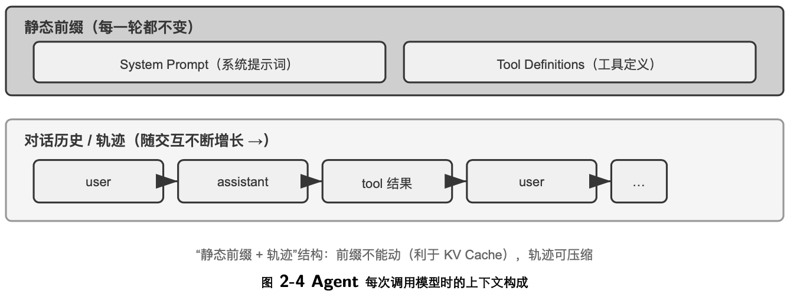
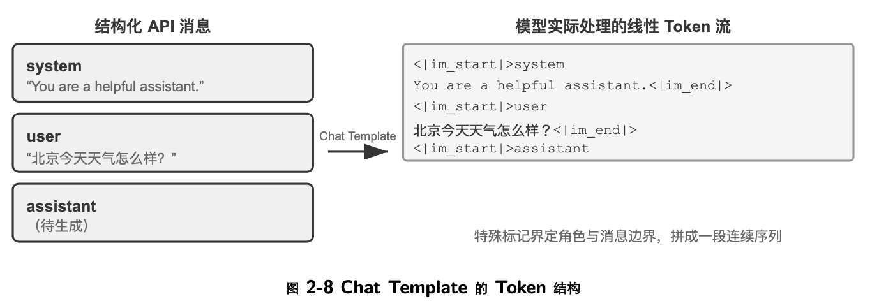
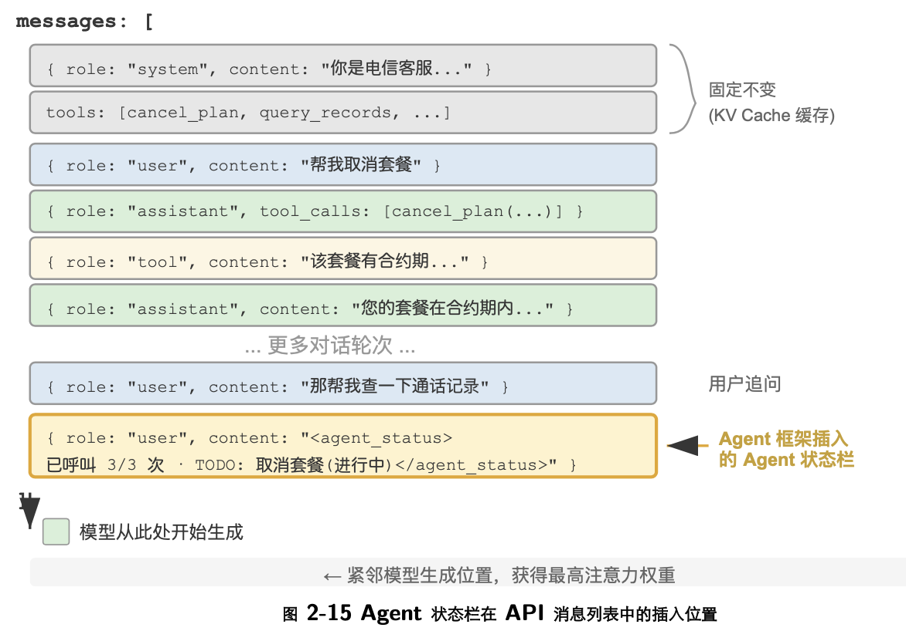

```toc
```


## 上下文：决定 Agent 能力上限的关键

**Agent 的下一步行动取决于截至当前的完整交互上下文，而不只是眼前这一条输入**


## Agent 如何调用大模型：理解 API 的上下文结构

### 消息的四种角色

- system：系统提示词。由开发者编写，定义 Agent 的身份、行为规则、约束条件。模型将其视为最高优先级的指令。整个对话过程中通常只有一条，放在消息列表的最前面。
- user：用户消息。来自终端用户的输入，是 Agent 需要响应的请求。
- assistant：助手消息。模型之前的回复，包括文本回复和工具调用请求。在多轮对话中，之前的 assistant 消息会被放回消息列表，让模型“记住”自己说过什么。
- tool：工具结果。Agent 框架执行工具后，将结果以 tool 角色的消息送回给模型。每条 tool 消息通过 tool_call_id 与对应的工具调用请求关联。


### 从 API 视角看上下文的构成

Agent 每次调用模型时，上下文的完整构成：



上半部分（System Prompt + Tool Definitions）在整个对话过程中保持不变，下半部分（对话历史，即第一章所定义的轨迹）随着交互的进行不断增长。这正是第一章“上下文的五个组成部分”在 API 层面的具体样子：系统提示词和工具定义构成静态前缀，用户消息、模型回复和工具执行结果构成动态增长的消息历史。这个“静态前缀 + 轨迹”的结构，是后续讨论 KV Cache 优化、上下文压缩等技术的基础——理解了这个结构，就能理解为什么“前面不能动、后面可以压缩”。


## KV Cache 友好的上下文设计

模型每生成一个 token，都要回头看一遍前文所有 token 的中间计算结果。如果每轮都从头算一次，开销会随上下文长度爆炸式增长。 KV Cache 的做法是：把前文的中间计算结果缓存下来，下一轮只需要计算新增 token 的部分。前提是要复用的上下文 token 前缀保持不变——若 token 序列从某个位置开始不同，首个不同 token 及其后的 KV 状态需要重新计算；此前位置的 KV 状态不受这次改动影响。

只需记住以下三条核心结论：
1. 系统提示词和工具定义一旦确定就不要改。任何改动，哪怕多一个空格，都可能改变 token 序列，使首个不同 token 及其后的缓存无法复用；改动越靠前，延迟和成本影响通常越大（具体幅度视模型与配置而定）。
2. 动态信息永远追加到末尾——时间戳、用户状态等变化的内容，作为新消息追加到对话末尾，而不是修改已有的系统提示词。
3. 使用标准 API 格式，不要自行拼接消息：结构化消息会被 Chat Template 翻译成模型训练时见过的固定 token 序列；自行用字符串拼成 "USER: ... ASSISTANT: ..." 的根本问题是偏离了这种训练格式，会削弱模型的多步思考能力。至于缓存，它只认 token 字节序列，只要拼出的前缀字节级稳定，照样能命中；但若拼接方式不稳定（如每次向前缀注入动态内容），缓存也会随之失效。


### 从 API 消息到模型 Token： Chat Template

Chat Template 是一项贯穿全书的基础机制：它不只关系到 KV Cache，还决定了多轮工具调用、思维链保留、状态栏注入等诸多机制能否正确工作，因此值得单独讲清楚。注意力可视化实验中的 token 序列（如 `< |im_start| >、< |im_end| > ` 等特殊标记）看起来与前面 API 的 JSON 格式很不一样。这是因为 API 层面的结构化消息需要被转换为模型能理解的线性 token 流——负责这个转换的就是 Chat Template（聊天模板）。




对于 Agent 开发者来说，你不需要手动编写或修改 Chat Template——API 服务端会自动处理。但理解它的存在对 Agent 开发有两个实用价值：

第一，解释了为什么必须使用标准 API 格式。如果开发者绕过 API、自行拼接消息（比如把工具结果作为普通 user 消息而非 tool 类型传递），Chat Template 会误将工具响应识别为新的用户查询，导致模型的思维链保留机制被破坏。

第二，解释了 KV Cache 为什么对前缀如此敏感。Chat Template 将 system 消息和工具定义转换为固定的token 序列放在最前面。这些 token 的键值对（Key-Value pairs）被缓存后可以跨请求复用。但如果前缀中某个token 发生变化——哪怕只是系统提示词里多了一个空格——首个不同 token 及其后的缓存就无法复用。


### KV Cache 的原理与约束

**常见的错误上下文管理模式**

在 kv-cache 实验中，我们系统性地测试了几种常见但有害的上下文管理模式。这些模式不仅会破坏 KV Cache的有效性，有些甚至会影响 Agent 的核心能力。

动态系统提示词是最常见的错误，也就是本节开头那个时间戳故事。正确的做法是把时间信息作为用户消息追加到对话末尾，或者只在真正需要时通过工具调用获取。

动态用户配置模式试图在每次请求中更新用户的状态信息（如剩余的 API 调用次数或账户余额）。在这种模式下，将这些信息嵌入上下文会破坏缓存。更好的方案是在需要时通过专门的状态管理机制来处理。工具定义的动态排序是另一个隐蔽的陷阱。有些系统会根据使用频率动态调整工具的顺序，但工具定义通常在上下文中占据很大篇幅（每个工具可能包含数百个 token 的描述和参数说明），改变顺序会让缓存从首个变动的工具起全部失效。实验表明，保持固定顺序对模型选择工具的能力几乎没有影响，对性能的提升却很显著。

滑动窗口（Sliding Window）对话历史通过只保留最近几条消息来控制上下文长度。举个例子：如果窗口大小设为 10 条消息，那么第 11 条消息进来时，最早的一条就会被丢弃。这种做法存在两个严重的问题。第一，它会破坏上下文的前缀一致性，导致 KV Cache 失效。第二，它可能丢失关键的工具调用结果。举例：滑动窗口大小为 10 轮时，Agent 在第 2 轮调用文件读取工具拿到关键内容，到第 15 轮还需要引用这内容——但此时原始结果已滑出窗口，模型只能依赖被截断的对话尝试推断，错误率显著上升。在实验中，使用滑动窗口的Agent 经常陷入循环，反复执行相同的工具调用，因为它“忘记”了之前已经获得的结果。补充：但是这种方式经常会看到，一般模型会进行滑动，但是不改变本身消息所处的位置，比如中间某条消息不会因为前面几条消息被剔除了就改变其所在 Cache 中的位置。


文本格式化方法是最具破坏性的模式之一。它把结构化的 role-content 消息转换为“USER:⋯ASSISTANT:⋯”这样的纯文本流。如开篇第三条结论所说，问题的关键不在缓存，而在于偏离了模型训练时使用的标准消息格式。模型在训练阶段接受了大量基于角色的对话数据，已经学会解析这种结构化格式；当消息被转为纯文本时，它需要额外消耗注意力去推断角色边界和对话结构，于是各种问题接踵而至：重复执行已完成的操作、忽略工具调用结果、在应该调用工具时却生成文本响应、格式解析错误。

小结：上面几种错误模式的解法，最终都收敛回本节开篇的三条核心结论。补充一点：模型提供商为标准接口做了大量的优化，偏离标准格式往往是在给自己挖坑。


## 提示工程：优化系统提示词

提示工程（Prompt Engineering）的核心对象是系统提示词（System Prompt）——API 消息列表中那条 role:"system" 的消息。它是 Agent 的“员工手册”，定义了 Agent 的身份、行为规则、约束条件和工作流程。一个精心设计的系统提示词，能让模型在具体任务中充分发挥其通用能力。

系统提示词的设计有一个实用的检验标准：**如果一个聪明的新员工读完你的系统提示词还不知道该怎么做，Agent 也一样不知道**。

### 语气与风格：系统提示词的“人格”

语气和风格的设计是提示工程中最容易被忽视，却又深刻影响用户体验的部分。例如，可以要求“You MUST answer concisely with fewer than 4 lines”（你必须简洁地回答，不超过 4 行）；在无法完成任务时，则要求“keep your response to 1-2 sentences”（把回复控制在 1-2 句话），并且“不要解释为什么不能做某事”。这种设计避免了 Agent 陷入冗长的自我辩护。大写字母（如“NEVER do X”）比“Please avoid doing X”更能引起模型的“注意”，但过度使用会导致效果被稀释，应保留给真正关键的约束。

### 结构化提示：系统提示词的“格式”

现代大语言模型对结构化输入展现出显著的敏感性，这源于训练数据中包含大量的结构化内容。XML 标签的使用遵循层次化原则，其标签名称本身就携带语义信息——<working_directory> 能立即告诉模型这是工作目录信息，而纯文本格式“当前目录：/Users/project/src”则需要模型做额外的思考来理解冒号前后的关系。

Markdown 在保持可读性的同时提供了轻量级的结构，特别适合组织层次化的指令和信息。 XML 和 Markdown 配合使用，可以形成一种双层结构：XML 负责机器可解析的精确语义，Markdown 负责人机共读的组织逻辑。

### 流程驱动 vs 规则堆砌：系统提示词的“组织方式”

针对人类降低认知负担的方法，对大语言模型同样有效——因为模型在训练过程中学习了人类的语言和思维模式。试想给一位新员工一份包含上百条零散规则的手册，没有流程图，也没有优先级说明——即使是最聪明的人也会困惑：多条规则同时适用时该如何选择？规则未覆盖的情况又该如何处理？

流程驱动的提示词就像一份优秀的新员工培训手册，提供了清晰的标准操作流程（SOP）：

```
File Processing Standard Operating Procedure:
Step 1: Validation
Check if file exists and is accessible
- If not found → log error and stop
↓
Step 2: Classification
Determine file type based on extension and content
↓
Step 3: Preprocessing
Config files → create backup
Large files (>1MB) → stream processing
↓
Step 4: Execution
Execute core processing logic based on file type
↓
Step 5: Verification
Ensure integrity of the processed file
```

这种流程设计让模型在任何时刻都能清楚地知道自己处于哪个阶段、当前步骤的目标是什么、完成后该进入哪个步骤。当遇到异常时，模型可以根据当前所处的阶段确定处理方式，而不是遍历所有规则去寻找匹配项。


### 业务规则细化：系统提示词的“内容”

在构建生产级的 Agent 系统时，最容易被忽视却最为关键的环节是业务规则的细化。这不是技术问题，而是产品设计问题，需要产品经理的深度参与。然而，模糊的规则（“根据任务情况选择合适的计费类型”）会导致 Agent 的行为极不稳定。

核心的设计哲学是：大语言模型的优势在于遵循复杂指令和从长上下文中提取信息，但不应该在业务规则制定上被赋予过多的自由裁量权。通过清晰的操作框架解放模型的认知资源，使其专注于真正需要思考的部分——就像好的新员工培训不是“你很聪明，自己看着办”，而是提供详细的标准操作流程，让员工在明确的框架内发挥能力。


### Few-shot 示例：何时给模型看例子

除了规则和流程，示例（few-shot examples）是系统提示词中另一类重要内容。当期望的输出难以用规则精确描述时——比如特定风格的文案、结构化报告的格式、客服回复的语气分寸——与其堆砌冗长的文字定义，不如直接给出两三个高质量的输入-输出示例。模型会凭借上下文学习能力从示例中“临时学会”这些模式，其效果往往胜过等量篇幅的抽象规则（这背后的内部机制详见本章上下文压缩一节）。反过来，对于模型本来就擅长、规则又容易说清的任务，示例只是浪费 token。

工程上有两个决策点。第一，示例放在哪里：放在系统提示词中，示例成为静态前缀的一部分，对所有请求生效；也可以伪造一组 user/assistant 消息放在首轮对话中，适合按会话类型选用不同示例集的场景。第二，示例对 KV Cache 前缀稳定性的影响：无论放在哪个位置，示例都处于上下文靠前的区域，一旦确定就应当保持字节级稳定——如果按请求动态检索“最相关”的示例，等于每次都改写前缀，缓存会持续失效。因此生产系统通常为每类任务准备固定的示例集，而不是逐请求挑选。示例的数量也不是越多越好：两三个精心挑选、覆盖边界情况的示例，通常胜过十个大同小异的示例——后者不仅占用上下文，还会稀释模型对规则本身的注意力。


## 动态提示词与 Agent Skills

随着 Agent 覆盖的业务场景越来越多，系统提示词会不断膨胀——客服场景的退款规则、编程场景的代码规范、文档场景的格式要求⋯⋯全部塞进一个提示词，会带来两个问题：
- 浪费 token：大部分内容与当前任务无关
- 注意力被稀释：上下文中无关信息过多会稀释模型对关键内容的注意力（这一问题将在后文上下文压缩策略部分以“上下文腐化”的概念详细讨论）

这就是从静态提示工程到动态提示词的自然演进：不是把所有知识一次性塞给 Agent，而是让它按需加载。Agent Skills 系统正是这一理念的工程化实现。


### Skills：领域能力的可组合单元

第一层（元数据） ：每个 Skill 必须包含一个 SKILL.md 文件，开头是 YAML frontmatter（即文件顶部用---分隔的元数据块，类似书籍的版权页），包含 name 和 description 两个字段。目录应在主体正文加载前对 Agent可见，使它能够先判断当前任务是否需要某项能力，而不必为所有能力支付完整的上下文成本。不同运行时可以把目录放在不同的上下文层，目录的共同作用是提供可发现性，而不是承载完整的领域流程。

元数据中的 description 字段是路由决策的关键——它应当足够短（控制常驻的 token 量），但写法要像路由条件而非功能介绍。可以明确写出“何时使用”和“何时不使用”的边界，并给出几条典型反例，以减少宽泛匹配带来的误触发；这是路由提示的写作建议，不是额外的格式字段。描述太宽泛（如“help with backend”）等于任何后端相关的工作都能触发，路由就会失准；真正有效的描述是路由条件——“何时该用我”比“我能做什么”重要得多。

补充：这里元数据在 claude code 中就是 skills 目录结构以及每个 skill.md 前面的 name 和 description 信息，在触发时会先读取这些信息，而不是加载全部。

第二层（核心流程） ：当 Agent 判断某个任务需要特定的 Skill 时，运行时才加载完整的 SKILL.md。Claude Code 会在调用位置把 Skill 指令作为 user message 加入会话；采用文件读取或专用激活工具的其他运行时，也可以把内容作为 tool result 返回。以 PPTX Skill7 为例，其中包含处理 PowerPoint 文件的核心流程：如何通过 markitdown （Microsoft 开源的文档转 Markdown 工具）提取文本，如何解压 PPTX 文件访问原始的 XML 结构，以及关键文件的路径约定。

第三层（细则） ：通过文件引用深入到更详细的子文档。主文件引用了 html2pptx.md（通过 HTML 模板创建 PowerPoint 的详细工作流）、 reference.md （格式技术细节）等。Agent 会根据具体的需求选择性地深入阅读相关的子文档。


### 如何编写一份可用的 Skill

根据著名提示工程师宝玉的《图解 Skill》，Skill 建议包含四个部分：
- 角色与读者说明这份 Skill 服务谁、面向什么任务，以及输出应达到什么标准；
- 核心原则只保留三到五条最重要的判断，并为关键原则配正例和反例；
- 禁止清单记录高频错误、越权动作和容易误解的表达，同时写清合法例外；
- 参考资料放术语表、模板、范文和更详细的子文档。规则应尽量写成“作用域 + 动作 + 例外 + 验证方式”，避免把所有可能的情况堆成一张越来越长的禁用词表。


## Agent 状态栏：通过元信息增强 Agent 轨迹管理

节讨论另一个独立问题：如何让 Agent 随时看到任务进度、环境变化和工具调用计数等运行时状态。提示工程给的是静态指令，而 Agent 在执行过程中还需要动态感知自身状态与任务进展。Agent 框架把这些动态信息整理成结构化摘要并注入上下文，这种机制称为 Agent 状态栏（Agent Status Bar）。


### Agent 状态栏的理论基础

Agent 状态栏之所以有效，源于注意力机制的一个本质特性：上下文学习更像检索而非推理——模型擅长从已有内容中查找信息，但不擅长主动归纳和总结。这里说的是模型在单次前向传播中如何处理已经在上下文里的信息，并不否定模型可以通过生成思维链来完成多步思考。

考虑一个实际场景：Agent 需要打电话处理业务，系统提示词要求拨打每个商家不超过 3 次。但打了 3 次之后，Agent 经常数不清到底打了几次，又打了第 4 次，甚至陷入循环反复拨打同一个电话。

问题的根源在于：关于“已经打了几次”的知识没有被自动提炼出来，而是以原始通话记录的形式分散在 KV Cache 的向量表示中。模型每次做决策都必须花费额外的思考 token 去扫描上下文重新统计，这个过程效率极低且错误率很高。

而当我们在每次电话工具的调用结果中直接标明累计呼叫次数（如“本次是第 3 次呼叫该商家”），模型就能立即发现已达到限制，不再继续呼叫，错误率大幅降低。

这种机制的本质是把分散在上下文各处的隐式状态提炼为可直接使用的显式知识。原始轨迹中的信息是高度冗余的——大量的 token 中只包含少量关键的状态信息。Agent 状态栏主动提取这些关键状态，以极低的额外 token 成本，呈现出原本需要扫描数千个 token 才能获得的信息。

此外，在长上下文场景中，模型的注意力资源是有限的。随着上下文长度的增加，模型必须把注意力分配给更多信息片段，关键信息可能因此得不到足够的权重。特别是在复杂的 Agent 轨迹中，早期设定的任务目标和关键约束容易被后续大量的工具调用结果所淹没。模型会过度关注最近的上下文内容，而对位于上下文中部的信息产生“注意力衰减”现象。

Agent 状态栏正是通过显式地操纵注意力分配来解决这一问题。当我们将关键的元信息以结构化的形式放置在上下文末尾时，这些信息在空间上更接近模型即将生成的新 token，因而能获得更高的注意力权重——这是一种“强制性的注意力引导”。


### Agent 状态栏的构成

任务规划：当 Agent 处理复杂的多步骤任务时，轨迹会变得很长。 Agent 容易过分关注当前的局部子任务，而忘记用户的原始诉求、核心约束以及后续工作。可以引入 TODO 列表，将任务分解为清晰的步骤，再把列表放在轨迹末尾，不断提醒模型当前的进展和后续目标，确保行动与总体规划保持一致。

事件的侧信道信息（Side-channel Information） ：为每个事件附加元数据——精确的时间、地理位置、距上次Agent 回复的时间间隔等。侧信道信息是指不在主要数据通道中传递、但对理解事件很有帮助的辅助信息。这些信息帮助模型理解事件的时序关系和环境背景，从而做出更符合情境的决策。

环境当前状态的观察摘要：包括动态的环境信息（系统时间、工作目录等）、异常操作提醒（“该工具已被重复调用 N 次”）、以及从隐式状态到显式观察的转换。这一设计原则同样适用于人类界面——命令行（CLI）和图形界面（GUI）都致力于让用户清晰地感知系统的当前状态。


### Agent 状态栏在上下文中的具体位置




以下是 Agent 框架在第 N 次 API 调用时实际构建的消息列表：

```
essages: [
{ role: "system", content: "You are a customer service assistant..." } ← Fixed (KV Cache cached)

{ role: "user", content: "Help me cancel my Xfinity plan" } ← Original user request

{ role: "assistant", content: null, tool_calls: [...] } ← Round 1: model decides to call

{ role: "tool", content: "Call log..." } { role: "assistant", content: null, tool_calls: [...] } ← Round 1: call result
← Round 2: model decides to
call again

{ role: "tool", content: "Call log..." } ← Round 2: call result
...(more rounds)

{ role: "user", { role: "user", content: "Can you call them again to follow up?" } ← User follow-up
content: "<agent_status> ← Status bar injected by Agent
framework
Current State: - phone_call invoked 3 times (Xfinity: 3/3 max)
- Current time: 2025-09-14 10:30:45
(as a user message)
- TODO: [1] Cancel plan (in_progress)
</agent_status>" }
]
```


注意最后一条消息：它的 role 是 user，但内容是 Agent 框架自动生成的元信息，用 <agent_status> 标签包裹以便模型识别其特殊性质。这条消息在上下文的最末尾，紧邻模型即将生成的新 token，因此能获得最高的注意力权重。同时，因为它是追加而非修改，前面所有已缓存的内容都不受影响。

这个设计正是 KV Cache 一节核心结论中“动态信息追加末尾、静态信息保持不动”原则在状态栏场景的应用。

至于选择每轮替换还是持久追加就需要平衡了
- 状态很小、两次更新间产生的消息很多，且会话长度受控时，选择持久追加——保留旧状态通常比反复重算长后缀便宜；
- 状态较大、更新频繁或轨迹很长时，选择每轮替换——它通常只使上次注入后的短后缀失效，同时避免陈旧状态持续累积。


**几种好用的 Agent 状态栏技术**


- 时间戳跟踪：以 `[2025-09-14 10:30:45]` 格式作为前缀添加到用户消息和工具响应中（注意：不是放在系统提示词中，否则会破坏 KV Cache）。这使 Agent 能够理解时序关系，也为调试和审计提供了信息。该技术还实现了时间模拟功能，Agent 可以理解“昨天的文件”和“今天的修改”之间的关系。

- 工具调用计数器：维护一个全局字典，记录每个工具被调用的次数，并在响应中标注“Tool call #3 for‘read_file’”。这种显式的计数能触发模型的模式识别能力：第一次失败后检查路径，第二次失败后列出目录，第三次就主动放弃并寻找替代方案。其深层价值在于实现了隐式的成本感知——Agent 能“意识到”自己在某个操作上已经尝试了太多次。

- TODO 列表管理： 借 鉴 Manus 的 “通 过 复 述 操 纵 注 意 力” 理 念， 提 供 rewrite_todo_list 和 update_todo_status 两 个 专 门 的 工 具。 每 个 TODO 项 包 含 唯 一 标 识 符、 内 容、 状 态 （pend-ing/in_progress/completed/cancelled） 和 时 间 戳。 从 认 知 负 荷 理 论 来 看，TODO 列表起到了外部记忆的作用——就像人在处理复杂项目时会写清单一样，Agent 也需要一个地方来记录“做了什么、还差什么”。

- 详细错误信息：包含四层内容——错误类型和描述、完整参数的 JSON、调用栈信息，以及针对性的修复建议（如遇到 FileNotFoundError 时建议验证路径、检查工作目录、使用绝对路径）。启用后，Agent 在错误场景中找到替代方案的成功率从 60% 提升到了 95%，从盲目重试转变为有针对性地分析和解决问题。

- 系统状态感知：注入当前时间、工作目录、操作系统类型、Shell 环境和 Python 版本等信息。其中工作目录的跟踪尤其关键——Agent 执行 cd 命令后会自动更新，确保后续操作在正确的上下文中执行。操作系统信息使 Agent 能做出平台相关的决策（如 Linux 上用 apt、macOS 上用 brew）。


状态栏的维护有两点需要注意：
1. 状态栏尽量用代码维护，实在要用 LLM，也要逐条抽取、再由代码汇总，绝不要让它一次性批量统计。实验发现：模型几乎无条件地相信状态栏——你写“打了 3 次电话”，它就当真是 3 次，不会自己重算。LLM 做数量统计本来就容易出错。这也意味着前面提过的**状态栏投毒风险**值得认真对待。

2. 谨慎删除原始上下文。状态栏是对原始上下文的一次有损投影——它只提前算了“你预想会被问到”的那些维度。如果状态栏够用（计数、状态跟踪这类任务就是如此），可以把原始记录整段删掉，只保留状态栏，节省大量 token；但只要有一个问题涉及状态栏未计算的维度，仅保留状态栏就会导致准确率断崖式下降。


## 上下文压缩策略


### 为什么需要压缩：不只是长度问题

第一，解决长度约束和成本约束。这是最直观的原因：上下文窗口有限（比如 128K token），工具调用结果动辄数万字符，几轮交互就可能撑满窗口，任务被迫中断。同时 token 越多， API 成本越高，推理延迟也会急剧上升。

第二，提升思考质量——总结后的知识比原始形式更利于模型使用。这一动机层次更深，也更容易被忽视。即使上下文窗口足够大，把所有原始信息堆在上下文里也不是最优选择：十几轮搜索的原始结果散落在上下文各处，模型每次决策都要在数万 token 中反复检索相关片段，注意力被分散，关键信息容易被遗漏。若先用一次 LLM 调用把已有信息结构化总结成“目前已知：A 是⋯⋯，B 是⋯⋯，还缺 C 的信息”，后续思考就可以直接使用这份精炼表示。下一节解释这背后的机制。

第三，缓解模型的上下文焦虑（Context Anxiety）11。当模型认为上下文窗口即将耗尽时，可能在任务尚未完成前提前收尾。在上下文窗口尚未接近耗尽时就提前压缩，可能提升模型的决策质量。

### 上下文学习的内部机制：检索而非推理

注意力机制擅长在已有内容里“查找”，却不擅长在一次前向传播里主动“归纳统计”。由此可知，状态栏是把算好的结论加进上下文，而压缩则是把臃肿的原始记录换成算好的结论——两者是同一枚硬币的两面，都在给那台“只有一半”的检索引擎补上缺失的“提炼”。区别只在于：状态栏往往由代码每一步确定性地维护，压缩则更多是用一次 LLM 调用把大段原文蒸馏掉。

**压缩的第二个价值：把需要思考才能得到的结论，变成可以直接检索的知识。**

此外，长上下文会导致检索精度的下降。明明上下文窗口还远没有满，但 Agent 突然找不到关键信息了，或者反复纠结于一个早已解决的问题，这种现象被称为**上下文腐化**（Context Rot）。

**不要让模型被动地在海量信息中检索，而要主动为模型提供经过提炼的结构化知识。**


### 压缩与 KV Cache：看似矛盾，实则互补

在讨论具体的压缩策略之前，需要解释一个看似矛盾的问题：前面反复强调 KV Cache 要求上下文前缀保持不变，但压缩不就是要修改上下文中间的内容吗？

关键在于理解压缩发生的时机和位置。压缩不是在单次 API 调用的过程中修改上下文，而是在两次 API 调用之间，由 Agent 框架对消息列表进行预处理：

1. System Prompt 和 Tool Definitions 永远不动——这是上下文最前面的“静态前缀”，KV Cache 持续缓存。
2. 压缩的对象是对话历史中的 tool results——当 Agent 框架用压缩后的摘要替换原始的工具输出时，替换位置之后的缓存会失效，但之前的缓存仍然有效。
3. 这是一个有意识的权衡：不压缩，上下文膨胀到超出窗口限制，任务直接失败；压缩后，虽然损失了部分缓存，但上下文长度可控且信息密度更高。因此压缩的频次需要权衡——频繁压缩会频繁破坏缓存，最好在上下文接近阈值时批量压缩，而不是每轮都压。

### 生产级的分层压缩机制

以 Claude Code 的做法为参照，一个成熟的上下文管理系统通常包含五个层次：
1. 工具结果预算控制：大体积的工具输出存到磁盘，模型只看摘要预览。替换决策一旦做出就被冻结，以保证缓存的一致性。
2. 噪声直接删除：低价值的内容（如大量搜索结果中只被使用了几行的内容）直接移除，不做摘要——对噪声做摘要只是在浪费 token。
3. API 层微压缩：通过 API 层的上下文编辑能力，指示服务端从前缀中移除指定的工具结果，本地消息保持不变。这一层的优势是零本地实现成本、由服务端一次性完成；但按本章的前缀不变性原理，移除点之后的缓存同样会失效，产生一次缓存重建。因此它适合在上下文即将溢出、反正要付出这次重建代价时使用，而不是频繁触发。
4. 归档式摘要：逐轮做结构化摘要（像 git log 那样保留每轮的独立记录，而非像 git squash 那样合并成一条），保留对话的逻辑脉络。
5. 全量压缩：由 LLM 驱动的完整压缩，作为最后手段。即便如此，也分为两个阶段：先尝试压缩会话记忆，不行再做全量压缩。全量压缩还配备了连续失败的熔断器（即连续失败达到一定次数后自动停止重试的机制）——生产数据表明，大量会话会被困在反复压缩失败的循环中，熔断器避免了在这些会话上持续烧钱。

### 压缩策略的设计原则

信息价值的非均匀分布：关键的决策点（如人员名单）的价值高于支撑性的证据（如新闻细节），更高于冗余的噪声（如网页导航栏、页脚广告等元素）

语义完整性：“Sutskever 于 2024 年 5 月离开 OpenAI”不能压缩成“Sutskever 离开”——时间和公司名是不可丢失的关键信息

任务相关性：同样的内容在“查找创始人名单”和“了解个人背景”两个任务下应当产生不同的压缩结果。更一般地说，检索类任务要保留广度，分析类任务要保留深度，创作类任务要保留灵感触发点；理想的 Agent 应能按任务类型自适应地选择压缩策略

压缩即理解：有效的压缩需要深层的语义理解，因此负责压缩的模块本身要接近主模型的能力，形成“模型调用模型”的递归架构。好处是显式压缩的结果可审查、可跨会话复用

### 隔离优于压缩：子 Agent 上下文隔离

压缩是在信息已经进入上下文之后做减法，而一个更釜底抽薪的思路是：让大体积的中间信息根本不进入主上下文。这就是子 Agent 上下文隔离——主 Agent 把“在代码库中大范围搜索”这类会产生海量中间内容的任务，委派给一个独立的子 Agent；子 Agent 在自己的上下文中完成探索，只把几百 token 的结论性摘要回传给主 Agent。

这本质上是用隔离代替压缩：压缩是有损的、需要额外 LLM 调用的事后补救；隔离则让噪声从一开始就与主上下文绝缘，主 Agent 的 KV Cache 前缀也完全不受影响。代价是子 Agent 看不到主 Agent 的完整上下文，任务描述必须自包含、目标明确


## 思考题

1. ★★★ 实验 2-3 发现，滑动窗口对话历史会导致 Agent 反复执行相同的工具调用。但完整保留历史又会让上下文不断膨胀。设计一种策略，既能避免信息丢失，又能控制上下文长度，且不破坏 KV Cache 前缀。


2. ★★ Qwen3 的 Chat Template 思维链保留机制只保留“最后一个真实用户消息之后”的思考。如果一个 ReAct 循环跨越了上百轮工具调用，累积的思考内容可能消耗大量上下文。你会如何修改这个机制来应对超长循环？DeepSeek R1 曾要求剥离全部历史思考，而 DeepSeek V4 反转为强制回传全部reasoning_content——对比这两种相反的策略，各有什么利弊？这个反转说明了什么？


3. ★★ 上下文感知压缩实验中，从约 148K 个字符压缩到约 2,000 个字符，这种极端的压缩是否存在“不可逆信息损失”的风险？如何解决？


4. ★★ Agent 状态栏将隐式状态显式化。但如果状态栏本身包含了错误信息（比如工具计数器出了 bug），Agent 可能基于错误的信息做出有害的决策。这种“元信息可靠性”问题如何缓解？


5. ★★ 提示工程消融实验表明，信息组织的混乱导致成功率下降 30% 以上。但在实际开发中，系统提示词往往由多人在不同时间维护。你会用什么工程实践来防止系统提示词的“熵增”？


6. ★★★ 本章提出“上下文学习本质上是检索而非推理”。如果这个论断成立，当前所有基于“把更多信息塞进上下文”的优化方向都需要重新审视。你认为应该如何突破这一局限？


7. ★★★ Skills 的渐进式披露只在 Agent 判断需要时才加载完整内容。但这个判断本身依赖模型的能力——如果模型不知道自己不知道什么，就无法正确触发 Skill 的加载。这个“元认知”问题如何解决？


8. ★★ Skills 机制中，Agent 从 SKILL 文件中动态读取提示词之后，后续的操作能否正确遵从这些指令？不同的模型对 Skills 模式的支持有什么区别？


9. ★★★ 本章强调动态信息（如系统时间戳、工具列表顺序）的变化会破坏 KV Cache 前缀命中。在一个拥有大量工具且工具集频繁变动的生产系统中，你会如何设计上下文布局来最大化缓存命中率？


